# Cheatsheets

This chapter contains a selection of useful cheatsheets. 

- For updates check here: [https://www.rstudio.com/resources/](https://www.rstudio.com/resources/)
- To download the pdf of a cheatsheet, just click on the link in the figure caption.

```{r cheatsheets-01, include=FALSE, echo=FALSE}
library("knitr")
```


## Statistics 

```{r cheatsheets-02, fig.cap='[Stats cheatsheet](figures/stats-help.jpg)', fig.align='center', echo=FALSE, out.width = '95%'}
include_graphics('figures/stats-help.jpg') 
```

## R 

```{r cheatsheets-03, fig.cap='[Data wrangling in the tidyverse](figures/data-wrangling.pdf)', fig.align='center', echo=FALSE, out.width = '95%'}
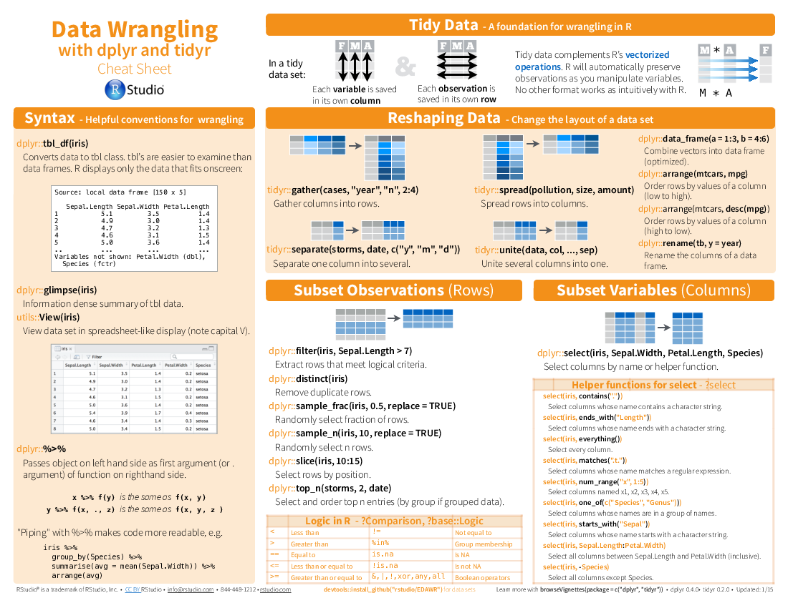 
```


```{r cheatsheets-04, fig.cap='[advancedr](figures/advancedr.pdf)', fig.align='center', echo=FALSE, out.width = '95%'}
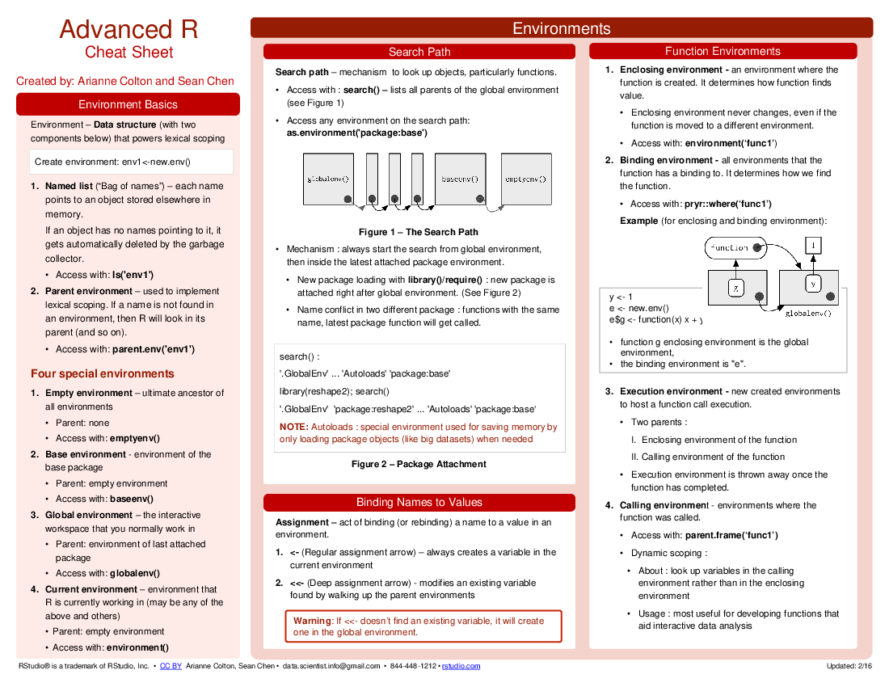
```

```{r cheatsheets-05, fig.cap='[base-r](figures/base-r.pdf)', fig.align='center', echo=FALSE, out.width = '95%'}
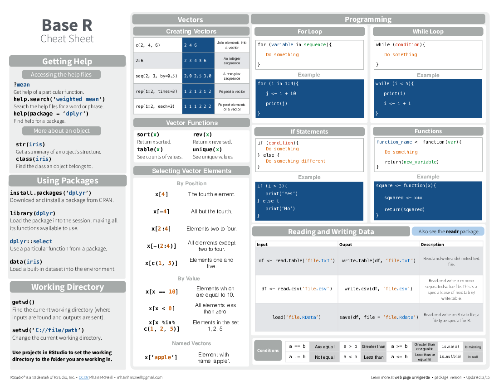
```

```{r cheatsheets-06, fig.cap='[data-import](figures/data-import.pdf)', fig.align='center', echo=FALSE, out.width = '95%'}
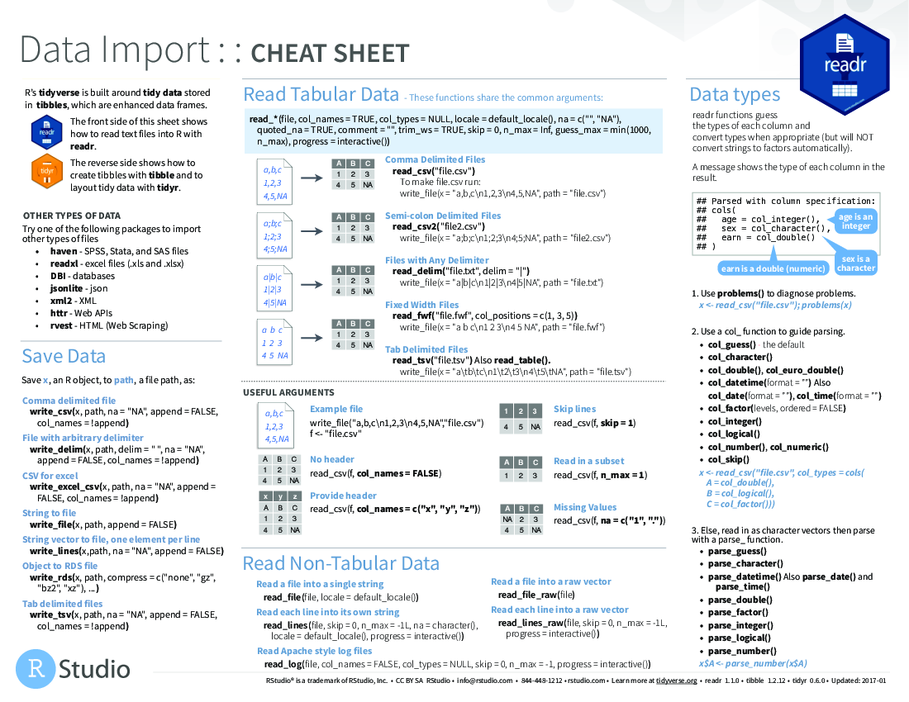
```

```{r cheatsheets-07, fig.cap='[data-transformation](figures/data-transformation.pdf)', fig.align='center', echo=FALSE, out.width = '95%'}
include_graphics('figures/data-transformation.png')
```

```{r cheatsheets-08, fig.cap='[data-visualization](figures/data-visualization.pdf)', fig.align='center', echo=FALSE, out.width = '95%'}
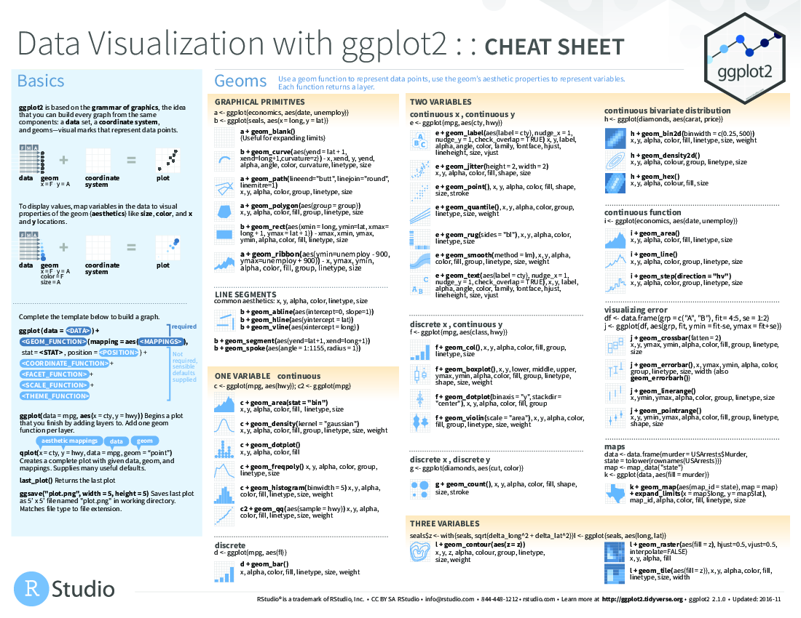
```

```{r cheatsheets-09, fig.cap='[how-big-is-your-graph](figures/how-big-is-your-graph.pdf)', fig.align='center', echo=FALSE, out.width = '95%'}
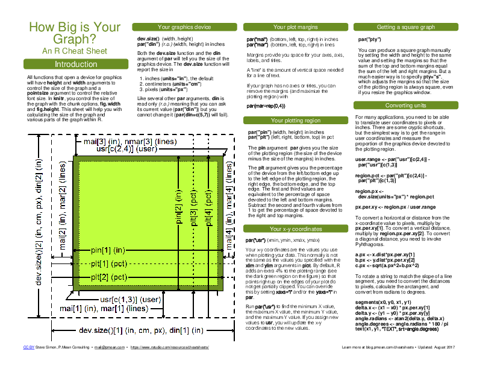
```

```{r cheatsheets-10, fig.cap='[latexsheet](figures/latexsheet.pdf)', fig.align='center', echo=FALSE, out.width = '95%'}
include_graphics('figures/latexsheet.png')
```

```{r cheatsheets-11, fig.cap='[leaflet](figures/leaflet.pdf)', fig.align='center', echo=FALSE, out.width = '95%'}
include_graphics('figures/leaflet.png')
```

```{r cheatsheets-12, fig.cap='[lubridate](figures/lubridate.pdf)', fig.align='center', echo=FALSE, out.width = '95%'}
include_graphics('figures/lubridate.png')
```

```{r cheatsheets-13, fig.cap='[mosaic](figures/mosaic.pdf)', fig.align='center', echo=FALSE, out.width = '95%'}
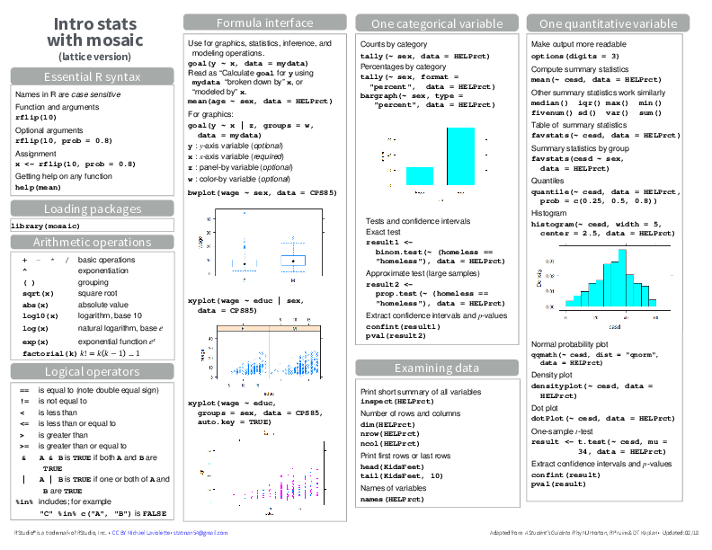
```

```{r cheatsheets-14, fig.cap='[purrr](figures/purrr.pdf)', fig.align='center', echo=FALSE, out.width = '95%'}
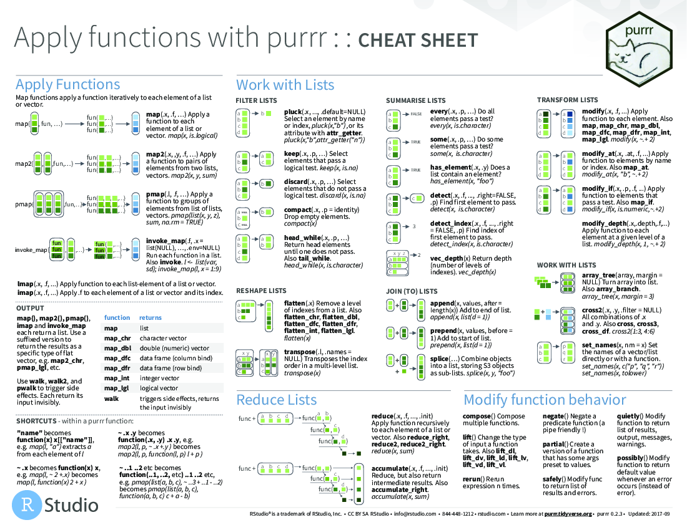
```

```{r cheatsheets-15, fig.cap='[regexcheatsheet](figures/regexcheatsheet.pdf)', fig.align='center', echo=FALSE, out.width = '95%'}
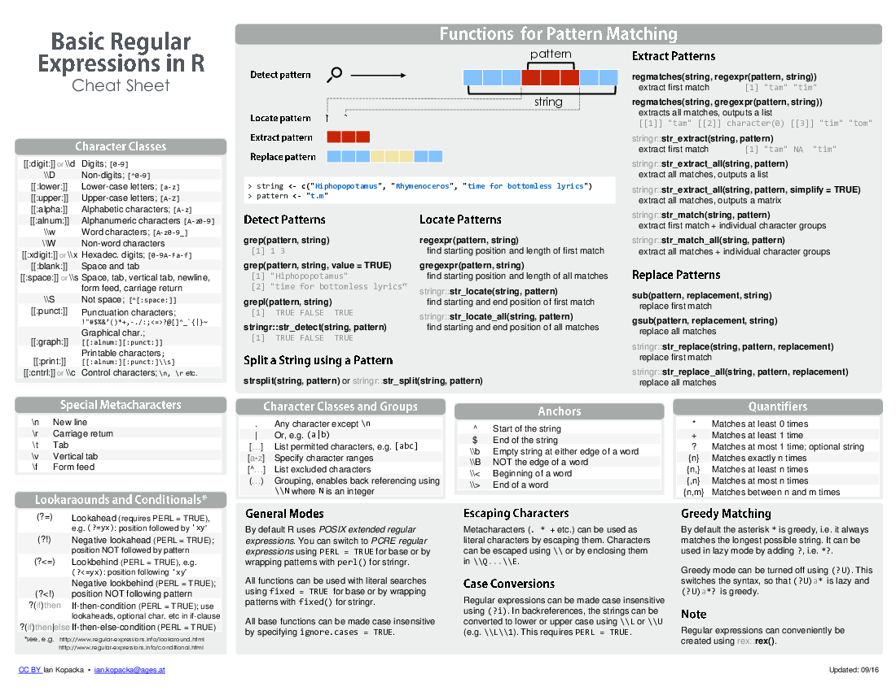
```

```{r cheatsheets-16, fig.cap='[rmarkdown-reference](figures/rmarkdown-reference.pdf)', fig.align='center', echo=FALSE, out.width = '95%'}
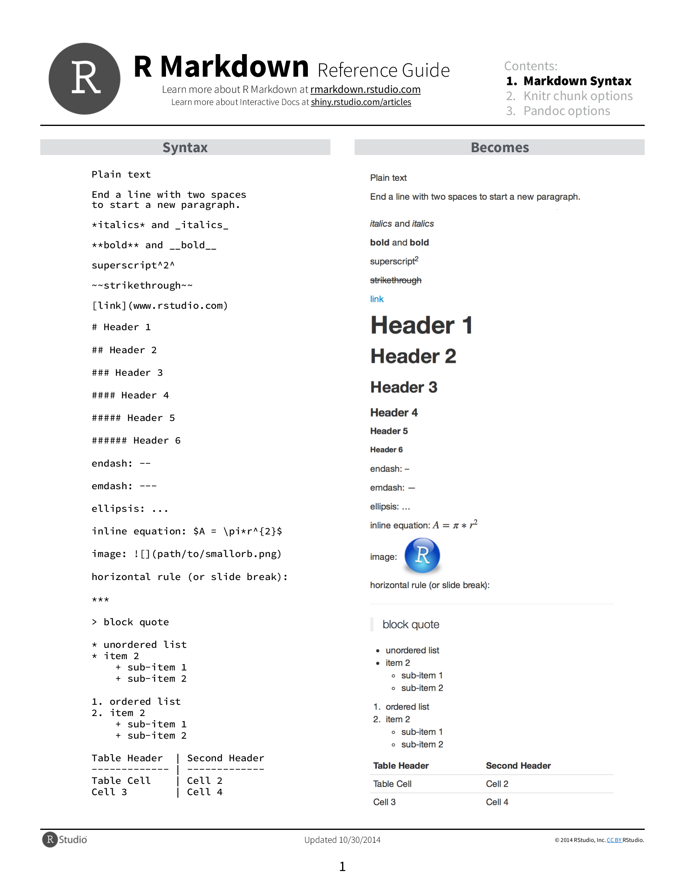
```

```{r cheatsheets-17, fig.cap='[rmarkdown](figures/rmarkdown.pdf)', fig.align='center', echo=FALSE, out.width = '95%'}
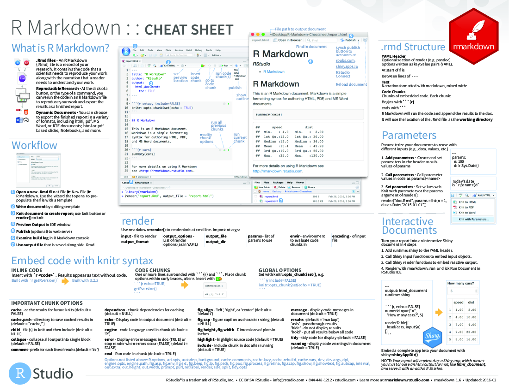
```

```{r cheatsheets-18, fig.cap='[rstudio-ide](figures/rstudio-ide.pdf)', fig.align='center', echo=FALSE, out.width = '95%'}
include_graphics('figures/rstudio-ide.png')
```

```{r cheatsheets-19, fig.cap='[shiny](figures/shiny.pdf)', fig.align='center', echo=FALSE, out.width = '95%'}
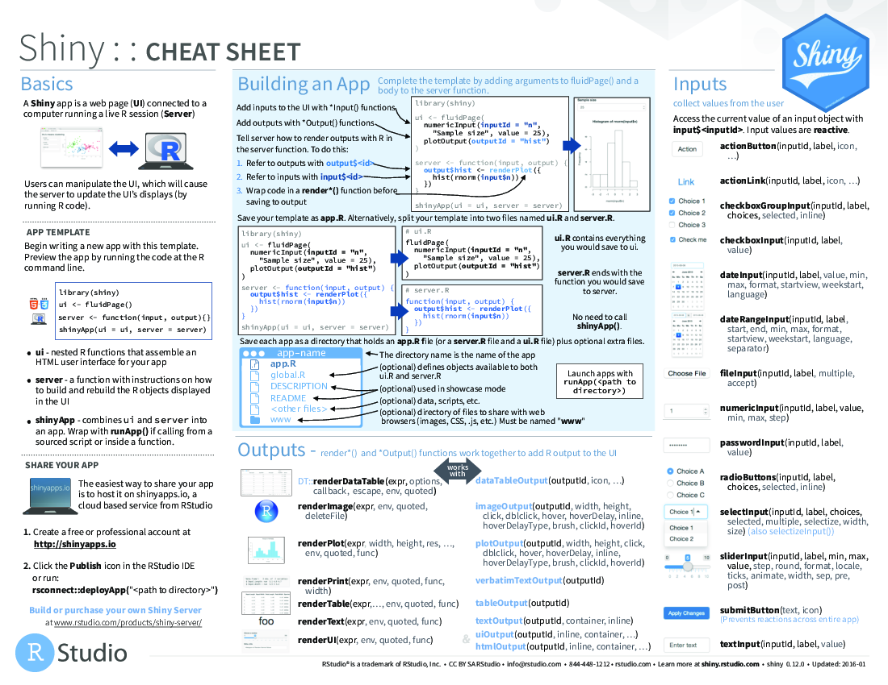
```

```{r cheatsheets-20, fig.cap='[strings](figures/strings.pdf)', fig.align='center', echo=FALSE, out.width = '95%'}
include_graphics('figures/strings.png')
```

```{r cheatsheets-21, fig.cap='[syntax](figures/syntax.pdf)', fig.align='center', echo=FALSE, out.width = '95%'}
include_graphics('figures/syntax.png')
```

```{r cheatsheets-22, fig.cap='[tidyeval](figures/tidyeval.pdf)', fig.align='center', echo=FALSE, out.width = '95%'}
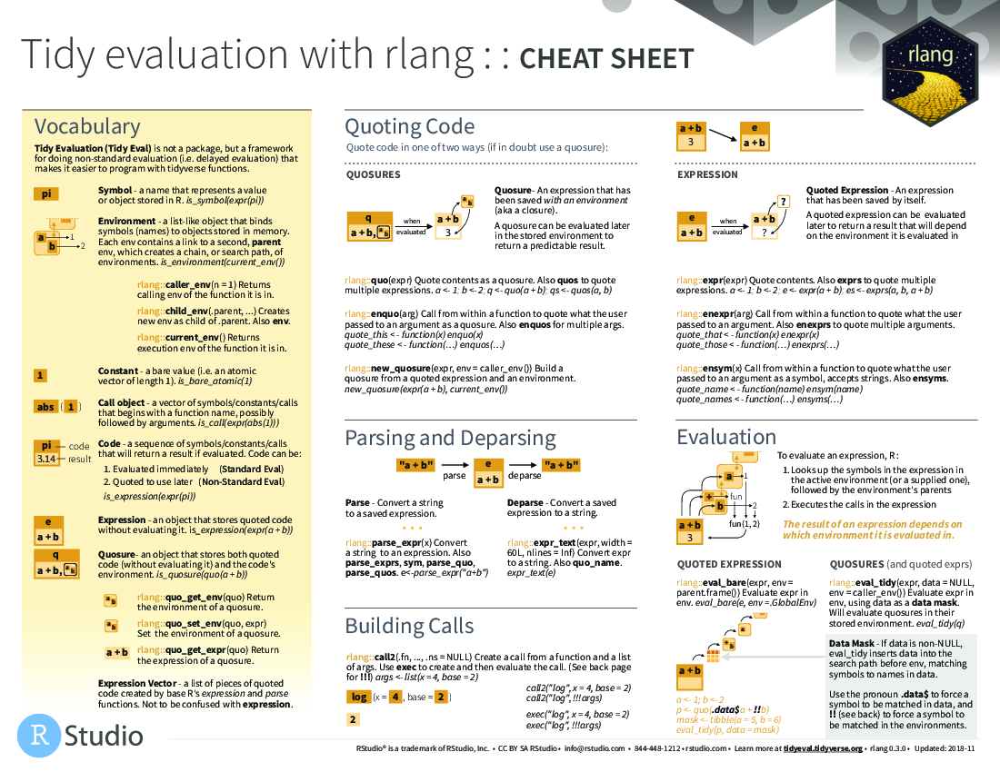
```

```{r cheatsheets-23, fig.cap='[visualization principles](figures/visualization-principles.pdf)', fig.align='center', echo=FALSE, out.width = '95%'}
include_graphics('figures/visualization-principles.png')
```


