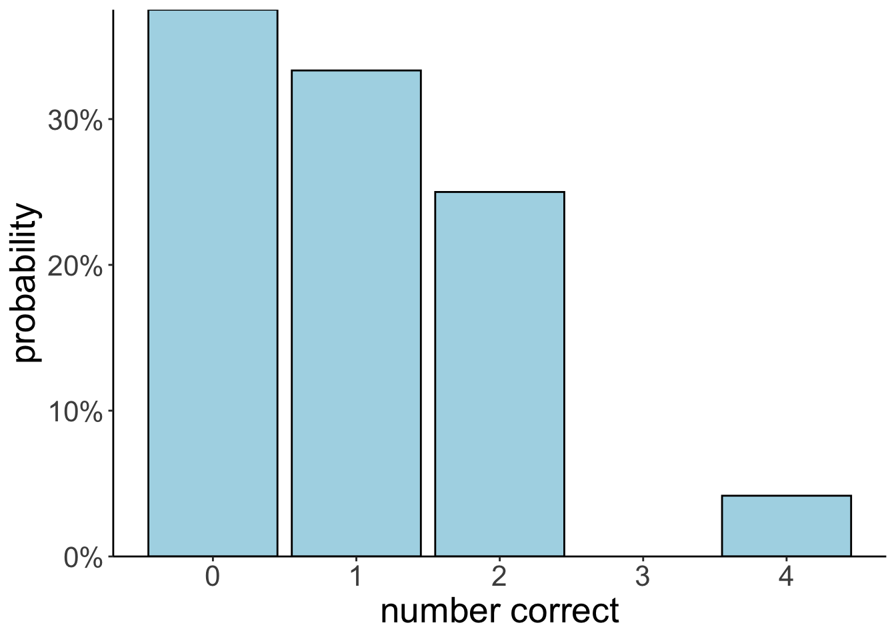
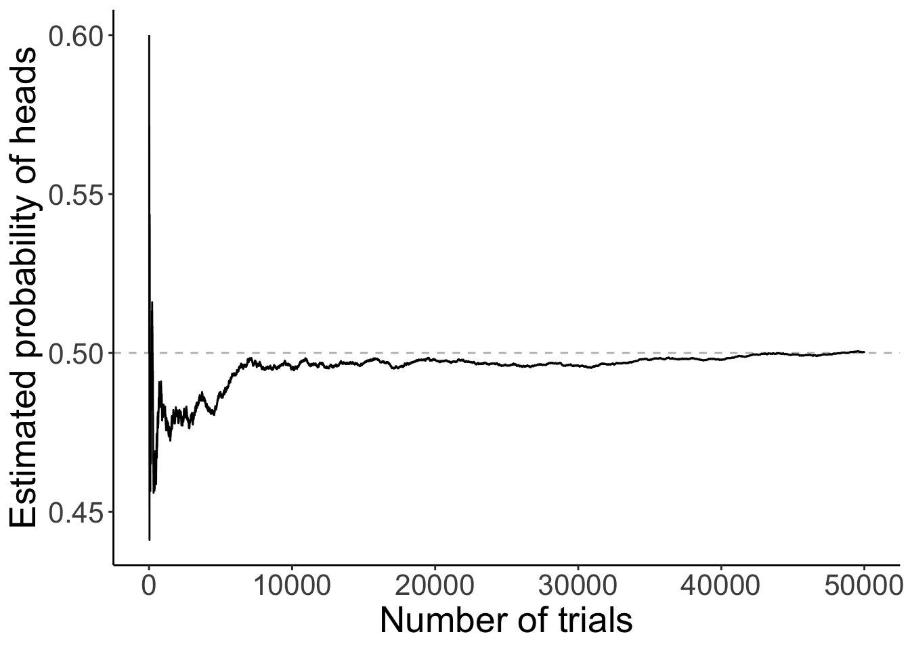

# Probability

## Load packages, load data, set theme

Let's load the packages that we need for this chapter. 


``` r
library("knitr")        # for rendering the RMarkdown file
library("kableExtra")   # for nicely formatted tables
library("arrangements") # fast generators and iterators for creating combinations
library("DiagrammeR")   # for drawing diagrams
library("tidyverse")    # for data wrangling 
```

Set the plotting theme.


``` r
theme_set(theme_classic() + 
            theme(text = element_text(size = 20)))

opts_chunk$set(comment = "",
               fig.show = "hold")
```


## Counting

Imagine that there are three balls in an urn. The balls are labeled 1, 2, and 3. Let's consider a few possible situations. 


``` r
balls = 1:3 # number of balls in urn 
ndraws = 2 # number of draws

# order matters, without replacement
permutations(balls, ndraws)
```

```
     [,1] [,2]
[1,]    1    2
[2,]    1    3
[3,]    2    1
[4,]    2    3
[5,]    3    1
[6,]    3    2
```

``` r
# order matters, with replacement
permutations(balls, ndraws, replace = T)
```

```
      [,1] [,2]
 [1,]    1    1
 [2,]    1    2
 [3,]    1    3
 [4,]    2    1
 [5,]    2    2
 [6,]    2    3
 [7,]    3    1
 [8,]    3    2
 [9,]    3    3
```

``` r
# order doesn't matter, with replacement 
combinations(balls, ndraws, replace = T)
```

```
     [,1] [,2]
[1,]    1    1
[2,]    1    2
[3,]    1    3
[4,]    2    2
[5,]    2    3
[6,]    3    3
```

``` r
# order doesn't matter, without replacement 
combinations(balls, ndraws)
```

```
     [,1] [,2]
[1,]    1    2
[2,]    1    3
[3,]    2    3
```

I've generated the figures below using the `DiagrammeR` package. It's a powerful package for drawing diagrams in R. See information on how to use the DiagrammeR package [here](https://rich-iannone.github.io/DiagrammeR/). 

<div class="figure">

```{=html}
<div class="grViz html-widget html-fill-item" id="htmlwidget-5e693f837d956a30a32d" style="width:672px;height:480px;"></div>
<script type="application/json" data-for="htmlwidget-5e693f837d956a30a32d">{"x":{"diagram":"\ndigraph dot{\n  \n  # general settings for all nodes\n  node [\n    shape = circle,\n    style = filled,\n    color = black,\n    label = \"\"\n    fontname = \"Helvetica\",\n    fontsize = 24,\n    fillcolor = lightblue\n    ]\n  \n  # edges between nodes\n  edge [color = black]\n  0 -> {1 2 3}\n  1 -> {11 12 13}\n  2 -> {21 22 23}\n  3 -> {31 32 33}\n  \n  # labels for each node\n  0 [fillcolor = \"black\", width = 0.1]\n  1 [label = \"1\"]\n  2 [label = \"2\"]\n  3 [label = \"3\"]\n  11 [label = \"1\"]\n  12 [label = \"2\"]\n  13 [label = \"3\"]\n  21 [label = \"1\"]\n  22 [label = \"2\"]\n  23 [label = \"3\"]\n  31 [label = \"1\"]\n  32 [label = \"2\"]\n  33 [label = \"3\"]\n    \n  # direction in which arrows are drawn (from left to right)\n  rankdir = LR\n}\n","config":{"engine":"dot","options":null}},"evals":[],"jsHooks":[]}</script>
```

<p class="caption">(\#fig:unnamed-chunk-4)Drawing two marbles out of an urn __with__ replacement.</p>
</div>

<div class="figure">

```{=html}
<div class="grViz html-widget html-fill-item" id="htmlwidget-f343e7ed6883bc8c319b" style="width:672px;height:480px;"></div>
<script type="application/json" data-for="htmlwidget-f343e7ed6883bc8c319b">{"x":{"diagram":"\ndigraph dot{\n  \n  # general settings for all nodes\n  node [\n    shape = circle,\n    style = filled,\n    color = black,\n    label = \"\"\n    fontname = \"Helvetica\",\n    fontsize = 24,\n    fillcolor = lightblue\n    ]\n  \n  # edges between nodes\n  edge [color = black]\n  0 -> {1 2 3}\n  1 -> {12 13}\n  2 -> {21 23}\n  3 -> {31 32}\n  \n  # labels for each node\n  0 [fillcolor = \"black\", width = 0.1]\n  1 [label = \"1\"]\n  2 [label = \"2\"]\n  3 [label = \"3\"]\n  12 [label = \"2\"]\n  13 [label = \"3\"]\n  21 [label = \"1\"]\n  23 [label = \"3\"]\n  31 [label = \"1\"]\n  32 [label = \"2\"]\n  \n  # direction in which arrows are drawn (from left to right)\n  rankdir = LR\n}\n","config":{"engine":"dot","options":null}},"evals":[],"jsHooks":[]}</script>
```

<p class="caption">(\#fig:unnamed-chunk-5)Drawing two marbles out of an urn __without__ replacement.</p>
</div>

## The random secretary

A secretary types four letters to four people and addresses the four envelopes. If he inserts the letters at random, each in a different envelope, what is the probability that exactly three letters will go into the right envelope?


``` r
df.letters = permutations(x = 1:4, k = 4) %>% 
  as_tibble(.name_repair = ~ str_c("person_", 1:4)) %>%
  mutate(n_correct = (person_1 == 1) + 
           (person_2 == 2) + 
           (person_3 == 3) +
           (person_4 == 4))

df.letters %>% 
  summarize(prob_3_correct = sum(n_correct == 3) / n())
```

```
# A tibble: 1 × 1
  prob_3_correct
           <dbl>
1              0
```


``` r
ggplot(data = df.letters,
       mapping = aes(x = n_correct)) + 
  geom_bar(aes(y = stat(count)/sum(count)),
           color = "black",
           fill = "lightblue") +
  scale_y_continuous(labels = scales::percent,
                     expand = c(0, 0)) + 
  labs(x = "number correct",
       y = "probability")
```

```
Warning: `stat(count)` was deprecated in ggplot2 3.4.0.
ℹ Please use `after_stat(count)` instead.
This warning is displayed once every 8 hours.
Call `lifecycle::last_lifecycle_warnings()` to see where this warning was generated.
```



## Flipping a coin many times


``` r
# Example taken from here: http://statsthinking21.org/probability.html#empirical-frequency

set.seed(1) # set the seed so that the outcome is consistent
nsamples = 50000 # how many flips do we want to make?

# create some random coin flips using the rbinom() function with
# a true probability of 0.5

df.samples = tibble(trial_number = seq(nsamples), 
                    outcomes = rbinom(nsamples, 1, 0.5)) %>% 
  mutate(mean_probability = cumsum(outcomes) / seq_along(outcomes)) %>% 
  filter(trial_number >= 10) # start with a minimum sample of 10 flips

ggplot(data = df.samples, 
       mapping = aes(x = trial_number, y = mean_probability)) +
  geom_hline(yintercept = 0.5, color = "gray", linetype = "dashed") +
  geom_line() +
  labs(x = "Number of trials",
       y = "Estimated probability of heads") +
  theme_classic() +
  theme(text = element_text(size = 20))
```

<div class="figure">

<p class="caption">(\#fig:unnamed-chunk-8)A demonstration of the law of large numbers.</p>
</div>

## Clue guide to probability


``` r
who = c("ms_scarlet", "col_mustard", "mrs_white",
        "mr_green", "mrs_peacock", "prof_plum")
what = c("candlestick", "knife", "lead_pipe",
         "revolver", "rope", "wrench")
where = c("study", "kitchen", "conservatory",
          "lounge", "billiard_room", "hall",
          "dining_room", "ballroom", "library")

df.clue = expand_grid(who = who,
                      what = what,
                      where = where)

df.suspects = df.clue %>% 
  distinct(who) %>% 
  mutate(gender = ifelse(test = who %in% c("ms_scarlet", "mrs_white", "mrs_peacock"), 
                         yes = "female", 
                         no = "male"))
```


``` r
df.suspects %>% 
  arrange(desc(gender)) %>% 
  kable() %>% 
  kable_styling("striped", full_width = F)
```

<table class="table table-striped" style="width: auto !important; margin-left: auto; margin-right: auto;">
 <thead>
  <tr>
   <th style="text-align:left;"> who </th>
   <th style="text-align:left;"> gender </th>
  </tr>
 </thead>
<tbody>
  <tr>
   <td style="text-align:left;"> col_mustard </td>
   <td style="text-align:left;"> male </td>
  </tr>
  <tr>
   <td style="text-align:left;"> mr_green </td>
   <td style="text-align:left;"> male </td>
  </tr>
  <tr>
   <td style="text-align:left;"> prof_plum </td>
   <td style="text-align:left;"> male </td>
  </tr>
  <tr>
   <td style="text-align:left;"> ms_scarlet </td>
   <td style="text-align:left;"> female </td>
  </tr>
  <tr>
   <td style="text-align:left;"> mrs_white </td>
   <td style="text-align:left;"> female </td>
  </tr>
  <tr>
   <td style="text-align:left;"> mrs_peacock </td>
   <td style="text-align:left;"> female </td>
  </tr>
</tbody>
</table>

### Conditional probability


``` r
# conditional probability (via rules of probability)
df.suspects %>% 
  summarize(p_prof_plum_given_male = 
              sum(gender == "male" & who == "prof_plum") /
              sum(gender == "male"))
```

```
# A tibble: 1 × 1
  p_prof_plum_given_male
                   <dbl>
1                  0.333
```

``` r
# conditional probability (via rejection)
df.suspects %>% 
  filter(gender == "male") %>% 
  summarize(p_prof_plum_given_male = 
              sum(who == "prof_plum") /
              n())
```

```
# A tibble: 1 × 1
  p_prof_plum_given_male
                   <dbl>
1                  0.333
```

### Law of total probability


```{=html}
<div class="grViz html-widget html-fill-item" id="htmlwidget-9c0bfedb2f3ea1905b2f" style="width:672px;height:480px;"></div>
<script type="application/json" data-for="htmlwidget-9c0bfedb2f3ea1905b2f">{"x":{"diagram":"\ndigraph dot{\n  \n  # general settings for all nodes\n  node [\n    shape = circle,\n    style = filled,\n    color = black,\n    label = \"\"\n    fontname = \"Helvetica\",\n    fontsize = 9,\n    fillcolor = lightblue,\n    fixedsize=true,\n    width = 0.8\n    ]\n  \n  # edges between nodes\n  edge [color = black,\n        fontname = \"Helvetica\",\n        fontsize = 10]\n  1 -> 2 [label = \"p(female)\"]\n  1 -> 3 [label = \"p(male)\"]\n  2 -> 4 [label = \"p(revolver | female)\"] \n  3 -> 4 [label = \"p(revolver | male)\"]\n  \n  \n\n  # labels for each node\n  1 [label = \"Gender?\"]\n  2 [label = \"If female\nuse revolver?\"]\n  3 [label = \"If male\nuse revolver?\"]\n  4 [label = \"Revolver\nused?\"]\n  \n  rankdir=\"LR\"\n  }","config":{"engine":"dot","options":null}},"evals":[],"jsHooks":[]}</script>
```

## Probability operations


``` r
# Make a deck of cards 
df.cards = tibble(suit = rep(c("Clubs", "Spades", "Hearts", "Diamonds"), each = 8),
                  value = rep(c("7", "8", "9", "10", "Jack", "Queen", "King", "Ace"), 4)) 
```


``` r
# conditional probability: p(Hearts | Queen) (via rules of probability)
df.cards %>% 
  summarize(p_hearts_given_queen = 
              sum(suit == "Hearts" & value == "Queen") / 
              sum(value == "Queen"))
```

```
# A tibble: 1 × 1
  p_hearts_given_queen
                 <dbl>
1                 0.25
```


``` r
# conditional probability: p(Hearts | Queen) (via rejection)
df.cards %>% 
  filter(value == "Queen") %>%
  summarize(p_hearts_given_queen = sum(suit == "Hearts")/n())
```

```
# A tibble: 1 × 1
  p_hearts_given_queen
                 <dbl>
1                 0.25
```

## Bayesian reasoning explained


```{=html}
<div class="grViz html-widget html-fill-item" id="htmlwidget-00d3798c08f9ecc067d7" style="width:672px;height:480px;"></div>
<script type="application/json" data-for="htmlwidget-00d3798c08f9ecc067d7">{"x":{"diagram":"\ndigraph dot{\n  \n  # general settings for all nodes\n  node [\n    shape = circle,\n    style = filled,\n    color = black,\n    label = \"\"\n    fontname = \"Helvetica\",\n    fontsize = 10,\n    fillcolor = lightblue,\n    fixedsize=true,\n    width = 0.8\n    ]\n  \n  # edges between nodes\n  edge [color = black,\n        fontname = \"Helvetica\",\n        fontsize = 10]\n  1 -> 2 [label = \"ill\"]\n  1 -> 3 [label = \"healthy\"]\n  2 -> 4 [label = \"test +\"] \n  2 -> 5 [label = \"test -\"]\n  3 -> 6 [label = \"test +\"]\n  3 -> 7 [label = \"test -\"]\n  \n\n  # labels for each node\n  1 [label = \"10000\npeople\"]\n  2 [label = \"100\"]\n  3 [label = \"9900\"]\n  4 [label = \"95\"]\n  5 [label = \"5\"]\n  6 [label = \"495\"]\n  7 [label = \"9405\"]\n  \n  rankdir=\"LR\"\n  }","config":{"engine":"dot","options":null}},"evals":[],"jsHooks":[]}</script>
```

## Getting Bayes right matters

### Bayesian reasoning example


``` r
# prior probability of the disease
p.D = 0.0001

# sensitivity of the test 
p.T_given_D = 0.999

# specificity of the test 
p.notT_given_notD = 0.999
p.T_given_notD = (1 - p.notT_given_notD)

# posterior given a positive test result 
p.D_given_T = (p.T_given_D * p.D) / ((p.T_given_D * p.D) + (p.T_given_notD * (1-p.D)))

p.D_given_T
```

```
[1] 0.0908347
```

### Bayesian reasoning example (COVID rapid test)

https://pubmed.ncbi.nlm.nih.gov/34242764/#:~:text=The%20overall%20sensitivity%20of%20the,%25%20CI%2024.4%2D65.1).


``` r
# prior probability of the disease
p.D = 0.1 

# sensitivity covid rapid test
p.T_given_D = 0.653

# specificity of covid rapid test
p.notT_given_notD = 0.999

p.T_given_notD = (1 - p.notT_given_notD)

# posterior given a positive test result 
p.D_given_T = (p.T_given_D * p.D) / ((p.T_given_D * p.D) + (p.T_given_notD * (1-p.D)))

# posterior given a negative test result 
p.D_given_notT = ((1-p.T_given_D) * p.D) / (((1-p.T_given_D) * p.D) + ((1-p.T_given_notD) * (1-p.D)))

str_c("Probability of COVID given a positive test: ", round(p.D_given_T * 100, 1), "%")
```

```
[1] "Probability of COVID given a positive test: 98.6%"
```

``` r
str_c("Probability of COVID given a negative test: ", round(p.D_given_notT * 100, 1), "%")
```

```
[1] "Probability of COVID given a negative test: 3.7%"
```

### Most people in the hospital are vaccinated


``` r
# probability of being vaccinated 
p.V = 0.8 

# likelihood of hospital 
p.H_given_V = 0.2
p.H_given_notV = 0.5

# posterior probability 
p.V_given_H = (p.H_given_V * p.V) / ((p.H_given_V * p.V) + (p.H_given_notV * (1-p.V)))

p.V_given_H
```

```
[1] 0.6153846
```

## Building a Bayesis

### Dice example


``` r
# prior
p.four = 0.5
p.six = 0.5

# possibilities 
df.possibilities = tibble(observation = 1:6,
                          p.four = c(rep(1/4, 4), rep(0, 2)),
                          p.six = c(rep(1/6, 6)))

# data
# data = c(4)
# data = c(4, 2, 1)
data = c(4, 2, 1, 3, 1)
# data = c(4, 2, 1, 3, 1, 5)

# likelihood
p.data_given_four = prod(df.possibilities$p.four[data])
p.data_given_six = prod(df.possibilities$p.six[data])

# posterior
p.four_given_data = (p.data_given_four * p.four) /  
  ((p.data_given_four * p.four) + 
     (p.data_given_six * p.six))

p.four_given_data
```

```
[1] 0.8836364
```

Given this data $d$ = [4, 2, 1, 3, 1], there is a 88% chance that the four sided die was rolled rather than the six sided die. 

## Additional resources

### Cheatsheets

- [Probability cheatsheet](figures/probability.pdf)

### Books and chapters

- [Probability and Statistics with examples using R](http://www.isibang.ac.in/~athreya/psweur/)
- [Learning statistics with R: Chapter 9 Introduction to probability](https://learningstatisticswithr-bookdown.netlify.com/probability.html#probstats)

### Misc

- [Bayes' theorem in three panels](https://www.tjmahr.com/bayes-theorem-in-three-panels/)
- [Statistics 110: Probability; course at Harvard](https://projects.iq.harvard.edu/stat110)  
- [Bayes theorem and making probability intuitive](https://www.youtube.com/watch?v=HZGCoVF3YvM&feature=youtu.be)

## Session info

Information about this R session including which version of R was used, and what packages were loaded. 


```
R version 4.4.2 (2024-10-31)
Platform: aarch64-apple-darwin20
Running under: macOS Sequoia 15.2

Matrix products: default
BLAS:   /Library/Frameworks/R.framework/Versions/4.4-arm64/Resources/lib/libRblas.0.dylib 
LAPACK: /Library/Frameworks/R.framework/Versions/4.4-arm64/Resources/lib/libRlapack.dylib;  LAPACK version 3.12.0

locale:
[1] en_US.UTF-8/en_US.UTF-8/en_US.UTF-8/C/en_US.UTF-8/en_US.UTF-8

time zone: America/Los_Angeles
tzcode source: internal

attached base packages:
[1] stats     graphics  grDevices utils     datasets  methods   base     

other attached packages:
 [1] lubridate_1.9.3    forcats_1.0.0      stringr_1.5.1      dplyr_1.1.4       
 [5] purrr_1.0.2        readr_2.1.5        tidyr_1.3.1        tibble_3.2.1      
 [9] ggplot2_3.5.1      tidyverse_2.0.0    DiagrammeR_1.0.11  arrangements_1.1.9
[13] kableExtra_1.4.0   knitr_1.49        

loaded via a namespace (and not attached):
 [1] gmp_0.7-4          sass_0.4.9         utf8_1.2.4         generics_0.1.3    
 [5] xml2_1.3.6         stringi_1.8.4      hms_1.1.3          digest_0.6.36     
 [9] magrittr_2.0.3     timechange_0.3.0   evaluate_0.24.0    grid_4.4.2        
[13] RColorBrewer_1.1-3 bookdown_0.42      fastmap_1.2.0      jsonlite_1.8.8    
[17] fansi_1.0.6        viridisLite_0.4.2  scales_1.3.0       jquerylib_0.1.4   
[21] cli_3.6.3          crayon_1.5.3       rlang_1.1.4        visNetwork_2.1.2  
[25] munsell_0.5.1      withr_3.0.2        cachem_1.1.0       yaml_2.3.10       
[29] tools_4.4.2        tzdb_0.4.0         colorspace_2.1-0   vctrs_0.6.5       
[33] R6_2.5.1           lifecycle_1.0.4    htmlwidgets_1.6.4  pkgconfig_2.0.3   
[37] bslib_0.7.0        pillar_1.9.0       gtable_0.3.5       glue_1.8.0        
[41] systemfonts_1.1.0  xfun_0.49          tidyselect_1.2.1   rstudioapi_0.16.0 
[45] farver_2.1.2       htmltools_0.5.8.1  labeling_0.4.3     rmarkdown_2.29    
[49] svglite_2.1.3      compiler_4.4.2    
```
