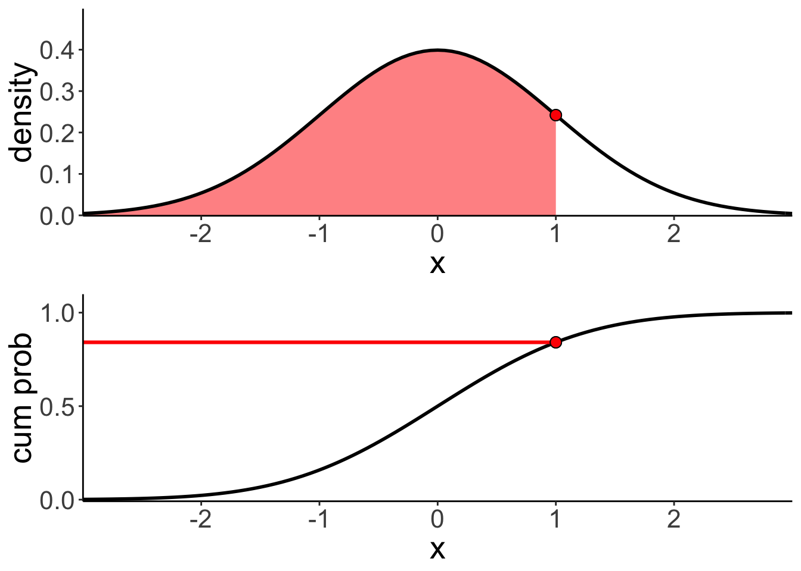
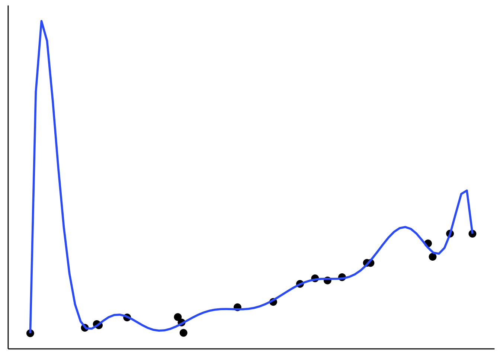

# Modeling data

## Load packages and set plotting theme  


```r
library("knitr")      # for knitting RMarkdown 
library("kableExtra") # for making nice tables
library("janitor")    # for cleaning column names
library("magrittr")   # for wrangling
library("patchwork")  # for making figure panels
library("tidyverse")  # for wrangling, plotting, etc. 
```


```r
theme_set(
  theme_classic() + #set the theme 
    theme(text = element_text(size = 20)) #set the default text size
)
```

## Things that came up in class 

### Calculating RMSE using `magrittr` verbs

Here is how we can calculate the root mean squared error using the pipe all the way through. Note that you have to load the `magrittr` package in order for this to work. 


```r
data = c(1, 3, 4, 2, 5)
prediction = c(1, 2, 2, 1, 4)

# calculate root mean squared error the pipe way 
rmse = prediction %>% 
  subtract(data) %>% 
  raise_to_power(2) %>% 
  mean() %>% 
  sqrt() %>% 
  print() 
```

```
## [1] 1.183216
```

### Relationship between probability and likelihood 


```r
margin = 1
point = 0

ggplot(data = tibble(x = c(-3, 3)),
            mapping = aes(x = x)) + 
  stat_function(fun = "dnorm",
                geom = "area", 
                xlim = c(point - margin, point + margin),
                fill = "red", 
                alpha = 0.5) + 
  stat_function(fun = "dnorm",
                size = 1) +
  labs(y = "density") +
  scale_x_continuous(breaks = -2:2,
                     expand = c(0, 0)) +
  scale_y_continuous(expand = expand_scale(add = c(0.001, 0.1)))
```

<div class="figure">

<p class="caption">(\#fig:modeling-04-likelihood1)Probability is the area under the curve of the density</p>
</div>


```r
point = 0
param_mean = 1
param_sd = 1

ggplot(data = tibble(x = c(-3, 3)),
       mapping = aes(x = x)) + 
  stat_function(fun = "dnorm",
                size = 1,
                args = list(mean = param_mean,
                            sd = param_sd)) +
  geom_segment(aes(
    x = point,
    y = 0,
    xend = point,
    yend = dnorm(point, mean = param_mean, sd = param_sd)),
    color = "red",
    size = 1
  ) +
  geom_segment(aes(
    x = -3, 
    y = dnorm(point, mean = param_mean, sd = param_sd),
    xend = point,
    yend = dnorm(point, mean = param_mean, sd = param_sd)),
    color = "red",
    size = 1) +
  geom_point(x = point,
             y = dnorm(point, mean = param_mean, sd = param_sd),
             shape = 21,
             fill = "red",
             size = 4) +
  labs(y = "density") +
  scale_x_continuous(breaks = -2:2,
                     expand = c(0, 0)) +
  scale_y_continuous(expand = expand_scale(add = c(0.001, 0.1)))
```

<div class="figure">

<p class="caption">(\#fig:modeling-05-likelihood2)Likelihood is a particular value.</p>
</div>


```r
point = 1

p1 = ggplot(data = tibble(x = c(-3, 3)),
            mapping = aes(x = x)) + 
  stat_function(fun = "dnorm",
                geom = "area", 
                xlim = c(-3, point),
                fill = "red", 
                alpha = 0.5) +
  stat_function(fun = "dnorm",
                size = 1) +
  geom_point(x = point,
             y = dnorm(point),
             shape = 21,
             fill = "red",
             size = 3) +
  labs(y = "density") +
  scale_x_continuous(breaks = -2:2,
                     expand = c(0, 0)) +
  scale_y_continuous(expand = expand_scale(add = c(0.001, 0.1)))

p2 = ggplot(data = tibble(x = c(-3, 3)),
            mapping = aes(x = x)) + 
  stat_function(fun = "pnorm",
                size = 1) + 
  geom_segment(mapping = aes(x = -3, 
                             y = pnorm(point),
                             xend = point,
                             yend = pnorm(point)),
               color = "red",
               size = 1) + 
  geom_point(x = point,
             y = pnorm(point),
             shape = 21,
             fill = "red",
             size = 3) +
  labs(y = "cum prob") +
  scale_x_continuous(breaks = -2:2,
                     expand = c(0, 0)) +
  scale_y_continuous(breaks = c(0, 0.5, 1),
                     expand = expand_scale(add = c(0.01, 0.1)))

p1 + p2 +
  plot_layout(ncol = 1)
```

<div class="figure">

<p class="caption">(\#fig:modeling-06-likelihood3)Relationship between density and cumulative probability distribution.</p>
</div>


```r
point = 0

p1 = ggplot(data = tibble(x = c(-3, 3)),
            mapping = aes(x = x)) + 
  geom_segment(mapping = aes(x = -3, 
                             y = dnorm(point),
                             xend = point,
                             yend = dnorm(point)),
               color = "red",
               size = 1) + 
  stat_function(fun = "dnorm",
                size = 1) +
  geom_point(x = point,
             y = dnorm(point),
             shape = 21,
             fill = "red",
             size = 3) +
  labs(y = "density") +
  scale_x_continuous(breaks = -2:2,
                     expand = c(0, 0)) +
  scale_y_continuous(expand = expand_scale(add = c(0.001, 0.1)))

p2 = ggplot(data = tibble(x = c(-3, 3)),
            mapping = aes(x = x)) + 
  stat_function(fun = "pnorm",
                size = 1) + 
  geom_abline(slope = dnorm(point),
              intercept = pnorm(point) - dnorm(point) * point,
              color = "red",
              size = 1) +
  geom_point(x = point,
             y = pnorm(point),
             shape = 21,
             fill = "red",
             size = 3) +
  labs(y = "cum prob") +
  scale_x_continuous(breaks = -2:2,
                     expand = c(0, 0)) +
  scale_y_continuous(breaks = c(0, 0.5, 1),
                     expand = expand_scale(add = c(0.01, 0.1)))

p1 + p2 +
  plot_layout(ncol = 1)
```

<div class="figure">

<p class="caption">(\#fig:modeling-07-likelihood4)The density is the first derivative of the cumulative probability distribution. The likelihood is the value of the slope in the cumulative probability distribution.</p>
</div>


```r
margin = 0.1
point_blue = -1
point_red = 0

ggplot(data = tibble(x = c(-3, 3)),
            mapping = aes(x = x)) + 
  stat_function(fun = "dnorm",
                geom = "area", 
                xlim = c(point_red - margin, point_red + margin),
                fill = "red", 
                alpha = 0.5) + 
  stat_function(fun = "dnorm",
                geom = "area", 
                xlim = c(point_blue - margin, point_blue + margin),
                fill = "blue", 
                alpha = 0.5) + 
  stat_function(fun = "dnorm",
                size = 1) +
  geom_segment(mapping = aes(x = -3, 
                             y = dnorm(point_red),
                             xend = point_red,
                             yend = dnorm(point_red)),
               color = "red",
               size = 1) +
  geom_segment(mapping = aes(x = -3, 
                             y = dnorm(point_blue),
                             xend = point_blue,
                             yend = dnorm(point_blue)),
               color = "blue",
               size = 1) + 
  geom_point(x = point_red,
             y = dnorm(point_red),
             shape = 21,
             fill = "red",
             size = 4) +
  geom_point(x = point_blue,
             y = dnorm(point_blue),
             shape = 21,
             fill = "blue",
             size = 4) +
  labs(y = "density") +
  scale_x_continuous(breaks = -2:2,
                     expand = c(0, 0)) +
  scale_y_continuous(expand = expand_scale(add = c(0.001, 0.1)))
```

<div class="figure">

<p class="caption">(\#fig:modeling-08-likelihood5)The relative likelihood of two observations is the same as the relative probability of two areas under the curve as the margin of these areas goes to 0.</p>
</div>

```r
(pnorm(point_red + margin) - pnorm(point_red - margin)) / 
  (pnorm(point_blue + margin) - pnorm(point_blue - margin)) 
```

```
## [1] 1.64598
```

```r
dnorm(point_red) / dnorm(point_blue)
```

```
## [1] 1.648721
```

## Modeling data 

### Simplicity vs. accuracy trade-off 


```r
# make example reproducible 
set.seed(1)

n_samples = 20 # sample size 
n_parameters = 15 # number of parameters in the polynomial regression

# generate data 
df.data = tibble(
  x = runif(n_samples, min = 0, max = 10), 
  y = 10 + 3 * x + 3 * x^2 + rnorm(n_samples, sd = 20)
)
 
# plot a fit to the data
ggplot(data = df.data,
       mapping = aes(x = x,
                     y = y)) +
  geom_point(size = 3) +
  # geom_hline(yintercept = mean(df.data$y), color = "blue") +
  geom_smooth(method = "lm", se = F,
              formula = y ~ poly(x, degree = n_parameters, raw = TRUE)) +
  theme(axis.ticks = element_blank(),
        axis.title = element_blank(),
        axis.text = element_blank())
```

<div class="figure">

<p class="caption">(\#fig:modeling-09)Tradeoff between fit and model simplicity.</p>
</div>


```r
# make example reproducible 
set.seed(1)
# n_samples = 20
n_samples = 3

df.pre = tibble(
  x = runif(n_samples, min = 0, max = 10), 
  y = 2 * x + rnorm(n_samples, sd = 1)
)

# plot a fit to the data
ggplot(data = df.pre,
       mapping = aes(x = x,
                     y = y)) +
  geom_point(size = 3) +
  # geom_hline(yintercept = mean(df.pre$y), color = "blue") +
  geom_smooth(method = "lm", se = F,
              formula = y ~ poly(x, 1, raw=TRUE)) +
  theme(axis.ticks = element_blank(),
        axis.title = element_blank(),
        axis.text = element_blank())
```

<div class="figure">

<p class="caption">(\#fig:modeling-10)Figure that I used to illustrate that fitting more data points with fewer parameter is more impressive.</p>
</div>

### Error definitions and best estimators

Let's start with some simple data:


```r
df.data = tibble(
  observation = 1:5,
  value = c(1, 3, 5, 9, 14)
)
```

And plot the data


```r
ggplot(data = df.data,
       mapping = aes(x = "1",
                     y = value)) + 
  geom_point(size = 3) + 
  scale_y_continuous(breaks = seq(0, 16, 2),
                     limits = c(0, 16)) +
  theme(panel.grid.major.y = element_line(color = "gray80", linetype = 2),
        axis.title.x = element_blank(),
        axis.text.x = element_blank(),
        text = element_text(size = 24))
```


This is what the sum of absolute errors looks like for a given `value_predicted`. 


```r
value_predicted = 7

df.data = df.data %>% 
  mutate(prediction = value_predicted,
         error_absolute = abs(prediction - value))

ggplot(data = df.data,
       mapping = aes(x = observation, 
                     y = value)) + 
  geom_segment(mapping = aes(x = observation,
                             xend = observation,
                             y = value_predicted,
                             yend = value
                             ),
               color = "blue",
               size = 1) +
  geom_line(data = tibble(x = c(1, 5),
                   y = value_predicted),
            mapping = aes(x = x,
                y = y),
            size = 1,
            color = "green") +
  geom_point(size = 4) +
  annotate(x = 1,
           y = 15.5,
           geom = "text",
           label = str_c("Prediction = ", value_predicted),
           size = 8,
           hjust = 0,
           vjust = 1,
           color = "green") +
  annotate(x = 1,
           y = 13.5,
           geom = "text",
           label = str_c("Sum of absolute errors = ", sum(df.data$error_absolute)),
           size = 8,
           hjust = 0,
           vjust = 1,
           color = "blue") +
  annotate(x = 5,
           y = value_predicted,
           geom = "text",
           label = parse(text = str_c("{hat(Y)","==b[0]}==", value_predicted)),
           hjust = -0.1,
           size = 8) +
  scale_x_continuous(breaks = df.data$observation,
                     labels = parse(text = str_c('e[',df.data$observation,']', "==", df.data$error_absolute)),
                     limits = c(1, 6)) +
  scale_y_continuous(breaks = seq(0, 16, 2),
                     limits = c(0, 16)) +
  theme(panel.grid.major.y = element_line(color = "gray80", linetype = 2),
        axis.title.x = element_blank(),
        text = element_text(size = 24))
```

<div class="figure">

<p class="caption">(\#fig:modeling-13)Sum of absolute errors.</p>
</div>

Play around with the code below to see how using (1) the sum of absolute errors, or (2) the sum of squared errors affects what estimate minimizes the error. 


```r
value_predicted = seq(0, 50, 0.1)
# value_predicted = seq(0, 10, 1)

df.data = tibble(
  observation = 1:5,
  value = c(1, 3, 5, 9, 140)
)

# function that calculates the sum absolute error
fun.sum_absolute_error = function(prediction){
  x = df.data$value
  sum_absolute_error = sum(abs(x-prediction))
  return(sum_absolute_error)
}

# function that calculates the sum squared error
fun.sum_squared_error = function(prediction){
  x = df.data$value
  sum_squared_error = sum((x-prediction)^2)
  return(sum_squared_error)
}

df.model = tibble(
  estimate = value_predicted,
  sum_absolute_error = map_dbl(value_predicted, fun.sum_absolute_error),
  sum_squared_error = map_dbl(value_predicted, fun.sum_squared_error)
)

ggplot(data = df.model,
       mapping = aes(x = estimate,
                     # y = sum_absolute_error)) +
                     y = sum_squared_error)) +
  geom_line(size = 1) +
  # labs(y = "Sum absolute error")
  labs(y = "Sum of squared errors")
```


<table class="table table-striped" style="width: auto !important; margin-left: auto; margin-right: auto;">
 <thead>
  <tr>
   <th style="text-align:left;"> Error definition </th>
   <th style="text-align:left;"> Best estimator </th>
  </tr>
 </thead>
<tbody>
  <tr>
   <td style="text-align:left;"> Count of errors </td>
   <td style="text-align:left;"> Mode = most frequent value </td>
  </tr>
  <tr>
   <td style="text-align:left;"> Sum of absolute errors </td>
   <td style="text-align:left;"> Median = middle observation of all values </td>
  </tr>
  <tr>
   <td style="text-align:left;"> Sum of squared errors </td>
   <td style="text-align:left;"> Mean = average of all values </td>
  </tr>
</tbody>
</table>


```r
mu = 0 
sigma = 1

mean = mu
median = mu
mode = mu

ggplot(data = tibble(x = c(-3, 3)),
            mapping = aes(x = x)) + 
  stat_function(fun = "dnorm",
                size = 1) +
  geom_segment(aes(x = median,
                   xend = median,
                   y = dnorm(median),
                   yend = 0),
               color = "green",
               size = 2) +
  geom_segment(aes(x = mode,
                   xend = mode,
                   y = dnorm(mode),
                   yend = 0),
               color = "red",
               size = 2) +
  geom_segment(aes(x = mean,
                   xend = mean,
                   y = dnorm(mean),
                   yend = 0),
               color = "blue",
               size = 2) +
  labs(y = "density") +
  scale_x_continuous(breaks = -2:2,
                     expand = c(0, 0)) +
  scale_y_continuous(expand = expand_scale(add = c(0.001, 0.1)))
```

<div class="figure">

<p class="caption">(\#fig:modeling-16)Mean, median, and mode on the normal distribution.</p>
</div>


```r
rate = 1 

mean = rate
median = rate * log(2)
mode = 0

ggplot(data = tibble(x = c(-0.1, 3)),
            mapping = aes(x = x)) + 
  stat_function(fun = "dexp",
                size = 1) +
  geom_segment(aes(x = median,
                   xend = median,
                   y = dexp(median),
                   yend = 0),
               color = "green",
               size = 2) +
  geom_segment(aes(x = mode,
                   xend = mode,
                   y = dexp(mode),
                   yend = 0),
               color = "red",
               size = 2) +
  geom_segment(aes(x = mean,
                   xend = mean,
                   y = dexp(mean),
                   yend = 0),
               color = "blue",
               size = 2) +
  labs(y = "density") +
  scale_x_continuous(breaks = 0:2,
                     expand = c(0, 0)) +
  scale_y_continuous(expand = expand_scale(add = c(0.001, 0.1)))
```

<div class="figure">

<p class="caption">(\#fig:modeling-17)Mean, median, and mode on the exponential distribution.</p>
</div>

### Sampling distributions for median and mean 


```r
# make example reproducible 
set.seed(1)

sample_size = 40 # size of each sample
sample_n = 1000 # number of samples 

# draw sample
fun.draw_sample = function(sample_size, distribution){
  x = 50 + rnorm(sample_size)
  return(x)
}

# generate many samples 
samples = replicate(n = sample_n,
                    fun.draw_sample(sample_size, df.population))

# set up a data frame with samples 
df.sampling_distribution = matrix(samples, ncol = sample_n) %>%
  as_tibble(.name_repair = "minimal") %>%
  set_names(str_c(1:ncol(.))) %>%
  gather("sample", "number") %>% 
  mutate(sample = as.numeric(sample)) %>% 
  group_by(sample) %>% 
  mutate(draw = 1:n()) %>% 
  select(sample, draw, number) %>% 
  ungroup()

# turn the data frame into long format and calculate the means of each sample
df.sampling_distribution_means = df.sampling_distribution %>% 
  group_by(sample) %>% 
  summarize(mean = mean(number),
            median = median(number)) %>% 
  ungroup() %>% 
  gather("index", "value", -sample)
```

And plot it: 


```r
# plot a histogram of the means with density overlaid 

ggplot(data = df.sampling_distribution_means,
       mapping = aes(x = value, color = index)) + 
  stat_density(bw = 0.1,
               size = 2,
               geom = "line") + 
  scale_y_continuous(expand = expand_scale(mult = c(0, 0.01)))
```


## Hypothesis testing: "One-sample t-test" 


```r
df.internet = read_table2(file = "data/internet_access.txt") %>% 
  clean_names()
```

```
## Parsed with column specification:
## cols(
##   State = col_character(),
##   Internet = col_double(),
##   College = col_double(),
##   Auto = col_double(),
##   Density = col_double()
## )
```


```r
df.internet %>% 
  mutate(i = 1:n()) %>% 
  select(i, internet, everything()) %>% 
  head(10) %>% 
  kable(digits = 1) %>% 
  kable_styling(bootstrap_options = "striped",
              full_width = F)
```

<table class="table table-striped" style="width: auto !important; margin-left: auto; margin-right: auto;">
 <thead>
  <tr>
   <th style="text-align:right;"> i </th>
   <th style="text-align:right;"> internet </th>
   <th style="text-align:left;"> state </th>
   <th style="text-align:right;"> college </th>
   <th style="text-align:right;"> auto </th>
   <th style="text-align:right;"> density </th>
  </tr>
 </thead>
<tbody>
  <tr>
   <td style="text-align:right;"> 1 </td>
   <td style="text-align:right;"> 79.0 </td>
   <td style="text-align:left;"> AK </td>
   <td style="text-align:right;"> 28.0 </td>
   <td style="text-align:right;"> 1.2 </td>
   <td style="text-align:right;"> 1.2 </td>
  </tr>
  <tr>
   <td style="text-align:right;"> 2 </td>
   <td style="text-align:right;"> 63.5 </td>
   <td style="text-align:left;"> AL </td>
   <td style="text-align:right;"> 23.5 </td>
   <td style="text-align:right;"> 1.3 </td>
   <td style="text-align:right;"> 94.4 </td>
  </tr>
  <tr>
   <td style="text-align:right;"> 3 </td>
   <td style="text-align:right;"> 60.9 </td>
   <td style="text-align:left;"> AR </td>
   <td style="text-align:right;"> 20.6 </td>
   <td style="text-align:right;"> 1.7 </td>
   <td style="text-align:right;"> 56.0 </td>
  </tr>
  <tr>
   <td style="text-align:right;"> 4 </td>
   <td style="text-align:right;"> 73.9 </td>
   <td style="text-align:left;"> AZ </td>
   <td style="text-align:right;"> 27.4 </td>
   <td style="text-align:right;"> 1.3 </td>
   <td style="text-align:right;"> 56.3 </td>
  </tr>
  <tr>
   <td style="text-align:right;"> 5 </td>
   <td style="text-align:right;"> 77.9 </td>
   <td style="text-align:left;"> CA </td>
   <td style="text-align:right;"> 31.0 </td>
   <td style="text-align:right;"> 0.8 </td>
   <td style="text-align:right;"> 239.1 </td>
  </tr>
  <tr>
   <td style="text-align:right;"> 6 </td>
   <td style="text-align:right;"> 79.4 </td>
   <td style="text-align:left;"> CO </td>
   <td style="text-align:right;"> 37.8 </td>
   <td style="text-align:right;"> 1.0 </td>
   <td style="text-align:right;"> 48.5 </td>
  </tr>
  <tr>
   <td style="text-align:right;"> 7 </td>
   <td style="text-align:right;"> 77.5 </td>
   <td style="text-align:left;"> CT </td>
   <td style="text-align:right;"> 37.2 </td>
   <td style="text-align:right;"> 1.0 </td>
   <td style="text-align:right;"> 738.1 </td>
  </tr>
  <tr>
   <td style="text-align:right;"> 8 </td>
   <td style="text-align:right;"> 74.5 </td>
   <td style="text-align:left;"> DE </td>
   <td style="text-align:right;"> 29.8 </td>
   <td style="text-align:right;"> 1.1 </td>
   <td style="text-align:right;"> 460.8 </td>
  </tr>
  <tr>
   <td style="text-align:right;"> 9 </td>
   <td style="text-align:right;"> 74.3 </td>
   <td style="text-align:left;"> FL </td>
   <td style="text-align:right;"> 27.2 </td>
   <td style="text-align:right;"> 1.2 </td>
   <td style="text-align:right;"> 350.6 </td>
  </tr>
  <tr>
   <td style="text-align:right;"> 10 </td>
   <td style="text-align:right;"> 72.2 </td>
   <td style="text-align:left;"> GA </td>
   <td style="text-align:right;"> 28.3 </td>
   <td style="text-align:right;"> 1.1 </td>
   <td style="text-align:right;"> 168.4 </td>
  </tr>
</tbody>
</table>


```r
# parameters per model 
pa = 1
pc = 0 

df.model = df.internet %>%
  select(internet, state) %>%
  mutate(i = 1:n(),
         compact_b = 75,
         augmented_b = mean(internet),
         compact_se = (internet - compact_b)^2,
         augmented_se = (internet - augmented_b)^2) %>%
  select(i, state, internet, contains("compact"), contains("augmented"))

df.model %>%
  summarize(augmented_sse = sum(augmented_se),
            compact_sse = sum(compact_se),
            pre = 1 - augmented_sse / compact_sse,
            f = (pre / (pa - pc)) / ((1 - pre) / (nrow(df.model) - pa)),
            p_value = 1 - pf(f, pa - pc, nrow(df.model) - 1),
            mean = mean(internet),
            sd = sd(internet)) %>%
  kable() %>%
  kable_styling(bootstrap_options = "striped",
                full_width = F)
```

<table class="table table-striped" style="width: auto !important; margin-left: auto; margin-right: auto;">
 <thead>
  <tr>
   <th style="text-align:right;"> augmented_sse </th>
   <th style="text-align:right;"> compact_sse </th>
   <th style="text-align:right;"> pre </th>
   <th style="text-align:right;"> f </th>
   <th style="text-align:right;"> p_value </th>
   <th style="text-align:right;"> mean </th>
   <th style="text-align:right;"> sd </th>
  </tr>
 </thead>
<tbody>
  <tr>
   <td style="text-align:right;"> 1355.028 </td>
   <td style="text-align:right;"> 1595.71 </td>
   <td style="text-align:right;"> 0.1508305 </td>
   <td style="text-align:right;"> 8.703441 </td>
   <td style="text-align:right;"> 0.0048592 </td>
   <td style="text-align:right;"> 72.806 </td>
   <td style="text-align:right;"> 5.258673 </td>
  </tr>
</tbody>
</table>


```r
df1 = 1
df2 = 49

ggplot(data = tibble(x = c(0, 10)),
       mapping = aes(x = x)) + 
  # stat_function(fun = "df",
  #               geom = "area",
  #               fill = "red",
  #               alpha = 0.5,
  #               args = list(df1 = df1,
  #                           df2 = df2),
  #               size = 1,
  #               xlim = c(qf(0.95, df1 = df1, df2 = df2), 10)
  #               ) + 
  stat_function(fun = "df",
                args = list(df1 = df1,
                            df2 = df2),
                size = 0.5) + 
  scale_y_continuous(expand = expand_scale(add = c(0.001, 0.1))) +
  labs(y = "density")
```

<div class="figure">

<p class="caption">(\#fig:modeling-23)The F distribution</p>
</div>

We've implemented a one sample t-test (compare the p-value here to the one I computed above using PRE and the F statistic).


```r
t.test(df.internet$internet, mu = 75)
```

```
## 
## 	One Sample t-test
## 
## data:  df.internet$internet
## t = -2.9502, df = 49, p-value = 0.004859
## alternative hypothesis: true mean is not equal to 75
## 95 percent confidence interval:
##  71.3115 74.3005
## sample estimates:
## mean of x 
##    72.806
```

## Additional resources 

### Reading 

- Judd, C. M., McClelland, G. H., & Ryan, C. S. (2011). Data analysis: A model comparison approach. Routledge. --> Chapters 1--4

### Datacamp 

- [Foundations of Inference](https://www.datacamp.com/courses/foundations-of-inference)
