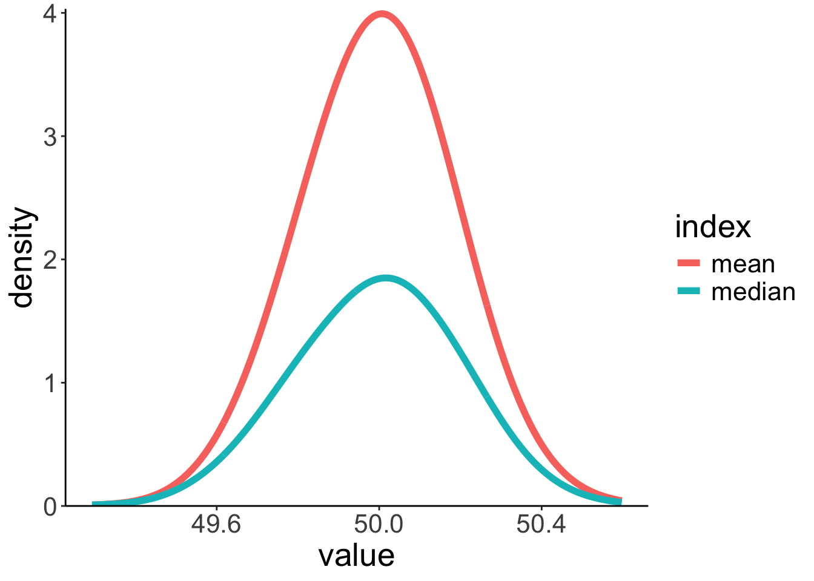
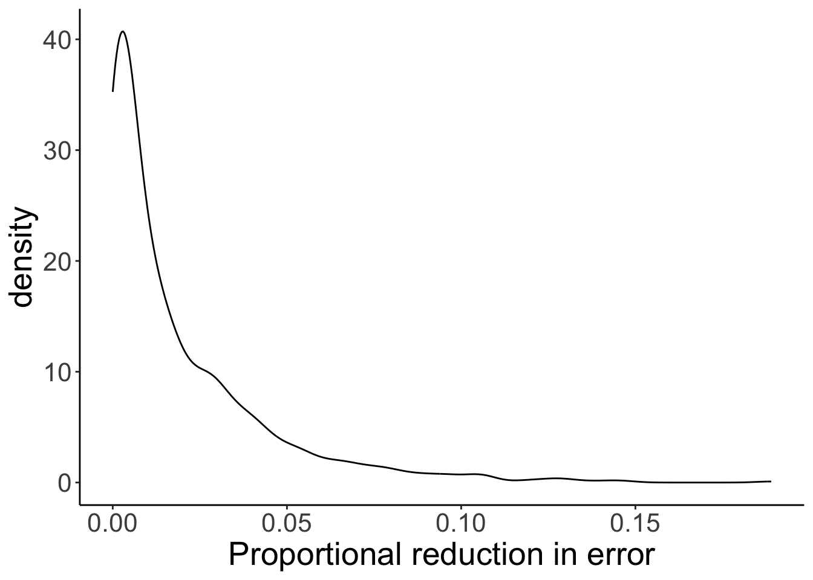

# Modeling data

## Load packages and set plotting theme


``` r
library("knitr")      # for knitting RMarkdown 
library("kableExtra") # for making nice tables
library("janitor")    # for cleaning column names
library("tidyverse")  # for wrangling, plotting, etc. 
```


``` r
theme_set(theme_classic() + #set the theme 
            theme(text = element_text(size = 20))) #set the default text size

opts_chunk$set(comment = "",
               fig.show = "hold")
```

## Modeling data

### Simplicity vs. accuracy trade-off


``` r
# make example reproducible 
set.seed(1)

n_samples = 20 # sample size 
n_parameters = 2 # number of parameters in the polynomial regression

# generate data 
df.data = tibble(x = runif(n_samples, min = 0, max = 10), 
                 y = 10 + 3 * x + 3 * x^2 + rnorm(n_samples, sd = 20))
 
# plot a fit to the data
ggplot(data = df.data,
       mapping = aes(x = x,
                     y = y)) +
  geom_point(size = 3) +
  # geom_hline(yintercept = mean(df.data$y), color = "blue") +
  geom_smooth(method = "lm", se = F,
              formula = y ~ poly(x, degree = n_parameters, raw = TRUE)) +
  theme(axis.ticks = element_blank(),
        axis.title = element_blank(),
        axis.text = element_blank())
```

<div class="figure">

<p class="caption">(\#fig:unnamed-chunk-3)Tradeoff between fit and model simplicity.</p>
</div>


``` r
# make example reproducible 
set.seed(1)
# n_samples = 20
n_samples = 3

df.pre = tibble(x = runif(n_samples, min = 0, max = 10), 
                y = 2 * x + rnorm(n_samples, sd = 1))

# plot a fit to the data
ggplot(data = df.pre,
       mapping = aes(x = x,
                     y = y)) +
  geom_point(size = 3) +
  # geom_hline(yintercept = mean(df.pre$y), color = "blue") +
  geom_smooth(method = "lm", se = F,
              formula = y ~ poly(x, 1, raw = TRUE)) +
  theme(axis.ticks = element_blank(),
        axis.title = element_blank(),
        axis.text = element_blank())
```

<div class="figure">

<p class="caption">(\#fig:unnamed-chunk-4)Figure that I used to illustrate that fitting more data points with fewer parameter is more impressive.</p>
</div>

### Sampling distributions for median and mean


``` r
# make example reproducible 
set.seed(1)

sample_size = 40 # size of each sample
sample_n = 1000 # number of samples 

# draw sample
fun.draw_sample = function(sample_size, distribution){
  x = 50 + rnorm(sample_size)
  return(x)
}

# generate many samples 
samples = replicate(n = sample_n,
                    fun.draw_sample(sample_size, df.population))

# set up a data frame with samples 
df.sampling_distribution = matrix(samples, ncol = sample_n) %>%
  as_tibble(.name_repair = ~ str_c(1:sample_n)) %>%
  pivot_longer(cols = everything(),
               names_to = "sample",
               values_to = "number") %>% 
  mutate(sample = as.numeric(sample)) %>% 
  group_by(sample) %>% 
  mutate(draw = 1:n()) %>% 
  select(sample, draw, number) %>% 
  ungroup()

# turn the data frame into long format and calculate the mean and median of each sample
df.sampling_distribution_summaries = df.sampling_distribution %>% 
  group_by(sample) %>% 
  summarize(mean = mean(number),
            median = median(number)) %>% 
  ungroup() %>% 
  pivot_longer(cols = -sample,
               names_to = "index",
               values_to = "value")
```

And plot it: 


``` r
# plot a histogram of the means with density overlaid 

ggplot(data = df.sampling_distribution_summaries,
       mapping = aes(x = value, color = index)) + 
  stat_density(bw = 0.1,
               size = 2,
               geom = "line") + 
  scale_y_continuous(expand = expansion(mult = c(0, 0.01)))
```

```
Warning: Using `size` aesthetic for lines was deprecated in ggplot2 3.4.0.
ℹ Please use `linewidth` instead.
This warning is displayed once every 8 hours.
Call `lifecycle::last_lifecycle_warnings()` to see where this warning was generated.
```



### Residuals need to be normally distributed, not the data itself


``` r
set.seed(1)

n_participants = 1000

df.normal = tibble(participant = 1:n_participants,
                   condition = rep(c("control", "experimental"),
                                   each = n_participants/2)) %>% 
  mutate(score = ifelse(condition == "control",
                        rnorm(n = n_participants/2, mean = 5, sd = 2),
                        rnorm(n = n_participants/2, mean = 15, sd = 3)))

# distribution of the data 
ggplot(data = df.normal,
       mapping = aes(x = score)) + 
  geom_density() +
  geom_density(mapping = aes(group = condition,
                             color = condition))
  

# distribution of the residuals after having fitted a linear model 
# we'll learn how to do this later   

fit = lm(formula = score ~ 1 + condition,
         data = df.normal)


ggplot(data = tibble(residuals = fit$residuals),
                     mapping = aes(x = residuals)) + 
  geom_density()
```


## Hypothesis testing: "One-sample t-test"


``` r
df.internet = read_table2(file = "data/internet_access.txt") %>% 
  clean_names()
```

```

── Column specification ────────────────────────────────────────────────────────────────────────────────────────────────────────────────────────────────────────────────────────────────────────────────────────────────────────────────────
cols(
  State = col_character(),
  Internet = col_double(),
  College = col_double(),
  Auto = col_double(),
  Density = col_double()
)
```


``` r
df.internet %>% 
  mutate(i = 1:n()) %>% 
  select(i, internet, everything()) %>% 
  head(10) %>% 
  kable(digits = 1) %>% 
  kable_styling(bootstrap_options = "striped",
              full_width = F)
```

<table class="table table-striped" style="width: auto !important; margin-left: auto; margin-right: auto;">
 <thead>
  <tr>
   <th style="text-align:right;"> i </th>
   <th style="text-align:right;"> internet </th>
   <th style="text-align:left;"> state </th>
   <th style="text-align:right;"> college </th>
   <th style="text-align:right;"> auto </th>
   <th style="text-align:right;"> density </th>
  </tr>
 </thead>
<tbody>
  <tr>
   <td style="text-align:right;"> 1 </td>
   <td style="text-align:right;"> 79.0 </td>
   <td style="text-align:left;"> AK </td>
   <td style="text-align:right;"> 28.0 </td>
   <td style="text-align:right;"> 1.2 </td>
   <td style="text-align:right;"> 1.2 </td>
  </tr>
  <tr>
   <td style="text-align:right;"> 2 </td>
   <td style="text-align:right;"> 63.5 </td>
   <td style="text-align:left;"> AL </td>
   <td style="text-align:right;"> 23.5 </td>
   <td style="text-align:right;"> 1.3 </td>
   <td style="text-align:right;"> 94.4 </td>
  </tr>
  <tr>
   <td style="text-align:right;"> 3 </td>
   <td style="text-align:right;"> 60.9 </td>
   <td style="text-align:left;"> AR </td>
   <td style="text-align:right;"> 20.6 </td>
   <td style="text-align:right;"> 1.7 </td>
   <td style="text-align:right;"> 56.0 </td>
  </tr>
  <tr>
   <td style="text-align:right;"> 4 </td>
   <td style="text-align:right;"> 73.9 </td>
   <td style="text-align:left;"> AZ </td>
   <td style="text-align:right;"> 27.4 </td>
   <td style="text-align:right;"> 1.3 </td>
   <td style="text-align:right;"> 56.3 </td>
  </tr>
  <tr>
   <td style="text-align:right;"> 5 </td>
   <td style="text-align:right;"> 77.9 </td>
   <td style="text-align:left;"> CA </td>
   <td style="text-align:right;"> 31.0 </td>
   <td style="text-align:right;"> 0.8 </td>
   <td style="text-align:right;"> 239.1 </td>
  </tr>
  <tr>
   <td style="text-align:right;"> 6 </td>
   <td style="text-align:right;"> 79.4 </td>
   <td style="text-align:left;"> CO </td>
   <td style="text-align:right;"> 37.8 </td>
   <td style="text-align:right;"> 1.0 </td>
   <td style="text-align:right;"> 48.5 </td>
  </tr>
  <tr>
   <td style="text-align:right;"> 7 </td>
   <td style="text-align:right;"> 77.5 </td>
   <td style="text-align:left;"> CT </td>
   <td style="text-align:right;"> 37.2 </td>
   <td style="text-align:right;"> 1.0 </td>
   <td style="text-align:right;"> 738.1 </td>
  </tr>
  <tr>
   <td style="text-align:right;"> 8 </td>
   <td style="text-align:right;"> 74.5 </td>
   <td style="text-align:left;"> DE </td>
   <td style="text-align:right;"> 29.8 </td>
   <td style="text-align:right;"> 1.1 </td>
   <td style="text-align:right;"> 460.8 </td>
  </tr>
  <tr>
   <td style="text-align:right;"> 9 </td>
   <td style="text-align:right;"> 74.3 </td>
   <td style="text-align:left;"> FL </td>
   <td style="text-align:right;"> 27.2 </td>
   <td style="text-align:right;"> 1.2 </td>
   <td style="text-align:right;"> 350.6 </td>
  </tr>
  <tr>
   <td style="text-align:right;"> 10 </td>
   <td style="text-align:right;"> 72.2 </td>
   <td style="text-align:left;"> GA </td>
   <td style="text-align:right;"> 28.3 </td>
   <td style="text-align:right;"> 1.1 </td>
   <td style="text-align:right;"> 168.4 </td>
  </tr>
</tbody>
</table>


``` r
# parameters per model 
pa = 1
pc = 0 

df.model = df.internet %>%
  select(internet, state) %>% 
  mutate(i = 1:n(),
         compact_b = 75,
         augmented_b = mean(internet),
         compact_se = (internet-compact_b)^2,
         augmented_se = (internet-augmented_b)^2) %>% 
  select(i, state, internet, contains("compact"), contains("augmented"))
  
df.model %>% 
  summarize(augmented_sse = sum(augmented_se),
            compact_sse = sum(compact_se),
            pre = 1 - augmented_sse/compact_sse,
            f = (pre/(pa-pc))/((1-pre)/(nrow(df.model)-pa)),
            p_value = 1-pf(f, pa-pc, nrow(df.model)-1),
            mean = mean(internet),
            sd = sd(internet)) %>% 
              kable() %>% 
              kable_styling(bootstrap_options = "striped",
                          full_width = F)
```

<table class="table table-striped" style="width: auto !important; margin-left: auto; margin-right: auto;">
 <thead>
  <tr>
   <th style="text-align:right;"> augmented_sse </th>
   <th style="text-align:right;"> compact_sse </th>
   <th style="text-align:right;"> pre </th>
   <th style="text-align:right;"> f </th>
   <th style="text-align:right;"> p_value </th>
   <th style="text-align:right;"> mean </th>
   <th style="text-align:right;"> sd </th>
  </tr>
 </thead>
<tbody>
  <tr>
   <td style="text-align:right;"> 1355.028 </td>
   <td style="text-align:right;"> 1595.71 </td>
   <td style="text-align:right;"> 0.1508305 </td>
   <td style="text-align:right;"> 8.703441 </td>
   <td style="text-align:right;"> 0.0048592 </td>
   <td style="text-align:right;"> 72.806 </td>
   <td style="text-align:right;"> 5.258673 </td>
  </tr>
</tbody>
</table>


``` r
df1 = 1
df2 = 49

ggplot(data = tibble(x = c(0, 10)),
       mapping = aes(x = x)) + 
  stat_function(fun = df,
                geom = "area",
                fill = "red",
                alpha = 0.5,
                args = list(df1 = df1,
                            df2 = df2),
                size = 1,
                xlim = c(qf(0.95, df1 = df1, df2 = df2), 10)) +
  stat_function(fun = ~ df(x = .,
                           df1 = df1,
                           df2 = df2),
                size = 0.5) + 
  scale_y_continuous(expand = expansion(add = c(0.001, 0.1))) +
  labs(y = "Density",
       x = "Proportional reduction in error")
```

<div class="figure">

<p class="caption">(\#fig:unnamed-chunk-11)F-distribution</p>
</div>

We've implemented a one sample t-test (compare the p-value here to the one I computed above using PRE and the F statistic).


``` r
t.test(df.internet$internet, mu = 75)
```

```

	One Sample t-test

data:  df.internet$internet
t = -2.9502, df = 49, p-value = 0.004859
alternative hypothesis: true mean is not equal to 75
95 percent confidence interval:
 71.3115 74.3005
sample estimates:
mean of x 
   72.806 
```

## Building a sampling distribution of PRE

Here is the general procedure for building a sampling distribution of the proportional reduction in error (PRE). In this instance, I compare the following two models 

- Model C (compact): $Y_i = 75 + \epsilon_i$
- Model A (augmented): $Y_i = \overline Y + \epsilon_i$

whereby I assume that $\epsilon_i \sim \mathcal{N}(0, \sigma)$.

For this example, I assume that I know the population distribution. I first draw a sample from that distribution, and then calculate PRE. 


``` r
# make example reproducible
set.seed(1)

# set the sample size 
sample_size = 50 

# draw sample from the population distribution (I've fixed sigma -- the standard deviation
# of the population distribution to be 5)
df.sample = tibble(observation = 1:sample_size,
                   value = 75 + rnorm(sample_size, mean = 0, sd = 5))

# calculate SSE for each model, and then PRE based on that 
df.summary = df.sample %>% 
  mutate(compact = 75,
         augmented = mean(value)) %>% 
  summarize(sse_compact = sum((value - compact)^2),
            sse_augmented = sum((value - augmented)^2),
            pre = 1 - (sse_augmented/sse_compact))
```

To generate the sampling distribution, I assume that the null hypothesis is true, and then take a look at what values for PRE we could expect by chance for our given sample size. 


``` r
# simulation parameters
n_samples = 1000
sample_size = 50 
mu = 75 # true mean of the distribution 
sigma = 5 # true standard deviation of the errors 

# function to draw samples from the population distribution 
fun.draw_sample = function(sample_size, mu, sigma){
  sample = mu + rnorm(sample_size,
                      mean = 0,
                      sd = sigma)
  return(sample)
}

# draw samples
samples = n_samples %>% 
  replicate(fun.draw_sample(sample_size, mu, sigma)) %>% 
  t() # transpose the resulting matrix (i.e. flip rows and columns)

# put samples in data frame and compute PRE 
df.samples = samples %>% 
  as_tibble(.name_repair = ~ str_c(1:ncol(samples))) %>% 
  mutate(sample = 1:n()) %>% 
  pivot_longer(cols = -sample,
               names_to = "index",
               values_to = "value") %>% 
  mutate(compact = mu) %>% 
  group_by(sample) %>% 
  mutate(augmented = mean(value)) %>% 
  summarize(sse_compact = sum((value - compact)^2),
            sse_augmented = sum((value - augmented)^2),
            pre = 1 - sse_augmented/sse_compact)
            

# plot the sampling distribution for PRE 
ggplot(data = df.samples,
       mapping = aes(x = pre)) +
  stat_density(geom = "line") + 
  labs(x = "Proportional reduction in error")

# calculate the p-value for our sample 
df.samples %>% 
  summarize(p_value = sum(pre >= df.summary$pre)/n())
```

```
# A tibble: 1 × 1
  p_value
    <dbl>
1   0.394
```



Some code I wrote to show a subset of the samples. 


``` r
samples %>% 
  as_tibble(.name_repair = "unique") %>% 
  mutate(sample = 1:n()) %>% 
  pivot_longer(cols = -sample,
               names_to = "index",
               values_to = "value") %>% 
  mutate(compact = mu) %>% 
  group_by(sample) %>% 
  mutate(augmented = mean(value)) %>% 
  ungroup() %>% 
  mutate(index = str_extract(index, pattern = "\\-*\\d+\\.*\\d*"),
         index = as.numeric(index)) %>% 
  filter(index < 6) %>% 
  arrange(sample, index) %>% 
    head(15) %>% 
    kable(digits = 2) %>% 
    kable_styling(bootstrap_options = "striped",
                full_width = F)
```

<table class="table table-striped" style="width: auto !important; margin-left: auto; margin-right: auto;">
 <thead>
  <tr>
   <th style="text-align:right;"> sample </th>
   <th style="text-align:right;"> index </th>
   <th style="text-align:right;"> value </th>
   <th style="text-align:right;"> compact </th>
   <th style="text-align:right;"> augmented </th>
  </tr>
 </thead>
<tbody>
  <tr>
   <td style="text-align:right;"> 1 </td>
   <td style="text-align:right;"> 1 </td>
   <td style="text-align:right;"> 76.99 </td>
   <td style="text-align:right;"> 75 </td>
   <td style="text-align:right;"> 75.59 </td>
  </tr>
  <tr>
   <td style="text-align:right;"> 1 </td>
   <td style="text-align:right;"> 2 </td>
   <td style="text-align:right;"> 71.94 </td>
   <td style="text-align:right;"> 75 </td>
   <td style="text-align:right;"> 75.59 </td>
  </tr>
  <tr>
   <td style="text-align:right;"> 1 </td>
   <td style="text-align:right;"> 3 </td>
   <td style="text-align:right;"> 76.71 </td>
   <td style="text-align:right;"> 75 </td>
   <td style="text-align:right;"> 75.59 </td>
  </tr>
  <tr>
   <td style="text-align:right;"> 1 </td>
   <td style="text-align:right;"> 4 </td>
   <td style="text-align:right;"> 69.35 </td>
   <td style="text-align:right;"> 75 </td>
   <td style="text-align:right;"> 75.59 </td>
  </tr>
  <tr>
   <td style="text-align:right;"> 1 </td>
   <td style="text-align:right;"> 5 </td>
   <td style="text-align:right;"> 82.17 </td>
   <td style="text-align:right;"> 75 </td>
   <td style="text-align:right;"> 75.59 </td>
  </tr>
  <tr>
   <td style="text-align:right;"> 2 </td>
   <td style="text-align:right;"> 1 </td>
   <td style="text-align:right;"> 71.90 </td>
   <td style="text-align:right;"> 75 </td>
   <td style="text-align:right;"> 74.24 </td>
  </tr>
  <tr>
   <td style="text-align:right;"> 2 </td>
   <td style="text-align:right;"> 2 </td>
   <td style="text-align:right;"> 75.21 </td>
   <td style="text-align:right;"> 75 </td>
   <td style="text-align:right;"> 74.24 </td>
  </tr>
  <tr>
   <td style="text-align:right;"> 2 </td>
   <td style="text-align:right;"> 3 </td>
   <td style="text-align:right;"> 70.45 </td>
   <td style="text-align:right;"> 75 </td>
   <td style="text-align:right;"> 74.24 </td>
  </tr>
  <tr>
   <td style="text-align:right;"> 2 </td>
   <td style="text-align:right;"> 4 </td>
   <td style="text-align:right;"> 75.79 </td>
   <td style="text-align:right;"> 75 </td>
   <td style="text-align:right;"> 74.24 </td>
  </tr>
  <tr>
   <td style="text-align:right;"> 2 </td>
   <td style="text-align:right;"> 5 </td>
   <td style="text-align:right;"> 71.73 </td>
   <td style="text-align:right;"> 75 </td>
   <td style="text-align:right;"> 74.24 </td>
  </tr>
  <tr>
   <td style="text-align:right;"> 3 </td>
   <td style="text-align:right;"> 1 </td>
   <td style="text-align:right;"> 77.25 </td>
   <td style="text-align:right;"> 75 </td>
   <td style="text-align:right;"> 75.38 </td>
  </tr>
  <tr>
   <td style="text-align:right;"> 3 </td>
   <td style="text-align:right;"> 2 </td>
   <td style="text-align:right;"> 74.91 </td>
   <td style="text-align:right;"> 75 </td>
   <td style="text-align:right;"> 75.38 </td>
  </tr>
  <tr>
   <td style="text-align:right;"> 3 </td>
   <td style="text-align:right;"> 3 </td>
   <td style="text-align:right;"> 73.41 </td>
   <td style="text-align:right;"> 75 </td>
   <td style="text-align:right;"> 75.38 </td>
  </tr>
  <tr>
   <td style="text-align:right;"> 3 </td>
   <td style="text-align:right;"> 4 </td>
   <td style="text-align:right;"> 70.35 </td>
   <td style="text-align:right;"> 75 </td>
   <td style="text-align:right;"> 75.38 </td>
  </tr>
  <tr>
   <td style="text-align:right;"> 3 </td>
   <td style="text-align:right;"> 5 </td>
   <td style="text-align:right;"> 67.56 </td>
   <td style="text-align:right;"> 75 </td>
   <td style="text-align:right;"> 75.38 </td>
  </tr>
</tbody>
</table>

## Misc

Some code to plot probability distributions together with values of interest highlighted. 


``` r
value_mean = 3.73
value_sd = 2.05/sqrt(40)
q_low = qnorm(0.025, mean = value_mean, sd = value_sd)
q_high = qnorm(0.975, mean = value_mean, sd = value_sd)
qnorm(0.975) * value_sd
```

```
[1] 0.6352899
```

``` r
# density function

ggplot(data = tibble(x = c(2.73, 4.73)),
       mapping = aes(x = x)) + 
  stat_function(fun = ~ dnorm(.,
                              mean = value_mean,
                              sd = value_sd),
                size = 2) + 
  geom_vline(xintercept = c(q_low, q_high),
             linetype = 2)


# quantile function 
df.paths = tibble(x = c(rep(c(0.025, 0.975), each = 2),
                        -Inf, 0.025, -Inf, 0.975),
                  y = c(2.9, q_low,
                        2.9, q_high,
                        q_low, q_low,
                        q_high, q_high),
                  group = rep(1:4, each = 2))

ggplot(data = tibble(x = c(0, 1)),
       mapping = aes(x = x)) + 
  stat_function(fun = ~ qnorm(.,
                              mean = value_mean,
                              sd = value_sd)) + 
  geom_path(data = df.paths,
            mapping = aes(x = x,
                          y = y,
                          group = group),
            color = "blue",
            size = 2,
            lineend = "round") + 
  coord_cartesian(xlim = c(-0.05, 1.05),
                  ylim = c(2.9, 4.5),
                  expand = F)
```


## Additional resources

### Reading

- Judd, C. M., McClelland, G. H., & Ryan, C. S. (2011). Data analysis: A model comparison approach. Routledge. --> Chapters 1--4

### Datacamp

- [Foundations of Inference](https://www.datacamp.com/courses/foundations-of-inference)

## Session info

Information about this R session including which version of R was used, and what packages were loaded. 


``` r
sessionInfo()
```

```
R version 4.4.1 (2024-06-14)
Platform: aarch64-apple-darwin20
Running under: macOS Sonoma 14.6

Matrix products: default
BLAS:   /Library/Frameworks/R.framework/Versions/4.4-arm64/Resources/lib/libRblas.0.dylib 
LAPACK: /Library/Frameworks/R.framework/Versions/4.4-arm64/Resources/lib/libRlapack.dylib;  LAPACK version 3.12.0

locale:
[1] en_US.UTF-8/en_US.UTF-8/en_US.UTF-8/C/en_US.UTF-8/en_US.UTF-8

time zone: America/Los_Angeles
tzcode source: internal

attached base packages:
[1] stats     graphics  grDevices utils     datasets  methods   base     

other attached packages:
 [1] lubridate_1.9.3  forcats_1.0.0    stringr_1.5.1    dplyr_1.1.4     
 [5] purrr_1.0.2      readr_2.1.5      tidyr_1.3.1      tibble_3.2.1    
 [9] ggplot2_3.5.1    tidyverse_2.0.0  janitor_2.2.0    kableExtra_1.4.0
[13] knitr_1.48      

loaded via a namespace (and not attached):
 [1] sass_0.4.9        utf8_1.2.4        generics_0.1.3    xml2_1.3.6       
 [5] lattice_0.22-6    stringi_1.8.4     hms_1.1.3         digest_0.6.36    
 [9] magrittr_2.0.3    evaluate_0.24.0   grid_4.4.1        timechange_0.3.0 
[13] bookdown_0.40     fastmap_1.2.0     Matrix_1.7-0      jsonlite_1.8.8   
[17] mgcv_1.9-1        fansi_1.0.6       viridisLite_0.4.2 scales_1.3.0     
[21] jquerylib_0.1.4   cli_3.6.3         crayon_1.5.3      rlang_1.1.4      
[25] splines_4.4.1     munsell_0.5.1     withr_3.0.0       cachem_1.1.0     
[29] yaml_2.3.9        tools_4.4.1       tzdb_0.4.0        colorspace_2.1-0 
[33] vctrs_0.6.5       R6_2.5.1          lifecycle_1.0.4   snakecase_0.11.1 
[37] pkgconfig_2.0.3   bslib_0.7.0       pillar_1.9.0      gtable_0.3.5     
[41] glue_1.7.0        systemfonts_1.1.0 highr_0.11        xfun_0.45        
[45] tidyselect_1.2.1  rstudioapi_0.16.0 farver_2.1.2      nlme_3.1-164     
[49] htmltools_0.5.8.1 labeling_0.4.3    rmarkdown_2.27    svglite_2.1.3    
[53] compiler_4.4.1   
```
