# Linear model 1

## Load packages and set plotting theme


``` r
library("knitr")      # for knitting RMarkdown 
library("kableExtra") # for making nice tables
library("janitor")    # for cleaning column names
library("broom")      # for tidying up linear models 
library("tidyverse")  # for wrangling, plotting, etc. 
```


``` r
theme_set(theme_classic() + #set the theme 
            theme(text = element_text(size = 20))) #set the default text size

opts_chunk$set(comment = "",
               fig.show = "hold")            
```

## Correlation


``` r
# make example reproducible 
set.seed(1)

n_samples = 20

# create correlated data
df.correlation = tibble(x = runif(n_samples, min = 0, max = 100),
                        y = x + rnorm(n_samples, sd = 15))

# plot the data
ggplot(data = df.correlation,
       mapping = aes(x = x,
                     y = y)) + 
  geom_point(size = 2) +
  labs(x = "chocolate",
       y = "happiness")
```


#### Variance

Variance is the average squared difference between each data point and the mean: 

- $Var(Y) = \frac{\sum_{i = 1}^n(Y_i - \overline Y)^2}{n-1}$


``` r
# make example reproducible 
set.seed(1)

# generate random data
df.variance = tibble(x = 1:10,
                     y = runif(10, min = 0, max = 1))

# plot the data
ggplot(data = df.variance,
       mapping = aes(x = x,
                     y = y)) + 
  geom_segment(aes(x = x,
                   xend = x,
                   y = y,
                   yend = mean(df.variance$y))) +
  geom_point(size = 3) +
  geom_hline(yintercept = mean(df.variance$y),
             color = "blue") +
  theme(axis.text.x = element_blank(),
        axis.title.x = element_blank(),
        axis.ticks.x = element_blank())
```

```
Warning: Use of `df.variance$y` is discouraged.
ℹ Use `y` instead.
```

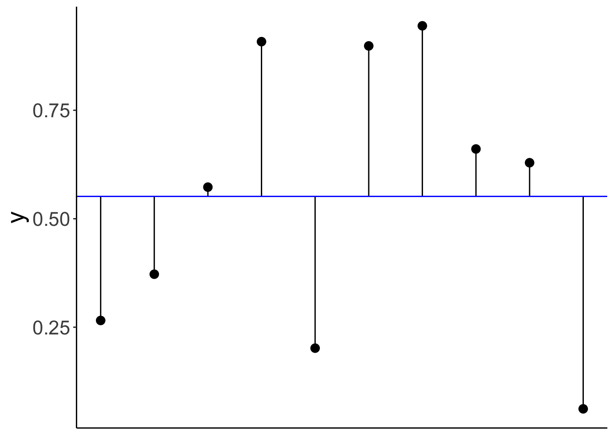

#### Covariance

Covariance is defined in the following way: 

- $Cov(X,Y) = \sum_{i=1}^n\frac{(X_i-\overline X)(Y_i-\overline Y)}{n-1}$


``` r
# make example reproducible 
set.seed(1)

# generate random data
df.covariance = tibble(x = runif(20, min = 0, max = 1),
                       y = x + rnorm(x, mean = 0.5, sd = 0.25))

# plot the data
ggplot(data = df.covariance,
       mapping = aes(x = x,
                     y = y)) +
  geom_point(size = 3) +
  theme(axis.text = element_blank(),
        axis.title = element_blank(),
        axis.ticks = element_blank())
```

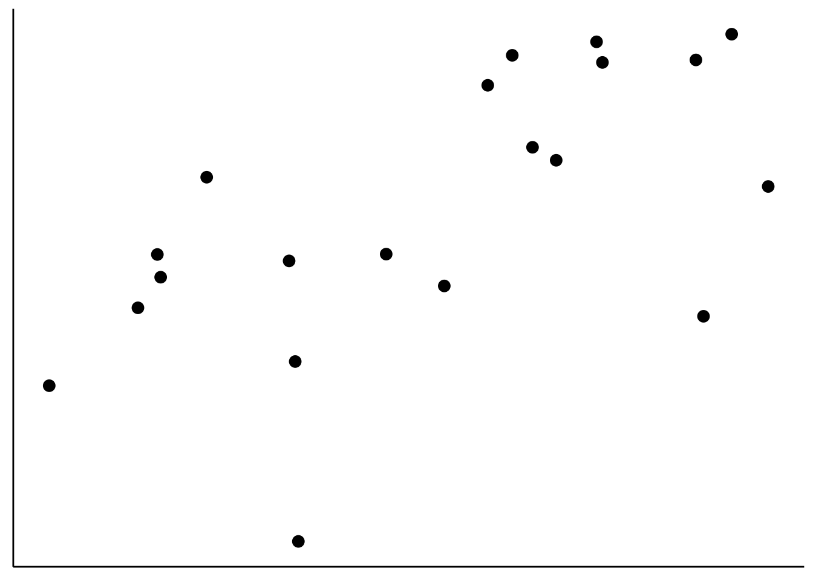

Add lines for $\overline X$ and $\overline Y$ to the data:


``` r
ggplot(data = df.covariance,
       mapping = aes(x = x,
                     y = y)) +
  geom_hline(yintercept = mean(df.covariance$y),
             color = "red",
             linewidth = 1) +
  geom_vline(xintercept = mean(df.covariance$x),
             color = "red",
             linewidth = 1) +
  geom_point(size = 3) +
  theme(axis.text = element_blank(),
        axis.title = element_blank(),
        axis.ticks = element_blank())
```

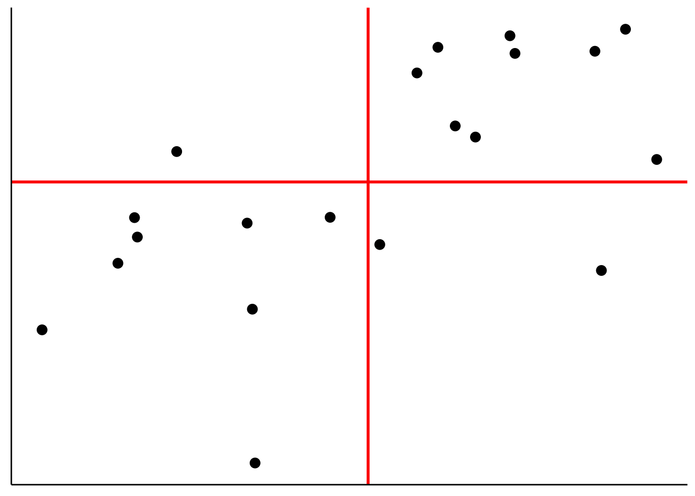

Illustrate how covariance is computed by drawing the distance to $\overline X$ and $\overline Y$ for three data points:


``` r
df.plot = df.covariance %>% 
  mutate(covariance = (x-mean(x)) *( y-mean(y))) %>% 
  arrange(abs(covariance)) %>% 
  mutate(color = NA)

mean_xy = c(mean(df.covariance$x), mean(df.covariance$y))

df.plot$color[1] = 1
df.plot$color[10] = 2
df.plot$color[19] = 3

ggplot(data = df.plot,
       mapping = aes(x = x, 
                     y = y, 
                     color = as.factor(color))) +
  geom_segment(data = df.plot %>% 
                 filter(color == 1),
               mapping = aes(x = x,
                   xend = mean_xy[1],
                   y = y,
                   yend = y),
               size = 1) + 
  geom_segment(data = df.plot %>% 
                 filter(color == 1),
               mapping = aes(x = x,
                   xend = x,
                   y = y,
                   yend = mean_xy[2]),
               size = 1) + 
  geom_segment(data = df.plot %>% 
                 filter(color == 2),
               mapping = aes(x = x,
                   xend = mean_xy[1],
                   y = y,
                   yend = y),
               size = 1) + 
  geom_segment(data = df.plot %>% 
                 filter(color == 2),
               mapping = aes(x = x,
                   xend = x,
                   y = y,
                   yend = mean_xy[2]),
               size = 1) + 
  geom_segment(data = df.plot %>% 
                 filter(color == 3),
               mapping = aes(x = x,
                   xend = mean_xy[1],
                   y = y,
                   yend = y),
               size = 1) + 
  geom_segment(data = df.plot %>% 
                 filter(color == 3),
               mapping = aes(x = x,
                   xend = x,
                   y = y,
                   yend = mean_xy[2]),
               size = 1) + 
  geom_hline(yintercept = mean_xy[2],
             color = "red",
             size = 1) +
  geom_vline(xintercept = mean_xy[1],
             color = "red",
             size = 1) +
  geom_point(size = 3) +
  theme(axis.text = element_blank(),
        axis.title = element_blank(),
        axis.ticks = element_blank(),
        legend.position = "none")
```

```
Warning: Using `size` aesthetic for lines was deprecated in ggplot2 3.4.0.
ℹ Please use `linewidth` instead.
This warning is displayed once every 8 hours.
Call `lifecycle::last_lifecycle_warnings()` to see where this warning was generated.
```

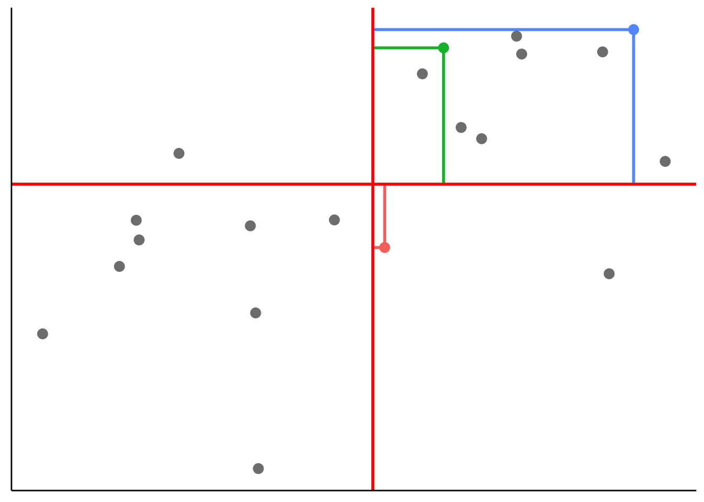

#### Spearman's rank order correlation

Spearman's $\rho$ captures the extent to which the relationship between two variables is monotonic.


``` r
# create data frame with data points and ranks 
df.ranking = tibble(x = c(1.2, 2.5, 4.5),
                    y = c(2.2, 1, 3.3),
                    label = str_c("(", x, ", ", y, ")"),
                    x_rank = dense_rank(x),
                    y_rank = dense_rank(y),
                    label_rank = str_c("(", x_rank, ", ", y_rank, ")"))

# plot the data (and show their ranks)
ggplot(data = df.ranking,
       mapping = aes(x = x, 
                     y = y)) +
  geom_point(size = 3) +
  geom_text(aes(label = label),
            hjust = -0.2,
            vjust = 0,
            size = 6) +
  geom_text(aes(label = label_rank),
            hjust = -0.4,
            vjust = 2,
            size = 6,
            color = "red") +
  coord_cartesian(xlim = c(1, 6),
                  ylim = c(0, 4))
```

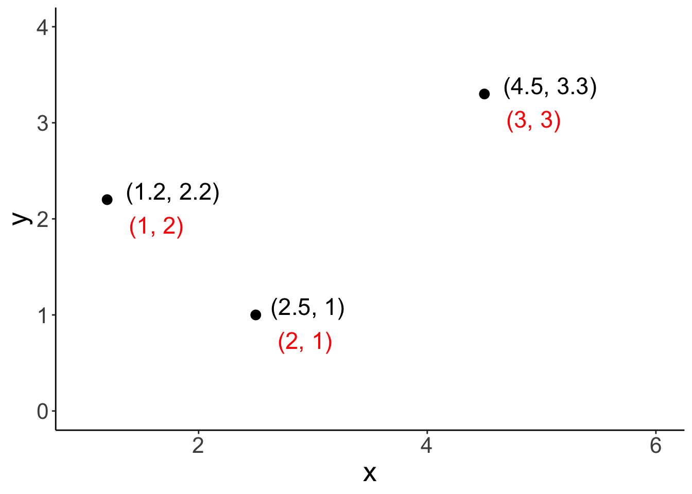

Show that Spearman's $\rho$ is equivalent to Pearson's $r$ applied to ranked data.


``` r
# data set
df.spearman = df.correlation %>% 
  mutate(x_rank = dense_rank(x),
         y_rank = dense_rank(y))

# correlation
df.spearman %>% 
  summarize(r = cor(x, y, method = "pearson"),
            spearman = cor(x, y, method = "spearman"),
            r_ranks = cor(x_rank, y_rank))
```

```
# A tibble: 1 × 3
      r spearman r_ranks
  <dbl>    <dbl>   <dbl>
1 0.851    0.836   0.836
```

``` r
# plot
ggplot(data = df.spearman,
       mapping = aes(x = x_rank,
                     y = y_rank)) +
  geom_point(size = 3) +
  scale_x_continuous(breaks = 1:20) +
  scale_y_continuous(breaks = 1:20) +
  theme(axis.text = element_text(size = 10))

# show some of the data and ranks 
df.spearman %>% 
  head(10) %>% 
  kable(digits = 2) %>% 
  kable_styling(bootstrap_options = "striped",
              full_width = F)
```

<table class="table table-striped" style="width: auto !important; margin-left: auto; margin-right: auto;">
 <thead>
  <tr>
   <th style="text-align:right;"> x </th>
   <th style="text-align:right;"> y </th>
   <th style="text-align:right;"> x_rank </th>
   <th style="text-align:right;"> y_rank </th>
  </tr>
 </thead>
<tbody>
  <tr>
   <td style="text-align:right;"> 26.55 </td>
   <td style="text-align:right;"> 49.23 </td>
   <td style="text-align:right;"> 5 </td>
   <td style="text-align:right;"> 10 </td>
  </tr>
  <tr>
   <td style="text-align:right;"> 37.21 </td>
   <td style="text-align:right;"> 43.06 </td>
   <td style="text-align:right;"> 6 </td>
   <td style="text-align:right;"> 7 </td>
  </tr>
  <tr>
   <td style="text-align:right;"> 57.29 </td>
   <td style="text-align:right;"> 47.97 </td>
   <td style="text-align:right;"> 10 </td>
   <td style="text-align:right;"> 8 </td>
  </tr>
  <tr>
   <td style="text-align:right;"> 90.82 </td>
   <td style="text-align:right;"> 57.60 </td>
   <td style="text-align:right;"> 18 </td>
   <td style="text-align:right;"> 11 </td>
  </tr>
  <tr>
   <td style="text-align:right;"> 20.17 </td>
   <td style="text-align:right;"> 37.04 </td>
   <td style="text-align:right;"> 3 </td>
   <td style="text-align:right;"> 6 </td>
  </tr>
  <tr>
   <td style="text-align:right;"> 89.84 </td>
   <td style="text-align:right;"> 89.16 </td>
   <td style="text-align:right;"> 17 </td>
   <td style="text-align:right;"> 19 </td>
  </tr>
  <tr>
   <td style="text-align:right;"> 94.47 </td>
   <td style="text-align:right;"> 94.22 </td>
   <td style="text-align:right;"> 19 </td>
   <td style="text-align:right;"> 20 </td>
  </tr>
  <tr>
   <td style="text-align:right;"> 66.08 </td>
   <td style="text-align:right;"> 80.24 </td>
   <td style="text-align:right;"> 12 </td>
   <td style="text-align:right;"> 16 </td>
  </tr>
  <tr>
   <td style="text-align:right;"> 62.91 </td>
   <td style="text-align:right;"> 75.23 </td>
   <td style="text-align:right;"> 11 </td>
   <td style="text-align:right;"> 14 </td>
  </tr>
  <tr>
   <td style="text-align:right;"> 6.18 </td>
   <td style="text-align:right;"> 15.09 </td>
   <td style="text-align:right;"> 1 </td>
   <td style="text-align:right;"> 2 </td>
  </tr>
</tbody>
</table>

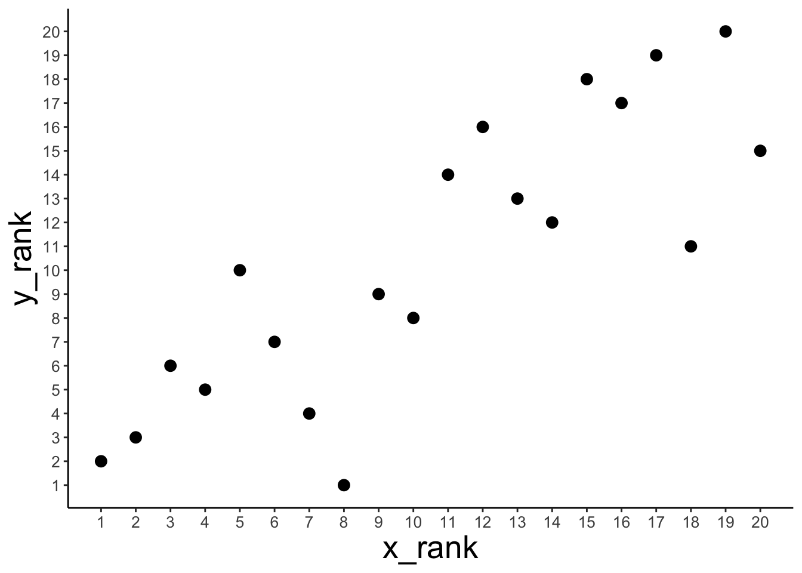

Comparison between $r$ and $\rho$ for a given data set: 


``` r
# data set
df.example = tibble(x = 1:10,
                    y = c(-10, 2:9, 20)) %>% 
  mutate(x_rank = dense_rank(x),
         y_rank = dense_rank(y))

# correlation
df.example %>% 
  summarize(r = cor(x, y, method = "pearson"),
            spearman = cor(x, y, method = "spearman"),
            r_ranks = cor(x_rank, y_rank))
```

```
# A tibble: 1 × 3
      r spearman r_ranks
  <dbl>    <dbl>   <dbl>
1 0.878        1       1
```

``` r
# plot
ggplot(data = df.example,
       # mapping = aes(x = x_rank, y = y_rank)) + # see the ranked data 
       mapping = aes(x = x, y = y)) + # see the original data
  geom_point(size = 3) +
  theme(axis.text = element_text(size = 10))
```

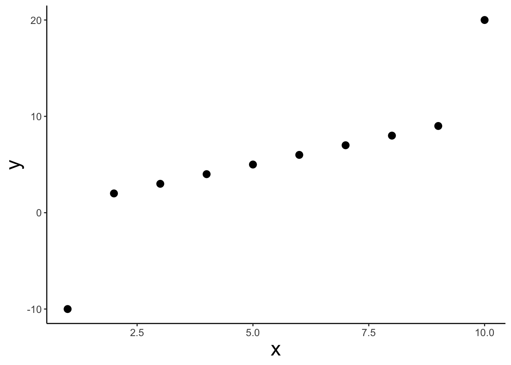

Another example


``` r
# make example reproducible 
set.seed(1)

# data set
df.example2 = tibble(x = c(1, rnorm(8, mean = 5, sd = 1),  10),
                     y = c(-10, rnorm(8, sd = 1), 20)) %>% 
  mutate(x_rank = dense_rank(x),
         y_rank = dense_rank(y))

# correlation
df.example2 %>% 
  summarize(r = cor(x, y, method = "pearson"),
            spearman = cor(x, y, method = "spearman"),
            r_ranks = cor(x_rank, y_rank))
```

```
# A tibble: 1 × 3
      r spearman r_ranks
  <dbl>    <dbl>   <dbl>
1 0.919    0.467   0.467
```

``` r
# plot
ggplot(data = df.example2,
       # mapping = aes(x = x_rank, y = y_rank)) + # see the ranked data 
       mapping = aes(x = x,
                     y = y)) + # see the original data
  geom_point(size = 3) +
  theme(axis.text = element_text(size = 10))
```

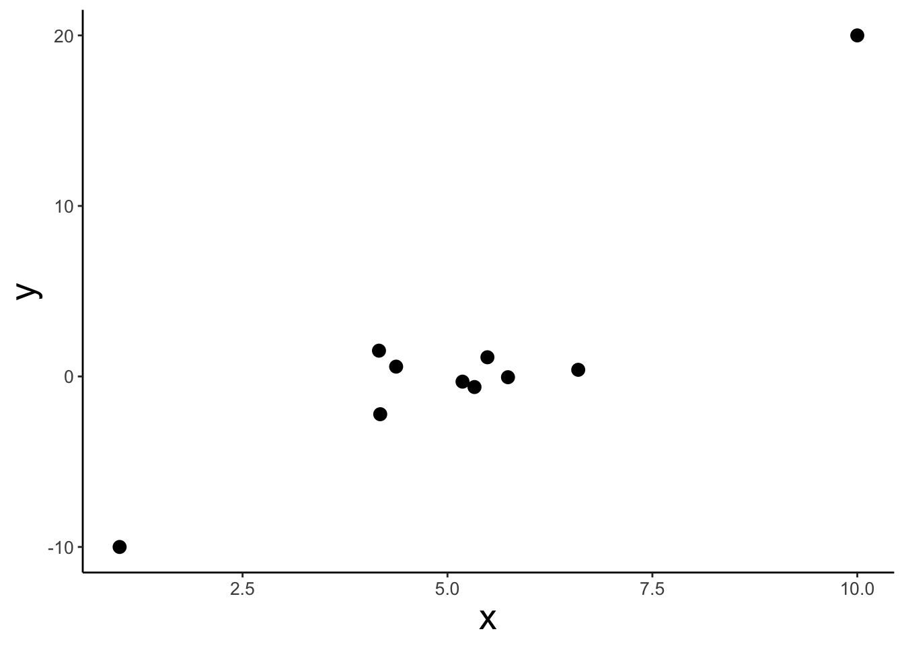

## Regression


``` r
# make example reproducible 
set.seed(1)

# set the sample size
n_samples = 10

# generate correlated data
df.regression = tibble(chocolate = runif(n_samples, min = 0, max = 100),
                       happiness = chocolate * 0.5 + rnorm(n_samples, sd = 15))

# plot the data 
ggplot(data = df.regression,
       mapping = aes(x = chocolate,
                     y = happiness)) +
  geom_point(size = 3)
```


### Define and fit the models

Define and fit the compact model (Model C): $Y_i = \beta_0 + \epsilon_i$


``` r
# fit the compact model
lm.compact = lm(happiness ~ 1, data = df.regression)

# store the results of the model fit in a data frame
df.compact = tidy(lm.compact)

# plot the data with model prediction
ggplot(data = df.regression,
       mapping = aes(x = chocolate,
                     y = happiness)) +
  geom_hline(yintercept = df.compact$estimate,
             color = "blue",
             size = 1) +
  geom_point(size = 3) 
```

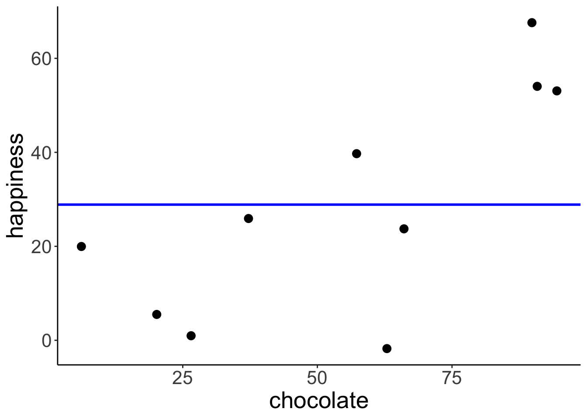

Define and fit the augmented model (Model A): $Y_i = \beta_0 + \beta_1 X_{1i} + \epsilon_i$


``` r
# fit the augmented model
lm.augmented = lm(happiness ~ chocolate, data = df.regression)

# store the results of the model fit in a data frame
df.augmented = tidy(lm.augmented)

# plot the data with model prediction
ggplot(data = df.regression,
       mapping = aes(x = chocolate,
                     y = happiness)) +
  geom_abline(intercept = df.augmented$estimate[1],
              slope = df.augmented$estimate[2],
              color = "red",
              size = 1) +
  geom_point(size = 3) 
```


### Calculate the sum of squared errors of each model

Illustration of the residuals for the compact model:  


``` r
# fit the model 
lm.compact = lm(happiness ~ 1, data = df.regression)

# store the model information
df.compact_summary = tidy(lm.compact)

# create a data frame that contains the residuals 
df.compact_model = augment(lm.compact) %>% 
  clean_names() %>% 
  left_join(df.regression, by = "happiness")

# plot model prediction with residuals
ggplot(data = df.compact_model,
       mapping = aes(x = chocolate,
                     y = happiness)) +
  geom_hline(yintercept = df.compact_summary$estimate,
             color = "blue",
             linewidth = 1) +
  geom_segment(mapping = aes(xend = chocolate,
                             yend = df.compact_summary$estimate),
               color = "blue") + 
  geom_point(size = 3) 

# calculate the sum of squared errors
df.compact_model %>% 
  summarize(SSE = sum(resid^2))
```

```
# A tibble: 1 × 1
    SSE
  <dbl>
1 5215.
```

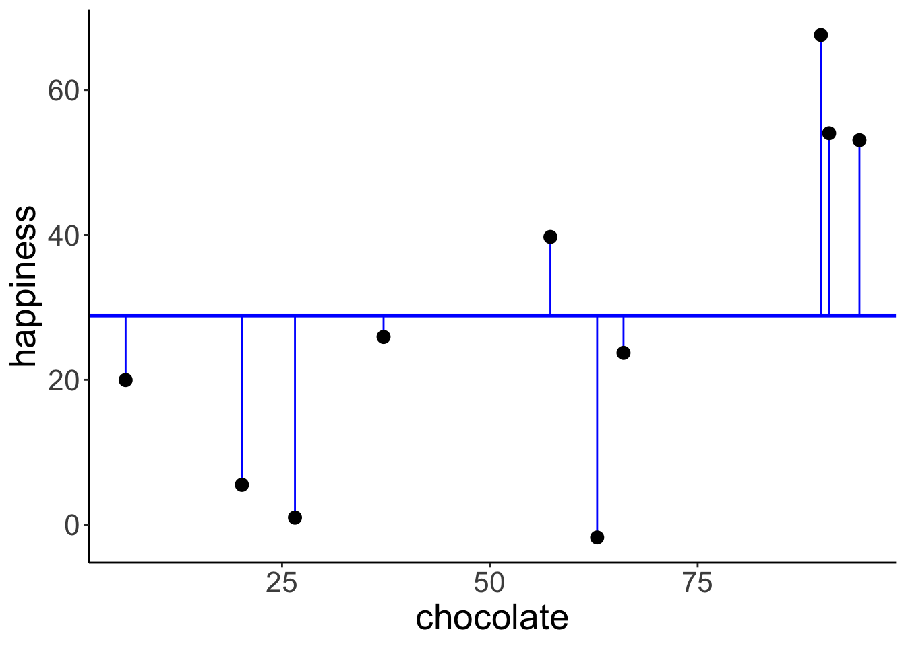

Illustration of the residuals for the augmented model:  


``` r
# fit the model 
lm.augmented = lm(happiness ~ chocolate, data = df.regression)

# store the model information
df.augmented_summary = tidy(lm.augmented)

# create a data frame that contains the residuals 
df.augmented_model = augment(lm.augmented) %>% 
  clean_names() %>% 
  left_join(df.regression, by = c("happiness", "chocolate"))

# plot model prediction with residuals
ggplot(data = df.augmented_model,
       mapping = aes(x = chocolate,
                     y = happiness)) +
  geom_abline(intercept = df.augmented_summary$estimate[1],
              slope = df.augmented_summary$estimate[2],
              color = "red",
              linewidth = 1) +
  geom_segment(mapping = aes(xend = chocolate,
                             yend = fitted),
               color = "red") + 
  geom_point(size = 3) 

# calculate the sum of squared errors
df.augmented_model %>% 
  summarize(SSE = sum(resid^2))
```

```
# A tibble: 1 × 1
    SSE
  <dbl>
1 2397.
```

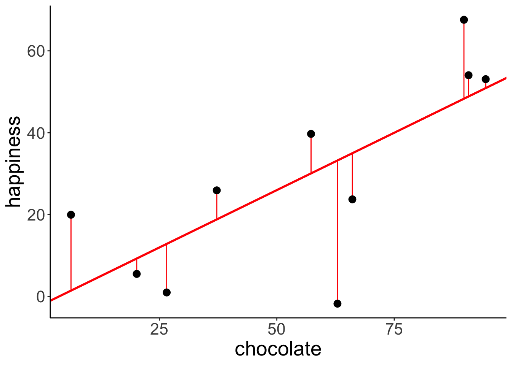

Calculate the F-test to determine whether PRE is significant. 


``` r
pc = 1 # number of parameters in the compact model  
pa = 2 # number of parameters in the augmented model  
n = 10 # number of observations

# SSE of the compact model 
sse_compact = df.compact_model %>% 
  summarize(SSE = sum(resid^2))

# SSE of the augmented model
sse_augmented = df.augmented_model %>% 
  summarize(SSE = sum(resid^2))

# Proportional reduction of error 
pre = as.numeric(1 - (sse_augmented/sse_compact))

# F-statistic 
f = (pre/(pa-pc))/((1-pre)/(n-pa))

# p-value
p_value = 1-pf(f, df1 = pa-pc, df2 = n-pa)

print(p_value)
```

```
[1] 0.01542156
```

F-distribution with a red line indicating the calculated F-statistic.


``` r
ggplot(data = tibble(x = c(0, 10)),
       mapping = aes(x = x)) +
  stat_function(fun = df,
                args = list(df1 = pa-pc,
                            df2 = n-pa),
                size = 1) +
  geom_vline(xintercept = f,
             color = "red",
             size = 1)
```

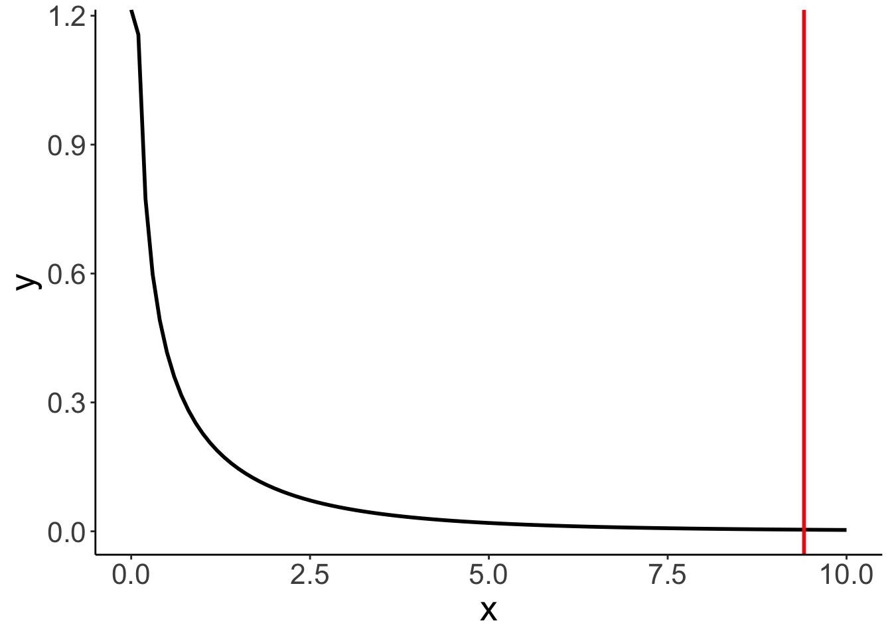

The short version of doing what we did above :) 


``` r
anova(lm.compact, lm.augmented)
```

```
Analysis of Variance Table

Model 1: happiness ~ 1
Model 2: happiness ~ chocolate
  Res.Df    RSS Df Sum of Sq      F  Pr(>F)  
1      9 5215.0                              
2      8 2396.9  1    2818.1 9.4055 0.01542 *
---
Signif. codes:  0 '***' 0.001 '**' 0.01 '*' 0.05 '.' 0.1 ' ' 1
```

## Credit example

Let's load the credit card data: 


``` r
df.credit = read_csv("data/credit.csv") %>% 
  clean_names()
```

Here is a short description of the variables:

<table class="table table-striped" style="width: auto !important; margin-left: auto; margin-right: auto;">
 <thead>
  <tr>
   <th style="text-align:left;"> variable </th>
   <th style="text-align:left;"> description </th>
  </tr>
 </thead>
<tbody>
  <tr>
   <td style="text-align:left;"> income </td>
   <td style="text-align:left;"> in thousand dollars </td>
  </tr>
  <tr>
   <td style="text-align:left;"> limit </td>
   <td style="text-align:left;"> credit limit </td>
  </tr>
  <tr>
   <td style="text-align:left;"> rating </td>
   <td style="text-align:left;"> credit rating </td>
  </tr>
  <tr>
   <td style="text-align:left;"> cards </td>
   <td style="text-align:left;"> number of credit cards </td>
  </tr>
  <tr>
   <td style="text-align:left;"> age </td>
   <td style="text-align:left;"> in years </td>
  </tr>
  <tr>
   <td style="text-align:left;"> education </td>
   <td style="text-align:left;"> years of education </td>
  </tr>
  <tr>
   <td style="text-align:left;"> gender </td>
   <td style="text-align:left;"> male or female </td>
  </tr>
  <tr>
   <td style="text-align:left;"> student </td>
   <td style="text-align:left;"> student or not </td>
  </tr>
  <tr>
   <td style="text-align:left;"> married </td>
   <td style="text-align:left;"> married or not </td>
  </tr>
  <tr>
   <td style="text-align:left;"> ethnicity </td>
   <td style="text-align:left;"> African American, Asian, Caucasian </td>
  </tr>
  <tr>
   <td style="text-align:left;"> balance </td>
   <td style="text-align:left;"> average credit card debt </td>
  </tr>
</tbody>
</table>

Scatterplot of the relationship between `income` and `balance`.


``` r
ggplot(data = df.credit,
       mapping = aes(x = income,
                     y = balance)) + 
  geom_point(alpha = 0.3) +
  coord_cartesian(xlim = c(0, max(df.credit$income)))
```

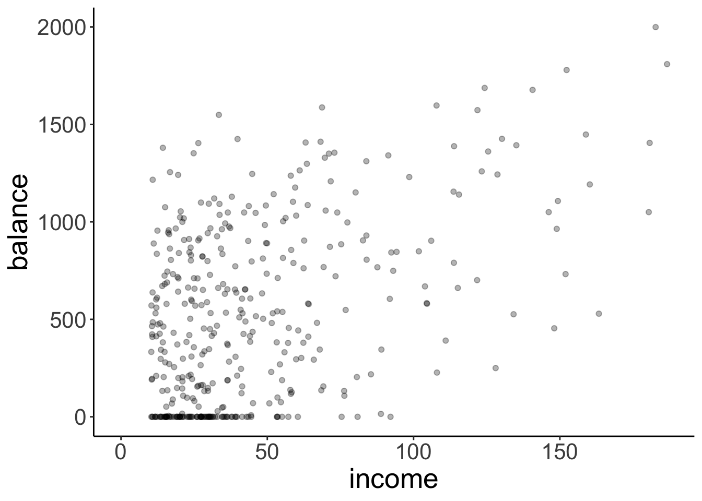

To make the model intercept interpretable, we can center the predictor variable by subtracting the mean from each value.


``` r
df.plot = df.credit %>% 
  mutate(income_centered = income - mean(income)) %>% 
  select(balance, income, income_centered)

fit = lm(balance ~ 1 + income_centered, data = df.plot)

ggplot(data = df.plot,
       mapping = aes(x = income_centered,
                     y = balance)) + 
  geom_vline(xintercept = 0,
             linetype = 2,
             color = "black") +
  geom_hline(yintercept = mean(df.plot$balance),
             color = "red") +
  geom_point(alpha = 0.3) +
  geom_smooth(method = "lm", se = F) +
  scale_color_manual(values = c("black", "red"))
```

```
`geom_smooth()` using formula = 'y ~ x'
```

``` r
  # coord_cartesian(xlim = c(0, max(df.plot$income_centered)))
```

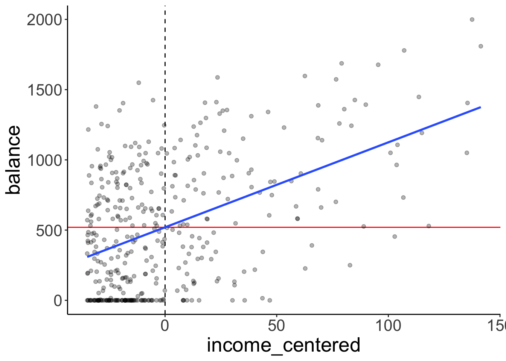

Let's fit the model and take a look at the model summary: 


``` r
fit = lm(balance ~ 1 + income, data = df.credit) 

fit %>% 
  summary()
```

```

Call:
lm(formula = balance ~ 1 + income, data = df.credit)

Residuals:
    Min      1Q  Median      3Q     Max 
-803.64 -348.99  -54.42  331.75 1100.25 

Coefficients:
            Estimate Std. Error t value Pr(>|t|)    
(Intercept) 246.5148    33.1993   7.425  6.9e-13 ***
income        6.0484     0.5794  10.440  < 2e-16 ***
---
Signif. codes:  0 '***' 0.001 '**' 0.01 '*' 0.05 '.' 0.1 ' ' 1

Residual standard error: 407.9 on 398 degrees of freedom
Multiple R-squared:  0.215,	Adjusted R-squared:  0.213 
F-statistic:   109 on 1 and 398 DF,  p-value: < 2.2e-16
```

Here, I double check that I understand how the statistics about the residuals are calculated that the model summary gives me.  


``` r
fit %>% 
  augment() %>% 
  clean_names() %>% 
  summarize(min = min(resid),
            first_quantile = quantile(resid, 0.25),
            median = median(resid),
            third_quantile = quantile(resid, 0.75),
            max = max(resid),
            rmse = sqrt(mean(resid^2)))
```

```
# A tibble: 1 × 6
    min first_quantile median third_quantile   max  rmse
  <dbl>          <dbl>  <dbl>          <dbl> <dbl> <dbl>
1 -804.          -349.  -54.4           332. 1100.  407.
```

Here is a plot of the residuals. Residual plots are important for checking whether any of the linear model assumptions have been violated. 


``` r
fit %>% 
  augment() %>% 
  clean_names() %>% 
  ggplot(mapping = aes(x = fitted,
                       y = resid)) + 
  geom_hline(yintercept = 0,
             color = "blue") +
  geom_point(alpha = 0.3)
```


We can use the `glance()` function from the `broom` package to print out model statistics. 


``` r
fit %>% 
  glance() %>% 
  kable(digits = 2) %>% 
  kable_styling(bootstrap_options = "striped",
                full_width = F)
```

<table class="table table-striped" style="width: auto !important; margin-left: auto; margin-right: auto;">
 <thead>
  <tr>
   <th style="text-align:right;"> r.squared </th>
   <th style="text-align:right;"> adj.r.squared </th>
   <th style="text-align:right;"> sigma </th>
   <th style="text-align:right;"> statistic </th>
   <th style="text-align:right;"> p.value </th>
   <th style="text-align:right;"> df </th>
   <th style="text-align:right;"> logLik </th>
   <th style="text-align:right;"> AIC </th>
   <th style="text-align:right;"> BIC </th>
   <th style="text-align:right;"> deviance </th>
   <th style="text-align:right;"> df.residual </th>
   <th style="text-align:right;"> nobs </th>
  </tr>
 </thead>
<tbody>
  <tr>
   <td style="text-align:right;"> 0.21 </td>
   <td style="text-align:right;"> 0.21 </td>
   <td style="text-align:right;"> 407.86 </td>
   <td style="text-align:right;"> 108.99 </td>
   <td style="text-align:right;"> 0 </td>
   <td style="text-align:right;"> 1 </td>
   <td style="text-align:right;"> -2970.95 </td>
   <td style="text-align:right;"> 5947.89 </td>
   <td style="text-align:right;"> 5959.87 </td>
   <td style="text-align:right;"> 66208745 </td>
   <td style="text-align:right;"> 398 </td>
   <td style="text-align:right;"> 400 </td>
  </tr>
</tbody>
</table>

Let's test whether income is a significant predictor of balance in the credit data set. 


``` r
# fitting the compact model 
fit_c = lm(formula = balance ~ 1,
           data = df.credit)

# fitting the augmented model
fit_a = lm(formula = balance ~ 1 + income,
           data = df.credit)

# run the F test 
anova(fit_c, fit_a)
```

```
Analysis of Variance Table

Model 1: balance ~ 1
Model 2: balance ~ 1 + income
  Res.Df      RSS Df Sum of Sq      F    Pr(>F)    
1    399 84339912                                  
2    398 66208745  1  18131167 108.99 < 2.2e-16 ***
---
Signif. codes:  0 '***' 0.001 '**' 0.01 '*' 0.05 '.' 0.1 ' ' 1
```

Let's print out the parameters of the augmented model with confidence intervals: 


``` r
fit_a %>% 
  tidy(conf.int = T) %>% 
  kable(digits = 2) %>% 
  kable_styling(bootstrap_options = "striped",
                full_width = F)
```

<table class="table table-striped" style="width: auto !important; margin-left: auto; margin-right: auto;">
 <thead>
  <tr>
   <th style="text-align:left;"> term </th>
   <th style="text-align:right;"> estimate </th>
   <th style="text-align:right;"> std.error </th>
   <th style="text-align:right;"> statistic </th>
   <th style="text-align:right;"> p.value </th>
   <th style="text-align:right;"> conf.low </th>
   <th style="text-align:right;"> conf.high </th>
  </tr>
 </thead>
<tbody>
  <tr>
   <td style="text-align:left;"> (Intercept) </td>
   <td style="text-align:right;"> 246.51 </td>
   <td style="text-align:right;"> 33.20 </td>
   <td style="text-align:right;"> 7.43 </td>
   <td style="text-align:right;"> 0 </td>
   <td style="text-align:right;"> 181.25 </td>
   <td style="text-align:right;"> 311.78 </td>
  </tr>
  <tr>
   <td style="text-align:left;"> income </td>
   <td style="text-align:right;"> 6.05 </td>
   <td style="text-align:right;"> 0.58 </td>
   <td style="text-align:right;"> 10.44 </td>
   <td style="text-align:right;"> 0 </td>
   <td style="text-align:right;"> 4.91 </td>
   <td style="text-align:right;"> 7.19 </td>
  </tr>
</tbody>
</table>

We can use `augment()` with the `newdata = ` argument to get predictions about new data from our fitted model: 


``` r
fit %>% 
  augment(newdata = tibble(income = 130))
```

```
# A tibble: 1 × 2
  income .fitted
   <dbl>   <dbl>
1    130   1033.
```

Here is a plot of the model with confidence interval (that captures our uncertainty in the intercept and slope of the model) and the predicted `balance` value for an `income` of 130:


``` r
ggplot(data = df.credit,
       mapping = aes(x = income,
                     y = balance)) + 
  geom_point(alpha = 0.3) +
  geom_smooth(method = "lm") +
  annotate(geom = "point",
           color = "red",
           size = 5,
           x = 130,
           y = predict(fit, newdata = tibble(income = 130))) +
  coord_cartesian(xlim = c(0, max(df.credit$income)))
```

```
`geom_smooth()` using formula = 'y ~ x'
```

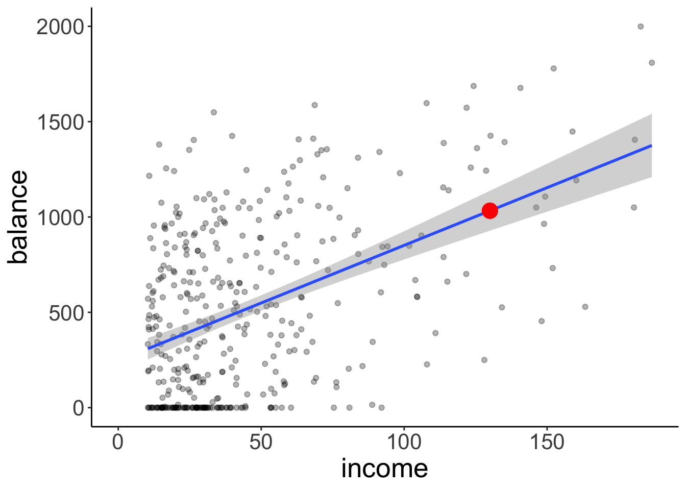

Finally, let's take a look at how the residuals are distributed. 


``` r
# get the residuals 
df.plot = fit_a %>% 
  augment() %>% 
  clean_names()

# and a density of the residuals
ggplot(df.plot, aes(x = resid)) +
  stat_density(geom = "line")
```

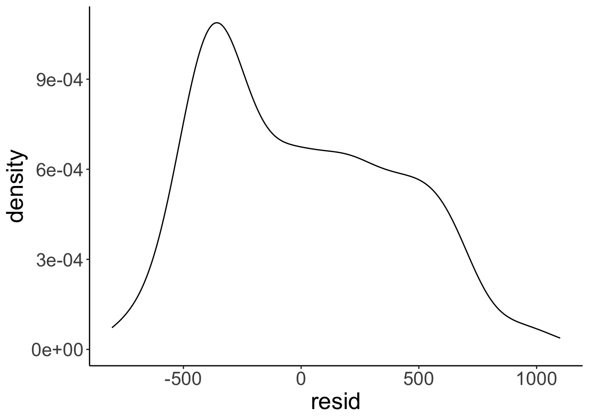

Not quite as normally distributed as we would hope. We learn what to do if some of the assumptions of the linear model are violated later in class. 

In general, we'd like the residuals to have the following shape: 


The model assumptions are: 

- independent observations
- Y is continuous
- errors are normally distributed
- errors have constant variance
- error terms are uncorrelated

Here are some examples of what the residuals could look like when things go wrong: 


## Additional resources

### Datacamp

- [Statistical modeling 1](https://www.datacamp.com/courses/statistical-modeling-in-r-part-1)
- [Statistical modeling 2](https://www.datacamp.com/courses/statistical-modeling-in-r-part-2)
- [Correlation and regression](https://www.datacamp.com/courses/correlation-and-regression)

### Misc

- [Spurious correlations](http://www.tylervigen.com/spurious-correlations)

## Session info

Information about this R session including which version of R was used, and what packages were loaded. 


``` r
sessionInfo()
```

```
R version 4.4.1 (2024-06-14)
Platform: aarch64-apple-darwin20
Running under: macOS Sonoma 14.6

Matrix products: default
BLAS:   /Library/Frameworks/R.framework/Versions/4.4-arm64/Resources/lib/libRblas.0.dylib 
LAPACK: /Library/Frameworks/R.framework/Versions/4.4-arm64/Resources/lib/libRlapack.dylib;  LAPACK version 3.12.0

locale:
[1] en_US.UTF-8/en_US.UTF-8/en_US.UTF-8/C/en_US.UTF-8/en_US.UTF-8

time zone: America/Los_Angeles
tzcode source: internal

attached base packages:
[1] stats     graphics  grDevices utils     datasets  methods   base     

other attached packages:
 [1] lubridate_1.9.3  forcats_1.0.0    stringr_1.5.1    dplyr_1.1.4     
 [5] purrr_1.0.2      readr_2.1.5      tidyr_1.3.1      tibble_3.2.1    
 [9] ggplot2_3.5.1    tidyverse_2.0.0  broom_1.0.6      janitor_2.2.0   
[13] kableExtra_1.4.0 knitr_1.48      

loaded via a namespace (and not attached):
 [1] gtable_0.3.5      xfun_0.45         bslib_0.7.0       lattice_0.22-6   
 [5] tzdb_0.4.0        vctrs_0.6.5       tools_4.4.1       generics_0.1.3   
 [9] parallel_4.4.1    fansi_1.0.6       highr_0.11        pkgconfig_2.0.3  
[13] Matrix_1.7-0      lifecycle_1.0.4   compiler_4.4.1    farver_2.1.2     
[17] munsell_0.5.1     snakecase_0.11.1  htmltools_0.5.8.1 sass_0.4.9       
[21] yaml_2.3.9        pillar_1.9.0      crayon_1.5.3      jquerylib_0.1.4  
[25] cachem_1.1.0      nlme_3.1-164      tidyselect_1.2.1  digest_0.6.36    
[29] stringi_1.8.4     bookdown_0.40     labeling_0.4.3    splines_4.4.1    
[33] fastmap_1.2.0     grid_4.4.1        colorspace_2.1-0  cli_3.6.3        
[37] magrittr_2.0.3    utf8_1.2.4        withr_3.0.0       scales_1.3.0     
[41] backports_1.5.0   bit64_4.0.5       timechange_0.3.0  rmarkdown_2.27   
[45] bit_4.0.5         png_0.1-8         hms_1.1.3         evaluate_0.24.0  
[49] viridisLite_0.4.2 mgcv_1.9-1        rlang_1.1.4       glue_1.7.0       
[53] xml2_1.3.6        svglite_2.1.3     rstudioapi_0.16.0 vroom_1.6.5      
[57] jsonlite_1.8.8    R6_2.5.1          systemfonts_1.1.0
```
