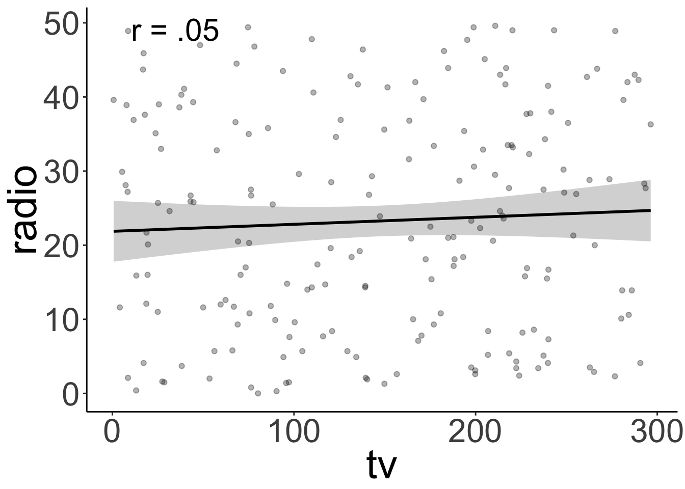
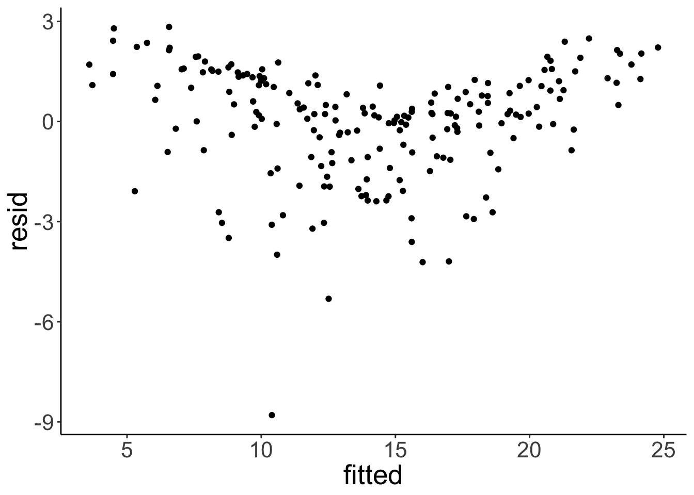
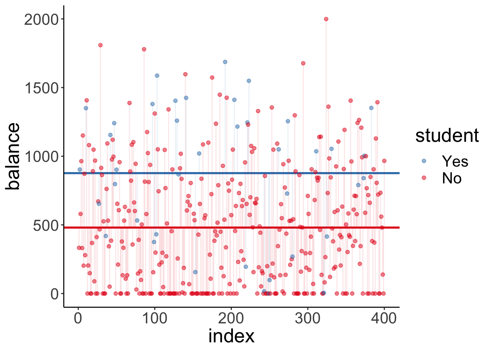
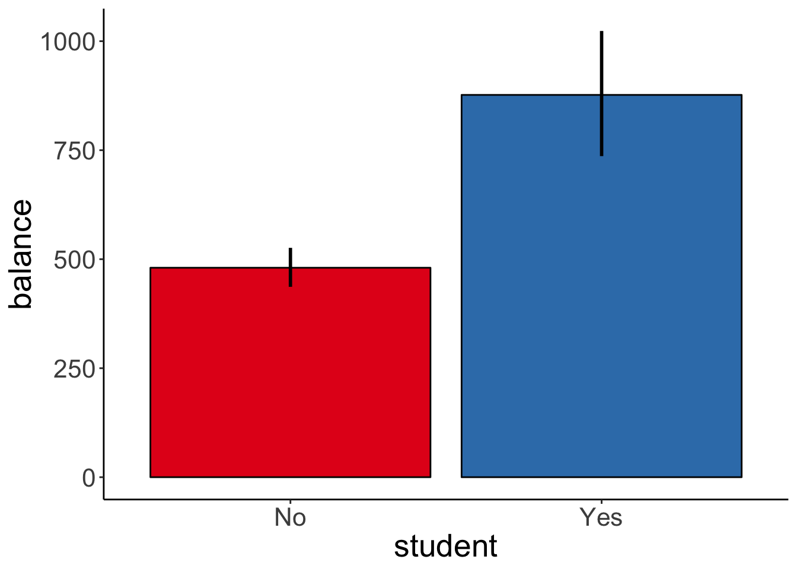
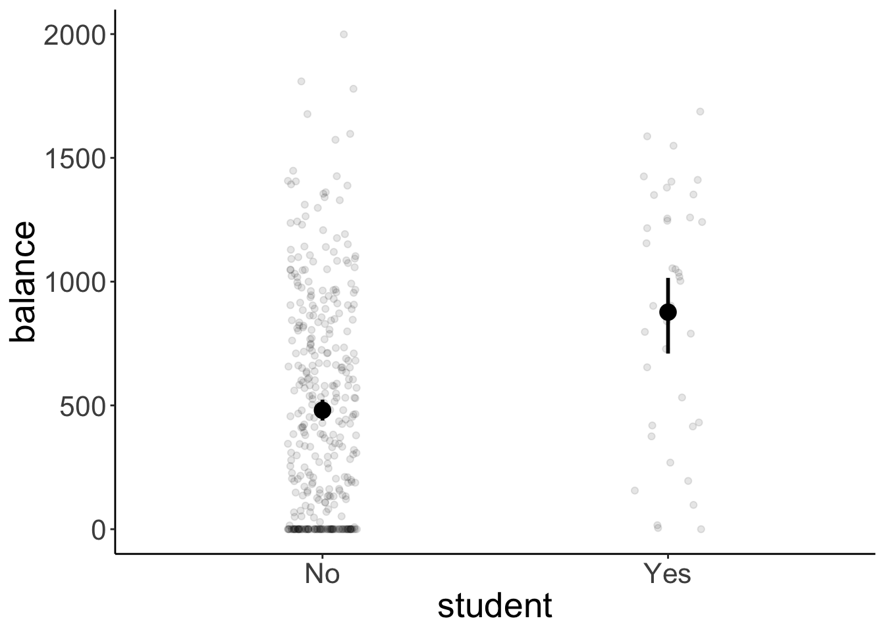
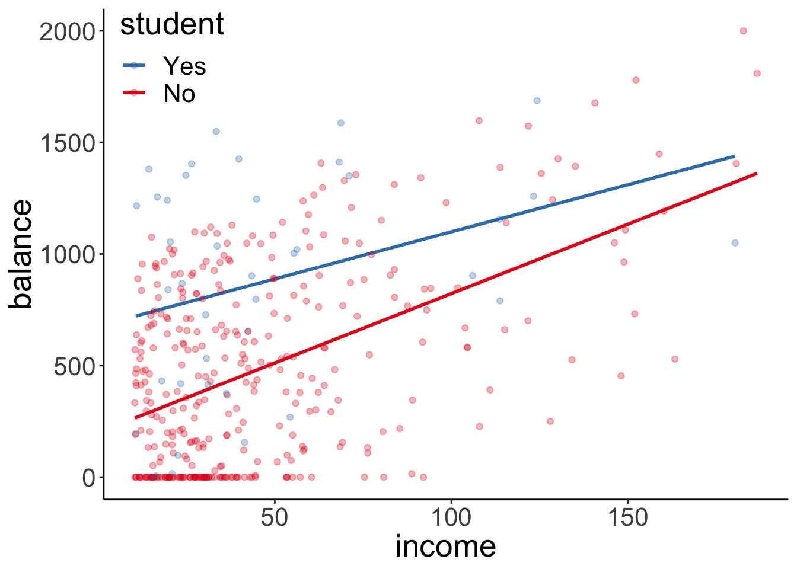

# Linear model 2


## Load packages and set plotting theme  


```r
library("knitr")      # for knitting RMarkdown 
library("kableExtra") # for making nice tables
library("janitor")    # for cleaning column names
library("broom")      # for tidying up linear models 
library("corrr")      # for calculating correlations between many variables
library("corrplot")   # for plotting correlations
library("GGally")     # for running ggpairs() function
library("tidyverse")  # for wrangling, plotting, etc. 

opts_chunk$set(
  comment = "",
  results = "hold",
  fig.show = "hold"
)
```


```r
theme_set(
  theme_classic() + #set the theme 
    theme(text = element_text(size = 20)) #set the default text size
)
```

## Load data sets 

Let's load the data sets that we'll explore in this class: 


```r
# credit data set
df.credit = read_csv("data/credit.csv") %>% 
  rename(index = X1) %>% 
  clean_names()

# advertising data set 
df.ads = read_csv("data/advertising.csv") %>% 
  clean_names() %>% 
  rename(index = x1)
```

<table class="table table-striped" style="width: auto !important; margin-left: auto; margin-right: auto;">
 <thead>
  <tr>
   <th style="text-align:left;"> variable </th>
   <th style="text-align:left;"> description </th>
  </tr>
 </thead>
<tbody>
  <tr>
   <td style="text-align:left;"> income </td>
   <td style="text-align:left;"> in thousand dollars </td>
  </tr>
  <tr>
   <td style="text-align:left;"> limit </td>
   <td style="text-align:left;"> credit limit </td>
  </tr>
  <tr>
   <td style="text-align:left;"> rating </td>
   <td style="text-align:left;"> credit rating </td>
  </tr>
  <tr>
   <td style="text-align:left;"> cards </td>
   <td style="text-align:left;"> number of credit cards </td>
  </tr>
  <tr>
   <td style="text-align:left;"> age </td>
   <td style="text-align:left;"> in years </td>
  </tr>
  <tr>
   <td style="text-align:left;"> education </td>
   <td style="text-align:left;"> years of education </td>
  </tr>
  <tr>
   <td style="text-align:left;"> gender </td>
   <td style="text-align:left;"> male or female </td>
  </tr>
  <tr>
   <td style="text-align:left;"> student </td>
   <td style="text-align:left;"> student or not </td>
  </tr>
  <tr>
   <td style="text-align:left;"> married </td>
   <td style="text-align:left;"> married or not </td>
  </tr>
  <tr>
   <td style="text-align:left;"> ethnicity </td>
   <td style="text-align:left;"> African American, Asian, Caucasian </td>
  </tr>
  <tr>
   <td style="text-align:left;"> balance </td>
   <td style="text-align:left;"> average credit card debt </td>
  </tr>
</tbody>
</table>

## Things that came up in class

Can the density at a given point be greater than 1? Yes, since it's the area under the curve that has to sum to 1. Here is the density plot for a uniform distribution (note that the density is 1 uniformly).


```r
# play around with this value to see how the density changes
tmp.max = 5

ggplot(data = tibble(x = c(0, tmp.max)),
       mapping = aes(x = x)) + 
  stat_function(fun = "dunif",
                geom = "area",
                fill = "lightblue",
                size = 1,
                args = list(min = 0,
                            max = tmp.max)) +
  stat_function(fun = "dunif",
                size = 1,
                args = list(min = 0,
                            max = tmp.max)) +
  coord_cartesian(xlim = c(0, tmp.max),
                  ylim = c(0, 6),
                  expand = F)
```


And here is the density plot for a beta distribution:


```r
# play around with these parameters
tmp.shape1 = 1
tmp.shape2 = 2

ggplot(data = tibble(x = c(0, 1)),
       mapping = aes(x = x)) + 
  stat_function(fun = "dbeta",
                args = list(shape1 = tmp.shape1,
                            shape2 = tmp.shape2),
                geom = "area",
                fill = "lightblue",
                size = 1) +
  stat_function(fun = "dbeta",
                args = list(shape1 = tmp.shape1,
                            shape2 = tmp.shape2),
                size = 1) +
  coord_cartesian(xlim = c(0, 1),
                  ylim = c(0, 3),
                  expand = F)
```


## Multiple continuous variables 

Let's take a look at a case where we have multiple continuous predictor variables. In this case, we want to make sure that our predictors are not too highly correlated with each other (as this makes the interpration of how much each variable explains the outcome difficult). So we first need to explore the pairwise correlations between variables. 

### Explore correlations 

The `corrr` package is great for exploring correlations between variables. To find out more how `corrr` works, take a look at this vignette: 


```r
vignette(topic = "using-corrr",
         package = "corrr")
```

Here is an example that illustrates some of the key functions in the `corrr` package (using the advertisement data): 


```r
df.ads %>% 
  select_if(is.numeric) %>% 
  correlate(quiet = T) %>% 
  shave() %>%
  fashion()
```

```
    rowname index   tv radio newspaper sales
1     index                                 
2        tv   .02                           
3     radio  -.11  .05                      
4 newspaper  -.15  .06   .35                
5     sales  -.05  .78   .58       .23      
```

#### Visualize correlations

##### Correlations with the dependent variable


```r
df.credit %>% 
  select_if(is.numeric) %>%
  correlate(quiet = T) %>%
  select(rowname, income) %>% 
  mutate(rowname = reorder(rowname, income)) %>%
  drop_na() %>% 
  ggplot(aes(x = rowname, 
             y = income,
             fill = income)) +
  geom_hline(yintercept = 0) +
  geom_col(color = "black",
           show.legend = F) + 
  scale_fill_gradient2(low = "indianred2",
                       mid = "white",
                       high = "skyblue1",
                       limits = c(-1, 1)) + 
  coord_flip() +
  theme(axis.title.y = element_blank())
```

<div class="figure">

<p class="caption">(\#fig:linear-model2-10)Bar plot illustrating how strongly different variables correlate with income.</p>
</div>

##### All pairwise correlations


```r
tmp = df.credit %>%
  select_if(is.numeric) %>%
  correlate(diagonal = 0,
            quiet = T) %>%
  rearrange() %>%
  column_to_rownames() %>%
  as.matrix() %>%
  corrplot()
```


```r
df.ads %>%
  select(-index) %>% 
  ggpairs()
```

<div class="figure">

<p class="caption">(\#fig:linear-model2-12)Pairwise correlations with scatter plots, correlation values, and densities on the diagonal.</p>
</div>

With some customization: 


```r
df.ads %>% 
  select(-index) %>%
  ggpairs(lower = list(continuous = wrap("points",
                                         alpha = 0.3)),
          upper = list(continuous = wrap("cor", size = 8))) + 
  theme(panel.grid.major = element_blank())
```

<div class="figure">

<p class="caption">(\#fig:linear-model2-13)Pairwise correlations with scatter plots, correlation values, and densities on the diagonal (customized).</p>
</div>

### Multipe regression

Now that we've explored the correlations, let's have a go at the multiple regression. 

#### Visualization

We'll first take another look at the pairwise relationships: 


```r
tmp.x = "tv"
# tmp.x = "radio"
# tmp.x = "newspaper"
# tmp.y = "radio"
tmp.y = "radio"
# tmp.y = "tv"

ggplot(df.ads, 
       aes_string(x = tmp.x, y = tmp.y)) + 
  stat_smooth(method = "lm",
              color = "black",
              fullrange = T) +
  geom_point(alpha = 0.3) +
  annotate(geom = "text",
           x = -Inf, 
           y = Inf,
           hjust = -0.5,
           vjust = 1.5,
           label = str_c("r = ", cor(df.ads[[tmp.x]], df.ads[[tmp.y]]) %>% 
                           round(2) %>%  # round 
                           str_remove("^0+") # remove 0
                         ),
           size = 8) +
  theme(text = element_text(size = 30))
```



TV ads and radio ads aren't correlated. Yay! 

#### Fitting, hypothesis testing, evaluation

Let's see whether adding radio ads is worth it (over and above having TV ads).


```r
# fit the models 
fit_c = lm(sales ~ 1 + tv, data = df.ads)
fit_a = lm(sales ~ 1 + tv + radio, data = df.ads)

# do the F test
anova(fit_c, fit_a)
```

```
Analysis of Variance Table

Model 1: sales ~ 1 + tv
Model 2: sales ~ 1 + tv + radio
  Res.Df     RSS Df Sum of Sq      F    Pr(>F)    
1    198 2102.53                                  
2    197  556.91  1    1545.6 546.74 < 2.2e-16 ***
---
Signif. codes:  0 '***' 0.001 '**' 0.01 '*' 0.05 '.' 0.1 ' ' 1
```

It's worth it! 

Let's evaluate how well the model actually does. We do this by taking a look at the residual plot, and check whether the residuals are normally distributed.


```r
tmp.fit = lm(sales ~ 1 + tv + radio, data = df.ads)

df.plot = tmp.fit %>% 
  augment() %>% 
  clean_names() 

# residual plot
ggplot(df.plot, 
       aes(x = fitted, 
           y = resid)) + 
  geom_point()

# density of residuals 
ggplot(df.plot, 
       aes(x = resid)) + 
  stat_density(geom = "line")

# QQ plot 
ggplot(df.plot,
       aes(sample = resid)) + 
  geom_qq() + 
  geom_qq_line() 
```



There is a slight non-linear trend in the residuals. We can also see that the residuals aren't perfectly normally distributed. We'll see later what we can do about this ... 

Let's see how well the model does overall: 


```r
fit_a %>% 
  glance() %>% 
    kable(digits = 3) %>% 
    kable_styling(bootstrap_options = "striped",
                full_width = F)
```

<table class="table table-striped" style="width: auto !important; margin-left: auto; margin-right: auto;">
 <thead>
  <tr>
   <th style="text-align:right;"> r.squared </th>
   <th style="text-align:right;"> adj.r.squared </th>
   <th style="text-align:right;"> sigma </th>
   <th style="text-align:right;"> statistic </th>
   <th style="text-align:right;"> p.value </th>
   <th style="text-align:right;"> df </th>
   <th style="text-align:right;"> logLik </th>
   <th style="text-align:right;"> AIC </th>
   <th style="text-align:right;"> BIC </th>
   <th style="text-align:right;"> deviance </th>
   <th style="text-align:right;"> df.residual </th>
  </tr>
 </thead>
<tbody>
  <tr>
   <td style="text-align:right;"> 0.897 </td>
   <td style="text-align:right;"> 0.896 </td>
   <td style="text-align:right;"> 1.681 </td>
   <td style="text-align:right;"> 859.618 </td>
   <td style="text-align:right;"> 0 </td>
   <td style="text-align:right;"> 3 </td>
   <td style="text-align:right;"> -386.197 </td>
   <td style="text-align:right;"> 780.394 </td>
   <td style="text-align:right;"> 793.587 </td>
   <td style="text-align:right;"> 556.914 </td>
   <td style="text-align:right;"> 197 </td>
  </tr>
</tbody>
</table>

As we can see, the model almost explains 90% of the variance. That's very decent! 

#### Visualizing the model fits 

Here is a way of visualizing how both tv ads and radio ads affect sales: 


```r
df.plot = lm(sales ~ 1 + tv + radio, data =  df.ads) %>% 
  augment() %>% 
  clean_names()

df.tidy = lm(sales ~ 1 + tv + radio, data =  df.ads) %>% 
  tidy()

ggplot(df.plot, aes(x = radio, y = sales, color = tv)) + 
  geom_point() +
  scale_color_gradient(low = "gray80", high = "black") +
  theme(legend.position = c(0.1, 0.8))
```


We used color here to encode TV ads (and the x-axis for the radio ads). 

In addition, we might want to illustrate what relationship between radio ads and sales the model predicts for three distinct values for TV ads. Like so: 


```r
df.plot = lm(sales ~ 1 + tv + radio, data =  df.ads) %>% 
  augment() %>% 
  clean_names()

df.tidy = lm(sales ~ 1 + tv + radio, data =  df.ads) %>% 
  tidy()

ggplot(df.plot, aes(x = radio, y = sales, color = tv)) + 
  geom_point() +
  geom_abline(intercept = df.tidy$estimate[1] + df.tidy$estimate[2] * 200,
              slope = df.tidy$estimate[3]) +
  geom_abline(intercept = df.tidy$estimate[1] + df.tidy$estimate[2] * 100,
              slope = df.tidy$estimate[3]) +
  geom_abline(intercept = df.tidy$estimate[1] + df.tidy$estimate[2] * 0,
              slope = df.tidy$estimate[3]) +
  scale_color_gradient(low = "gray80", high = "black") +
  theme(legend.position = c(0.1, 0.8))
```


#### Interpreting the model fits

Fitting the augmented model yields the following estimates for the coefficients in the model: 


```r
fit_a %>% 
  tidy(conf.int = T) %>% 
    head(10) %>% 
    kable(digits = 2) %>% 
    kable_styling(bootstrap_options = "striped",
                full_width = F)
```

<table class="table table-striped" style="width: auto !important; margin-left: auto; margin-right: auto;">
 <thead>
  <tr>
   <th style="text-align:left;"> term </th>
   <th style="text-align:right;"> estimate </th>
   <th style="text-align:right;"> std.error </th>
   <th style="text-align:right;"> statistic </th>
   <th style="text-align:right;"> p.value </th>
   <th style="text-align:right;"> conf.low </th>
   <th style="text-align:right;"> conf.high </th>
  </tr>
 </thead>
<tbody>
  <tr>
   <td style="text-align:left;"> (Intercept) </td>
   <td style="text-align:right;"> 2.92 </td>
   <td style="text-align:right;"> 0.29 </td>
   <td style="text-align:right;"> 9.92 </td>
   <td style="text-align:right;"> 0 </td>
   <td style="text-align:right;"> 2.34 </td>
   <td style="text-align:right;"> 3.50 </td>
  </tr>
  <tr>
   <td style="text-align:left;"> tv </td>
   <td style="text-align:right;"> 0.05 </td>
   <td style="text-align:right;"> 0.00 </td>
   <td style="text-align:right;"> 32.91 </td>
   <td style="text-align:right;"> 0 </td>
   <td style="text-align:right;"> 0.04 </td>
   <td style="text-align:right;"> 0.05 </td>
  </tr>
  <tr>
   <td style="text-align:left;"> radio </td>
   <td style="text-align:right;"> 0.19 </td>
   <td style="text-align:right;"> 0.01 </td>
   <td style="text-align:right;"> 23.38 </td>
   <td style="text-align:right;"> 0 </td>
   <td style="text-align:right;"> 0.17 </td>
   <td style="text-align:right;"> 0.20 </td>
  </tr>
</tbody>
</table>

#### Standardizing the predictors

One thing we can do to make different predictors more comparable is to standardize them. 


```r
df.ads = df.ads %>% 
  mutate_at(vars(tv, radio), funs(scaled = scale(.)[,]))
```

```
Warning: funs() is soft deprecated as of dplyr 0.8.0
please use list() instead

# Before:
funs(name = f(.)

# After: 
list(name = ~f(.))
This warning is displayed once per session.
```

```r
df.ads %>% 
  select(-newspaper) %>%
  head(10) %>% 
  kable(digits = 2) %>% 
  kable_styling(bootstrap_options = "striped",
                full_width = F)
```

<table class="table table-striped" style="width: auto !important; margin-left: auto; margin-right: auto;">
 <thead>
  <tr>
   <th style="text-align:right;"> index </th>
   <th style="text-align:right;"> tv </th>
   <th style="text-align:right;"> radio </th>
   <th style="text-align:right;"> sales </th>
   <th style="text-align:right;"> tv_scaled </th>
   <th style="text-align:right;"> radio_scaled </th>
  </tr>
 </thead>
<tbody>
  <tr>
   <td style="text-align:right;"> 1 </td>
   <td style="text-align:right;"> 230.1 </td>
   <td style="text-align:right;"> 37.8 </td>
   <td style="text-align:right;"> 22.1 </td>
   <td style="text-align:right;"> 0.97 </td>
   <td style="text-align:right;"> 0.98 </td>
  </tr>
  <tr>
   <td style="text-align:right;"> 2 </td>
   <td style="text-align:right;"> 44.5 </td>
   <td style="text-align:right;"> 39.3 </td>
   <td style="text-align:right;"> 10.4 </td>
   <td style="text-align:right;"> -1.19 </td>
   <td style="text-align:right;"> 1.08 </td>
  </tr>
  <tr>
   <td style="text-align:right;"> 3 </td>
   <td style="text-align:right;"> 17.2 </td>
   <td style="text-align:right;"> 45.9 </td>
   <td style="text-align:right;"> 9.3 </td>
   <td style="text-align:right;"> -1.51 </td>
   <td style="text-align:right;"> 1.52 </td>
  </tr>
  <tr>
   <td style="text-align:right;"> 4 </td>
   <td style="text-align:right;"> 151.5 </td>
   <td style="text-align:right;"> 41.3 </td>
   <td style="text-align:right;"> 18.5 </td>
   <td style="text-align:right;"> 0.05 </td>
   <td style="text-align:right;"> 1.21 </td>
  </tr>
  <tr>
   <td style="text-align:right;"> 5 </td>
   <td style="text-align:right;"> 180.8 </td>
   <td style="text-align:right;"> 10.8 </td>
   <td style="text-align:right;"> 12.9 </td>
   <td style="text-align:right;"> 0.39 </td>
   <td style="text-align:right;"> -0.84 </td>
  </tr>
  <tr>
   <td style="text-align:right;"> 6 </td>
   <td style="text-align:right;"> 8.7 </td>
   <td style="text-align:right;"> 48.9 </td>
   <td style="text-align:right;"> 7.2 </td>
   <td style="text-align:right;"> -1.61 </td>
   <td style="text-align:right;"> 1.73 </td>
  </tr>
  <tr>
   <td style="text-align:right;"> 7 </td>
   <td style="text-align:right;"> 57.5 </td>
   <td style="text-align:right;"> 32.8 </td>
   <td style="text-align:right;"> 11.8 </td>
   <td style="text-align:right;"> -1.04 </td>
   <td style="text-align:right;"> 0.64 </td>
  </tr>
  <tr>
   <td style="text-align:right;"> 8 </td>
   <td style="text-align:right;"> 120.2 </td>
   <td style="text-align:right;"> 19.6 </td>
   <td style="text-align:right;"> 13.2 </td>
   <td style="text-align:right;"> -0.31 </td>
   <td style="text-align:right;"> -0.25 </td>
  </tr>
  <tr>
   <td style="text-align:right;"> 9 </td>
   <td style="text-align:right;"> 8.6 </td>
   <td style="text-align:right;"> 2.1 </td>
   <td style="text-align:right;"> 4.8 </td>
   <td style="text-align:right;"> -1.61 </td>
   <td style="text-align:right;"> -1.43 </td>
  </tr>
  <tr>
   <td style="text-align:right;"> 10 </td>
   <td style="text-align:right;"> 199.8 </td>
   <td style="text-align:right;"> 2.6 </td>
   <td style="text-align:right;"> 10.6 </td>
   <td style="text-align:right;"> 0.61 </td>
   <td style="text-align:right;"> -1.39 </td>
  </tr>
</tbody>
</table>

We can standardize (z-score) variables using the `scale()` function.


```r
# tmp.variable = "tv"
tmp.variable = "tv_scaled" 

ggplot(df.ads,
       aes_string(x = tmp.variable)) +
  stat_density(geom = "line",
               size = 1) + 
  annotate(geom = "text", 
           x = median(df.ads[[tmp.variable]]),
           y = -Inf,
           label = str_c("sd = ", sd(df.ads[[tmp.variable]]) %>% round(2)),
           size = 10,
           vjust = -1,
           hjust = 0.5
           ) + 
annotate(geom = "text", 
           x = median(df.ads[[tmp.variable]]),
           y = -Inf,
           label = str_c("mean = ", mean(df.ads[[tmp.variable]]) %>% round(2)),
           size = 10,
           vjust = -3,
         hjust = 0.5
           )
```


Scaling a variable leaves the distribution intact, but changes the mean to 0 and the SD to 1. 

## One categorical variable

Let's compare a compact model that only predicts the mean, with a model that uses the student variable as an additional predictor. 


```r
# fit the models
fit_c = lm(balance ~ 1, data = df.credit)
fit_a = lm(balance ~ 1 + student, data = df.credit)

# run the F test 
anova(fit_c, fit_a)

fit_a %>% 
  summary()
```

```
Analysis of Variance Table

Model 1: balance ~ 1
Model 2: balance ~ 1 + student
  Res.Df      RSS Df Sum of Sq      F    Pr(>F)    
1    399 84339912                                  
2    398 78681540  1   5658372 28.622 1.488e-07 ***
---
Signif. codes:  0 '***' 0.001 '**' 0.01 '*' 0.05 '.' 0.1 ' ' 1

Call:
lm(formula = balance ~ 1 + student, data = df.credit)

Residuals:
    Min      1Q  Median      3Q     Max 
-876.82 -458.82  -40.87  341.88 1518.63 

Coefficients:
            Estimate Std. Error t value Pr(>|t|)    
(Intercept)   480.37      23.43   20.50  < 2e-16 ***
studentYes    396.46      74.10    5.35 1.49e-07 ***
---
Signif. codes:  0 '***' 0.001 '**' 0.01 '*' 0.05 '.' 0.1 ' ' 1

Residual standard error: 444.6 on 398 degrees of freedom
Multiple R-squared:  0.06709,	Adjusted R-squared:  0.06475 
F-statistic: 28.62 on 1 and 398 DF,  p-value: 1.488e-07
```

The `summary()` shows that it's worth it: the augmented model explains a signifcant amount of the variance (i.e. it significantly reduces the proportion in error PRE). 

### Visualization of the model predictions

Let's visualize the model predictions. Here is the compact model: 


```r
ggplot(df.credit,
       aes(x = index, 
           y = balance)) +
  geom_hline(yintercept = mean(df.credit$balance),
             size = 1) +
  geom_segment(aes(xend = index,
                   yend = mean(df.credit$balance)),
               alpha = 0.1) +
  geom_point(alpha = 0.5) 
```


It just predicts the mean (the horizontal black line). The vertical lines from each data point to the mean illustrate the residuals. 

And here is the augmented model:


```r
df.fit = fit_a %>% 
  tidy() %>% 
  mutate(estimate = round(estimate,2))

ggplot(df.credit,
       aes(x = index, 
           y = balance,
           color = student)) +
  geom_hline(yintercept = df.fit$estimate[1],
             size = 1,
             color = "#E41A1C") +
  geom_hline(yintercept = df.fit$estimate[1] + df.fit$estimate[2],
             size = 1,
             color = "#377EB8") +
  geom_segment(data = df.credit %>%
                 filter(student == "No"),
                 aes(xend = index,
                   yend = df.fit$estimate[1]),
               alpha = 0.1,
               color = "#E41A1C") +
  geom_segment(data = df.credit %>%
                 filter(student == "Yes"),
                 aes(xend = index,
                   yend = df.fit$estimate[1] + df.fit$estimate[2]),
               alpha = 0.1,
               color = "#377EB8") +
  geom_point(alpha = 0.5) +
  scale_color_brewer(palette = "Set1") +
  guides(color = guide_legend(reverse = T))
```



Note that this model predicts two horizontal lines. One for students, and one for non-students. 

Let's make simple plot that shows the means of both groups with bootstrapped confidence intervals. 


```r
ggplot(data = df.credit,
       mapping = aes(x = student, y = balance, fill = student)) + 
  stat_summary(fun.y = "mean",
               geom = "bar",
               color = "black",
               show.legend = F) +
  stat_summary(fun.data = "mean_cl_boot",
               geom = "linerange",
               size = 1) +
  scale_fill_brewer(palette = "Set1")
```



And let's double check that we also get a signifcant result when we run a t-test instead of our model comparison procedure: 


```r
t.test(x = df.credit$balance[df.credit$student == "No"],
       y = df.credit$balance[df.credit$student == "Yes"])
```

```

	Welch Two Sample t-test

data:  df.credit$balance[df.credit$student == "No"] and df.credit$balance[df.credit$student == "Yes"]
t = -4.9028, df = 46.241, p-value = 1.205e-05
alternative hypothesis: true difference in means is not equal to 0
95 percent confidence interval:
 -559.2023 -233.7088
sample estimates:
mean of x mean of y 
 480.3694  876.8250 
```

### Dummy coding 

When we put a variable in a linear model that is coded as a character or as a factor, R automatically recodes this variable using dummy coding. It uses level 1 as the reference category for factors, or the value that comes first in the alphabet for characters. 


```r
df.credit %>% 
  select(income, student) %>% 
  mutate(student_dummy = ifelse(student == "No", 0, 1))%>% 
    head(10) %>% 
    kable(digits = 2) %>% 
    kable_styling(bootstrap_options = "striped",
                full_width = F)
```

<table class="table table-striped" style="width: auto !important; margin-left: auto; margin-right: auto;">
 <thead>
  <tr>
   <th style="text-align:right;"> income </th>
   <th style="text-align:left;"> student </th>
   <th style="text-align:right;"> student_dummy </th>
  </tr>
 </thead>
<tbody>
  <tr>
   <td style="text-align:right;"> 14.89 </td>
   <td style="text-align:left;"> No </td>
   <td style="text-align:right;"> 0 </td>
  </tr>
  <tr>
   <td style="text-align:right;"> 106.03 </td>
   <td style="text-align:left;"> Yes </td>
   <td style="text-align:right;"> 1 </td>
  </tr>
  <tr>
   <td style="text-align:right;"> 104.59 </td>
   <td style="text-align:left;"> No </td>
   <td style="text-align:right;"> 0 </td>
  </tr>
  <tr>
   <td style="text-align:right;"> 148.92 </td>
   <td style="text-align:left;"> No </td>
   <td style="text-align:right;"> 0 </td>
  </tr>
  <tr>
   <td style="text-align:right;"> 55.88 </td>
   <td style="text-align:left;"> No </td>
   <td style="text-align:right;"> 0 </td>
  </tr>
  <tr>
   <td style="text-align:right;"> 80.18 </td>
   <td style="text-align:left;"> No </td>
   <td style="text-align:right;"> 0 </td>
  </tr>
  <tr>
   <td style="text-align:right;"> 21.00 </td>
   <td style="text-align:left;"> No </td>
   <td style="text-align:right;"> 0 </td>
  </tr>
  <tr>
   <td style="text-align:right;"> 71.41 </td>
   <td style="text-align:left;"> No </td>
   <td style="text-align:right;"> 0 </td>
  </tr>
  <tr>
   <td style="text-align:right;"> 15.12 </td>
   <td style="text-align:left;"> No </td>
   <td style="text-align:right;"> 0 </td>
  </tr>
  <tr>
   <td style="text-align:right;"> 71.06 </td>
   <td style="text-align:left;"> Yes </td>
   <td style="text-align:right;"> 1 </td>
  </tr>
</tbody>
</table>

### Reporting the results

To report the results, we could show a plot like this:  


```r
df.plot = df.credit

ggplot(df.plot,
       aes(x = student,
           y = balance)) +
  geom_point(alpha = 0.1,
             position = position_jitter(height = 0, width = 0.1)) +
  stat_summary(fun.data = "mean_cl_boot",
               geom = "linerange",
               size = 1) +
  stat_summary(fun.y = "mean",
               geom = "point",
               size = 4)
```



And then report the means and standard deviations together with the result of our signifance test: 


```r
df.credit %>% 
  group_by(student) %>% 
  summarize(mean = mean(balance),
            sd = sd(balance)) %>% 
  mutate_if(is.numeric, funs(round(., 2)))
```

```
# A tibble: 2 x 3
  student  mean    sd
  <chr>   <dbl> <dbl>
1 No       480.  439.
2 Yes      877.  490 
```

## One continuous and one categorical variable

Now let's take a look at a case where we have one continuous and one categorical predictor variable. Let's first formulate and fit our models: 


```r
# fit the models
fit_c = lm(balance ~ 1 + income, df.credit)
fit_a = lm(balance ~ 1 + income + student, df.credit)

# run the F test 
anova(fit_c, fit_a)
```

```
Analysis of Variance Table

Model 1: balance ~ 1 + income
Model 2: balance ~ 1 + income + student
  Res.Df      RSS Df Sum of Sq      F    Pr(>F)    
1    398 66208745                                  
2    397 60939054  1   5269691 34.331 9.776e-09 ***
---
Signif. codes:  0 '***' 0.001 '**' 0.01 '*' 0.05 '.' 0.1 ' ' 1
```

We see again that it's worth it. The augmented model explains significantly more variance than the compact model. 

### Visualization of the model predictions

Let's visualize the model predictions again. Let's start with the compact model: 


```r
df.augment = fit_c %>% 
  augment() %>% 
  clean_names()

ggplot(df.augment,
       aes(x = income,
           y = balance)) + 
  geom_smooth(method = "lm", se = F, color = "black") +
  geom_segment(aes(xend = income,
                   yend = fitted),
               alpha = 0.3) +
  geom_point(alpha = 0.3)
```


This time, the compact model still predicts just one line (like above) but note that this line is not horizontal anymore. 


```r
df.tidy = fit_a %>% 
  tidy() %>% 
  mutate(estimate = round(estimate,2))

df.augment = fit_a %>% 
  augment() %>% 
  clean_names()

ggplot(df.augment,
       aes(x = income,
           y = balance,
           group = student,
           color = student)) + 
  geom_segment(data = df.augment %>% 
                 filter(student == "No"),
               aes(xend = income,
                   yend = fitted),
               color = "#E41A1C",
               alpha = 0.3) +
  geom_segment(data = df.augment %>% 
                 filter(student == "Yes"),
               aes(xend = income,
                   yend = fitted),
               color = "#377EB8",
               alpha = 0.3) +
  geom_abline(intercept = df.tidy$estimate[1],
              slope = df.tidy$estimate[2],
              color = "#E41A1C",
              size = 1) +
  geom_abline(intercept = df.tidy$estimate[1] + df.tidy$estimate[3],
              slope = df.tidy$estimate[2],
              color = "#377EB8",
              size = 1) +
  geom_point(alpha = 0.3) +
  scale_color_brewer(palette = "Set1") +
  theme(legend.position = c(0.1, 0.9)) +
  guides(color = guide_legend(reverse = T))
```


The augmented model predicts two lines again, each with the same slope (but the intercept differs).

## Interactions

Let's check whether there is an interaction between how income affects balance for students vs. non-students. 

### Visualization

Let's take a look at the data first. 


```r
ggplot(data = df.credit,
       mapping = aes(x = income,
                     y = balance,
                     group = student,
                     color = student)) +
  geom_smooth(method = "lm", se = F) + 
  geom_point(alpha = 0.3) +
  scale_color_brewer(palette = "Set1") +
  theme(legend.position = c(0.1, 0.9)) +
  guides(color = guide_legend(reverse = T))
```



Note that we just specified here that we want to have a linear model (via `geom_smooth(method = "lm")`). By default, `ggplot2` assumes that we want a model that includes interactions. We can see this by the fact that two fitted lines are not parallel. 

But is the interaction in the model worth it? That is, does a model that includes an interaction explain significantly more variance in the data, than a model that does not have an interaction. 

### Hypothesis test 

Let's check: 


```r
# fit models 
fit_c = lm(formula = balance ~ income + student, data = df.credit)
fit_a = lm(formula = balance ~ income * student, data = df.credit)

# F-test 
anova(fit_c, fit_a)
```

```
Analysis of Variance Table

Model 1: balance ~ income + student
Model 2: balance ~ income * student
  Res.Df      RSS Df Sum of Sq      F Pr(>F)
1    397 60939054                           
2    396 60734545  1    204509 1.3334 0.2489
```

Nope, not worth it! The F-test comes out non-significant. 

## Additional resources 

### Datacamp 

- [Statistical modeling 1](https://www.datacamp.com/courses/statistical-modeling-in-r-part-1)
- [Statistical modeling 2](https://www.datacamp.com/courses/statistical-modeling-in-r-part-2)
- [Correlation and regression](https://www.datacamp.com/courses/correlation-and-regression)

### Misc 

- [Nice review of multiple regression in R](https://bookdown.org/roback/bookdown-bysh/ch-MLRreview.html)
