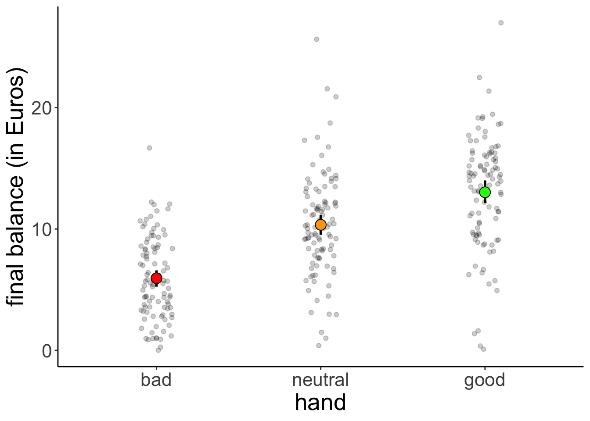
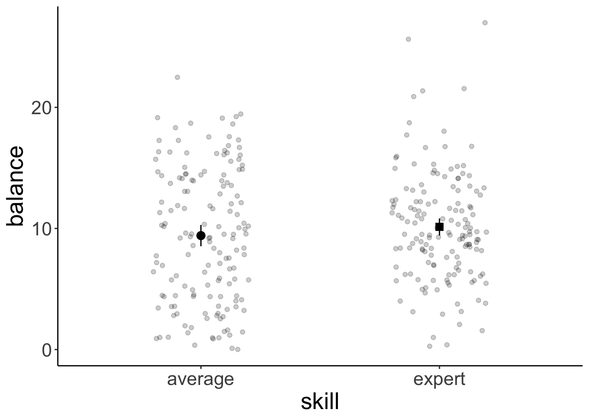
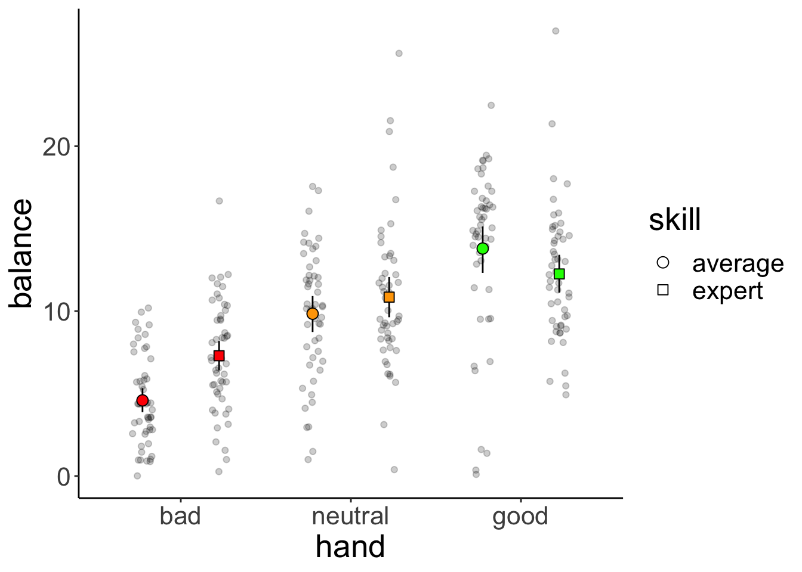
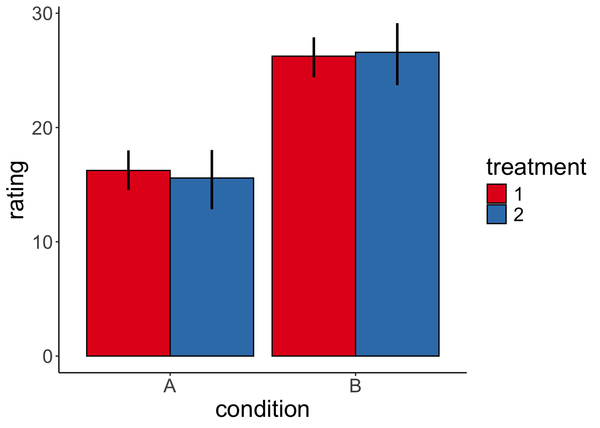
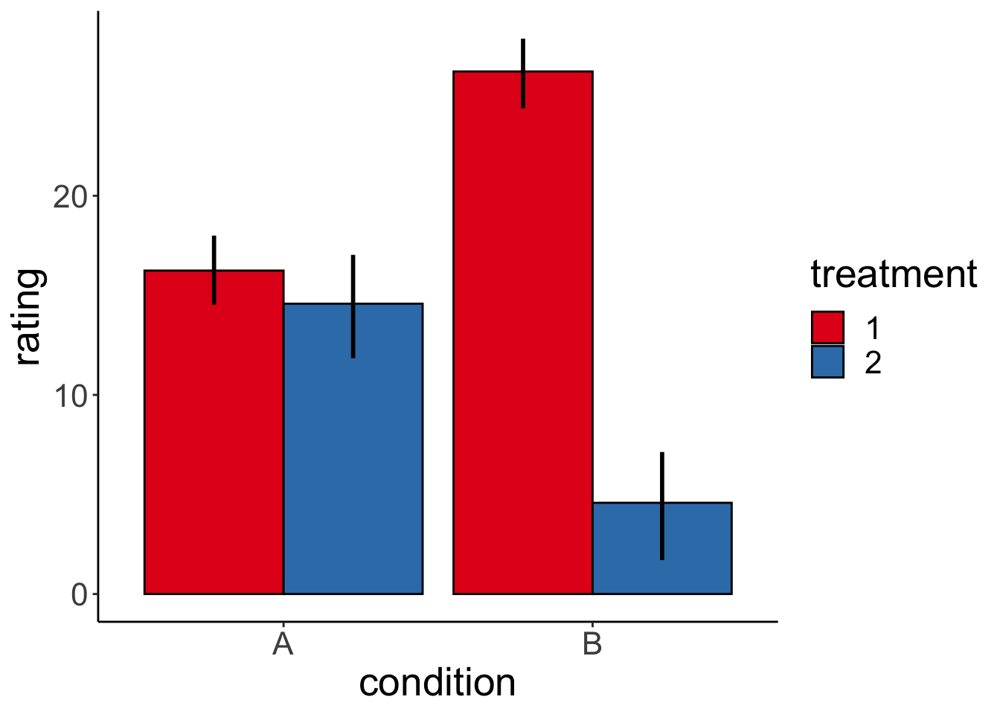
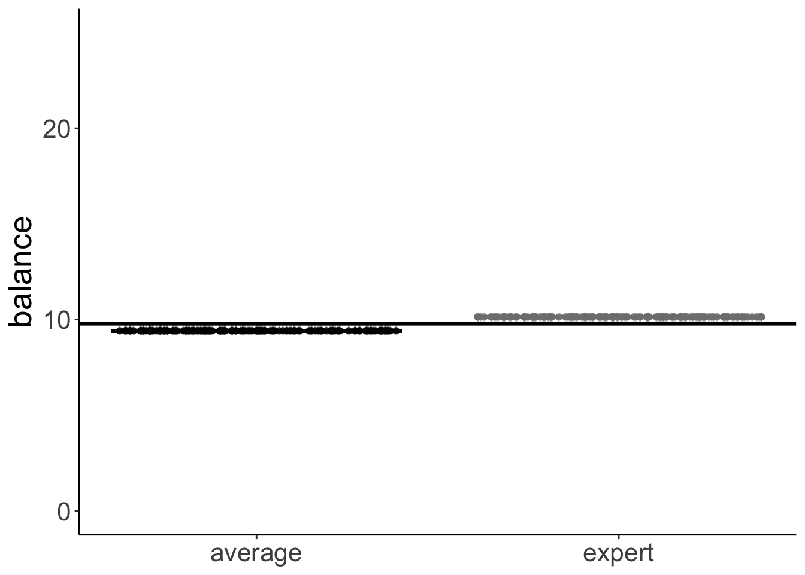

# Linear model 3

## Learning goals 

- Linear model with one multi-level categorical predictor (One-way ANOVA).
- Linear model with multiple categorical predictors (N-way ANOVA).
  - dummy-coding vs. effect-coding
  - planned contrasts 
- ANOVA with unbalanced designs

## Load packages and set plotting theme  


```r
library("knitr")      # for knitting RMarkdown 
library("kableExtra") # for making nice tables
library("janitor")    # for cleaning column names
library("broom")      # for tidying up linear models 
library("car")        # for running ANOVAs
library("afex")       # also for running ANOVAs
library("emmeans")    # for calculating constrasts
library("tidyverse")  # for wrangling, plotting, etc. 
```


```r
theme_set(theme_classic() + #set the theme 
            theme(text = element_text(size = 20))) #set the default text size

# these options here change the formatting of how comments are rendered
opts_chunk$set(comment = "",
               fig.show = "hold")

# include references for used packages
write_bib(.packages(), "packages.bib")

# suppress grouping warnings 
options(dplyr.summarise.inform = F)
```

## Load data sets 


```r
df.poker = read_csv("data/poker.csv") %>% 
  mutate(skill = factor(skill,
                        levels = 1:2,
                        labels = c("expert", "average")),
         skill = fct_relevel(skill, "average", "expert"),
         hand = factor(hand,
                       levels = 1:3,
                       labels = c("bad", "neutral", "good")),
         limit = factor(limit,
                        levels = 1:2,
                        labels = c("fixed", "none")),
         participant = 1:n()) %>% 
  select(participant, everything())

df.poker.unbalanced = df.poker %>% 
  filter(!participant %in% 1:10)
```

Selection of the data: 


```r
df.poker %>% 
  group_by(skill, hand, limit) %>% 
  filter(row_number() < 3) %>% 
  head(10) %>% 
  kable(digits = 2) %>% 
  kable_styling(bootstrap_options = "striped",
              full_width = F)
```

<table class="table table-striped" style="width: auto !important; margin-left: auto; margin-right: auto;">
 <thead>
  <tr>
   <th style="text-align:right;"> participant </th>
   <th style="text-align:left;"> skill </th>
   <th style="text-align:left;"> hand </th>
   <th style="text-align:left;"> limit </th>
   <th style="text-align:right;"> balance </th>
  </tr>
 </thead>
<tbody>
  <tr>
   <td style="text-align:right;"> 1 </td>
   <td style="text-align:left;"> expert </td>
   <td style="text-align:left;"> bad </td>
   <td style="text-align:left;"> fixed </td>
   <td style="text-align:right;"> 4.00 </td>
  </tr>
  <tr>
   <td style="text-align:right;"> 2 </td>
   <td style="text-align:left;"> expert </td>
   <td style="text-align:left;"> bad </td>
   <td style="text-align:left;"> fixed </td>
   <td style="text-align:right;"> 5.55 </td>
  </tr>
  <tr>
   <td style="text-align:right;"> 26 </td>
   <td style="text-align:left;"> expert </td>
   <td style="text-align:left;"> bad </td>
   <td style="text-align:left;"> none </td>
   <td style="text-align:right;"> 5.52 </td>
  </tr>
  <tr>
   <td style="text-align:right;"> 27 </td>
   <td style="text-align:left;"> expert </td>
   <td style="text-align:left;"> bad </td>
   <td style="text-align:left;"> none </td>
   <td style="text-align:right;"> 8.28 </td>
  </tr>
  <tr>
   <td style="text-align:right;"> 51 </td>
   <td style="text-align:left;"> expert </td>
   <td style="text-align:left;"> neutral </td>
   <td style="text-align:left;"> fixed </td>
   <td style="text-align:right;"> 11.74 </td>
  </tr>
  <tr>
   <td style="text-align:right;"> 52 </td>
   <td style="text-align:left;"> expert </td>
   <td style="text-align:left;"> neutral </td>
   <td style="text-align:left;"> fixed </td>
   <td style="text-align:right;"> 10.04 </td>
  </tr>
  <tr>
   <td style="text-align:right;"> 76 </td>
   <td style="text-align:left;"> expert </td>
   <td style="text-align:left;"> neutral </td>
   <td style="text-align:left;"> none </td>
   <td style="text-align:right;"> 21.55 </td>
  </tr>
  <tr>
   <td style="text-align:right;"> 77 </td>
   <td style="text-align:left;"> expert </td>
   <td style="text-align:left;"> neutral </td>
   <td style="text-align:left;"> none </td>
   <td style="text-align:right;"> 3.12 </td>
  </tr>
  <tr>
   <td style="text-align:right;"> 101 </td>
   <td style="text-align:left;"> expert </td>
   <td style="text-align:left;"> good </td>
   <td style="text-align:left;"> fixed </td>
   <td style="text-align:right;"> 10.86 </td>
  </tr>
  <tr>
   <td style="text-align:right;"> 102 </td>
   <td style="text-align:left;"> expert </td>
   <td style="text-align:left;"> good </td>
   <td style="text-align:left;"> fixed </td>
   <td style="text-align:right;"> 8.68 </td>
  </tr>
</tbody>
</table>

## One-way ANOVA

### Visualization 


```r
df.poker %>% 
  ggplot(mapping = aes(x = hand,
                       y = balance,
                       fill = hand)) + 
  geom_point(alpha = 0.2,
             position = position_jitter(height = 0, width = 0.1)) + 
  stat_summary(fun.data = "mean_cl_boot",
               geom = "linerange",
               size = 1) + 
  stat_summary(fun = "mean",
               geom = "point",
               shape = 21,
               size = 4) +
  labs(y = "final balance (in Euros)") + 
  scale_fill_manual(values = c("red", "orange", "green")) +
  theme(legend.position = "none")
```



### Model fitting 

We pass the result of the `lm()` function to `anova()` to calculate an analysis of variance like so: 


```r
lm(formula = balance ~ hand, 
   data = df.poker) %>% 
  anova()
```

```
Analysis of Variance Table

Response: balance
           Df Sum Sq Mean Sq F value    Pr(>F)    
hand        2 2559.4  1279.7  75.703 < 2.2e-16 ***
Residuals 297 5020.6    16.9                      
---
Signif. codes:  0 '***' 0.001 '**' 0.01 '*' 0.05 '.' 0.1 ' ' 1
```

### Hypothesis test 

The F-test reported by the ANOVA compares the fitted model with a compact model that only predicts the grand mean: 


```r
# fit the models 
fit_c = lm(formula = balance ~ 1, data = df.poker)
fit_a = lm(formula = balance ~ hand, data = df.poker)

# compare via F-test
anova(fit_c, fit_a)
```

```
Analysis of Variance Table

Model 1: balance ~ 1
Model 2: balance ~ hand
  Res.Df    RSS Df Sum of Sq      F    Pr(>F)    
1    299 7580.0                                  
2    297 5020.6  2    2559.4 75.703 < 2.2e-16 ***
---
Signif. codes:  0 '***' 0.001 '**' 0.01 '*' 0.05 '.' 0.1 ' ' 1
```

### Visualize the model's predictions 

Here is the model prediction of the compact model:


```r
set.seed(1)

df.plot = df.poker %>% 
  mutate(hand_jitter = 1 + runif(n(), min = -0.25, max = 0.25))

df.augment = fit_c %>% 
  augment() %>% 
  clean_names() %>% 
  bind_cols(df.plot %>% 
              select(hand, hand_jitter))

ggplot(data = df.plot, 
       mapping = aes(x = hand_jitter,
                     y = balance,
                     fill = hand)) + 
  geom_hline(yintercept = mean(df.poker$balance)) +
  geom_point(alpha = 0.5) + 
  geom_segment(data = df.augment,
               mapping = aes(xend = hand_jitter,
                             yend = fitted),
               alpha = 0.2) +
  labs(y = "balance") + 
  theme(legend.position = "none",
        axis.text.x = element_blank(),
        axis.title.x = element_blank())
```


> Note that since we have a categorical variable here, we don't really have a continuous x-axis. I've just jittered the values so it's easier to show the residuals. 

And here is the prediction of the augmented model (which predicts different means for each group).


```r
set.seed(1)

df.plot = df.poker %>% 
  mutate(hand_jitter = hand %>% as.numeric(),
         hand_jitter = hand_jitter + runif(n(), min = -0.4, max = 0.4))

df.tidy = fit_a %>% 
  tidy() %>% 
  select(where(is.numeric)) %>% 
  mutate(across(.fns = ~ round(., digits = 2)))

df.augment = fit_a %>% 
  augment() %>%
  clean_names() %>% 
  bind_cols(df.plot %>% 
              select(hand_jitter))

ggplot(data = df.plot,
       mapping = aes(x = hand_jitter,
                     y = balance,
                     color = hand)) + 
  geom_point(alpha = 0.8) +
  geom_segment(data = NULL,
               mapping = aes(x = 0.6,
                             xend = 1.4,
                             y = df.tidy$estimate[1],
                             yend = df.tidy$estimate[1]),
               color = "red",
               size = 1) +
  geom_segment(data = NULL,
               aes(x = 1.6,
                   xend = 2.4,
                   y = df.tidy$estimate[1] + df.tidy$estimate[2],
                   yend = df.tidy$estimate[1] + df.tidy$estimate[2]),
               color = "orange",
               size = 1) +
  geom_segment(data = NULL,
               aes(x = 2.6,
                   xend = 3.4,
                   y = df.tidy$estimate[1] + df.tidy$estimate[3],
                   yend = df.tidy$estimate[1] + df.tidy$estimate[3]),
               color = "green",
               size = 1) +
  geom_segment(data = df.augment,
               aes(xend = hand_jitter,
                   y = balance,
                   yend = fitted),
               alpha = 0.3) +
  labs(y = "balance") + 
  scale_color_manual(values = c("red", "orange", "green")) + 
  scale_x_continuous(breaks = 1:3, labels = c("bad", "neutral", "good")) + 
  theme(legend.position = "none",
        axis.title.x = element_blank())
```


The vertical lines illustrate the residual sum of squares. 

We can illustrate the model sum of squares like so: 


```r
set.seed(1)

df.plot = df.poker %>% 
  mutate(hand_jitter = hand %>% as.numeric(),
         hand_jitter = hand_jitter + runif(n(), min = -0.4, max = 0.4)) %>% 
  group_by(hand) %>% 
  mutate(mean_group = mean(balance)) %>% 
  ungroup() %>% 
  mutate(mean_grand = mean(balance))

df.means = df.poker %>% 
  group_by(hand) %>% 
  summarize(mean = mean(balance)) %>% 
  pivot_wider(names_from = hand, 
              values_from = mean)

ggplot(data = df.plot,
       mapping = aes(x = hand_jitter,
                     y = mean_group,
                     color = hand)) + 
  geom_point(alpha = 0.8) +
  geom_segment(data = NULL,
               mapping = aes(x = 0.6,
                             xend = 1.4,
                             y = df.means$bad,
                             yend = df.means$bad),
               color = "red",
               size = 1) +
  geom_segment(data = NULL,
               mapping = aes(x = 1.6,
                             xend = 2.4,
                             y = df.means$neutral,
                             yend = df.means$neutral),
               color = "orange",
               size = 1) +
  geom_segment(data = NULL,
               mapping = aes(x = 2.6,
                             xend = 3.4,
                             y = df.means$good,
                             yend = df.means$good),
               color = "green",
               size = 1) +
  geom_segment(mapping = aes(xend = hand_jitter,
                             y = mean_group,
                             yend = mean_grand),
               alpha = 0.3) +
  geom_hline(yintercept = mean(df.poker$balance),
             size = 1) + 
  labs(y = "balance") + 
  scale_color_manual(values = c("red", "orange", "green")) + 
  scale_x_continuous(breaks = 1:3, labels = c("bad", "neutral", "good")) + 
  scale_y_continuous(breaks = c(0, 10, 20), labels = c(0, 10, 20), limits = c(0, 25)) + 
  theme(legend.position = "none",
        axis.title.x = element_blank())
```


This captures the variance in the data that is accounted for by the `hand` variable. 

Just for kicks, let's calculate our cherished proportion of reduction in error PRE:


```r
df.c = fit_c %>% 
  augment() %>% 
  clean_names() %>% 
  summarize(sse = sum(resid^2) %>% round)

df.a = fit_a %>% 
  augment() %>% 
  clean_names() %>% 
  summarize(sse = sum(resid^2) %>% round)

pre = 1 - df.a$sse/df.c$sse
print(pre %>% round(2))
```

```
[1] 0.34
```
Note that this is the same as the $R^2$ for the augmented model: 


```r
fit_a %>% 
  summary()
```

```

Call:
lm(formula = balance ~ hand, data = df.poker)

Residuals:
     Min       1Q   Median       3Q      Max 
-12.9264  -2.5902  -0.0115   2.6573  15.2834 

Coefficients:
            Estimate Std. Error t value Pr(>|t|)    
(Intercept)   5.9415     0.4111  14.451  < 2e-16 ***
handneutral   4.4051     0.5815   7.576 4.55e-13 ***
handgood      7.0849     0.5815  12.185  < 2e-16 ***
---
Signif. codes:  0 '***' 0.001 '**' 0.01 '*' 0.05 '.' 0.1 ' ' 1

Residual standard error: 4.111 on 297 degrees of freedom
Multiple R-squared:  0.3377,	Adjusted R-squared:  0.3332 
F-statistic:  75.7 on 2 and 297 DF,  p-value: < 2.2e-16
```

### Dummy coding

Let's check that we understand how dummy-coding works for a variable with more than 2 levels: 


```r
# dummy code the hand variable
df.poker = df.poker %>% 
  mutate(hand_neutral = ifelse(hand == "neutral", 1, 0),
         hand_good = ifelse(hand == "good", 1, 0))

# show the dummy coded variables 
df.poker %>% 
  select(participant, contains("hand"), balance) %>% 
  group_by(hand) %>% 
  top_n(3) %>% 
  head(10) %>% 
  kable(digits = 3) %>% 
  kable_styling(bootstrap_options = "striped",
              full_width = F)
```

```
Selecting by balance
```

<table class="table table-striped" style="width: auto !important; margin-left: auto; margin-right: auto;">
 <thead>
  <tr>
   <th style="text-align:right;"> participant </th>
   <th style="text-align:left;"> hand </th>
   <th style="text-align:right;"> hand_neutral </th>
   <th style="text-align:right;"> hand_good </th>
   <th style="text-align:right;"> balance </th>
  </tr>
 </thead>
<tbody>
  <tr>
   <td style="text-align:right;"> 31 </td>
   <td style="text-align:left;"> bad </td>
   <td style="text-align:right;"> 0 </td>
   <td style="text-align:right;"> 0 </td>
   <td style="text-align:right;"> 12.22 </td>
  </tr>
  <tr>
   <td style="text-align:right;"> 46 </td>
   <td style="text-align:left;"> bad </td>
   <td style="text-align:right;"> 0 </td>
   <td style="text-align:right;"> 0 </td>
   <td style="text-align:right;"> 12.06 </td>
  </tr>
  <tr>
   <td style="text-align:right;"> 50 </td>
   <td style="text-align:left;"> bad </td>
   <td style="text-align:right;"> 0 </td>
   <td style="text-align:right;"> 0 </td>
   <td style="text-align:right;"> 16.68 </td>
  </tr>
  <tr>
   <td style="text-align:right;"> 76 </td>
   <td style="text-align:left;"> neutral </td>
   <td style="text-align:right;"> 1 </td>
   <td style="text-align:right;"> 0 </td>
   <td style="text-align:right;"> 21.55 </td>
  </tr>
  <tr>
   <td style="text-align:right;"> 87 </td>
   <td style="text-align:left;"> neutral </td>
   <td style="text-align:right;"> 1 </td>
   <td style="text-align:right;"> 0 </td>
   <td style="text-align:right;"> 20.89 </td>
  </tr>
  <tr>
   <td style="text-align:right;"> 89 </td>
   <td style="text-align:left;"> neutral </td>
   <td style="text-align:right;"> 1 </td>
   <td style="text-align:right;"> 0 </td>
   <td style="text-align:right;"> 25.63 </td>
  </tr>
  <tr>
   <td style="text-align:right;"> 127 </td>
   <td style="text-align:left;"> good </td>
   <td style="text-align:right;"> 0 </td>
   <td style="text-align:right;"> 1 </td>
   <td style="text-align:right;"> 26.99 </td>
  </tr>
  <tr>
   <td style="text-align:right;"> 129 </td>
   <td style="text-align:left;"> good </td>
   <td style="text-align:right;"> 0 </td>
   <td style="text-align:right;"> 1 </td>
   <td style="text-align:right;"> 21.36 </td>
  </tr>
  <tr>
   <td style="text-align:right;"> 283 </td>
   <td style="text-align:left;"> good </td>
   <td style="text-align:right;"> 0 </td>
   <td style="text-align:right;"> 1 </td>
   <td style="text-align:right;"> 22.48 </td>
  </tr>
</tbody>
</table>

```r
# fit the model
fit.tmp = lm(balance ~ 1 + hand_neutral + hand_good, df.poker)

# show the model summary 
fit.tmp %>% 
  summary()
```

```

Call:
lm(formula = balance ~ 1 + hand_neutral + hand_good, data = df.poker)

Residuals:
     Min       1Q   Median       3Q      Max 
-12.9264  -2.5902  -0.0115   2.6573  15.2834 

Coefficients:
             Estimate Std. Error t value Pr(>|t|)    
(Intercept)    5.9415     0.4111  14.451  < 2e-16 ***
hand_neutral   4.4051     0.5815   7.576 4.55e-13 ***
hand_good      7.0849     0.5815  12.185  < 2e-16 ***
---
Signif. codes:  0 '***' 0.001 '**' 0.01 '*' 0.05 '.' 0.1 ' ' 1

Residual standard error: 4.111 on 297 degrees of freedom
Multiple R-squared:  0.3377,	Adjusted R-squared:  0.3332 
F-statistic:  75.7 on 2 and 297 DF,  p-value: < 2.2e-16
```
Here, I've directly put the dummy-coded variables as predictors into the `lm()`. We get the same model as if we used the `hand` variable instead. 

### Follow up questions

Here are some follow up questions we may ask about the data. 

Are bad hands different from neutral hands? 


```r
df.poker %>% 
  filter(hand %in% c("bad", "neutral")) %>% 
  lm(formula = balance ~ hand, 
     data = .) %>% 
  summary()
```

```

Call:
lm(formula = balance ~ hand, data = .)

Residuals:
    Min      1Q  Median      3Q     Max 
-9.9566 -2.5078 -0.2365  2.4410 15.2834 

Coefficients:
            Estimate Std. Error t value Pr(>|t|)    
(Intercept)   5.9415     0.3816  15.570  < 2e-16 ***
handneutral   4.4051     0.5397   8.163 3.76e-14 ***
---
Signif. codes:  0 '***' 0.001 '**' 0.01 '*' 0.05 '.' 0.1 ' ' 1

Residual standard error: 3.816 on 198 degrees of freedom
Multiple R-squared:  0.2518,	Adjusted R-squared:  0.248 
F-statistic: 66.63 on 1 and 198 DF,  p-value: 3.758e-14
```

Are neutral hands different from good hands? 


```r
df.poker %>% 
  filter(hand %in% c("neutral", "good")) %>% 
  lm(formula = balance ~ hand, 
     data = .) %>% 
  summary()
```

```

Call:
lm(formula = balance ~ hand, data = .)

Residuals:
     Min       1Q   Median       3Q      Max 
-12.9264  -2.7141   0.2585   2.7184  15.2834 

Coefficients:
            Estimate Std. Error t value Pr(>|t|)    
(Intercept)  10.3466     0.4448   23.26  < 2e-16 ***
handgood      2.6798     0.6291    4.26 3.16e-05 ***
---
Signif. codes:  0 '***' 0.001 '**' 0.01 '*' 0.05 '.' 0.1 ' ' 1

Residual standard error: 4.448 on 198 degrees of freedom
Multiple R-squared:  0.08396,	Adjusted R-squared:  0.07933 
F-statistic: 18.15 on 1 and 198 DF,  p-value: 3.158e-05
```

Doing the same thing by recoding our hand factor and taking "neutral" to be the reference category:


```r
df.poker %>% 
  mutate(hand = fct_relevel(hand, "neutral")) %>% 
  lm(formula = balance ~ hand,
     data = .) %>% 
  summary()
```

```

Call:
lm(formula = balance ~ hand, data = .)

Residuals:
     Min       1Q   Median       3Q      Max 
-12.9264  -2.5902  -0.0115   2.6573  15.2834 

Coefficients:
            Estimate Std. Error t value Pr(>|t|)    
(Intercept)  10.3466     0.4111  25.165  < 2e-16 ***
handbad      -4.4051     0.5815  -7.576 4.55e-13 ***
handgood      2.6798     0.5815   4.609 6.02e-06 ***
---
Signif. codes:  0 '***' 0.001 '**' 0.01 '*' 0.05 '.' 0.1 ' ' 1

Residual standard error: 4.111 on 297 degrees of freedom
Multiple R-squared:  0.3377,	Adjusted R-squared:  0.3332 
F-statistic:  75.7 on 2 and 297 DF,  p-value: < 2.2e-16
```

### Variance decomposition

Let's first run the model 


```r
fit = lm(formula = balance ~ hand, 
         data = df.poker)

fit %>%
  anova()
```

```
Analysis of Variance Table

Response: balance
           Df Sum Sq Mean Sq F value    Pr(>F)    
hand        2 2559.4  1279.7  75.703 < 2.2e-16 ***
Residuals 297 5020.6    16.9                      
---
Signif. codes:  0 '***' 0.001 '**' 0.01 '*' 0.05 '.' 0.1 ' ' 1
```

#### Calculate sums of squares

And then let's make sure that we understand how the variance is broken down:  


```r
df.poker %>% 
  mutate(mean_grand = mean(balance)) %>% 
  group_by(hand) %>% 
  mutate(mean_group = mean(balance)) %>% 
  ungroup() %>% 
  summarize(variance_total = sum((balance - mean_grand)^2),
            variance_model = sum((mean_group - mean_grand)^2),
            variance_residual = variance_total - variance_model)
```

```
# A tibble: 1 x 3
  variance_total variance_model variance_residual
           <dbl>          <dbl>             <dbl>
1          7580.          2559.             5021.
```

#### Visualize model predictions 

##### Total variance


```r
set.seed(1)

fit_c = lm(formula = balance ~ 1,
           data = df.poker)

df.plot = df.poker %>% 
  mutate(hand_jitter = 1 + runif(n(), min = -0.25, max = 0.25))

df.augment = fit_c %>% 
  augment() %>% 
  clean_names() %>% 
  bind_cols(df.plot %>% select(hand, hand_jitter))

ggplot(data = df.plot, 
       mapping = aes(x = hand_jitter,
                       y = balance,
                       fill = hand)) + 
  geom_hline(yintercept = mean(df.poker$balance)) +
  geom_point(alpha = 0.5) + 
  geom_segment(data = df.augment,
               aes(xend = hand_jitter,
                   yend = fitted),
               alpha = 0.2) +
  labs(y = "balance") + 
  theme(legend.position = "none",
        axis.text.x = element_blank(),
        axis.title.x = element_blank())
```


##### Model variance


```r
set.seed(1)

df.plot = df.poker %>% 
  mutate(hand_jitter = hand %>% as.numeric(),
         hand_jitter = hand_jitter + runif(n(), min = -0.4, max = 0.4)) %>% 
  group_by(hand) %>% 
  mutate(mean_group = mean(balance)) %>% 
  ungroup() %>% 
  mutate(mean_grand = mean(balance))

df.means = df.poker %>% 
  group_by(hand) %>% 
  summarize(mean = mean(balance)) %>% 
  pivot_wider(names_from = hand,
              values_from = mean)

ggplot(data = df.plot,
       mapping = aes(x = hand_jitter,
                     y = mean_group,
                     color = hand)) + 
  geom_point(alpha = 0.8) +
  geom_segment(data = NULL,
               aes(x = 0.6,
                   xend = 1.4,
                   y = df.means$bad,
                   yend = df.means$bad),
               color = "red",
               size = 1) +
  geom_segment(data = NULL,
               aes(x = 1.6,
                   xend = 2.4,
                   y = df.means$neutral,
                   yend = df.means$neutral),
               color = "orange",
               size = 1) +
  geom_segment(data = NULL,
               aes(x = 2.6,
                   xend = 3.4,
                   y = df.means$good,
                   yend = df.means$good),
               color = "green",
               size = 1) +
  geom_segment(aes(xend = hand_jitter,
                   y = mean_group,
                   yend = mean_grand),
               alpha = 0.3) +
  geom_hline(yintercept = mean(df.poker$balance),
             size = 1) + 
  labs(y = "balance") + 
  scale_color_manual(values = c("red", "orange", "green")) + 
  scale_x_continuous(breaks = 1:3, labels = c("bad", "neutral", "good")) + 
  scale_y_continuous(breaks = c(0, 10, 20), labels = c(0, 10, 20), limits = c(0, 25)) + 
  theme(legend.position = "none",
        axis.title.x = element_blank())
```


##### Residual variance 


```r
set.seed(1)

fit_a = lm(formula = balance ~ hand,
           data = df.poker)

df.plot = df.poker %>% 
  mutate(hand_jitter = hand %>% as.numeric(),
         hand_jitter = hand_jitter + runif(n(), min = -0.4, max = 0.4))

df.tidy = fit_a %>% 
  tidy() %>% 
  select(where(is.numeric)) %>% 
  mutate(across(.fns = ~ round(., digits = 2)))

df.augment = fit_a %>% 
  augment() %>%
  clean_names() %>% 
  bind_cols(df.plot %>% select(hand_jitter))

ggplot(data = df.plot,
       mapping = aes(x = hand_jitter,
                     y = balance,
                     color = hand)) + 
  geom_point(alpha = 0.8) +
  geom_segment(data = NULL,
               aes(x = 0.6,
                   xend = 1.4,
                   y = df.tidy$estimate[1],
                   yend = df.tidy$estimate[1]),
               color = "red",
               size = 1) +
  geom_segment(data = NULL,
               aes(x = 1.6,
                   xend = 2.4,
                   y = df.tidy$estimate[1] + df.tidy$estimate[2],
                   yend = df.tidy$estimate[1] + df.tidy$estimate[2]),
               color = "orange",
               size = 1) +
  geom_segment(data = NULL,
               aes(x = 2.6,
                   xend = 3.4,
                   y = df.tidy$estimate[1] + df.tidy$estimate[3],
                   yend = df.tidy$estimate[1] + df.tidy$estimate[3]),
               color = "green",
               size = 1) +
  geom_segment(data = df.augment,
               aes(xend = hand_jitter,
                   y = balance,
                   yend = fitted),
               alpha = 0.3) +
  labs(y = "balance") + 
  scale_color_manual(values = c("red", "orange", "green")) + 
  scale_x_continuous(breaks = 1:3, labels = c("bad", "neutral", "good")) + 
  theme(legend.position = "none",
        axis.title.x = element_blank())
```


## Two-way ANOVA 

Now let's take a look at a case where we have multiple categorical predictors. 

### Visualization

Let's look at the overall effect of skill: 


```r
ggplot(data = df.poker,
       mapping = aes(x = skill,
                     y = balance)) +
  geom_point(position = position_jitter(width = 0.2,
                                             height = 0),
             alpha = 0.2) + 
  stat_summary(fun.data = "mean_cl_boot",
               geom = "linerange",
               color = "black",
               position = position_dodge(0.9)) + 
  stat_summary(fun = "mean",
               geom = "point",
               color = "black",
               position = position_dodge(0.9),
               aes(shape = skill),
               size = 3,
               fill = "black") +
  scale_shape_manual(values = c(21, 22)) +
  guides(shape = F)
```



And now let's take a look at the means for the full the 3 (hand) x 2 (skill) design:


```r
ggplot(data = df.poker,
       mapping = aes(x = hand,
                     y = balance,
                     group = skill,
                     fill = hand)) +
  geom_point(position = position_jitterdodge(jitter.width = 0.3,
                                             jitter.height = 0,
                                             dodge.width = 0.9),
             alpha = 0.2) + 
  stat_summary(fun.data = "mean_cl_boot",
               geom = "linerange",
               color = "black",
               position = position_dodge(0.9)) + 
  stat_summary(fun = "mean",
               geom = "point",
               aes(shape = skill),
               color = "black",
               position = position_dodge(0.9),
               size = 3) +
  scale_fill_manual(values = c("red", "orange", "green")) +
  scale_shape_manual(values = c(21, 22)) +
  guides(fill = F)
```



### Model fitting

For N-way ANOVAs, we need to be careful about what sums of squares we are using. The standard (based on the SPSS output) is to use type III sums of squares. We set this up in the following way: 


```r
lm(formula = balance ~ hand * skill,
   data = df.poker,
   contrasts = list(hand = "contr.sum",
                    skill = "contr.sum")) %>% 
  Anova(type = 3)
```

```
Anova Table (Type III tests)

Response: balance
             Sum Sq  Df   F value    Pr(>F)    
(Intercept) 28644.7   1 1772.1137 < 2.2e-16 ***
hand         2559.4   2   79.1692 < 2.2e-16 ***
skill          39.3   1    2.4344 0.1197776    
hand:skill    229.0   2    7.0830 0.0009901 ***
Residuals    4752.3 294                        
---
Signif. codes:  0 '***' 0.001 '**' 0.01 '*' 0.05 '.' 0.1 ' ' 1
```

So, we fit our linear model, but set the contrasts to "contr.sum" (which yields effect coding instead of dummy coding), and then specify the desired type of sums of squares in the `Anova()` function call.  

Alternatively, we could use the `afex` package and specify the ANOVA like so: 


```r
aov_ez(id = "participant",
       dv = "balance",
       data = df.poker,
       between = c("hand", "skill")
)
```

```
Contrasts set to contr.sum for the following variables: hand, skill
```

```
Anova Table (Type 3 tests)

Response: balance
      Effect     df   MSE         F  ges p.value
1       hand 2, 294 16.16 79.17 *** .350   <.001
2      skill 1, 294 16.16      2.43 .008    .120
3 hand:skill 2, 294 16.16  7.08 *** .046   <.001
---
Signif. codes:  0 '***' 0.001 '**' 0.01 '*' 0.05 '+' 0.1 ' ' 1
```

The `afex` package uses effect coding and type 3 sums of squares by default.

### Interpreting interactions 

Code I've used to generate the different plots in the competition: 


```r
set.seed(1)

b0 = 15
nsamples = 30
sd = 5

# simple effect of condition
b1 = 10
b2 = 1
b1_2 = 1

# two simple effects
# b1 = 5
# b2 = -5
# b1_2 = 0
 
# interaction effect
# b1 = 10
# b2 = 10
# b1_2 = -20

# interaction and simple effect
# b1 = 10
# b2 = 0
# b1_2 = -20

# all three
# b1 = 2
# b2 = 2
# b1_2 = 10

df.data = tibble(
  condition = rep(c(0, 1), each = nsamples),
  treatment = rep(c(0, 1), nsamples),
  rating = b0 + b1 * condition + b2 * treatment + (b1_2 * condition * treatment) + rnorm(nsamples, sd = sd)) %>%
  mutate(condition = factor(condition, labels = c("A", "B")),
  treatment = factor(treatment, labels = c("1", "2")))

ggplot(df.data,
       aes(x = condition,
           y = rating,
           group = treatment,
           fill = treatment)) + 
  stat_summary(fun = "mean",
               geom = "bar",
               color = "black",
               position = position_dodge(0.9)) +
  stat_summary(fun.data = "mean_cl_boot",
               geom = "linerange",
               size = 1,
               position = position_dodge(0.9)) +
  scale_fill_brewer(palette = "Set1")
```



And here is one specific example. Let's generate the data first: 


```r
# make example reproducible 
set.seed(1)

# set parameters
nsamples = 30

b0 = 15
b1 = 10 # simple effect of condition
b2 = 0 # simple effect of treatment
b1_2 = -20 # interaction effect
sd = 5

# generate data
df.data = tibble(
  condition = rep(c(0, 1), each = nsamples),
  treatment = rep(c(0, 1), nsamples),
  rating = b0 + 
    b1 * condition + 
    b2 * treatment + (b1_2 * condition * treatment) + 
    rnorm(nsamples, sd = sd)) %>%
  mutate(condition = factor(condition, labels = c("A", "B")),
  treatment = factor(treatment, labels = c("1", "2")))
```

Show part of the generated data frame: 


```r
# show data frame
df.data %>% 
  group_by(condition, treatment) %>% 
  filter(row_number() < 3) %>% 
  ungroup() %>% 
  kable(digits = 2) %>% 
  kable_styling(bootstrap_options = "striped",
                full_width = F)
```

<table class="table table-striped" style="width: auto !important; margin-left: auto; margin-right: auto;">
 <thead>
  <tr>
   <th style="text-align:left;"> condition </th>
   <th style="text-align:left;"> treatment </th>
   <th style="text-align:right;"> rating </th>
  </tr>
 </thead>
<tbody>
  <tr>
   <td style="text-align:left;"> A </td>
   <td style="text-align:left;"> 1 </td>
   <td style="text-align:right;"> 11.87 </td>
  </tr>
  <tr>
   <td style="text-align:left;"> A </td>
   <td style="text-align:left;"> 2 </td>
   <td style="text-align:right;"> 15.92 </td>
  </tr>
  <tr>
   <td style="text-align:left;"> A </td>
   <td style="text-align:left;"> 1 </td>
   <td style="text-align:right;"> 10.82 </td>
  </tr>
  <tr>
   <td style="text-align:left;"> A </td>
   <td style="text-align:left;"> 2 </td>
   <td style="text-align:right;"> 22.98 </td>
  </tr>
  <tr>
   <td style="text-align:left;"> B </td>
   <td style="text-align:left;"> 1 </td>
   <td style="text-align:right;"> 21.87 </td>
  </tr>
  <tr>
   <td style="text-align:left;"> B </td>
   <td style="text-align:left;"> 2 </td>
   <td style="text-align:right;"> 5.92 </td>
  </tr>
  <tr>
   <td style="text-align:left;"> B </td>
   <td style="text-align:left;"> 1 </td>
   <td style="text-align:right;"> 20.82 </td>
  </tr>
  <tr>
   <td style="text-align:left;"> B </td>
   <td style="text-align:left;"> 2 </td>
   <td style="text-align:right;"> 12.98 </td>
  </tr>
</tbody>
</table>

Plot the data:


```r
# plot data
ggplot(df.data,
       aes(x = condition,
           y = rating,
           group = treatment,
           fill = treatment)) + 
  stat_summary(fun = "mean",
               geom = "bar",
               color = "black",
               position = position_dodge(0.9)) +
  stat_summary(fun.data = "mean_cl_boot",
               geom = "linerange",
               size = 1,
               position = position_dodge(0.9)) +
  scale_fill_brewer(palette = "Set1")
```



And check whether we can successfully infer the parameters that we used to generate the data: 


```r
# infer parameters
lm(formula = rating ~ 1 + condition + treatment + condition:treatment,
   data = df.data) %>% 
  summary()
```

```

Call:
lm(formula = rating ~ 1 + condition + treatment + condition:treatment, 
    data = df.data)

Residuals:
     Min       1Q   Median       3Q      Max 
-10.6546  -3.6343   0.7988   3.3514   8.3953 

Coefficients:
                      Estimate Std. Error t value Pr(>|t|)    
(Intercept)             16.244      1.194  13.608  < 2e-16 ***
conditionB              10.000      1.688   5.924 2.02e-07 ***
treatment2              -1.662      1.688  -0.985    0.329    
conditionB:treatment2  -20.000      2.387  -8.378 1.86e-11 ***
---
Signif. codes:  0 '***' 0.001 '**' 0.01 '*' 0.05 '.' 0.1 ' ' 1

Residual standard error: 4.623 on 56 degrees of freedom
Multiple R-squared:  0.7473,	Adjusted R-squared:  0.7338 
F-statistic: 55.21 on 3 and 56 DF,  p-value: < 2.2e-16
```

### Variance decomposition

Let's fit the model first:


```r
fit = lm(formula = balance ~ hand * skill, 
         data = df.poker)

fit %>%
  anova()
```

```
Analysis of Variance Table

Response: balance
            Df Sum Sq Mean Sq F value    Pr(>F)    
hand         2 2559.4 1279.70 79.1692 < 2.2e-16 ***
skill        1   39.3   39.35  2.4344 0.1197776    
hand:skill   2  229.0  114.49  7.0830 0.0009901 ***
Residuals  294 4752.3   16.16                      
---
Signif. codes:  0 '***' 0.001 '**' 0.01 '*' 0.05 '.' 0.1 ' ' 1
```

#### Calculate sums of squares


```r
df.poker %>% 
  mutate(mean_grand = mean(balance)) %>% 
  group_by(skill) %>% 
  mutate(mean_skill = mean(balance)) %>%
  group_by(hand) %>% 
  mutate(mean_hand = mean(balance)) %>%
  ungroup() %>%
  summarize(variance_total = sum((balance - mean_grand)^2),
            variance_skill = sum((mean_skill - mean_grand)^2),
            variance_hand = sum((mean_hand - mean_grand)^2),
            variance_residual = variance_total - variance_skill - variance_hand)
```

```
# A tibble: 1 x 4
  variance_total variance_skill variance_hand variance_residual
           <dbl>          <dbl>         <dbl>             <dbl>
1          7580.           39.3         2559.             4981.
```

#### Visualize model predictions

##### `Skill` factor


```r
set.seed(1)

df.plot = df.poker %>% 
  mutate(skill_jitter = skill %>% as.numeric(),
         skill_jitter = skill_jitter + runif(n(), min = -0.4, max = 0.4)) %>% 
  group_by(skill) %>% 
  mutate(mean_group = mean(balance)) %>% 
  ungroup() %>% 
  mutate(mean_grand = mean(balance))
  
df.means = df.poker %>% 
  group_by(skill) %>% 
  summarize(mean = mean(balance)) %>% 
  pivot_wider(names_from = skill,
              values_from = mean)

ggplot(data = df.plot,
       mapping = aes(x = skill_jitter,
                       y = mean_group,
                       color = skill)) + 
  geom_point(alpha = 0.8) +
  geom_segment(data = NULL,
               aes(x = 0.6,
                   xend = 1.4,
                   y = df.means$average,
                   yend = df.means$average),
               color = "black",
               size = 1) +
  geom_segment(data = NULL,
               aes(x = 1.6,
                   xend = 2.4,
                   y = df.means$expert,
                   yend = df.means$expert),
               color = "gray50",
               size = 1) +
  geom_segment(aes(xend = skill_jitter,
                   y = mean_group,
                   yend = mean_grand),
               alpha = 0.3) +
  geom_hline(yintercept = mean(df.poker$balance),
             size = 1) + 
  labs(y = "balance") + 
  scale_color_manual(values = c("black", "gray50")) + 
  scale_x_continuous(breaks = 1:2, labels = c("average", "expert")) + 
  scale_y_continuous(breaks = c(0, 10, 20), labels = c(0, 10, 20), limits = c(0, 25)) +
  theme(legend.position = "none",
        axis.title.x = element_blank())
```



## Two-way ANOVA (with interaction)

Let's fit a two-way ANOVA with the interaction term. 


```r
fit = lm(formula = balance ~ hand * skill, data = df.poker)
fit %>% 
  anova()
```

```
Analysis of Variance Table

Response: balance
            Df Sum Sq Mean Sq F value    Pr(>F)    
hand         2 2559.4 1279.70 79.1692 < 2.2e-16 ***
skill        1   39.3   39.35  2.4344 0.1197776    
hand:skill   2  229.0  114.49  7.0830 0.0009901 ***
Residuals  294 4752.3   16.16                      
---
Signif. codes:  0 '***' 0.001 '**' 0.01 '*' 0.05 '.' 0.1 ' ' 1
```

And let's compute how the the sums of squares are decomposed:


```r
df.poker %>% 
  mutate(mean_grand = mean(balance)) %>% 
  group_by(skill) %>% 
  mutate(mean_skill = mean(balance)) %>% 
  group_by(hand) %>% 
  mutate(mean_hand = mean(balance)) %>%
  group_by(hand, skill) %>% 
  mutate(mean_hand_skill = mean(balance)) %>%
  ungroup() %>%
  summarize(variance_total = sum((balance - mean_grand)^2),
            variance_skill = sum((mean_skill - mean_grand)^2),
            variance_hand = sum((mean_hand - mean_grand)^2),
            variance_hand_skill = sum((mean_hand_skill - mean_skill - mean_hand + 
                                         mean_grand)^2),
            variance_residual = variance_total - variance_skill - variance_hand - 
              variance_hand_skill)
```

```
# A tibble: 1 x 5
  variance_total variance_skill variance_hand variance_hand_sk… variance_residu…
           <dbl>          <dbl>         <dbl>             <dbl>            <dbl>
1          7580.           39.3         2559.              229.            4752.
```
## ANOVA with unbalanced design

For the standard `anova()` function, the order of the independent predictors matters when the design is unbalanced. 


```r
# one order 
lm(formula = balance ~ skill + hand, 
         data = df.poker.unbalanced) %>% 
  anova()
```

```
Analysis of Variance Table

Response: balance
           Df Sum Sq Mean Sq F value  Pr(>F)    
skill       1   74.3   74.28  4.2904 0.03922 *  
hand        2 2385.1 1192.57 68.8827 < 2e-16 ***
Residuals 286 4951.5   17.31                    
---
Signif. codes:  0 '***' 0.001 '**' 0.01 '*' 0.05 '.' 0.1 ' ' 1
```

```r
# another order 
lm(formula = balance ~ hand + skill, 
         data = df.poker.unbalanced) %>% 
  anova()
```

```
Analysis of Variance Table

Response: balance
           Df Sum Sq Mean Sq F value Pr(>F)    
hand        2 2419.8 1209.92 69.8845 <2e-16 ***
skill       1   39.6   39.59  2.2867 0.1316    
Residuals 286 4951.5   17.31                   
---
Signif. codes:  0 '***' 0.001 '**' 0.01 '*' 0.05 '.' 0.1 ' ' 1
```

We should compute an ANOVA with type 3 sums of squares, and set the contrast to sum contrasts. 


```r
# one order
lm(formula = balance ~ hand + skill,
   data = df.poker.unbalanced,
   contrasts = list(hand = "contr.sum", 
                    skill = "contr.sum")) %>% 
  Anova(type = "3")
```

```
Anova Table (Type III tests)

Response: balance
             Sum Sq  Df   F value Pr(>F)    
(Intercept) 27629.1   1 1595.8482 <2e-16 ***
hand         2385.1   2   68.8827 <2e-16 ***
skill          39.6   1    2.2867 0.1316    
Residuals    4951.5 286                     
---
Signif. codes:  0 '***' 0.001 '**' 0.01 '*' 0.05 '.' 0.1 ' ' 1
```

```r
# another order
lm(formula = balance ~ skill + hand,
   data = df.poker.unbalanced,
   contrasts = list(hand = "contr.sum", 
                    skill = "contr.sum")) %>% 
  Anova(type = "3")
```

```
Anova Table (Type III tests)

Response: balance
             Sum Sq  Df   F value Pr(>F)    
(Intercept) 27629.1   1 1595.8482 <2e-16 ***
skill          39.6   1    2.2867 0.1316    
hand         2385.1   2   68.8827 <2e-16 ***
Residuals    4951.5 286                     
---
Signif. codes:  0 '***' 0.001 '**' 0.01 '*' 0.05 '.' 0.1 ' ' 1
```

Now, the order of the independent variables doesn't matter anymore. 

We can also use the `aov_ez()` function from the `afex` package. 


```r
lm(formula = balance ~ skill * hand,
   data = df.poker.unbalanced,
   contrasts = list(hand = "contr.sum", 
                    skill = "contr.sum")) %>% 
  Anova(type = "3")
```

```
Anova Table (Type III tests)

Response: balance
             Sum Sq  Df   F value    Pr(>F)    
(Intercept) 27781.3   1 1676.9096 < 2.2e-16 ***
skill          48.9   1    2.9540 0.0867525 .  
hand         2285.3   2   68.9729 < 2.2e-16 ***
skill:hand    246.5   2    7.4401 0.0007089 ***
Residuals    4705.0 284                        
---
Signif. codes:  0 '***' 0.001 '**' 0.01 '*' 0.05 '.' 0.1 ' ' 1
```

```r
fit = aov_ez(id = "participant",
             dv = "balance",
             data = df.poker.unbalanced,
             between = c("hand", "skill"))
```

```
Contrasts set to contr.sum for the following variables: hand, skill
```

```r
fit$Anova
```

```
Anova Table (Type III tests)

Response: dv
             Sum Sq  Df   F value    Pr(>F)    
(Intercept) 27781.3   1 1676.9096 < 2.2e-16 ***
hand         2285.3   2   68.9729 < 2.2e-16 ***
skill          48.9   1    2.9540 0.0867525 .  
hand:skill    246.5   2    7.4401 0.0007089 ***
Residuals    4705.0 284                        
---
Signif. codes:  0 '***' 0.001 '**' 0.01 '*' 0.05 '.' 0.1 ' ' 1
```

## Interpreting parameters (very important!)


```r
fit = lm(formula = balance ~ skill * hand,
         data = df.poker)

fit %>% 
  summary()
```

```

Call:
lm(formula = balance ~ skill * hand, data = df.poker)

Residuals:
     Min       1Q   Median       3Q      Max 
-13.6976  -2.4739   0.0348   2.4644  14.7806 

Coefficients:
                        Estimate Std. Error t value Pr(>|t|)    
(Intercept)               4.5866     0.5686   8.067 1.85e-14 ***
skillexpert               2.7098     0.8041   3.370 0.000852 ***
handneutral               5.2572     0.8041   6.538 2.75e-10 ***
handgood                  9.2110     0.8041  11.455  < 2e-16 ***
skillexpert:handneutral  -1.7042     1.1372  -1.499 0.135038    
skillexpert:handgood     -4.2522     1.1372  -3.739 0.000222 ***
---
Signif. codes:  0 '***' 0.001 '**' 0.01 '*' 0.05 '.' 0.1 ' ' 1

Residual standard error: 4.02 on 294 degrees of freedom
Multiple R-squared:  0.3731,	Adjusted R-squared:  0.3624 
F-statistic: 34.99 on 5 and 294 DF,  p-value: < 2.2e-16
```

> Important: The t-statistic for `skillexpert` is not telling us that there is a main effect of skill. Instead, it shows the difference between `skill = average` and `skill = expert` when all other predictors in the model are 0!!

Here, this parameter just captures whether there is a significant difference between average and skilled players **when they have a bad hand** (because that's the reference category here). Let's check that this is true. 


```r
df.poker %>% 
  group_by(skill, hand) %>% 
  summarize(mean = mean(balance)) %>% 
  filter(hand == "bad") %>% 
  pivot_wider(names_from = skill,
              values_from = mean) %>% 
  mutate(difference = expert - average)
```

```
# A tibble: 1 x 4
  hand  average expert difference
  <fct>   <dbl>  <dbl>      <dbl>
1 bad      4.59   7.30       2.71
```

We see here that the difference in balance between the average and expert players when they have a bad hand is 2.7098. This is the same value as the `skillexpert` parameter in the `summary()` table above, and the corresponding significance test captures whether this difference is significantly different from 0. It doesn't capture, whether there is an effect of skill overall! To test this, we need to do an analysis of variance (using the `Anova(type = 3)` function).

## Additional resources 

### Datacamp 

- [Statistical modeling 1](https://www.datacamp.com/courses/statistical-modeling-in-r-part-1)
- [Statistical modeling 2](https://www.datacamp.com/courses/statistical-modeling-in-r-part-2)
- [Correlation and regression](https://www.datacamp.com/courses/correlation-and-regression)

### Misc 

- [Explanation of different types of sums of squares](https://mcfromnz.wordpress.com/2011/03/02/anova-type-iiiiii-ss-explained/)

## Session info 

Information about this R session including which version of R was used, and what packages were loaded. 


```r
sessionInfo()
```

```
R version 4.0.3 (2020-10-10)
Platform: x86_64-apple-darwin17.0 (64-bit)
Running under: macOS Catalina 10.15.7

Matrix products: default
BLAS:   /Library/Frameworks/R.framework/Versions/4.0/Resources/lib/libRblas.dylib
LAPACK: /Library/Frameworks/R.framework/Versions/4.0/Resources/lib/libRlapack.dylib

locale:
[1] en_US.UTF-8/en_US.UTF-8/en_US.UTF-8/C/en_US.UTF-8/en_US.UTF-8

attached base packages:
[1] stats     graphics  grDevices utils     datasets  methods   base     

other attached packages:
 [1] forcats_0.5.1    stringr_1.4.0    dplyr_1.0.4      purrr_0.3.4     
 [5] readr_1.4.0      tidyr_1.1.2      tibble_3.0.6     ggplot2_3.3.3   
 [9] tidyverse_1.3.0  emmeans_1.5.3    afex_0.28-1      lme4_1.1-26     
[13] Matrix_1.3-2     car_3.0-10       carData_3.0-4    broom_0.7.3     
[17] janitor_2.1.0    kableExtra_1.3.1 knitr_1.31      

loaded via a namespace (and not attached):
  [1] TH.data_1.0-10      minqa_1.2.4         colorspace_2.0-0   
  [4] ellipsis_0.3.1      rio_0.5.16          htmlTable_2.1.0    
  [7] estimability_1.3    snakecase_0.11.0    base64enc_0.1-3    
 [10] fs_1.5.0            rstudioapi_0.13     farver_2.1.0       
 [13] fansi_0.4.2         mvtnorm_1.1-1       lubridate_1.7.9.2  
 [16] xml2_1.3.2          codetools_0.2-18    splines_4.0.3      
 [19] Formula_1.2-4       jsonlite_1.7.2      nloptr_1.2.2.2     
 [22] cluster_2.1.0       dbplyr_2.0.0        png_0.1-7          
 [25] compiler_4.0.3      httr_1.4.2          backports_1.2.1    
 [28] assertthat_0.2.1    cli_2.3.0           htmltools_0.5.1.1  
 [31] tools_4.0.3         lmerTest_3.1-3      coda_0.19-4        
 [34] gtable_0.3.0        glue_1.4.2          reshape2_1.4.4     
 [37] Rcpp_1.0.6          cellranger_1.1.0    vctrs_0.3.6        
 [40] nlme_3.1-151        xfun_0.21           ps_1.6.0           
 [43] openxlsx_4.2.3      rvest_0.3.6         lifecycle_1.0.0    
 [46] statmod_1.4.35      MASS_7.3-53         zoo_1.8-8          
 [49] scales_1.1.1        hms_1.0.0           parallel_4.0.3     
 [52] sandwich_3.0-0      RColorBrewer_1.1-2  yaml_2.2.1         
 [55] curl_4.3            gridExtra_2.3       rpart_4.1-15       
 [58] latticeExtra_0.6-29 stringi_1.5.3       highr_0.8          
 [61] checkmate_2.0.0     boot_1.3-26         zip_2.1.1          
 [64] rlang_0.4.10        pkgconfig_2.0.3     evaluate_0.14      
 [67] lattice_0.20-41     labeling_0.4.2      htmlwidgets_1.5.3  
 [70] tidyselect_1.1.0    plyr_1.8.6          magrittr_2.0.1     
 [73] bookdown_0.21       R6_2.5.0            generics_0.1.0     
 [76] Hmisc_4.4-2         multcomp_1.4-15     DBI_1.1.1          
 [79] pillar_1.4.7        haven_2.3.1         foreign_0.8-81     
 [82] withr_2.4.1         nnet_7.3-15         survival_3.2-7     
 [85] abind_1.4-5         modelr_0.1.8        crayon_1.4.1       
 [88] utf8_1.1.4          rmarkdown_2.6       jpeg_0.1-8.1       
 [91] grid_4.0.3          readxl_1.3.1        data.table_1.13.6  
 [94] reprex_1.0.0        digest_0.6.27       webshot_0.5.2      
 [97] xtable_1.8-4        numDeriv_2016.8-1.1 munsell_0.5.0      
[100] viridisLite_0.3.0  
```

## References
