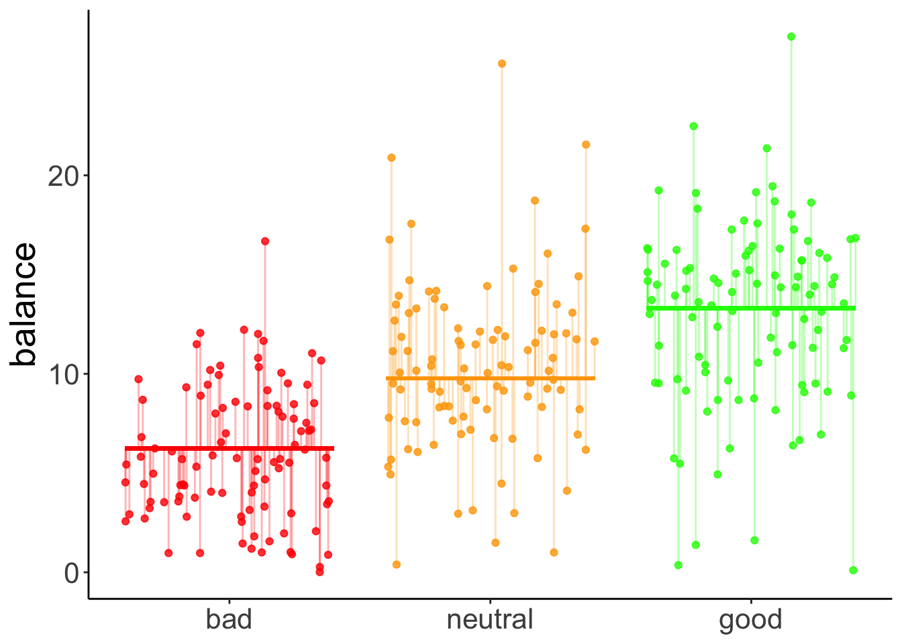

# Linear model 4

## Load packages and set plotting theme


```r
library("knitr")      # for knitting RMarkdown 
library("kableExtra") # for making nice tables
library("janitor")    # for cleaning column names
library("broom")      # for tidying up linear models 
library("afex")       # for running ANOVAs
library("emmeans")    # for calculating contrasts
library("car")        # for calculating ANOVAs
library("tidyverse")  # for wrangling, plotting, etc.
```


```r
theme_set(
  theme_classic() + #set the theme 
    theme(text = element_text(size = 20)) #set the default text size
)

# these options here change the formatting of how comments are rendered
opts_chunk$set(comment = "",
               fig.show = "hold")
```

## Load data sets

Read in the data:


```r
df.poker = read_csv("data/poker.csv") %>% 
  mutate(skill = factor(skill,
                        levels = 1:2,
                        labels = c("expert", "average")),
         skill = fct_relevel(skill, "average", "expert"),
         hand = factor(hand,
                       levels = 1:3,
                       labels = c("bad", "neutral", "good")),
         limit = factor(limit,
                        levels = 1:2,
                        labels = c("fixed", "none")),
         participant = 1:n()) %>% 
  select(participant, everything())

# creating an unbalanced data set by removing the first 10 participants 
df.poker.unbalanced = df.poker %>% 
  filter(!participant %in% 1:10)
```

## ANOVA with unbalanced design

For the standard `anova()` function, the order of the independent predictors matters when the design is unbalanced. 

There are two reasons for why this happens. 

1) In an unbalanced design, the predictors in the model aren't uncorrelated anymore. 
2) The standard `anova()` function computes Type I (sequential) sums of squares. 

Sequential sums of squares means that the predictors are added to the model in the order in which the are specified. 


```r
# one order 
lm(formula = balance ~ skill + hand, 
         data = df.poker.unbalanced) %>% 
  anova()
```

```
Analysis of Variance Table

Response: balance
           Df Sum Sq Mean Sq F value  Pr(>F)    
skill       1   74.3   74.28  4.2904 0.03922 *  
hand        2 2385.1 1192.57 68.8827 < 2e-16 ***
Residuals 286 4951.5   17.31                    
---
Signif. codes:  0 '***' 0.001 '**' 0.01 '*' 0.05 '.' 0.1 ' ' 1
```

```r
# another order 
lm(formula = balance ~ hand + skill, 
         data = df.poker.unbalanced) %>% 
  anova()
```

```
Analysis of Variance Table

Response: balance
           Df Sum Sq Mean Sq F value Pr(>F)    
hand        2 2419.8 1209.92 69.8845 <2e-16 ***
skill       1   39.6   39.59  2.2867 0.1316    
Residuals 286 4951.5   17.31                   
---
Signif. codes:  0 '***' 0.001 '**' 0.01 '*' 0.05 '.' 0.1 ' ' 1
```
We should compute an ANOVA with type 3 sums of squares, and set the contrast to sum contrasts. I like to use the `joint_tests()` function from the "emmeans" package for doing so. It does both of these things for us. 


```r
# one order
lm(formula = balance ~ hand * skill,
   data = df.poker.unbalanced) %>% 
  joint_tests()
```

```
 model term df1 df2 F.ratio p.value
 hand         2 284  68.973  <.0001
 skill        1 284   2.954  0.0868
 hand:skill   2 284   7.440  0.0007
```

```r
# another order
lm(formula = balance ~ skill + hand,
   data = df.poker.unbalanced) %>% 
  joint_tests()
```

```
 model term df1 df2 F.ratio p.value
 skill        1 286   2.287  0.1316
 hand         2 286  68.883  <.0001
```

Now, the order of the independent variables doesn't matter anymore. 

Alternatively,we can also use the `aov_ez()` function from the `afex` package. 


```r
lm(formula = balance ~ skill * hand,
   data = df.poker.unbalanced) %>% 
  joint_tests()
```

```
 model term df1 df2 F.ratio p.value
 skill        1 284   2.954  0.0868
 hand         2 284  68.973  <.0001
 skill:hand   2 284   7.440  0.0007
```

```r
fit = aov_ez(id = "participant",
             dv = "balance",
             data = df.poker.unbalanced,
             between = c("hand", "skill"))
```

```
Contrasts set to contr.sum for the following variables: hand, skill
```

```r
fit$Anova
```

```
Anova Table (Type III tests)

Response: dv
             Sum Sq  Df   F value    Pr(>F)    
(Intercept) 27781.3   1 1676.9096 < 2.2e-16 ***
hand         2285.3   2   68.9729 < 2.2e-16 ***
skill          48.9   1    2.9540 0.0867525 .  
hand:skill    246.5   2    7.4401 0.0007089 ***
Residuals    4705.0 284                        
---
Signif. codes:  0 '***' 0.001 '**' 0.01 '*' 0.05 '.' 0.1 ' ' 1
```

## Interpreting parameters (very important!)


```r
fit = lm(formula = balance ~ skill * hand,
         data = df.poker)

fit %>% 
  summary()
```

```

Call:
lm(formula = balance ~ skill * hand, data = df.poker)

Residuals:
     Min       1Q   Median       3Q      Max 
-13.6976  -2.4739   0.0348   2.4644  14.7806 

Coefficients:
                        Estimate Std. Error t value Pr(>|t|)    
(Intercept)               4.5866     0.5686   8.067 1.85e-14 ***
skillexpert               2.7098     0.8041   3.370 0.000852 ***
handneutral               5.2572     0.8041   6.538 2.75e-10 ***
handgood                  9.2110     0.8041  11.455  < 2e-16 ***
skillexpert:handneutral  -1.7042     1.1372  -1.499 0.135038    
skillexpert:handgood     -4.2522     1.1372  -3.739 0.000222 ***
---
Signif. codes:  0 '***' 0.001 '**' 0.01 '*' 0.05 '.' 0.1 ' ' 1

Residual standard error: 4.02 on 294 degrees of freedom
Multiple R-squared:  0.3731,	Adjusted R-squared:  0.3624 
F-statistic: 34.99 on 5 and 294 DF,  p-value: < 2.2e-16
```

> Important: The t-statistic for `skillexpert` is not telling us that there is a main effect of skill. Instead, it shows the difference between `skill = average` and `skill = expert` when all other predictors in the model are 0!!

Here, this parameter just captures whether there is a significant difference between average and skilled players **when they have a bad hand** (because that's the reference category here). Let's check that this is true. 


```r
df.poker %>% 
  group_by(skill, hand) %>% 
  summarize(mean = mean(balance)) %>% 
  filter(hand == "bad") %>% 
  pivot_wider(names_from = skill,
              values_from = mean) %>% 
  mutate(difference = expert - average)
```

```
`summarise()` has grouped output by 'skill'. You can override using the
`.groups` argument.
```

```
# A tibble: 1 × 4
  hand  average expert difference
  <fct>   <dbl>  <dbl>      <dbl>
1 bad      4.59   7.30       2.71
```

We see here that the difference in balance between the average and expert players when they have a bad hand is 2.7098. This is the same value as the `skillexpert` parameter in the `summary()` table above, and the corresponding significance test captures whether this difference is significantly different from 0. It doesn't capture, whether there is an effect of skill overall! To test this, we need to do an analysis of variance (using the `Anova(type = 3)` function).

## Linear contrasts

Here is a linear contrast that assumes that there is a linear relationship between the quality of one's hand, and the final balance.  


```r
df.poker = df.poker %>% 
  mutate(hand_contrast = factor(hand,
                                levels = c("bad", "neutral", "good"),
                                labels = c(-1, 0, 1)),
         hand_contrast = hand_contrast %>% 
           as.character() %>% 
           as.numeric())

fit.contrast = lm(formula = balance ~ hand_contrast,
                  data = df.poker)
```

Here is a visualization of the model prediction together with the residuals. 


```r
df.plot = df.poker %>% 
  mutate(hand_jitter = hand %>% as.numeric(),
         hand_jitter = hand_jitter + runif(n(), min = -0.4, max = 0.4))

df.tidy = fit.contrast %>% 
  tidy() %>% 
  select_if(is.numeric) %>% 
  mutate_all(~ round(., 2))

df.augment = fit.contrast %>% 
  augment() %>%
  clean_names() %>% 
  bind_cols(df.plot %>% select(hand_jitter))

ggplot(data = df.plot,
       mapping = aes(x = hand_jitter,
                       y = balance,
                       color = as.factor(hand_contrast))) + 
  geom_point(alpha = 0.8) +
  geom_segment(data = NULL,
               aes(x = 0.6,
                   xend = 1.4,
                   y = df.tidy$estimate[1]-df.tidy$estimate[2],
                   yend = df.tidy$estimate[1]-df.tidy$estimate[2]),
               color = "red",
               size = 1) +
  geom_segment(data = NULL,
               aes(x = 1.6,
                   xend = 2.4,
                   y = df.tidy$estimate[1],
                   yend = df.tidy$estimate[1]),
               color = "orange",
               size = 1) +
  geom_segment(data = NULL,
               aes(x = 2.6,
                   xend = 3.4,
                   y = df.tidy$estimate[1] + df.tidy$estimate[2],
                   yend = df.tidy$estimate[1] + df.tidy$estimate[2]),
               color = "green",
               size = 1) +
  geom_segment(data = df.augment,
               aes(xend = hand_jitter,
                   y = balance,
                   yend = fitted),
               alpha = 0.3) +
  labs(y = "balance") + 
  scale_color_manual(values = c("red", "orange", "green")) + 
  scale_x_continuous(breaks = 1:3, labels = c("bad", "neutral", "good")) + 
  theme(legend.position = "none",
        axis.title.x = element_blank())
```

```
Warning: Using `size` aesthetic for lines was deprecated in ggplot2 3.4.0.
ℹ Please use `linewidth` instead.
This warning is displayed once every 8 hours.
Call `lifecycle::last_lifecycle_warnings()` to see where this warning was generated.
```



### Hypothetical data

Here is some code to generate a hypothetical developmental data set. 


```r
# make example reproducible 
set.seed(1)

# means = c(5, 10, 5)
means = c(3, 5, 20)
# means = c(3, 5, 7)
# means = c(3, 7, 12)
sd = 2
sample_size = 20

# generate data 
df.development = tibble(
  group = rep(c("3-4", "5-6", "7-8"), each = sample_size),
  performance = NA) %>% 
  mutate(performance = ifelse(group == "3-4",
                              rnorm(sample_size,
                                    mean = means[1],
                                    sd = sd),
                              performance),
         performance = ifelse(group == "5-6",
                              rnorm(sample_size,
                                    mean = means[2],
                                    sd = sd),
                              performance),
         performance = ifelse(group == "7-8",
                              rnorm(sample_size,
                                    mean = means[3],
                                    sd = sd),
                              performance),
         group = factor(group, levels = c("3-4", "5-6", "7-8")),
         group_contrast = group %>% 
           fct_recode(`-1` = "3-4",
                      `0` = "5-6",
                      `1` = "7-8") %>% 
           as.character() %>%
           as.numeric())
```

Let's define a linear contrast using the `emmeans` package, and test whether it's significant. 


```r
fit = lm(formula = performance ~ group,
         data = df.development)

fit %>% 
  emmeans("group",
          contr = list(linear = c(-0.5, 0, 0.5)),
          adjust = "bonferroni") %>% 
  pluck("contrasts")
```

```
 contrast estimate    SE df t.ratio p.value
 linear       8.45 0.274 57  30.856  <.0001
```

Yes, we see that there is a significant positive linear contrast with an estimate of 8.45. This means, it predicts a difference of 8.45 in performance between each of the consecutive age groups. For a visualization of the predictions of this model, see Figure \@ref{fig:linear-contrast-model}. 

### Visualization

Total variance: 


```r
set.seed(1)

fit_c = lm(formula = performance ~ 1,
           data = df.development)

df.plot = df.development %>% 
  mutate(group_jitter = 1 + runif(n(),
                                  min = -0.25,
                                  max = 0.25))

df.augment = fit_c %>% 
  augment() %>% 
  clean_names() %>% 
  bind_cols(df.plot %>% select(group, group_jitter))

ggplot(data = df.plot, 
       mapping = aes(x = group_jitter,
                       y = performance,
                       fill = group)) + 
  geom_hline(yintercept = mean(df.development$performance)) +
  geom_point(alpha = 0.5) + 
  geom_segment(data = df.augment,
               aes(xend = group_jitter,
                   yend = fitted),
               alpha = 0.2) +
  labs(y = "performance") + 
  theme(legend.position = "none",
        axis.text.x = element_blank(),
        axis.title.x = element_blank())
```


With contrast


```r
# make example reproducible 
set.seed(1)

fit = lm(formula = performance ~ group_contrast,
         data = df.development)

df.plot = df.development %>% 
  mutate(group_jitter = group %>% as.numeric(),
         group_jitter = group_jitter + runif(n(), min = -0.4, max = 0.4))

df.tidy = fit %>% 
  tidy() %>% 
  select(where(is.numeric)) %>% 
  mutate(across(.fns = ~ round(. , 2)))
```

```
Warning: There was 1 warning in `mutate()`.
ℹ In argument: `across(.fns = ~round(., 2))`.
Caused by warning:
! Using `across()` without supplying `.cols` was deprecated in dplyr 1.1.0.
ℹ Please supply `.cols` instead.
```

```r
df.augment = fit %>% 
  augment() %>%
  clean_names() %>% 
  bind_cols(df.plot %>% select(group_jitter))

ggplot(data = df.plot,
       mapping = aes(x = group_jitter,
                       y = performance,
                       color = as.factor(group_contrast))) + 
  geom_point(alpha = 0.8) +
  geom_segment(data = NULL,
               aes(x = 0.6,
                   xend = 1.4,
                   y = df.tidy$estimate[1]-df.tidy$estimate[2],
                   yend = df.tidy$estimate[1]-df.tidy$estimate[2]),
               color = "red",
               size = 1) +
  geom_segment(data = NULL,
               aes(x = 1.6,
                   xend = 2.4,
                   y = df.tidy$estimate[1],
                   yend = df.tidy$estimate[1]),
               color = "orange",
               size = 1) +
  geom_segment(data = NULL,
               aes(x = 2.6,
                   xend = 3.4,
                   y = df.tidy$estimate[1] + df.tidy$estimate[2],
                   yend = df.tidy$estimate[1] + df.tidy$estimate[2]),
               color = "green",
               size = 1) +
  geom_segment(data = df.augment,
               aes(xend = group_jitter,
                   y = performance,
                   yend = fitted),
               alpha = 0.3) +
  labs(y = "performance") + 
  scale_color_manual(values = c("red", "orange", "green")) + 
  scale_x_continuous(breaks = 1:3, labels = levels(df.development$group)) +
  theme(legend.position = "none",
        axis.title.x = element_blank())
```

<div class="figure">

<p class="caption">(\#fig:linear-contrast-model)Predictions of the linear contrast model</p>
</div>

Results figure


```r
df.development %>% 
  ggplot(mapping = aes(x = group,
                       y = performance)) + 
  geom_point(alpha = 0.3, 
             position = position_jitter(width = 0.1,
                                        height = 0)) +
  stat_summary(fun.data = "mean_cl_boot",
               shape = 21, 
               fill = "white",
               size = 0.75)
```


Here we test some more specific hypotheses: the the two youngest groups of children are different from the oldest group, and that the 3 year olds are different from the 5 year olds. 


```r
#  fit the linear model 
fit = lm(formula = performance ~ group,
         data = df.development)

# check factor levels 
levels(df.development$group)
```

```
[1] "3-4" "5-6" "7-8"
```

```r
# define the contrasts of interest 
contrasts = list(young_vs_old = c(-0.5, -0.5, 1),
                 three_vs_five = c(-0.5, 0.5, 0))

# compute significance test on contrasts 
fit %>% 
  emmeans("group",
          contr = contrasts,
          adjust = "bonferroni") %>% 
  pluck("contrasts")
```

```
 contrast      estimate    SE df t.ratio p.value
 young_vs_old    16.094 0.474 57  33.936  <.0001
 three_vs_five    0.803 0.274 57   2.933  0.0097

P value adjustment: bonferroni method for 2 tests 
```

### Post-hoc tests

Post-hoc tests for a single predictor (using the poker data set). 


```r
fit = lm(formula = balance ~ hand,
         data = df.poker)

# post hoc tests 
fit %>% 
  emmeans(pairwise ~ hand,
          adjust = "bonferroni") %>% 
  pluck("contrasts")
```

```
 contrast       estimate    SE  df t.ratio p.value
 bad - neutral     -4.41 0.581 297  -7.576  <.0001
 bad - good        -7.08 0.581 297 -12.185  <.0001
 neutral - good    -2.68 0.581 297  -4.609  <.0001

P value adjustment: bonferroni method for 3 tests 
```

Post-hoc tests for two predictors (:


```r
# fit the model
fit = lm(formula = balance ~ hand + skill,
         data = df.poker)

# post hoc tests 
fit %>% 
  emmeans(pairwise ~ hand + skill,
          adjust = "bonferroni") %>% 
  pluck("contrasts")
```

```
 contrast                         estimate    SE  df t.ratio p.value
 bad average - neutral average      -4.405 0.580 296  -7.593  <.0001
 bad average - good average         -7.085 0.580 296 -12.212  <.0001
 bad average - bad expert           -0.724 0.474 296  -1.529  1.0000
 bad average - neutral expert       -5.129 0.749 296  -6.849  <.0001
 bad average - good expert          -7.809 0.749 296 -10.427  <.0001
 neutral average - good average     -2.680 0.580 296  -4.619  0.0001
 neutral average - bad expert        3.681 0.749 296   4.914  <.0001
 neutral average - neutral expert   -0.724 0.474 296  -1.529  1.0000
 neutral average - good expert      -3.404 0.749 296  -4.545  0.0001
 good average - bad expert           6.361 0.749 296   8.492  <.0001
 good average - neutral expert       1.955 0.749 296   2.611  0.1424
 good average - good expert         -0.724 0.474 296  -1.529  1.0000
 bad expert - neutral expert        -4.405 0.580 296  -7.593  <.0001
 bad expert - good expert           -7.085 0.580 296 -12.212  <.0001
 neutral expert - good expert       -2.680 0.580 296  -4.619  0.0001

P value adjustment: bonferroni method for 15 tests 
```


```r
fit = lm(formula = balance ~ hand,
         data = df.poker)

# comparing each to the mean 
fit %>% 
  emmeans(eff ~ hand) %>% 
  pluck("contrasts")
```

```
 contrast       estimate    SE  df t.ratio p.value
 bad effect       -3.830 0.336 297 -11.409  <.0001
 neutral effect    0.575 0.336 297   1.713  0.0877
 good effect       3.255 0.336 297   9.696  <.0001

P value adjustment: fdr method for 3 tests 
```

```r
# one vs. all others 
fit %>% 
  emmeans(del.eff ~ hand) %>% 
  pluck("contrasts")
```

```
 contrast       estimate    SE  df t.ratio p.value
 bad effect       -5.745 0.504 297 -11.409  <.0001
 neutral effect    0.863 0.504 297   1.713  0.0877
 good effect       4.882 0.504 297   9.696  <.0001

P value adjustment: fdr method for 3 tests 
```

### Understanding dummy coding


```r
fit = lm(formula = balance ~ 1 + hand,
         data = df.poker)

fit %>% 
  summary()
```

```

Call:
lm(formula = balance ~ 1 + hand, data = df.poker)

Residuals:
     Min       1Q   Median       3Q      Max 
-12.9264  -2.5902  -0.0115   2.6573  15.2834 

Coefficients:
            Estimate Std. Error t value Pr(>|t|)    
(Intercept)   5.9415     0.4111  14.451  < 2e-16 ***
handneutral   4.4051     0.5815   7.576 4.55e-13 ***
handgood      7.0849     0.5815  12.185  < 2e-16 ***
---
Signif. codes:  0 '***' 0.001 '**' 0.01 '*' 0.05 '.' 0.1 ' ' 1

Residual standard error: 4.111 on 297 degrees of freedom
Multiple R-squared:  0.3377,	Adjusted R-squared:  0.3332 
F-statistic:  75.7 on 2 and 297 DF,  p-value: < 2.2e-16
```

```r
model.matrix(fit) %>% 
  as_tibble() %>% 
  distinct()
```

```
# A tibble: 3 × 3
  `(Intercept)` handneutral handgood
          <dbl>       <dbl>    <dbl>
1             1           0        0
2             1           1        0
3             1           0        1
```

```r
df.poker %>% 
  select(participant, hand, balance) %>% 
  group_by(hand) %>% 
  top_n(3, wt = -participant) %>% 
  kable(digits = 2) %>% 
  kable_styling(bootstrap_options = "striped",
                full_width = F)
```

<table class="table table-striped" style="width: auto !important; margin-left: auto; margin-right: auto;">
 <thead>
  <tr>
   <th style="text-align:right;"> participant </th>
   <th style="text-align:left;"> hand </th>
   <th style="text-align:right;"> balance </th>
  </tr>
 </thead>
<tbody>
  <tr>
   <td style="text-align:right;"> 1 </td>
   <td style="text-align:left;"> bad </td>
   <td style="text-align:right;"> 4.00 </td>
  </tr>
  <tr>
   <td style="text-align:right;"> 2 </td>
   <td style="text-align:left;"> bad </td>
   <td style="text-align:right;"> 5.55 </td>
  </tr>
  <tr>
   <td style="text-align:right;"> 3 </td>
   <td style="text-align:left;"> bad </td>
   <td style="text-align:right;"> 9.45 </td>
  </tr>
  <tr>
   <td style="text-align:right;"> 51 </td>
   <td style="text-align:left;"> neutral </td>
   <td style="text-align:right;"> 11.74 </td>
  </tr>
  <tr>
   <td style="text-align:right;"> 52 </td>
   <td style="text-align:left;"> neutral </td>
   <td style="text-align:right;"> 10.04 </td>
  </tr>
  <tr>
   <td style="text-align:right;"> 53 </td>
   <td style="text-align:left;"> neutral </td>
   <td style="text-align:right;"> 9.49 </td>
  </tr>
  <tr>
   <td style="text-align:right;"> 101 </td>
   <td style="text-align:left;"> good </td>
   <td style="text-align:right;"> 10.86 </td>
  </tr>
  <tr>
   <td style="text-align:right;"> 102 </td>
   <td style="text-align:left;"> good </td>
   <td style="text-align:right;"> 8.68 </td>
  </tr>
  <tr>
   <td style="text-align:right;"> 103 </td>
   <td style="text-align:left;"> good </td>
   <td style="text-align:right;"> 14.36 </td>
  </tr>
</tbody>
</table>

### Understanding sum coding


```r
fit = lm(formula = balance ~ 1 + hand,
         contrasts = list(hand = "contr.sum"),
         data = df.poker)

fit %>% 
  summary()
```

```

Call:
lm(formula = balance ~ 1 + hand, data = df.poker, contrasts = list(hand = "contr.sum"))

Residuals:
     Min       1Q   Median       3Q      Max 
-12.9264  -2.5902  -0.0115   2.6573  15.2834 

Coefficients:
            Estimate Std. Error t value Pr(>|t|)    
(Intercept)   9.7715     0.2374  41.165   <2e-16 ***
hand1        -3.8300     0.3357 -11.409   <2e-16 ***
hand2         0.5751     0.3357   1.713   0.0877 .  
---
Signif. codes:  0 '***' 0.001 '**' 0.01 '*' 0.05 '.' 0.1 ' ' 1

Residual standard error: 4.111 on 297 degrees of freedom
Multiple R-squared:  0.3377,	Adjusted R-squared:  0.3332 
F-statistic:  75.7 on 2 and 297 DF,  p-value: < 2.2e-16
```

```r
model.matrix(fit) %>% 
  as_tibble() %>% 
  distinct() %>% 
  kable(digits = 2) %>% 
  kable_styling(bootstrap_options = "striped",
                full_width = F)
```

<table class="table table-striped" style="width: auto !important; margin-left: auto; margin-right: auto;">
 <thead>
  <tr>
   <th style="text-align:right;"> (Intercept) </th>
   <th style="text-align:right;"> hand1 </th>
   <th style="text-align:right;"> hand2 </th>
  </tr>
 </thead>
<tbody>
  <tr>
   <td style="text-align:right;"> 1 </td>
   <td style="text-align:right;"> 1 </td>
   <td style="text-align:right;"> 0 </td>
  </tr>
  <tr>
   <td style="text-align:right;"> 1 </td>
   <td style="text-align:right;"> 0 </td>
   <td style="text-align:right;"> 1 </td>
  </tr>
  <tr>
   <td style="text-align:right;"> 1 </td>
   <td style="text-align:right;"> -1 </td>
   <td style="text-align:right;"> -1 </td>
  </tr>
</tbody>
</table>

## Additional resources

### Misc

- [Overview of different regression models in R](https://strengejacke.github.io/regressionmodels/?s=09)

## Session info

Information about this R session including which version of R was used, and what packages were loaded. 


```r
sessionInfo()
```

```
R version 4.3.2 (2023-10-31)
Platform: aarch64-apple-darwin20 (64-bit)
Running under: macOS Sonoma 14.1.2

Matrix products: default
BLAS:   /Library/Frameworks/R.framework/Versions/4.3-arm64/Resources/lib/libRblas.0.dylib 
LAPACK: /Library/Frameworks/R.framework/Versions/4.3-arm64/Resources/lib/libRlapack.dylib;  LAPACK version 3.11.0

locale:
[1] en_US.UTF-8/en_US.UTF-8/en_US.UTF-8/C/en_US.UTF-8/en_US.UTF-8

time zone: America/Los_Angeles
tzcode source: internal

attached base packages:
[1] stats     graphics  grDevices utils     datasets  methods   base     

other attached packages:
 [1] lubridate_1.9.3  forcats_1.0.0    stringr_1.5.1    dplyr_1.1.4     
 [5] purrr_1.0.2      readr_2.1.4      tidyr_1.3.0      tibble_3.2.1    
 [9] ggplot2_3.4.4    tidyverse_2.0.0  car_3.1-2        carData_3.0-5   
[13] emmeans_1.9.0    afex_1.3-0       lme4_1.1-35.1    Matrix_1.6-4    
[17] broom_1.0.5      janitor_2.2.0    kableExtra_1.3.4 knitr_1.45      

loaded via a namespace (and not attached):
 [1] tidyselect_1.2.0    viridisLite_0.4.2   farver_2.1.1       
 [4] fastmap_1.1.1       rpart_4.1.23        digest_0.6.33      
 [7] timechange_0.2.0    estimability_1.4.1  lifecycle_1.0.4    
[10] cluster_2.1.6       magrittr_2.0.3      compiler_4.3.2     
[13] Hmisc_5.1-1         rlang_1.1.2         sass_0.4.8         
[16] tools_4.3.2         utf8_1.2.4          yaml_2.3.8         
[19] data.table_1.14.10  htmlwidgets_1.6.4   labeling_0.4.3     
[22] bit_4.0.5           plyr_1.8.9          xml2_1.3.6         
[25] abind_1.4-5         foreign_0.8-86      withr_2.5.2        
[28] numDeriv_2016.8-1.1 nnet_7.3-19         grid_4.3.2         
[31] fansi_1.0.6         xtable_1.8-4        colorspace_2.1-0   
[34] scales_1.3.0        MASS_7.3-60         cli_3.6.2          
[37] mvtnorm_1.2-4       rmarkdown_2.25      crayon_1.5.2       
[40] generics_0.1.3      rstudioapi_0.15.0   httr_1.4.7         
[43] reshape2_1.4.4      tzdb_0.4.0          minqa_1.2.6        
[46] cachem_1.0.8        splines_4.3.2       rvest_1.0.3        
[49] parallel_4.3.2      base64enc_0.1-3     vctrs_0.6.5        
[52] boot_1.3-28.1       webshot_0.5.5       jsonlite_1.8.8     
[55] bookdown_0.37       hms_1.1.3           bit64_4.0.5        
[58] htmlTable_2.4.2     Formula_1.2-5       systemfonts_1.0.5  
[61] jquerylib_0.1.4     glue_1.6.2          nloptr_2.0.3       
[64] stringi_1.8.3       gtable_0.3.4        lmerTest_3.1-3     
[67] munsell_0.5.0       pillar_1.9.0        htmltools_0.5.7    
[70] R6_2.5.1            vroom_1.6.5         evaluate_0.23      
[73] lattice_0.22-5      highr_0.10          backports_1.4.1    
[76] snakecase_0.11.1    bslib_0.6.1         Rcpp_1.0.11        
[79] checkmate_2.3.1     gridExtra_2.3       svglite_2.1.3      
[82] coda_0.19-4         nlme_3.1-164        xfun_0.41          
[85] pkgconfig_2.0.3    
```


