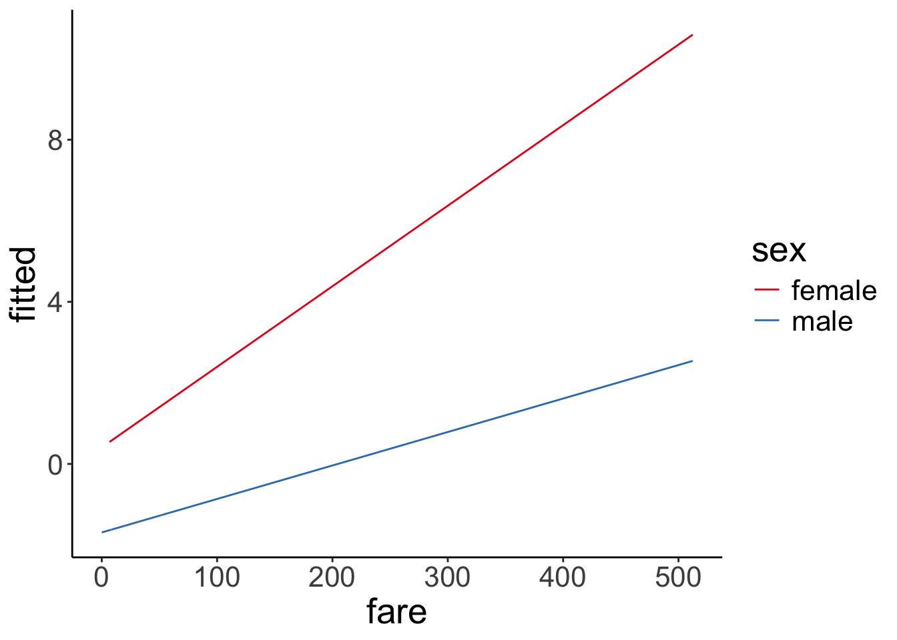

# Generalized linear model

## Learning goals

- Logistic regression. 
- Logit transform. 
- Fitting a logistic regression in R.
- Visualizing and interpreting model predictions. 
- Simulating data from a logistic regression. 
- Assessing model fit. 
- Testing hypotheses. 
- Reporting results.

## Load packages and set plotting theme


``` r
library("knitr")      # for knitting RMarkdown 
library("titanic")    # titanic dataset
library("kableExtra") # for making nice tables
library("janitor")    # for cleaning column names
library("broom")      # for tidying up linear models 
library("lme4")       # for linear mixed effects models
library("boot")       # for bootstrapping (also has an inverse logit function)
library("ggeffects")  # for computing marginal effects 
library("afex")       # for significance testing of mixed effects models 
library("emmeans")    # for the joint_tests() function
library("tidyverse")  # for wrangling, plotting, etc. 
```


``` r
theme_set(theme_classic() + #set the theme 
    theme(text = element_text(size = 20))) #set the default text size

opts_chunk$set(comment = "",
               fig.show = "hold")
```

## Load data set


``` r
df.titanic = titanic_train %>% 
  clean_names() %>% 
  mutate(sex = as.factor(sex))
```

Let's take a quick look at the data: 


``` r
df.titanic %>% 
  glimpse()
```

```
Rows: 891
Columns: 12
$ passenger_id <int> 1, 2, 3, 4, 5, 6, 7, 8, 9, 10, 11, 12, 13, 14, 15, 16, 17…
$ survived     <int> 0, 1, 1, 1, 0, 0, 0, 0, 1, 1, 1, 1, 0, 0, 0, 1, 0, 1, 0, …
$ pclass       <int> 3, 1, 3, 1, 3, 3, 1, 3, 3, 2, 3, 1, 3, 3, 3, 2, 3, 2, 3, …
$ name         <chr> "Braund, Mr. Owen Harris", "Cumings, Mrs. John Bradley (F…
$ sex          <fct> male, female, female, female, male, male, male, male, fem…
$ age          <dbl> 22, 38, 26, 35, 35, NA, 54, 2, 27, 14, 4, 58, 20, 39, 14,…
$ sib_sp       <int> 1, 1, 0, 1, 0, 0, 0, 3, 0, 1, 1, 0, 0, 1, 0, 0, 4, 0, 1, …
$ parch        <int> 0, 0, 0, 0, 0, 0, 0, 1, 2, 0, 1, 0, 0, 5, 0, 0, 1, 0, 0, …
$ ticket       <chr> "A/5 21171", "PC 17599", "STON/O2. 3101282", "113803", "3…
$ fare         <dbl> 7.2500, 71.2833, 7.9250, 53.1000, 8.0500, 8.4583, 51.8625…
$ cabin        <chr> "", "C85", "", "C123", "", "", "E46", "", "", "", "G6", "…
$ embarked     <chr> "S", "C", "S", "S", "S", "Q", "S", "S", "S", "C", "S", "S…
```


``` r
# Table of the first 10 entries
df.titanic %>% 
  head(10) %>% 
  kable(digits = 2) %>% 
  kable_styling(bootstrap_options = "striped",
                full_width = F)
```

<table class="table table-striped" style="width: auto !important; margin-left: auto; margin-right: auto;">
 <thead>
  <tr>
   <th style="text-align:right;"> passenger_id </th>
   <th style="text-align:right;"> survived </th>
   <th style="text-align:right;"> pclass </th>
   <th style="text-align:left;"> name </th>
   <th style="text-align:left;"> sex </th>
   <th style="text-align:right;"> age </th>
   <th style="text-align:right;"> sib_sp </th>
   <th style="text-align:right;"> parch </th>
   <th style="text-align:left;"> ticket </th>
   <th style="text-align:right;"> fare </th>
   <th style="text-align:left;"> cabin </th>
   <th style="text-align:left;"> embarked </th>
  </tr>
 </thead>
<tbody>
  <tr>
   <td style="text-align:right;"> 1 </td>
   <td style="text-align:right;"> 0 </td>
   <td style="text-align:right;"> 3 </td>
   <td style="text-align:left;"> Braund, Mr. Owen Harris </td>
   <td style="text-align:left;"> male </td>
   <td style="text-align:right;"> 22 </td>
   <td style="text-align:right;"> 1 </td>
   <td style="text-align:right;"> 0 </td>
   <td style="text-align:left;"> A/5 21171 </td>
   <td style="text-align:right;"> 7.25 </td>
   <td style="text-align:left;">  </td>
   <td style="text-align:left;"> S </td>
  </tr>
  <tr>
   <td style="text-align:right;"> 2 </td>
   <td style="text-align:right;"> 1 </td>
   <td style="text-align:right;"> 1 </td>
   <td style="text-align:left;"> Cumings, Mrs. John Bradley (Florence Briggs Thayer) </td>
   <td style="text-align:left;"> female </td>
   <td style="text-align:right;"> 38 </td>
   <td style="text-align:right;"> 1 </td>
   <td style="text-align:right;"> 0 </td>
   <td style="text-align:left;"> PC 17599 </td>
   <td style="text-align:right;"> 71.28 </td>
   <td style="text-align:left;"> C85 </td>
   <td style="text-align:left;"> C </td>
  </tr>
  <tr>
   <td style="text-align:right;"> 3 </td>
   <td style="text-align:right;"> 1 </td>
   <td style="text-align:right;"> 3 </td>
   <td style="text-align:left;"> Heikkinen, Miss. Laina </td>
   <td style="text-align:left;"> female </td>
   <td style="text-align:right;"> 26 </td>
   <td style="text-align:right;"> 0 </td>
   <td style="text-align:right;"> 0 </td>
   <td style="text-align:left;"> STON/O2. 3101282 </td>
   <td style="text-align:right;"> 7.92 </td>
   <td style="text-align:left;">  </td>
   <td style="text-align:left;"> S </td>
  </tr>
  <tr>
   <td style="text-align:right;"> 4 </td>
   <td style="text-align:right;"> 1 </td>
   <td style="text-align:right;"> 1 </td>
   <td style="text-align:left;"> Futrelle, Mrs. Jacques Heath (Lily May Peel) </td>
   <td style="text-align:left;"> female </td>
   <td style="text-align:right;"> 35 </td>
   <td style="text-align:right;"> 1 </td>
   <td style="text-align:right;"> 0 </td>
   <td style="text-align:left;"> 113803 </td>
   <td style="text-align:right;"> 53.10 </td>
   <td style="text-align:left;"> C123 </td>
   <td style="text-align:left;"> S </td>
  </tr>
  <tr>
   <td style="text-align:right;"> 5 </td>
   <td style="text-align:right;"> 0 </td>
   <td style="text-align:right;"> 3 </td>
   <td style="text-align:left;"> Allen, Mr. William Henry </td>
   <td style="text-align:left;"> male </td>
   <td style="text-align:right;"> 35 </td>
   <td style="text-align:right;"> 0 </td>
   <td style="text-align:right;"> 0 </td>
   <td style="text-align:left;"> 373450 </td>
   <td style="text-align:right;"> 8.05 </td>
   <td style="text-align:left;">  </td>
   <td style="text-align:left;"> S </td>
  </tr>
  <tr>
   <td style="text-align:right;"> 6 </td>
   <td style="text-align:right;"> 0 </td>
   <td style="text-align:right;"> 3 </td>
   <td style="text-align:left;"> Moran, Mr. James </td>
   <td style="text-align:left;"> male </td>
   <td style="text-align:right;"> NA </td>
   <td style="text-align:right;"> 0 </td>
   <td style="text-align:right;"> 0 </td>
   <td style="text-align:left;"> 330877 </td>
   <td style="text-align:right;"> 8.46 </td>
   <td style="text-align:left;">  </td>
   <td style="text-align:left;"> Q </td>
  </tr>
  <tr>
   <td style="text-align:right;"> 7 </td>
   <td style="text-align:right;"> 0 </td>
   <td style="text-align:right;"> 1 </td>
   <td style="text-align:left;"> McCarthy, Mr. Timothy J </td>
   <td style="text-align:left;"> male </td>
   <td style="text-align:right;"> 54 </td>
   <td style="text-align:right;"> 0 </td>
   <td style="text-align:right;"> 0 </td>
   <td style="text-align:left;"> 17463 </td>
   <td style="text-align:right;"> 51.86 </td>
   <td style="text-align:left;"> E46 </td>
   <td style="text-align:left;"> S </td>
  </tr>
  <tr>
   <td style="text-align:right;"> 8 </td>
   <td style="text-align:right;"> 0 </td>
   <td style="text-align:right;"> 3 </td>
   <td style="text-align:left;"> Palsson, Master. Gosta Leonard </td>
   <td style="text-align:left;"> male </td>
   <td style="text-align:right;"> 2 </td>
   <td style="text-align:right;"> 3 </td>
   <td style="text-align:right;"> 1 </td>
   <td style="text-align:left;"> 349909 </td>
   <td style="text-align:right;"> 21.08 </td>
   <td style="text-align:left;">  </td>
   <td style="text-align:left;"> S </td>
  </tr>
  <tr>
   <td style="text-align:right;"> 9 </td>
   <td style="text-align:right;"> 1 </td>
   <td style="text-align:right;"> 3 </td>
   <td style="text-align:left;"> Johnson, Mrs. Oscar W (Elisabeth Vilhelmina Berg) </td>
   <td style="text-align:left;"> female </td>
   <td style="text-align:right;"> 27 </td>
   <td style="text-align:right;"> 0 </td>
   <td style="text-align:right;"> 2 </td>
   <td style="text-align:left;"> 347742 </td>
   <td style="text-align:right;"> 11.13 </td>
   <td style="text-align:left;">  </td>
   <td style="text-align:left;"> S </td>
  </tr>
  <tr>
   <td style="text-align:right;"> 10 </td>
   <td style="text-align:right;"> 1 </td>
   <td style="text-align:right;"> 2 </td>
   <td style="text-align:left;"> Nasser, Mrs. Nicholas (Adele Achem) </td>
   <td style="text-align:left;"> female </td>
   <td style="text-align:right;"> 14 </td>
   <td style="text-align:right;"> 1 </td>
   <td style="text-align:right;"> 0 </td>
   <td style="text-align:left;"> 237736 </td>
   <td style="text-align:right;"> 30.07 </td>
   <td style="text-align:left;">  </td>
   <td style="text-align:left;"> C </td>
  </tr>
</tbody>
</table>

## Logistic regression

Let's see if we can predict whether or not a passenger survived based on the price of their ticket. 

Let's run a simple regression first: 


``` r
# fit a linear model 
fit.lm = lm(formula = survived ~ 1 + fare,
            data = df.titanic)

# summarize the results
fit.lm %>% 
  summary()
```

```

Call:
lm(formula = survived ~ 1 + fare, data = df.titanic)

Residuals:
    Min      1Q  Median      3Q     Max 
-0.9653 -0.3391 -0.3222  0.6044  0.6973 

Coefficients:
             Estimate Std. Error t value Pr(>|t|)    
(Intercept) 0.3026994  0.0187849  16.114  < 2e-16 ***
fare        0.0025195  0.0003174   7.939 6.12e-15 ***
---
Signif. codes:  0 '***' 0.001 '**' 0.01 '*' 0.05 '.' 0.1 ' ' 1

Residual standard error: 0.4705 on 889 degrees of freedom
Multiple R-squared:  0.06621,	Adjusted R-squared:  0.06516 
F-statistic: 63.03 on 1 and 889 DF,  p-value: 6.12e-15
```

Look's like `fare` is a significant predictor of whether or not a person survived. Let's visualize the model's predictions:


``` r
ggplot(data = df.titanic,
       mapping = aes(x = fare,
                     y = survived)) + 
  geom_smooth(method = "lm") + 
  geom_point() +
  labs(y = "survived")
```


This doesn't look good! The model predicts intermediate values of `survived` (which doesn't make sense given that a person either survived or didn't survive). Furthermore, the model predicts values greater than 1 for fares greather than ~ 300.  

Let's run a logistic regression instead. 


``` r
# fit a logistic regression 
fit.glm = glm(formula = survived ~ 1 + fare,
              family = "binomial",
              data = df.titanic)

fit.glm %>% 
  summary()
```

```

Call:
glm(formula = survived ~ 1 + fare, family = "binomial", data = df.titanic)

Coefficients:
             Estimate Std. Error z value Pr(>|z|)    
(Intercept) -0.941330   0.095129  -9.895  < 2e-16 ***
fare         0.015197   0.002232   6.810 9.79e-12 ***
---
Signif. codes:  0 '***' 0.001 '**' 0.01 '*' 0.05 '.' 0.1 ' ' 1

(Dispersion parameter for binomial family taken to be 1)

    Null deviance: 1186.7  on 890  degrees of freedom
Residual deviance: 1117.6  on 889  degrees of freedom
AIC: 1121.6

Number of Fisher Scoring iterations: 4
```

And let's visualize the predictions of the logistic regression: 


``` r
ggplot(data = df.titanic,
       mapping = aes(x = fare,
                     y = survived)) + 
  geom_smooth(method = "glm",
              method.args = list(family = "binomial")) +
  geom_point() +
  labs(y = "p(survived)")
```


Much better! Note that we've changed the interpretation of our dependent variable. We are now predicting the _probability that a person survived_ based on their fare. The model now only predicts values between 0 and 1. To achieve this, we apply a logit transform to the outcome variable like so: 

$$
\ln(\frac{\pi_i}{1-\pi_i}) = b_0 + b_1 \cdot X_i + e_i
$$
where $\pi_i$ is the probability of passenger $i$ having survived. Importantly, this affects our interpretation of the model parameters. They are now defined in log-odds, and can apply an inverse logit transformation to turn this back into a probability: 

With

$$
\pi = P(Y = 1)
$$
and the logit transformation 

$$
\ln(\frac{\pi}{1-\pi}) = V,
$$
where $V$ is just a placeholder for our linear model formula, we can go back to $\pi$ through the inverse logit transformation like so: 

$$
\pi = \frac{e^V}{1 + e^V}
$$
In R, we can use `log(x)` to calculate the natural logarithm $\ln(x)$, and `exp(x)` to calculate `e^x`. 

### Interpreting the parameters


``` r
fit.glm %>% 
  summary()
```

```

Call:
glm(formula = survived ~ 1 + fare, family = "binomial", data = df.titanic)

Coefficients:
             Estimate Std. Error z value Pr(>|z|)    
(Intercept) -0.941330   0.095129  -9.895  < 2e-16 ***
fare         0.015197   0.002232   6.810 9.79e-12 ***
---
Signif. codes:  0 '***' 0.001 '**' 0.01 '*' 0.05 '.' 0.1 ' ' 1

(Dispersion parameter for binomial family taken to be 1)

    Null deviance: 1186.7  on 890  degrees of freedom
Residual deviance: 1117.6  on 889  degrees of freedom
AIC: 1121.6

Number of Fisher Scoring iterations: 4
```

The estimate for the intercept and fare are in log-odds. 

Let's take a look at the linear model's predictions in log-odds space. 


``` r
df.plot = fit.glm %>% 
  augment() %>% 
  clean_names()

ggplot(data = df.plot,
       mapping = aes(x = fare,
                     y = fitted)) + 
  geom_line()
```


Nice, looks like a good old linear model. But what's the y-axis here? It's in log-odds (buh!). This is difficult to interpret. Let's transform the y-axis back to probabilities to make it easier to see what's going on. 


``` r
ggplot(data = df.plot,
       mapping = aes(x = fare,
                     y = inv.logit(fitted))) + 
  geom_line()
```


Great! Now the y-axis is back in probability space. We used the inverse logit function `inv.logit()` to transfer to log-odds back into probabilities. 

Let's check what the intercept of our model is in probability space: 


``` r
fit.glm %>% 
  pluck(coefficients, 1) %>% 
  inv.logit()
```

```
[1] 0.2806318
```

Here, we see that the intercept is $p = 0.28$. That is, the predicted chance of survival for someone who didn't pay any fare at all is 28% according to the model. Interpreting the slope is a little more tricky. Let's look at a situation first where we have a binary predictor. 


#### Logit transform

Here is a visualization of what the odds and log odds transformation look like.


``` r
# going from probabilities to odds (ranges from 0 to +infinity)
ggplot(data = tibble(x = seq(0, 1, 0.1)),
       mapping = aes(x = x)) + 
  stat_function(fun = ~ ./(1 - .),
                size = 1)
```

```
Warning: Using `size` aesthetic for lines was deprecated in ggplot2 3.4.0.
ℹ Please use `linewidth` instead.
This warning is displayed once every 8 hours.
Call `lifecycle::last_lifecycle_warnings()` to see where this warning was generated.
```

``` r
# going from probabilities to log odds (ranges from -infinity to +infinity)
ggplot(data = tibble(x = seq(0, 1, 0.1)),
       mapping = aes(x = x)) + 
  stat_function(fun = ~ log(./(1 - .)),
                size = 1)
```


### Binary predictor

Let's see whether the probability of survival differed between male and female passengers. 


``` r
fit.glm2 = glm(formula = survived ~ 1 + sex,
               family = "binomial",
               data = df.titanic)

fit.glm2 %>% 
  summary()
```

```

Call:
glm(formula = survived ~ 1 + sex, family = "binomial", data = df.titanic)

Coefficients:
            Estimate Std. Error z value Pr(>|z|)    
(Intercept)   1.0566     0.1290   8.191 2.58e-16 ***
sexmale      -2.5137     0.1672 -15.036  < 2e-16 ***
---
Signif. codes:  0 '***' 0.001 '**' 0.01 '*' 0.05 '.' 0.1 ' ' 1

(Dispersion parameter for binomial family taken to be 1)

    Null deviance: 1186.7  on 890  degrees of freedom
Residual deviance:  917.8  on 889  degrees of freedom
AIC: 921.8

Number of Fisher Scoring iterations: 4
```

It looks like it did! Let's visualize: 


``` r
df.titanic %>% 
  mutate(survived = factor(survived, labels = c("died", "survived"))) %>% 
  ggplot(data = .,
         mapping = aes(x = sex,
                       fill = survived)) +
  geom_bar(position = "fill",
           color = "black") +
  scale_fill_brewer(palette = "Set1")  +
  labs(x = "",
       fill = "",
       y = "probability")
```


And let's interpret the parameters by applying the inverse logit transform. To get the prediction for female passengers we get 

$$
\widehat{\ln(\frac{\pi_i}{1-\pi_i})} = b_0 + b_1 \cdot \text{sex}_i = b_0 + b_1 \cdot 0 = b_0
$$
since we dummy coded the predictor and female is our reference category. To get the predicted probability of survival for women we do the logit transform: 

$$
\pi = \frac{e^{b_0}}{1 + e^{b_0}}
$$
The predicted probability is: 


``` r
fit.glm2 %>% 
  pluck(coefficients, 1) %>% 
  inv.logit()
```

```
[1] 0.7420382
```

To get the prediction for male passengers we have: 

$$
\widehat{\ln(\frac{\pi_i}{1-\pi_i})} = b_0 + b_1 \cdot \text{sex}_i = b_0 + b_1 \cdot 1 = b_0 + b_1
$$
Applying the logit transform like so

$$
\pi = \frac{e^{b_0 + b_1}}{1 + e^{b_0 + b_1}}
$$

The predicted probability of male passengers surviving is: 


``` r
fit.glm2 %>% 
  pluck(coefficients) %>% 
  sum() %>% 
  inv.logit()
```

```
[1] 0.1889081
```

Here is the same information in a table: 


``` r
df.titanic %>% 
  count(sex, survived) %>% 
  mutate(p = n / sum(n)) %>% 
  group_by(sex) %>% 
  mutate(`p(survived|sex)` = p / sum(p))
```

```
# A tibble: 4 × 5
# Groups:   sex [2]
  sex    survived     n      p `p(survived|sex)`
  <fct>     <int> <int>  <dbl>             <dbl>
1 female        0    81 0.0909             0.258
2 female        1   233 0.262              0.742
3 male          0   468 0.525              0.811
4 male          1   109 0.122              0.189
```

### Continuous predictor

To interpret the predictions when a continuous predictor is involved, it's easiest to consider a few concrete cases. Here, I use the `augment()` function from the "broom" package to get the model's predictions for some values of interest: 


``` r
fit.glm %>% 
  augment(newdata = tibble(fare = c(0, 10, 50, 100, 500))) %>% 
  clean_names() %>% 
  select(fare, prediction = fitted) %>% 
  mutate(`p(survival)` = inv.logit(prediction))
```

```
# A tibble: 5 × 3
   fare prediction `p(survival)`
  <dbl>      <dbl>         <dbl>
1     0     -0.941         0.281
2    10     -0.789         0.312
3    50     -0.181         0.455
4   100      0.578         0.641
5   500      6.66          0.999
```

### Several predictors

Let's fit a logistic regression that predicts the probability of survival based both on the passenger's sex and what fare they paid (allowing for an interaction of the two predictors): 


``` r
fit.glm3 = glm(formula = survived ~ 1 + sex * fare,
               family = "binomial",
               data = df.titanic)

fit.glm3 %>% 
  summary()
```

```

Call:
glm(formula = survived ~ 1 + sex * fare, family = "binomial", 
    data = df.titanic)

Coefficients:
              Estimate Std. Error z value Pr(>|z|)    
(Intercept)   0.408428   0.189999   2.150 0.031584 *  
sexmale      -2.099345   0.230291  -9.116  < 2e-16 ***
fare          0.019878   0.005372   3.701 0.000215 ***
sexmale:fare -0.011617   0.005934  -1.958 0.050252 .  
---
Signif. codes:  0 '***' 0.001 '**' 0.01 '*' 0.05 '.' 0.1 ' ' 1

(Dispersion parameter for binomial family taken to be 1)

    Null deviance: 1186.66  on 890  degrees of freedom
Residual deviance:  879.85  on 887  degrees of freedom
AIC: 887.85

Number of Fisher Scoring iterations: 5
```

Make sure not to interpret the significance test on the coefficients here as main effects. Based on this summary table, you cannot say whether there is a significant difference between male vs. female passenger in their probability of survival. What coefficient for `sexmale` captures is whether there is a significant difference between male and female passengers who paid a fare of 0. That is, it's the predicted difference between the reference category (female) and the other category (male) when all other predictors are 0. 

Let's visualize the model predictions: 


``` r
ggplot(data = df.titanic,
       mapping = aes(x = fare,
                     y = survived,
                     color = sex)) +
  geom_point(alpha = 0.1, size = 2) + 
  geom_smooth(method = "glm",
              method.args = list(family = "binomial"),
              alpha = 0.2,
              aes(fill = sex)) +
  scale_color_brewer(palette = "Set1")
```


Just for kicks, to get a better sense for what the interaction looks like, here is the visualization in log-odds space: 


``` r
fit.glm3 %>% 
  augment() %>% 
  clean_names() %>% 
  ggplot(data = .,
         mapping = aes(x = fare,
                       color = sex,
                       y = fitted)) + 
  geom_line() + 
  scale_color_brewer(palette = "Set1")
```




Let's see how large the difference between genders is once we take into account how much each person paid for the fair:


``` r
ggpredict(fit.glm3,
          terms = c("sex"))
```

```
# Predicted probabilities of survived

sex    | Predicted |     95% CI
-------------------------------
female |      0.74 | 0.69, 0.79
male   |      0.19 | 0.16, 0.23

Adjusted for:
* fare = 32.20
```


We notice that there is one outlier who was male and paid a $500 fare (or maybe this is a mistake in the data entry?!). Let's remove this outlier and see what happens: 


``` r
fit.glm3_no_outlier = glm(formula = survived ~ 1 + sex * fare,
                          family = "binomial",
                          data = df.titanic %>% 
                            filter(fare < 500))

fit.glm3_no_outlier %>% 
  summary()
```

```

Call:
glm(formula = survived ~ 1 + sex * fare, family = "binomial", 
    data = df.titanic %>% filter(fare < 500))

Coefficients:
              Estimate Std. Error z value Pr(>|z|)    
(Intercept)   0.408436   0.190019   2.149 0.031598 *  
sexmale      -2.085344   0.232260  -8.979  < 2e-16 ***
fare          0.019878   0.005373   3.699 0.000216 ***
sexmale:fare -0.012178   0.006066  -2.008 0.044688 *  
---
Signif. codes:  0 '***' 0.001 '**' 0.01 '*' 0.05 '.' 0.1 ' ' 1

(Dispersion parameter for binomial family taken to be 1)

    Null deviance: 1180.89  on 887  degrees of freedom
Residual deviance:  879.51  on 884  degrees of freedom
AIC: 887.51

Number of Fisher Scoring iterations: 5
```

``` r
df.titanic %>% 
  filter(fare < 500) %>% 
  mutate(sex = as.factor(sex)) %>% 
  ggplot(data = .,
         mapping = aes(x = fare,
                       y = survived,
                       color = sex)) +
  geom_point(alpha = 0.1, size = 2) + 
  stat_smooth(method = "glm",
              method.args = list(family = "binomial"),
              alpha = 0.2,
              fullrange = T,
              aes(fill = sex)) +
  scale_color_brewer(palette = "Set1") +
  scale_x_continuous(limits = c(0, 500))
```


There is still a clear difference between female and male passengers, but the prediction for male passengers has changed a bit. Let's look at a concrete example: 


``` r
# with the outlier: 

# predicted probability of survival for a male passenger who paid $200 for their fare 
inv.logit(fit.glm3$coefficients[1] + fit.glm3$coefficients[2] + 
            fit.glm3$coefficients[3] * 200 + fit.glm3$coefficients[4] * 200)
```

```
(Intercept) 
  0.4903402 
```

``` r
# without the outlier: 

# predicted probability of survival for a male passenger who paid $200 for their fare 
inv.logit(fit.glm3_no_outlier$coefficients[1] + 
            fit.glm3_no_outlier$coefficients[2] + 
            fit.glm3_no_outlier$coefficients[3] * 200 + 
            fit.glm3_no_outlier$coefficients[4] * 200)
```

```
(Intercept) 
  0.4658284 
```

With the outlier removed, the predicted probability of survival for a male passenger who paid $200 decreases from 49% to 47%. 

### Using the "ggeffects" package

The "ggeffects" package helps with the interpretation of the results. It applies the inverse logit transform for us, and shows the predictions for a range of cases. 


``` r
# show effects 
ggeffect(model = fit.glm,
         terms = "fare [1, 100, 200, 300, 400, 500]")
```

```
# Predicted probabilities of survived

fare | Predicted |     95% CI
-----------------------------
   1 |      0.28 | 0.25, 0.32
 100 |      0.64 | 0.56, 0.72
 200 |      0.89 | 0.79, 0.95
 300 |      0.97 | 0.92, 0.99
 400 |      0.99 | 0.97, 1.00
 500 |      1.00 | 0.99, 1.00
```

I've used the `[]` construction to specify for what values of the predictor `fare`, I'd like get the predicted values. Here, the prediction is marginalized across both women and men. 

We can also get a plot of the model predictions like so: 


``` r
ggeffect(model = fit.glm,
         terms = "fare [1, 100, 200, 300, 400, 500]") %>% 
  plot()
```


And, we can also get the predicted probability of survival for sex marginalized over the fare, using the model which included both sex and fare, as well as its interaction as predictors. 


``` r
ggeffect(model = fit.glm3,
         terms = "sex")
```

```
# Predicted probabilities of survived

sex    | Predicted |     95% CI
-------------------------------
female |      0.74 | 0.69, 0.79
male   |      0.19 | 0.16, 0.23
```

Finally, we can ask for predictions for specific combinations of our predictor variables, by using the `ggpredict()` function. 


``` r
ggpredict(model = fit.glm3,
          terms = c("sex", "fare [200]"))
```

```
# Predicted probabilities of survived

sex    | Predicted |     95% CI
-------------------------------
female |      0.99 | 0.93, 1.00
male   |      0.49 | 0.29, 0.70
```

The example above, shows the predicted probability of survival for male vs. female passengers, assuming that they paid 200 for the fare. 

## Simulate a logistic regression

As always, to better understand a statistical modeling procedure, it's helpful to simulate data from the assumed data-generating process, fit the model, and see whether we can reconstruct the parameters.  


``` r
# make example reproducible 
set.seed(1)

# set parameters 
sample_size = 1000 
b0 = 0
b1 = 1
# b1 = 8

# generate data 
df.data = tibble(x = rnorm(n = sample_size),
                 y = b0 + b1 * x,
                 p = inv.logit(y)) %>% 
  mutate(response = rbinom(n(),
                           size = 1,
                           p = p))

# fit model 
fit = glm(formula = response ~ 1 + x,
          family = "binomial",
          data = df.data)

# model summary 
fit %>% 
  summary()
```

```

Call:
glm(formula = response ~ 1 + x, family = "binomial", data = df.data)

Coefficients:
            Estimate Std. Error z value Pr(>|z|)    
(Intercept) -0.06214    0.06918  -0.898    0.369    
x            0.92905    0.07937  11.705   <2e-16 ***
---
Signif. codes:  0 '***' 0.001 '**' 0.01 '*' 0.05 '.' 0.1 ' ' 1

(Dispersion parameter for binomial family taken to be 1)

    Null deviance: 1385.4  on 999  degrees of freedom
Residual deviance: 1209.6  on 998  degrees of freedom
AIC: 1213.6

Number of Fisher Scoring iterations: 3
```

``` r
df.data %>% 
  head(10) %>% 
  kable(digits = 2) %>% 
  kable_styling(bootstrap_options = "striped",
                full_width = F)
```

<table class="table table-striped" style="width: auto !important; margin-left: auto; margin-right: auto;">
 <thead>
  <tr>
   <th style="text-align:right;"> x </th>
   <th style="text-align:right;"> y </th>
   <th style="text-align:right;"> p </th>
   <th style="text-align:right;"> response </th>
  </tr>
 </thead>
<tbody>
  <tr>
   <td style="text-align:right;"> -0.63 </td>
   <td style="text-align:right;"> -0.63 </td>
   <td style="text-align:right;"> 0.35 </td>
   <td style="text-align:right;"> 1 </td>
  </tr>
  <tr>
   <td style="text-align:right;"> 0.18 </td>
   <td style="text-align:right;"> 0.18 </td>
   <td style="text-align:right;"> 0.55 </td>
   <td style="text-align:right;"> 0 </td>
  </tr>
  <tr>
   <td style="text-align:right;"> -0.84 </td>
   <td style="text-align:right;"> -0.84 </td>
   <td style="text-align:right;"> 0.30 </td>
   <td style="text-align:right;"> 1 </td>
  </tr>
  <tr>
   <td style="text-align:right;"> 1.60 </td>
   <td style="text-align:right;"> 1.60 </td>
   <td style="text-align:right;"> 0.83 </td>
   <td style="text-align:right;"> 1 </td>
  </tr>
  <tr>
   <td style="text-align:right;"> 0.33 </td>
   <td style="text-align:right;"> 0.33 </td>
   <td style="text-align:right;"> 0.58 </td>
   <td style="text-align:right;"> 1 </td>
  </tr>
  <tr>
   <td style="text-align:right;"> -0.82 </td>
   <td style="text-align:right;"> -0.82 </td>
   <td style="text-align:right;"> 0.31 </td>
   <td style="text-align:right;"> 0 </td>
  </tr>
  <tr>
   <td style="text-align:right;"> 0.49 </td>
   <td style="text-align:right;"> 0.49 </td>
   <td style="text-align:right;"> 0.62 </td>
   <td style="text-align:right;"> 1 </td>
  </tr>
  <tr>
   <td style="text-align:right;"> 0.74 </td>
   <td style="text-align:right;"> 0.74 </td>
   <td style="text-align:right;"> 0.68 </td>
   <td style="text-align:right;"> 1 </td>
  </tr>
  <tr>
   <td style="text-align:right;"> 0.58 </td>
   <td style="text-align:right;"> 0.58 </td>
   <td style="text-align:right;"> 0.64 </td>
   <td style="text-align:right;"> 1 </td>
  </tr>
  <tr>
   <td style="text-align:right;"> -0.31 </td>
   <td style="text-align:right;"> -0.31 </td>
   <td style="text-align:right;"> 0.42 </td>
   <td style="text-align:right;"> 0 </td>
  </tr>
</tbody>
</table>

Nice! The inferred estimates are very close to the parameter values we used to simulate the data. 

Let's visualize the result: 


``` r
ggplot(data = df.data,
       mapping = aes(x = x,
                     y = response)) + 
  geom_smooth(method = "glm",
              method.args = list(family = "binomial")) + 
  geom_point(alpha = 0.1) +
  labs(y = "p(response)")
```


### Calculate the model's likelihood

To calculate the likelihood of the data for a given logistic model, we look at the actual response, and the probability of the predicted response, and then determine the likelihood of the observation assuming a Bernoulli process. To get the overall likelihood of the data, we then multiply the likelihood of each data point (or take the logs first and then the sum to get the log-likelihood). 

This table illustrate the steps involved: 


``` r
fit %>% 
  augment() %>% 
  clean_names() %>% 
  mutate(p = inv.logit(fitted)) %>% 
  select(response, p) %>% 
  mutate(p_response = ifelse(response == 1, p, 1-p),
         log_p = log(p_response)) %>% 
  rename(`p(Y = 1)` = p, `p(Y = response)` = p_response,
         `log(p(Y = response))` = log_p)
```

```
# A tibble: 1,000 × 4
   response `p(Y = 1)` `p(Y = response)` `log(p(Y = response))`
      <int>      <dbl>             <dbl>                  <dbl>
 1        1      0.344             0.344                 -1.07 
 2        0      0.527             0.473                 -0.749
 3        1      0.302             0.302                 -1.20 
 4        1      0.805             0.805                 -0.217
 5        1      0.561             0.561                 -0.579
 6        0      0.305             0.695                 -0.364
 7        1      0.596             0.596                 -0.517
 8        1      0.651             0.651                 -0.429
 9        1      0.616             0.616                 -0.484
10        0      0.414             0.586                 -0.535
# ℹ 990 more rows
```

Let's calculate the log-likelihood by hand:


``` r
fit %>% 
  augment() %>% 
  clean_names() %>% 
  mutate(p = inv.logit(fitted),
         log_likelihood = response * log(p) + (1 - response) * log(1 - p)) %>% 
  summarize(log_likelihood = sum(log_likelihood))
```

```
# A tibble: 1 × 1
  log_likelihood
           <dbl>
1          -605.
```

And compare it with the model summary


``` r
fit %>% 
  glance() %>% 
  select(logLik, AIC, BIC)
```

```
# A tibble: 1 × 3
  logLik   AIC   BIC
   <dbl> <dbl> <dbl>
1  -605. 1214. 1223.
```

We're getting the same result -- neat! Now we know how the likelihood of the data is calculated for a logistic regression model. 

## Testing hypotheses

To test hypotheses, we can use our good old model comparison approach: 


``` r
# fit compact model
fit.compact = glm(formula = survived ~ 1 + fare,
                  family = "binomial",
                  data = df.titanic)

# fit augmented model
fit.augmented = glm(formula = survived ~ 1 + sex + fare,
                    family = "binomial",
                    data = df.titanic)

# likelihood ratio test
anova(fit.compact,
      fit.augmented,
      test = "LRT")
```

```
Analysis of Deviance Table

Model 1: survived ~ 1 + fare
Model 2: survived ~ 1 + sex + fare
  Resid. Df Resid. Dev Df Deviance  Pr(>Chi)    
1       889    1117.57                          
2       888     884.31  1   233.26 < 2.2e-16 ***
---
Signif. codes:  0 '***' 0.001 '**' 0.01 '*' 0.05 '.' 0.1 ' ' 1
```

Note that in order to get a p-value out of this, we need to specify what statistical test we'd like to run. In this case, we use the likelihood ratio test ("LRT").

We can also test for both effects of survived and fare in one go using the `joint_tests()` function from the "emmeans" package like so: 


``` r
glm(formula = survived ~ 1 + sex + fare,
    family = "binomial",
    data = df.titanic) %>% 
  joint_tests()
```

```
 model term df1 df2 F.ratio   Chisq p.value
 sex          1 Inf 201.881 201.881  <.0001
 fare         1 Inf  23.869  23.869  <.0001
```

Notice that the F.ratio reported using `joint_tests()` (201.881) is not quite the same as the deviance value that we get through the likelihood ratio test (233.26). You can read more about why these two can come apart [here](https://stats.stackexchange.com/questions/400101/using-emmeans-with-clmm-to-look-at-joint-effects). 

## Additional information

### Misc 

- [Nice logistic regression explainer](https://cims.nyu.edu/~brenden/courses/labincp/chapters/14/00-logisticregression.html)
- [StatQuest: Logistic regression](https://www.youtube.com/watch?v=yIYKR4sgzI8)

### Datacamp

- [Multiple and logistic regression](https://www.datacamp.com/courses/multiple-and-logistic-regression)
- [Generalized linear models in R](https://www.datacamp.com/courses/generalized-linear-models-in-r)
- [Categorical data in the tidyverse](https://www.datacamp.com/courses/categorical-data-in-the-tidyverse)

## Session info

Information about this R session including which version of R was used, and what packages were loaded. 


``` r
sessionInfo()
```

```
R version 4.4.2 (2024-10-31)
Platform: aarch64-apple-darwin20
Running under: macOS Sequoia 15.2

Matrix products: default
BLAS:   /Library/Frameworks/R.framework/Versions/4.4-arm64/Resources/lib/libRblas.0.dylib 
LAPACK: /Library/Frameworks/R.framework/Versions/4.4-arm64/Resources/lib/libRlapack.dylib;  LAPACK version 3.12.0

locale:
[1] en_US.UTF-8/en_US.UTF-8/en_US.UTF-8/C/en_US.UTF-8/en_US.UTF-8

time zone: America/Los_Angeles
tzcode source: internal

attached base packages:
[1] stats     graphics  grDevices utils     datasets  methods   base     

other attached packages:
 [1] lubridate_1.9.3  forcats_1.0.0    stringr_1.5.1    dplyr_1.1.4     
 [5] purrr_1.0.2      readr_2.1.5      tidyr_1.3.1      tibble_3.2.1    
 [9] ggplot2_3.5.1    tidyverse_2.0.0  emmeans_1.10.6   afex_1.4-1      
[13] ggeffects_2.0.0  boot_1.3-31      lme4_1.1-35.5    Matrix_1.7-1    
[17] broom_1.0.7      janitor_2.2.1    kableExtra_1.4.0 titanic_0.1.0   
[21] knitr_1.49      

loaded via a namespace (and not attached):
 [1] sjlabelled_1.2.0    tidyselect_1.2.1    viridisLite_0.4.2  
 [4] farver_2.1.2        fastmap_1.2.0       digest_0.6.36      
 [7] timechange_0.3.0    estimability_1.5.1  lifecycle_1.0.4    
[10] survival_3.7-0      magrittr_2.0.3      compiler_4.4.2     
[13] rlang_1.1.4         sass_0.4.9          tools_4.4.2        
[16] utf8_1.2.4          yaml_2.3.10         labeling_0.4.3     
[19] RColorBrewer_1.1-3  plyr_1.8.9          xml2_1.3.6         
[22] abind_1.4-5         withr_3.0.2         numDeriv_2016.8-1.1
[25] effects_4.2-2       nnet_7.3-19         datawizard_0.13.0  
[28] grid_4.4.2          fansi_1.0.6         xtable_1.8-4       
[31] colorspace_2.1-0    scales_1.3.0        MASS_7.3-64        
[34] insight_1.0.0       survey_4.4-2        cli_3.6.3          
[37] mvtnorm_1.2-5       crayon_1.5.3        rmarkdown_2.29     
[40] generics_0.1.3      rstudioapi_0.16.0   reshape2_1.4.4     
[43] tzdb_0.4.0          DBI_1.2.3           minqa_1.2.7        
[46] cachem_1.1.0        splines_4.4.2       parallel_4.4.2     
[49] mitools_2.4         vctrs_0.6.5         jsonlite_1.8.8     
[52] carData_3.0-5       bookdown_0.42       car_3.1-3          
[55] hms_1.1.3           Formula_1.2-5       systemfonts_1.1.0  
[58] jquerylib_0.1.4     glue_1.8.0          nloptr_2.1.1       
[61] stringi_1.8.4       gtable_0.3.5        lmerTest_3.1-3     
[64] munsell_0.5.1       pillar_1.9.0        htmltools_0.5.8.1  
[67] R6_2.5.1            evaluate_0.24.0     lattice_0.22-6     
[70] haven_2.5.4         backports_1.5.0     snakecase_0.11.1   
[73] bslib_0.7.0         Rcpp_1.0.13         svglite_2.1.3      
[76] coda_0.19-4.1       nlme_3.1-166        mgcv_1.9-1         
[79] xfun_0.49           pkgconfig_2.0.3    
```
