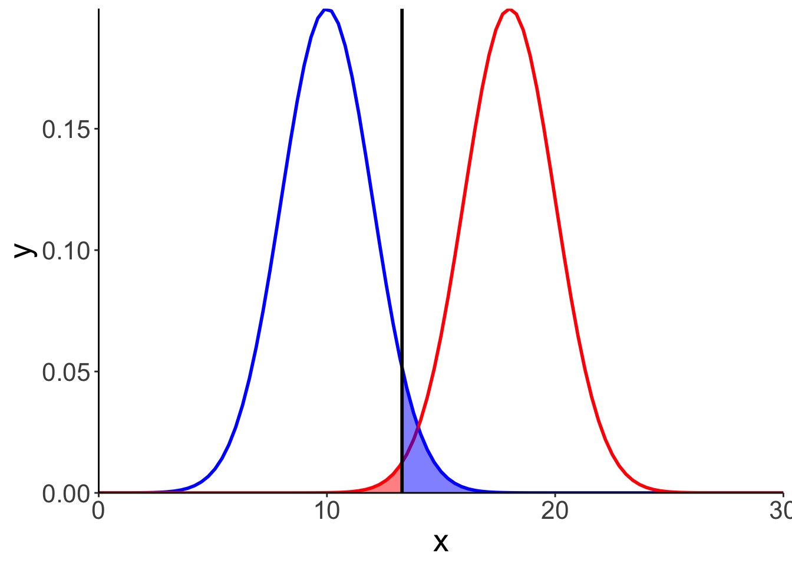
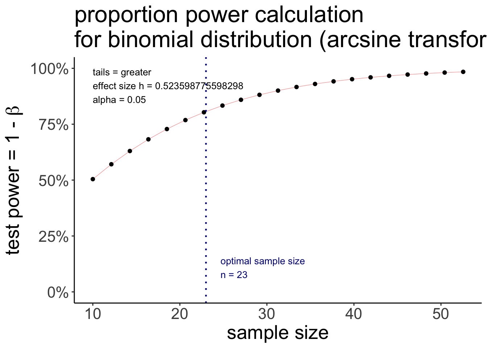
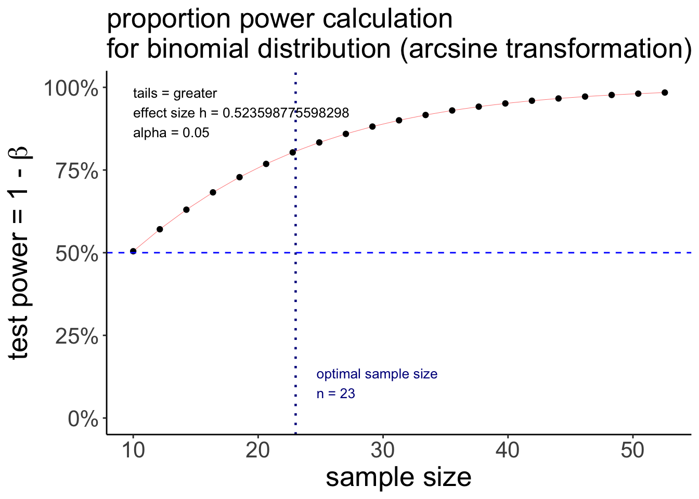
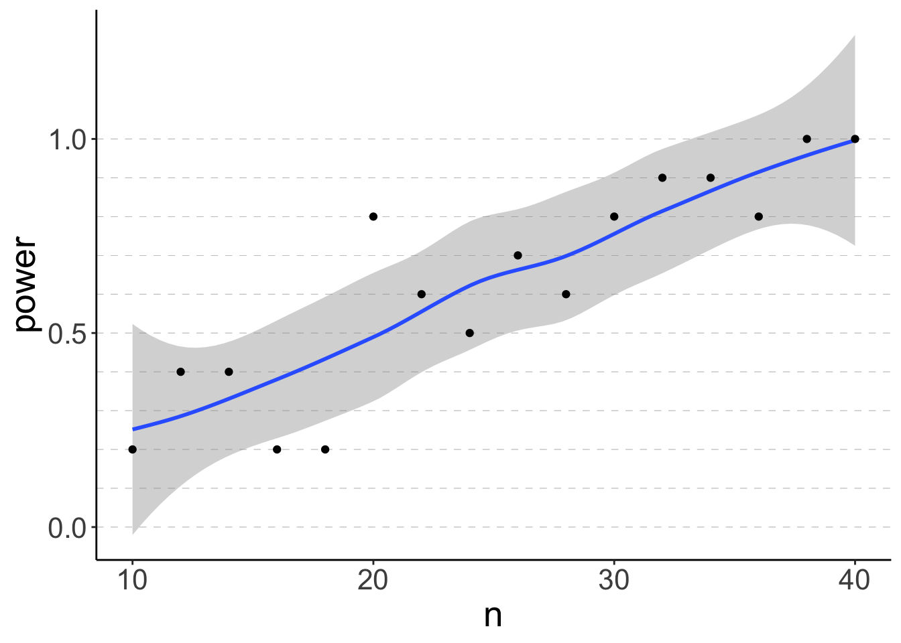
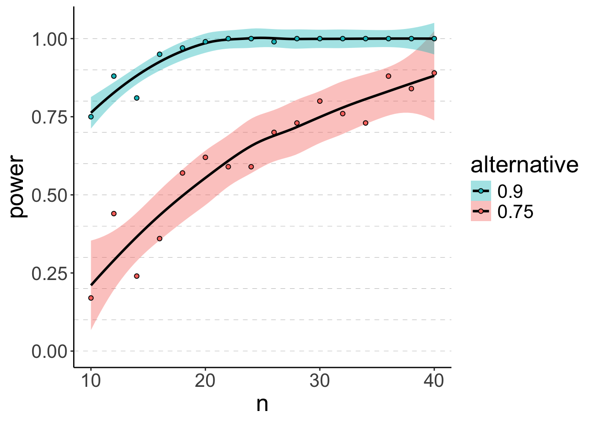
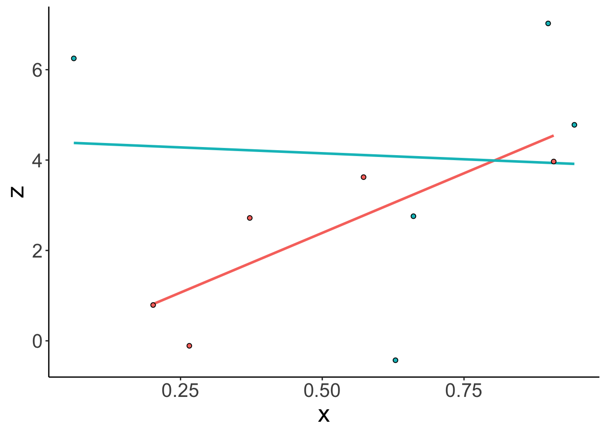

# Power analysis

## Learning goals

- Making decisions based on statistical inference.
- The concept of statistical power. 
- Calculating power. 
- Common effect size measures. 
- Determining sample size via simulation.
  - Understanding `map()` and its children. 
  - Understanding `nest()` and `unnest()`.

## Load packages and set plotting theme


``` r
library("knitr")      # for knitting RMarkdown 
library("kableExtra") # for making nice tables
library("broom")      # for tidying up model fits
library("magrittr")   # for going all in with the pipe
library("effectsize") # for computing effect size measures
library("pwr")        # for power calculations
library("tidyverse")  # for wrangling, plotting, etc. 
```


``` r
theme_set(theme_classic() + #set the theme 
    theme(text = element_text(size = 20))) #set the default text size

# markdown settings for rendered code chunks 
opts_chunk$set(comment = "",
               fig.show = "hold")

# suppress summary warnings 
options(dplyr.summarise.inform = F)
```

## Load data sets


``` r
df.poker = read_csv("data/poker.csv")
```

## Decision-making

Figures to illustrate power: 


``` r
mu0 = 10
mu1 = 18
# mu0 = 8
# mu1 = 20
# sd0 = 3
# sd1 = 3
sd0 = 2
sd1 = 2
alpha = 0.05
# alpha = 0.01

ggplot(data = tibble(x = c(0, 30)),
       mapping = aes(x = x)) + 
  stat_function(fun = "dnorm",
                size = 1,
                color = "blue",
                args = list(mean = mu0,
                            sd = sd0)) +
  stat_function(fun = "dnorm",
                size = 1,
                color = "red",
                args = list(mean = mu1,
                            sd = sd1)) +
  stat_function(fun = "dnorm",
                geom = "area",
                size = 1,
                fill = "blue",
                alpha = 0.5,
                args = list(mean = mu0,
                            sd = sd0),
                xlim = c(qnorm(1-alpha, mean = mu0, sd = sd0), 20)) +
  stat_function(fun = "dnorm",
                geom = "area",
                size = 1,
                fill = "red",
                alpha = 0.5,
                args = list(mean = mu1,
                            sd = sd1),
                xlim = c(0, c(qnorm(1-alpha, mean = mu0, sd = sd0)))) +
  geom_vline(xintercept = qnorm(1-alpha, mean = mu0, sd = sd0),
             size = 1) +
  coord_cartesian(expand = F)
```

```
Warning: Using `size` aesthetic for lines was deprecated in ggplot2 3.4.0.
ℹ Please use `linewidth` instead.
This warning is displayed once every 8 hours.
Call `lifecycle::last_lifecycle_warnings()` to see where this warning was generated.
```

```
Warning: Computation failed in `stat_function()`.
Caused by error in `fun()`:
! could not find function "fun"
```

```
Warning: Computation failed in `stat_function()`.
Caused by error in `fun()`:
! could not find function "fun"
```

```
Warning: Computation failed in `stat_function()`.
Caused by error in `fun()`:
! could not find function "fun"
```

```
Warning: Computation failed in `stat_function()`.
Caused by error in `fun()`:
! could not find function "fun"
```



## Effect sizes

### Cohen's d

Cohen's $d$ is defined as: 

$$
d = \frac{\overline y_1 - \overline y_2}{s_p}
$$

where

$$
s_p = \sqrt\frac{(n_1-1)s_1^2 + (n_2-1)s_2^2}{n_1 + n_2 - 2}
$$


``` r
# using the effectsize package 
cohens_d(x = balance ~ skill,
         data = df.poker)
```

```
Cohen's d |        95% CI
-------------------------
0.14      | [-0.08, 0.37]

- Estimated using pooled SD.
```

``` r
# compute by hand
df.cohen = df.poker %>% 
  group_by(skill) %>% 
  summarize(mean = mean(balance),
            var = var(balance),
            n = n()) %>% 
  ungroup() %>% 
  pivot_wider(names_from = skill,
              values_from = c(mean, var, n),
              names_sep = "") %>% 
  mutate(sp = sqrt(((n1 - 1) * var1 + (n2 - 1) * var2) / (n1 + n2 - 2)),
         d = abs(mean1 - mean2) / sp)

print(df.cohen)
```

```
# A tibble: 1 × 8
  mean1 mean2  var1  var2    n1    n2    sp     d
  <dbl> <dbl> <dbl> <dbl> <int> <int> <dbl> <dbl>
1  10.1  9.41  20.3  30.3   150   150  5.03 0.144
```

## Determining sample size

One way to determine sample size is by using the `pwr` package. While this packages is very convenient, we cannot compute power for all the hypotheses that we might be interested in testing. 

### `pwr` package

The `pwr` package has a number of functions that we can use do determine the desired sample size for different experimental designs. Check out this vignette [here](https://cran.r-project.org/web/packages/pwr/vignettes/pwr-vignette.html) for more information. 

#### Binomial test

We can determine what sample size we need for a Binomial test that compares two different proportions like so: 


``` r
pwr.p.test(h = ES.h(p1 = 0.75, p2 = 0.50), 
           sig.level = 0.05, 
           power = 0.80, 
           alternative = "greater")
```

```

     proportion power calculation for binomial distribution (arcsine transformation) 

              h = 0.5235988
              n = 22.55126
      sig.level = 0.05
          power = 0.8
    alternative = greater
```

The `pwr.p.test()` function wants the effect size h as an argument which we can compute via the `ES.h()` function that takes two proportions as arguments. I then further defined the desired significance level, power, and whether the test is one-sided or two-sided. 

To have an 80% chance of detecting a difference between a proportion of `p1 = 0.75` and `p2 = 0.50`, we would need to run a study with 23 participants. 

We can use the `plot()` function to illustrate what power we would get for different sample sizes. 


``` r
pwr.p.test(h = ES.h(p1 = 0.75, p2 = 0.50), 
           sig.level = 0.05, 
           power = 0.80, 
           alternative = "greater") %>% 
  plot()
```



Notice that this is a ggplot object, so we could tweak it further if we'd like to, like so: 


``` r
pwr.p.test(h = ES.h(p1 = 0.75, p2 = 0.50), 
           sig.level = 0.05, 
           power = 0.80, 
           alternative = "greater") %>% 
  plot() + 
  geom_hline(yintercept = 0.5,
             linetype = 2,
             color = "blue") +
  theme(plot.title = element_text(size = 20))
```



#### t-test (two independent samples)

Here is how we could calculate the desired sample size for a t-test with two independent samples. 


``` r
pwr.t.test(d = 0.3,
           power = 0.8,
           type = "two.sample",
           alternative = "two.sided")
```

```

     Two-sample t test power calculation 

              n = 175.3847
              d = 0.3
      sig.level = 0.05
          power = 0.8
    alternative = two.sided

NOTE: n is number in *each* group
```

So, to achieve a power of 0.8 for an effect size of d = 0.3, we would need to have 176 participants in each condition! 

### Power analysis

While the `pwr` package works great for relatively simple designs, it quickly reaches its limits. For example, you may be interested in the sample size required to achieve adequate power for detecting an interaction, or for a specific linear contrast. 

Luckily, there is a very flexible approach to determining sample size: via simulation! 

#### The general recipe

- assume: significance level, n, effect size
- simulate a large number of data sets of size n with the specified effect size
- for each data set, run a statistical test to calculate the p-value
- determine the probability of rejecting the H0 (given that H1 is true)

#### Using `map()` and list columns

##### Understanding `map()`

`map()` is a powerful family of functions that's part of the `purrr` package (which is included in the `tidyverse`, so we don't have to load it separately). Using `map()` allows us to avoid nasty for-loops! 

Let's take a look at the help function. 


``` r
help(map)
```

As the help function says, `map()` allows us to apply a function to each element of a vector. Here is a simple example: 


``` r
map(.x = 1:3, .f = ~ .x^2)
```

```
[[1]]
[1] 1

[[2]]
[1] 4

[[3]]
[1] 9
```

I've passed the vector of numbers `.x = 1:3` to `map()`, and then applied the anonymous function `.f = ~ .x^2` to each of the elements in that vector. 

> Always make sure to use the `~` for defining anonymous functions! 

As with many R functions, you can achieve the same outcome in many different ways. Here are a number of ways to do the same thing: 


```
[1] "Is tmp1 identical to tmp2? TRUE"
```

```
[1] "Is tmp2 identical to tmp3? TRUE"
```

###### Understanding `map()`'s children

Notice that the output of `map()` is a list. 


``` r
map(.x = 1:3, .f = ~ .x^2)
```

```
[[1]]
[1] 1

[[2]]
[1] 4

[[3]]
[1] 9
```
The `map()` function has many children that differ in what they output. For example, `map_dbl()` outputs a numeric vector instead of a list. 


``` r
map_dbl(.x = 1:3, .f = ~ .x^2)
```

```
[1] 1 4 9
```

And `map_lgl()` returns logical values. 


``` r
map_lgl(.x = 1:3, .f = ~ .x == 1)
```

```
[1]  TRUE FALSE FALSE
```

We can also return data frames by using either `map_dfr()` which binds data frames by row, or `map_dfc()` which binds data frames by column. Here is an example:


``` r
set.seed(1)

# function to create a data frame 
fun.make_df = function(x){
  tibble(number = x,
         group = sample(c("A", "B"),
                        size = 3,
                        replace = T),
         value = rnorm(n = 3))
}

# bind data frames by row 
map_dfr(.x = 1:3, 
        .f = ~ fun.make_df(.x))
```

```
# A tibble: 9 × 3
  number group  value
   <int> <chr>  <dbl>
1      1 A      1.33 
2      1 B      1.27 
3      1 A      0.415
4      2 B      0.487
5      2 A      0.738
6      2 A      0.576
7      3 B     -0.799
8      3 A     -1.15 
9      3 A     -0.289
```

A nice use-case of the `map_dfr()` function can be to read in a number of csv files from individual participants into one larger data frame. Let's simulate some data first, and save the data of each participant as a separate csv file (using `map()` of course). 


``` r
set.seed(1)

fun.simulate_csv = function(x){
  n_observations = sample(3:6, size = 1)
  df = tibble(age = sample(18:99, size = n_observations),
              responses = rnorm(n = n_observations, mean = 100, sd = 10))
  write_csv(df, file = str_c("data/participant", x, ".csv"))
}

map(.x = 1:3, 
    .f = ~ fun.simulate_csv(.x))
```

```
[[1]]
# A tibble: 3 × 2
    age responses
  <int>     <dbl>
1    85      91.6
2    56     116. 
3    18     103. 

[[2]]
# A tibble: 5 × 2
    age responses
  <int>     <dbl>
1    68     115. 
2    38     104. 
3    71      93.8
4    91      77.9
5    24     111. 

[[3]]
# A tibble: 4 × 2
    age responses
  <int>     <dbl>
1    61      106.
2    96      109.
3    50      108.
4    52      101.
```

Now, let's read in the data from the three participants and combine it into a single data frame.


``` r
map_dfr(.x = 1:3,
        .f = ~ read_csv(str_c("data/participant", .x, ".csv")),
        .id = "participant")
```

```
# A tibble: 12 × 3
   participant   age responses
   <chr>       <dbl>     <dbl>
 1 1              85      91.6
 2 1              56     116. 
 3 1              18     103. 
 4 2              68     115. 
 5 2              38     104. 
 6 2              71      93.8
 7 2              91      77.9
 8 2              24     111. 
 9 3              61     106. 
10 3              96     109. 
11 3              50     108. 
12 3              52     101. 
```
Notice how I used the `.id = ` argument of the function to add a `participant` column to my data frame in this case. 

###### Use `map2()` for functions with more than one input

If you have a function with more than one input, `map2()` is your friend. Here is a silly example: 


``` r
map2_dbl(.x = c(1.23, 2.13, 5.32),
         .y = c(0, 1, 2),
         .f = ~ round(.x, digits = .y))
```

```
[1] 1.00 2.10 5.32
```

Here, I took the vector of numbers `.x` and rounded it to a different number of digits according to what I've specified it `.y`. 
The same works with data frames, too, like so: 


``` r
tibble(x = c(1.23, 2.13, 5.32),
       n = c(0, 1, 2)) %>% 
  mutate(rounded = map2_dbl(.x = x,
                            .y = n,
                            .f = ~ round(.x, digits = .y)))
```

```
# A tibble: 3 × 3
      x     n rounded
  <dbl> <dbl>   <dbl>
1  1.23     0    1   
2  2.13     1    2.1 
3  5.32     2    5.32
```

###### Use pmap() to go all out (i.e. for functions with more than two arguments)

`pmap()` is your friend for functions that have more than two arguments. Here is an example: 


``` r
tibble(x = c(1, 2, 3),
       y = c(23, 12, 1),
       z = c(4, 5, 4)) %>% 
  mutate(result = pmap_dbl(.l = ., 
                           .f = ~ ..1 * ..2 + ..3))
```

```
# A tibble: 3 × 4
      x     y     z result
  <dbl> <dbl> <dbl>  <dbl>
1     1    23     4     27
2     2    12     5     29
3     3     1     4      7
```

Notice than when using more than two arguments, we refer to each function argument with ..1, ..2, ..3, etc. 

###### Practice 1 -- Having fun with `map()`

Use the `map2_dbl()` function to create a new variable in this data frame that's the maximum of each row across columns `a` and `b`. 


``` r
df.practice = tibble(a = c(12, 14, 52, 23, 23),
                     b = c(29, 12, 4, 48, 37))
# write your code here 
```

For the fast ones: For each row in the data frame, write a function that calculates the mean of columns `a` and `b`, and the rounds to the number of digits specified in column `d`. 


``` r
df.practice = tibble(a = c(12.123, 53.234, 23.324, 54.232, 12.454),
                     b = c(12.456, 23.234, 6.736, 3.346, 7.232),
                     d = c(1, 2, 2, 3, 1))
# write your code here
```

##### List columns

`map()` becomes particularly powerful when combined with list columns. List columns allow you to put data frames into a column of your data frame. For example, you can do something like this: 


``` r
df.data = tibble(participant = 1, 
                 age = 23,
                 data = list(tibble(trial = c(1, 2, 3),
                                    response = c(23, 95, 37))))

print(df.data)
```

```
# A tibble: 1 × 3
  participant   age data            
        <dbl> <dbl> <list>          
1           1    23 <tibble [3 × 2]>
```

We could access what's in this data column like so 


``` r
df.data %>% 
  pluck("data", 1)
```

```
# A tibble: 3 × 2
  trial response
  <dbl>    <dbl>
1     1       23
2     2       95
3     3       37
```

###### `unnest()`

For getting data frames out of list columns, we can use the `unnest()` function. 


``` r
df.data %>% 
  unnest(cols = data)
```

```
# A tibble: 3 × 4
  participant   age trial response
        <dbl> <dbl> <dbl>    <dbl>
1           1    23     1       23
2           1    23     2       95
3           1    23     3       37
```

###### `nest()`

We can use the `nest()` function to create list columns. `nest()` works particularly well in combination with `group_by()`. For example, here I'm created three separate data sets where the size of each data set is determined by the `x` column.


``` r
# original data frame 
df.data = tibble(participant = c(1, 1, 1, 2, 2, 3),
                 response1 = 1:6,
                 response2 = 6:1)
print(df.data)
```

```
# A tibble: 6 × 3
  participant response1 response2
        <dbl>     <int>     <int>
1           1         1         6
2           1         2         5
3           1         3         4
4           2         4         3
5           2         5         2
6           3         6         1
```

``` r
# nested data frame 
df.data = df.data %>% 
  group_by(participant) %>% 
  nest() %>% 
  ungroup()

print(df.data)
```

```
# A tibble: 3 × 2
  participant data            
        <dbl> <list>          
1           1 <tibble [3 × 2]>
2           2 <tibble [2 × 2]>
3           3 <tibble [1 × 2]>
```

``` r
# and back to the original data frame  
df.data = df.data %>% 
  unnest(cols = data)
print(df.data)
```

```
# A tibble: 6 × 3
  participant response1 response2
        <dbl>     <int>     <int>
1           1         1         6
2           1         2         5
3           1         3         4
4           2         4         3
5           2         5         2
6           3         6         1
```

And, of course, I can use unnest() to get back to my original data frame. 

##### Combining `nest()` and `map()`

`nest()` and `map()` unfold their power together when it comes to fitting models. For example, consider that you want to fit a separate linear to subests of your data. Here is how you can do that using `nest()` and `map()`. 

I'll demonstrate via the infamous `mtcars` data set that comes with R. 


``` r
mtcars %>% 
  head(10)
```

```
                   mpg cyl  disp  hp drat    wt  qsec vs am gear carb
Mazda RX4         21.0   6 160.0 110 3.90 2.620 16.46  0  1    4    4
Mazda RX4 Wag     21.0   6 160.0 110 3.90 2.875 17.02  0  1    4    4
Datsun 710        22.8   4 108.0  93 3.85 2.320 18.61  1  1    4    1
Hornet 4 Drive    21.4   6 258.0 110 3.08 3.215 19.44  1  0    3    1
Hornet Sportabout 18.7   8 360.0 175 3.15 3.440 17.02  0  0    3    2
Valiant           18.1   6 225.0 105 2.76 3.460 20.22  1  0    3    1
Duster 360        14.3   8 360.0 245 3.21 3.570 15.84  0  0    3    4
Merc 240D         24.4   4 146.7  62 3.69 3.190 20.00  1  0    4    2
Merc 230          22.8   4 140.8  95 3.92 3.150 22.90  1  0    4    2
Merc 280          19.2   6 167.6 123 3.92 3.440 18.30  1  0    4    4
```

What I want to do is to fit separate regression models predicting `mpg` (miles per gallon) as a function of `wt` (the car's weight) for cars with different numbers of cylinders. Here is how that works. 


``` r
df.data = mtcars %>%
  group_by(cyl) %>% 
  nest() %>% 
  mutate(fit = map(.x = data,
                   .f = ~ lm(formula = mpg ~ 1 + wt,
                             data = .x)))
```

I first grouped by the `cyl` (the number of cylinders), used `nest()` to put the rest of the data into a list column, and then used `mutate()` to run a separate linear model on each data set and saved the modle result into the `fit` column. 

With some more wrangling, I could, for example, extract the coefficients of each model like so: 


``` r
mtcars %>%
  group_by(cyl) %>% 
  nest() %>% 
  mutate(fit = map(.x = data, 
                   .f = ~ lm(mpg ~ 1 + wt, data = .x)),
         coef = map(.x = fit, 
                    .f = ~ tidy(.x))) %>% 
  unnest(cols = coef) %>% 
  select(-c(data, fit))
```

```
# A tibble: 6 × 6
# Groups:   cyl [3]
    cyl term        estimate std.error statistic    p.value
  <dbl> <chr>          <dbl>     <dbl>     <dbl>      <dbl>
1     6 (Intercept)    28.4      4.18       6.79 0.00105   
2     6 wt             -2.78     1.33      -2.08 0.0918    
3     4 (Intercept)    39.6      4.35       9.10 0.00000777
4     4 wt             -5.65     1.85      -3.05 0.0137    
5     8 (Intercept)    23.9      3.01       7.94 0.00000405
6     8 wt             -2.19     0.739     -2.97 0.0118    
```

Voila! A data frame that contains the coefficients for each of the three models. 

Base R has a number of functions like `apply()`, `sapply()`, `lapply()`, etc. that do similar things to `map()`. However, the `map()` family of functions works very well with the rest of the `tidyverse`, that's why we'll use it. 

#### Power analysis via simulation

So, after this long detour via `map()`, list columns, `nest()`, and `unnest()`, we can finally start doing some power analysis via simulation, yay! 

##### Simulating the Binomial test

Let's start with the Binomial test that we played around with above. We want to use simulation to determine the sample size we need to have an 80% of detecting a difference between two proportions p = 0.75 and p = 0.5. 

I'll first do it step by step, and then afterwards put all the code in one place together 

###### Step by step

Here is how we would go about this. First, I'll set up a simulation grid.


``` r
# number of simulations
n_simulations = 10

# set up simulation grid 
df.power = expand_grid(n = seq(10, 40, 2),
                       simulation = 1:n_simulations,
                       p = 0.75) %>%
  mutate(index = 1:n(),
         .before = n) # add an index column

df.power
```

```
# A tibble: 160 × 4
   index     n simulation     p
   <int> <dbl>      <int> <dbl>
 1     1    10          1  0.75
 2     2    10          2  0.75
 3     3    10          3  0.75
 4     4    10          4  0.75
 5     5    10          5  0.75
 6     6    10          6  0.75
 7     7    10          7  0.75
 8     8    10          8  0.75
 9     9    10          9  0.75
10    10    10         10  0.75
# ℹ 150 more rows
```

The `expand_grid()` function creates a data frame that contains all the combinations of the variables. 

Now, let's generate data according to our hypothesis. 


``` r
set.seed(1)

df.power = df.power %>% 
  group_by(index, n, simulation) %>% 
  mutate(response = rbinom(n = 1,
                           size = n,
                           prob = p))

df.power
```

```
# A tibble: 160 × 5
# Groups:   index, n, simulation [160]
   index     n simulation     p response
   <int> <dbl>      <int> <dbl>    <int>
 1     1    10          1  0.75        8
 2     2    10          2  0.75        8
 3     3    10          3  0.75        7
 4     4    10          4  0.75        6
 5     5    10          5  0.75        9
 6     6    10          6  0.75        6
 7     7    10          7  0.75        5
 8     8    10          8  0.75        7
 9     9    10          9  0.75        7
10    10    10         10  0.75        9
# ℹ 150 more rows
```

The `response` variable now contains samples from the sample size `n` according to the probability specified in `p`. Now it's time for `group_by()` and `nest()` because we want to calculate the p-value for observing this response if in fact the null hypothesis was true (i.e. p = 0.5). 


``` r
df.power = df.power %>% # generate random data
  mutate(fit = map2(.x = response,
                    .y = n,
                    .f = ~ binom.test(x = .x, # define formula
                                      n = .y,
                                      p = 0.5,
                                      alternative = "two.sided")))
df.power
```

```
# A tibble: 160 × 6
# Groups:   index, n, simulation [160]
   index     n simulation     p response fit    
   <int> <dbl>      <int> <dbl>    <int> <list> 
 1     1    10          1  0.75        8 <htest>
 2     2    10          2  0.75        8 <htest>
 3     3    10          3  0.75        7 <htest>
 4     4    10          4  0.75        6 <htest>
 5     5    10          5  0.75        9 <htest>
 6     6    10          6  0.75        6 <htest>
 7     7    10          7  0.75        5 <htest>
 8     8    10          8  0.75        7 <htest>
 9     9    10          9  0.75        7 <htest>
10    10    10         10  0.75        9 <htest>
# ℹ 150 more rows
```

Now that we've fitted a bunch of binomial models, we only need to get at the p-values. Again, we can use the `tidy()` function from the `broom` package for help, like so: 


``` r
df.power = df.power %>% 
  mutate(coef = map(.x = fit,
                    .f = ~ tidy(.))) %>% 
  select(simulation, p, index, coef) %>% 
  unnest(cols = coef) %>% 
  select(index, n, simulation, p.value)
```

```
Adding missing grouping variables: `n`
```

``` r
df.power
```

```
# A tibble: 160 × 4
# Groups:   index, n, simulation [160]
   index     n simulation p.value
   <int> <dbl>      <int>   <dbl>
 1     1    10          1  0.109 
 2     2    10          2  0.109 
 3     3    10          3  0.344 
 4     4    10          4  0.754 
 5     5    10          5  0.0215
 6     6    10          6  0.754 
 7     7    10          7  1     
 8     8    10          8  0.344 
 9     9    10          9  0.344 
10    10    10         10  0.0215
# ℹ 150 more rows
```

Finally, all that's left is to calculate power by looking at the proportion of times in which we rejected the null hypothesis. 


``` r
df.power %>% 
  group_by(n) %>% 
  summarize(power = sum(p.value < 0.05) / n())
```

```
# A tibble: 16 × 2
       n power
   <dbl> <dbl>
 1    10   0.2
 2    12   0.4
 3    14   0.4
 4    16   0.2
 5    18   0.2
 6    20   0.8
 7    22   0.6
 8    24   0.5
 9    26   0.7
10    28   0.6
11    30   0.8
12    32   0.9
13    34   0.9
14    36   0.8
15    38   1  
16    40   1  
```

Notice here that the power values fluctuate quite a bit. This is because we only ran 10 simulations for each sample size. To have more robust results, we need to increase the number of simulations. 

But first, let's make a plot that visualizes what we found: 


``` r
df.plot = df.power %>% 
  group_by(n) %>% 
  summarize(power = sum(p.value < 0.05) / n())

ggplot(data = df.plot, 
       mapping = aes(x = n, y = power)) +
  geom_hline(yintercept = seq(0, 1, 0.1),
             linetype = 2,
             color = "gray50",
             size = 0.1) + 
  geom_smooth(method = "loess",
              formula = "y ~ x") +
  geom_point()
```



As expected, the power increases with the sample size n. 

###### All in one

Here is a slightly different way to run the same simulation we just did before in one go (this time without using `map()`): 


``` r
# make reproducible 
set.seed(1)

# number of simulations
n_simulations = 5

# run simulation 
expand_grid(n = seq(10, 40, 2),
            simulation = 1:n_simulations,
            p = 0.75) %>% 
  mutate(index = 1:n(),
         .before = n) %>% 
  group_by(index, n, p, simulation) %>% 
  mutate(response = rbinom(n = 1,
                           size = n,
                           prob = p),
         p.value = binom.test(x = response,
                              n = n,
                              p = 0.5,
                              alternative = "two.sided")$p.value) %>% 
  group_by(n, p) %>% 
  summarize(power = sum(p.value < 0.05) / n()) %>% 
  ungroup()
```

```
# A tibble: 16 × 3
       n     p power
   <dbl> <dbl> <dbl>
 1    10  0.75   0.2
 2    12  0.75   0.2
 3    14  0.75   0.4
 4    16  0.75   0.2
 5    18  0.75   0.6
 6    20  0.75   0.8
 7    22  0.75   0.6
 8    24  0.75   0.4
 9    26  0.75   0.6
10    28  0.75   0.8
11    30  0.75   0.8
12    32  0.75   1  
13    34  0.75   0.8
14    36  0.75   0.8
15    38  0.75   1  
16    40  0.75   0.8
```

And another time with a larger sample size, and also for two different alternative hypotheses: p1 = 0.75, and p2 = 0.9 (this time, using `map()`).


``` r
# make reproducible 
set.seed(1)

# number of simulations
n_simulations = 100

# run simulation 
df.power = expand_grid(n = seq(10, 40, 2),
                       simulation = 1:n_simulations,
                       p = c(0.75, 0.9)) %>% # added another hypothesis here 
  mutate(index = 1:n(),
         .before = n) %>% 
  group_by(index, n, simulation) %>%
  mutate(response = rbinom(n = 1,
                           size = n,
                           prob = p)) %>% 
  ungroup() %>% 
  mutate(fit = map2(.x = response,
                    .y = n,
                    .f = ~ binom.test(x = .x,
                                      n = .y,
                                      p = 0.5,
                                      alternative = "two.sided"))) %>% 
  mutate(coef = map(.x = fit,
                    .f = ~ tidy(.))) %>% 
  unnest(cols = coef) %>% 
  select(index, n, p, p.value) %>% 
  group_by(n, p) %>% 
  summarize(power = sum(p.value < 0.05) / n()) %>% 
  ungroup()

# visualize results
ggplot(data = df.power, 
       mapping = aes(x = n,
                     y = power,
                     fill = as.factor(p),
                     group = p)) +
  geom_hline(yintercept = seq(0, 1, 0.1),
             linetype = 2,
             color = "gray50",
             size = 0.1) + 
  geom_smooth(method = "loess",
              formula = "y ~ x",
              color = "black") +
  geom_point(shape = 21) +
  labs(fill = "alternative") +
  guides(fill = guide_legend(reverse = T))
```



##### Simulating an independent samples t-test

Let's simulate data for an independent samples t-test. To do so, we need to make some assumptions about what we expect the distribution of the data to look like. Here, I assume that we get normally distributed data with some mean and standard deviation. 

The procedure will be very similar to the Binomial test above. The only thing that changes really is how we generate the data (and then some small wrangling differences). 

Let's say that we collected the following pilot data set: 


``` r
set.seed(1)

# parameters
n = 10 
mean1 = 10 
sd1 = 2
mean2 = 11
sd2 = 3

df.ttest = tibble(group1 = rnorm(n = n,
                                 mean = mean1,
                                 sd = sd1),
                  group2 = rnorm(n = n,
                                 mean = mean2,
                                 sd = sd2)) %>% 
  pivot_longer(cols = everything()) %>% 
  arrange(name)
```

The two groups in our sample don't differ significantly from each other. 


``` r
# visualize the data 
ggplot(data = df.ttest,
       mapping = aes(x = name,
                     y = value)) + 
  stat_summary(fun.data = "mean_cl_boot")

# compute a t-test
t.test(formula = value ~ name, 
         data = df.ttest)
```

```

	Welch Two Sample t-test

data:  value by name
t = -1.3135, df = 13.035, p-value = 0.2117
alternative hypothesis: true difference in means between group group1 and group group2 is not equal to 0
95 percent confidence interval:
 -3.9191375  0.9548788
sample estimates:
mean in group group1 mean in group group2 
            10.26441             11.74653 
```


Let's calculate what the effect size was in our sample. Remember that Cohen's d is defined as 

$$d = \frac{\lvert\overline y_1 - \overline y_2\rvert}{s_p}$$

where 

$$s_p = \sqrt\frac{(n_1-1)s_1^2 + (n_2-1)s_2^2}{n_1 + n_2 - 2}$$
In our sample, the effect size Cohen's d was: 


``` r
df.sample = df.ttest %>% 
  group_by(name) %>% 
  summarize(mean = mean(value),
            sd = sd(value),
            n = n()) %>% 
  ungroup()

# compute the pooled standard deviation 
sp = sqrt(((df.sample$n[1] - 1) * df.sample$sd[1]^2 + (df.sample$n[2] - 1) * 
             df.sample$sd[2]^2) / (df.sample$n[1] + df.sample$n[2] - 2))

d = abs(df.sample$mean[1] - df.sample$mean[2]) / sp

d
```

```
[1] 0.5874251
```

Let's double check that we got it right: 


``` r
cohens_d(x = value ~ name, 
         data = df.ttest)
```

```
Cohen's d |        95% CI
-------------------------
-0.59     | [-1.48, 0.32]

- Estimated using pooled SD.
```

We did! 

So let's now calculate the means and standard deviations based on our pilot data and run a power analysis to determine how many participants we would need, to have an 80% chance of rejecting the null hypothesis for the estimated effect size. 


``` r
# make reproducible 
set.seed(1)

# parameters 
mean1 = df.sample$mean[1]
mean2 = df.sample$mean[2]
sd1 = df.sample$sd[1]
sd2 = df.sample$sd[2]

# number of simulations
n_simulations = 10
# n_simulations = 100

# run simulation 
df.power2 = expand_grid(n = seq(from = 10, to = 60, by = 5),
                        simulation = 1:n_simulations) %>%
  mutate(index = 1:n(),
         .before = n) %>% 
  group_by(index, n, simulation) %>% 
  mutate(data = list(tibble(group1 = rnorm(n = n,
                                           mean = mean1,
                                           sd = sd1),
                            group2 = rnorm(n = n,
                                           mean = mean2,
                                           sd = sd2)) %>% 
                       pivot_longer(cols = everything()))) %>% 
  mutate(fit = map(.x = data,
                   .f = ~ lm(formula = value ~ 1 + name,
                             data = .x)),
         parameters = map(.x = fit,
                          .f = ~ tidy(.x))) %>%
  select(index, n, simulation,  parameters) %>% 
  unnest(cols = parameters) %>% 
  filter(term != "(Intercept)") %>% 
  select(index, n, simulation, p.value) %>% 
  group_by(n) %>% 
  summarize(power = sum(p.value < 0.05) / n()) %>% 
  ungroup()

# visualize results
ggplot(data = df.power2, 
       mapping = aes(x = n,
                     y = power)) +
  geom_hline(yintercept = seq(0, 1, 0.1),
             linetype = 2,
             color = "gray50",
             size = 0.1) + 
  geom_smooth(method = "loess",
              color = "black",
              formula = "y ~ x") +
  geom_point(shape = 21) + 
  scale_x_continuous(breaks = seq(10, 60, 10),
                     labels = seq(10, 60, 10)) + 
  scale_y_continuous(breaks = seq(0, 1, 0.1),
                     labels = seq(0, 1, 0.1))
```


Let's compare to what we'd get from the `pwr` package. 


``` r
pwr.t.test(d = 0.5874251,
           power = 0.8,
           type = "two.sample",
           alternative = "two.sided")
```

```

     Two-sample t test power calculation 

              n = 46.4718
              d = 0.5874251
      sig.level = 0.05
          power = 0.8
    alternative = two.sided

NOTE: n is number in *each* group
```

Looks pretty similar! 

##### Practice 2 -- Simulation of an interaction effect

Try to run a simulation to determine how many participants you would need to have an 80% chance of rejecting the null hypothesis that there is no interaction based on the following pilot data set:  


``` r
set.seed(1)
# population parameters 
b0 = 1
b1 = 2
b2 = 3
b1_2 = -2
sd = 2
n = 10 

df.linear = tibble(x = runif(n = n),
                   y = rep(c(0, 1), each = n/2),
                   z = b0 + b1 * x + b2 * y + b1_2 * x * y + rnorm(n = n, sd = sd))
```

Let's visualize the pilot data first: 


``` r
ggplot(data = df.linear,
       mapping = aes(x = x,
                     y = z,
                     group = y,
                     fill = as.factor(y),
                     color = as.factor(y))) + 
  geom_smooth(method = "lm",
              se = F,
              show.legend = F) +
  geom_point(shape = 21,
             color = "black",
             show.legend = F)
```



Let's estimate the parameters based on our sample: 


``` r
# parameter estimates for the coefficients based on the sample 
b = lm(formula = z ~ x * y,
   data = df.linear) %>% 
  tidy() %>% 
  select(term, estimate, p.value)

# parameter estimate of the residual standard deviation 
sigma = lm(formula = z ~ x * y,
           data = df.linear) %>% 
  glance() %>% 
  pull(sigma)
```

Run a power analysis to see how many participants you would need to have an 80% of rejecting the null hypothesis that there is no interaction. Use the parameter estimates (the beta coefficients and the standard deviation of the residuals `sigma`) based on your pilot data to simulate new data. 

Here is the strategy: 

- Try to closely emulate what we've been doing for the independent samples t-test above.
- However, this time, we have a different way of generating the data (namely by using the regression equation: $z \sim b_0 + b_1 \cdot x + b_2 \cdot y + b_{1\_2} \cdot x \cdot y + e)$, where $e \sim N(0, \sigma)$.
- Fit the model first to extract the estimates for the beta coefficients, and the standard deviation of the residuals `sigma`. 
- Then use these parameters to generate new data assuming that `x` is a continuous predictor between 0 and 1 (`x = runif(n = n)`) and `y` is a binary, dummy-coded variable (`y = rep(c(0, 1), each = n/2)`).
- Extract the coefficients of each model fit, and check whether the interaction is significant. 
- Make a plot that shows how power changes with the sample size n. 


``` r
set.seed(1)
# write your code here 
```

Run the same power analysis this time assuming the ground truth parameters from the population (rather than the parameters that we've estimated from the sample). 


``` r
set.seed(1)
# write your code here 
```

## Additional resources

### Datacamp

- [Functional programming with purrr](https://www.datacamp.com/courses/foundations-of-functional-programming-with-purrr)

### Cheatsheets

- [purrr](figures/purrr.pdf) 

### Misc

- [Nice tutorial on simulating power](https://cjungerius.github.io/powersim/)
- [Sample size justification](https://lakens.github.io/statistical_inferences/08-samplesizejustification.html)
- [Guide to reporting effect sizes and confidence intervals](https://matthewbjane.quarto.pub/)
- [Getting started with `pwr`](https://cran.r-project.org/web/packages/pwr/vignettes/pwr-vignette.html)
- [Visualize power](https://rpsychologist.com/d3/NHST/)
- [Calculating and reporting effect sizes to facilitate cumulative science: a practical primer for t-tests and ANOVAs](https://www.frontiersin.org/articles/10.3389/fpsyg.2013.00863/full)
- [purrr tutorial](https://emoriebeck.github.io/R-tutorials/purrr/)
- [simr](https://cran.r-project.org/web/packages/simr/index.html): R Package for running power analysis for generalized linear mixed effects models. 
- [simglm](https://cran.r-project.org/web/packages/simglm/index.html): Alternative R package for running power analysis via simulation. 
- [cautionary tale about using pilot studies for power calculations](https://nccih.nih.gov/grants/whatnccihfunds/pilot_studies)

## Session info

Information about this R session including which version of R was used, and what packages were loaded. 


``` r
sessionInfo()
```

```
R version 4.4.1 (2024-06-14)
Platform: aarch64-apple-darwin20
Running under: macOS Sonoma 14.6

Matrix products: default
BLAS:   /Library/Frameworks/R.framework/Versions/4.4-arm64/Resources/lib/libRblas.0.dylib 
LAPACK: /Library/Frameworks/R.framework/Versions/4.4-arm64/Resources/lib/libRlapack.dylib;  LAPACK version 3.12.0

locale:
[1] en_US.UTF-8/en_US.UTF-8/en_US.UTF-8/C/en_US.UTF-8/en_US.UTF-8

time zone: America/Los_Angeles
tzcode source: internal

attached base packages:
[1] stats     graphics  grDevices utils     datasets  methods   base     

other attached packages:
 [1] lubridate_1.9.3  forcats_1.0.0    stringr_1.5.1    dplyr_1.1.4     
 [5] purrr_1.0.2      readr_2.1.5      tidyr_1.3.1      tibble_3.2.1    
 [9] ggplot2_3.5.1    tidyverse_2.0.0  pwr_1.3-0        effectsize_0.8.9
[13] magrittr_2.0.3   broom_1.0.6      kableExtra_1.4.0 knitr_1.48      

loaded via a namespace (and not attached):
 [1] tidyselect_1.2.1   viridisLite_0.4.2  farver_2.1.2       fastmap_1.2.0     
 [5] bayestestR_0.14.0  digest_0.6.36      rpart_4.1.23       timechange_0.3.0  
 [9] estimability_1.5.1 lifecycle_1.0.4    cluster_2.1.6      compiler_4.4.1    
[13] rlang_1.1.4        Hmisc_5.1-3        sass_0.4.9         tools_4.4.1       
[17] utf8_1.2.4         yaml_2.3.9         data.table_1.15.4  labeling_0.4.3    
[21] htmlwidgets_1.6.4  bit_4.0.5          xml2_1.3.6         withr_3.0.0       
[25] foreign_0.8-86     nnet_7.3-19        grid_4.4.1         datawizard_0.12.2 
[29] fansi_1.0.6        xtable_1.8-4       colorspace_2.1-0   emmeans_1.10.3    
[33] scales_1.3.0       insight_0.20.3     cli_3.6.3          mvtnorm_1.2-5     
[37] rmarkdown_2.27     crayon_1.5.3       generics_0.1.3     rstudioapi_0.16.0 
[41] tzdb_0.4.0         parameters_0.22.1  cachem_1.1.0       splines_4.4.1     
[45] parallel_4.4.1     base64enc_0.1-3    vctrs_0.6.5        Matrix_1.7-0      
[49] jsonlite_1.8.8     bookdown_0.40      hms_1.1.3          bit64_4.0.5       
[53] Formula_1.2-5      htmlTable_2.4.2    systemfonts_1.1.0  jquerylib_0.1.4   
[57] glue_1.7.0         stringi_1.8.4      gtable_0.3.5       munsell_0.5.1     
[61] pillar_1.9.0       htmltools_0.5.8.1  R6_2.5.1           vroom_1.6.5       
[65] evaluate_0.24.0    lattice_0.22-6     highr_0.11         backports_1.5.0   
[69] bslib_0.7.0        svglite_2.1.3      coda_0.19-4.1      gridExtra_2.3     
[73] nlme_3.1-164       checkmate_2.3.1    mgcv_1.9-1         xfun_0.45         
[77] pkgconfig_2.0.3   
```
