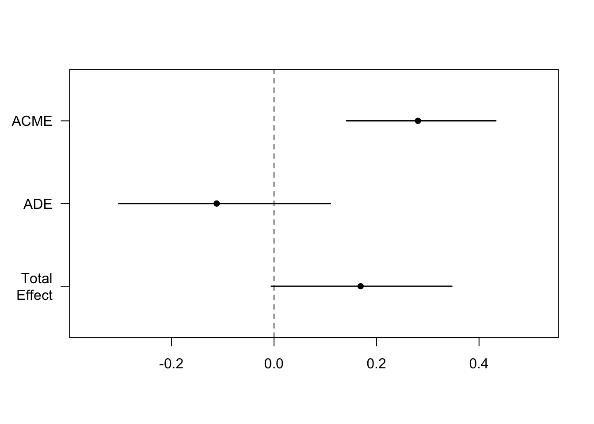

# Mediation & Moderation

These notes are adapted from this tutorial: [Mediation and moderation](https://ademos.people.uic.edu/Chapter14.html)

## Learning goals 

- Understanding what controlling for variables means. 
- Learning a graphical procedure that helps identify when it's good vs. bad to control for variables. 
- Simulating a mediation analysis.
- Baron and Kenny's (1986) steps for mediation. 
- Testing the significance of a mediation. 
  - Sobel test. 
  - Bootstrapping. 
  - Bayesian approach. 
- Limitations of mediation analysis. 
- Simulating a moderator effect. 

## Recommended reading 

- @fiedler2011mediation
- @mackinnon2007mediationa

## Load packages and set plotting theme  


```r
library("knitr")         # for knitting RMarkdown 
library("kableExtra")    # for making nice tables
library("janitor")       # for cleaning column names
library("mediation")     # for mediation and moderation analysis 
library("multilevel")    # Sobel test
library("broom")         # tidying up regression results
library("DiagrammeR")    # for drawing diagrams
library("DiagrammeRsvg") # for exporting pdfs of graphs 
library("rsvg")          # for exporting pdfs of graphs 
library("tidyverse")     # for wrangling, plotting, etc. 
```


```r
theme_set(theme_classic() + #set the theme 
            theme(text = element_text(size = 20))) #set the default text size

opts_chunk$set(comment = "",
               fig.show = "hold")

options(dplyr.summarise.inform = FALSE) # Disable summarize ungroup messages
```

## Controlling for variables 

### Illustration of the d-separation algorithm 

- Question: Are D and E independent? 

#### Full DAG


```r
g = grViz("
digraph neato {
  
  graph[layout = neato]
  
  # general settings for all nodes
  node [
    shape = circle,
    style = filled,
    color = black,
    label = ''
    fontname = 'Helvetica',
    fontsize = 16,
    fillcolor = lightblue
    ]
  
  # labels for each node
  a [label = 'A' pos = '0,0!']
  b [label = 'B'  pos = '2,0!']
  c [label = 'C' pos = '1,-1!']
  d [label = 'D' pos = '0,-2!']
  e [label = 'E' pos = '2,-2!']
  f [label = 'F' pos = '1,-3!']
  g [label = 'G' pos = '0,-4!']
  
  # edges between nodes
  edge [color = black]
  a -> c
  b -> c
  c -> {d e}
  d -> f
  f -> g

  # direction in which arrows are drawn (from left to right)
  rankdir = LR
}
") 

# export as pdf 
# g %>% 
#   export_svg %>% 
#   charToRaw %>% 
#   rsvg_pdf("figures/dag.pdf")

# show plot
g
```

```{=html}
<div id="htmlwidget-4a8118da8fc1ad3b7e29" style="width:672px;height:480px;" class="grViz html-widget"></div>
<script type="application/json" data-for="htmlwidget-4a8118da8fc1ad3b7e29">{"x":{"diagram":"\ndigraph neato {\n  \n  graph[layout = neato]\n  \n  # general settings for all nodes\n  node [\n    shape = circle,\n    style = filled,\n    color = black,\n    label = \"\"\n    fontname = \"Helvetica\",\n    fontsize = 16,\n    fillcolor = lightblue\n    ]\n  \n  # labels for each node\n  a [label = \"A\" pos = \"0,0!\"]\n  b [label = \"B\"  pos = \"2,0!\"]\n  c [label = \"C\" pos = \"1,-1!\"]\n  d [label = \"D\" pos = \"0,-2!\"]\n  e [label = \"E\" pos = \"2,-2!\"]\n  f [label = \"F\" pos = \"1,-3!\"]\n  g [label = \"G\" pos = \"0,-4!\"]\n  \n  # edges between nodes\n  edge [color = black]\n  a -> c\n  b -> c\n  c -> {d e}\n  d -> f\n  f -> g\n\n  # direction in which arrows are drawn (from left to right)\n  rankdir = LR\n}\n","config":{"engine":"dot","options":null}},"evals":[],"jsHooks":[]}</script>
```

#### Draw the ancestral graph


```r
g = grViz("
digraph neato {
  
  graph[layout = neato]
  
  # general settings for all nodes
  node [
    shape = circle,
    style = filled,
    color = black,
    label = ''
    fontname = 'Helvetica',
    fontsize = 16,
    fillcolor = lightblue
    ]
  
  # labels for each node
  a [label = 'A' pos = '0,0!']
  b [label = 'B'  pos = '2,0!']
  c [label = 'C' pos = '1,-1!']
  d [label = 'D' pos = '0,-2!']
  e [label = 'E' pos = '2,-2!']
  
  # edges between nodes
  edge [color = black]
  a -> c
  b -> c
  c -> {d e}

  # direction in which arrows are drawn (from left to right)
  rankdir = LR
}
") 

# export as pdf 
# g %>% 
#   export_svg %>% 
#   charToRaw %>% 
#   rsvg_pdf("figures/ancestral_graph.pdf")

# show plot
g
```

```{=html}
<div id="htmlwidget-9df9edeb313786dd8fe5" style="width:672px;height:480px;" class="grViz html-widget"></div>
<script type="application/json" data-for="htmlwidget-9df9edeb313786dd8fe5">{"x":{"diagram":"\ndigraph neato {\n  \n  graph[layout = neato]\n  \n  # general settings for all nodes\n  node [\n    shape = circle,\n    style = filled,\n    color = black,\n    label = \"\"\n    fontname = \"Helvetica\",\n    fontsize = 16,\n    fillcolor = lightblue\n    ]\n  \n  # labels for each node\n  a [label = \"A\" pos = \"0,0!\"]\n  b [label = \"B\"  pos = \"2,0!\"]\n  c [label = \"C\" pos = \"1,-1!\"]\n  d [label = \"D\" pos = \"0,-2!\"]\n  e [label = \"E\" pos = \"2,-2!\"]\n  \n  # edges between nodes\n  edge [color = black]\n  a -> c\n  b -> c\n  c -> {d e}\n\n  # direction in which arrows are drawn (from left to right)\n  rankdir = LR\n}\n","config":{"engine":"dot","options":null}},"evals":[],"jsHooks":[]}</script>
```

#### "Moralize" the ancestral graph by "marrying" any parents, and disorient by replacing arrows with edges


```r
g = grViz("
graph neato {
  
  graph[layout = neato]
  
  # general settings for all nodes
  node [
    shape = circle,
    style = filled,
    color = black,
    label = ''
    fontname = 'Helvetica',
    fontsize = 16,
    fillcolor = lightblue
    ]
  
  # labels for each node
  a [label = 'A' pos = '0,0!']
  b [label = 'B'  pos = '2,0!']
  c [label = 'C' pos = '1,-1!']
  d [label = 'D' pos = '0,-2!']
  e [label = 'E' pos = '2,-2!']
  
  # edges between nodes
  edge [color = black]
  a -- c
  b -- c
  c -- {d e}
  
  edge [color = black]
  a -- b

  # direction in which arrows are drawn (from left to right)
  rankdir = LR
}
") 

# export as pdf 
# g %>% 
#   export_svg %>% 
#   charToRaw %>% 
#   rsvg_pdf("figures/moralize_and_disorient.pdf")

# show plot
g
```

```{=html}
<div id="htmlwidget-9cbc19b24abdfacc8e89" style="width:672px;height:480px;" class="grViz html-widget"></div>
<script type="application/json" data-for="htmlwidget-9cbc19b24abdfacc8e89">{"x":{"diagram":"\ngraph neato {\n  \n  graph[layout = neato]\n  \n  # general settings for all nodes\n  node [\n    shape = circle,\n    style = filled,\n    color = black,\n    label = \"\"\n    fontname = \"Helvetica\",\n    fontsize = 16,\n    fillcolor = lightblue\n    ]\n  \n  # labels for each node\n  a [label = \"A\" pos = \"0,0!\"]\n  b [label = \"B\"  pos = \"2,0!\"]\n  c [label = \"C\" pos = \"1,-1!\"]\n  d [label = \"D\" pos = \"0,-2!\"]\n  e [label = \"E\" pos = \"2,-2!\"]\n  \n  # edges between nodes\n  edge [color = black]\n  a -- c\n  b -- c\n  c -- {d e}\n  \n  edge [color = black]\n  a -- b\n\n  # direction in which arrows are drawn (from left to right)\n  rankdir = LR\n}\n","config":{"engine":"dot","options":null}},"evals":[],"jsHooks":[]}</script>
```

- For the case in which we check whether D and E are independent conditioned on C


```r
g = grViz("
graph neato {
  
  graph[layout = neato]
  
  # general settings for all nodes
  node [
    shape = circle,
    style = filled,
    color = black,
    label = ''
    fontname = 'Helvetica',
    fontsize = 16,
    fillcolor = lightblue
    ]
  
  # labels for each node
  a [label = 'A' pos = '0,0!']
  b [label = 'B'  pos = '2,0!']
  d [label = 'D' pos = '0,-2!']
  e [label = 'E' pos = '2,-2!']
  
  # edges between nodes
  edge [color = black]

  edge [color = black]
  a -- b

  # direction in which arrows are drawn (from left to right)
  rankdir = LR
}
") 

## export as pdf 
#g %>% 
#  export_svg %>% 
#  charToRaw %>% 
#  rsvg_pdf("figures/moralize_and_disorient2.pdf")

# show plot
g
```

```{=html}
<div id="htmlwidget-65d2bf69b804dbc0857b" style="width:672px;height:480px;" class="grViz html-widget"></div>
<script type="application/json" data-for="htmlwidget-65d2bf69b804dbc0857b">{"x":{"diagram":"\ngraph neato {\n  \n  graph[layout = neato]\n  \n  # general settings for all nodes\n  node [\n    shape = circle,\n    style = filled,\n    color = black,\n    label = \"\"\n    fontname = \"Helvetica\",\n    fontsize = 16,\n    fillcolor = lightblue\n    ]\n  \n  # labels for each node\n  a [label = \"A\" pos = \"0,0!\"]\n  b [label = \"B\"  pos = \"2,0!\"]\n  d [label = \"D\" pos = \"0,-2!\"]\n  e [label = \"E\" pos = \"2,-2!\"]\n  \n  # edges between nodes\n  edge [color = black]\n\n  edge [color = black]\n  a -- b\n\n  # direction in which arrows are drawn (from left to right)\n  rankdir = LR\n}\n","config":{"engine":"dot","options":null}},"evals":[],"jsHooks":[]}</script>
```


### Good controls

#### Common cause (with direct link between X and Y)

##### DAG


```r
g = grViz("
digraph neato {
  
  graph[layout = neato]
  
  # general settings for all nodes
  node [
    shape = circle,
    style = filled,
    color = black,
    label = ''
    fontname = 'Helvetica',
    fontsize = 16,
    fillcolor = lightblue
    ]
  
  # labels for each node
  x [label = 'X' pos = '0,0!']
  y [label = 'Y'  pos = '2,0!']
  z [label = 'Z' pos = '1,1!', fontcolor = 'red']
  
  # edges between nodes
  edge [color = black]
  x -> y
  z -> {x y}
  
  # direction in which arrows are drawn (from left to right)
  rankdir = LR
}
") 

# export as pdf 
# g %>% 
#   export_svg %>% 
#   charToRaw %>% 
#   rsvg_pdf("figures/common_cause1.pdf")

# show plot
g
```

```{=html}
<div id="htmlwidget-6a85069ffa9bc282329e" style="width:672px;height:480px;" class="grViz html-widget"></div>
<script type="application/json" data-for="htmlwidget-6a85069ffa9bc282329e">{"x":{"diagram":"\ndigraph neato {\n  \n  graph[layout = neato]\n  \n  # general settings for all nodes\n  node [\n    shape = circle,\n    style = filled,\n    color = black,\n    label = \"\"\n    fontname = \"Helvetica\",\n    fontsize = 16,\n    fillcolor = lightblue\n    ]\n  \n  # labels for each node\n  x [label = \"X\" pos = \"0,0!\"]\n  y [label = \"Y\"  pos = \"2,0!\"]\n  z [label = \"Z\" pos = \"1,1!\", fontcolor = \"red\"]\n  \n  # edges between nodes\n  edge [color = black]\n  x -> y\n  z -> {x y}\n  \n  # direction in which arrows are drawn (from left to right)\n  rankdir = LR\n}\n","config":{"engine":"dot","options":null}},"evals":[],"jsHooks":[]}</script>
```

##### Regression


```r
set.seed(1)

n = 1000
b_zx = 2
b_xy = 2
b_zy = 2
sd = 1

fun_error = function(n, sd){
  rnorm(n = n,
        mean = 0,
        sd = sd)
}

df = tibble(z = fun_error(n, sd),
            x = b_zx * z + fun_error(n, sd),
            y = b_zy * z + b_xy * x + fun_error(n, sd))

# without control
lm(formula = y ~ x,
   data = df) %>% 
  summary()
```

```

Call:
lm(formula = y ~ x, data = df)

Residuals:
    Min      1Q  Median      3Q     Max 
-4.6011 -0.9270 -0.0506  0.9711  4.0454 

Coefficients:
            Estimate Std. Error t value Pr(>|t|)    
(Intercept)  0.02449    0.04389   0.558    0.577    
x            2.82092    0.01890 149.225   <2e-16 ***
---
Signif. codes:  0 '***' 0.001 '**' 0.01 '*' 0.05 '.' 0.1 ' ' 1

Residual standard error: 1.388 on 998 degrees of freedom
Multiple R-squared:  0.9571,	Adjusted R-squared:  0.9571 
F-statistic: 2.227e+04 on 1 and 998 DF,  p-value: < 2.2e-16
```

```r
# with control
lm(formula = y ~ x + z,
   data = df) %>% 
  summary()
```

```

Call:
lm(formula = y ~ x + z, data = df)

Residuals:
    Min      1Q  Median      3Q     Max 
-3.6151 -0.6564 -0.0223  0.6815  2.8132 

Coefficients:
            Estimate Std. Error t value Pr(>|t|)    
(Intercept)  0.01624    0.03260   0.498    0.618    
x            2.02202    0.03135  64.489   <2e-16 ***
z            2.00501    0.07036  28.497   <2e-16 ***
---
Signif. codes:  0 '***' 0.001 '**' 0.01 '*' 0.05 '.' 0.1 ' ' 1

Residual standard error: 1.031 on 997 degrees of freedom
Multiple R-squared:  0.9764,	Adjusted R-squared:  0.9763 
F-statistic: 2.059e+04 on 2 and 997 DF,  p-value: < 2.2e-16
```

##### Moralize and disorient the ancestral graph


```r
g = grViz("
graph neato {
  
  graph[layout = neato]
  
  # general settings for all nodes
  node [
    shape = circle,
    style = filled,
    color = black,
    label = ''
    fontname = 'Helvetica',
    fontsize = 16,
    fillcolor = lightblue
    ]
  
  # labels for each node
  x [label = 'X' pos = '0,0!']
  y [label = 'Y'  pos = '2,0!']
  z [label = 'Z' pos = '1,1!', fontcolor = 'red']
  
  # edges between nodes
  edge [color = black]
  x -- y
  z -- {x y}
  
  # direction in which arrows are drawn (from left to right)
  rankdir = LR
}
") 

# export as pdf 
# g %>% 
#   export_svg %>% 
#   charToRaw %>% 
#   rsvg_pdf("figures/common_cause1_undirected.pdf")
#   # rsvg_pdf("figures/common_cause1_undirected2.pdf")

# show plot
g
```

```{=html}
<div id="htmlwidget-a6aa1cde3da542fa12eb" style="width:672px;height:480px;" class="grViz html-widget"></div>
<script type="application/json" data-for="htmlwidget-a6aa1cde3da542fa12eb">{"x":{"diagram":"\ngraph neato {\n  \n  graph[layout = neato]\n  \n  # general settings for all nodes\n  node [\n    shape = circle,\n    style = filled,\n    color = black,\n    label = \"\"\n    fontname = \"Helvetica\",\n    fontsize = 16,\n    fillcolor = lightblue\n    ]\n  \n  # labels for each node\n  x [label = \"X\" pos = \"0,0!\"]\n  y [label = \"Y\"  pos = \"2,0!\"]\n  z [label = \"Z\" pos = \"1,1!\", fontcolor = \"red\"]\n  \n  # edges between nodes\n  edge [color = black]\n  x -- y\n  z -- {x y}\n  \n  # direction in which arrows are drawn (from left to right)\n  rankdir = LR\n}\n","config":{"engine":"dot","options":null}},"evals":[],"jsHooks":[]}</script>
```


#### Common cause (without direct link between X and Y)

##### DAG 


```r
g = grViz("
digraph neato {
  
  graph[layout = neato]
  
  # general settings for all nodes
  node [
    shape = circle,
    style = filled,
    color = black,
    label = ''
    fontname = 'Helvetica',
    fontsize = 16,
    fillcolor = lightblue
    ]
  
  # labels for each node
  x [label = 'X' pos = '0,0!']
  y [label = 'Y'  pos = '2,0!']
  z [label = 'Z' pos = '1,1!', fontcolor = 'red']
  
  # edges between nodes
  edge [color = black]
  z -> {x y}
  
  # direction in which arrows are drawn (from left to right)
  rankdir = LR
}
")

# export as pdf 
# g %>% 
#   export_svg %>% 
#   charToRaw %>% 
#   rsvg_pdf("figures/common_cause2.pdf")

# show plot
g
```

```{=html}
<div id="htmlwidget-3e7f4284a13c78b25061" style="width:672px;height:480px;" class="grViz html-widget"></div>
<script type="application/json" data-for="htmlwidget-3e7f4284a13c78b25061">{"x":{"diagram":"\ndigraph neato {\n  \n  graph[layout = neato]\n  \n  # general settings for all nodes\n  node [\n    shape = circle,\n    style = filled,\n    color = black,\n    label = \"\"\n    fontname = \"Helvetica\",\n    fontsize = 16,\n    fillcolor = lightblue\n    ]\n  \n  # labels for each node\n  x [label = \"X\" pos = \"0,0!\"]\n  y [label = \"Y\"  pos = \"2,0!\"]\n  z [label = \"Z\" pos = \"1,1!\", fontcolor = \"red\"]\n  \n  # edges between nodes\n  edge [color = black]\n  z -> {x y}\n  \n  # direction in which arrows are drawn (from left to right)\n  rankdir = LR\n}\n","config":{"engine":"dot","options":null}},"evals":[],"jsHooks":[]}</script>
```

##### Regression


```r
set.seed(1)
n = 1000
b_zx = 2
b_zy = 2
sd = 1

fun_error = function(n, sd){
  rnorm(n = n,
        mean = 0,
        sd = sd)
}

df = tibble(z = fun_error(n, sd),
            x = b_zx * z + fun_error(n, sd),
            y = b_zy * z + fun_error(n, sd))

# without control
lm(formula = y ~ x,
   data = df) %>% 
  summary()
```

```

Call:
lm(formula = y ~ x, data = df)

Residuals:
    Min      1Q  Median      3Q     Max 
-4.6011 -0.9270 -0.0506  0.9711  4.0454 

Coefficients:
            Estimate Std. Error t value Pr(>|t|)    
(Intercept)  0.02449    0.04389   0.558    0.577    
x            0.82092    0.01890  43.426   <2e-16 ***
---
Signif. codes:  0 '***' 0.001 '**' 0.01 '*' 0.05 '.' 0.1 ' ' 1

Residual standard error: 1.388 on 998 degrees of freedom
Multiple R-squared:  0.6539,	Adjusted R-squared:  0.6536 
F-statistic:  1886 on 1 and 998 DF,  p-value: < 2.2e-16
```

```r
# with control
lm(formula = y ~ x + z,
   data = df) %>% 
  summary()
```

```

Call:
lm(formula = y ~ x + z, data = df)

Residuals:
    Min      1Q  Median      3Q     Max 
-3.6151 -0.6564 -0.0223  0.6815  2.8132 

Coefficients:
            Estimate Std. Error t value Pr(>|t|)    
(Intercept)  0.01624    0.03260   0.498    0.618    
x            0.02202    0.03135   0.702    0.483    
z            2.00501    0.07036  28.497   <2e-16 ***
---
Signif. codes:  0 '***' 0.001 '**' 0.01 '*' 0.05 '.' 0.1 ' ' 1

Residual standard error: 1.031 on 997 degrees of freedom
Multiple R-squared:  0.8093,	Adjusted R-squared:  0.8089 
F-statistic:  2115 on 2 and 997 DF,  p-value: < 2.2e-16
```

### Bad controls

#### Common effect

##### DAG


```r
g = grViz("
digraph neato {
  
  graph[layout = neato]
  
  # general settings for all nodes
  node [
    shape = circle,
    style = filled,
    color = black,
    label = ''
    fontname = 'Helvetica',
    fontsize = 16,
    fillcolor = lightblue
    ]
  
  # labels for each node
  x [label = 'X' pos = '0,0!']
  y [label = 'Y'  pos = '2,0!']
  z [label = 'Z' pos = '1,-1!', fontcolor = 'red']
  
  # edges between nodes
  edge [color = black]
  x -> z
  y -> z
  
  # direction in which arrows are drawn (from left to right)
  rankdir = LR
}
")

# export as pdf 
# g %>%
#   export_svg %>%
#   charToRaw %>%
#   rsvg_pdf("figures/common_effect.pdf")

# show plot
g
```

```{=html}
<div id="htmlwidget-49feba0491ab07093e52" style="width:672px;height:480px;" class="grViz html-widget"></div>
<script type="application/json" data-for="htmlwidget-49feba0491ab07093e52">{"x":{"diagram":"\ndigraph neato {\n  \n  graph[layout = neato]\n  \n  # general settings for all nodes\n  node [\n    shape = circle,\n    style = filled,\n    color = black,\n    label = \"\"\n    fontname = \"Helvetica\",\n    fontsize = 16,\n    fillcolor = lightblue\n    ]\n  \n  # labels for each node\n  x [label = \"X\" pos = \"0,0!\"]\n  y [label = \"Y\"  pos = \"2,0!\"]\n  z [label = \"Z\" pos = \"1,-1!\", fontcolor = \"red\"]\n  \n  # edges between nodes\n  edge [color = black]\n  x -> z\n  y -> z\n  \n  # direction in which arrows are drawn (from left to right)\n  rankdir = LR\n}\n","config":{"engine":"dot","options":null}},"evals":[],"jsHooks":[]}</script>
```

##### Regression 


```r
set.seed(1)
n = 1000
b_xz = 2
b_yz = 2
sd = 1

fun_error = function(n, sd){
  rnorm(n = n,
        mean = 0,
        sd = sd)
}

df = tibble(x = fun_error(n, sd),
            y = fun_error(n, sd),
            z = x * b_xz + y * b_yz + fun_error(n, sd))

# without control
lm(formula = y ~ x,
   data = df) %>% 
  summary()
```

```

Call:
lm(formula = y ~ x, data = df)

Residuals:
    Min      1Q  Median      3Q     Max 
-3.2484 -0.6720 -0.0138  0.7554  3.6443 

Coefficients:
             Estimate Std. Error t value Pr(>|t|)
(Intercept) -0.016187   0.032905  -0.492    0.623
x            0.006433   0.031809   0.202    0.840

Residual standard error: 1.04 on 998 degrees of freedom
Multiple R-squared:  4.098e-05,	Adjusted R-squared:  -0.000961 
F-statistic: 0.0409 on 1 and 998 DF,  p-value: 0.8398
```

```r
# with control
lm(formula = y ~ x + z,
   data = df) %>% 
  summary()
```

```

Call:
lm(formula = y ~ x + z, data = df)

Residuals:
     Min       1Q   Median       3Q      Max 
-1.35547 -0.30016  0.00298  0.31119  1.73408 

Coefficients:
             Estimate Std. Error t value Pr(>|t|)    
(Intercept) -0.009608   0.014477  -0.664    0.507    
x           -0.816164   0.018936 -43.102   <2e-16 ***
z            0.398921   0.006186  64.489   <2e-16 ***
---
Signif. codes:  0 '***' 0.001 '**' 0.01 '*' 0.05 '.' 0.1 ' ' 1

Residual standard error: 0.4578 on 997 degrees of freedom
Multiple R-squared:  0.8066,	Adjusted R-squared:  0.8062 
F-statistic:  2079 on 2 and 997 DF,  p-value: < 2.2e-16
```

##### Moralize and disorient the ancestral graph


```r
g = grViz("
graph neato {
  
  graph[layout = neato]
  
  # general settings for all nodes
  node [
    shape = circle,
    style = filled,
    color = black,
    label = ''
    fontname = 'Helvetica',
    fontsize = 16,
    fillcolor = lightblue
    ]
  
  # labels for each node
  x [label = 'X' pos = '0,0!']
  y [label = 'Y'  pos = '2,0!']
  z [label = 'Z' pos = '1,-1!', fontcolor = 'red']
  
  # edges between nodes
  edge [color = black]
  x -- y
  x -- z
  y -- z
  
  # direction in which arrows are drawn (from left to right)
  rankdir = LR
}
")

# export as pdf 
# g %>%
#   export_svg %>%
#   charToRaw %>%
#   rsvg_pdf("figures/common_effect_undirected1.pdf")
#   rsvg_pdf("figures/common_effect_undirected2.pdf")

# show plot
g
```

```{=html}
<div id="htmlwidget-1c4274635269aa4c09d6" style="width:672px;height:480px;" class="grViz html-widget"></div>
<script type="application/json" data-for="htmlwidget-1c4274635269aa4c09d6">{"x":{"diagram":"\ngraph neato {\n  \n  graph[layout = neato]\n  \n  # general settings for all nodes\n  node [\n    shape = circle,\n    style = filled,\n    color = black,\n    label = \"\"\n    fontname = \"Helvetica\",\n    fontsize = 16,\n    fillcolor = lightblue\n    ]\n  \n  # labels for each node\n  x [label = \"X\" pos = \"0,0!\"]\n  y [label = \"Y\"  pos = \"2,0!\"]\n  z [label = \"Z\" pos = \"1,-1!\", fontcolor = \"red\"]\n  \n  # edges between nodes\n  edge [color = black]\n  x -- y\n  x -- z\n  y -- z\n  \n  # direction in which arrows are drawn (from left to right)\n  rankdir = LR\n}\n","config":{"engine":"dot","options":null}},"evals":[],"jsHooks":[]}</script>
```

#### Causal chain 1

##### DAG


```r
g = grViz("
digraph neato {
  
  graph[layout = neato]
  
  # general settings for all nodes
  node [
    shape = circle,
    style = filled,
    color = black,
    label = ''
    fontname = 'Helvetica',
    fontsize = 16,
    fillcolor = lightblue
    ]
  
  # labels for each node
  x [label = 'X' pos = '0,0!']
  y [label = 'Y'  pos = '2,0!']
  z [label = 'Z' pos = '1, 0!', fontcolor = 'red']
  
  # edges between nodes
  edge [color = black]
  x -> z
  z -> y
  
  # direction in which arrows are drawn (from left to right)
  rankdir = LR
}
")

# # export as pdf 
# g %>% 
#   export_svg %>% 
#   charToRaw %>% 
#   rsvg_pdf("figures/causal_chain.pdf")

# show plot
g
```

```{=html}
<div id="htmlwidget-47612b006d9c4de7aec7" style="width:672px;height:480px;" class="grViz html-widget"></div>
<script type="application/json" data-for="htmlwidget-47612b006d9c4de7aec7">{"x":{"diagram":"\ndigraph neato {\n  \n  graph[layout = neato]\n  \n  # general settings for all nodes\n  node [\n    shape = circle,\n    style = filled,\n    color = black,\n    label = \"\"\n    fontname = \"Helvetica\",\n    fontsize = 16,\n    fillcolor = lightblue\n    ]\n  \n  # labels for each node\n  x [label = \"X\" pos = \"0,0!\"]\n  y [label = \"Y\"  pos = \"2,0!\"]\n  z [label = \"Z\" pos = \"1, 0!\", fontcolor = \"red\"]\n  \n  # edges between nodes\n  edge [color = black]\n  x -> z\n  z -> y\n  \n  # direction in which arrows are drawn (from left to right)\n  rankdir = LR\n}\n","config":{"engine":"dot","options":null}},"evals":[],"jsHooks":[]}</script>
```

##### Regression 


```r
set.seed(1)
n = 20
b_xz = 2
b_zy = 2
sd = 1

fun_error = function(n, sd){
  rnorm(n = n,
        mean = 0,
        sd = sd)
}

df = tibble(x = fun_error(n, sd),
            z = x * b_xz + fun_error(n, sd),
            y = z * b_zy + fun_error(n, sd))

# without control
lm(formula = y ~ x,
   data = df) %>% 
  summary()
```

```

Call:
lm(formula = y ~ x, data = df)

Residuals:
   Min     1Q Median     3Q    Max 
-3.336 -1.208  0.209  1.220  3.189 

Coefficients:
            Estimate Std. Error t value Pr(>|t|)    
(Intercept)   0.1547     0.3982   0.388    0.702    
x             3.8488     0.4374   8.799 6.15e-08 ***
---
Signif. codes:  0 '***' 0.001 '**' 0.01 '*' 0.05 '.' 0.1 ' ' 1

Residual standard error: 1.741 on 18 degrees of freedom
Multiple R-squared:  0.8114,	Adjusted R-squared:  0.8009 
F-statistic: 77.43 on 1 and 18 DF,  p-value: 6.154e-08
```

```r
# with control
lm(formula = y ~ x + z,
   data = df) %>% 
  summary()
```

```

Call:
lm(formula = y ~ x + z, data = df)

Residuals:
     Min       1Q   Median       3Q      Max 
-1.35959 -0.56643 -0.06193  0.48088  1.80592 

Coefficients:
            Estimate Std. Error t value Pr(>|t|)    
(Intercept)  0.09559    0.18177   0.526    0.606    
x            0.64724    0.43278   1.496    0.153    
z            1.78614    0.21425   8.337 2.07e-07 ***
---
Signif. codes:  0 '***' 0.001 '**' 0.01 '*' 0.05 '.' 0.1 ' ' 1

Residual standard error: 0.7943 on 17 degrees of freedom
Multiple R-squared:  0.9629,	Adjusted R-squared:  0.9586 
F-statistic: 220.8 on 2 and 17 DF,  p-value: 6.868e-13
```

#### Causal chain 2

##### DAG


```r
g = grViz("
digraph neato {
  
  graph[layout = neato]
  
  # general settings for all nodes
  node [
    shape = circle,
    style = filled,
    color = black,
    label = ''
    fontname = 'Helvetica',
    fontsize = 16,
    fillcolor = lightblue
    ]
  
  # labels for each node
  x [label = 'X' pos = '0,0!']
  y [label = 'Y'  pos = '1,0!']
  z [label = 'Z' pos = '2, 0!', fontcolor = 'red']
  
  # edges between nodes
  edge [color = black]
  x -> y
  y -> z
  
  # direction in which arrows are drawn (from left to right)
  rankdir = LR
}
")

# # export as pdf 
# g %>% 
#   export_svg %>% 
#   charToRaw %>% 
#   rsvg_pdf("figures/causal_chain2.pdf")

# show plot
g
```

```{=html}
<div id="htmlwidget-1c8856c158414683898d" style="width:672px;height:480px;" class="grViz html-widget"></div>
<script type="application/json" data-for="htmlwidget-1c8856c158414683898d">{"x":{"diagram":"\ndigraph neato {\n  \n  graph[layout = neato]\n  \n  # general settings for all nodes\n  node [\n    shape = circle,\n    style = filled,\n    color = black,\n    label = \"\"\n    fontname = \"Helvetica\",\n    fontsize = 16,\n    fillcolor = lightblue\n    ]\n  \n  # labels for each node\n  x [label = \"X\" pos = \"0,0!\"]\n  y [label = \"Y\"  pos = \"1,0!\"]\n  z [label = \"Z\" pos = \"2, 0!\", fontcolor = \"red\"]\n  \n  # edges between nodes\n  edge [color = black]\n  x -> y\n  y -> z\n  \n  # direction in which arrows are drawn (from left to right)\n  rankdir = LR\n}\n","config":{"engine":"dot","options":null}},"evals":[],"jsHooks":[]}</script>
```

##### Regression 


```r
set.seed(1)
n = 20
b_xy = 2
b_yz = 2
sd = 1

fun_error = function(n, sd){
  rnorm(n = n,
        mean = 0,
        sd = sd)
}

df = tibble(x = fun_error(n, sd),
            y = x * b_xy + fun_error(n, sd),
            z = y * b_yz + fun_error(n, sd),)

# without control
lm(formula = y ~ x,
   data = df) %>% 
  summary()
```

```

Call:
lm(formula = y ~ x, data = df)

Residuals:
     Min       1Q   Median       3Q      Max 
-1.69133 -0.43739 -0.07132  0.68033  1.63937 

Coefficients:
            Estimate Std. Error t value Pr(>|t|)    
(Intercept)  0.03307    0.19981   0.166     0.87    
x            1.79245    0.21951   8.166 1.83e-07 ***
---
Signif. codes:  0 '***' 0.001 '**' 0.01 '*' 0.05 '.' 0.1 ' ' 1

Residual standard error: 0.8738 on 18 degrees of freedom
Multiple R-squared:  0.7874,	Adjusted R-squared:  0.7756 
F-statistic: 66.68 on 1 and 18 DF,  p-value: 1.827e-07
```

```r
# with control
lm(formula = y ~ x + z,
   data = df) %>% 
  summary()
```

```

Call:
lm(formula = y ~ x + z, data = df)

Residuals:
    Min      1Q  Median      3Q     Max 
-0.9023 -0.2316  0.1173  0.2396  0.6319 

Coefficients:
            Estimate Std. Error t value Pr(>|t|)    
(Intercept) -0.03650    0.09153  -0.399    0.695    
x            0.06113    0.23056   0.265    0.794    
z            0.44983    0.05396   8.337 2.07e-07 ***
---
Signif. codes:  0 '***' 0.001 '**' 0.01 '*' 0.05 '.' 0.1 ' ' 1

Residual standard error: 0.3986 on 17 degrees of freedom
Multiple R-squared:  0.9582,	Adjusted R-squared:  0.9533 
F-statistic:   195 on 2 and 17 DF,  p-value: 1.896e-12
```

#### Bias amplification

##### DAG


```r
g = grViz("
digraph neato {
  
  graph[layout = neato]
  
  # general settings for all nodes
  node [
    shape = circle,
    style = filled,
    color = black,
    label = ''
    fontname = 'Helvetica',
    fontsize = 16,
    fillcolor = lightblue
    ]
  
  # labels for each node
  x [label = 'X' pos = '0,0!']
  y [label = 'Y'  pos = '2,0!']
  z [label = 'Z' pos = '-1, 1!', fontcolor = 'red']
  u [label = 'U' pos = '1, 1!', fillcolor = 'white']
  
  # edges between nodes
  edge [color = black]
  x -> y
  z -> x
  u -> {x y}
  
  # direction in which arrows are drawn (from left to right)
  rankdir = LR
}
")

# # export as pdf 
# g %>% 
#   export_svg %>% 
#   charToRaw %>% 
#   rsvg_pdf("figures/bias_amplification.pdf")

# show plot
g
```

```{=html}
<div id="htmlwidget-cefae9fc925f8596e010" style="width:672px;height:480px;" class="grViz html-widget"></div>
<script type="application/json" data-for="htmlwidget-cefae9fc925f8596e010">{"x":{"diagram":"\ndigraph neato {\n  \n  graph[layout = neato]\n  \n  # general settings for all nodes\n  node [\n    shape = circle,\n    style = filled,\n    color = black,\n    label = \"\"\n    fontname = \"Helvetica\",\n    fontsize = 16,\n    fillcolor = lightblue\n    ]\n  \n  # labels for each node\n  x [label = \"X\" pos = \"0,0!\"]\n  y [label = \"Y\"  pos = \"2,0!\"]\n  z [label = \"Z\" pos = \"-1, 1!\", fontcolor = \"red\"]\n  u [label = \"U\" pos = \"1, 1!\", fillcolor = \"white\"]\n  \n  # edges between nodes\n  edge [color = black]\n  x -> y\n  z -> x\n  u -> {x y}\n  \n  # direction in which arrows are drawn (from left to right)\n  rankdir = LR\n}\n","config":{"engine":"dot","options":null}},"evals":[],"jsHooks":[]}</script>
```

#### Regression 


```r
set.seed(1)
n = 20
b_xy = 2
b_ux = 2
b_uy = 2
b_zx = 2
sd = 1

fun_error = function(n, sd){
  rnorm(n = n,
        mean = 0,
        sd = sd)
}

df = tibble(u = fun_error(n, sd),
            z = fun_error(n, sd),
            x = u * b_ux + z * b_zx + fun_error(n, sd),
            y = u * b_uy + x * b_xy + fun_error(n, sd))

# without control
lm(formula = y ~ x,
   data = df) %>% 
  summary()
```

```

Call:
lm(formula = y ~ x, data = df)

Residuals:
    Min      1Q  Median      3Q     Max 
-2.2838 -0.8662 -0.2281  0.7201  3.1619 

Coefficients:
            Estimate Std. Error t value Pr(>|t|)    
(Intercept)   0.1903     0.3282    0.58    0.569    
x             2.5771     0.1375   18.74 2.96e-13 ***
---
Signif. codes:  0 '***' 0.001 '**' 0.01 '*' 0.05 '.' 0.1 ' ' 1

Residual standard error: 1.434 on 18 degrees of freedom
Multiple R-squared:  0.9512,	Adjusted R-squared:  0.9485 
F-statistic: 351.1 on 1 and 18 DF,  p-value: 2.961e-13
```

```r
# with control
lm(formula = y ~ x + z,
   data = df) %>% 
  summary()
```

```

Call:
lm(formula = y ~ x + z, data = df)

Residuals:
    Min      1Q  Median      3Q     Max 
-1.9114 -0.4876 -0.1044  0.6333  1.8935 

Coefficients:
            Estimate Std. Error t value Pr(>|t|)    
(Intercept)  0.07431    0.24564   0.303  0.76594    
x            2.78984    0.11553  24.147 1.35e-14 ***
z           -1.25270    0.31719  -3.949  0.00103 ** 
---
Signif. codes:  0 '***' 0.001 '**' 0.01 '*' 0.05 '.' 0.1 ' ' 1

Residual standard error: 1.066 on 17 degrees of freedom
Multiple R-squared:  0.9746,	Adjusted R-squared:  0.9716 
F-statistic: 325.7 on 2 and 17 DF,  p-value: 2.793e-14
```

## Mediation 

<div class="figure">

<p class="caption">(\#fig:mediation)__Basic mediation model__. c = the total effect of X on Y; c = c’ + ab; c’ = the direct effect of X on Y after controlling for M; c’ = c - ab; ab = indirect effect of X on Y.</p>
</div>

Mediation tests whether the effects of __X__ (the independent variable) on __Y__ (the dependent variable) operate through a third variable, __M__ (the mediator). In this way, mediators explain the causal relationship between two variables or "how" the relationship works, making it a very popular method in psychological research.

Figure \@ref(fig:mediation) shows the standard mediation model. Perfect mediation occurs when the effect of __X__ on __Y__ decreases to 0 with __M__ in the model. Partial mediation occurs when the effect of __X__ on __Y__ decreases by a nontrivial amount (the actual amount is up for debate) with __M__ in the model.

__Important__: Both mediation and moderation assume that the DV __did not CAUSE the mediator/moderator__.

### Generate data 


```r
# make example reproducible
set.seed(123)

# number of participants
n = 100 

# generate data
df.mediation = tibble(x = rnorm(n, 75, 7), # grades
  m = 0.7 * x + rnorm(n, 0, 5), # self-esteem
  y = 0.4 * m + rnorm(n, 0, 5)) # happiness
```

### Method 1: Baron & Kenny’s (1986) indirect effect method

The @baron1986moderator method is among the original methods for testing for mediation but tends to have low statistical power. It is covered in this chapter because it provides a very clear approach to establishing relationships between variables and is still occassionally requested by reviewers.

__The three steps__:

1. Estimate the relationship between $X$ and $Y$ (hours since dawn on degree of wakefulness). Path “c” must be significantly different from 0; must have a total effect between the IV & DV. 

2. Estimate the relationship between $X$ and $M$ (hours since dawn on coffee consumption). Path “a” must be significantly different from 0; IV and mediator must be related.

3. Estimate the relationship between $M$ and $Y$ controlling for $X$ (coffee consumption on wakefulness, controlling for hours since dawn). Path “b” must be significantly different from 0; mediator and DV must be related. The effect of $X$ on $Y$ decreases with the inclusion of $M$ in the model. 


#### Total effect 

Total effect of X on Y (not controlling for M).


```r
# fit the model
fit.y_x = lm(formula = y ~ 1 + x,
            data = df.mediation)

# summarize the results
fit.y_x %>% summary()
```

```

Call:
lm(formula = y ~ 1 + x, data = df.mediation)

Residuals:
    Min      1Q  Median      3Q     Max 
-10.917  -3.738  -0.259   2.910  12.540 

Coefficients:
            Estimate Std. Error t value Pr(>|t|)  
(Intercept)  8.78300    6.16002   1.426   0.1571  
x            0.16899    0.08116   2.082   0.0399 *
---
Signif. codes:  0 '***' 0.001 '**' 0.01 '*' 0.05 '.' 0.1 ' ' 1

Residual standard error: 5.16 on 98 degrees of freedom
Multiple R-squared:  0.04237,	Adjusted R-squared:  0.0326 
F-statistic: 4.336 on 1 and 98 DF,  p-value: 0.03993
```

#### Path a 


```r
fit.m_x = lm(formula = m ~ 1 + x,
            data = df.mediation)

fit.m_x %>% summary()
```

```

Call:
lm(formula = m ~ 1 + x, data = df.mediation)

Residuals:
    Min      1Q  Median      3Q     Max 
-9.5367 -3.4175 -0.4375  2.9032 16.4520 

Coefficients:
            Estimate Std. Error t value Pr(>|t|)    
(Intercept)  2.29696    5.79432   0.396    0.693    
x            0.66252    0.07634   8.678 8.87e-14 ***
---
Signif. codes:  0 '***' 0.001 '**' 0.01 '*' 0.05 '.' 0.1 ' ' 1

Residual standard error: 4.854 on 98 degrees of freedom
Multiple R-squared:  0.4346,	Adjusted R-squared:  0.4288 
F-statistic: 75.31 on 1 and 98 DF,  p-value: 8.872e-14
```

#### Path b and c'

Effect of M on Y controlling for X. 


```r
fit.y_mx = lm(formula = y ~ 1 + m + x,
            data = df.mediation)

fit.y_mx %>% summary()
```

```

Call:
lm(formula = y ~ 1 + m + x, data = df.mediation)

Residuals:
    Min      1Q  Median      3Q     Max 
-9.3651 -3.3037 -0.6222  3.1068 10.3991 

Coefficients:
            Estimate Std. Error t value Pr(>|t|)    
(Intercept)  7.80952    5.68297   1.374    0.173    
m            0.42381    0.09899   4.281 4.37e-05 ***
x           -0.11179    0.09949  -1.124    0.264    
---
Signif. codes:  0 '***' 0.001 '**' 0.01 '*' 0.05 '.' 0.1 ' ' 1

Residual standard error: 4.756 on 97 degrees of freedom
Multiple R-squared:  0.1946,	Adjusted R-squared:  0.1779 
F-statistic: 11.72 on 2 and 97 DF,  p-value: 2.771e-05
```

#### Interpretation


```r
fit.y_x %>% 
  tidy() %>% 
  mutate(path = "c") %>% 
  bind_rows(fit.m_x %>% 
              tidy() %>% 
              mutate(path = "a"),
            fit.y_mx %>% 
              tidy() %>% 
              mutate(path = c("(Intercept)", "b", "c'"))) %>% 
  filter(term != "(Intercept)") %>% 
  mutate(significance = p.value < .05,
         dv = ifelse(path %in% c("c'", "b"), "y", "m")) %>% 
  select(path, iv = term, dv, estimate, p.value, significance)
```

```
# A tibble: 4 x 6
  path  iv    dv    estimate  p.value significance
  <chr> <chr> <chr>    <dbl>    <dbl> <lgl>       
1 c     x     m        0.169 3.99e- 2 TRUE        
2 a     x     m        0.663 8.87e-14 TRUE        
3 b     m     y        0.424 4.37e- 5 TRUE        
4 c'    x     y       -0.112 2.64e- 1 FALSE       
```

Here we find that our total effect model shows a significant positive relationship between hours since dawn (X) and wakefulness (Y). Our Path A model shows that hours since down (X) is also positively related to coffee consumption (M). Our Path B model then shows that coffee consumption (M) positively predicts wakefulness (Y) when controlling for hours since dawn (X). 

Since the relationship between hours since dawn and wakefulness is no longer significant when controlling for coffee consumption, this suggests that coffee consumption does in fact mediate this relationship. However, this method alone does not allow for a formal test of the indirect effect so we don’t know if the change in this relationship is truly meaningful.

### Method 2: Sobel Test 

The Sobel Test tests whether the indirect effect from X via M to Y is significant. 


```r
# run the sobel test
fit.sobel = sobel(pred = df.mediation$x,
                  med = df.mediation$m,
                  out = df.mediation$y)

# calculate the p-value 
(1 - pnorm(fit.sobel$z.value))*2
```

```
[1] 0.0001233403
```

The relationship between "hours since dawn" and "wakefulness" is significantly mediated by "coffee consumption".

The Sobel Test is largely considered an outdated method since it assumes that the indirect effect (ab) is normally distributed and tends to only have adequate power with large sample sizes. Thus, again, it is highly recommended to use the mediation bootstrapping method instead.

### Method 3: Bootstrapping

The "mediation" packages uses the more recent bootstrapping method of @preacher2004spss to address the power limitations of the Sobel Test.

This method does not require that the data are normally distributed, and is particularly suitable for small sample sizes. 


```r
library("mediation")

# bootstrapped mediation 
fit.mediation = mediate(model.m = fit.m_x,
                        model.y = fit.y_mx,
                        treat = "x",
                        mediator = "m",
                        boot = T)
```

```
Running nonparametric bootstrap
```

```r
# summarize results
fit.mediation %>% summary()
```

```

Causal Mediation Analysis 

Nonparametric Bootstrap Confidence Intervals with the Percentile Method

               Estimate 95% CI Lower 95% CI Upper p-value    
ACME            0.28078      0.14133         0.43  <2e-16 ***
ADE            -0.11179     -0.30293         0.11   0.274    
Total Effect    0.16899     -0.00539         0.35   0.056 .  
Prop. Mediated  1.66151     -1.91644        10.16   0.056 .  
---
Signif. codes:  0 '***' 0.001 '**' 0.01 '*' 0.05 '.' 0.1 ' ' 1

Sample Size Used: 100 


Simulations: 1000 
```

- ACME = Average causal mediation effect 
- ADE = Average direct effect
- Total effect = ACME + ADE 

Plot the results: 


```r
fit.mediation %>% plot()
```



#### Interpretation 

The `mediate()` function gives us our Average Causal Mediation Effects (ACME), our Average Direct Effects (ADE), our combined indirect and direct effects (Total Effect), and the ratio of these estimates (Prop. Mediated). The ACME here is the indirect effect of M (total effect - direct effect) and thus this value tells us if our mediation effect is significant.

## Moderation 

<div class="figure">

<p class="caption">(\#fig:moderation)__Basic moderation model__.</p>
</div>

Moderation can be tested by looking for significant interactions between the moderating variable (Z) and the IV (X). Notably, it is important to mean center both your moderator and your IV to reduce multicolinearity and make interpretation easier.

### Generate data 


```r
# make example reproducible 
set.seed(123)

# number of participants
n  = 100 

df.moderation = tibble(x  = abs(rnorm(n, 6, 4)), # hours of sleep
                       x1 = abs(rnorm(n, 60, 30)), # adding some systematic variance to our DV
                       z  = rnorm(n, 30, 8), # ounces of coffee consumed
                       y  = abs((-0.8 * x) * (0.2 * z) - 0.5 * x - 0.4 * x1 + 10 + 
                                  rnorm(n, 0, 3))) # attention Paid
```

### Moderation analysis 


```r
# scale the predictors 
df.moderation = df.moderation %>%
  mutate_at(vars(x, z), ~ scale(.)[,])

# run regression model with interaction 
fit.moderation = lm(formula = y ~ 1 + x * z,
                    data = df.moderation)

# summarize result 
fit.moderation %>% 
  summary()
```

```

Call:
lm(formula = y ~ 1 + x * z, data = df.moderation)

Residuals:
    Min      1Q  Median      3Q     Max 
-21.466  -8.972  -0.233   6.180  38.051 

Coefficients:
            Estimate Std. Error t value Pr(>|t|)    
(Intercept)   48.544      1.173  41.390  < 2e-16 ***
x             17.863      1.196  14.936  < 2e-16 ***
z              8.393      1.181   7.108 2.08e-10 ***
x:z            6.094      1.077   5.656 1.59e-07 ***
---
Signif. codes:  0 '***' 0.001 '**' 0.01 '*' 0.05 '.' 0.1 ' ' 1

Residual standard error: 11.65 on 96 degrees of freedom
Multiple R-squared:  0.7661,	Adjusted R-squared:  0.7587 
F-statistic: 104.8 on 3 and 96 DF,  p-value: < 2.2e-16
```

#### Visualize result 


```r
# generate data grid with three levels of the moderator 
df.newdata = df.moderation %>% 
  expand(x = c(min(x), 
               max(x)), 
         z = c(mean(z) - sd(z),
               mean(z),
               mean(z) + sd(z))) %>% 
  mutate(moderator = rep(c("low", "average", "high"), nrow(.)/3))

# predictions for the three levels of the moderator 
df.prediction = fit.moderation %>% 
  augment(newdata = df.newdata) %>% 
  mutate(moderator = factor(moderator, levels = c("high", "average", "low")))

# visualize the result 
df.moderation %>% 
  ggplot(aes(x = x,
             y = y)) +
  geom_point() + 
  geom_line(data = df.prediction,
            mapping = aes(y = .fitted,
                          group = moderator,
                          color = moderator),
            size = 1) +
  labs(x = "hours of sleep (z-scored)",
       y = "attention paid",
       color = "coffee consumed") + 
  scale_color_brewer(palette = "Set1")
```


```r
df.prediction %>% 
  head(9) %>% 
  kable(digits = 2) %>% 
  kable_styling(bootstrap_options = "striped",
              full_width = F)
```

<table class="table table-striped" style="width: auto !important; margin-left: auto; margin-right: auto;">
 <thead>
  <tr>
   <th style="text-align:right;"> x </th>
   <th style="text-align:right;"> z </th>
   <th style="text-align:left;"> moderator </th>
   <th style="text-align:right;"> .fitted </th>
  </tr>
 </thead>
<tbody>
  <tr>
   <td style="text-align:right;"> -1.83 </td>
   <td style="text-align:right;"> -1 </td>
   <td style="text-align:left;"> low </td>
   <td style="text-align:right;"> 18.58 </td>
  </tr>
  <tr>
   <td style="text-align:right;"> -1.83 </td>
   <td style="text-align:right;"> 0 </td>
   <td style="text-align:left;"> average </td>
   <td style="text-align:right;"> 15.80 </td>
  </tr>
  <tr>
   <td style="text-align:right;"> -1.83 </td>
   <td style="text-align:right;"> 1 </td>
   <td style="text-align:left;"> high </td>
   <td style="text-align:right;"> 13.02 </td>
  </tr>
  <tr>
   <td style="text-align:right;"> 2.41 </td>
   <td style="text-align:right;"> -1 </td>
   <td style="text-align:left;"> low </td>
   <td style="text-align:right;"> 68.52 </td>
  </tr>
  <tr>
   <td style="text-align:right;"> 2.41 </td>
   <td style="text-align:right;"> 0 </td>
   <td style="text-align:left;"> average </td>
   <td style="text-align:right;"> 91.60 </td>
  </tr>
  <tr>
   <td style="text-align:right;"> 2.41 </td>
   <td style="text-align:right;"> 1 </td>
   <td style="text-align:left;"> high </td>
   <td style="text-align:right;"> 114.68 </td>
  </tr>
</tbody>
</table>


## Additional resources 

### Books 

- [Introduction to Mediation, Moderation, and Conditional Process Analysis (Second Edition): A Regression-Based Approach](https://www.guilford.com/books/Introduction-to-Mediation-Moderation-and-Conditional-Process-Analysis/Andrew-Hayes/9781462534654)
  - [Recoded with BRMS and Tidyverse](https://bookdown.org/connect/#/apps/1523/access)

### Tutorials

- [R tutorial on mediation and moderation](https://ademos.people.uic.edu/Chapter14.html)
- [R tutorial on moderated mediation](https://ademos.people.uic.edu/Chapter15.html)
- [Path analysis with brms](http://www.imachordata.com/bayesian-sem-with-brms/)
- [Understanding d-separation](http://web.mit.edu/jmn/www/6.034/d-separation.pdf)

### Misc 

- [Judea Pearl on good, bad, and neutral controls](http://causality.cs.ucla.edu/blog/index.php/2019/08/14/a-crash-course-in-good-and-bad-control/)
- [Mike Frank on covariates vs. confounds](http://babieslearninglanguage.blogspot.com/2019/10/confounds-and-covariates.html)

## Session info 

Information about this R session including which version of R was used, and what packages were loaded. 


```r
sessionInfo()
```

```
R version 4.0.3 (2020-10-10)
Platform: x86_64-apple-darwin17.0 (64-bit)
Running under: macOS Catalina 10.15.7

Matrix products: default
BLAS:   /Library/Frameworks/R.framework/Versions/4.0/Resources/lib/libRblas.dylib
LAPACK: /Library/Frameworks/R.framework/Versions/4.0/Resources/lib/libRlapack.dylib

locale:
[1] en_US.UTF-8/en_US.UTF-8/en_US.UTF-8/C/en_US.UTF-8/en_US.UTF-8

attached base packages:
[1] stats     graphics  grDevices utils     datasets  methods   base     

other attached packages:
 [1] forcats_0.5.1      stringr_1.4.0      dplyr_1.0.4        purrr_0.3.4       
 [5] readr_1.4.0        tidyr_1.1.2        tibble_3.0.6       ggplot2_3.3.3     
 [9] tidyverse_1.3.0    rsvg_2.1           DiagrammeRsvg_0.1  DiagrammeR_1.0.6.1
[13] broom_0.7.3        multilevel_2.6     nlme_3.1-151       mediation_4.5.0   
[17] sandwich_3.0-0     mvtnorm_1.1-1      Matrix_1.3-2       MASS_7.3-53       
[21] janitor_2.1.0      kableExtra_1.3.1   knitr_1.31        

loaded via a namespace (and not attached):
 [1] fs_1.5.0            lubridate_1.7.9.2   webshot_0.5.2      
 [4] RColorBrewer_1.1-2  httr_1.4.2          tools_4.0.3        
 [7] backports_1.2.1     utf8_1.1.4          R6_2.5.0           
[10] rpart_4.1-15        Hmisc_4.4-2         DBI_1.1.1          
[13] colorspace_2.0-0    nnet_7.3-15         withr_2.4.1        
[16] tidyselect_1.1.0    gridExtra_2.3       curl_4.3           
[19] compiler_4.0.3      cli_2.3.0           rvest_0.3.6        
[22] htmlTable_2.1.0     xml2_1.3.2          labeling_0.4.2     
[25] bookdown_0.21       scales_1.1.1        checkmate_2.0.0    
[28] digest_0.6.27       foreign_0.8-81      minqa_1.2.4        
[31] rmarkdown_2.6       base64enc_0.1-3     jpeg_0.1-8.1       
[34] pkgconfig_2.0.3     htmltools_0.5.1.1   lme4_1.1-26        
[37] highr_0.8           dbplyr_2.0.0        readxl_1.3.1       
[40] htmlwidgets_1.5.3   rlang_0.4.10        rstudioapi_0.13    
[43] farver_2.1.0        visNetwork_2.0.9    generics_0.1.0     
[46] zoo_1.8-8           jsonlite_1.7.2      magrittr_2.0.1     
[49] Formula_1.2-4       fansi_0.4.2         Rcpp_1.0.6         
[52] munsell_0.5.0       lifecycle_1.0.0     stringi_1.5.3      
[55] yaml_2.2.1          snakecase_0.11.0    grid_4.0.3         
[58] crayon_1.4.1        lattice_0.20-41     haven_2.3.1        
[61] splines_4.0.3       hms_1.0.0           ps_1.6.0           
[64] pillar_1.4.7        boot_1.3-26         lpSolve_5.6.15     
[67] reprex_1.0.0        glue_1.4.2          evaluate_0.14      
[70] V8_3.4.0            latticeExtra_0.6-29 data.table_1.13.6  
[73] modelr_0.1.8        png_0.1-7           vctrs_0.3.6        
[76] nloptr_1.2.2.2      cellranger_1.1.0    gtable_0.3.0       
[79] assertthat_0.2.1    xfun_0.21           survival_3.2-7     
[82] viridisLite_0.3.0   cluster_2.1.0       statmod_1.4.35     
[85] ellipsis_0.3.1     
```

## References
