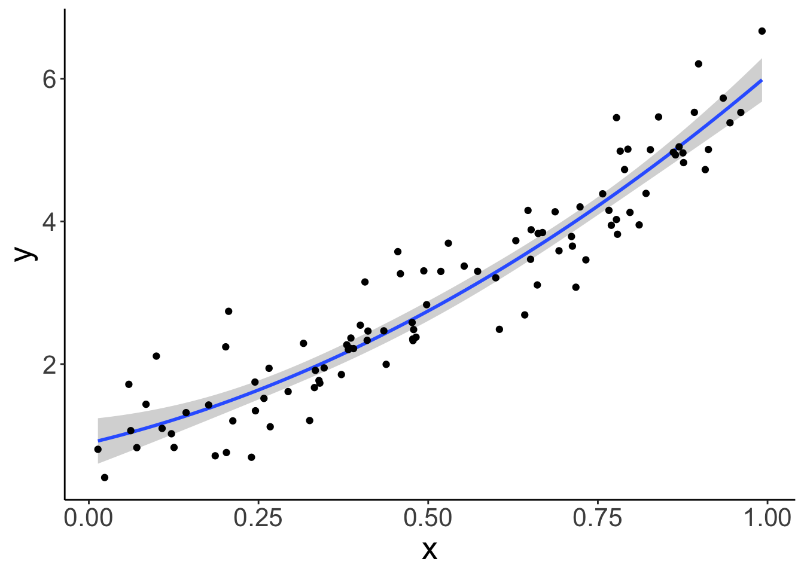

# Model comparison

## Learning goals

- Model comparison. 
- Underfitting vs. overfitting. 
- Cross-validation.
  - Leave-one-out cross-validation.
  - k-fold cross-validation.
  - Monte Carlo cross-validation.
- Information criteria: AIC and BIC. 

## Load packages and set plotting theme


```r
library("knitr")      # for knitting RMarkdown 
library("kableExtra") # for making nice tables
library("janitor")    # for cleaning column names
library("broom")      # for tidying up linear models 
library("patchwork")  # for figure panels
library("modelr")     # for cross-validation
library("tidyverse")  # for wrangling, plotting, etc. 
```


```r
theme_set(theme_classic() + #set the theme 
            theme(text = element_text(size = 20))) #set the default text size

opts_chunk$set(comment = "",
               fig.show = "hold")
```

## Model comparison

In general, we want our models to explain the data we observed, and correctly predict future data. Often, there is a trade-off between how well the model fits the data we have (e.g. how much of the variance it explains), and how well the model will predict future data. If our model is too complex, then it will not only capture the systematicity in the data but also fit to the noise in the data. If our mdoel is too simple, however, it will not capture some of the systematicity that's actually present in the data. The goal, as always in statistical modeling, is to find a model that finds the sweet spot between simplicity and complexity. 

### Fitting vs. predicting

Let's illustrate the trade-off between complexity and simplicty for fitting vs. prediction. We generate data from a model of the following form: 

$$
Y_i = \beta_0 + \beta_1 \cdot X_i + \beta_2 + X_i^2 + \epsilon_i
$$
where 

$$
\epsilon_i \sim \mathcal{N}(\text{mean} = 0, ~\text{sd} = 20)
$$
Here, I'll use the following parameters: $\beta_0 = 10$, $\beta_1 = 3$, and $\beta_2 = 2$ to generate the data:


```r
set.seed(1)

n_plots = 3

# sample size 
n_samples = 20 

# number of parameters in the polynomial regression
n_parameters = c(1:4, seq(7, 19, length.out = 5)) 

# generate data 
df.data = tibble(x = runif(n_samples, min = 0, max = 10), 
                 y = 10 + 3 * x + 3 * x^2 + rnorm(n_samples, sd = 20))

# plotting function
plot_fit = function(i){
  # calculate RMSE
  rmse = lm(formula = y ~ poly(x, degree = i, raw = TRUE),
            data = df.data) %>% 
    rmse(data = df.data)
  
  # make a plot
  ggplot(data = df.data,
         mapping = aes(x = x,
                       y = y)) +
    geom_point(size = 2) +
    geom_smooth(method = "lm", se = F,
                formula = y ~ poly(x, degree = i, raw = TRUE)) +
    annotate(geom = "text",
             x = Inf,
             y = -Inf,
             label = str_c("RMSE = ", round(rmse, 2)),
             hjust = 1.1,
             vjust = -0.3) + 
    theme(axis.ticks = element_blank(),
          axis.title = element_blank(),
          axis.text = element_blank())
}

# save plots in a list
l.p = map(.x = n_parameters,
          .f = ~ plot_fit(.))

# make figure panel 
wrap_plots(plotlist = l.p, ncol = 3)
```


As we can see, RMSE becomes smaller and smaller the more parameters the model has to fit the data. But how does the RMSE look like for new data that is generated from the same underlying ground truth? 


```r
set.seed(1)

n_plots = 3

# sample size 
n_samples = 20 

# number of parameters in the polynomial regression
n_parameters = c(1:4, seq(7, 19, length.out = 5)) 

# generate data 
df.data = tibble(
  x = runif(n_samples, min = 0, max = 10), 
  y = 10 + 3 * x + 3 * x^2 + rnorm(n_samples, sd = 20)
)

# generate some more data 
df.more_data = tibble(x = runif(50, min = 0, max = 10), 
                      y = 10 + 3 * x + 3 * x^2 + rnorm(50, sd = 20))

# list for plots 
l.p = list()

# plotting function
plot_fit = function(i){
  # calculate RMSE for fitted data 
  fit = lm(formula = y ~ poly(x, degree = i, raw = TRUE),
           data = df.data)
  
  # calculate RMSE for training data
  rmse = fit %>% 
    rmse(data = df.data)
  
  # calculate RMSE for new data 
  rmse_new = fit %>% 
    rmse(data = df.more_data)
  
  # make a plot
  ggplot(data = df.data,
         mapping = aes(x = x,
                       y = y)) +
    geom_point(size = 2) +
    geom_point(data = df.more_data,
               size = 2, 
               color = "red") +
    geom_smooth(method = "lm", se = F,
                formula = y ~ poly(x, degree = i, raw = TRUE)) +
    annotate(geom = "text",
             x = Inf,
             y = -Inf,
             label = str_c("RMSE = ", round(rmse, 2)),
             hjust = 1.1,
             vjust = -0.3) + 
    annotate(geom = "text",
             x = Inf,
             y = -Inf,
             label = str_c("RMSE = ", round(rmse_new, 2)),
             hjust = 1.1,
             vjust = -2,
             color = "red") + 
    theme(axis.ticks = element_blank(),
          axis.title = element_blank(),
          axis.text = element_blank())
}

# map over the parameters
l.p = map(.x = n_parameters,
          .f = ~ plot_fit(.))

# make figure panel 
wrap_plots(plotlist = l.p, ncol = 3)
```


The RMSE in black shows the root mean squared error for the data that the model was fit on. The RMSE in red shows the RMSE on the new data. As you can see, the complex models do really poorly. They overfit the noise in the original data which leads to make poor predictions for new data. The simplest model (with two parameters) doesn't do particularly well either since it misses out on the quadratic trend in the data. Both the model with the quadratic term (top middle) and a model that includes a cubic term (top right) provide a good balance -- their RMSE on the new data is lowest. 

Let's generate another data set: 


```r
# make example reproducible 
set.seed(1)

# parameters
sample_size = 100
b0 = 1
b1 = 2
b2 = 3
sd = 0.5

# sample
df.data = tibble(participant = 1:sample_size,
                 x = runif(sample_size, min = 0, max = 1),
                 y = b0 + b1*x + b2*x^2 + rnorm(sample_size, sd = sd)) 
```

And plot it: 


```r
ggplot(data = df.data,
       mapping = aes(x = x,
                    y = y)) + 
  geom_smooth(method = "lm",
              formula = y ~ x + I(x^2)) +
  geom_point()
```



### F-test

Let's fit three models of increasing complexity to the data. The model which fits the way in which the data were generated has the following form: 

$$
\widehat Y_i = b_0 + b_1 \cdot X_i + b_2 \cdot X_i^2
$$


```r
# fit models to the data 
fit_simple = lm(y ~ 1 + x, data = df.data)
fit_correct = lm(y ~ 1 + x + I(x^2), data = df.data)
fit_complex = lm(y ~ 1 + x + I(x^2) + I(x^3), data = df.data)

# compare the models using an F-test 
anova(fit_simple, fit_correct)
```

```
Analysis of Variance Table

Model 1: y ~ 1 + x
Model 2: y ~ 1 + x + I(x^2)
  Res.Df    RSS Df Sum of Sq      F    Pr(>F)    
1     98 25.297                                  
2     97 21.693  1    3.6039 16.115 0.0001175 ***
---
Signif. codes:  0 '***' 0.001 '**' 0.01 '*' 0.05 '.' 0.1 ' ' 1
```

```r
anova(fit_correct, fit_complex)
```

```
Analysis of Variance Table

Model 1: y ~ 1 + x + I(x^2)
Model 2: y ~ 1 + x + I(x^2) + I(x^3)
  Res.Df    RSS Df Sum of Sq      F Pr(>F)
1     97 21.693                           
2     96 21.643  1  0.050399 0.2236 0.6374
```

The F-test tells us that `fit_correct` explains significantly more variance than `fit_simple`, whereas `fit_complex` doesn't explain significantly more variance than `fit_correct`. 

But, as discussed in class, there are many situations in which we cannot use the F-test to compare models. Namely, whenever we want to compare unnested models where one models does not include all the predictors of the other model. But, we can still use cross-validation in this case. 

Let's take a look.

### Cross-validation

Cross-validation is a powerful technique for finding the sweet spot between simplicity and complexity. Moreover, we can use cross-validation to compare models that we cannot compare using the F-test approach that we've been using up until now. 

There are many different kinds of cross-validation. All have the same idea in common though: 

- we first fit the model to a subset of the data, often called _training data_ 
- and then check how well the model captures the held-out data, often called _test data_

Different versions of cross-validation differ in how the training and test data sets are defined. We'll look at three different cross-validation techniques: 

1. Leave-on-out cross-validation
2. k-fold cross-validation
3. Monte Carlo cross-validation 

#### Leave-one-out cross-validation

I've used code similar to this one to illustrate how LOO works in class. Here is a simple data set with 9 data points. We fit 9 models, where for each model, the training set includes one of the data points, and then we look at how well the model captures the held-out data point. We can then characterize the model's performance by calculating the mean squared error across the 9 runs. 


```r
# make example reproducible 
set.seed(1)

# sample
df.loo = tibble(x = 1:9,
                y = c(5, 2, 4, 10, 3, 4, 10, 2, 8)) 

df.loo_cross = df.loo %>% 
  crossv_loo() %>% 
  mutate(fit = map(.x = train,
                   .f = ~ lm(y ~ x, data = .)),
         tidy = map(.x = fit,
                    .f = ~ tidy(.))) %>% 
  unnest(tidy)

# original plot 
df.plot = df.loo %>% 
  mutate(color = 1)

# fit to all data except one 
fun.cv_plot = function(data_point){
  
  # determine which point to leave out 
  df.plot = df.plot %>% 
    mutate(color = ifelse(row_number() == data_point, 2, color))
  
  # fit 
  df.fit = df.plot %>% 
    filter(color != 2) %>% 
    lm(formula = y ~ x, data = .) %>% 
    augment(newdata = df.plot %>% 
              filter(color == 2)) %>% 
    clean_names()
  
  p = ggplot(df.plot,
             aes(x, y, color = as.factor(color))) + 
    geom_segment(aes(xend = x,
                     yend = fitted),
                 data = df.fit,
                 color = "red",
                 size = 1) +
    geom_point(size = 2) +
    geom_smooth(method = "lm",
                formula = "y ~ x",
                se = F,
                color = "black", 
                fullrange = T,
                data = df.plot %>% filter(color != 2))  +
    scale_color_manual(values = c("black", "red")) + 
    theme(legend.position = "none",
          axis.title = element_blank(),
          axis.ticks = element_blank(),
          axis.text = element_blank())
  return(p)
}

# save plots in list 
l.plots = map(.x = 1:9,
              .f = ~ fun.cv_plot(.))

# make figure panel 
wrap_plots(plotlist = l.plots, ncol = 3)
```


As you can see, the regression line changes quite a bit depending on which data point is in the test set. 

Now, let's use LOO to evaluate the models on the data set I've created above: 


```r
# fit the models and calculate the RMSE for each model on the test set 
df.cross = df.data %>% 
  crossv_loo() %>% # function which generates training and test data sets 
  mutate(model_simple = map(.x = train,
                            .f = ~ lm(y ~ 1 + x, data = .)),
         model_correct = map(.x = train,
                             .f = ~ lm(y ~ 1 + x + I(x^2), data = .)),
         model_complex = map(.x = train,
                             .f = ~ lm(y ~ 1 + x + I(x^2) + I(x^3), data = .))) %>% 
  pivot_longer(cols = contains("model"),
               names_to = "model",
               values_to = "fit") %>% 
  mutate(rmse = map2_dbl(.x = fit,
                         .y = test,
                         .f = ~ rmse(.x, .y)))

# show the average RMSE for each model 
df.cross %>% 
  group_by(model) %>% 
  summarize(mean_rmse = mean(rmse) %>% 
              round(3))
```

```
# A tibble: 3 × 2
  model         mean_rmse
  <chr>             <dbl>
1 model_complex     0.382
2 model_correct     0.378
3 model_simple      0.401
```

As we can see, the `model_correct` has the lowest average RMSE on the test data. 

One downside with LOO is that it becomes unfeasible when the number of data points is very large, as the number of cross validation runs equals the number of data points. The next cross-validation procedures help in this case. 

#### k-fold cross-validation

For k-fold cross-validation, we split the data set in k folds, and then use k-1 folds as the training set, and the remaining fold as the test set. 

The code is almost identical as before. Instead of `crossv_loo()`, we use the `crossv_kfold()` function instead and say how many times we want to "fold" the data. 


```r
# crossvalidation scheme 
df.cross = df.data %>% 
  crossv_kfold(k = 10) %>% 
  mutate(model_simple = map(.x = train,
                            .f = ~ lm(y ~ 1 + x, data = .)),
         model_correct = map(.x = train,
                             .f = ~ lm(y ~ 1 + x + I(x^2), data = .)),
         model_complex = map(.x = train,
                             .f = ~ lm(y ~ 1 + x + I(x^2) + I(x^3), data = .))) %>% 
  pivot_longer(cols = contains("model"),
               names_to = "model",
               values_to = "fit") %>% 
  mutate(rsquare = map2_dbl(.x = fit,
                            .y = test,
                            .f = ~ rsquare(.x, .y)))

df.cross %>% 
  group_by(model) %>% 
  summarize(median_rsquare = median(rsquare))
```

```
# A tibble: 3 × 2
  model         median_rsquare
  <chr>                  <dbl>
1 model_complex          0.884
2 model_correct          0.889
3 model_simple           0.880
```

Note, for this example, I've calculated $R^2$ (the variance explained by each model) instead of RMSE -- just to show you that you can do this, too. Often it's useful to do both: show how well the model correlates, but also show the error. 

#### Monte Carlo cross-validation

Finally, let's consider another very flexible version of cross-validation. For this version of cross-validation, we determine how many random splits into training set and test set we would like to do, and what proportion of the data should be in the test set. 


```r
# crossvalidation scheme 
df.cross = df.data %>% 
  crossv_mc(n = 50, test = 0.5) %>% # number of samples, and percentage of test 
  mutate(model_simple = map(.x = train,
                            .f = ~ lm(y ~ 1 + x, data = .x)),
         model_correct = map(.x = train,
                             .f = ~ lm(y ~ 1 + x + I(x^2), data = .x)),
         model_complex = map(.x = train,
                             .f = ~ lm(y ~ 1 + x + I(x^2) + I(x^3), data = .))) %>% 
  pivot_longer(cols = contains("model"),
               names_to = "model",
               values_to = "fit") %>% 
  mutate(rmse = map2_dbl(.x = fit,
                         .y = test,
                         .f = ~ rmse(.x, .y)))

df.cross %>% 
  group_by(model) %>% 
  summarize(mean_rmse = mean(rmse))
```

```
# A tibble: 3 × 2
  model         mean_rmse
  <chr>             <dbl>
1 model_complex     0.492
2 model_correct     0.484
3 model_simple      0.515
```

In this example, I've asked for $n = 50$ splits and for each split, half of the data was in the training set, and half of the data in the test set. 

### Bootstrap

We can also use the `modelr` package for bootstrapping. The idea is the same as when we did cross-validation. We create a number of data sets from our original data set. Instead of splitting the data set in a training and test data set, for bootstrapping, we sample values from the original data set with replacement. Doing so, we can, for example, calculate the confidence interval of different statistics of interest. 

Here is an example for how to boostrap confidence intervals for a mean. 


```r
# make example reproducible 
set.seed(1)

sample_size = 10 

# sample
df.data = tibble(participant = 1:sample_size,
                 x = runif(sample_size, min = 0, max = 1)) 

# mean of the actual sample
mean(df.data$x)
```

```
[1] 0.5515139
```

```r
# bootstrap to get confidence intervals around the mean 
df.data %>%
  bootstrap(n = 1000) %>% # create 1000 bootstrapped samples
  mutate(estimate = map_dbl(.x = strap,
                            .f = ~ .x %>% 
                              as_tibble() %>% 
                              pull(x) %>% 
                              mean())) %>% 
  summarize(mean = mean(estimate),
            low = quantile(estimate, 0.025), # calculate the 2.5 / 97.5 percentiles
            high = quantile(estimate, 0.975))
```

```
# A tibble: 1 × 3
   mean   low  high
  <dbl> <dbl> <dbl>
1 0.556 0.378 0.732
```

### AIC and BIC

The Akaike Information Criterion (AIC) and the Bayesian Information Criterion (BIC) are defined as follows: 

$$
\text{AIC} = 2k-2\ln(\hat L)
$$

$$
\text{BIC} = \ln(n)k-2\ln(\hat L)
$$

where $k$ is the number of parameters in the model, $n$ is the number of observations, and $\hat L$ is the maximized value of the likelihood function of the model. Both AIC and BIC trade off model fit (as measured by the maximum likelihood of the data $\hat L$) and the number of parameters in the model. 

Calculating AIC and BIC in R is straightforward. We simply need to fit a linear model, and then call the `AIC()` or `BIC()` functions on the fitted model like so: 


```r
set.seed(0)

# let's generate some data 
df.example = tibble(x = runif(20, min = 0, max = 1),
                    y = 1 + 3 * x + rnorm(20, sd = 2))

# fit a linear model 
fit = lm(formula = y ~ 1 + x,
         data = df.example)

# get AIC 
AIC(fit)
```

```
[1] 75.47296
```

```r
# get BIC
BIC(fit)
```

```
[1] 78.46016
```

We can also just use the `broom` package to get that information: 


```r
fit %>% 
  glance()
```

```
# A tibble: 1 × 12
  r.squared adj.r.squared sigma statistic p.value    df logLik   AIC   BIC
      <dbl>         <dbl> <dbl>     <dbl>   <dbl> <dbl>  <dbl> <dbl> <dbl>
1     0.255         0.214  1.45      6.16  0.0232     1  -34.7  75.5  78.5
# … with 3 more variables: deviance <dbl>, df.residual <int>, nobs <int>
```

Both AIC and BIC take the number of parameters and the model's likelihood into account. BIC additionally considers the number of observations. But how is the likelihood of a linear model determined? 

Let's visualize the data first: 


```r
# plot the data with a linear model fit  
ggplot(data = df.example,
       mapping = aes(x = x,
                     y = y)) + 
  geom_point(size = 2) +
  geom_smooth(method = "lm",
              color = "black")
```


Now, let's take a look at the residuals by plotting the fitted values on the x axis, and the residuals on the y axis. 


```r
# residual plot 
df.plot = df.example %>% 
  lm(formula = y ~ x,
     data = .) %>% 
  augment() %>% 
  clean_names()

ggplot(data = df.plot,
       mapping = aes(x = fitted, 
                     y = resid)) + 
  geom_point(size = 2)
```


Remember that the linear model makes the assumption that the residuals are normally distributed with mean 0 (which is always the case if we fit a linear model) and some fitted standard deviation. In fact, the standard deviation of the normal distribution is fitted such that the overall likelihood of the data is maximized. 

Let's make a plot that shows a normal distribution alongside the residuals: 


```r
# define a normal distribution 
df.normal = tibble(y = seq(-5, 5, 0.1),
                   x = dnorm(y, sd = 2) + 3.75)

# show the residual plot together with the normal distribution
ggplot(data = df.plot ,
       mapping = aes(x = fitted, y = resid)) + 
  geom_point() +
  geom_path(data = df.normal,
            aes(x = x, y = y),
            size = 2)
```


To determine the likelihood of the data given the model $\hat L$, we now calculate the likelihood of each point (with the `dnorm()` function), and then multiply the likelihood of each data point to get the overall likelihood. We can simply multiply the data points since we also assume that the data points are independent. 
Instead of multiplying likelihoods, we often sum the log likelihoods instead. This is because if we multiply many small values, the overall value gets to close to 0 so that computers get confused. By taking logs instead, we avoid these nasty precision errors. 

To better understand AIC and BIC, let's calculate them by hand: 


```r
# we first get the estimate of the standard deviation of the residuals 
sigma = fit %>% 
  glance() %>% 
  pull(sigma)

# then we calculate the log likelihood of the model 
log_likelihood = fit %>% 
  augment() %>% 
  mutate(likelihood = dnorm(.resid, sd = sigma)) %>% 
  summarize(logLik = sum(log(likelihood))) %>% 
  as.numeric()

# then we calculate AIC and BIC using the formulas introduced above
aic = 2*3 - 2 * log_likelihood
bic = log(nrow(df.example)) * 3 - 2 * log_likelihood

print(aic)
```

```
[1] 75.58017
```

```r
print(bic)
```

```
[1] 78.56737
```

Cool! The values are the same as when we use the `glance()` function like so (except for a small difference due to rounding): 


```r
fit %>% 
  glance() %>% 
  select(AIC, BIC)
```

```
# A tibble: 1 × 2
    AIC   BIC
  <dbl> <dbl>
1  75.5  78.5
```

#### log() is your friend


```r
ggplot(data = tibble(x = c(0, 1)),
       mapping = aes(x = x)) + 
  stat_function(fun = "log",
                size = 1) +
  labs(x = "probability",
       y = "log(probability)") +
  theme(axis.text = element_text(size = 24),
        axis.title = element_text(size = 26))
```


## Additional resources

### Datacamp course

- [Foundations of Functional Programming with purrr](https://www.datacamp.com/courses/foundations-of-functional-programming-with-purrr)
- [Intermediate functional programming with purrr](https://www.datacamp.com/courses/intermediate-functional-programming-with-purrr)

### Reading

- [R for Data Science: Chapter 25](https://r4ds.had.co.nz/many-models.html)

## Session info

Information about this R session including which version of R was used, and what packages were loaded. 


```r
sessionInfo()
```

```
R version 4.1.2 (2021-11-01)
Platform: x86_64-apple-darwin17.0 (64-bit)
Running under: macOS Big Sur 10.16

Matrix products: default
BLAS:   /Library/Frameworks/R.framework/Versions/4.1/Resources/lib/libRblas.0.dylib
LAPACK: /Library/Frameworks/R.framework/Versions/4.1/Resources/lib/libRlapack.dylib

locale:
[1] en_US.UTF-8/en_US.UTF-8/en_US.UTF-8/C/en_US.UTF-8/en_US.UTF-8

attached base packages:
[1] stats     graphics  grDevices utils     datasets  methods   base     

other attached packages:
 [1] forcats_0.5.1    stringr_1.4.0    dplyr_1.0.9      purrr_0.3.4     
 [5] readr_2.1.2      tidyr_1.2.0      tibble_3.1.7     ggplot2_3.3.6   
 [9] tidyverse_1.3.1  modelr_0.1.8     patchwork_1.1.1  broom_0.8.0     
[13] janitor_2.1.0    kableExtra_1.3.4 knitr_1.39      

loaded via a namespace (and not attached):
 [1] lattice_0.20-45   svglite_2.1.0     lubridate_1.8.0   assertthat_0.2.1 
 [5] digest_0.6.29     utf8_1.2.2        R6_2.5.1          cellranger_1.1.0 
 [9] backports_1.4.1   reprex_2.0.1      evaluate_0.15     highr_0.9        
[13] httr_1.4.3        pillar_1.7.0      rlang_1.0.2       readxl_1.4.0     
[17] rstudioapi_0.13   jquerylib_0.1.4   Matrix_1.4-1      rmarkdown_2.14   
[21] labeling_0.4.2    splines_4.1.2     webshot_0.5.3     munsell_0.5.0    
[25] compiler_4.1.2    xfun_0.30         pkgconfig_2.0.3   systemfonts_1.0.4
[29] mgcv_1.8-40       htmltools_0.5.2   tidyselect_1.1.2  bookdown_0.26    
[33] fansi_1.0.3       viridisLite_0.4.0 withr_2.5.0       crayon_1.5.1     
[37] tzdb_0.3.0        dbplyr_2.1.1      grid_4.1.2        nlme_3.1-157     
[41] jsonlite_1.8.0    gtable_0.3.0      lifecycle_1.0.1   DBI_1.1.2        
[45] magrittr_2.0.3    scales_1.2.0      cli_3.3.0         stringi_1.7.6    
[49] farver_2.1.0      fs_1.5.2          snakecase_0.11.0  xml2_1.3.3       
[53] bslib_0.3.1       ellipsis_0.3.2    generics_0.1.2    vctrs_0.4.1      
[57] tools_4.1.2       glue_1.6.2        hms_1.1.1         fastmap_1.1.0    
[61] yaml_2.3.5        colorspace_2.0-3  rvest_1.0.2       haven_2.5.0      
[65] sass_0.4.1       
```

