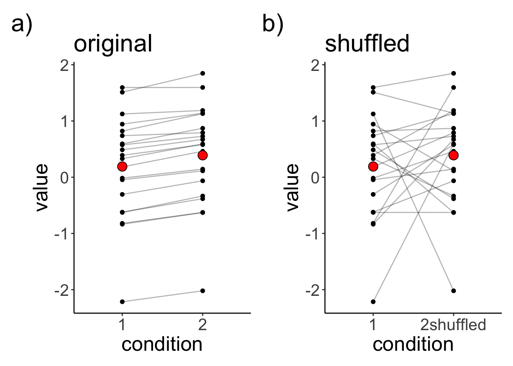
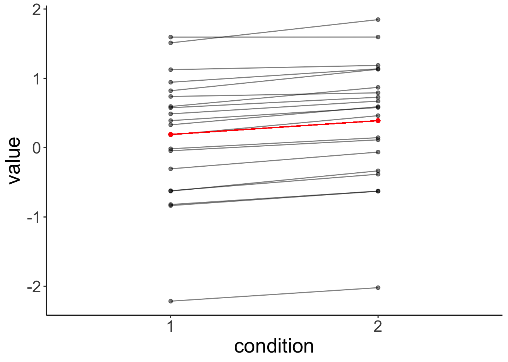

# Linear mixed effects models 1

## Learning goals

- Understanding sources of dependence in data. 
  - fixed effects vs. random effects. 
- `lmer()` syntax in R. 
- Understanding the `lmer()` summary. 
- Simulating data from an `lmer()`.

## Load packages and set plotting theme


``` r
library("knitr")        # for knitting RMarkdown 
library("kableExtra")   # for making nice tables
library("janitor")      # for cleaning column names
library("broom.mixed")  # for tidying up linear models 
library("patchwork")    # for making figure panels
library("lme4")         # for linear mixed effects models
library("tidyverse")    # for wrangling, plotting, etc. 
```


``` r
theme_set(theme_classic() + #set the theme 
            theme(text = element_text(size = 20))) #set the default text size

opts_chunk$set(comment = "",
               fig.show = "hold")
```

## Dependence

Let's generate a data set in which two observations from the same participants are dependent, and then let's also shuffle this data set to see whether taking into account the dependence in the data matters. 


``` r
# make example reproducible 
set.seed(1)

df.dependence = tibble(participant = 1:20,
                       condition1 = rnorm(20),
                       condition2 = condition1 + rnorm(20, mean = 0.2, sd = 0.1)) %>% 
  mutate(condition2shuffled = sample(condition2)) # shuffles the condition label
```

Let's visualize the original and shuffled data set: 


``` r
df.plot = df.dependence %>% 
  pivot_longer(cols = -participant,
               names_to = "condition",
               values_to = "value") %>% 
  mutate(condition = str_replace(condition, "condition", ""))

p1 = ggplot(data = df.plot %>% 
              filter(condition != "2shuffled"), 
            mapping = aes(x = condition, y = value)) +
  geom_line(aes(group = participant), alpha = 0.3) +
  geom_point() +
  stat_summary(fun = "mean", 
               geom = "point",
               shape = 21, 
               fill = "red",
               size = 4) +
  labs(title = "original",
       tag = "a)")

p2 = ggplot(data = df.plot %>% 
              filter(condition != "2"), 
            mapping = aes(x = condition, y = value)) +
  geom_line(aes(group = participant), alpha = 0.3) +
  geom_point() +
  stat_summary(fun = "mean", 
               geom = "point",
               shape = 21, 
               fill = "red",
               size = 4) +
  labs(title = "shuffled",
       tag = "b)")

p1 + p2 
```



Let's save the two original and shuffled data set as two separate data sets.


``` r
# separate the data sets 
df.original = df.dependence %>% 
  pivot_longer(cols = -participant,
               names_to = "condition",
               values_to = "value") %>% 
  mutate(condition = str_replace(condition, "condition", "")) %>% 
  filter(condition != "2shuffled")

df.shuffled = df.dependence %>% 
  pivot_longer(cols = -participant,
               names_to = "condition",
               values_to = "value") %>% 
  mutate(condition = str_replace(condition, "condition", "")) %>% 
  filter(condition != "2")
```

Let's run a linear model, and independent samples t-test on the original data set. 


``` r
# linear model (assuming independent samples)
lm(formula = value ~ condition,
   data = df.original) %>% 
  summary() 
```

```

Call:
lm(formula = value ~ condition, data = df.original)

Residuals:
    Min      1Q  Median      3Q     Max 
-2.4100 -0.5530  0.1945  0.5685  1.4578 

Coefficients:
            Estimate Std. Error t value Pr(>|t|)
(Intercept)   0.1905     0.2025   0.941    0.353
condition2    0.1994     0.2864   0.696    0.491

Residual standard error: 0.9058 on 38 degrees of freedom
Multiple R-squared:  0.01259,	Adjusted R-squared:  -0.0134 
F-statistic: 0.4843 on 1 and 38 DF,  p-value: 0.4907
```

``` r
t.test(df.original$value[df.original$condition == "1"],
       df.original$value[df.original$condition == "2"],
       alternative = "two.sided",
       paired = F)
```

```

	Welch Two Sample t-test

data:  df.original$value[df.original$condition == "1"] and df.original$value[df.original$condition == "2"]
t = -0.69595, df = 37.99, p-value = 0.4907
alternative hypothesis: true difference in means is not equal to 0
95 percent confidence interval:
 -0.7792396  0.3805339
sample estimates:
mean of x mean of y 
0.1905239 0.3898767 
```

The mean difference between the conditions is extremely small, and non-significant (if we ignore the dependence in the data). 

Let's fit a linear mixed effects model with a random intercept for each participant: 


``` r
# fit a linear mixed effects model 
lmer(formula = value ~ condition + (1 | participant),
     data = df.original) %>% 
  summary()
```

```
Linear mixed model fit by REML ['lmerMod']
Formula: value ~ condition + (1 | participant)
   Data: df.original

REML criterion at convergence: 17.3

Scaled residuals: 
     Min       1Q   Median       3Q      Max 
-1.55996 -0.36399 -0.03341  0.34400  1.65823 

Random effects:
 Groups      Name        Variance Std.Dev.
 participant (Intercept) 0.816722 0.90373 
 Residual                0.003796 0.06161 
Number of obs: 40, groups:  participant, 20

Fixed effects:
            Estimate Std. Error t value
(Intercept)  0.19052    0.20255   0.941
condition2   0.19935    0.01948  10.231

Correlation of Fixed Effects:
           (Intr)
condition2 -0.048
```

To test for whether condition is a significant predictor, we need to use our model comparison approach: 


``` r
# fit models
fit.compact = lmer(formula = value ~ 1 + (1 | participant),
                   data = df.original)
fit.augmented = lmer(formula = value ~ condition + (1 | participant),
                     data = df.original)

# compare via Chisq-test
anova(fit.compact, fit.augmented)
```

```
refitting model(s) with ML (instead of REML)
```

```
Data: df.original
Models:
fit.compact: value ~ 1 + (1 | participant)
fit.augmented: value ~ condition + (1 | participant)
              npar    AIC    BIC   logLik deviance  Chisq Df Pr(>Chisq)    
fit.compact      3 53.315 58.382 -23.6575   47.315                         
fit.augmented    4 17.849 24.605  -4.9247    9.849 37.466  1  9.304e-10 ***
---
Signif. codes:  0 '***' 0.001 '**' 0.01 '*' 0.05 '.' 0.1 ' ' 1
```

This result is identical to running a paired samples t-test: 


``` r
t.test(df.original$value[df.original$condition == "1"],
       df.original$value[df.original$condition == "2"],
       alternative = "two.sided",
       paired = T)
```

```

	Paired t-test

data:  df.original$value[df.original$condition == "1"] and df.original$value[df.original$condition == "2"]
t = -10.231, df = 19, p-value = 3.636e-09
alternative hypothesis: true mean difference is not equal to 0
95 percent confidence interval:
 -0.2401340 -0.1585717
sample estimates:
mean difference 
     -0.1993528 
```

But, unlike in the paired samples t-test, the linear mixed effects model explicitly models the variation between participants, and it's a much more flexible approach for modeling dependence in data. 

Let's fit a linear model and a linear mixed effects model to the original (non-shuffled) data. 


``` r
# model assuming independence
fit.independent = lm(formula = value ~ 1 + condition,
                     data = df.original)

# model assuming dependence
fit.dependent = lmer(formula = value ~ 1 + condition + (1 | participant),
                     data = df.original)
```

Let's visualize the linear model's predictions: 


``` r
# plot with predictions by fit.independent 
fit.independent %>% 
  augment() %>% 
  bind_cols(df.original %>%
              select(participant)) %>% 
  clean_names() %>% 
  ggplot(data = .,
         mapping = aes(x = condition,
                       y = value,
                       group = participant)) +
  geom_point(alpha = 0.5) +
  geom_line(alpha = 0.5) +
  geom_point(aes(y = fitted),
             color = "red") + 
  geom_line(aes(y = fitted),
            color = "red")
```



And this is what the residuals look like: 


``` r
# make example reproducible 
set.seed(1)

fit.independent %>% 
  augment() %>% 
  bind_cols(df.original %>%
              select(participant)) %>% 
  clean_names() %>% 
  mutate(index = as.numeric(condition),
         index = index + runif(n(), min = -0.3, max = 0.3)) %>% 
  ggplot(data = .,
         mapping = aes(x = index,
                       y = value,
                       group = participant,
                       color = condition)) +
  geom_point() + 
  geom_smooth(method = "lm",
              se = F,
              formula = "y ~ 1",
              aes(group = condition)) +
  geom_segment(aes(xend = index,
                   yend = fitted),
               alpha = 0.5) +
  scale_color_brewer(palette = "Set1") +
  scale_x_continuous(breaks = 1:2, 
                     labels = 1:2) +
  labs(x = "condition") +
  theme(legend.position = "none")
```


It's clear from this residual plot, that fitting two separate lines (or points) is not much better than just fitting one line (or point). 

Let's visualize the predictions of the linear mixed effects model: 


``` r
# plot with predictions by fit.independent 
fit.dependent %>% 
  augment() %>% 
  clean_names() %>% 
  ggplot(data = .,
         mapping = aes(x = condition,
                       y = value,
                       group = participant)) +
  geom_point(alpha = 0.5) +
  geom_line(alpha = 0.5) +
  geom_point(aes(y = fitted),
             color = "red") + 
  geom_line(aes(y = fitted),
            color = "red")
```


Let's compare the residuals of the linear model with that of the linear mixed effects model: 


``` r
# linear model 
p1 = fit.independent %>% 
  augment() %>% 
  clean_names() %>% 
  ggplot(data = .,
         mapping = aes(x = fitted,
                       y = resid)) +
  geom_point() +
  coord_cartesian(ylim = c(-2.5, 2.5))

# linear mixed effects model 
p2 = fit.dependent %>% 
  augment() %>% 
  clean_names() %>% 
  ggplot(data = .,
         mapping = aes(x = fitted,
                       y = resid)) +
  geom_point() + 
  coord_cartesian(ylim = c(-2.5, 2.5))

p1 + p2
```


The residuals of the linear mixed effects model are much smaller. Let's test whether taking the individual variation into account is worth it (statistically speaking). 


``` r
# fit models (without and with dependence)
fit.compact = lm(formula = value ~ 1 + condition,
                 data = df.original)

fit.augmented = lmer(formula = value ~ 1 + condition + (1 | participant),
                     data = df.original)

# compare models
# note: the lmer model has to be entered as the first argument
anova(fit.augmented, fit.compact) 
```

```
refitting model(s) with ML (instead of REML)
```

```
Data: df.original
Models:
fit.compact: value ~ 1 + condition
fit.augmented: value ~ 1 + condition + (1 | participant)
              npar     AIC     BIC  logLik deviance  Chisq Df Pr(>Chisq)    
fit.compact      3 109.551 114.617 -51.775  103.551                         
fit.augmented    4  17.849  24.605  -4.925    9.849 93.701  1  < 2.2e-16 ***
---
Signif. codes:  0 '***' 0.001 '**' 0.01 '*' 0.05 '.' 0.1 ' ' 1
```

Yes, the linear mixed effects model explains the data better than the linear model. 

## Additional resources

### Readings

- [Linear mixed effects models tutorial by Bodo Winter](https://arxiv.org/pdf/1308.5499.pdf)

## Session info

Information about this R session including which version of R was used, and what packages were loaded. 


``` r
sessionInfo()
```

```
R version 4.4.2 (2024-10-31)
Platform: aarch64-apple-darwin20
Running under: macOS Sequoia 15.2

Matrix products: default
BLAS:   /Library/Frameworks/R.framework/Versions/4.4-arm64/Resources/lib/libRblas.0.dylib 
LAPACK: /Library/Frameworks/R.framework/Versions/4.4-arm64/Resources/lib/libRlapack.dylib;  LAPACK version 3.12.0

locale:
[1] en_US.UTF-8/en_US.UTF-8/en_US.UTF-8/C/en_US.UTF-8/en_US.UTF-8

time zone: America/Los_Angeles
tzcode source: internal

attached base packages:
[1] stats     graphics  grDevices utils     datasets  methods   base     

other attached packages:
 [1] lubridate_1.9.3     forcats_1.0.0       stringr_1.5.1      
 [4] dplyr_1.1.4         purrr_1.0.2         readr_2.1.5        
 [7] tidyr_1.3.1         tibble_3.2.1        ggplot2_3.5.1      
[10] tidyverse_2.0.0     lme4_1.1-35.5       Matrix_1.7-1       
[13] patchwork_1.3.0     broom.mixed_0.2.9.6 janitor_2.2.1      
[16] kableExtra_1.4.0    knitr_1.49         

loaded via a namespace (and not attached):
 [1] gtable_0.3.5       xfun_0.49          bslib_0.7.0        lattice_0.22-6    
 [5] tzdb_0.4.0         vctrs_0.6.5        tools_4.4.2        generics_0.1.3    
 [9] parallel_4.4.2     fansi_1.0.6        pkgconfig_2.0.3    RColorBrewer_1.1-3
[13] lifecycle_1.0.4    compiler_4.4.2     farver_2.1.2       munsell_0.5.1     
[17] codetools_0.2-20   snakecase_0.11.1   htmltools_0.5.8.1  sass_0.4.9        
[21] yaml_2.3.10        nloptr_2.1.1       pillar_1.9.0       furrr_0.3.1       
[25] jquerylib_0.1.4    MASS_7.3-64        cachem_1.1.0       boot_1.3-31       
[29] nlme_3.1-166       parallelly_1.37.1  tidyselect_1.2.1   digest_0.6.36     
[33] stringi_1.8.4      future_1.33.2      bookdown_0.42      listenv_0.9.1     
[37] labeling_0.4.3     splines_4.4.2      fastmap_1.2.0      grid_4.4.2        
[41] colorspace_2.1-0   cli_3.6.3          magrittr_2.0.3     utf8_1.2.4        
[45] broom_1.0.7        withr_3.0.2        scales_1.3.0       backports_1.5.0   
[49] timechange_0.3.0   rmarkdown_2.29     globals_0.16.3     hms_1.1.3         
[53] evaluate_0.24.0    viridisLite_0.4.2  mgcv_1.9-1         rlang_1.1.4       
[57] Rcpp_1.0.13        glue_1.8.0         xml2_1.3.6         minqa_1.2.7       
[61] svglite_2.1.3      rstudioapi_0.16.0  jsonlite_1.8.8     R6_2.5.1          
[65] systemfonts_1.1.0 
```
