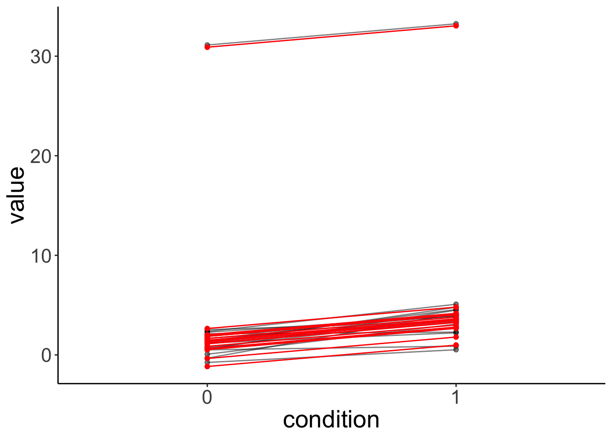
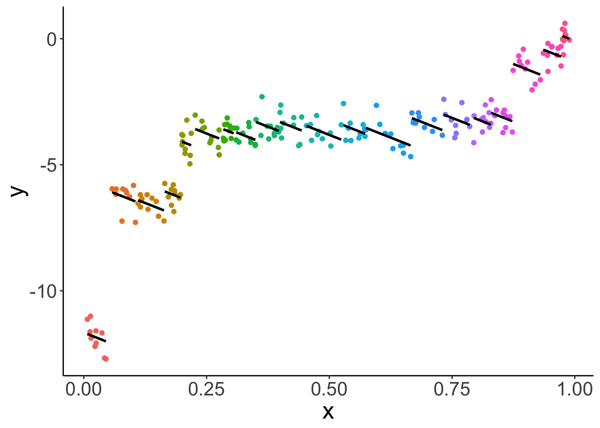

# Linear mixed effects models 2

## Load packages and set plotting theme  


```r
library("knitr")      # for knitting RMarkdown 
library("kableExtra") # for making nice tables
library("janitor")    # for cleaning column names
library("broom")    # for tidying up linear models 
library("patchwork")    # for making figure panels
library("lme4")    # for linear mixed effects models
library("tidyverse")  # for wrangling, plotting, etc. 

opts_chunk$set(
  comment = "",
  results = "hold",
  fig.show = "hold"
)
```


```r
theme_set(
  theme_classic() + #set the theme 
    theme(text = element_text(size = 20)) #set the default text size
)
```

## Things that came up in class 

### Difference between `replicate()` and `map()`

`replicate()` comes with base R whereas `map()` is part of the tidyverse. `map()` can do everything that `replicate()` can do and more. However, if you just want to run the same function (without changing the parameters) multiple times, you might as well use `replicate()`. 

Here are some examples for what you can do with `replicate()` and `map()`.


```r
# draw from a normal distribution and take mean
fun.normal_means = function(n, mean, sd){
  mean(rnorm(n = n, mean = mean, sd = sd))
}

# execute the function 4 times
replicate(n = 4, fun.normal_means(n = 20, mean = 1, sd = 0.5))

# same same but different 
map_dbl(.x = c(20, 20, 20, 20), ~ fun.normal_means(n = .x, mean = 1, sd = 0.5))

# and more flexible
map_dbl(.x = c(1, 1, 10, 10), ~ fun.normal_means(n = 20, mean = .x, sd = 0.5))
```

```
[1] 0.9039552 1.0169436 1.0148487 0.9197371
[1] 0.9204829 0.9522566 1.1886722 1.1998876
[1]  1.046509  1.144344 10.205437  9.792719
```

## Simulating a linear mixed effects model 

To generate some data for a linear mixed effects model with random intercepts, we do pretty much what we are used to doing when we generated data for a linear model. However, this time, we have an additional parameter that captures the variance in the intercepts between participants. So, we draw a separate (offset from the global) intercept for each participant from this distribution.  


```r
# make example reproducible 
set.seed(1)

# parameters
sample_size = 100
b0 = 1
b1 = 2
sd_residual = 1
sd_participant = 0.5 

# randomly draw intercepts for each participant
intercepts = rnorm(sample_size, sd = sd_participant)

# generate the data 
df.mixed = tibble(
  condition = rep(0:1, each = sample_size), 
  participant = rep(1:sample_size, 2)) %>% 
  group_by(condition) %>% 
  mutate(value = b0 + b1 * condition + intercepts + rnorm(n(), sd = sd_residual)) %>% 
  ungroup %>% 
  mutate(condition = as.factor(condition),
         participant = as.factor(participant))
```

Let's fit a model to this data now and take a look at the summary output: 


```r
# fit model
fit.mixed = lmer(formula = value ~ 1 + condition + (1 | participant),
                data = df.mixed)

fit.mixed %>% 
  summary()
```

```
Linear mixed model fit by REML ['lmerMod']
Formula: value ~ 1 + condition + (1 | participant)
   Data: df.mixed

REML criterion at convergence: 606

Scaled residuals: 
     Min       1Q   Median       3Q      Max 
-2.53710 -0.62295 -0.04364  0.67035  2.19899 

Random effects:
 Groups      Name        Variance Std.Dev.
 participant (Intercept) 0.1607   0.4009  
 Residual                1.0427   1.0211  
Number of obs: 200, groups:  participant, 100

Fixed effects:
            Estimate Std. Error t value
(Intercept)   1.0166     0.1097   9.267
condition1    2.0675     0.1444  14.317

Correlation of Fixed Effects:
           (Intr)
condition1 -0.658
```

Let's visualize the model's predictions: 


```r
fit.mixed %>%
  augment() %>%
  clean_names() %>%
  ggplot(data = .,
         mapping = aes(x = condition,
                       y = value,
                       group = participant)) +
  geom_point(alpha = 0.5) +
  geom_line(alpha = 0.5) +
  geom_point(aes(y = fitted),
             color = "red") +
  geom_line(aes(y = fitted),
             color = "red")
```


Let's simulate some data from this fitted model: 


```r
# simulated data 
fit.mixed %>% 
  simulate() %>% 
  bind_cols(df.mixed) %>% 
  ggplot(data = .,
         mapping = aes(x = condition,
                       y = sim_1,
                       group = participant)) +
  geom_line(alpha = 0.5) +
  geom_point(alpha = 0.5)
```


Even though we only fitted random intercepts in this model, when we simulate from the model, we get different slopes since, when simulating new data, the model takes our uncertainty in the residuals into account as well. 

Let's see whether fitting random intercepts was worth it in this case: 


```r
# using chisq test
fit.compact = lm(formula = value ~ 1 +  condition,
                data = df.mixed)

fit.augmented = lmer(formula = value ~ 1 + condition +  (1 | participant),
                data = df.mixed)

anova(fit.augmented, fit.compact)
```

```
refitting model(s) with ML (instead of REML)
```

```
Data: df.mixed
Models:
fit.compact: value ~ 1 + condition
fit.augmented: value ~ 1 + condition + (1 | participant)
              Df   AIC    BIC logLik deviance  Chisq Chi Df Pr(>Chisq)
fit.compact    3 608.6 618.49 -301.3    602.6                         
fit.augmented  4 608.8 621.99 -300.4    600.8 1.7999      1     0.1797
```

Nope, it's not worth it in this case. That said, even though having random intercepts does not increase the likelihood of the data given the model significantly, we should still include random intercepts to capture the dependence in the data. 

## The effect of outliers 

Let's take 20 participants from our `df.mixed` data set, and make one of the participants be an outlier: 


```r
# let's make one outlier
df.outlier = df.mixed %>%
  mutate(participant = participant %>% as.character() %>% as.numeric()) %>% 
  filter(participant <= 20) %>% 
  mutate(value = ifelse(participant == 20, value + 30, value),
         participant = as.factor(participant))
```

Let's fit the model and look at the summary: 


```r
# fit model
fit.outlier = lmer(formula = value ~ 1 + condition + (1 | participant),
                   data = df.outlier)

fit.outlier %>% 
  summary()
```

```
Linear mixed model fit by REML ['lmerMod']
Formula: value ~ 1 + condition + (1 | participant)
   Data: df.outlier

REML criterion at convergence: 192

Scaled residuals: 
     Min       1Q   Median       3Q      Max 
-1.44598 -0.48367  0.03043  0.44689  1.41232 

Random effects:
 Groups      Name        Variance Std.Dev.
 participant (Intercept) 45.1359  6.7183  
 Residual                 0.6738  0.8209  
Number of obs: 40, groups:  participant, 20

Fixed effects:
            Estimate Std. Error t value
(Intercept)   2.7091     1.5134   1.790
condition1    2.1512     0.2596   8.287

Correlation of Fixed Effects:
           (Intr)
condition1 -0.086
```

The variance for the participants' intercepts has increased dramatically! 

Let's visualize the data together with the model's predictions: 


```r
fit.outlier %>%
  augment() %>%
  clean_names() %>%
  ggplot(data = .,
         mapping = aes(x = condition,
                       y = value,
                       group = participant)) +
  geom_point(alpha = 0.5) +
  geom_line(alpha = 0.5) +
  geom_point(aes(y = fitted),
             color = "red") +
  geom_line(aes(y = fitted),
             color = "red")
```



The model is still able to capture the participants quite well. But note what its simulated data looks like now: 


```r
# simulated data from lmer with outlier
fit.outlier %>% 
  simulate() %>% 
  bind_cols(df.outlier) %>% 
  ggplot(data = .,
         mapping = aes(x = condition,
                       y = sim_1,
                       group = participant)) +
  geom_line(alpha = 0.5) +
  geom_point(alpha = 0.5)
```


The simulated data doesn't look like our original data. This is because one normal distribution is used to model the variance in the intercepts between participants. 

## Different slopes 

Let's generate data where the effect of condition is different for participants: 


```r
# make example reproducible 
set.seed(1)

tmp = rnorm(n = 20)

df.slopes = tibble(
  condition = rep(1:2, each = 20), 
  participant = rep(1:20, 2),
  value = ifelse(condition == 1, tmp,
                 mean(tmp) + rnorm(n = 20, sd = 0.3)) # regression to the mean
) %>% 
  mutate(condition = as.factor(condition),
         participant = as.factor(participant))
```

Let's fit a model with random intercepts. 


```r
fit.slopes = lmer(formula = value ~ 1 + condition + (1 | participant),
                data = df.slopes)
```

```
boundary (singular) fit: see ?isSingular
```

```r
fit.slopes %>% summary()
```

```
Linear mixed model fit by REML ['lmerMod']
Formula: value ~ 1 + condition + (1 | participant)
   Data: df.slopes

REML criterion at convergence: 83.6

Scaled residuals: 
    Min      1Q  Median      3Q     Max 
-3.5808 -0.3184  0.0130  0.4551  2.0913 

Random effects:
 Groups      Name        Variance Std.Dev.
 participant (Intercept) 0.0000   0.0000  
 Residual                0.4512   0.6717  
Number of obs: 40, groups:  participant, 20

Fixed effects:
             Estimate Std. Error t value
(Intercept)  0.190524   0.150197   1.268
condition2  -0.001941   0.212411  -0.009

Correlation of Fixed Effects:
           (Intr)
condition2 -0.707
convergence code: 0
boundary (singular) fit: see ?isSingular
```

Note how the summary says "singular fit", and how the variance for random intercepts is 0. Here, fitting random intercepts did not help the model fit at all, so the lmer gave up ... 

How about fitting random slopes? 


```r
# fit model
lmer(formula = value ~ 1 + condition + (1 + condition | participant),
     data = df.slopes)
```

This won't work because the model has more parameters than there are data points. To fit random slopes, we need more than 2 observations per participants. 

## Simpson's paradox 

Taking dependence in the data into account is extremely important. The Simpson's paradox is an instructive example for what can go wrong when we ignore the dependence in the data. 

Let's start by simulating some data to demonstrate the paradox. 


```r
# make example reproducible 
set.seed(2)

n_participants = 20
n_observations = 10
slope = -10 
sd_error = 0.4
sd_participant = 5
intercept = rnorm(n_participants, sd = sd_participant) %>% sort()

df.simpson = tibble(x = runif(n_participants * n_observations, min = 0, max = 1)) %>%
  arrange(x) %>% 
  mutate(intercept = rep(intercept, each = n_observations),
         y = intercept + x * slope + rnorm(n(), sd = sd_error),
         participant = factor(intercept, labels = 1:n_participants))
```

Let's visualize the overall relationship between `x` and `y` with a simple linear model. 


```r
# overall effect 
ggplot(data = df.simpson,
       mapping = aes(x = x,
                     y = y)) +
  geom_point() +
  geom_smooth(method = "lm",
              color = "black")
```


As we see, overall, there is a positive relationship between `x` and `y`.


```r
lm(formula = y ~ x,
   data = df.simpson) %>% 
  summary()
```

```

Call:
lm(formula = y ~ x, data = df.simpson)

Residuals:
    Min      1Q  Median      3Q     Max 
-5.8731 -0.6362  0.2272  1.0051  2.6410 

Coefficients:
            Estimate Std. Error t value Pr(>|t|)    
(Intercept)  -7.1151     0.2107  -33.76   <2e-16 ***
x             6.3671     0.3631   17.54   <2e-16 ***
---
Signif. codes:  0 '***' 0.001 '**' 0.01 '*' 0.05 '.' 0.1 ' ' 1

Residual standard error: 1.55 on 198 degrees of freedom
Multiple R-squared:  0.6083,	Adjusted R-squared:  0.6064 
F-statistic: 307.5 on 1 and 198 DF,  p-value: < 2.2e-16
```

And this relationship is significant. 

Let's take another look at the data use different colors for the different participants.


```r
# effect by participant 
ggplot(data = df.simpson,
       mapping = aes(x = x,
                     y = y,
                     color = participant)) +
  geom_point() +
  geom_smooth(method = "lm",
              color = "black") +
  theme(legend.position = "none")
```


And let's fit a different regression for each participant:


```r
# effect by participant 
ggplot(data = df.simpson,
       mapping = aes(x = x,
                     y = y,
                     color = participant,
                     group = participant)) +
  geom_point() +
  geom_smooth(method = "lm",
              color = "black") +
  theme(legend.position = "none")
```



What this plot shows, is that for almost all individual participants, the relationship between `x` and `y` is negative. The different participants where along the `x` spectrum they are. 

Let's fit a linear mixed effects model with random intercepts: 


```r
fit.lmer = lmer(formula = y ~ 1 + x + (1 | participant),
     data = df.simpson)

fit.lmer %>% 
  summary()
```

```
Linear mixed model fit by REML ['lmerMod']
Formula: y ~ 1 + x + (1 | participant)
   Data: df.simpson

REML criterion at convergence: 345.1

Scaled residuals: 
     Min       1Q   Median       3Q      Max 
-2.43394 -0.59687  0.04493  0.62694  2.68828 

Random effects:
 Groups      Name        Variance Std.Dev.
 participant (Intercept) 21.4898  4.6357  
 Residual                 0.1661  0.4075  
Number of obs: 200, groups:  participant, 20

Fixed effects:
            Estimate Std. Error t value
(Intercept)  -0.1577     1.3230  -0.119
x            -7.6678     1.6572  -4.627

Correlation of Fixed Effects:
  (Intr)
x -0.621
```

As we can see, the fixed effect for `x` is now negative! 


```r
fit.lmer %>% 
  augment() %>% 
  clean_names() %>% 
  ggplot(data = .,
         aes(x = x,
             y = y,
             group = participant,
             color = participant)) +
  geom_point() +
  geom_line(aes(y = fitted),
            size = 1,
            color = "black") +
  theme(legend.position = "none")
```


Lesson learned: taking dependence into account is critical for drawing correct inferences! 

## Additional resources 

### Readings 

- [Linear mixed effects models tutorial by Bodo Winter](https://arxiv.org/pdf/1308.5499.pdf)
- [Simpson's paradox](https://paulvanderlaken.com/2017/09/27/simpsons-paradox-two-hr-examples-with-r-code/)
- [Tutorial on pooling](https://www.tjmahr.com/plotting-partial-pooling-in-mixed-effects-models/)
