# Linear mixed effects models 2

## Learning goals

- An `lmer()` worked example
  - complete pooling vs. no pooling vs. partial pooling
  - getting p-values 
  - checking model assumptions
- Simulating mixed effects models
  - effect of outliers 
  - non-homogeneity of variance 
  - Simpson's paradox 

## Load packages and set plotting theme


``` r
library("knitr")       # for knitting RMarkdown 
library("kableExtra")  # for making nice tables
library("janitor")     # for cleaning column names
library("broom.mixed") # for tidying up linear models 
library("ggeffects")   # for plotting marginal effects
library("emmeans")     # for the joint_tests() function 
library("lme4")        # for linear mixed effects models
library("performance") # for assessing model performance
library("see")         # for assessing model performance
library("tidyverse")   # for wrangling, plotting, etc. 
```


``` r
theme_set(theme_classic() + #set the theme 
            theme(text = element_text(size = 20))) #set the default text size

opts_chunk$set(comment = "",
               fig.show = "hold")
```

## A worked example

Let's illustrate the concept of pooling and shrinkage via the sleep data set that comes with the lmer package. 


``` r
# load sleepstudy data set 
df.sleep = sleepstudy %>% 
  as_tibble() %>% 
  clean_names() %>% 
  mutate(subject = as.character(subject)) %>% 
  select(subject, days, reaction)
```


``` r
# add two fake participants (with missing data)
df.sleep = df.sleep %>% 
  bind_rows(tibble(subject = "374",
                   days = 0:1,
                   reaction = c(286, 288)),
            tibble(subject = "373",
                   days = 0,
                   reaction = 245))
```

Let's start by visualizing the data 


``` r
# visualize the data
ggplot(data = df.sleep,
       mapping = aes(x = days, y = reaction)) + 
  geom_point() +
  facet_wrap(~subject, ncol = 5) +
  labs(x = "Days of sleep deprivation", 
       y = "Average reaction time (ms)") + 
  scale_x_continuous(breaks = 0:4 * 2) +
  theme(strip.text = element_text(size = 12),
        axis.text.y = element_text(size = 12))
```


The plot shows the effect of the number of days of sleep deprivation on the average reaction time (presumably in an experiment). Note that for participant 373 and 374 we only have one and two data points respectively. 

### Complete pooling

Let's first fit a model the simply combines all the data points. This model ignores the dependence structure in the data (i.e. the fact that we have repeated observations from the same participants). 


``` r
fit.complete = lm(formula = reaction ~ days,
                  data = df.sleep)

fit.params = tidy(fit.complete)

summary(fit.complete)
```

```

Call:
lm(formula = reaction ~ days, data = df.sleep)

Residuals:
     Min       1Q   Median       3Q      Max 
-110.646  -27.951    1.829   26.388  139.875 

Coefficients:
            Estimate Std. Error t value Pr(>|t|)    
(Intercept)  252.321      6.406  39.389  < 2e-16 ***
days          10.328      1.210   8.537 5.48e-15 ***
---
Signif. codes:  0 '***' 0.001 '**' 0.01 '*' 0.05 '.' 0.1 ' ' 1

Residual standard error: 47.43 on 181 degrees of freedom
Multiple R-squared:  0.2871,	Adjusted R-squared:  0.2831 
F-statistic: 72.88 on 1 and 181 DF,  p-value: 5.484e-15
```

And let's visualize the predictions of this model.


``` r
# visualization (aggregate) 
ggplot(data = df.sleep,
       mapping = aes(x = days, y = reaction)) + 
  geom_abline(intercept = fit.params$estimate[1],
              slope = fit.params$estimate[2],
              color = "blue") +
  geom_point() +
  labs(x = "Days of sleep deprivation", 
       y = "Average reaction time (ms)") + 
  scale_x_continuous(breaks = 0:4 * 2) +
  theme(strip.text = element_text(size = 12),
        axis.text.y = element_text(size = 12))
```

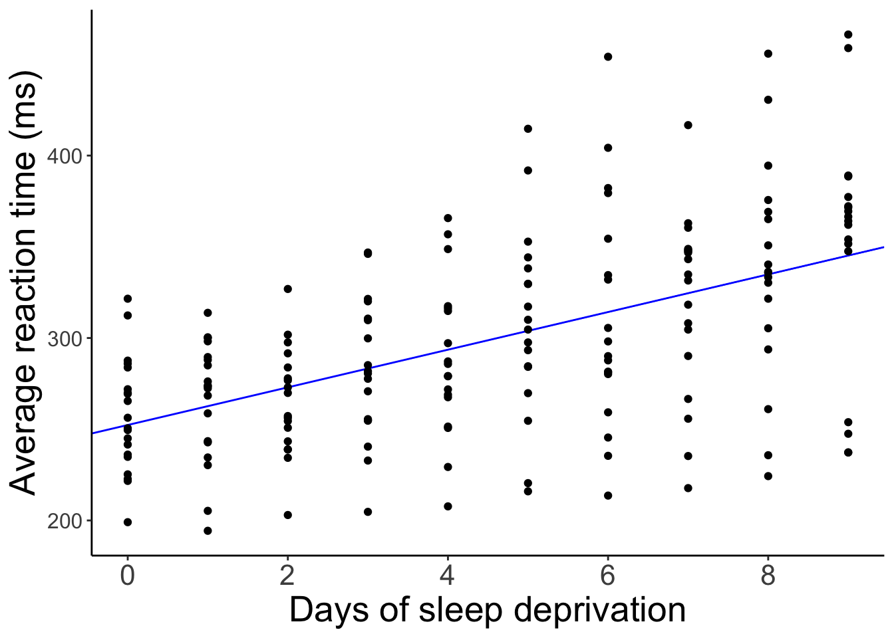

And here is what the model's predictions look like separated by participant.


``` r
# visualization (separate participants) 
ggplot(data = df.sleep,
       mapping = aes(x = days, y = reaction)) + 
  geom_abline(intercept = fit.params$estimate[1],
              slope = fit.params$estimate[2],
              color = "blue") +
  geom_point() +
  facet_wrap(~subject, ncol = 5) +
  labs(x = "Days of sleep deprivation", 
       y = "Average reaction time (ms)") + 
  scale_x_continuous(breaks = 0:4 * 2) +
  theme(strip.text = element_text(size = 12),
        axis.text.y = element_text(size = 12))
```

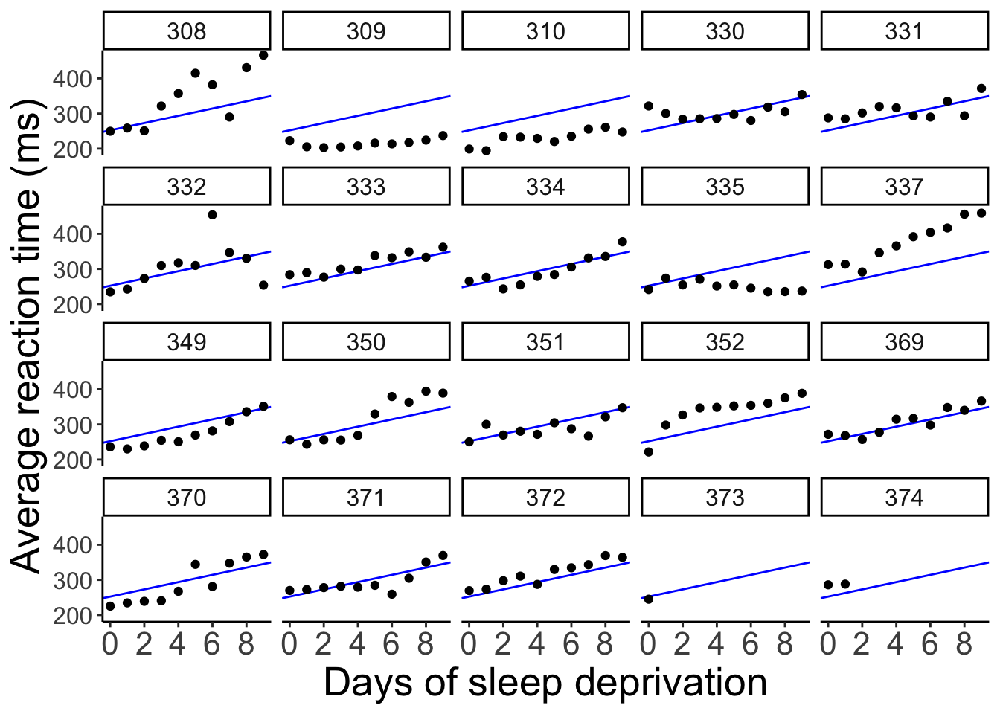

The model predicts the same relationship between sleep deprivation and reaction time for each participant (not surprising since we didn't even tell the model that this data is based on different participants). 

### No pooling

We could also fit separate regressions for each participant. Let's do that.


``` r
# fit regressions and extract parameter estimates 
df.no_pooling = df.sleep %>% 
  group_by(subject) %>% 
  nest(data = c(days, reaction)) %>% 
  mutate(fit = map(data, ~ lm(reaction ~ days, data = .)),
         params = map(fit, tidy)) %>% 
  ungroup() %>% 
  unnest(c(params)) %>% 
  select(subject, term, estimate) %>% 
  complete(subject, term, fill = list(estimate = 0)) %>% 
  pivot_wider(names_from = term,
              values_from = estimate) %>% 
  clean_names()
```

And let's visualize what the predictions of these separate regressions would look like: 


``` r
ggplot(data = df.sleep,
       mapping = aes(x = days,
                     y = reaction)) + 
  geom_abline(data = df.no_pooling %>% 
                filter(subject != 373),
              aes(intercept = intercept,
                  slope = days),
              color = "blue") +
  geom_point() +
  facet_wrap(~subject, ncol = 5) +
  labs(x = "Days of sleep deprivation", 
       y = "Average reaction time (ms)") + 
  scale_x_continuous(breaks = 0:4 * 2) +
  theme(strip.text = element_text(size = 12),
        axis.text.y = element_text(size = 12))
```


When we fit separate regression, no information is shared between participants. 

### Partial pooling

By usign linear mixed effects models, we are partially pooling information. That is, the estimates for one participant are influenced by the rest of the participants.

We'll fit a number of mixed effects models that differ in their random effects structure. 

#### Random intercept and random slope

This model allows for random differences in the intercepts and slopes between subjects (and also models the correlation between intercepts and slopes). 

Let's fit the model


``` r
fit.random_intercept_slope = lmer(formula = reaction ~ 1 + days + (1 + days | subject),
                                  data = df.sleep)
```

and take a look at the model's predictions: 


``` r
fit.random_intercept_slope %>% 
  augment() %>% 
  clean_names() %>% 
ggplot(data = .,
       mapping = aes(x = days,
                     y = reaction)) + 
  geom_line(aes(y = fitted),
            color = "blue") + 
  geom_point() +
  facet_wrap(~subject, ncol = 5) +
  labs(x = "Days of sleep deprivation", 
       y = "Average reaction time (ms)") + 
  scale_x_continuous(breaks = 0:4 * 2) +
  theme(strip.text = element_text(size = 12),
        axis.text.y = element_text(size = 12))
```


As we can see, the lines for each participant are different. We've allowed for the intercept as well as the relationship between sleep deprivation and reaction time to be different between participants. 

#### Only random intercepts

Let's fit a model that only allows for the intercepts to vary between participants. 


``` r
fit.random_intercept = lmer(formula = reaction ~ 1 + days + (1 | subject),
                            data = df.sleep)
```

And let's visualize what these predictions look like: 


``` r
fit.random_intercept %>% 
  augment() %>% 
  clean_names() %>% 
ggplot(data = .,
       mapping = aes(x = days,
                     y = reaction)) + 
  geom_line(aes(y = fitted),
            color = "blue") + 
  geom_point() +
  facet_wrap(~subject, ncol = 5) +
  labs(x = "Days of sleep deprivation", 
       y = "Average reaction time (ms)") + 
  scale_x_continuous(breaks = 0:4 * 2) +
  theme(strip.text = element_text(size = 12),
        axis.text.y = element_text(size = 12))
```

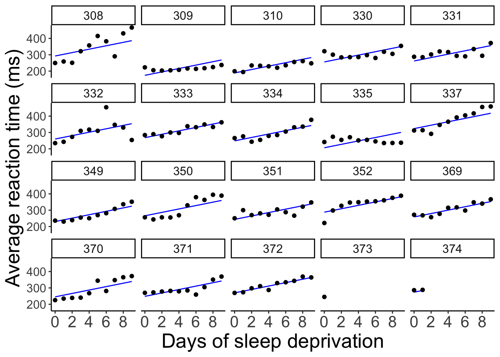

Now, all the lines are parallel but the intercept differs between participants. 

#### Only random slopes

Finally, let's compare a model that only allows for the slopes to differ but not the intercepts. 


``` r
fit.random_slope = lmer(formula = reaction ~ 1 + days + (0 + days | subject),
                        data = df.sleep)
```

And let's visualize the model fit: 


``` r
fit.random_slope %>% 
  augment() %>% 
  clean_names() %>% 
ggplot(data = .,
       mapping = aes(x = days,
                     y = reaction)) + 
  geom_line(aes(y = fitted),
            color = "blue") + 
  geom_point() +
  facet_wrap(vars(subject), ncol = 5) +
  labs(x = "Days of sleep deprivation", 
       y = "Average reaction time (ms)") + 
  scale_x_continuous(breaks = 0:4 * 2) +
  theme(strip.text = element_text(size = 12),
        axis.text.y = element_text(size = 12))
```

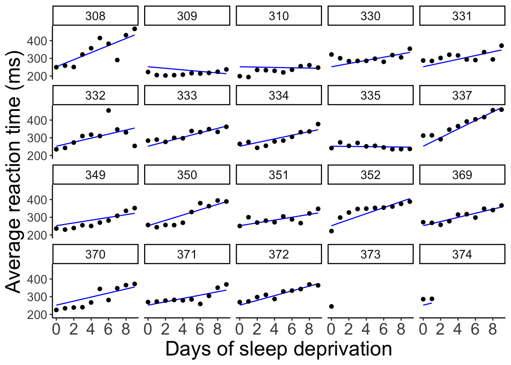

Here, all the lines have the same starting point (i.e. the same intercept) but the slopes are different. 

### Compare results

Let's compare the results of the different methods -- complete pooling, no pooling, and partial pooling (with random intercepts and slopes). 


``` r
# complete pooling
fit.complete_pooling = lm(formula = reaction ~ days,
                          data = df.sleep)  

df.complete_pooling =  fit.complete_pooling %>% 
  augment() %>% 
  bind_rows(fit.complete_pooling %>% 
              augment(newdata = tibble(subject = c("373", "374"),
                                       days = rep(10, 2)))) %>% 
  clean_names() %>% 
  select(reaction, days, complete_pooling = fitted)

# no pooling
df.no_pooling = df.sleep %>% 
  group_by(subject) %>% 
  nest(data = c(days, reaction)) %>% 
  mutate(fit = map(.x = data, 
                   .f = ~ lm(reaction ~ days, data = .x)),
         augment = map(.x = fit, 
                       .f = ~ augment(.x))) %>% 
  unnest(c(augment)) %>% 
  ungroup() %>% 
  clean_names() %>% 
  select(subject, reaction, days, no_pooling = fitted)

# partial pooling
fit.lmer = lmer(formula = reaction ~ 1 + days + (1 + days | subject),
                data = df.sleep) 

df.partial_pooling = fit.lmer %>% 
  augment() %>% 
  bind_rows(fit.lmer %>% 
              augment(newdata = tibble(subject = c("373", "374"),
                                       days = rep(10, 2)))) %>% 
  clean_names() %>% 
  select(subject, reaction, days, partial_pooling = fitted)

# combine results
df.pooling = df.partial_pooling %>% 
  left_join(df.complete_pooling,
            by = c("reaction", "days")) %>% 
  left_join(df.no_pooling,
            by = c("subject", "reaction", "days"))
```

Let's compare the predictions of the different models visually: 


``` r
ggplot(data = df.pooling,
       mapping = aes(x = days,
                     y = reaction)) + 
  geom_smooth(method = "lm",
              se = F,
              color = "orange",
              fullrange = T) + 
  geom_line(aes(y = complete_pooling),
            color = "green") + 
  geom_line(aes(y = partial_pooling),
            color = "blue") + 
  geom_point() +
  facet_wrap(~subject, ncol = 5) +
  labs(x = "Days of sleep deprivation", 
       y = "Average reaction time (ms)") + 
  scale_x_continuous(breaks = 0:4 * 2) +
  theme(strip.text = element_text(size = 12),
        axis.text.y = element_text(size = 12))
```

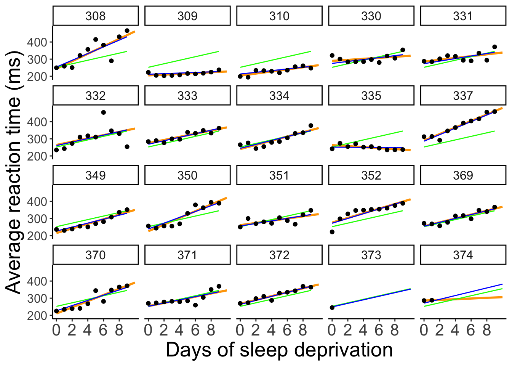

To better see the differences between the approaches, let's focus on the predictions for the participants with incomplete data: 


``` r
# subselection
ggplot(data = df.pooling %>% 
         filter(subject %in% c("373", "374")),
       mapping = aes(x = days,
                     y = reaction)) + 
  geom_smooth(method = "lm",
              se = F,
              color = "orange",
              fullrange = T) + 
  geom_line(aes(y = complete_pooling),
            color = "green") + 
  geom_line(aes(y = partial_pooling),
            color = "blue") + 
  geom_point() +
  facet_wrap(vars(subject)) +
  labs(x = "Days of sleep deprivation", 
       y = "Average reaction time (ms)") + 
  scale_x_continuous(breaks = 0:4 * 2) +
  theme(strip.text = element_text(size = 12),
        axis.text.y = element_text(size = 12))
```


#### Coefficients

One good way to get a sense for what the different models are doing is by taking a look at the coefficients: 


``` r
coef(fit.complete_pooling)
```

```
(Intercept)        days 
  252.32070    10.32766 
```


``` r
coef(fit.random_intercept)
```

```
$subject
    (Intercept)     days
308    292.2749 10.43191
309    174.0559 10.43191
310    188.7454 10.43191
330    256.0247 10.43191
331    261.8141 10.43191
332    259.8262 10.43191
333    268.0765 10.43191
334    248.6471 10.43191
335    206.5096 10.43191
337    323.5643 10.43191
349    230.5114 10.43191
350    265.6957 10.43191
351    243.7988 10.43191
352    287.8850 10.43191
369    258.6454 10.43191
370    245.2931 10.43191
371    248.3508 10.43191
372    269.6861 10.43191
373    248.2086 10.43191
374    273.9400 10.43191

attr(,"class")
[1] "coef.mer"
```


``` r
coef(fit.random_slope)
```

```
$subject
    (Intercept)       days
308    252.2965 19.9526801
309    252.2965 -4.3719650
310    252.2965 -0.9574726
330    252.2965  8.9909957
331    252.2965 10.5394285
332    252.2965 11.3994289
333    252.2965 12.6074020
334    252.2965 10.3413879
335    252.2965 -0.5722073
337    252.2965 24.2246485
349    252.2965  7.7702676
350    252.2965 15.0661415
351    252.2965  7.9675415
352    252.2965 17.0002999
369    252.2965 11.6982767
370    252.2965 11.3939807
371    252.2965  9.4535879
372    252.2965 13.4569059
373    252.2965 10.4142695
374    252.2965 11.9097917

attr(,"class")
[1] "coef.mer"
```


``` r
coef(fit.random_intercept_slope)
```

```
$subject
    (Intercept)       days
308    253.9478 19.6264337
309    211.7331  1.7319161
310    213.1582  4.9061511
330    275.1425  5.6436007
331    273.7286  7.3862730
332    260.6504 10.1632571
333    268.3683 10.2246059
334    244.5524 11.4837802
335    251.3702 -0.3355788
337    286.2319 19.1090424
349    226.7663 11.5531844
350    238.7807 17.0156827
351    256.2344  7.4119456
352    272.3511 13.9920878
369    254.9484 11.2985770
370    226.3701 15.2027877
371    252.5051  9.4335409
372    263.8916 11.7253429
373    248.9753 10.3915288
374    271.1450 11.0782516

attr(,"class")
[1] "coef.mer"
```

#### Shrinkage

In mixed effects models, the variance of parameter estimates across participants shrinks compared to a no pooling model (where we fit a different regression to each participant). Expressed differently, individual parameter estimates are borrowing strength from the overall data set in mixed effects models. 


``` r
# get estimates from partial pooling model
df.partial_pooling = fit.random_intercept_slope %>% 
  coef() %>% 
  .$subject %>% 
  rownames_to_column("subject") %>% 
  clean_names()

# combine estimates from no pooling with partial pooling model 
df.plot = df.sleep %>% 
  group_by(subject) %>% 
  nest(data = c(days, reaction)) %>% 
  mutate(fit = map(.x = data, 
                   .f = ~ lm(reaction ~ days, data = .x)),
         tidy = map(.x = fit, 
                    .f = ~ tidy(.x))) %>% 
  unnest(c(tidy)) %>% 
  select(subject, term, estimate) %>% 
  pivot_wider(names_from = term,
              values_from = estimate) %>% 
  clean_names() %>% 
  mutate(method = "no pooling") %>% 
  bind_rows(df.partial_pooling %>% 
              mutate(method = "partial pooling")) %>% 
  pivot_longer(cols = -c(subject, method),
               names_to = "index", 
               values_to = "value") %>% 
  mutate(index = factor(index, levels = c("intercept", "days")))

# visualize the results  
ggplot(data = df.plot,
       mapping = aes(x = value,
                     group = method,
                     fill = method)) + 
  stat_density(position = "identity",
               geom = "area",
               color = "black",
               alpha = 0.3) +
  facet_grid(cols = vars(index),
             scales = "free")
```

```
Warning: Removed 1 row containing non-finite outside the scale range
(`stat_density()`).
```

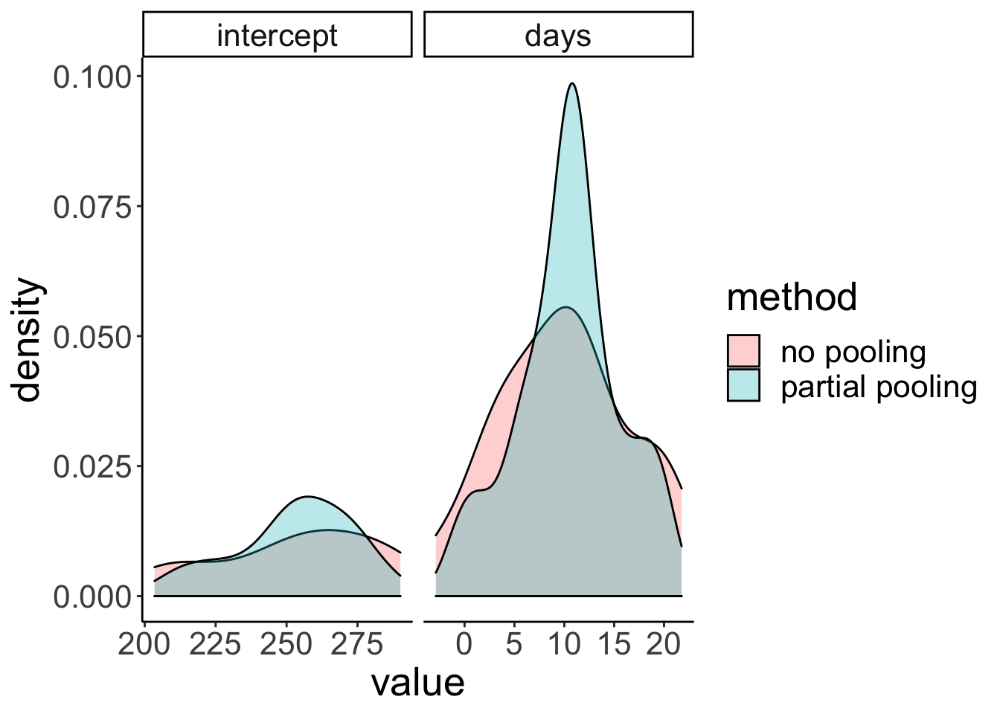

### Getting p-values

To get p-values for mixed effects models, I recommend using the `joint_tests()` function from the `emmeans` package.


``` r
lmer(formula = reaction ~ 1 + days + (1 + days | subject),
     data = df.sleep) %>% 
  joint_tests()
```

```
 model term df1   df2 F.ratio p.value
 days         1 17.08  45.531  <.0001
```

Our good ol' model comparison approach produces a Likelihood ratio test in this case: 


``` r
fit1 = lmer(formula = reaction ~ 1 + days + (1 + days | subject),
            data = df.sleep)

fit2 = lmer(formula = reaction ~ 1 + (1 + days | subject),
            data = df.sleep)

anova(fit1, fit2)
```

```
refitting model(s) with ML (instead of REML)
```

```
Data: df.sleep
Models:
fit2: reaction ~ 1 + (1 + days | subject)
fit1: reaction ~ 1 + days + (1 + days | subject)
     npar    AIC    BIC  logLik deviance  Chisq Df Pr(>Chisq)    
fit2    5 1813.2 1829.3 -901.62   1803.2                         
fit1    6 1791.6 1810.9 -889.82   1779.6 23.602  1  1.184e-06 ***
---
Signif. codes:  0 '***' 0.001 '**' 0.01 '*' 0.05 '.' 0.1 ' ' 1
```

### Reporting results

#### Plotting marginal effects


``` r
# using the plot() function
ggpredict(model = fit.random_intercept_slope,
          terms = "days",
          type = "fixed") %>% 
  plot()

# using our own ggplot magic
df.plot = ggpredict(model = fit.random_intercept_slope,
                    terms = "days",
                    type = "fixed")

ggplot(data = df.plot,
       mapping = aes(x = x, 
                     y = predicted,
                     ymin = conf.low,
                     ymax = conf.high)) + 
  geom_ribbon(fill = "lightblue") +
  geom_line(linewidth = 1)
```

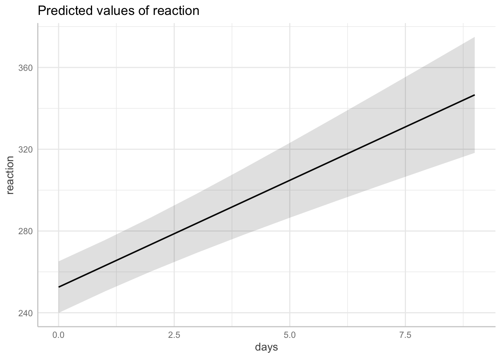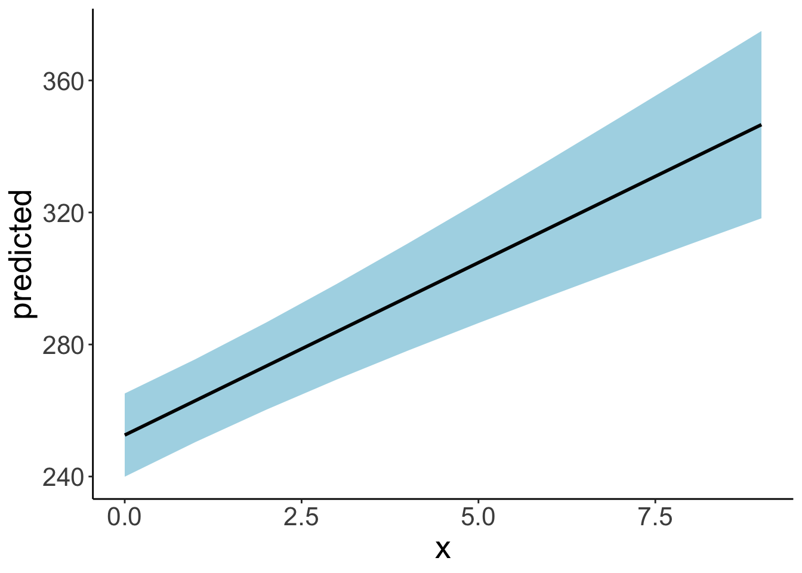

#### Checking model performance


``` r
lmer(formula = reaction ~ 1 + days + (1 + days | subject),
     data = df.sleep) %>% 
  check_model()
```


## Simulating a linear mixed effects model

To generate some data for a linear mixed effects model with random intercepts, we do pretty much what we are used to doing when we generated data for a linear model. However, this time, we have an additional parameter that captures the variance in the intercepts between participants. So, we draw a separate (offset from the global) intercept for each participant from this distribution.  


``` r
# make example reproducible 
set.seed(1)

# parameters
sample_size = 100
b0 = 1
b1 = 2
sd_residual = 1
sd_participant = 0.5 

# generate the data 
df.mixed = tibble(participant = rep(1:sample_size, 2),
                  condition = rep(0:1, each = sample_size)) %>% 
  group_by(participant) %>% 
  mutate(intercepts = rnorm(n = 1, sd = sd_participant)) %>% 
  ungroup() %>% 
  mutate(value = b0 + b1 * condition + intercepts + rnorm(n(), sd = sd_residual)) %>% 
  arrange(participant, condition)

df.mixed
```

```
# A tibble: 200 × 4
   participant condition intercepts   value
         <int>     <int>      <dbl>   <dbl>
 1           1         0    -0.313   0.0664
 2           1         1    -0.313   3.10  
 3           2         0     0.0918  1.13  
 4           2         1     0.0918  4.78  
 5           3         0    -0.418  -0.329 
 6           3         1    -0.418   4.17  
 7           4         0     0.798   1.96  
 8           4         1     0.798   3.47  
 9           5         0     0.165   0.510 
10           5         1     0.165   0.880 
# ℹ 190 more rows
```

Let's fit a model to this data now and take a look at the summary output: 


``` r
# fit model
fit.mixed = lmer(formula = value ~ 1 + condition + (1 | participant),
                 data = df.mixed)

summary(fit.mixed)
```

```
Linear mixed model fit by REML ['lmerMod']
Formula: value ~ 1 + condition + (1 | participant)
   Data: df.mixed

REML criterion at convergence: 606

Scaled residuals: 
     Min       1Q   Median       3Q      Max 
-2.53710 -0.62295 -0.04364  0.67035  2.19899 

Random effects:
 Groups      Name        Variance Std.Dev.
 participant (Intercept) 0.1607   0.4009  
 Residual                1.0427   1.0211  
Number of obs: 200, groups:  participant, 100

Fixed effects:
            Estimate Std. Error t value
(Intercept)   1.0166     0.1097   9.267
condition     2.0675     0.1444  14.317

Correlation of Fixed Effects:
          (Intr)
condition -0.658
```

Let's visualize the model's predictions: 


``` r
fit.mixed %>%
  augment() %>%
  clean_names() %>%
  ggplot(data = .,
         mapping = aes(x = condition,
                       y = value,
                       group = participant)) +
  geom_point(alpha = 0.5) +
  geom_line(alpha = 0.5) +
  geom_point(aes(y = fitted),
             color = "red") +
  geom_line(aes(y = fitted),
             color = "red")
```


Let's simulate some data from this fitted model: 


``` r
# simulated data 
fit.mixed %>% 
  simulate() %>% 
  bind_cols(df.mixed) %>% 
  ggplot(data = .,
         mapping = aes(x = condition,
                       y = sim_1,
                       group = participant)) +
  geom_line(alpha = 0.5) +
  geom_point(alpha = 0.5)
```

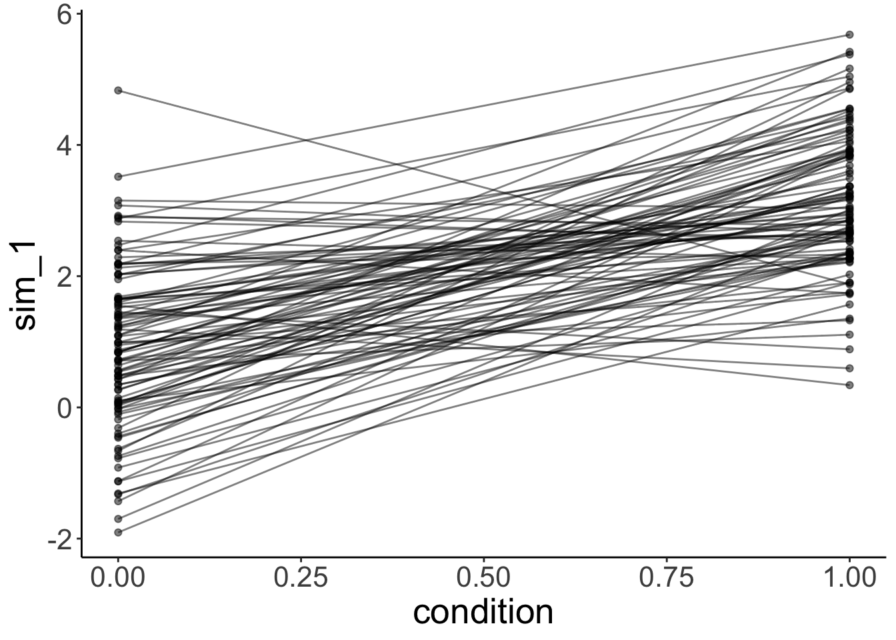

Even though we only fitted random intercepts in this model, when we simulate from the model, we get different slopes since, when simulating new data, the model takes our uncertainty in the residuals into account as well. 

Let's see whether fitting random intercepts was worth it in this case: 


``` r
# using chisq test
fit.compact = lm(formula = value ~ 1 +  condition,
                data = df.mixed)

fit.augmented = lmer(formula = value ~ 1 + condition +  (1 | participant),
                data = df.mixed)

anova(fit.augmented, fit.compact)
```

```
refitting model(s) with ML (instead of REML)
```

```
Data: df.mixed
Models:
fit.compact: value ~ 1 + condition
fit.augmented: value ~ 1 + condition + (1 | participant)
              npar   AIC    BIC logLik deviance  Chisq Df Pr(>Chisq)
fit.compact      3 608.6 618.49 -301.3    602.6                     
fit.augmented    4 608.8 621.99 -300.4    600.8 1.7999  1     0.1797
```

Nope, it's not worth it in this case. That said, even though having random intercepts does not increase the likelihood of the data given the model significantly, we should still include random intercepts to capture the dependence in the data. 

### The effect of outliers

Let's take 20 participants from our `df.mixed` data set, and make one of the participants be an outlier: 


``` r
# let's make one outlier
df.outlier = df.mixed %>%
  mutate(participant = participant %>% as.character() %>% as.numeric()) %>% 
  filter(participant <= 20) %>%
  mutate(value = ifelse(participant == 20, value + 30, value),
         participant = as.factor(participant))
```

Let's fit the model and look at the summary: 


``` r
# fit model
fit.outlier = lmer(formula = value ~ 1 + condition + (1 | participant),
                   data = df.outlier)

summary(fit.outlier)
```

```
Linear mixed model fit by REML ['lmerMod']
Formula: value ~ 1 + condition + (1 | participant)
   Data: df.outlier

REML criterion at convergence: 192

Scaled residuals: 
     Min       1Q   Median       3Q      Max 
-1.44598 -0.48367  0.03043  0.44689  1.41232 

Random effects:
 Groups      Name        Variance Std.Dev.
 participant (Intercept) 45.1359  6.7183  
 Residual                 0.6738  0.8209  
Number of obs: 40, groups:  participant, 20

Fixed effects:
            Estimate Std. Error t value
(Intercept)   2.7091     1.5134   1.790
condition     2.1512     0.2596   8.287

Correlation of Fixed Effects:
          (Intr)
condition -0.086
```
The variance of the participants' intercepts has increased dramatically! 

Let's visualize the data together with the model's predictions: 


``` r
fit.outlier %>%
  augment() %>%
  clean_names() %>%
  ggplot(data = .,
         mapping = aes(x = condition,
                       y = value,
                       group = participant)) +
  geom_point(alpha = 0.5) +
  geom_line(alpha = 0.5) +
  geom_point(aes(y = fitted),
             color = "red") +
  geom_line(aes(y = fitted),
             color = "red")
```

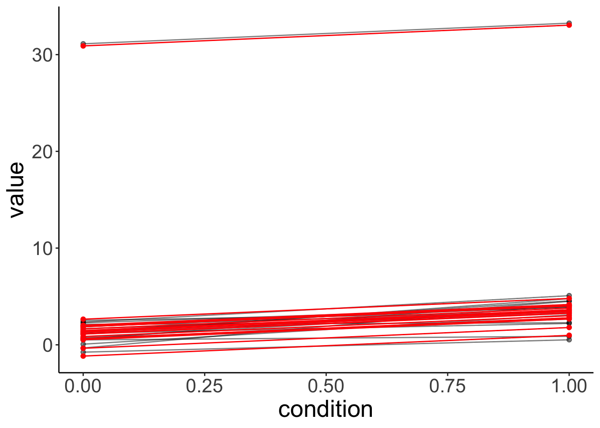

The model is still able to capture the participants quite well. But note what its simulated data looks like now: 


``` r
# simulated data from lmer with outlier
fit.outlier %>% 
  simulate() %>% 
  bind_cols(df.outlier) %>% 
  ggplot(data = .,
         mapping = aes(x = condition,
                       y = sim_1,
                       group = participant)) +
  geom_line(alpha = 0.5) +
  geom_point(alpha = 0.5)
```

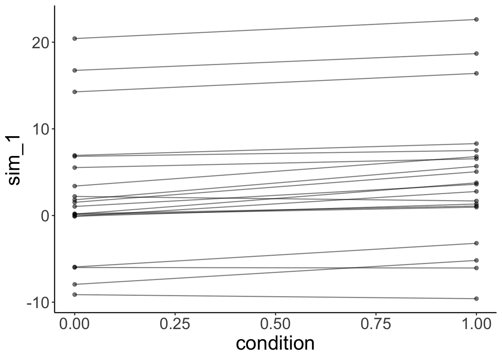

The simulated data doesn't look like our original data. This is because one normal distribution is used to model the variance in the intercepts between participants. 

### Different slopes

Let's generate data where the effect of condition is different for participants: 


``` r
# make example reproducible 
set.seed(1)

tmp = rnorm(n = 20)

df.slopes = tibble(
  condition = rep(1:2, each = 20), 
  participant = rep(1:20, 2),
  value = ifelse(condition == 1, tmp,
                 mean(tmp) + rnorm(n = 20, sd = 0.3)) # regression to the mean
) %>% 
  mutate(condition = as.factor(condition),
         participant = as.factor(participant))
```

Let's fit a model with random intercepts. 


``` r
fit.slopes = lmer(formula = value ~ 1 + condition + (1 | participant),
                data = df.slopes)
```

```
boundary (singular) fit: see help('isSingular')
```

``` r
summary(fit.slopes)
```

```
Linear mixed model fit by REML ['lmerMod']
Formula: value ~ 1 + condition + (1 | participant)
   Data: df.slopes

REML criterion at convergence: 83.6

Scaled residuals: 
    Min      1Q  Median      3Q     Max 
-3.5808 -0.3184  0.0130  0.4551  2.0913 

Random effects:
 Groups      Name        Variance Std.Dev.
 participant (Intercept) 0.0000   0.0000  
 Residual                0.4512   0.6717  
Number of obs: 40, groups:  participant, 20

Fixed effects:
             Estimate Std. Error t value
(Intercept)  0.190524   0.150197   1.268
condition2  -0.001941   0.212411  -0.009

Correlation of Fixed Effects:
           (Intr)
condition2 -0.707
optimizer (nloptwrap) convergence code: 0 (OK)
boundary (singular) fit: see help('isSingular')
```

Note how the summary says "singular fit", and how the variance for random intercepts is 0. Here, fitting random intercepts did not help the model fit at all, so the lmer gave up ... 

How about fitting random slopes? 


``` r
# fit model
lmer(formula = value ~ 1 + condition + (1 + condition | participant),
     data = df.slopes)
```

This won't work because the model has more parameters than there are data points. To fit random slopes, we need more than 2 observations per participants. 

### Simpson's paradox

Taking dependence in the data into account is extremely important. The Simpson's paradox is an instructive example for what can go wrong when we ignore the dependence in the data. 

Let's start by simulating some data to demonstrate the paradox. 


``` r
# make example reproducible 
set.seed(2)

n_participants = 20
n_observations = 10
slope = -10 
sd_error = 0.4
sd_participant = 5
intercept = rnorm(n_participants, sd = sd_participant) %>% 
  sort()

df.simpson = tibble(x = runif(n_participants * n_observations, min = 0, max = 1)) %>%
  arrange(x) %>% 
  mutate(intercept = rep(intercept, each = n_observations),
         y = intercept + x * slope + rnorm(n(), sd = sd_error),
         participant = factor(intercept, labels = 1:n_participants))
```

Let's visualize the overall relationship between `x` and `y` with a simple linear model. 


``` r
# overall effect 
ggplot(data = df.simpson,
       mapping = aes(x = x,
                     y = y)) +
  geom_point() +
  geom_smooth(method = "lm",
              color = "black")
```


As we see, overall, there is a positive relationship between `x` and `y`.


``` r
lm(formula = y ~ x,
   data = df.simpson) %>% 
  summary()
```

```

Call:
lm(formula = y ~ x, data = df.simpson)

Residuals:
    Min      1Q  Median      3Q     Max 
-5.8731 -0.6362  0.2272  1.0051  2.6410 

Coefficients:
            Estimate Std. Error t value Pr(>|t|)    
(Intercept)  -7.1151     0.2107  -33.76   <2e-16 ***
x             6.3671     0.3631   17.54   <2e-16 ***
---
Signif. codes:  0 '***' 0.001 '**' 0.01 '*' 0.05 '.' 0.1 ' ' 1

Residual standard error: 1.55 on 198 degrees of freedom
Multiple R-squared:  0.6083,	Adjusted R-squared:  0.6064 
F-statistic: 307.5 on 1 and 198 DF,  p-value: < 2.2e-16
```

And this relationship is significant. 

Let's take another look at the data use different colors for the different participants.


``` r
# effect by participant 
ggplot(data = df.simpson,
       mapping = aes(x = x,
                     y = y,
                     color = participant)) +
  geom_point() +
  geom_smooth(method = "lm",
              color = "black") +
  theme(legend.position = "none")
```


And let's fit a different regression for each participant:


``` r
# effect by participant 
ggplot(data = df.simpson,
       mapping = aes(x = x,
                     y = y,
                     color = participant,
                     group = participant)) +
  geom_point() +
  geom_smooth(method = "lm",
              color = "black") +
  theme(legend.position = "none")
```

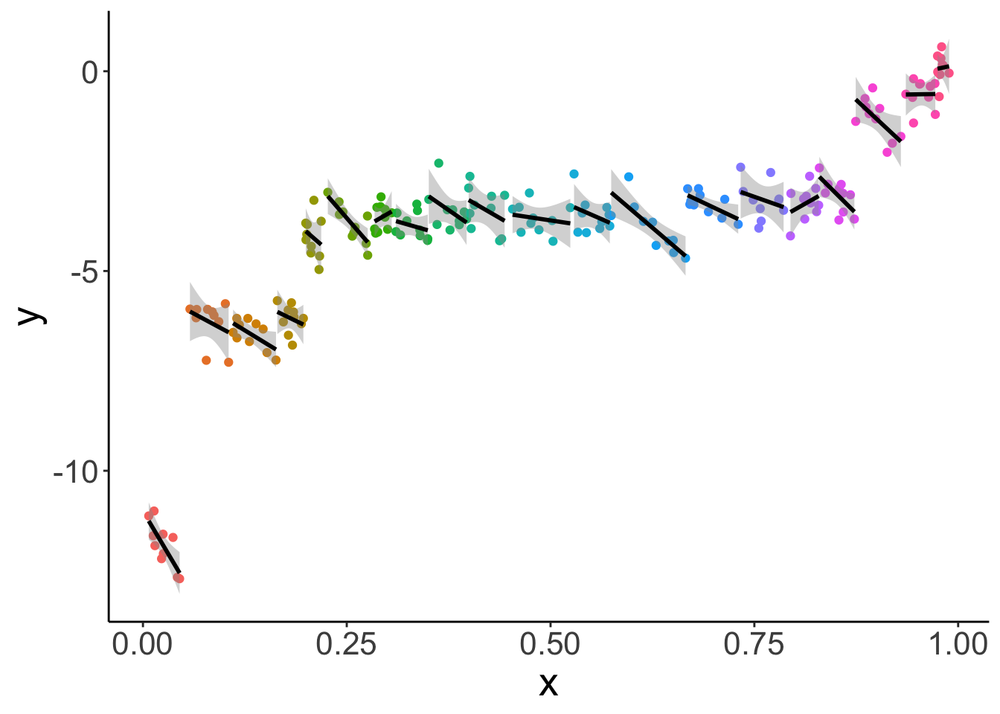

What this plot shows, is that for almost all individual participants, the relationship between `x` and `y` is negative. The different participants where along the `x` spectrum they are. 

Let's fit a linear mixed effects model with random intercepts: 


``` r
fit.lmer = lmer(formula = y ~ 1 + x + (1 | participant),
                data = df.simpson)

fit.lmer %>% 
  summary()
```

```
Linear mixed model fit by REML ['lmerMod']
Formula: y ~ 1 + x + (1 | participant)
   Data: df.simpson

REML criterion at convergence: 345.1

Scaled residuals: 
     Min       1Q   Median       3Q      Max 
-2.43394 -0.59687  0.04493  0.62694  2.68828 

Random effects:
 Groups      Name        Variance Std.Dev.
 participant (Intercept) 21.4898  4.6357  
 Residual                 0.1661  0.4075  
Number of obs: 200, groups:  participant, 20

Fixed effects:
            Estimate Std. Error t value
(Intercept)  -0.1577     1.3230  -0.119
x            -7.6678     1.6572  -4.627

Correlation of Fixed Effects:
  (Intr)
x -0.621
```

As we can see, the fixed effect for `x` is now negative! 


``` r
fit.lmer %>% 
  augment() %>% 
  clean_names() %>% 
  ggplot(data = .,
         aes(x = x,
             y = y,
             group = participant,
             color = participant)) +
  geom_point() +
  geom_line(aes(y = fitted),
            size = 1,
            color = "black") +
  theme(legend.position = "none")
```

```
Warning: Using `size` aesthetic for lines was deprecated in ggplot2 3.4.0.
ℹ Please use `linewidth` instead.
This warning is displayed once every 8 hours.
Call `lifecycle::last_lifecycle_warnings()` to see where this warning was generated.
```


Lesson learned: taking dependence into account is critical for drawing correct inferences! 


## Additional resources

### Readings

- [Linear mixed effects models tutorial by Bodo Winter](https://arxiv.org/pdf/1308.5499.pdf)
- [Simpson's paradox](https://paulvanderlaken.com/2017/09/27/simpsons-paradox-two-hr-examples-with-r-code/)
- [Tutorial on pooling](https://www.tjmahr.com/plotting-partial-pooling-in-mixed-effects-models/)

## Session info

Information about this R session including which version of R was used, and what packages were loaded. 


``` r
sessionInfo()
```

```
R version 4.4.2 (2024-10-31)
Platform: aarch64-apple-darwin20
Running under: macOS Sequoia 15.2

Matrix products: default
BLAS:   /Library/Frameworks/R.framework/Versions/4.4-arm64/Resources/lib/libRblas.0.dylib 
LAPACK: /Library/Frameworks/R.framework/Versions/4.4-arm64/Resources/lib/libRlapack.dylib;  LAPACK version 3.12.0

locale:
[1] en_US.UTF-8/en_US.UTF-8/en_US.UTF-8/C/en_US.UTF-8/en_US.UTF-8

time zone: America/Los_Angeles
tzcode source: internal

attached base packages:
[1] stats     graphics  grDevices utils     datasets  methods   base     

other attached packages:
 [1] lubridate_1.9.3     forcats_1.0.0       stringr_1.5.1      
 [4] dplyr_1.1.4         purrr_1.0.2         readr_2.1.5        
 [7] tidyr_1.3.1         tibble_3.2.1        ggplot2_3.5.1      
[10] tidyverse_2.0.0     see_0.9.0           performance_0.12.4 
[13] lme4_1.1-35.5       Matrix_1.7-1        emmeans_1.10.6     
[16] ggeffects_2.0.0     broom.mixed_0.2.9.6 janitor_2.2.1      
[19] kableExtra_1.4.0    knitr_1.49         

loaded via a namespace (and not attached):
 [1] sjlabelled_1.2.0   tidyselect_1.2.1   viridisLite_0.4.2  farver_2.1.2      
 [5] fastmap_1.2.0      bayestestR_0.15.0  digest_0.6.36      estimability_1.5.1
 [9] timechange_0.3.0   lifecycle_1.0.4    magrittr_2.0.3     compiler_4.4.2    
[13] rlang_1.1.4        sass_0.4.9         tools_4.4.2        utf8_1.2.4        
[17] yaml_2.3.10        labeling_0.4.3     xml2_1.3.6         withr_3.0.2       
[21] datawizard_0.13.0  grid_4.4.2         fansi_1.0.6        xtable_1.8-4      
[25] colorspace_2.1-0   future_1.33.2      globals_0.16.3     scales_1.3.0      
[29] MASS_7.3-64        insight_1.0.0      cli_3.6.3          mvtnorm_1.2-5     
[33] crayon_1.5.3       rmarkdown_2.29     generics_0.1.3     rstudioapi_0.16.0 
[37] tzdb_0.4.0         minqa_1.2.7        cachem_1.1.0       splines_4.4.2     
[41] parallel_4.4.2     vctrs_0.6.5        boot_1.3-31        jsonlite_1.8.8    
[45] bookdown_0.42      patchwork_1.3.0    hms_1.1.3          ggrepel_0.9.6     
[49] pbkrtest_0.5.3     listenv_0.9.1      systemfonts_1.1.0  jquerylib_0.1.4   
[53] glue_1.8.0         parallelly_1.37.1  nloptr_2.1.1       codetools_0.2-20  
[57] stringi_1.8.4      gtable_0.3.5       munsell_0.5.1      furrr_0.3.1       
[61] pillar_1.9.0       htmltools_0.5.8.1  R6_2.5.1           evaluate_0.24.0   
[65] lattice_0.22-6     haven_2.5.4        backports_1.5.0    broom_1.0.7       
[69] snakecase_0.11.1   bslib_0.7.0        Rcpp_1.0.13        svglite_2.1.3     
[73] coda_0.19-4.1      nlme_3.1-166       mgcv_1.9-1         xfun_0.49         
[77] pkgconfig_2.0.3   
```
