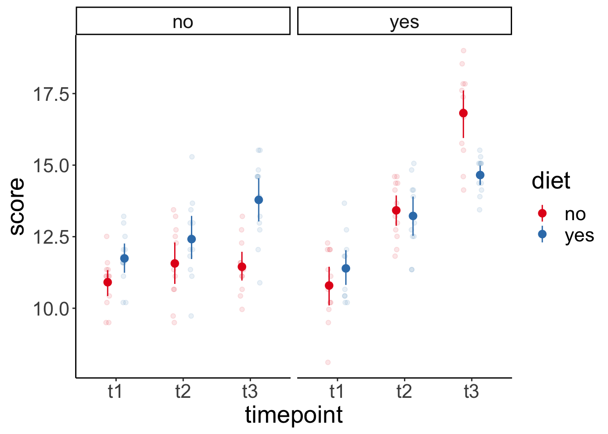
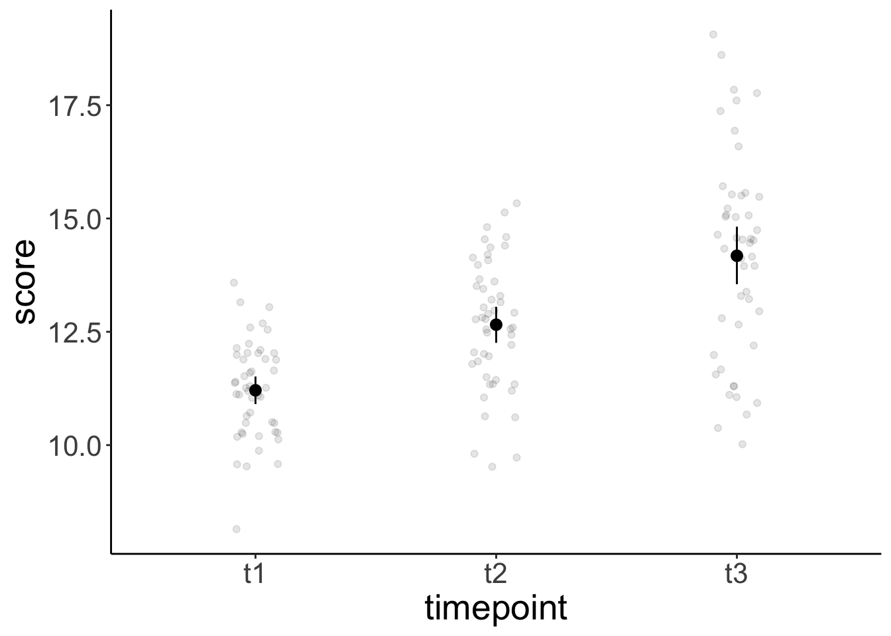
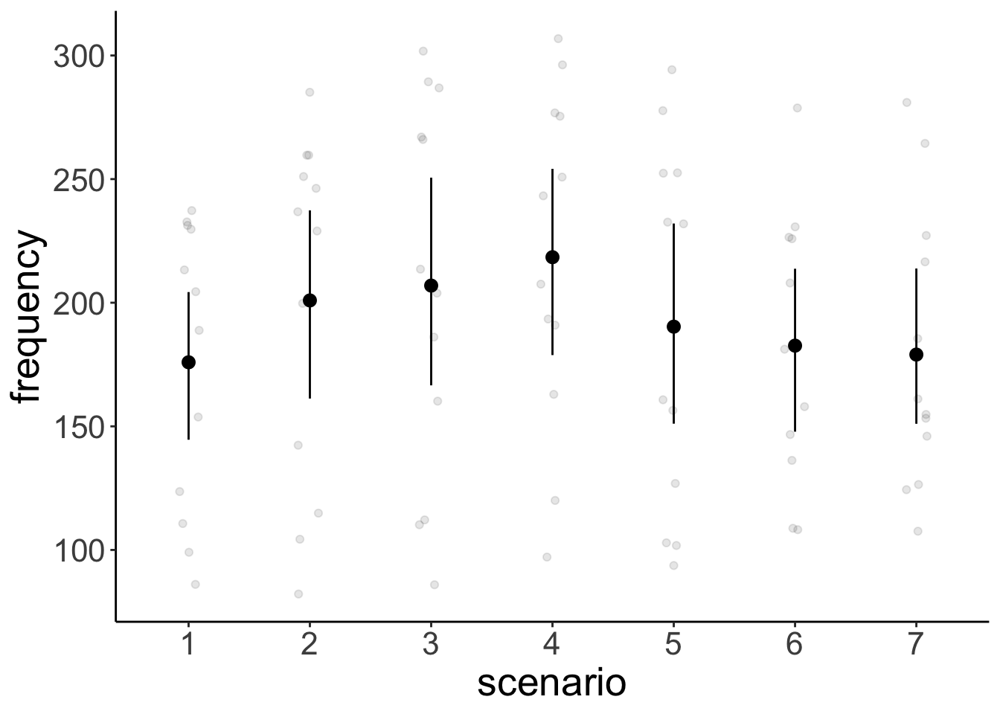
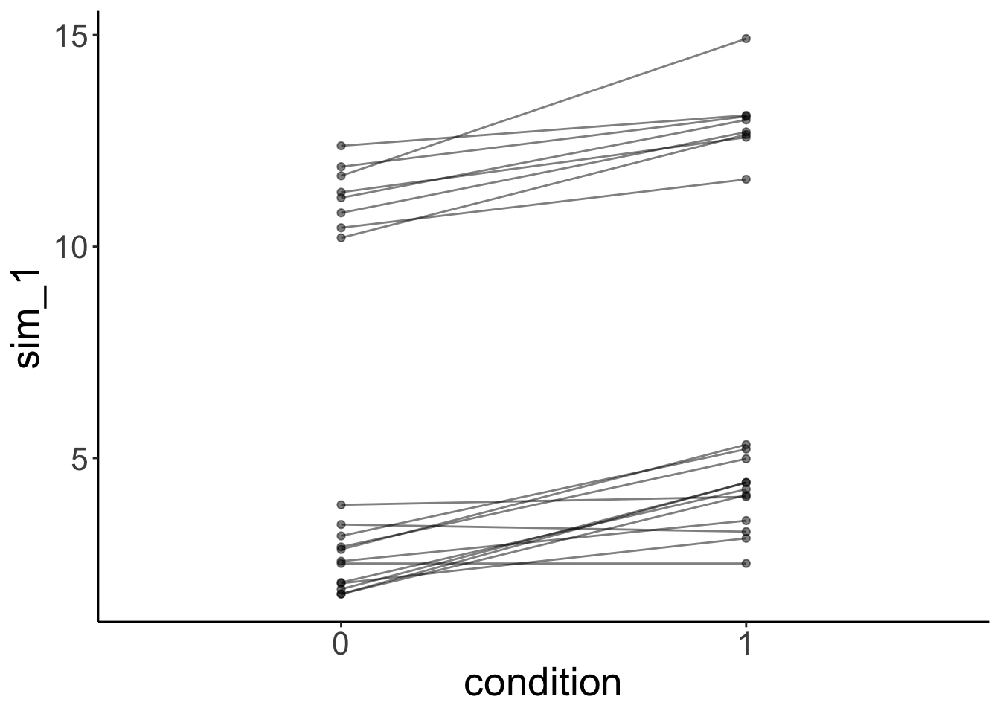
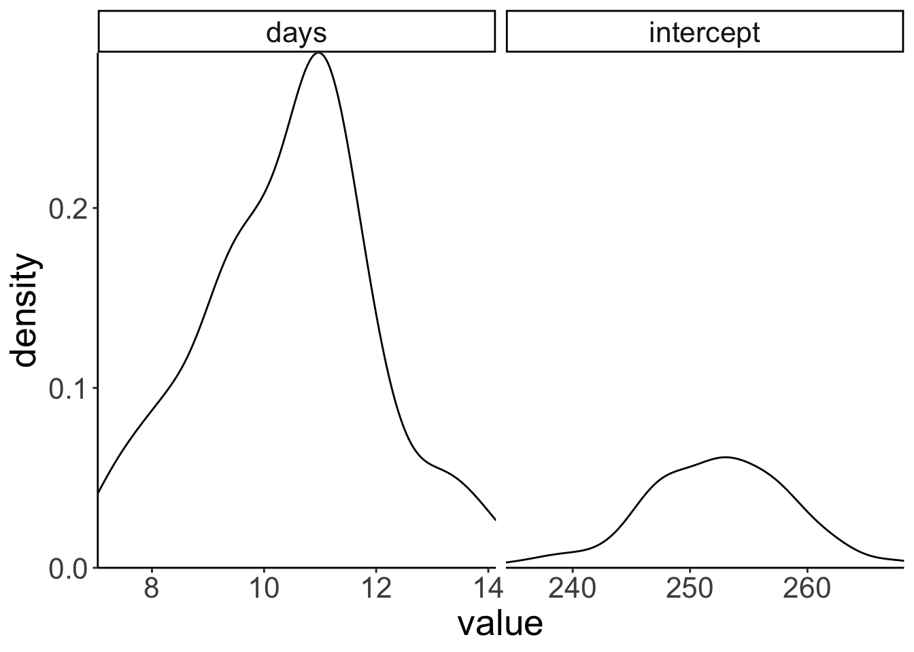

# Linear mixed effects models 3

## Learning goals 

- Pitfalls in fitting `lmers()`s (and what to do about it). 
- Understanding `lmer()` syntax even better.
- ANOVA vs. Lmer 

## Load packages and set plotting theme  


```r
library("knitr")       # for knitting RMarkdown 
library("kableExtra")  # for making nice tables
library("janitor")     # for cleaning column names
library("broom.mixed") # for tidying up linear mixed effects models 
```

```
## Warning in checkMatrixPackageVersion(): Package version inconsistency detected.
## TMB was built with Matrix version 1.2.18
## Current Matrix version is 1.3.2
## Please re-install 'TMB' from source using install.packages('TMB', type = 'source') or ask CRAN for a binary version of 'TMB' matching CRAN's 'Matrix' package
```

```r
library("patchwork")   # for making figure panels
library("lme4")        # for linear mixed effects models
library("afex")        # for ANOVAs
library("car")         # for ANOVAs
library("datarium")    # for ANOVA dataset
library("modelr")      # for bootstrapping
library("boot")        # also for bootstrapping
library("ggeffects")   # for plotting marginal effects
library("emmeans")     # for marginal effects
library("tidyverse")   # for wrangling, plotting, etc. 
```


```r
theme_set(theme_classic() + #set the theme 
            theme(text = element_text(size = 20))) #set the default text size

# knitr display options 
opts_chunk$set(comment = "",
               fig.show = "hold")

# include references for used packages
write_bib(.packages(), "packages.bib") 


# set contrasts to using sum contrasts
options(contrasts = c("contr.sum", "contr.poly"))

# suppress grouping warning messages
options(dplyr.summarise.inform = F)
```

## Load data sets 

### Sleep data 


```r
# load sleepstudy data set 
df.sleep = sleepstudy %>% 
  as_tibble() %>% 
  clean_names() %>% 
  mutate(subject = as.character(subject)) %>% 
  select(subject, days, reaction)

# add two fake participants (with missing data)
df.sleep = df.sleep %>% 
  bind_rows(tibble(subject = "374",
                   days = 0:1,
                   reaction = c(286, 288)),
            tibble(subject = "373",
                   days = 0,
                   reaction = 245))
```

### Reasoning data 


```r
df.reasoning = sk2011.1
```

### Weight loss data 


```r
data("weightloss", package = "datarium")

# Modify it to have three-way mixed design
df.weightloss = weightloss %>%
  mutate(id = rep(1:24, 2)) %>% 
  pivot_longer(cols = t1:t3,
               names_to = "timepoint",
               values_to = "score") %>% 
  arrange(id)
```

### Politness data 


```r
df.politeness = read_csv("data/politeness_data.csv") %>% 
  mutate(scenario = as.factor(scenario))
```

```

── Column specification ─────────────────────────────────────────────────────────────────────────────────────────────────────────────
cols(
  subject = col_character(),
  gender = col_character(),
  scenario = col_double(),
  attitude = col_character(),
  frequency = col_double()
)
```

## Understanding the lmer() syntax 

Here is an overview of how to specify different kinds of linear mixed effects models.

<table>
 <thead>
  <tr>
   <th style="text-align:left;"> formula </th>
   <th style="text-align:left;"> description </th>
  </tr>
 </thead>
<tbody>
  <tr>
   <td style="text-align:left;"> `dv ~ x1 + (1 | g)` </td>
   <td style="text-align:left;"> Random intercept for each level of `g` </td>
  </tr>
  <tr>
   <td style="text-align:left;"> `dv ~ x1 + (0 + x1 | g)` </td>
   <td style="text-align:left;"> Random slope for each level of `g` </td>
  </tr>
  <tr>
   <td style="text-align:left;"> `dv ~ x1 + (x1 | g)` </td>
   <td style="text-align:left;"> Correlated random slope and intercept for each level of `g` </td>
  </tr>
  <tr>
   <td style="text-align:left;"> `dv ~ x1 + (x1 || g)` </td>
   <td style="text-align:left;"> Uncorrelated random slope and intercept for each level of `g` </td>
  </tr>
  <tr>
   <td style="text-align:left;"> `dv ~ x1 + (1 | school) + (1 | teacher)` </td>
   <td style="text-align:left;"> Random intercept for each level of `school` and for each level of `teacher` (crossed) </td>
  </tr>
  <tr>
   <td style="text-align:left;"> `dv ~ x1 + (1 | school/teacher)` </td>
   <td style="text-align:left;"> Random intercept for each level of `school` and for each level of `teacher` in `school` (nested) </td>
  </tr>
</tbody>
</table>

Note that this `(1 | school/teacher)` is equivalent to `(1 | school) + (1 | teacher:school)` (see [here](https://stats.stackexchange.com/questions/228800/crossed-vs-nested-random-effects-how-do-they-differ-and-how-are-they-specified)). 

## ANOVA vs. Lmer 

### Between subjects ANOVA 

Let's start with a between subjects ANOVA (which means we are in `lm()` world). We'll take a look whether what type of `instruction` participants received made a difference to their `response`. 

First, we use the `aov_ez()` function from the "afex" package to do so. 


```r
aov_ez(id = "id",
       dv = "response",
       between = "instruction",
       data = df.reasoning)
```

```
Warning: More than one observation per cell, aggregating the data using mean
(i.e, fun_aggregate = mean)!
```

```
Anova Table (Type 3 tests)

Response: response
       Effect    df    MSE    F  ges p.value
1 instruction 1, 38 253.43 0.31 .008    .583
---
Signif. codes:  0 '***' 0.001 '**' 0.01 '*' 0.05 '+' 0.1 ' ' 1
```

Looks like there was no main effect of `instruction` on participants' responses. 

An alternative route for getting at the same test, would be via combining `lm()` with `Anova()` (as we've done before in class). 


```r
lm(formula = response ~ instruction,
   data = df.reasoning %>% 
     group_by(id, instruction) %>% 
     summarize(response = mean(response)) %>% 
     ungroup()) %>% 
  Anova(type = 3,
        method = "F")
```

```
Anova Table (Type III tests)

Response: response
            Sum Sq Df  F value Pr(>F)    
(Intercept) 250530  1 988.5637 <2e-16 ***
instruction     78  1   0.3066  0.583    
Residuals     9630 38                    
---
Signif. codes:  0 '***' 0.001 '**' 0.01 '*' 0.05 '.' 0.1 ' ' 1
```

The two routes yield the same result. Notice that for the `lm()` approach, I calculated the means for each participant in each condition first (using `group_by()` and `summarize()`). 

### Repeated-measures ANOVA 

Now let's take a look whether `validity` and `plausibility` affected participants' responses in the reasoning task. These two factors were varied within participants. Again, we'll use the `aov_ez()` function like so: 


```r
aov_ez(id = "id",
       dv = "response",
       within = c("validity", "plausibility"),
       data = df.reasoning %>% 
         filter(instruction == "probabilistic"))
```

```
Warning: More than one observation per cell, aggregating the data using mean
(i.e, fun_aggregate = mean)!
```

```
Anova Table (Type 3 tests)

Response: response
                 Effect    df    MSE         F   ges p.value
1              validity 1, 19 183.01      0.01 <.001    .904
2          plausibility 1, 19 321.44 30.30 ***  .366   <.001
3 validity:plausibility 1, 19  65.83   9.21 **  .035    .007
---
Signif. codes:  0 '***' 0.001 '**' 0.01 '*' 0.05 '+' 0.1 ' ' 1
```

For the linear model route, given that we have repeated observations from the same participants, we need to use `lmer()`. The repeated measures anova has the random effect structure as shown below: 


```r
mixed(formula = response ~ validity * plausibility + (1 | id) + (1 | validity:id) + (1 | plausibility:id),
      data = df.reasoning %>% 
        filter(instruction == "probabilistic") %>%
        group_by(id, validity, plausibility) %>%
        summarize(response = mean(response)))
```

```
Fitting one lmer() model. 
```

```
boundary (singular) fit: see ?isSingular
```

```
[DONE]
Calculating p-values. [DONE]
```

```
Warning: lme4 reported (at least) the following warnings for 'full':
  * boundary (singular) fit: see ?isSingular
```

```
Mixed Model Anova Table (Type 3 tests, KR-method)

Model: response ~ validity * plausibility + (1 | id) + (1 | validity:id) + 
Model:     (1 | plausibility:id)
Data: %>%
Data: df.reasoning %>% filter(instruction == "probabilistic") %>% group_by(id, validity, plausibility)
Data: summarize(response = mean(response))
                 Effect    df         F p.value
1              validity 1, 19      0.02    .901
2          plausibility 1, 19 34.21 ***   <.001
3 validity:plausibility 1, 19   8.93 **    .008
---
Signif. codes:  0 '***' 0.001 '**' 0.01 '*' 0.05 '+' 0.1 ' ' 1
```

Here, I've used the `mixed()` function from the "afex" package. What's handy about that function is that it computes F-tests with p-values.

Note though that the results of the ANOVA route and the `lmer()` route weren't identical here (although they were very close). For more information as to why this happens, see [this post](https://stats.stackexchange.com/questions/117660/what-is-the-lme4lmer-equivalent-of-a-three-way-repeated-measures-anova).

### Mixed ANOVA 

Now let's take a look at both between- as well as within-subjects factors. Let's compare the `aov_ez()` route


```r
aov_ez(id = "id",
       dv = "response",
       between = "instruction",
       within = c("validity", "plausibility"),
       data = df.reasoning)
```

```
Warning: More than one observation per cell, aggregating the data using mean
(i.e, fun_aggregate = mean)!
```

```
Anova Table (Type 3 tests)

Response: response
                             Effect    df     MSE         F   ges p.value
1                       instruction 1, 38 1013.71      0.31  .005    .583
2                          validity 1, 38  339.32    4.12 *  .020    .049
3              instruction:validity 1, 38  339.32    4.65 *  .023    .037
4                      plausibility 1, 38  234.41 34.23 ***  .106   <.001
5          instruction:plausibility 1, 38  234.41  10.67 **  .036    .002
6             validity:plausibility 1, 38  185.94      0.14 <.001    .715
7 instruction:validity:plausibility 1, 38  185.94    4.78 *  .013    .035
---
Signif. codes:  0 '***' 0.001 '**' 0.01 '*' 0.05 '+' 0.1 ' ' 1
```

with the `lmer()` route: 


```r
mixed(formula = response ~ instruction * validity * plausibility + (1 | id) + (1 | validity:id) + (1 | plausibility:id),
      data = df.reasoning %>%
        group_by(id, validity, plausibility, instruction) %>%
        summarize(response = mean(response)))
```

```
Fitting one lmer() model. [DONE]
Calculating p-values. [DONE]
```

```
Mixed Model Anova Table (Type 3 tests, KR-method)

Model: response ~ instruction * validity * plausibility + (1 | id) + 
Model:     (1 | validity:id) + (1 | plausibility:id)
Data: %>%
Data: df.reasoning %>% group_by(id, validity, plausibility, instruction)
Data: summarize(response = mean(response))
                             Effect    df         F p.value
1                       instruction 1, 38      0.31    .583
2                          validity 1, 38    4.12 *    .049
3                      plausibility 1, 38 34.23 ***   <.001
4              instruction:validity 1, 38    4.65 *    .037
5          instruction:plausibility 1, 38  10.67 **    .002
6             validity:plausibility 1, 38      0.14    .715
7 instruction:validity:plausibility 1, 38    4.78 *    .035
---
Signif. codes:  0 '***' 0.001 '**' 0.01 '*' 0.05 '+' 0.1 ' ' 1
```

Here, both routes yield the same results. 

## Follow-up tests with emmeans

Just like with the linear model `lm()`, we can use linear contrasts to test more specific hypotheses with `lmer()`. The `emmeans()` function from the `emmeans` package will be our friend. 

### Sleep study 

Let's ask some more specific question aboust the sleep study. 

1. Do reaction times differ between day 0 and the first day of sleep deprivation? 
2. Do reaction times differ between the first and the second half of the study? 

Let's visualize the data first: 


```r
ggplot(data = df.sleep %>% 
         mutate(days = as.factor(days)),
       mapping = aes(x = days,
                     y = reaction)) + 
  geom_point(position = position_jitter(width = 0.1),
             alpha = 0.1) + 
  stat_summary(fun.data = "mean_cl_boot")
```


And now let's fit the model, and compute the contrasts: 


```r
fit = mixed(formula = reaction ~ 1 + days + (1 | subject),
           data = df.sleep %>% 
             mutate(days = as.factor(days)))
```

```
Fitting one lmer() model. [DONE]
Calculating p-values. [DONE]
```

```r
contrast = list(first_vs_second = c(-1, 1, rep(0, 8)),
                early_vs_late = c(rep(-1, 5)/5, rep(1, 5)/5))

fit %>% 
  emmeans(specs = "days",
          contr = contrast) %>% 
  pluck("contrasts")
```

```
 contrast        estimate    SE  df t.ratio p.value
 first_vs_second     7.82 10.10 156  0.775  0.4398 
 early_vs_late      53.66  4.65 155 11.534  <.0001 

Degrees-of-freedom method: kenward-roger 
```

```r
df.sleep %>% 
  filter(days %in% c(0, 1)) %>% 
  group_by(days) %>% 
  summarize(reaction = mean(reaction))
```

```
# A tibble: 2 x 2
   days reaction
* <dbl>    <dbl>
1     0     258.
2     1     266.
```

```r
df.sleep %>% 
  mutate(index = ifelse(days %in% 0:4, "early", "late")) %>% 
  group_by(index) %>% 
  summarize(reaction = mean(reaction))
```

```
# A tibble: 2 x 2
  index reaction
* <chr>    <dbl>
1 early     272.
2 late      325.
```
### Weight loss study 

For the weight loss data set, we want to check: 

1. Whether there was a difference between the first two vs. the last time point. 
2. Whether there was a linear trend across the time points. 

Let's first visualize again: 


```r
ggplot(data = df.weightloss,
       mapping = aes(x = timepoint,
                     y = score,
                     group = diet,
                     color = diet)) + 
  geom_point(position = position_jitterdodge(dodge.width = 0.5,
                                  jitter.width = 0.1,
                                  jitter.height = 0),
             alpha = 0.1) + 
  stat_summary(fun.data = "mean_cl_boot",
               position = position_dodge(width = 0.5)) +
  facet_wrap(~ exercises) + 
  scale_color_brewer(palette = "Set1")


ggplot(data = df.weightloss,
       mapping = aes(x = timepoint,
                     y = score)) + 
  geom_point(position = position_jitter(width = 0.1),
             alpha = 0.1) + 
  stat_summary(fun.data = "mean_cl_boot") +
  scale_color_brewer(palette = "Set1")
```


And then fit the model, and compute the contrasts:


```r
fit = aov_ez(id = "id",
       dv = "score",
       between = "exercises",
       within = c("diet", "timepoint"),
       data = df.weightloss)

contrasts = list(first_two_vs_last = c(-0.5, -0.5, 1),
                 linear_increase = c(-1, 0, 1))

fit %>% 
  emmeans(spec = "timepoint",
          contr = contrasts)
```

```
NOTE: Results may be misleading due to involvement in interactions
```

```
$emmeans
 timepoint emmean    SE df lower.CL upper.CL
 t1          11.2 0.175 64     10.9     11.6
 t2          12.7 0.175 64     12.3     13.0
 t3          14.2 0.175 64     13.8     14.5

Results are averaged over the levels of: exercises, diet 
Warning: EMMs are biased unless design is perfectly balanced 
Confidence level used: 0.95 

$contrasts
 contrast          estimate    SE df t.ratio p.value
 first_two_vs_last     2.24 0.200 44 11.194  <.0001 
 linear_increase       2.97 0.231 44 12.820  <.0001 

Results are averaged over the levels of: exercises, diet 
```

Because we only had one observation in each cell of our design, the ANOVA was appropriate here (no data points needed to be aggregated). 

Both contrasts are significant. 

### Politeness study 

For the politeness study, we'll be interested in one particular contrast: 

1. Was there an effect of attitude on frequency for female participants? 

Let's visualize first: 


```r
# overview of the data 
ggplot(data = df.politeness,
        mapping = aes(x = attitude,
                      y = frequency,
                      group = gender,
                      color = gender)) + 
  geom_point(position = position_jitter(width = 0.1),
             alpha = 0.1) + 
  stat_summary(fun.data = "mean_cl_boot") + 
  scale_color_brewer(palette = "Set1")
```

```
Warning: Removed 1 rows containing non-finite values (stat_summary).
```

```
Warning: Removed 1 rows containing missing values (geom_point).
```

```r
# variation across scenarios 
ggplot(data = df.politeness,
        mapping = aes(x = scenario,
                      y = frequency)) + 
  geom_point(position = position_jitter(width = 0.1),
             alpha = 0.1) + 
  stat_summary(fun.data = "mean_cl_boot") + 
  scale_color_brewer(palette = "Set1")
```

```
Warning: Removed 1 rows containing non-finite values (stat_summary).

Warning: Removed 1 rows containing missing values (geom_point).
```

```r
# variation across participants
ggplot(data = df.politeness,
        mapping = aes(x = subject,
                      y = frequency)) + 
  geom_point(position = position_jitter(width = 0.1),
             alpha = 0.1) + 
  stat_summary(fun.data = "mean_cl_boot") + 
  scale_color_brewer(palette = "Set1")
```

```
Warning: Removed 1 rows containing non-finite values (stat_summary).

Warning: Removed 1 rows containing missing values (geom_point).
```



We fit the model and compute the contrasts. 


```r
fit = mixed(formula = frequency ~ 1 + attitude * gender + (1 | subject) + (1 | scenario),
      data = df.politeness)
```

```
Warning: Due to missing values, reduced number of observations to 83
```

```
Fitting one lmer() model. [DONE]
Calculating p-values. [DONE]
```

```r
fit %>% 
  emmeans(specs = pairwise ~ attitude + gender,
          adjust = "none")
```

```
$emmeans
 attitude gender emmean   SE   df lower.CL upper.CL
 inf      F         261 16.3 5.73    220.2      301
 pol      F         233 16.3 5.73    192.8      274
 inf      M         144 16.3 5.73    104.0      185
 pol      M         133 16.4 5.80     92.2      173

Degrees-of-freedom method: kenward-roger 
Confidence level used: 0.95 

$contrasts
 contrast      estimate    SE    df t.ratio p.value
 inf F - pol F     27.4  7.79 69.00 3.517   0.0008 
 inf F - inf M    116.2 21.73  4.56 5.348   0.0040 
 inf F - pol M    128.0 21.77  4.59 5.881   0.0027 
 pol F - inf M     88.8 21.73  4.56 4.087   0.0115 
 pol F - pol M    100.6 21.77  4.59 4.623   0.0071 
 inf M - pol M     11.8  7.90 69.08 1.497   0.1390 

Degrees-of-freedom method: kenward-roger 
```

Here, I've computed all pairwise contrasts. We were only interested in one: `inf F - pol F` and that one is significant. So the frequency of female participants' pitch differed between the informal and polite condition. 

If we had used an ANOVA approach for this data set, we could have done it like so: 


```r
aov_ez(id = "subject",
       dv = "frequency",
       between = "gender",
       within = "attitude",
       data = df.politeness)
```

```
Converting to factor: gender
```

```
Warning: More than one observation per cell, aggregating the data using mean
(i.e, fun_aggregate = mean)!
```

```
Warning: Missing values for following ID(s):
M4
Removing those cases from the analysis.
```

```
Anova Table (Type 3 tests)

Response: frequency
           Effect   df     MSE          F  ges p.value
1          gender 1, 3 1729.42    17.22 * .851    .025
2        attitude 1, 3    3.65 309.71 *** .179   <.001
3 gender:attitude 1, 3    3.65    21.30 * .015    .019
---
Signif. codes:  0 '***' 0.001 '**' 0.01 '*' 0.05 '+' 0.1 ' ' 1
```

This approach ignores the variation across scenarios (and just computed the mean instead). Arguably, the `lmer()` approach is better here as it takes all of the data into account. 

## Mixtures of participants 

What if we have groups of participants who differ from each other? Let's generate data for which this is the case.


```r
# make example reproducible 
set.seed(1)

sample_size = 20
b0 = 1
b1 = 2
sd_residual = 0.5
sd_participant = 0.5
mean_group1 = 1
mean_group2 = 10

df.mixed = tibble(
  condition = rep(0:1, each = sample_size), 
  participant = rep(1:sample_size, 2)) %>% 
  group_by(participant) %>% 
  mutate(group = sample(1:2, size = 1),
         intercept = ifelse(group == 1,
                            rnorm(n(), mean = mean_group1, sd = sd_participant),
                            rnorm(n(), mean = mean_group2, sd = sd_participant))) %>% 
  group_by(condition) %>% 
  mutate(value = b0 + b1 * condition + intercept + rnorm(n(), sd = sd_residual)) %>% 
  ungroup %>% 
  mutate(condition = as.factor(condition),
         participant = as.factor(participant))
```

#### Ignoring mixture

Let' first fit a model that ignores the fact that there are two different groups of participants. 


```r
# fit model
fit.mixed = lmer(formula = value ~ 1 + condition + (1 | participant),
                data = df.mixed)

fit.mixed %>% summary()
```

```
Linear mixed model fit by REML. t-tests use Satterthwaite's method [
lmerModLmerTest]
Formula: value ~ 1 + condition + (1 | participant)
   Data: df.mixed

REML criterion at convergence: 164.9

Scaled residuals: 
     Min       1Q   Median       3Q      Max 
-1.62997 -0.41663 -0.05607  0.54750  1.54023 

Random effects:
 Groups      Name        Variance Std.Dev.
 participant (Intercept) 19.2206  4.3841  
 Residual                 0.3521  0.5934  
Number of obs: 40, groups:  participant, 20

Fixed effects:
            Estimate Std. Error       df t value Pr(>|t|)    
(Intercept)  6.70554    0.98480 19.00000   6.809 1.68e-06 ***
condition1  -0.83260    0.09382 19.00000  -8.875 3.47e-08 ***
---
Signif. codes:  0 '***' 0.001 '**' 0.01 '*' 0.05 '.' 0.1 ' ' 1

Correlation of Fixed Effects:
           (Intr)
condition1 0.000 
```

Let's look at the model's predictions: 


```r
fit.mixed %>%
  augment() %>%
  clean_names() %>%
  ggplot(data = .,
         mapping = aes(x = condition,
                       y = value,
                       group = participant)) +
  geom_point(alpha = 0.5) +
  geom_line(alpha = 0.5) +
  geom_point(aes(y = fitted),
             color = "red") +
  geom_line(aes(y = fitted),
             color = "red")
```


And let's simulate some data from the fitted model: 


```r
# simulated data 
fit.mixed %>%
  simulate() %>%
  bind_cols(df.mixed) %>%
  ggplot(data = .,
         mapping = aes(x = condition,
                       y = sim_1,
                       group = participant)) +
  geom_line(alpha = 0.5) +
  geom_point(alpha = 0.5)
```


As we can see, the simulated data doesn't look like the data that was used to fit the model.  

#### Modeling mixture

Now, let's fit a model that takes the differences between groups into account by adding a fixed effect for `group`.


```r
# fit model
fit.grouped = lmer(formula = value ~ 1 + group + condition + (1 | participant),
                data = df.mixed)

fit.grouped %>% summary()
```

```
Linear mixed model fit by REML. t-tests use Satterthwaite's method [
lmerModLmerTest]
Formula: value ~ 1 + group + condition + (1 | participant)
   Data: df.mixed

REML criterion at convergence: 83.6

Scaled residuals: 
     Min       1Q   Median       3Q      Max 
-1.61879 -0.61378  0.02557  0.49842  2.19076 

Random effects:
 Groups      Name        Variance Std.Dev.
 participant (Intercept) 0.09265  0.3044  
 Residual                0.35208  0.5934  
Number of obs: 40, groups:  participant, 20

Fixed effects:
            Estimate Std. Error       df t value Pr(>|t|)    
(Intercept) -5.48096    0.35093 18.00000 -15.618 6.54e-12 ***
group        8.70464    0.23660 18.00000  36.791  < 2e-16 ***
condition1  -0.83260    0.09382 19.00000  -8.875 3.47e-08 ***
---
Signif. codes:  0 '***' 0.001 '**' 0.01 '*' 0.05 '.' 0.1 ' ' 1

Correlation of Fixed Effects:
           (Intr) group 
group      -0.944       
condition1  0.000  0.000
```

Note how the variance of the random intercepts is much smaller now that we've taken the group structure in the data into account. 

Let's visualize the model's predictions:


```r
fit.grouped %>%
  augment() %>%
  clean_names() %>%
  ggplot(data = .,
         mapping = aes(x = condition,
                       y = value,
                       group = participant)) +
  geom_point(alpha = 0.5) +
  geom_line(alpha = 0.5) +
  geom_point(aes(y = fitted),
             color = "red") +
  geom_line(aes(y = fitted),
             color = "red")
```


And simulate some data from the model: 


```r
# simulated data 
fit.grouped %>%
  simulate() %>%
  bind_cols(df.mixed) %>%
  ggplot(data = .,
         mapping = aes(x = condition,
                       y = sim_1,
                       group = participant)) +
  geom_line(alpha = 0.5) +
  geom_point(alpha = 0.5)
```



This time, the simulated data looks much more like the data that was used to fit the model. Yay! 


```r
ggpredict(model = fit.grouped,
          terms = "condition") %>% 
  plot()

ggpredict(model = fit.mixed,
          terms = "condition") %>% 
  plot()
```


#### Heterogeneity in variance

The example above has shown that we can take overall differences between groups into account by adding a fixed effect. Can we also deal with heterogeneity in variance between groups? For example, what if the responses of one group exhibit much more variance than the responses of another group? 

Let's first generate some data with heterogeneous variance: 


```r
# make example reproducible 
set.seed(1)

sample_size = 20
b0 = 1
b1 = 2
sd_residual = 0.5
mean_group1 = 1
sd_group1 = 1
mean_group2 = 30
sd_group2 = 10

df.variance = tibble(
  condition = rep(0:1, each = sample_size), 
  participant = rep(1:sample_size, 2)) %>% 
  group_by(participant) %>% 
  mutate(group = sample(1:2, size = 1),
         intercept = ifelse(group == 1,
                            rnorm(n(), mean = mean_group1, sd = sd_group1),
                            rnorm(n(), mean = mean_group2, sd = sd_group2))) %>% 
  group_by(condition) %>% 
  mutate(value = b0 + b1 * condition + intercept + rnorm(n(), sd = sd_residual)) %>% 
  ungroup %>% 
  mutate(condition = as.factor(condition),
         participant = as.factor(participant))
```

Let's fit the model: 


```r
# fit model
fit.variance = lmer(formula = value ~ 1 + group + condition + (1 | participant),
                data = df.variance)

fit.variance %>% summary()
```

```
Linear mixed model fit by REML. t-tests use Satterthwaite's method [
lmerModLmerTest]
Formula: value ~ 1 + group + condition + (1 | participant)
   Data: df.variance

REML criterion at convergence: 234.1

Scaled residuals: 
     Min       1Q   Median       3Q      Max 
-2.96291 -0.19619  0.03751  0.28317  1.45552 

Random effects:
 Groups      Name        Variance Std.Dev.
 participant (Intercept) 17.12    4.137   
 Residual                13.74    3.706   
Number of obs: 40, groups:  participant, 20

Fixed effects:
            Estimate Std. Error       df t value Pr(>|t|)    
(Intercept) -23.7160     3.3155  18.0000  -7.153 1.16e-06 ***
group        27.0696     2.2353  18.0000  12.110 4.36e-10 ***
condition1   -0.2858     0.5860  19.0000  -0.488    0.631    
---
Signif. codes:  0 '***' 0.001 '**' 0.01 '*' 0.05 '.' 0.1 ' ' 1

Correlation of Fixed Effects:
           (Intr) group 
group      -0.944       
condition1  0.000  0.000
```

Look at the data and model predictions: 


```r
fit.variance %>%
  augment() %>%
  clean_names() %>%
  ggplot(data = .,
         mapping = aes(x = condition,
                       y = value,
                       group = participant)) +
  geom_point(alpha = 0.5) +
  geom_line(alpha = 0.5) +
  geom_point(aes(y = fitted),
             color = "red") +
  geom_line(aes(y = fitted),
             color = "red")
```


And the simulated data: 


```r
# simulated data 
fit.variance %>%
  simulate() %>%
  bind_cols(df.mixed) %>%
  ggplot(data = .,
         mapping = aes(x = condition,
                       y = sim_1,
                       group = participant)) +
  geom_line(alpha = 0.5) +
  geom_point(alpha = 0.5)
```


The `lmer()` fails here. It uses one normal distribution to model the variance between participants. It cannot account for the fact that the answers of one group of participants vary more than the answers from another groups of participants. Again, the simulated data doesn't look like the original data, even though we did take the grouping into account. 

We will later see that it's straightforward in Bayesian models to explicitly model heterogeneity in variance. 

## Bootstrapping 

Bootstrapping is a good way to estimate our uncertainty on the parameter estimates in the model. 

### Linear model 

Let's briefly review how to do bootstrapping in a simple linear model. 


```r
# fit model 
fit.lm = lm(formula = reaction ~ 1 + days,
            data = df.sleep)

# coefficients
fit.lm %>% coef()
```

```
(Intercept)        days 
  252.32070    10.32766 
```

```r
# bootstrapping 
df.boot = df.sleep %>% 
  bootstrap(n = 100,
            id = "id") %>% 
  mutate(fit = map(strap, ~ lm(formula = reaction ~ 1 + days, data = .)),
         tidy = map(fit, tidy)) %>% 
  unnest(tidy) %>% 
  select(id, term, estimate) %>% 
  spread(term, estimate) %>% 
  clean_names() 
```

Let's illustrate the linear model with a confidence interval (making parametric assumptions using the t-distribution). 


```r
ggplot(data = df.sleep,
       mapping = aes(x = days, y = reaction)) + 
  geom_smooth(method = "lm") + 
  geom_point(alpha = 0.3)
```


And let's compare this with the different regression lines that we get out of our bootstrapped samples:


```r
ggplot(data = df.sleep,
       mapping = aes(x = days, y = reaction)) + 
  geom_abline(data = df.boot,
              aes(intercept = intercept,
                  slope = days,
                  group = id),
              alpha = 0.1) +
  geom_point(alpha = 0.3)
```


#### bootmer() function

For the linear mixed effects model, we can use the `bootmer()` function to do bootstrapping. 


```r
set.seed(1)

# fit the model 
fit.lmer = lmer(formula = reaction ~ 1 + days + (1 + days | subject),
                data = df.sleep)

# bootstrap parameter estimates 
boot.lmer = bootMer(fit.lmer,
                    FUN = fixef,
                    nsim = 100)

# compute confidence interval 
boot.ci(boot.lmer, index = 2, type = "perc")
```

```
BOOTSTRAP CONFIDENCE INTERVAL CALCULATIONS
Based on 100 bootstrap replicates

CALL : 
boot.ci(boot.out = boot.lmer, type = "perc", index = 2)

Intervals : 
Level     Percentile     
95%   ( 7.26, 13.79 )  
Calculations and Intervals on Original Scale
Some percentile intervals may be unstable
```

```r
# plot estimates 
boot.lmer$t %>% 
  as_tibble() %>% 
  clean_names() %>% 
  mutate(id = 1:n()) %>% 
  gather("index", "value", - id) %>% 
  ggplot(data = .,
       mapping = aes(x = value)) + 
  geom_density() + 
  facet_grid(cols = vars(index),
             scales = "free") +
  coord_cartesian(expand = F)
```




## Session info 

Information about this R session including which version of R was used, and what packages were loaded. 


```r
sessionInfo()
```

```
R version 4.0.3 (2020-10-10)
Platform: x86_64-apple-darwin17.0 (64-bit)
Running under: macOS Catalina 10.15.7

Matrix products: default
BLAS:   /Library/Frameworks/R.framework/Versions/4.0/Resources/lib/libRblas.dylib
LAPACK: /Library/Frameworks/R.framework/Versions/4.0/Resources/lib/libRlapack.dylib

locale:
[1] en_US.UTF-8/en_US.UTF-8/en_US.UTF-8/C/en_US.UTF-8/en_US.UTF-8

attached base packages:
[1] stats     graphics  grDevices utils     datasets  methods   base     

other attached packages:
 [1] forcats_0.5.1     stringr_1.4.0     dplyr_1.0.4       purrr_0.3.4      
 [5] readr_1.4.0       tidyr_1.1.2       tibble_3.0.6      ggplot2_3.3.3    
 [9] tidyverse_1.3.0   emmeans_1.5.3     ggeffects_1.0.1   boot_1.3-26      
[13] modelr_0.1.8      datarium_0.1.0    car_3.0-10        carData_3.0-4    
[17] afex_0.28-1       lme4_1.1-26       Matrix_1.3-2      patchwork_1.1.1  
[21] broom.mixed_0.2.6 janitor_2.1.0     kableExtra_1.3.1  knitr_1.31       

loaded via a namespace (and not attached):
  [1] TH.data_1.0-10      minqa_1.2.4         colorspace_2.0-0   
  [4] ellipsis_0.3.1      rio_0.5.16          sjlabelled_1.1.7   
  [7] htmlTable_2.1.0     estimability_1.3    snakecase_0.11.0   
 [10] base64enc_0.1-3     fs_1.5.0            rstudioapi_0.13    
 [13] farver_2.1.0        fansi_0.4.2         mvtnorm_1.1-1      
 [16] lubridate_1.7.9.2   xml2_1.3.2          codetools_0.2-18   
 [19] splines_4.0.3       Formula_1.2-4       jsonlite_1.7.2     
 [22] nloptr_1.2.2.2      pbkrtest_0.5-0.1    broom_0.7.3        
 [25] cluster_2.1.0       dbplyr_2.0.0        png_0.1-7          
 [28] compiler_4.0.3      httr_1.4.2          backports_1.2.1    
 [31] assertthat_0.2.1    cli_2.3.0           htmltools_0.5.1.1  
 [34] tools_4.0.3         lmerTest_3.1-3      coda_0.19-4        
 [37] gtable_0.3.0        glue_1.4.2          reshape2_1.4.4     
 [40] Rcpp_1.0.6          cellranger_1.1.0    vctrs_0.3.6        
 [43] nlme_3.1-151        insight_0.13.1.1    xfun_0.21          
 [46] ps_1.6.0            openxlsx_4.2.3      rvest_0.3.6        
 [49] lifecycle_1.0.0     statmod_1.4.35      MASS_7.3-53        
 [52] zoo_1.8-8           scales_1.1.1        hms_1.0.0          
 [55] parallel_4.0.3      sandwich_3.0-0      RColorBrewer_1.1-2 
 [58] TMB_1.7.18          yaml_2.2.1          curl_4.3           
 [61] gridExtra_2.3       rpart_4.1-15        latticeExtra_0.6-29
 [64] stringi_1.5.3       highr_0.8           checkmate_2.0.0    
 [67] zip_2.1.1           rlang_0.4.10        pkgconfig_2.0.3    
 [70] evaluate_0.14       lattice_0.20-41     labeling_0.4.2     
 [73] htmlwidgets_1.5.3   tidyselect_1.1.0    plyr_1.8.6         
 [76] magrittr_2.0.1      bookdown_0.21       R6_2.5.0           
 [79] Hmisc_4.4-2         generics_0.1.0      multcomp_1.4-15    
 [82] DBI_1.1.1           mgcv_1.8-33         pillar_1.4.7       
 [85] haven_2.3.1         foreign_0.8-81      withr_2.4.1        
 [88] nnet_7.3-15         survival_3.2-7      abind_1.4-5        
 [91] crayon_1.4.1        utf8_1.1.4          rmarkdown_2.6      
 [94] jpeg_0.1-8.1        grid_4.0.3          readxl_1.3.1       
 [97] data.table_1.13.6   reprex_1.0.0        digest_0.6.27      
[100] webshot_0.5.2       xtable_1.8-4        numDeriv_2016.8-1.1
[103] munsell_0.5.0       viridisLite_0.3.0  
```

## References
