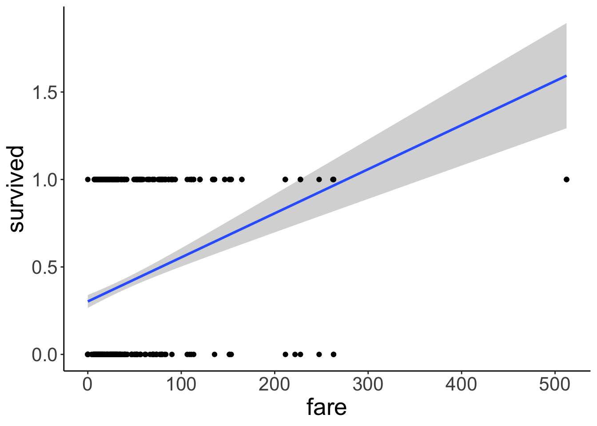
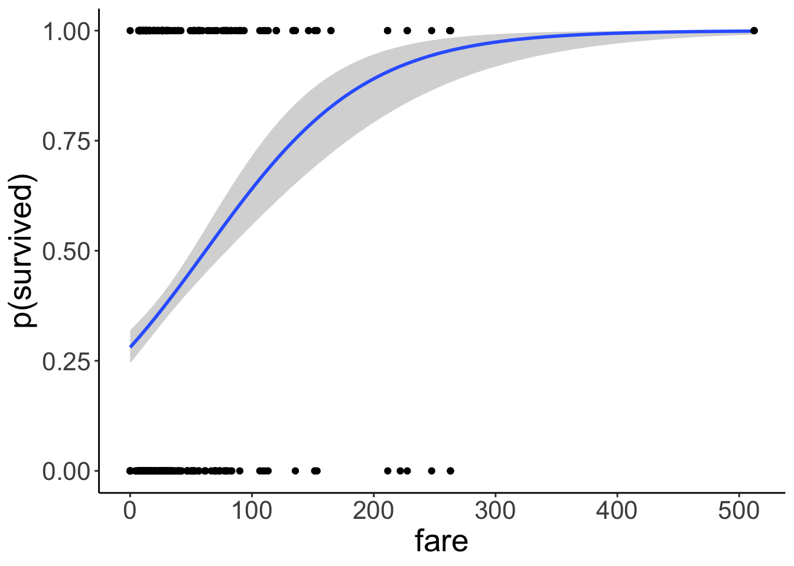
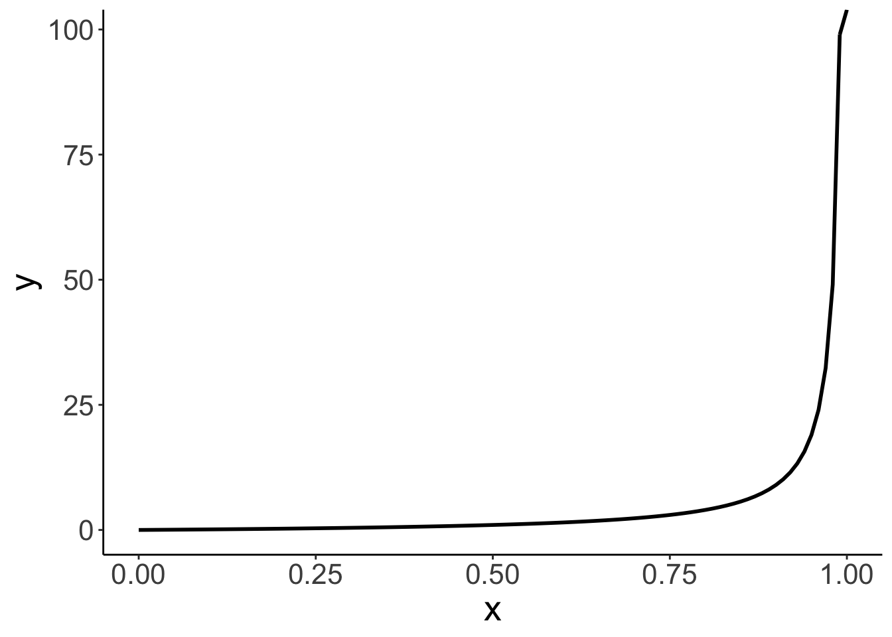
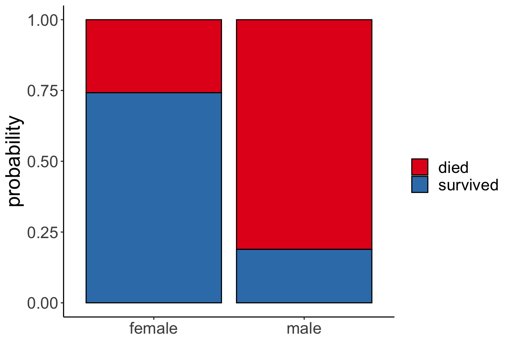
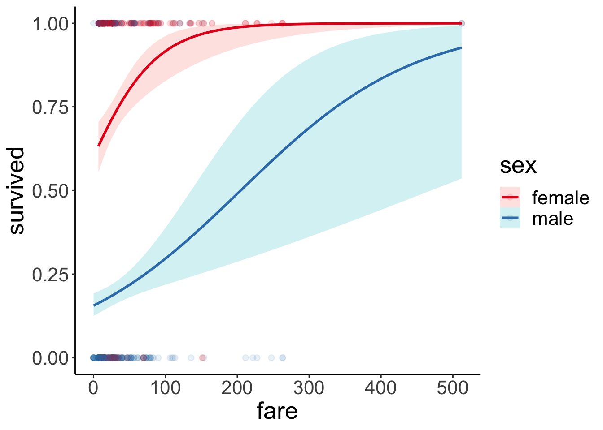
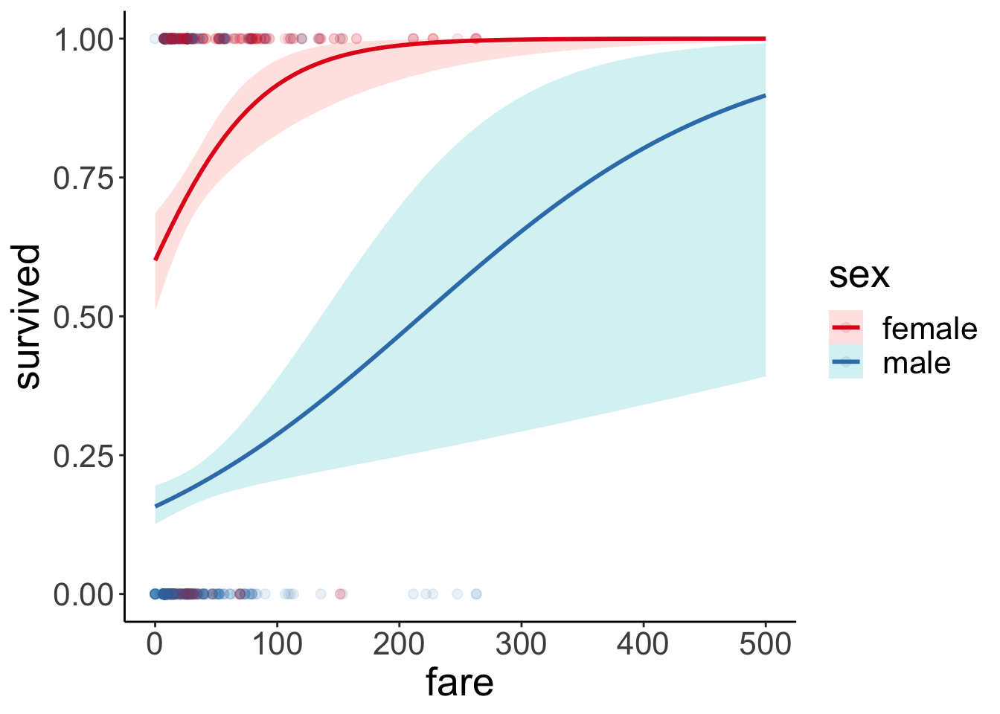
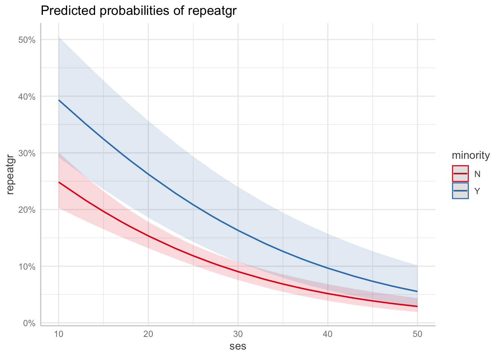

# Generalized linear model 

## Learning goals 

- Logistic regression. 
- Logit transform. 
- Fitting a logistic regression in R.
- Visualizing and interpreting model predictions. 
- Simulating data from a logistic regression. 
- Assessing model fit. 
- Testing hypotheses. 
- Reporting results.
- Mixed effects logistic regression.

## Load packages and set plotting theme  


```r
library("knitr")      # for knitting RMarkdown 
library("titanic")    # titanic dataset
library("kableExtra") # for making nice tables
library("janitor")    # for cleaning column names
library("broom")      # for tidying up linear models 
library("lme4")       # for linear mixed effects models
library("boot")       # for bootstrapping (also has an inverse logit function)
library("ggeffects")  # for showing effects in linear, generalized linear, and other models
library("afex")       # for significance testing of mixed effects models 
library("car")        # for the Anova() function
library("tidyverse")  # for wrangling, plotting, etc. 
```


```r
theme_set(theme_classic() + #set the theme 
    theme(text = element_text(size = 20))) #set the default text size

opts_chunk$set(comment = "",
               fig.show = "hold")

# include references for used packages
write_bib(.packages(), "packages.bib") 
```

## Load data set 


```r
df.titanic = titanic_train %>% 
  clean_names() %>% 
  mutate(sex = as.factor(sex))
```

Let's take a quick look at the data: 


```r
df.titanic %>% 
  glimpse()
```

```
Rows: 891
Columns: 12
$ passenger_id <int> 1, 2, 3, 4, 5, 6, 7, 8, 9, 10, 11, 12, 13, 14, 15, 16, 1…
$ survived     <int> 0, 1, 1, 1, 0, 0, 0, 0, 1, 1, 1, 1, 0, 0, 0, 1, 0, 1, 0,…
$ pclass       <int> 3, 1, 3, 1, 3, 3, 1, 3, 3, 2, 3, 1, 3, 3, 3, 2, 3, 2, 3,…
$ name         <chr> "Braund, Mr. Owen Harris", "Cumings, Mrs. John Bradley (…
$ sex          <fct> male, female, female, female, male, male, male, male, fe…
$ age          <dbl> 22, 38, 26, 35, 35, NA, 54, 2, 27, 14, 4, 58, 20, 39, 14…
$ sib_sp       <int> 1, 1, 0, 1, 0, 0, 0, 3, 0, 1, 1, 0, 0, 1, 0, 0, 4, 0, 1,…
$ parch        <int> 0, 0, 0, 0, 0, 0, 0, 1, 2, 0, 1, 0, 0, 5, 0, 0, 1, 0, 0,…
$ ticket       <chr> "A/5 21171", "PC 17599", "STON/O2. 3101282", "113803", "…
$ fare         <dbl> 7.2500, 71.2833, 7.9250, 53.1000, 8.0500, 8.4583, 51.862…
$ cabin        <chr> "", "C85", "", "C123", "", "", "E46", "", "", "", "G6", …
$ embarked     <chr> "S", "C", "S", "S", "S", "Q", "S", "S", "S", "C", "S", "…
```


```r
# Table of the first 10 entries
df.titanic %>% 
  head(10) %>% 
  kable(digits = 2) %>% 
  kable_styling(bootstrap_options = "striped",
                full_width = F)
```

<table class="table table-striped" style="width: auto !important; margin-left: auto; margin-right: auto;">
 <thead>
  <tr>
   <th style="text-align:right;"> passenger_id </th>
   <th style="text-align:right;"> survived </th>
   <th style="text-align:right;"> pclass </th>
   <th style="text-align:left;"> name </th>
   <th style="text-align:left;"> sex </th>
   <th style="text-align:right;"> age </th>
   <th style="text-align:right;"> sib_sp </th>
   <th style="text-align:right;"> parch </th>
   <th style="text-align:left;"> ticket </th>
   <th style="text-align:right;"> fare </th>
   <th style="text-align:left;"> cabin </th>
   <th style="text-align:left;"> embarked </th>
  </tr>
 </thead>
<tbody>
  <tr>
   <td style="text-align:right;"> 1 </td>
   <td style="text-align:right;"> 0 </td>
   <td style="text-align:right;"> 3 </td>
   <td style="text-align:left;"> Braund, Mr. Owen Harris </td>
   <td style="text-align:left;"> male </td>
   <td style="text-align:right;"> 22 </td>
   <td style="text-align:right;"> 1 </td>
   <td style="text-align:right;"> 0 </td>
   <td style="text-align:left;"> A/5 21171 </td>
   <td style="text-align:right;"> 7.25 </td>
   <td style="text-align:left;">  </td>
   <td style="text-align:left;"> S </td>
  </tr>
  <tr>
   <td style="text-align:right;"> 2 </td>
   <td style="text-align:right;"> 1 </td>
   <td style="text-align:right;"> 1 </td>
   <td style="text-align:left;"> Cumings, Mrs. John Bradley (Florence Briggs Thayer) </td>
   <td style="text-align:left;"> female </td>
   <td style="text-align:right;"> 38 </td>
   <td style="text-align:right;"> 1 </td>
   <td style="text-align:right;"> 0 </td>
   <td style="text-align:left;"> PC 17599 </td>
   <td style="text-align:right;"> 71.28 </td>
   <td style="text-align:left;"> C85 </td>
   <td style="text-align:left;"> C </td>
  </tr>
  <tr>
   <td style="text-align:right;"> 3 </td>
   <td style="text-align:right;"> 1 </td>
   <td style="text-align:right;"> 3 </td>
   <td style="text-align:left;"> Heikkinen, Miss. Laina </td>
   <td style="text-align:left;"> female </td>
   <td style="text-align:right;"> 26 </td>
   <td style="text-align:right;"> 0 </td>
   <td style="text-align:right;"> 0 </td>
   <td style="text-align:left;"> STON/O2. 3101282 </td>
   <td style="text-align:right;"> 7.92 </td>
   <td style="text-align:left;">  </td>
   <td style="text-align:left;"> S </td>
  </tr>
  <tr>
   <td style="text-align:right;"> 4 </td>
   <td style="text-align:right;"> 1 </td>
   <td style="text-align:right;"> 1 </td>
   <td style="text-align:left;"> Futrelle, Mrs. Jacques Heath (Lily May Peel) </td>
   <td style="text-align:left;"> female </td>
   <td style="text-align:right;"> 35 </td>
   <td style="text-align:right;"> 1 </td>
   <td style="text-align:right;"> 0 </td>
   <td style="text-align:left;"> 113803 </td>
   <td style="text-align:right;"> 53.10 </td>
   <td style="text-align:left;"> C123 </td>
   <td style="text-align:left;"> S </td>
  </tr>
  <tr>
   <td style="text-align:right;"> 5 </td>
   <td style="text-align:right;"> 0 </td>
   <td style="text-align:right;"> 3 </td>
   <td style="text-align:left;"> Allen, Mr. William Henry </td>
   <td style="text-align:left;"> male </td>
   <td style="text-align:right;"> 35 </td>
   <td style="text-align:right;"> 0 </td>
   <td style="text-align:right;"> 0 </td>
   <td style="text-align:left;"> 373450 </td>
   <td style="text-align:right;"> 8.05 </td>
   <td style="text-align:left;">  </td>
   <td style="text-align:left;"> S </td>
  </tr>
  <tr>
   <td style="text-align:right;"> 6 </td>
   <td style="text-align:right;"> 0 </td>
   <td style="text-align:right;"> 3 </td>
   <td style="text-align:left;"> Moran, Mr. James </td>
   <td style="text-align:left;"> male </td>
   <td style="text-align:right;"> NA </td>
   <td style="text-align:right;"> 0 </td>
   <td style="text-align:right;"> 0 </td>
   <td style="text-align:left;"> 330877 </td>
   <td style="text-align:right;"> 8.46 </td>
   <td style="text-align:left;">  </td>
   <td style="text-align:left;"> Q </td>
  </tr>
  <tr>
   <td style="text-align:right;"> 7 </td>
   <td style="text-align:right;"> 0 </td>
   <td style="text-align:right;"> 1 </td>
   <td style="text-align:left;"> McCarthy, Mr. Timothy J </td>
   <td style="text-align:left;"> male </td>
   <td style="text-align:right;"> 54 </td>
   <td style="text-align:right;"> 0 </td>
   <td style="text-align:right;"> 0 </td>
   <td style="text-align:left;"> 17463 </td>
   <td style="text-align:right;"> 51.86 </td>
   <td style="text-align:left;"> E46 </td>
   <td style="text-align:left;"> S </td>
  </tr>
  <tr>
   <td style="text-align:right;"> 8 </td>
   <td style="text-align:right;"> 0 </td>
   <td style="text-align:right;"> 3 </td>
   <td style="text-align:left;"> Palsson, Master. Gosta Leonard </td>
   <td style="text-align:left;"> male </td>
   <td style="text-align:right;"> 2 </td>
   <td style="text-align:right;"> 3 </td>
   <td style="text-align:right;"> 1 </td>
   <td style="text-align:left;"> 349909 </td>
   <td style="text-align:right;"> 21.08 </td>
   <td style="text-align:left;">  </td>
   <td style="text-align:left;"> S </td>
  </tr>
  <tr>
   <td style="text-align:right;"> 9 </td>
   <td style="text-align:right;"> 1 </td>
   <td style="text-align:right;"> 3 </td>
   <td style="text-align:left;"> Johnson, Mrs. Oscar W (Elisabeth Vilhelmina Berg) </td>
   <td style="text-align:left;"> female </td>
   <td style="text-align:right;"> 27 </td>
   <td style="text-align:right;"> 0 </td>
   <td style="text-align:right;"> 2 </td>
   <td style="text-align:left;"> 347742 </td>
   <td style="text-align:right;"> 11.13 </td>
   <td style="text-align:left;">  </td>
   <td style="text-align:left;"> S </td>
  </tr>
  <tr>
   <td style="text-align:right;"> 10 </td>
   <td style="text-align:right;"> 1 </td>
   <td style="text-align:right;"> 2 </td>
   <td style="text-align:left;"> Nasser, Mrs. Nicholas (Adele Achem) </td>
   <td style="text-align:left;"> female </td>
   <td style="text-align:right;"> 14 </td>
   <td style="text-align:right;"> 1 </td>
   <td style="text-align:right;"> 0 </td>
   <td style="text-align:left;"> 237736 </td>
   <td style="text-align:right;"> 30.07 </td>
   <td style="text-align:left;">  </td>
   <td style="text-align:left;"> C </td>
  </tr>
</tbody>
</table>

## Logistic regression 

Let's see if we can predict whether or not a passenger survived based on the price of their ticket. 

Let's run a simple regression first: 


```r
# fit a linear model 
fit.lm = lm(formula = survived ~ 1 + fare,
            data = df.titanic)

# summarize the results
fit.lm %>% summary()
```

```

Call:
lm(formula = survived ~ 1 + fare, data = df.titanic)

Residuals:
    Min      1Q  Median      3Q     Max 
-0.9653 -0.3391 -0.3222  0.6044  0.6973 

Coefficients:
             Estimate Std. Error t value Pr(>|t|)    
(Intercept) 0.3026994  0.0187849  16.114  < 2e-16 ***
fare        0.0025195  0.0003174   7.939 6.12e-15 ***
---
Signif. codes:  0 '***' 0.001 '**' 0.01 '*' 0.05 '.' 0.1 ' ' 1

Residual standard error: 0.4705 on 889 degrees of freedom
Multiple R-squared:  0.06621,	Adjusted R-squared:  0.06516 
F-statistic: 63.03 on 1 and 889 DF,  p-value: 6.12e-15
```

Look's like `fare` is a significant predictor of whether or not a person survived. Let's visualize the model's predictions:


```r
ggplot(data = df.titanic,
       mapping = aes(x = fare,
                     y = survived)) + 
  geom_smooth(method = "lm") + 
  geom_point() +
  labs(y = "survived")
```



This doesn't look good! The model predicts intermediate values of `survived` (which doesn't make sense given that a person either survived or didn't survive). Furthermore, the model predicts values greater than 1 for fares greather than ~ 300.  

Let's run a logistic regression instead. 


```r
# fit a logistic regression 
fit.glm = glm(formula = survived ~ 1 + fare,
              family = "binomial",
              data = df.titanic)

fit.glm %>% 
  summary()
```

```

Call:
glm(formula = survived ~ 1 + fare, family = "binomial", data = df.titanic)

Deviance Residuals: 
    Min       1Q   Median       3Q      Max  
-2.4906  -0.8878  -0.8531   1.3429   1.5942  

Coefficients:
             Estimate Std. Error z value Pr(>|z|)    
(Intercept) -0.941330   0.095129  -9.895  < 2e-16 ***
fare         0.015197   0.002232   6.810 9.79e-12 ***
---
Signif. codes:  0 '***' 0.001 '**' 0.01 '*' 0.05 '.' 0.1 ' ' 1

(Dispersion parameter for binomial family taken to be 1)

    Null deviance: 1186.7  on 890  degrees of freedom
Residual deviance: 1117.6  on 889  degrees of freedom
AIC: 1121.6

Number of Fisher Scoring iterations: 4
```

And let's visualize the predictions of the logistic regression: 


```r
ggplot(data = df.titanic,
       mapping = aes(x = fare,
                     y = survived)) + 
  geom_smooth(method = "glm",
              method.args = list(family = "binomial")) +
  geom_point() +
  labs(y = "p(survived)")
```



Much better! Note that we've changed the interpretation of our dependent variable. We are now predicting the _probability that a person survived_ based on their fare. The model now only predicts values between 0 and 1. To achieve this, we apply a logit transform to the outcome variable like so: 

$$
\ln(\frac{\pi_i}{1-\pi_i}) = b_0 + b_1 \cdot X_i + e_i
$$
where $\pi_i$ is the probability of passenger $i$ having survived. Importantly, this affects our interpretation of the model parameters. They are now defined in log-odds, and can apply an inverse logit transformation to turn this back into a probability: 

With

$$
\pi = P(Y = 1)
$$
and the logit transformation 

$$
\ln(\frac{\pi}{1-\pi}) = V,
$$
where $V$ is just a placeholder for our linear model formula, we can go back to $\pi$ through the inverse logit transformation like so: 

$$
\pi = \frac{e^V}{1 + e^V}
$$
In R, we can use `log(x)` to calculate the natural logarithm $\ln(x)$, and `exp(x)` to calculate `e^x`. 

### Interpreting the parameters 


```r
fit.glm %>% 
  summary()
```

```

Call:
glm(formula = survived ~ 1 + fare, family = "binomial", data = df.titanic)

Deviance Residuals: 
    Min       1Q   Median       3Q      Max  
-2.4906  -0.8878  -0.8531   1.3429   1.5942  

Coefficients:
             Estimate Std. Error z value Pr(>|z|)    
(Intercept) -0.941330   0.095129  -9.895  < 2e-16 ***
fare         0.015197   0.002232   6.810 9.79e-12 ***
---
Signif. codes:  0 '***' 0.001 '**' 0.01 '*' 0.05 '.' 0.1 ' ' 1

(Dispersion parameter for binomial family taken to be 1)

    Null deviance: 1186.7  on 890  degrees of freedom
Residual deviance: 1117.6  on 889  degrees of freedom
AIC: 1121.6

Number of Fisher Scoring iterations: 4
```

The estimate for the intercept and fare are in log-odds. 

Let's take a look at the linear model's predictions in log-odds space. 


```r
df.plot = fit.glm %>% 
  augment() %>% 
  clean_names()

ggplot(data = df.plot,
       mapping = aes(x = fare,
                     y = fitted)) + 
  geom_line()
```


Nice, looks like a good old linear model. But what's the y-axis here? It's in log-odds (buh!). This is difficult to interpret. Let's transform the y-axis back to probabilities to make it easier to see what's going on. 


```r
ggplot(data = df.plot,
       mapping = aes(x = fare,
                     y = inv.logit(fitted))) + 
  geom_line()
```


Great! Now the y-axis is back in probability space. We used the inverse logit function `inv.logit()` to transfer to log-odds back into probabilities. 

Let's check what the intercept of our model is in probability space: 


```r
fit.glm %>% 
  pluck(coefficients, 1) %>% 
  inv.logit()
```

```
[1] 0.2806318
```

Here, we see that the intercept is $p = 0.28$. That is, the predicted chance of survival for someone who didn't pay any fare at all is 28% according to the model. Interpreting the slope is a little more tricky. Let's look at a situation first where we have a binary predictor. 


#### Logit transform 

Here is a visualization of what the odds and log odds transformation look like.


```r
# going from probabilities to odds (ranges from 0 to +infinity)
ggplot(data = tibble(x = seq(0, 1, 0.1)),
       mapping = aes(x = x)) + 
  stat_function(fun = ~ ./(1 - .),
                size = 1)

# going from probabilities to log odds (ranges from -infinity to +infinity)
ggplot(data = tibble(x = seq(0, 1, 0.1)),
       mapping = aes(x = x)) + 
  stat_function(fun = ~ log(./(1 - .)),
                size = 1)
```




### Binary predictor

Let's see whether the probability of survival differed between male and female passengers. 


```r
fit.glm2 = glm(formula = survived ~ 1 + sex,
               family = "binomial",
               data = df.titanic)

fit.glm2 %>% 
  summary()
```

```

Call:
glm(formula = survived ~ 1 + sex, family = "binomial", data = df.titanic)

Deviance Residuals: 
    Min       1Q   Median       3Q      Max  
-1.6462  -0.6471  -0.6471   0.7725   1.8256  

Coefficients:
            Estimate Std. Error z value Pr(>|z|)    
(Intercept)   1.0566     0.1290   8.191 2.58e-16 ***
sexmale      -2.5137     0.1672 -15.036  < 2e-16 ***
---
Signif. codes:  0 '***' 0.001 '**' 0.01 '*' 0.05 '.' 0.1 ' ' 1

(Dispersion parameter for binomial family taken to be 1)

    Null deviance: 1186.7  on 890  degrees of freedom
Residual deviance:  917.8  on 889  degrees of freedom
AIC: 921.8

Number of Fisher Scoring iterations: 4
```

It looks like it did! Let's visualize: 


```r
df.titanic %>% 
  mutate(survived = factor(survived, labels = c("died", "survived"))) %>% 
  ggplot(data = .,
         mapping = aes(x = sex,
                       fill = survived)) +
  geom_bar(position = "fill",
           color = "black") +
  scale_fill_brewer(palette = "Set1")  +
  labs(x = "",
       fill = "",
       y = "probability")
```



And let's interpret the parameters by applying the inverse logit transform. To get the prediction for female passengers we get 

$$
\widehat{\ln(\frac{\pi_i}{1-\pi_i})} = b_0 + b_1 \cdot \text{sex}_i = b_0 + b_1 \cdot 0 = b_0
$$
since we dummy coded the predictor and female is our reference category. To get the predicted probability of survival for women we do the logit transform: 

$$
\pi = \frac{e^{b_0}}{1 + e^{b_0}}
$$
The predicted probability is: 


```r
fit.glm2 %>% 
  pluck(coefficients, 1) %>% 
  inv.logit()
```

```
[1] 0.7420382
```

To get the prediction for male passengers we have: 

$$
\widehat{\ln(\frac{\pi_i}{1-\pi_i})} = b_0 + b_1 \cdot \text{sex}_i = b_0 + b_1 \cdot 1 = b_0 + b_1
$$
Applying the logit transform like so

$$
\pi = \frac{e^{b_0 + b_1}}{1 + e^{b_0 + b_1}}
$$

The predicted probability of male passengers surviving is: 


```r
fit.glm2 %>% 
  pluck(coefficients) %>% 
  sum() %>% 
  inv.logit()
```

```
[1] 0.1889081
```

Here is the same information in a table: 


```r
df.titanic %>% 
  count(sex, survived) %>% 
  mutate(p = n / sum(n)) %>% 
  group_by(sex) %>% 
  mutate(`p(survived|sex)` = p / sum(p)) %>% 
  head(10) %>% 
  kable(digits = 2) %>% 
  kable_styling(bootstrap_options = "striped",
                full_width = F)
```

<table class="table table-striped" style="width: auto !important; margin-left: auto; margin-right: auto;">
 <thead>
  <tr>
   <th style="text-align:left;"> sex </th>
   <th style="text-align:right;"> survived </th>
   <th style="text-align:right;"> n </th>
   <th style="text-align:right;"> p </th>
   <th style="text-align:right;"> p(survived|sex) </th>
  </tr>
 </thead>
<tbody>
  <tr>
   <td style="text-align:left;"> female </td>
   <td style="text-align:right;"> 0 </td>
   <td style="text-align:right;"> 81 </td>
   <td style="text-align:right;"> 0.09 </td>
   <td style="text-align:right;"> 0.26 </td>
  </tr>
  <tr>
   <td style="text-align:left;"> female </td>
   <td style="text-align:right;"> 1 </td>
   <td style="text-align:right;"> 233 </td>
   <td style="text-align:right;"> 0.26 </td>
   <td style="text-align:right;"> 0.74 </td>
  </tr>
  <tr>
   <td style="text-align:left;"> male </td>
   <td style="text-align:right;"> 0 </td>
   <td style="text-align:right;"> 468 </td>
   <td style="text-align:right;"> 0.53 </td>
   <td style="text-align:right;"> 0.81 </td>
  </tr>
  <tr>
   <td style="text-align:left;"> male </td>
   <td style="text-align:right;"> 1 </td>
   <td style="text-align:right;"> 109 </td>
   <td style="text-align:right;"> 0.12 </td>
   <td style="text-align:right;"> 0.19 </td>
  </tr>
</tbody>
</table>

### Continuous predictor

To interpret the predictions when a continuous predictor is involved, it's easiest to consider a few concrete cases. Here, I use the `augment()` function from the "broom" package to get the model's predictions for some values of interest: 


```r
fit.glm %>% 
  augment(newdata = tibble(fare = c(0, 10, 50, 100, 500))) %>% 
  clean_names() %>% 
  select(fare, prediction = fitted) %>% 
  mutate(`p(survival)` = inv.logit(prediction)) %>% 
  head(10) %>% 
  kable(digits = 2) %>% 
  kable_styling(bootstrap_options = "striped",
                full_width = F)
```

<table class="table table-striped" style="width: auto !important; margin-left: auto; margin-right: auto;">
 <thead>
  <tr>
   <th style="text-align:right;"> fare </th>
   <th style="text-align:right;"> prediction </th>
   <th style="text-align:right;"> p(survival) </th>
  </tr>
 </thead>
<tbody>
  <tr>
   <td style="text-align:right;"> 0 </td>
   <td style="text-align:right;"> -0.94 </td>
   <td style="text-align:right;"> 0.28 </td>
  </tr>
  <tr>
   <td style="text-align:right;"> 10 </td>
   <td style="text-align:right;"> -0.79 </td>
   <td style="text-align:right;"> 0.31 </td>
  </tr>
  <tr>
   <td style="text-align:right;"> 50 </td>
   <td style="text-align:right;"> -0.18 </td>
   <td style="text-align:right;"> 0.45 </td>
  </tr>
  <tr>
   <td style="text-align:right;"> 100 </td>
   <td style="text-align:right;"> 0.58 </td>
   <td style="text-align:right;"> 0.64 </td>
  </tr>
  <tr>
   <td style="text-align:right;"> 500 </td>
   <td style="text-align:right;"> 6.66 </td>
   <td style="text-align:right;"> 1.00 </td>
  </tr>
</tbody>
</table>

### Several predictors 

Let's fit a logistic regression that predicts the probability of survival based both on the passenger's sex and what fare they paid (allowing for an interaction of the two predictors): 


```r
fit.glm3 = glm(formula = survived ~ 1 + sex * fare,
              family = "binomial",
              data = df.titanic)

fit.glm3 %>% 
  summary()
```

```

Call:
glm(formula = survived ~ 1 + sex * fare, family = "binomial", 
    data = df.titanic)

Deviance Residuals: 
    Min       1Q   Median       3Q      Max  
-2.6280  -0.6279  -0.5991   0.8172   1.9288  

Coefficients:
              Estimate Std. Error z value Pr(>|z|)    
(Intercept)   0.408428   0.189999   2.150 0.031584 *  
sexmale      -2.099345   0.230291  -9.116  < 2e-16 ***
fare          0.019878   0.005372   3.701 0.000215 ***
sexmale:fare -0.011617   0.005934  -1.958 0.050252 .  
---
Signif. codes:  0 '***' 0.001 '**' 0.01 '*' 0.05 '.' 0.1 ' ' 1

(Dispersion parameter for binomial family taken to be 1)

    Null deviance: 1186.66  on 890  degrees of freedom
Residual deviance:  879.85  on 887  degrees of freedom
AIC: 887.85

Number of Fisher Scoring iterations: 5
```

Make sure not to interpret the significance test on the coefficients here as main effects. Based on this summary table, you cannot say whether there is a significant difference between male vs. female passenger in their probability of survival. What coefficient for `sexmale` captures is whether there is a significant difference between male and female passengers who paid a fare of 0. That is, it's the predicted difference between the reference category (female) and the other category (male) when all other predictors are 0. 

Let's visualize the model predictions: 


```r
ggplot(data = df.titanic,
       mapping = aes(x = fare,
                     y = survived,
                     color = sex)) +
  geom_point(alpha = 0.1, size = 2) + 
  geom_smooth(method = "glm",
              method.args = list(family = "binomial"),
              alpha = 0.2,
              aes(fill = sex)) +
  scale_color_brewer(palette = "Set1")
```


Just for kicks, to get a better sense for what the interaction looks like, here is the visualization in log-odds space: 


```r
fit.glm3 %>% 
  augment() %>% 
  clean_names() %>% 
  ggplot(data = .,
         mapping = aes(x = fare,
                       color = sex,
                       y = fitted)) + 
  geom_line() + 
  scale_color_brewer(palette = "Set1")
```


Let's see how large the difference between genders is once we take into account how much each person paid for the fair:


```r
ggpredict(fit.glm3,
          terms = c("sex"))
```

```
# Predicted probabilities of survived
# x = sex

x      | Predicted |       95% CI
---------------------------------
female |      0.74 | [0.69, 0.79]
male   |      0.19 | [0.16, 0.23]

Adjusted for:
* fare = 32.20
```


We notice that there is one outlier who was male and paid a $500 fare (or maybe this is a mistake in the data entry?!). Let's remove this outlier and see what happens: 


```r
fit.glm3_no_outlier = glm(formula = survived ~ 1 + sex * fare,
                          family = "binomial",
                          data = df.titanic %>% 
                            filter(fare < 500))

fit.glm3_no_outlier %>% 
  summary()
```

```

Call:
glm(formula = survived ~ 1 + sex * fare, family = "binomial", 
    data = df.titanic %>% filter(fare < 500))

Deviance Residuals: 
    Min       1Q   Median       3Q      Max  
-2.6280  -0.6288  -0.6018   0.8172   1.9226  

Coefficients:
              Estimate Std. Error z value Pr(>|z|)    
(Intercept)   0.408436   0.190019   2.149 0.031598 *  
sexmale      -2.085344   0.232260  -8.979  < 2e-16 ***
fare          0.019878   0.005373   3.699 0.000216 ***
sexmale:fare -0.012178   0.006066  -2.008 0.044688 *  
---
Signif. codes:  0 '***' 0.001 '**' 0.01 '*' 0.05 '.' 0.1 ' ' 1

(Dispersion parameter for binomial family taken to be 1)

    Null deviance: 1180.89  on 887  degrees of freedom
Residual deviance:  879.51  on 884  degrees of freedom
AIC: 887.51

Number of Fisher Scoring iterations: 5
```

```r
df.titanic %>% 
  filter(fare < 500) %>% 
  mutate(sex = as.factor(sex)) %>% 
  ggplot(data = .,
         mapping = aes(x = fare,
                       y = survived,
                       color = sex)) +
  geom_point(alpha = 0.1, size = 2) + 
  stat_smooth(method = "glm",
              method.args = list(family = "binomial"),
              alpha = 0.2,
              fullrange = T,
              aes(fill = sex)) +
  scale_color_brewer(palette = "Set1") +
  scale_x_continuous(limits = c(0, 500))
```



There is still a clear difference between female and male passengers, but the prediction for male passengers has changed a bit. Let's look at a concrete example: 


```r
# with the outlier: 

# predicted probability of survival for a male passenger who paid $200 for their fare 
inv.logit(fit.glm3$coefficients[1] + fit.glm3$coefficients[2] + 
            fit.glm3$coefficients[3] * 200 + fit.glm3$coefficients[4] * 200)
```

```
(Intercept) 
  0.4903402 
```

```r
# without the outlier: 

# predicted probability of survival for a male passenger who paid $200 for their fare 
inv.logit(fit.glm3_no_outlier$coefficients[1] + 
            fit.glm3_no_outlier$coefficients[2] + 
            fit.glm3_no_outlier$coefficients[3] * 200 + 
            fit.glm3_no_outlier$coefficients[4] * 200)
```

```
(Intercept) 
  0.4658284 
```

With the outlier removed, the predicted probability of survival for a male passenger who paid $200 decreases from 49% to 47%. 

### Using the "ggeffects" package 

The "ggeffects" package helps with the interpretation of the results. It applies the inverse logit transform for us, and shows the predictions for a range of cases. 


```r
# show effects 
ggeffect(model = fit.glm,
         terms = "fare [0, 100, 200, 300, 400, 500]")
```

```
# Predicted probabilities of survived
# x = fare

  x | Predicted |       95% CI
------------------------------
  0 |      0.28 | [0.24, 0.32]
100 |      0.64 | [0.56, 0.72]
200 |      0.89 | [0.79, 0.95]
300 |      0.97 | [0.92, 0.99]
400 |      0.99 | [0.97, 1.00]
500 |      1.00 | [0.99, 1.00]
```

I've used the `[]` construction to specify for what values of the predictor `fare`, I'd like get the predicted values. Here, the prediction is marginalized across both women and men. 

We can also get a plot of the model predictions like so: 


```r
ggeffect(model = fit.glm,
         terms = "fare [0, 100, 200, 300, 400, 500]") %>% 
  plot()
```


And, we can also get the predicted probability of survival for sex marginalized over the fare, using the model which included both sex and fare, as well as its interaction as predictors. 


```r
ggeffect(model = fit.glm3,
         terms = "sex")
```

```
# Predicted probabilities of survived
# x = sex

x      | Predicted |       95% CI
---------------------------------
female |      0.74 | [0.69, 0.79]
male   |      0.19 | [0.16, 0.23]
```

Finally, we can ask for predictions for specific combinations of our predictor variables, by using the `ggpredict()` function. 


```r
ggpredict(model = fit.glm3,
          terms = c("sex", "fare [200]"))
```

```
# Predicted probabilities of survived
# x = sex

x      | Predicted |       95% CI
---------------------------------
female |      0.99 | [0.93, 1.00]
male   |      0.49 | [0.29, 0.70]
```

The example above, shows the predicted probability of survival for male vs. female passengers, assuming that they paid 200 for the fare. 

## Simulate a logistic regression

As always, to better understand a statistical modeling procedure, it's helpful to simulate data from the assumed data-generating process, fit the model, and see whether we can reconstruct the parameters.  


```r
# make example reproducible 
set.seed(1)

# set parameters 
sample_size = 1000 
b0 = 0
b1 = 1
# b1 = 8

# generate data 
df.data = tibble(x = rnorm(n = sample_size),
                 y = b0 + b1 * x,
                 p = inv.logit(y)) %>% 
  mutate(response = rbinom(n(), size = 1, p = p))

# fit model 
fit = glm(formula = response ~ 1 + x,
          family = "binomial",
          data = df.data)

# model summary 
fit %>% 
  summary()
```

```

Call:
glm(formula = response ~ 1 + x, family = "binomial", data = df.data)

Deviance Residuals: 
    Min       1Q   Median       3Q      Max  
-2.1137  -1.0118  -0.4591   1.0287   2.2591  

Coefficients:
            Estimate Std. Error z value Pr(>|z|)    
(Intercept) -0.06214    0.06918  -0.898    0.369    
x            0.92905    0.07937  11.705   <2e-16 ***
---
Signif. codes:  0 '***' 0.001 '**' 0.01 '*' 0.05 '.' 0.1 ' ' 1

(Dispersion parameter for binomial family taken to be 1)

    Null deviance: 1385.4  on 999  degrees of freedom
Residual deviance: 1209.6  on 998  degrees of freedom
AIC: 1213.6

Number of Fisher Scoring iterations: 3
```

```r
df.data %>% 
  kable(digits = 2) %>% 
  kable_styling(bootstrap_options = "striped",
                full_width = F)
```

<table class="table table-striped" style="width: auto !important; margin-left: auto; margin-right: auto;">
 <thead>
  <tr>
   <th style="text-align:right;"> x </th>
   <th style="text-align:right;"> y </th>
   <th style="text-align:right;"> p </th>
   <th style="text-align:right;"> response </th>
  </tr>
 </thead>
<tbody>
  <tr>
   <td style="text-align:right;"> -0.63 </td>
   <td style="text-align:right;"> -0.63 </td>
   <td style="text-align:right;"> 0.35 </td>
   <td style="text-align:right;"> 1 </td>
  </tr>
  <tr>
   <td style="text-align:right;"> 0.18 </td>
   <td style="text-align:right;"> 0.18 </td>
   <td style="text-align:right;"> 0.55 </td>
   <td style="text-align:right;"> 0 </td>
  </tr>
  <tr>
   <td style="text-align:right;"> -0.84 </td>
   <td style="text-align:right;"> -0.84 </td>
   <td style="text-align:right;"> 0.30 </td>
   <td style="text-align:right;"> 1 </td>
  </tr>
  <tr>
   <td style="text-align:right;"> 1.60 </td>
   <td style="text-align:right;"> 1.60 </td>
   <td style="text-align:right;"> 0.83 </td>
   <td style="text-align:right;"> 1 </td>
  </tr>
  <tr>
   <td style="text-align:right;"> 0.33 </td>
   <td style="text-align:right;"> 0.33 </td>
   <td style="text-align:right;"> 0.58 </td>
   <td style="text-align:right;"> 1 </td>
  </tr>
  <tr>
   <td style="text-align:right;"> -0.82 </td>
   <td style="text-align:right;"> -0.82 </td>
   <td style="text-align:right;"> 0.31 </td>
   <td style="text-align:right;"> 0 </td>
  </tr>
  <tr>
   <td style="text-align:right;"> 0.49 </td>
   <td style="text-align:right;"> 0.49 </td>
   <td style="text-align:right;"> 0.62 </td>
   <td style="text-align:right;"> 1 </td>
  </tr>
  <tr>
   <td style="text-align:right;"> 0.74 </td>
   <td style="text-align:right;"> 0.74 </td>
   <td style="text-align:right;"> 0.68 </td>
   <td style="text-align:right;"> 1 </td>
  </tr>
  <tr>
   <td style="text-align:right;"> 0.58 </td>
   <td style="text-align:right;"> 0.58 </td>
   <td style="text-align:right;"> 0.64 </td>
   <td style="text-align:right;"> 1 </td>
  </tr>
  <tr>
   <td style="text-align:right;"> -0.31 </td>
   <td style="text-align:right;"> -0.31 </td>
   <td style="text-align:right;"> 0.42 </td>
   <td style="text-align:right;"> 0 </td>
  </tr>
  <tr>
   <td style="text-align:right;"> 1.51 </td>
   <td style="text-align:right;"> 1.51 </td>
   <td style="text-align:right;"> 0.82 </td>
   <td style="text-align:right;"> 1 </td>
  </tr>
  <tr>
   <td style="text-align:right;"> 0.39 </td>
   <td style="text-align:right;"> 0.39 </td>
   <td style="text-align:right;"> 0.60 </td>
   <td style="text-align:right;"> 1 </td>
  </tr>
  <tr>
   <td style="text-align:right;"> -0.62 </td>
   <td style="text-align:right;"> -0.62 </td>
   <td style="text-align:right;"> 0.35 </td>
   <td style="text-align:right;"> 1 </td>
  </tr>
  <tr>
   <td style="text-align:right;"> -2.21 </td>
   <td style="text-align:right;"> -2.21 </td>
   <td style="text-align:right;"> 0.10 </td>
   <td style="text-align:right;"> 0 </td>
  </tr>
  <tr>
   <td style="text-align:right;"> 1.12 </td>
   <td style="text-align:right;"> 1.12 </td>
   <td style="text-align:right;"> 0.75 </td>
   <td style="text-align:right;"> 1 </td>
  </tr>
  <tr>
   <td style="text-align:right;"> -0.04 </td>
   <td style="text-align:right;"> -0.04 </td>
   <td style="text-align:right;"> 0.49 </td>
   <td style="text-align:right;"> 0 </td>
  </tr>
  <tr>
   <td style="text-align:right;"> -0.02 </td>
   <td style="text-align:right;"> -0.02 </td>
   <td style="text-align:right;"> 0.50 </td>
   <td style="text-align:right;"> 0 </td>
  </tr>
  <tr>
   <td style="text-align:right;"> 0.94 </td>
   <td style="text-align:right;"> 0.94 </td>
   <td style="text-align:right;"> 0.72 </td>
   <td style="text-align:right;"> 1 </td>
  </tr>
  <tr>
   <td style="text-align:right;"> 0.82 </td>
   <td style="text-align:right;"> 0.82 </td>
   <td style="text-align:right;"> 0.69 </td>
   <td style="text-align:right;"> 0 </td>
  </tr>
  <tr>
   <td style="text-align:right;"> 0.59 </td>
   <td style="text-align:right;"> 0.59 </td>
   <td style="text-align:right;"> 0.64 </td>
   <td style="text-align:right;"> 1 </td>
  </tr>
  <tr>
   <td style="text-align:right;"> 0.92 </td>
   <td style="text-align:right;"> 0.92 </td>
   <td style="text-align:right;"> 0.71 </td>
   <td style="text-align:right;"> 1 </td>
  </tr>
  <tr>
   <td style="text-align:right;"> 0.78 </td>
   <td style="text-align:right;"> 0.78 </td>
   <td style="text-align:right;"> 0.69 </td>
   <td style="text-align:right;"> 0 </td>
  </tr>
  <tr>
   <td style="text-align:right;"> 0.07 </td>
   <td style="text-align:right;"> 0.07 </td>
   <td style="text-align:right;"> 0.52 </td>
   <td style="text-align:right;"> 1 </td>
  </tr>
  <tr>
   <td style="text-align:right;"> -1.99 </td>
   <td style="text-align:right;"> -1.99 </td>
   <td style="text-align:right;"> 0.12 </td>
   <td style="text-align:right;"> 0 </td>
  </tr>
  <tr>
   <td style="text-align:right;"> 0.62 </td>
   <td style="text-align:right;"> 0.62 </td>
   <td style="text-align:right;"> 0.65 </td>
   <td style="text-align:right;"> 1 </td>
  </tr>
  <tr>
   <td style="text-align:right;"> -0.06 </td>
   <td style="text-align:right;"> -0.06 </td>
   <td style="text-align:right;"> 0.49 </td>
   <td style="text-align:right;"> 1 </td>
  </tr>
  <tr>
   <td style="text-align:right;"> -0.16 </td>
   <td style="text-align:right;"> -0.16 </td>
   <td style="text-align:right;"> 0.46 </td>
   <td style="text-align:right;"> 0 </td>
  </tr>
  <tr>
   <td style="text-align:right;"> -1.47 </td>
   <td style="text-align:right;"> -1.47 </td>
   <td style="text-align:right;"> 0.19 </td>
   <td style="text-align:right;"> 0 </td>
  </tr>
  <tr>
   <td style="text-align:right;"> -0.48 </td>
   <td style="text-align:right;"> -0.48 </td>
   <td style="text-align:right;"> 0.38 </td>
   <td style="text-align:right;"> 1 </td>
  </tr>
  <tr>
   <td style="text-align:right;"> 0.42 </td>
   <td style="text-align:right;"> 0.42 </td>
   <td style="text-align:right;"> 0.60 </td>
   <td style="text-align:right;"> 1 </td>
  </tr>
  <tr>
   <td style="text-align:right;"> 1.36 </td>
   <td style="text-align:right;"> 1.36 </td>
   <td style="text-align:right;"> 0.80 </td>
   <td style="text-align:right;"> 1 </td>
  </tr>
  <tr>
   <td style="text-align:right;"> -0.10 </td>
   <td style="text-align:right;"> -0.10 </td>
   <td style="text-align:right;"> 0.47 </td>
   <td style="text-align:right;"> 0 </td>
  </tr>
  <tr>
   <td style="text-align:right;"> 0.39 </td>
   <td style="text-align:right;"> 0.39 </td>
   <td style="text-align:right;"> 0.60 </td>
   <td style="text-align:right;"> 1 </td>
  </tr>
  <tr>
   <td style="text-align:right;"> -0.05 </td>
   <td style="text-align:right;"> -0.05 </td>
   <td style="text-align:right;"> 0.49 </td>
   <td style="text-align:right;"> 1 </td>
  </tr>
  <tr>
   <td style="text-align:right;"> -1.38 </td>
   <td style="text-align:right;"> -1.38 </td>
   <td style="text-align:right;"> 0.20 </td>
   <td style="text-align:right;"> 0 </td>
  </tr>
  <tr>
   <td style="text-align:right;"> -0.41 </td>
   <td style="text-align:right;"> -0.41 </td>
   <td style="text-align:right;"> 0.40 </td>
   <td style="text-align:right;"> 0 </td>
  </tr>
  <tr>
   <td style="text-align:right;"> -0.39 </td>
   <td style="text-align:right;"> -0.39 </td>
   <td style="text-align:right;"> 0.40 </td>
   <td style="text-align:right;"> 0 </td>
  </tr>
  <tr>
   <td style="text-align:right;"> -0.06 </td>
   <td style="text-align:right;"> -0.06 </td>
   <td style="text-align:right;"> 0.49 </td>
   <td style="text-align:right;"> 1 </td>
  </tr>
  <tr>
   <td style="text-align:right;"> 1.10 </td>
   <td style="text-align:right;"> 1.10 </td>
   <td style="text-align:right;"> 0.75 </td>
   <td style="text-align:right;"> 0 </td>
  </tr>
  <tr>
   <td style="text-align:right;"> 0.76 </td>
   <td style="text-align:right;"> 0.76 </td>
   <td style="text-align:right;"> 0.68 </td>
   <td style="text-align:right;"> 1 </td>
  </tr>
  <tr>
   <td style="text-align:right;"> -0.16 </td>
   <td style="text-align:right;"> -0.16 </td>
   <td style="text-align:right;"> 0.46 </td>
   <td style="text-align:right;"> 0 </td>
  </tr>
  <tr>
   <td style="text-align:right;"> -0.25 </td>
   <td style="text-align:right;"> -0.25 </td>
   <td style="text-align:right;"> 0.44 </td>
   <td style="text-align:right;"> 0 </td>
  </tr>
  <tr>
   <td style="text-align:right;"> 0.70 </td>
   <td style="text-align:right;"> 0.70 </td>
   <td style="text-align:right;"> 0.67 </td>
   <td style="text-align:right;"> 0 </td>
  </tr>
  <tr>
   <td style="text-align:right;"> 0.56 </td>
   <td style="text-align:right;"> 0.56 </td>
   <td style="text-align:right;"> 0.64 </td>
   <td style="text-align:right;"> 1 </td>
  </tr>
  <tr>
   <td style="text-align:right;"> -0.69 </td>
   <td style="text-align:right;"> -0.69 </td>
   <td style="text-align:right;"> 0.33 </td>
   <td style="text-align:right;"> 1 </td>
  </tr>
  <tr>
   <td style="text-align:right;"> -0.71 </td>
   <td style="text-align:right;"> -0.71 </td>
   <td style="text-align:right;"> 0.33 </td>
   <td style="text-align:right;"> 0 </td>
  </tr>
  <tr>
   <td style="text-align:right;"> 0.36 </td>
   <td style="text-align:right;"> 0.36 </td>
   <td style="text-align:right;"> 0.59 </td>
   <td style="text-align:right;"> 0 </td>
  </tr>
  <tr>
   <td style="text-align:right;"> 0.77 </td>
   <td style="text-align:right;"> 0.77 </td>
   <td style="text-align:right;"> 0.68 </td>
   <td style="text-align:right;"> 1 </td>
  </tr>
  <tr>
   <td style="text-align:right;"> -0.11 </td>
   <td style="text-align:right;"> -0.11 </td>
   <td style="text-align:right;"> 0.47 </td>
   <td style="text-align:right;"> 1 </td>
  </tr>
  <tr>
   <td style="text-align:right;"> 0.88 </td>
   <td style="text-align:right;"> 0.88 </td>
   <td style="text-align:right;"> 0.71 </td>
   <td style="text-align:right;"> 0 </td>
  </tr>
  <tr>
   <td style="text-align:right;"> 0.40 </td>
   <td style="text-align:right;"> 0.40 </td>
   <td style="text-align:right;"> 0.60 </td>
   <td style="text-align:right;"> 1 </td>
  </tr>
  <tr>
   <td style="text-align:right;"> -0.61 </td>
   <td style="text-align:right;"> -0.61 </td>
   <td style="text-align:right;"> 0.35 </td>
   <td style="text-align:right;"> 1 </td>
  </tr>
  <tr>
   <td style="text-align:right;"> 0.34 </td>
   <td style="text-align:right;"> 0.34 </td>
   <td style="text-align:right;"> 0.58 </td>
   <td style="text-align:right;"> 1 </td>
  </tr>
  <tr>
   <td style="text-align:right;"> -1.13 </td>
   <td style="text-align:right;"> -1.13 </td>
   <td style="text-align:right;"> 0.24 </td>
   <td style="text-align:right;"> 0 </td>
  </tr>
  <tr>
   <td style="text-align:right;"> 1.43 </td>
   <td style="text-align:right;"> 1.43 </td>
   <td style="text-align:right;"> 0.81 </td>
   <td style="text-align:right;"> 1 </td>
  </tr>
  <tr>
   <td style="text-align:right;"> 1.98 </td>
   <td style="text-align:right;"> 1.98 </td>
   <td style="text-align:right;"> 0.88 </td>
   <td style="text-align:right;"> 1 </td>
  </tr>
  <tr>
   <td style="text-align:right;"> -0.37 </td>
   <td style="text-align:right;"> -0.37 </td>
   <td style="text-align:right;"> 0.41 </td>
   <td style="text-align:right;"> 0 </td>
  </tr>
  <tr>
   <td style="text-align:right;"> -1.04 </td>
   <td style="text-align:right;"> -1.04 </td>
   <td style="text-align:right;"> 0.26 </td>
   <td style="text-align:right;"> 0 </td>
  </tr>
  <tr>
   <td style="text-align:right;"> 0.57 </td>
   <td style="text-align:right;"> 0.57 </td>
   <td style="text-align:right;"> 0.64 </td>
   <td style="text-align:right;"> 0 </td>
  </tr>
  <tr>
   <td style="text-align:right;"> -0.14 </td>
   <td style="text-align:right;"> -0.14 </td>
   <td style="text-align:right;"> 0.47 </td>
   <td style="text-align:right;"> 0 </td>
  </tr>
  <tr>
   <td style="text-align:right;"> 2.40 </td>
   <td style="text-align:right;"> 2.40 </td>
   <td style="text-align:right;"> 0.92 </td>
   <td style="text-align:right;"> 1 </td>
  </tr>
  <tr>
   <td style="text-align:right;"> -0.04 </td>
   <td style="text-align:right;"> -0.04 </td>
   <td style="text-align:right;"> 0.49 </td>
   <td style="text-align:right;"> 1 </td>
  </tr>
  <tr>
   <td style="text-align:right;"> 0.69 </td>
   <td style="text-align:right;"> 0.69 </td>
   <td style="text-align:right;"> 0.67 </td>
   <td style="text-align:right;"> 1 </td>
  </tr>
  <tr>
   <td style="text-align:right;"> 0.03 </td>
   <td style="text-align:right;"> 0.03 </td>
   <td style="text-align:right;"> 0.51 </td>
   <td style="text-align:right;"> 0 </td>
  </tr>
  <tr>
   <td style="text-align:right;"> -0.74 </td>
   <td style="text-align:right;"> -0.74 </td>
   <td style="text-align:right;"> 0.32 </td>
   <td style="text-align:right;"> 0 </td>
  </tr>
  <tr>
   <td style="text-align:right;"> 0.19 </td>
   <td style="text-align:right;"> 0.19 </td>
   <td style="text-align:right;"> 0.55 </td>
   <td style="text-align:right;"> 0 </td>
  </tr>
  <tr>
   <td style="text-align:right;"> -1.80 </td>
   <td style="text-align:right;"> -1.80 </td>
   <td style="text-align:right;"> 0.14 </td>
   <td style="text-align:right;"> 0 </td>
  </tr>
  <tr>
   <td style="text-align:right;"> 1.47 </td>
   <td style="text-align:right;"> 1.47 </td>
   <td style="text-align:right;"> 0.81 </td>
   <td style="text-align:right;"> 1 </td>
  </tr>
  <tr>
   <td style="text-align:right;"> 0.15 </td>
   <td style="text-align:right;"> 0.15 </td>
   <td style="text-align:right;"> 0.54 </td>
   <td style="text-align:right;"> 0 </td>
  </tr>
  <tr>
   <td style="text-align:right;"> 2.17 </td>
   <td style="text-align:right;"> 2.17 </td>
   <td style="text-align:right;"> 0.90 </td>
   <td style="text-align:right;"> 1 </td>
  </tr>
  <tr>
   <td style="text-align:right;"> 0.48 </td>
   <td style="text-align:right;"> 0.48 </td>
   <td style="text-align:right;"> 0.62 </td>
   <td style="text-align:right;"> 0 </td>
  </tr>
  <tr>
   <td style="text-align:right;"> -0.71 </td>
   <td style="text-align:right;"> -0.71 </td>
   <td style="text-align:right;"> 0.33 </td>
   <td style="text-align:right;"> 1 </td>
  </tr>
  <tr>
   <td style="text-align:right;"> 0.61 </td>
   <td style="text-align:right;"> 0.61 </td>
   <td style="text-align:right;"> 0.65 </td>
   <td style="text-align:right;"> 1 </td>
  </tr>
  <tr>
   <td style="text-align:right;"> -0.93 </td>
   <td style="text-align:right;"> -0.93 </td>
   <td style="text-align:right;"> 0.28 </td>
   <td style="text-align:right;"> 1 </td>
  </tr>
  <tr>
   <td style="text-align:right;"> -1.25 </td>
   <td style="text-align:right;"> -1.25 </td>
   <td style="text-align:right;"> 0.22 </td>
   <td style="text-align:right;"> 1 </td>
  </tr>
  <tr>
   <td style="text-align:right;"> 0.29 </td>
   <td style="text-align:right;"> 0.29 </td>
   <td style="text-align:right;"> 0.57 </td>
   <td style="text-align:right;"> 1 </td>
  </tr>
  <tr>
   <td style="text-align:right;"> -0.44 </td>
   <td style="text-align:right;"> -0.44 </td>
   <td style="text-align:right;"> 0.39 </td>
   <td style="text-align:right;"> 1 </td>
  </tr>
  <tr>
   <td style="text-align:right;"> 0.00 </td>
   <td style="text-align:right;"> 0.00 </td>
   <td style="text-align:right;"> 0.50 </td>
   <td style="text-align:right;"> 1 </td>
  </tr>
  <tr>
   <td style="text-align:right;"> 0.07 </td>
   <td style="text-align:right;"> 0.07 </td>
   <td style="text-align:right;"> 0.52 </td>
   <td style="text-align:right;"> 1 </td>
  </tr>
  <tr>
   <td style="text-align:right;"> -0.59 </td>
   <td style="text-align:right;"> -0.59 </td>
   <td style="text-align:right;"> 0.36 </td>
   <td style="text-align:right;"> 0 </td>
  </tr>
  <tr>
   <td style="text-align:right;"> -0.57 </td>
   <td style="text-align:right;"> -0.57 </td>
   <td style="text-align:right;"> 0.36 </td>
   <td style="text-align:right;"> 1 </td>
  </tr>
  <tr>
   <td style="text-align:right;"> -0.14 </td>
   <td style="text-align:right;"> -0.14 </td>
   <td style="text-align:right;"> 0.47 </td>
   <td style="text-align:right;"> 1 </td>
  </tr>
  <tr>
   <td style="text-align:right;"> 1.18 </td>
   <td style="text-align:right;"> 1.18 </td>
   <td style="text-align:right;"> 0.76 </td>
   <td style="text-align:right;"> 1 </td>
  </tr>
  <tr>
   <td style="text-align:right;"> -1.52 </td>
   <td style="text-align:right;"> -1.52 </td>
   <td style="text-align:right;"> 0.18 </td>
   <td style="text-align:right;"> 0 </td>
  </tr>
  <tr>
   <td style="text-align:right;"> 0.59 </td>
   <td style="text-align:right;"> 0.59 </td>
   <td style="text-align:right;"> 0.64 </td>
   <td style="text-align:right;"> 1 </td>
  </tr>
  <tr>
   <td style="text-align:right;"> 0.33 </td>
   <td style="text-align:right;"> 0.33 </td>
   <td style="text-align:right;"> 0.58 </td>
   <td style="text-align:right;"> 0 </td>
  </tr>
  <tr>
   <td style="text-align:right;"> 1.06 </td>
   <td style="text-align:right;"> 1.06 </td>
   <td style="text-align:right;"> 0.74 </td>
   <td style="text-align:right;"> 1 </td>
  </tr>
  <tr>
   <td style="text-align:right;"> -0.30 </td>
   <td style="text-align:right;"> -0.30 </td>
   <td style="text-align:right;"> 0.42 </td>
   <td style="text-align:right;"> 1 </td>
  </tr>
  <tr>
   <td style="text-align:right;"> 0.37 </td>
   <td style="text-align:right;"> 0.37 </td>
   <td style="text-align:right;"> 0.59 </td>
   <td style="text-align:right;"> 0 </td>
  </tr>
  <tr>
   <td style="text-align:right;"> 0.27 </td>
   <td style="text-align:right;"> 0.27 </td>
   <td style="text-align:right;"> 0.57 </td>
   <td style="text-align:right;"> 1 </td>
  </tr>
  <tr>
   <td style="text-align:right;"> -0.54 </td>
   <td style="text-align:right;"> -0.54 </td>
   <td style="text-align:right;"> 0.37 </td>
   <td style="text-align:right;"> 1 </td>
  </tr>
  <tr>
   <td style="text-align:right;"> 1.21 </td>
   <td style="text-align:right;"> 1.21 </td>
   <td style="text-align:right;"> 0.77 </td>
   <td style="text-align:right;"> 1 </td>
  </tr>
  <tr>
   <td style="text-align:right;"> 1.16 </td>
   <td style="text-align:right;"> 1.16 </td>
   <td style="text-align:right;"> 0.76 </td>
   <td style="text-align:right;"> 0 </td>
  </tr>
  <tr>
   <td style="text-align:right;"> 0.70 </td>
   <td style="text-align:right;"> 0.70 </td>
   <td style="text-align:right;"> 0.67 </td>
   <td style="text-align:right;"> 1 </td>
  </tr>
  <tr>
   <td style="text-align:right;"> 1.59 </td>
   <td style="text-align:right;"> 1.59 </td>
   <td style="text-align:right;"> 0.83 </td>
   <td style="text-align:right;"> 1 </td>
  </tr>
  <tr>
   <td style="text-align:right;"> 0.56 </td>
   <td style="text-align:right;"> 0.56 </td>
   <td style="text-align:right;"> 0.64 </td>
   <td style="text-align:right;"> 1 </td>
  </tr>
  <tr>
   <td style="text-align:right;"> -1.28 </td>
   <td style="text-align:right;"> -1.28 </td>
   <td style="text-align:right;"> 0.22 </td>
   <td style="text-align:right;"> 0 </td>
  </tr>
  <tr>
   <td style="text-align:right;"> -0.57 </td>
   <td style="text-align:right;"> -0.57 </td>
   <td style="text-align:right;"> 0.36 </td>
   <td style="text-align:right;"> 1 </td>
  </tr>
  <tr>
   <td style="text-align:right;"> -1.22 </td>
   <td style="text-align:right;"> -1.22 </td>
   <td style="text-align:right;"> 0.23 </td>
   <td style="text-align:right;"> 0 </td>
  </tr>
  <tr>
   <td style="text-align:right;"> -0.47 </td>
   <td style="text-align:right;"> -0.47 </td>
   <td style="text-align:right;"> 0.38 </td>
   <td style="text-align:right;"> 0 </td>
  </tr>
  <tr>
   <td style="text-align:right;"> -0.62 </td>
   <td style="text-align:right;"> -0.62 </td>
   <td style="text-align:right;"> 0.35 </td>
   <td style="text-align:right;"> 0 </td>
  </tr>
  <tr>
   <td style="text-align:right;"> 0.04 </td>
   <td style="text-align:right;"> 0.04 </td>
   <td style="text-align:right;"> 0.51 </td>
   <td style="text-align:right;"> 0 </td>
  </tr>
  <tr>
   <td style="text-align:right;"> -0.91 </td>
   <td style="text-align:right;"> -0.91 </td>
   <td style="text-align:right;"> 0.29 </td>
   <td style="text-align:right;"> 0 </td>
  </tr>
  <tr>
   <td style="text-align:right;"> 0.16 </td>
   <td style="text-align:right;"> 0.16 </td>
   <td style="text-align:right;"> 0.54 </td>
   <td style="text-align:right;"> 1 </td>
  </tr>
  <tr>
   <td style="text-align:right;"> -0.65 </td>
   <td style="text-align:right;"> -0.65 </td>
   <td style="text-align:right;"> 0.34 </td>
   <td style="text-align:right;"> 0 </td>
  </tr>
  <tr>
   <td style="text-align:right;"> 1.77 </td>
   <td style="text-align:right;"> 1.77 </td>
   <td style="text-align:right;"> 0.85 </td>
   <td style="text-align:right;"> 0 </td>
  </tr>
  <tr>
   <td style="text-align:right;"> 0.72 </td>
   <td style="text-align:right;"> 0.72 </td>
   <td style="text-align:right;"> 0.67 </td>
   <td style="text-align:right;"> 0 </td>
  </tr>
  <tr>
   <td style="text-align:right;"> 0.91 </td>
   <td style="text-align:right;"> 0.91 </td>
   <td style="text-align:right;"> 0.71 </td>
   <td style="text-align:right;"> 1 </td>
  </tr>
  <tr>
   <td style="text-align:right;"> 0.38 </td>
   <td style="text-align:right;"> 0.38 </td>
   <td style="text-align:right;"> 0.59 </td>
   <td style="text-align:right;"> 0 </td>
  </tr>
  <tr>
   <td style="text-align:right;"> 1.68 </td>
   <td style="text-align:right;"> 1.68 </td>
   <td style="text-align:right;"> 0.84 </td>
   <td style="text-align:right;"> 1 </td>
  </tr>
  <tr>
   <td style="text-align:right;"> -0.64 </td>
   <td style="text-align:right;"> -0.64 </td>
   <td style="text-align:right;"> 0.35 </td>
   <td style="text-align:right;"> 0 </td>
  </tr>
  <tr>
   <td style="text-align:right;"> -0.46 </td>
   <td style="text-align:right;"> -0.46 </td>
   <td style="text-align:right;"> 0.39 </td>
   <td style="text-align:right;"> 0 </td>
  </tr>
  <tr>
   <td style="text-align:right;"> 1.43 </td>
   <td style="text-align:right;"> 1.43 </td>
   <td style="text-align:right;"> 0.81 </td>
   <td style="text-align:right;"> 0 </td>
  </tr>
  <tr>
   <td style="text-align:right;"> -0.65 </td>
   <td style="text-align:right;"> -0.65 </td>
   <td style="text-align:right;"> 0.34 </td>
   <td style="text-align:right;"> 1 </td>
  </tr>
  <tr>
   <td style="text-align:right;"> -0.21 </td>
   <td style="text-align:right;"> -0.21 </td>
   <td style="text-align:right;"> 0.45 </td>
   <td style="text-align:right;"> 0 </td>
  </tr>
  <tr>
   <td style="text-align:right;"> -0.39 </td>
   <td style="text-align:right;"> -0.39 </td>
   <td style="text-align:right;"> 0.40 </td>
   <td style="text-align:right;"> 0 </td>
  </tr>
  <tr>
   <td style="text-align:right;"> -0.32 </td>
   <td style="text-align:right;"> -0.32 </td>
   <td style="text-align:right;"> 0.42 </td>
   <td style="text-align:right;"> 1 </td>
  </tr>
  <tr>
   <td style="text-align:right;"> -0.28 </td>
   <td style="text-align:right;"> -0.28 </td>
   <td style="text-align:right;"> 0.43 </td>
   <td style="text-align:right;"> 1 </td>
  </tr>
  <tr>
   <td style="text-align:right;"> 0.49 </td>
   <td style="text-align:right;"> 0.49 </td>
   <td style="text-align:right;"> 0.62 </td>
   <td style="text-align:right;"> 1 </td>
  </tr>
  <tr>
   <td style="text-align:right;"> -0.18 </td>
   <td style="text-align:right;"> -0.18 </td>
   <td style="text-align:right;"> 0.46 </td>
   <td style="text-align:right;"> 1 </td>
  </tr>
  <tr>
   <td style="text-align:right;"> -0.51 </td>
   <td style="text-align:right;"> -0.51 </td>
   <td style="text-align:right;"> 0.38 </td>
   <td style="text-align:right;"> 0 </td>
  </tr>
  <tr>
   <td style="text-align:right;"> 1.34 </td>
   <td style="text-align:right;"> 1.34 </td>
   <td style="text-align:right;"> 0.79 </td>
   <td style="text-align:right;"> 1 </td>
  </tr>
  <tr>
   <td style="text-align:right;"> -0.21 </td>
   <td style="text-align:right;"> -0.21 </td>
   <td style="text-align:right;"> 0.45 </td>
   <td style="text-align:right;"> 1 </td>
  </tr>
  <tr>
   <td style="text-align:right;"> -0.18 </td>
   <td style="text-align:right;"> -0.18 </td>
   <td style="text-align:right;"> 0.46 </td>
   <td style="text-align:right;"> 0 </td>
  </tr>
  <tr>
   <td style="text-align:right;"> -0.10 </td>
   <td style="text-align:right;"> -0.10 </td>
   <td style="text-align:right;"> 0.47 </td>
   <td style="text-align:right;"> 1 </td>
  </tr>
  <tr>
   <td style="text-align:right;"> 0.71 </td>
   <td style="text-align:right;"> 0.71 </td>
   <td style="text-align:right;"> 0.67 </td>
   <td style="text-align:right;"> 1 </td>
  </tr>
  <tr>
   <td style="text-align:right;"> -0.07 </td>
   <td style="text-align:right;"> -0.07 </td>
   <td style="text-align:right;"> 0.48 </td>
   <td style="text-align:right;"> 0 </td>
  </tr>
  <tr>
   <td style="text-align:right;"> -0.04 </td>
   <td style="text-align:right;"> -0.04 </td>
   <td style="text-align:right;"> 0.49 </td>
   <td style="text-align:right;"> 0 </td>
  </tr>
  <tr>
   <td style="text-align:right;"> -0.68 </td>
   <td style="text-align:right;"> -0.68 </td>
   <td style="text-align:right;"> 0.34 </td>
   <td style="text-align:right;"> 0 </td>
  </tr>
  <tr>
   <td style="text-align:right;"> -0.32 </td>
   <td style="text-align:right;"> -0.32 </td>
   <td style="text-align:right;"> 0.42 </td>
   <td style="text-align:right;"> 1 </td>
  </tr>
  <tr>
   <td style="text-align:right;"> 0.06 </td>
   <td style="text-align:right;"> 0.06 </td>
   <td style="text-align:right;"> 0.52 </td>
   <td style="text-align:right;"> 1 </td>
  </tr>
  <tr>
   <td style="text-align:right;"> -0.59 </td>
   <td style="text-align:right;"> -0.59 </td>
   <td style="text-align:right;"> 0.36 </td>
   <td style="text-align:right;"> 1 </td>
  </tr>
  <tr>
   <td style="text-align:right;"> 0.53 </td>
   <td style="text-align:right;"> 0.53 </td>
   <td style="text-align:right;"> 0.63 </td>
   <td style="text-align:right;"> 1 </td>
  </tr>
  <tr>
   <td style="text-align:right;"> -1.52 </td>
   <td style="text-align:right;"> -1.52 </td>
   <td style="text-align:right;"> 0.18 </td>
   <td style="text-align:right;"> 0 </td>
  </tr>
  <tr>
   <td style="text-align:right;"> 0.31 </td>
   <td style="text-align:right;"> 0.31 </td>
   <td style="text-align:right;"> 0.58 </td>
   <td style="text-align:right;"> 1 </td>
  </tr>
  <tr>
   <td style="text-align:right;"> -1.54 </td>
   <td style="text-align:right;"> -1.54 </td>
   <td style="text-align:right;"> 0.18 </td>
   <td style="text-align:right;"> 0 </td>
  </tr>
  <tr>
   <td style="text-align:right;"> -0.30 </td>
   <td style="text-align:right;"> -0.30 </td>
   <td style="text-align:right;"> 0.43 </td>
   <td style="text-align:right;"> 0 </td>
  </tr>
  <tr>
   <td style="text-align:right;"> -0.53 </td>
   <td style="text-align:right;"> -0.53 </td>
   <td style="text-align:right;"> 0.37 </td>
   <td style="text-align:right;"> 1 </td>
  </tr>
  <tr>
   <td style="text-align:right;"> -0.65 </td>
   <td style="text-align:right;"> -0.65 </td>
   <td style="text-align:right;"> 0.34 </td>
   <td style="text-align:right;"> 0 </td>
  </tr>
  <tr>
   <td style="text-align:right;"> -0.06 </td>
   <td style="text-align:right;"> -0.06 </td>
   <td style="text-align:right;"> 0.49 </td>
   <td style="text-align:right;"> 0 </td>
  </tr>
  <tr>
   <td style="text-align:right;"> -1.91 </td>
   <td style="text-align:right;"> -1.91 </td>
   <td style="text-align:right;"> 0.13 </td>
   <td style="text-align:right;"> 0 </td>
  </tr>
  <tr>
   <td style="text-align:right;"> 1.18 </td>
   <td style="text-align:right;"> 1.18 </td>
   <td style="text-align:right;"> 0.76 </td>
   <td style="text-align:right;"> 1 </td>
  </tr>
  <tr>
   <td style="text-align:right;"> -1.66 </td>
   <td style="text-align:right;"> -1.66 </td>
   <td style="text-align:right;"> 0.16 </td>
   <td style="text-align:right;"> 0 </td>
  </tr>
  <tr>
   <td style="text-align:right;"> -0.46 </td>
   <td style="text-align:right;"> -0.46 </td>
   <td style="text-align:right;"> 0.39 </td>
   <td style="text-align:right;"> 0 </td>
  </tr>
  <tr>
   <td style="text-align:right;"> -1.12 </td>
   <td style="text-align:right;"> -1.12 </td>
   <td style="text-align:right;"> 0.25 </td>
   <td style="text-align:right;"> 0 </td>
  </tr>
  <tr>
   <td style="text-align:right;"> -0.75 </td>
   <td style="text-align:right;"> -0.75 </td>
   <td style="text-align:right;"> 0.32 </td>
   <td style="text-align:right;"> 0 </td>
  </tr>
  <tr>
   <td style="text-align:right;"> 2.09 </td>
   <td style="text-align:right;"> 2.09 </td>
   <td style="text-align:right;"> 0.89 </td>
   <td style="text-align:right;"> 1 </td>
  </tr>
  <tr>
   <td style="text-align:right;"> 0.02 </td>
   <td style="text-align:right;"> 0.02 </td>
   <td style="text-align:right;"> 0.50 </td>
   <td style="text-align:right;"> 1 </td>
  </tr>
  <tr>
   <td style="text-align:right;"> -1.29 </td>
   <td style="text-align:right;"> -1.29 </td>
   <td style="text-align:right;"> 0.22 </td>
   <td style="text-align:right;"> 1 </td>
  </tr>
  <tr>
   <td style="text-align:right;"> -1.64 </td>
   <td style="text-align:right;"> -1.64 </td>
   <td style="text-align:right;"> 0.16 </td>
   <td style="text-align:right;"> 0 </td>
  </tr>
  <tr>
   <td style="text-align:right;"> 0.45 </td>
   <td style="text-align:right;"> 0.45 </td>
   <td style="text-align:right;"> 0.61 </td>
   <td style="text-align:right;"> 1 </td>
  </tr>
  <tr>
   <td style="text-align:right;"> -0.02 </td>
   <td style="text-align:right;"> -0.02 </td>
   <td style="text-align:right;"> 0.50 </td>
   <td style="text-align:right;"> 1 </td>
  </tr>
  <tr>
   <td style="text-align:right;"> -0.32 </td>
   <td style="text-align:right;"> -0.32 </td>
   <td style="text-align:right;"> 0.42 </td>
   <td style="text-align:right;"> 0 </td>
  </tr>
  <tr>
   <td style="text-align:right;"> -0.93 </td>
   <td style="text-align:right;"> -0.93 </td>
   <td style="text-align:right;"> 0.28 </td>
   <td style="text-align:right;"> 0 </td>
  </tr>
  <tr>
   <td style="text-align:right;"> -1.49 </td>
   <td style="text-align:right;"> -1.49 </td>
   <td style="text-align:right;"> 0.18 </td>
   <td style="text-align:right;"> 0 </td>
  </tr>
  <tr>
   <td style="text-align:right;"> -1.08 </td>
   <td style="text-align:right;"> -1.08 </td>
   <td style="text-align:right;"> 0.25 </td>
   <td style="text-align:right;"> 0 </td>
  </tr>
  <tr>
   <td style="text-align:right;"> 1.00 </td>
   <td style="text-align:right;"> 1.00 </td>
   <td style="text-align:right;"> 0.73 </td>
   <td style="text-align:right;"> 1 </td>
  </tr>
  <tr>
   <td style="text-align:right;"> -0.62 </td>
   <td style="text-align:right;"> -0.62 </td>
   <td style="text-align:right;"> 0.35 </td>
   <td style="text-align:right;"> 0 </td>
  </tr>
  <tr>
   <td style="text-align:right;"> -1.38 </td>
   <td style="text-align:right;"> -1.38 </td>
   <td style="text-align:right;"> 0.20 </td>
   <td style="text-align:right;"> 0 </td>
  </tr>
  <tr>
   <td style="text-align:right;"> 1.87 </td>
   <td style="text-align:right;"> 1.87 </td>
   <td style="text-align:right;"> 0.87 </td>
   <td style="text-align:right;"> 1 </td>
  </tr>
  <tr>
   <td style="text-align:right;"> 0.43 </td>
   <td style="text-align:right;"> 0.43 </td>
   <td style="text-align:right;"> 0.60 </td>
   <td style="text-align:right;"> 0 </td>
  </tr>
  <tr>
   <td style="text-align:right;"> -0.24 </td>
   <td style="text-align:right;"> -0.24 </td>
   <td style="text-align:right;"> 0.44 </td>
   <td style="text-align:right;"> 1 </td>
  </tr>
  <tr>
   <td style="text-align:right;"> 1.06 </td>
   <td style="text-align:right;"> 1.06 </td>
   <td style="text-align:right;"> 0.74 </td>
   <td style="text-align:right;"> 1 </td>
  </tr>
  <tr>
   <td style="text-align:right;"> 0.89 </td>
   <td style="text-align:right;"> 0.89 </td>
   <td style="text-align:right;"> 0.71 </td>
   <td style="text-align:right;"> 1 </td>
  </tr>
  <tr>
   <td style="text-align:right;"> -0.62 </td>
   <td style="text-align:right;"> -0.62 </td>
   <td style="text-align:right;"> 0.35 </td>
   <td style="text-align:right;"> 1 </td>
  </tr>
  <tr>
   <td style="text-align:right;"> 2.21 </td>
   <td style="text-align:right;"> 2.21 </td>
   <td style="text-align:right;"> 0.90 </td>
   <td style="text-align:right;"> 1 </td>
  </tr>
  <tr>
   <td style="text-align:right;"> -0.26 </td>
   <td style="text-align:right;"> -0.26 </td>
   <td style="text-align:right;"> 0.44 </td>
   <td style="text-align:right;"> 1 </td>
  </tr>
  <tr>
   <td style="text-align:right;"> -1.42 </td>
   <td style="text-align:right;"> -1.42 </td>
   <td style="text-align:right;"> 0.19 </td>
   <td style="text-align:right;"> 0 </td>
  </tr>
  <tr>
   <td style="text-align:right;"> -0.14 </td>
   <td style="text-align:right;"> -0.14 </td>
   <td style="text-align:right;"> 0.46 </td>
   <td style="text-align:right;"> 0 </td>
  </tr>
  <tr>
   <td style="text-align:right;"> 0.21 </td>
   <td style="text-align:right;"> 0.21 </td>
   <td style="text-align:right;"> 0.55 </td>
   <td style="text-align:right;"> 1 </td>
  </tr>
  <tr>
   <td style="text-align:right;"> 2.31 </td>
   <td style="text-align:right;"> 2.31 </td>
   <td style="text-align:right;"> 0.91 </td>
   <td style="text-align:right;"> 1 </td>
  </tr>
  <tr>
   <td style="text-align:right;"> 0.11 </td>
   <td style="text-align:right;"> 0.11 </td>
   <td style="text-align:right;"> 0.53 </td>
   <td style="text-align:right;"> 1 </td>
  </tr>
  <tr>
   <td style="text-align:right;"> 0.46 </td>
   <td style="text-align:right;"> 0.46 </td>
   <td style="text-align:right;"> 0.61 </td>
   <td style="text-align:right;"> 0 </td>
  </tr>
  <tr>
   <td style="text-align:right;"> -0.08 </td>
   <td style="text-align:right;"> -0.08 </td>
   <td style="text-align:right;"> 0.48 </td>
   <td style="text-align:right;"> 1 </td>
  </tr>
  <tr>
   <td style="text-align:right;"> -0.33 </td>
   <td style="text-align:right;"> -0.33 </td>
   <td style="text-align:right;"> 0.42 </td>
   <td style="text-align:right;"> 0 </td>
  </tr>
  <tr>
   <td style="text-align:right;"> -0.03 </td>
   <td style="text-align:right;"> -0.03 </td>
   <td style="text-align:right;"> 0.49 </td>
   <td style="text-align:right;"> 0 </td>
  </tr>
  <tr>
   <td style="text-align:right;"> 0.79 </td>
   <td style="text-align:right;"> 0.79 </td>
   <td style="text-align:right;"> 0.69 </td>
   <td style="text-align:right;"> 0 </td>
  </tr>
  <tr>
   <td style="text-align:right;"> 2.08 </td>
   <td style="text-align:right;"> 2.08 </td>
   <td style="text-align:right;"> 0.89 </td>
   <td style="text-align:right;"> 1 </td>
  </tr>
  <tr>
   <td style="text-align:right;"> 1.03 </td>
   <td style="text-align:right;"> 1.03 </td>
   <td style="text-align:right;"> 0.74 </td>
   <td style="text-align:right;"> 1 </td>
  </tr>
  <tr>
   <td style="text-align:right;"> 1.21 </td>
   <td style="text-align:right;"> 1.21 </td>
   <td style="text-align:right;"> 0.77 </td>
   <td style="text-align:right;"> 1 </td>
  </tr>
  <tr>
   <td style="text-align:right;"> -1.23 </td>
   <td style="text-align:right;"> -1.23 </td>
   <td style="text-align:right;"> 0.23 </td>
   <td style="text-align:right;"> 1 </td>
  </tr>
  <tr>
   <td style="text-align:right;"> 0.98 </td>
   <td style="text-align:right;"> 0.98 </td>
   <td style="text-align:right;"> 0.73 </td>
   <td style="text-align:right;"> 0 </td>
  </tr>
  <tr>
   <td style="text-align:right;"> 0.22 </td>
   <td style="text-align:right;"> 0.22 </td>
   <td style="text-align:right;"> 0.55 </td>
   <td style="text-align:right;"> 0 </td>
  </tr>
  <tr>
   <td style="text-align:right;"> -1.47 </td>
   <td style="text-align:right;"> -1.47 </td>
   <td style="text-align:right;"> 0.19 </td>
   <td style="text-align:right;"> 0 </td>
  </tr>
  <tr>
   <td style="text-align:right;"> 0.52 </td>
   <td style="text-align:right;"> 0.52 </td>
   <td style="text-align:right;"> 0.63 </td>
   <td style="text-align:right;"> 1 </td>
  </tr>
  <tr>
   <td style="text-align:right;"> -0.16 </td>
   <td style="text-align:right;"> -0.16 </td>
   <td style="text-align:right;"> 0.46 </td>
   <td style="text-align:right;"> 1 </td>
  </tr>
  <tr>
   <td style="text-align:right;"> 1.46 </td>
   <td style="text-align:right;"> 1.46 </td>
   <td style="text-align:right;"> 0.81 </td>
   <td style="text-align:right;"> 1 </td>
  </tr>
  <tr>
   <td style="text-align:right;"> -0.77 </td>
   <td style="text-align:right;"> -0.77 </td>
   <td style="text-align:right;"> 0.32 </td>
   <td style="text-align:right;"> 0 </td>
  </tr>
  <tr>
   <td style="text-align:right;"> -0.43 </td>
   <td style="text-align:right;"> -0.43 </td>
   <td style="text-align:right;"> 0.39 </td>
   <td style="text-align:right;"> 0 </td>
  </tr>
  <tr>
   <td style="text-align:right;"> -0.93 </td>
   <td style="text-align:right;"> -0.93 </td>
   <td style="text-align:right;"> 0.28 </td>
   <td style="text-align:right;"> 0 </td>
  </tr>
  <tr>
   <td style="text-align:right;"> -0.18 </td>
   <td style="text-align:right;"> -0.18 </td>
   <td style="text-align:right;"> 0.46 </td>
   <td style="text-align:right;"> 0 </td>
  </tr>
  <tr>
   <td style="text-align:right;"> 0.40 </td>
   <td style="text-align:right;"> 0.40 </td>
   <td style="text-align:right;"> 0.60 </td>
   <td style="text-align:right;"> 0 </td>
  </tr>
  <tr>
   <td style="text-align:right;"> -0.73 </td>
   <td style="text-align:right;"> -0.73 </td>
   <td style="text-align:right;"> 0.32 </td>
   <td style="text-align:right;"> 1 </td>
  </tr>
  <tr>
   <td style="text-align:right;"> 0.83 </td>
   <td style="text-align:right;"> 0.83 </td>
   <td style="text-align:right;"> 0.70 </td>
   <td style="text-align:right;"> 0 </td>
  </tr>
  <tr>
   <td style="text-align:right;"> -1.21 </td>
   <td style="text-align:right;"> -1.21 </td>
   <td style="text-align:right;"> 0.23 </td>
   <td style="text-align:right;"> 1 </td>
  </tr>
  <tr>
   <td style="text-align:right;"> -1.05 </td>
   <td style="text-align:right;"> -1.05 </td>
   <td style="text-align:right;"> 0.26 </td>
   <td style="text-align:right;"> 0 </td>
  </tr>
  <tr>
   <td style="text-align:right;"> 1.44 </td>
   <td style="text-align:right;"> 1.44 </td>
   <td style="text-align:right;"> 0.81 </td>
   <td style="text-align:right;"> 1 </td>
  </tr>
  <tr>
   <td style="text-align:right;"> -1.02 </td>
   <td style="text-align:right;"> -1.02 </td>
   <td style="text-align:right;"> 0.27 </td>
   <td style="text-align:right;"> 0 </td>
  </tr>
  <tr>
   <td style="text-align:right;"> 0.41 </td>
   <td style="text-align:right;"> 0.41 </td>
   <td style="text-align:right;"> 0.60 </td>
   <td style="text-align:right;"> 0 </td>
  </tr>
  <tr>
   <td style="text-align:right;"> -0.38 </td>
   <td style="text-align:right;"> -0.38 </td>
   <td style="text-align:right;"> 0.41 </td>
   <td style="text-align:right;"> 0 </td>
  </tr>
  <tr>
   <td style="text-align:right;"> 0.41 </td>
   <td style="text-align:right;"> 0.41 </td>
   <td style="text-align:right;"> 0.60 </td>
   <td style="text-align:right;"> 1 </td>
  </tr>
  <tr>
   <td style="text-align:right;"> 1.69 </td>
   <td style="text-align:right;"> 1.69 </td>
   <td style="text-align:right;"> 0.84 </td>
   <td style="text-align:right;"> 0 </td>
  </tr>
  <tr>
   <td style="text-align:right;"> 1.59 </td>
   <td style="text-align:right;"> 1.59 </td>
   <td style="text-align:right;"> 0.83 </td>
   <td style="text-align:right;"> 1 </td>
  </tr>
  <tr>
   <td style="text-align:right;"> -0.33 </td>
   <td style="text-align:right;"> -0.33 </td>
   <td style="text-align:right;"> 0.42 </td>
   <td style="text-align:right;"> 0 </td>
  </tr>
  <tr>
   <td style="text-align:right;"> -2.29 </td>
   <td style="text-align:right;"> -2.29 </td>
   <td style="text-align:right;"> 0.09 </td>
   <td style="text-align:right;"> 1 </td>
  </tr>
  <tr>
   <td style="text-align:right;"> 2.50 </td>
   <td style="text-align:right;"> 2.50 </td>
   <td style="text-align:right;"> 0.92 </td>
   <td style="text-align:right;"> 1 </td>
  </tr>
  <tr>
   <td style="text-align:right;"> 0.67 </td>
   <td style="text-align:right;"> 0.67 </td>
   <td style="text-align:right;"> 0.66 </td>
   <td style="text-align:right;"> 1 </td>
  </tr>
  <tr>
   <td style="text-align:right;"> 0.54 </td>
   <td style="text-align:right;"> 0.54 </td>
   <td style="text-align:right;"> 0.63 </td>
   <td style="text-align:right;"> 1 </td>
  </tr>
  <tr>
   <td style="text-align:right;"> -0.01 </td>
   <td style="text-align:right;"> -0.01 </td>
   <td style="text-align:right;"> 0.50 </td>
   <td style="text-align:right;"> 1 </td>
  </tr>
  <tr>
   <td style="text-align:right;"> 0.51 </td>
   <td style="text-align:right;"> 0.51 </td>
   <td style="text-align:right;"> 0.62 </td>
   <td style="text-align:right;"> 1 </td>
  </tr>
  <tr>
   <td style="text-align:right;"> -0.16 </td>
   <td style="text-align:right;"> -0.16 </td>
   <td style="text-align:right;"> 0.46 </td>
   <td style="text-align:right;"> 1 </td>
  </tr>
  <tr>
   <td style="text-align:right;"> 0.42 </td>
   <td style="text-align:right;"> 0.42 </td>
   <td style="text-align:right;"> 0.60 </td>
   <td style="text-align:right;"> 0 </td>
  </tr>
  <tr>
   <td style="text-align:right;"> -0.40 </td>
   <td style="text-align:right;"> -0.40 </td>
   <td style="text-align:right;"> 0.40 </td>
   <td style="text-align:right;"> 0 </td>
  </tr>
  <tr>
   <td style="text-align:right;"> -1.37 </td>
   <td style="text-align:right;"> -1.37 </td>
   <td style="text-align:right;"> 0.20 </td>
   <td style="text-align:right;"> 0 </td>
  </tr>
  <tr>
   <td style="text-align:right;"> 0.99 </td>
   <td style="text-align:right;"> 0.99 </td>
   <td style="text-align:right;"> 0.73 </td>
   <td style="text-align:right;"> 1 </td>
  </tr>
  <tr>
   <td style="text-align:right;"> 1.52 </td>
   <td style="text-align:right;"> 1.52 </td>
   <td style="text-align:right;"> 0.82 </td>
   <td style="text-align:right;"> 1 </td>
  </tr>
  <tr>
   <td style="text-align:right;"> -0.31 </td>
   <td style="text-align:right;"> -0.31 </td>
   <td style="text-align:right;"> 0.42 </td>
   <td style="text-align:right;"> 0 </td>
  </tr>
  <tr>
   <td style="text-align:right;"> -1.25 </td>
   <td style="text-align:right;"> -1.25 </td>
   <td style="text-align:right;"> 0.22 </td>
   <td style="text-align:right;"> 0 </td>
  </tr>
  <tr>
   <td style="text-align:right;"> 0.64 </td>
   <td style="text-align:right;"> 0.64 </td>
   <td style="text-align:right;"> 0.66 </td>
   <td style="text-align:right;"> 0 </td>
  </tr>
  <tr>
   <td style="text-align:right;"> -0.04 </td>
   <td style="text-align:right;"> -0.04 </td>
   <td style="text-align:right;"> 0.49 </td>
   <td style="text-align:right;"> 0 </td>
  </tr>
  <tr>
   <td style="text-align:right;"> -1.73 </td>
   <td style="text-align:right;"> -1.73 </td>
   <td style="text-align:right;"> 0.15 </td>
   <td style="text-align:right;"> 0 </td>
  </tr>
  <tr>
   <td style="text-align:right;"> 0.00 </td>
   <td style="text-align:right;"> 0.00 </td>
   <td style="text-align:right;"> 0.50 </td>
   <td style="text-align:right;"> 0 </td>
  </tr>
  <tr>
   <td style="text-align:right;"> -0.63 </td>
   <td style="text-align:right;"> -0.63 </td>
   <td style="text-align:right;"> 0.35 </td>
   <td style="text-align:right;"> 1 </td>
  </tr>
  <tr>
   <td style="text-align:right;"> -0.34 </td>
   <td style="text-align:right;"> -0.34 </td>
   <td style="text-align:right;"> 0.42 </td>
   <td style="text-align:right;"> 0 </td>
  </tr>
  <tr>
   <td style="text-align:right;"> -1.16 </td>
   <td style="text-align:right;"> -1.16 </td>
   <td style="text-align:right;"> 0.24 </td>
   <td style="text-align:right;"> 0 </td>
  </tr>
  <tr>
   <td style="text-align:right;"> 1.80 </td>
   <td style="text-align:right;"> 1.80 </td>
   <td style="text-align:right;"> 0.86 </td>
   <td style="text-align:right;"> 1 </td>
  </tr>
  <tr>
   <td style="text-align:right;"> -0.33 </td>
   <td style="text-align:right;"> -0.33 </td>
   <td style="text-align:right;"> 0.42 </td>
   <td style="text-align:right;"> 1 </td>
  </tr>
  <tr>
   <td style="text-align:right;"> -1.61 </td>
   <td style="text-align:right;"> -1.61 </td>
   <td style="text-align:right;"> 0.17 </td>
   <td style="text-align:right;"> 0 </td>
  </tr>
  <tr>
   <td style="text-align:right;"> 0.20 </td>
   <td style="text-align:right;"> 0.20 </td>
   <td style="text-align:right;"> 0.55 </td>
   <td style="text-align:right;"> 1 </td>
  </tr>
  <tr>
   <td style="text-align:right;"> 0.26 </td>
   <td style="text-align:right;"> 0.26 </td>
   <td style="text-align:right;"> 0.57 </td>
   <td style="text-align:right;"> 0 </td>
  </tr>
  <tr>
   <td style="text-align:right;"> -0.99 </td>
   <td style="text-align:right;"> -0.99 </td>
   <td style="text-align:right;"> 0.27 </td>
   <td style="text-align:right;"> 1 </td>
  </tr>
  <tr>
   <td style="text-align:right;"> -2.89 </td>
   <td style="text-align:right;"> -2.89 </td>
   <td style="text-align:right;"> 0.05 </td>
   <td style="text-align:right;"> 0 </td>
  </tr>
  <tr>
   <td style="text-align:right;"> -0.64 </td>
   <td style="text-align:right;"> -0.64 </td>
   <td style="text-align:right;"> 0.35 </td>
   <td style="text-align:right;"> 0 </td>
  </tr>
  <tr>
   <td style="text-align:right;"> 0.57 </td>
   <td style="text-align:right;"> 0.57 </td>
   <td style="text-align:right;"> 0.64 </td>
   <td style="text-align:right;"> 1 </td>
  </tr>
  <tr>
   <td style="text-align:right;"> -0.06 </td>
   <td style="text-align:right;"> -0.06 </td>
   <td style="text-align:right;"> 0.49 </td>
   <td style="text-align:right;"> 0 </td>
  </tr>
  <tr>
   <td style="text-align:right;"> -0.10 </td>
   <td style="text-align:right;"> -0.10 </td>
   <td style="text-align:right;"> 0.48 </td>
   <td style="text-align:right;"> 1 </td>
  </tr>
  <tr>
   <td style="text-align:right;"> 0.56 </td>
   <td style="text-align:right;"> 0.56 </td>
   <td style="text-align:right;"> 0.64 </td>
   <td style="text-align:right;"> 1 </td>
  </tr>
  <tr>
   <td style="text-align:right;"> -1.19 </td>
   <td style="text-align:right;"> -1.19 </td>
   <td style="text-align:right;"> 0.23 </td>
   <td style="text-align:right;"> 0 </td>
  </tr>
  <tr>
   <td style="text-align:right;"> 1.10 </td>
   <td style="text-align:right;"> 1.10 </td>
   <td style="text-align:right;"> 0.75 </td>
   <td style="text-align:right;"> 1 </td>
  </tr>
  <tr>
   <td style="text-align:right;"> -0.01 </td>
   <td style="text-align:right;"> -0.01 </td>
   <td style="text-align:right;"> 0.50 </td>
   <td style="text-align:right;"> 1 </td>
  </tr>
  <tr>
   <td style="text-align:right;"> 0.71 </td>
   <td style="text-align:right;"> 0.71 </td>
   <td style="text-align:right;"> 0.67 </td>
   <td style="text-align:right;"> 1 </td>
  </tr>
  <tr>
   <td style="text-align:right;"> 1.03 </td>
   <td style="text-align:right;"> 1.03 </td>
   <td style="text-align:right;"> 0.74 </td>
   <td style="text-align:right;"> 1 </td>
  </tr>
  <tr>
   <td style="text-align:right;"> 0.22 </td>
   <td style="text-align:right;"> 0.22 </td>
   <td style="text-align:right;"> 0.56 </td>
   <td style="text-align:right;"> 1 </td>
  </tr>
  <tr>
   <td style="text-align:right;"> -0.88 </td>
   <td style="text-align:right;"> -0.88 </td>
   <td style="text-align:right;"> 0.29 </td>
   <td style="text-align:right;"> 0 </td>
  </tr>
  <tr>
   <td style="text-align:right;"> 1.16 </td>
   <td style="text-align:right;"> 1.16 </td>
   <td style="text-align:right;"> 0.76 </td>
   <td style="text-align:right;"> 1 </td>
  </tr>
  <tr>
   <td style="text-align:right;"> -2.00 </td>
   <td style="text-align:right;"> -2.00 </td>
   <td style="text-align:right;"> 0.12 </td>
   <td style="text-align:right;"> 0 </td>
  </tr>
  <tr>
   <td style="text-align:right;"> -0.54 </td>
   <td style="text-align:right;"> -0.54 </td>
   <td style="text-align:right;"> 0.37 </td>
   <td style="text-align:right;"> 0 </td>
  </tr>
  <tr>
   <td style="text-align:right;"> -0.26 </td>
   <td style="text-align:right;"> -0.26 </td>
   <td style="text-align:right;"> 0.44 </td>
   <td style="text-align:right;"> 0 </td>
  </tr>
  <tr>
   <td style="text-align:right;"> -0.17 </td>
   <td style="text-align:right;"> -0.17 </td>
   <td style="text-align:right;"> 0.46 </td>
   <td style="text-align:right;"> 1 </td>
  </tr>
  <tr>
   <td style="text-align:right;"> 1.02 </td>
   <td style="text-align:right;"> 1.02 </td>
   <td style="text-align:right;"> 0.74 </td>
   <td style="text-align:right;"> 0 </td>
  </tr>
  <tr>
   <td style="text-align:right;"> 0.14 </td>
   <td style="text-align:right;"> 0.14 </td>
   <td style="text-align:right;"> 0.53 </td>
   <td style="text-align:right;"> 1 </td>
  </tr>
  <tr>
   <td style="text-align:right;"> 0.41 </td>
   <td style="text-align:right;"> 0.41 </td>
   <td style="text-align:right;"> 0.60 </td>
   <td style="text-align:right;"> 0 </td>
  </tr>
  <tr>
   <td style="text-align:right;"> -0.07 </td>
   <td style="text-align:right;"> -0.07 </td>
   <td style="text-align:right;"> 0.48 </td>
   <td style="text-align:right;"> 0 </td>
  </tr>
  <tr>
   <td style="text-align:right;"> -0.25 </td>
   <td style="text-align:right;"> -0.25 </td>
   <td style="text-align:right;"> 0.44 </td>
   <td style="text-align:right;"> 0 </td>
  </tr>
  <tr>
   <td style="text-align:right;"> 0.70 </td>
   <td style="text-align:right;"> 0.70 </td>
   <td style="text-align:right;"> 0.67 </td>
   <td style="text-align:right;"> 1 </td>
  </tr>
  <tr>
   <td style="text-align:right;"> 1.15 </td>
   <td style="text-align:right;"> 1.15 </td>
   <td style="text-align:right;"> 0.76 </td>
   <td style="text-align:right;"> 1 </td>
  </tr>
  <tr>
   <td style="text-align:right;"> -2.40 </td>
   <td style="text-align:right;"> -2.40 </td>
   <td style="text-align:right;"> 0.08 </td>
   <td style="text-align:right;"> 0 </td>
  </tr>
  <tr>
   <td style="text-align:right;"> 0.57 </td>
   <td style="text-align:right;"> 0.57 </td>
   <td style="text-align:right;"> 0.64 </td>
   <td style="text-align:right;"> 1 </td>
  </tr>
  <tr>
   <td style="text-align:right;"> 0.37 </td>
   <td style="text-align:right;"> 0.37 </td>
   <td style="text-align:right;"> 0.59 </td>
   <td style="text-align:right;"> 1 </td>
  </tr>
  <tr>
   <td style="text-align:right;"> -0.43 </td>
   <td style="text-align:right;"> -0.43 </td>
   <td style="text-align:right;"> 0.40 </td>
   <td style="text-align:right;"> 1 </td>
  </tr>
  <tr>
   <td style="text-align:right;"> 0.95 </td>
   <td style="text-align:right;"> 0.95 </td>
   <td style="text-align:right;"> 0.72 </td>
   <td style="text-align:right;"> 0 </td>
  </tr>
  <tr>
   <td style="text-align:right;"> -0.39 </td>
   <td style="text-align:right;"> -0.39 </td>
   <td style="text-align:right;"> 0.40 </td>
   <td style="text-align:right;"> 0 </td>
  </tr>
  <tr>
   <td style="text-align:right;"> -0.28 </td>
   <td style="text-align:right;"> -0.28 </td>
   <td style="text-align:right;"> 0.43 </td>
   <td style="text-align:right;"> 0 </td>
  </tr>
  <tr>
   <td style="text-align:right;"> 0.86 </td>
   <td style="text-align:right;"> 0.86 </td>
   <td style="text-align:right;"> 0.70 </td>
   <td style="text-align:right;"> 1 </td>
  </tr>
  <tr>
   <td style="text-align:right;"> 1.72 </td>
   <td style="text-align:right;"> 1.72 </td>
   <td style="text-align:right;"> 0.85 </td>
   <td style="text-align:right;"> 1 </td>
  </tr>
  <tr>
   <td style="text-align:right;"> 0.27 </td>
   <td style="text-align:right;"> 0.27 </td>
   <td style="text-align:right;"> 0.57 </td>
   <td style="text-align:right;"> 1 </td>
  </tr>
  <tr>
   <td style="text-align:right;"> -0.42 </td>
   <td style="text-align:right;"> -0.42 </td>
   <td style="text-align:right;"> 0.40 </td>
   <td style="text-align:right;"> 0 </td>
  </tr>
  <tr>
   <td style="text-align:right;"> -1.19 </td>
   <td style="text-align:right;"> -1.19 </td>
   <td style="text-align:right;"> 0.23 </td>
   <td style="text-align:right;"> 1 </td>
  </tr>
  <tr>
   <td style="text-align:right;"> -0.33 </td>
   <td style="text-align:right;"> -0.33 </td>
   <td style="text-align:right;"> 0.42 </td>
   <td style="text-align:right;"> 0 </td>
  </tr>
  <tr>
   <td style="text-align:right;"> -0.94 </td>
   <td style="text-align:right;"> -0.94 </td>
   <td style="text-align:right;"> 0.28 </td>
   <td style="text-align:right;"> 1 </td>
  </tr>
  <tr>
   <td style="text-align:right;"> -0.26 </td>
   <td style="text-align:right;"> -0.26 </td>
   <td style="text-align:right;"> 0.44 </td>
   <td style="text-align:right;"> 1 </td>
  </tr>
  <tr>
   <td style="text-align:right;"> 0.39 </td>
   <td style="text-align:right;"> 0.39 </td>
   <td style="text-align:right;"> 0.60 </td>
   <td style="text-align:right;"> 0 </td>
  </tr>
  <tr>
   <td style="text-align:right;"> -0.85 </td>
   <td style="text-align:right;"> -0.85 </td>
   <td style="text-align:right;"> 0.30 </td>
   <td style="text-align:right;"> 0 </td>
  </tr>
  <tr>
   <td style="text-align:right;"> 2.65 </td>
   <td style="text-align:right;"> 2.65 </td>
   <td style="text-align:right;"> 0.93 </td>
   <td style="text-align:right;"> 1 </td>
  </tr>
  <tr>
   <td style="text-align:right;"> 0.16 </td>
   <td style="text-align:right;"> 0.16 </td>
   <td style="text-align:right;"> 0.54 </td>
   <td style="text-align:right;"> 1 </td>
  </tr>
  <tr>
   <td style="text-align:right;"> 1.13 </td>
   <td style="text-align:right;"> 1.13 </td>
   <td style="text-align:right;"> 0.76 </td>
   <td style="text-align:right;"> 0 </td>
  </tr>
  <tr>
   <td style="text-align:right;"> -2.29 </td>
   <td style="text-align:right;"> -2.29 </td>
   <td style="text-align:right;"> 0.09 </td>
   <td style="text-align:right;"> 1 </td>
  </tr>
  <tr>
   <td style="text-align:right;"> 0.74 </td>
   <td style="text-align:right;"> 0.74 </td>
   <td style="text-align:right;"> 0.68 </td>
   <td style="text-align:right;"> 1 </td>
  </tr>
  <tr>
   <td style="text-align:right;"> -1.32 </td>
   <td style="text-align:right;"> -1.32 </td>
   <td style="text-align:right;"> 0.21 </td>
   <td style="text-align:right;"> 0 </td>
  </tr>
  <tr>
   <td style="text-align:right;"> 0.92 </td>
   <td style="text-align:right;"> 0.92 </td>
   <td style="text-align:right;"> 0.72 </td>
   <td style="text-align:right;"> 0 </td>
  </tr>
  <tr>
   <td style="text-align:right;"> 0.40 </td>
   <td style="text-align:right;"> 0.40 </td>
   <td style="text-align:right;"> 0.60 </td>
   <td style="text-align:right;"> 0 </td>
  </tr>
  <tr>
   <td style="text-align:right;"> -0.41 </td>
   <td style="text-align:right;"> -0.41 </td>
   <td style="text-align:right;"> 0.40 </td>
   <td style="text-align:right;"> 1 </td>
  </tr>
  <tr>
   <td style="text-align:right;"> 1.32 </td>
   <td style="text-align:right;"> 1.32 </td>
   <td style="text-align:right;"> 0.79 </td>
   <td style="text-align:right;"> 1 </td>
  </tr>
  <tr>
   <td style="text-align:right;"> -0.70 </td>
   <td style="text-align:right;"> -0.70 </td>
   <td style="text-align:right;"> 0.33 </td>
   <td style="text-align:right;"> 0 </td>
  </tr>
  <tr>
   <td style="text-align:right;"> -0.58 </td>
   <td style="text-align:right;"> -0.58 </td>
   <td style="text-align:right;"> 0.36 </td>
   <td style="text-align:right;"> 0 </td>
  </tr>
  <tr>
   <td style="text-align:right;"> -1.00 </td>
   <td style="text-align:right;"> -1.00 </td>
   <td style="text-align:right;"> 0.27 </td>
   <td style="text-align:right;"> 1 </td>
  </tr>
  <tr>
   <td style="text-align:right;"> -0.67 </td>
   <td style="text-align:right;"> -0.67 </td>
   <td style="text-align:right;"> 0.34 </td>
   <td style="text-align:right;"> 1 </td>
  </tr>
  <tr>
   <td style="text-align:right;"> 0.95 </td>
   <td style="text-align:right;"> 0.95 </td>
   <td style="text-align:right;"> 0.72 </td>
   <td style="text-align:right;"> 1 </td>
  </tr>
  <tr>
   <td style="text-align:right;"> 0.43 </td>
   <td style="text-align:right;"> 0.43 </td>
   <td style="text-align:right;"> 0.61 </td>
   <td style="text-align:right;"> 0 </td>
  </tr>
  <tr>
   <td style="text-align:right;"> 1.01 </td>
   <td style="text-align:right;"> 1.01 </td>
   <td style="text-align:right;"> 0.73 </td>
   <td style="text-align:right;"> 1 </td>
  </tr>
  <tr>
   <td style="text-align:right;"> -0.39 </td>
   <td style="text-align:right;"> -0.39 </td>
   <td style="text-align:right;"> 0.40 </td>
   <td style="text-align:right;"> 0 </td>
  </tr>
  <tr>
   <td style="text-align:right;"> 0.38 </td>
   <td style="text-align:right;"> 0.38 </td>
   <td style="text-align:right;"> 0.59 </td>
   <td style="text-align:right;"> 1 </td>
  </tr>
  <tr>
   <td style="text-align:right;"> 0.24 </td>
   <td style="text-align:right;"> 0.24 </td>
   <td style="text-align:right;"> 0.56 </td>
   <td style="text-align:right;"> 1 </td>
  </tr>
  <tr>
   <td style="text-align:right;"> -1.43 </td>
   <td style="text-align:right;"> -1.43 </td>
   <td style="text-align:right;"> 0.19 </td>
   <td style="text-align:right;"> 0 </td>
  </tr>
  <tr>
   <td style="text-align:right;"> 1.78 </td>
   <td style="text-align:right;"> 1.78 </td>
   <td style="text-align:right;"> 0.86 </td>
   <td style="text-align:right;"> 1 </td>
  </tr>
  <tr>
   <td style="text-align:right;"> 0.13 </td>
   <td style="text-align:right;"> 0.13 </td>
   <td style="text-align:right;"> 0.53 </td>
   <td style="text-align:right;"> 1 </td>
  </tr>
  <tr>
   <td style="text-align:right;"> 0.77 </td>
   <td style="text-align:right;"> 0.77 </td>
   <td style="text-align:right;"> 0.68 </td>
   <td style="text-align:right;"> 0 </td>
  </tr>
  <tr>
   <td style="text-align:right;"> 0.96 </td>
   <td style="text-align:right;"> 0.96 </td>
   <td style="text-align:right;"> 0.72 </td>
   <td style="text-align:right;"> 1 </td>
  </tr>
  <tr>
   <td style="text-align:right;"> -0.05 </td>
   <td style="text-align:right;"> -0.05 </td>
   <td style="text-align:right;"> 0.49 </td>
   <td style="text-align:right;"> 0 </td>
  </tr>
  <tr>
   <td style="text-align:right;"> -0.31 </td>
   <td style="text-align:right;"> -0.31 </td>
   <td style="text-align:right;"> 0.42 </td>
   <td style="text-align:right;"> 1 </td>
  </tr>
  <tr>
   <td style="text-align:right;"> 0.89 </td>
   <td style="text-align:right;"> 0.89 </td>
   <td style="text-align:right;"> 0.71 </td>
   <td style="text-align:right;"> 1 </td>
  </tr>
  <tr>
   <td style="text-align:right;"> -1.05 </td>
   <td style="text-align:right;"> -1.05 </td>
   <td style="text-align:right;"> 0.26 </td>
   <td style="text-align:right;"> 1 </td>
  </tr>
  <tr>
   <td style="text-align:right;"> 1.97 </td>
   <td style="text-align:right;"> 1.97 </td>
   <td style="text-align:right;"> 0.88 </td>
   <td style="text-align:right;"> 1 </td>
  </tr>
  <tr>
   <td style="text-align:right;"> -0.38 </td>
   <td style="text-align:right;"> -0.38 </td>
   <td style="text-align:right;"> 0.41 </td>
   <td style="text-align:right;"> 1 </td>
  </tr>
  <tr>
   <td style="text-align:right;"> 1.65 </td>
   <td style="text-align:right;"> 1.65 </td>
   <td style="text-align:right;"> 0.84 </td>
   <td style="text-align:right;"> 1 </td>
  </tr>
  <tr>
   <td style="text-align:right;"> 1.51 </td>
   <td style="text-align:right;"> 1.51 </td>
   <td style="text-align:right;"> 0.82 </td>
   <td style="text-align:right;"> 1 </td>
  </tr>
  <tr>
   <td style="text-align:right;"> 0.08 </td>
   <td style="text-align:right;"> 0.08 </td>
   <td style="text-align:right;"> 0.52 </td>
   <td style="text-align:right;"> 1 </td>
  </tr>
  <tr>
   <td style="text-align:right;"> 0.57 </td>
   <td style="text-align:right;"> 0.57 </td>
   <td style="text-align:right;"> 0.64 </td>
   <td style="text-align:right;"> 0 </td>
  </tr>
  <tr>
   <td style="text-align:right;"> -1.02 </td>
   <td style="text-align:right;"> -1.02 </td>
   <td style="text-align:right;"> 0.26 </td>
   <td style="text-align:right;"> 0 </td>
  </tr>
  <tr>
   <td style="text-align:right;"> 0.32 </td>
   <td style="text-align:right;"> 0.32 </td>
   <td style="text-align:right;"> 0.58 </td>
   <td style="text-align:right;"> 0 </td>
  </tr>
  <tr>
   <td style="text-align:right;"> 1.04 </td>
   <td style="text-align:right;"> 1.04 </td>
   <td style="text-align:right;"> 0.74 </td>
   <td style="text-align:right;"> 1 </td>
  </tr>
  <tr>
   <td style="text-align:right;"> 0.10 </td>
   <td style="text-align:right;"> 0.10 </td>
   <td style="text-align:right;"> 0.52 </td>
   <td style="text-align:right;"> 1 </td>
  </tr>
  <tr>
   <td style="text-align:right;"> -0.45 </td>
   <td style="text-align:right;"> -0.45 </td>
   <td style="text-align:right;"> 0.39 </td>
   <td style="text-align:right;"> 0 </td>
  </tr>
  <tr>
   <td style="text-align:right;"> -0.66 </td>
   <td style="text-align:right;"> -0.66 </td>
   <td style="text-align:right;"> 0.34 </td>
   <td style="text-align:right;"> 0 </td>
  </tr>
  <tr>
   <td style="text-align:right;"> -0.04 </td>
   <td style="text-align:right;"> -0.04 </td>
   <td style="text-align:right;"> 0.49 </td>
   <td style="text-align:right;"> 0 </td>
  </tr>
  <tr>
   <td style="text-align:right;"> 1.07 </td>
   <td style="text-align:right;"> 1.07 </td>
   <td style="text-align:right;"> 0.74 </td>
   <td style="text-align:right;"> 1 </td>
  </tr>
  <tr>
   <td style="text-align:right;"> -0.48 </td>
   <td style="text-align:right;"> -0.48 </td>
   <td style="text-align:right;"> 0.38 </td>
   <td style="text-align:right;"> 0 </td>
  </tr>
  <tr>
   <td style="text-align:right;"> -0.12 </td>
   <td style="text-align:right;"> -0.12 </td>
   <td style="text-align:right;"> 0.47 </td>
   <td style="text-align:right;"> 0 </td>
  </tr>
  <tr>
   <td style="text-align:right;"> -1.29 </td>
   <td style="text-align:right;"> -1.29 </td>
   <td style="text-align:right;"> 0.22 </td>
   <td style="text-align:right;"> 0 </td>
  </tr>
  <tr>
   <td style="text-align:right;"> 0.49 </td>
   <td style="text-align:right;"> 0.49 </td>
   <td style="text-align:right;"> 0.62 </td>
   <td style="text-align:right;"> 0 </td>
  </tr>
  <tr>
   <td style="text-align:right;"> 1.31 </td>
   <td style="text-align:right;"> 1.31 </td>
   <td style="text-align:right;"> 0.79 </td>
   <td style="text-align:right;"> 1 </td>
  </tr>
  <tr>
   <td style="text-align:right;"> 1.50 </td>
   <td style="text-align:right;"> 1.50 </td>
   <td style="text-align:right;"> 0.82 </td>
   <td style="text-align:right;"> 1 </td>
  </tr>
  <tr>
   <td style="text-align:right;"> 0.81 </td>
   <td style="text-align:right;"> 0.81 </td>
   <td style="text-align:right;"> 0.69 </td>
   <td style="text-align:right;"> 0 </td>
  </tr>
  <tr>
   <td style="text-align:right;"> -1.87 </td>
   <td style="text-align:right;"> -1.87 </td>
   <td style="text-align:right;"> 0.13 </td>
   <td style="text-align:right;"> 0 </td>
  </tr>
  <tr>
   <td style="text-align:right;"> 0.48 </td>
   <td style="text-align:right;"> 0.48 </td>
   <td style="text-align:right;"> 0.62 </td>
   <td style="text-align:right;"> 1 </td>
  </tr>
  <tr>
   <td style="text-align:right;"> 0.46 </td>
   <td style="text-align:right;"> 0.46 </td>
   <td style="text-align:right;"> 0.61 </td>
   <td style="text-align:right;"> 1 </td>
  </tr>
  <tr>
   <td style="text-align:right;"> -0.35 </td>
   <td style="text-align:right;"> -0.35 </td>
   <td style="text-align:right;"> 0.41 </td>
   <td style="text-align:right;"> 0 </td>
  </tr>
  <tr>
   <td style="text-align:right;"> 0.17 </td>
   <td style="text-align:right;"> 0.17 </td>
   <td style="text-align:right;"> 0.54 </td>
   <td style="text-align:right;"> 0 </td>
  </tr>
  <tr>
   <td style="text-align:right;"> -0.86 </td>
   <td style="text-align:right;"> -0.86 </td>
   <td style="text-align:right;"> 0.30 </td>
   <td style="text-align:right;"> 0 </td>
  </tr>
  <tr>
   <td style="text-align:right;"> 0.68 </td>
   <td style="text-align:right;"> 0.68 </td>
   <td style="text-align:right;"> 0.66 </td>
   <td style="text-align:right;"> 0 </td>
  </tr>
  <tr>
   <td style="text-align:right;"> -0.33 </td>
   <td style="text-align:right;"> -0.33 </td>
   <td style="text-align:right;"> 0.42 </td>
   <td style="text-align:right;"> 0 </td>
  </tr>
  <tr>
   <td style="text-align:right;"> -1.57 </td>
   <td style="text-align:right;"> -1.57 </td>
   <td style="text-align:right;"> 0.17 </td>
   <td style="text-align:right;"> 0 </td>
  </tr>
  <tr>
   <td style="text-align:right;"> -0.37 </td>
   <td style="text-align:right;"> -0.37 </td>
   <td style="text-align:right;"> 0.41 </td>
   <td style="text-align:right;"> 1 </td>
  </tr>
  <tr>
   <td style="text-align:right;"> 1.36 </td>
   <td style="text-align:right;"> 1.36 </td>
   <td style="text-align:right;"> 0.80 </td>
   <td style="text-align:right;"> 1 </td>
  </tr>
  <tr>
   <td style="text-align:right;"> -0.33 </td>
   <td style="text-align:right;"> -0.33 </td>
   <td style="text-align:right;"> 0.42 </td>
   <td style="text-align:right;"> 0 </td>
  </tr>
  <tr>
   <td style="text-align:right;"> 0.73 </td>
   <td style="text-align:right;"> 0.73 </td>
   <td style="text-align:right;"> 0.68 </td>
   <td style="text-align:right;"> 0 </td>
  </tr>
  <tr>
   <td style="text-align:right;"> 0.95 </td>
   <td style="text-align:right;"> 0.95 </td>
   <td style="text-align:right;"> 0.72 </td>
   <td style="text-align:right;"> 1 </td>
  </tr>
  <tr>
   <td style="text-align:right;"> 0.00 </td>
   <td style="text-align:right;"> 0.00 </td>
   <td style="text-align:right;"> 0.50 </td>
   <td style="text-align:right;"> 1 </td>
  </tr>
  <tr>
   <td style="text-align:right;"> -0.35 </td>
   <td style="text-align:right;"> -0.35 </td>
   <td style="text-align:right;"> 0.41 </td>
   <td style="text-align:right;"> 0 </td>
  </tr>
  <tr>
   <td style="text-align:right;"> -0.53 </td>
   <td style="text-align:right;"> -0.53 </td>
   <td style="text-align:right;"> 0.37 </td>
   <td style="text-align:right;"> 1 </td>
  </tr>
  <tr>
   <td style="text-align:right;"> 0.74 </td>
   <td style="text-align:right;"> 0.74 </td>
   <td style="text-align:right;"> 0.68 </td>
   <td style="text-align:right;"> 1 </td>
  </tr>
  <tr>
   <td style="text-align:right;"> -1.06 </td>
   <td style="text-align:right;"> -1.06 </td>
   <td style="text-align:right;"> 0.26 </td>
   <td style="text-align:right;"> 0 </td>
  </tr>
  <tr>
   <td style="text-align:right;"> 0.25 </td>
   <td style="text-align:right;"> 0.25 </td>
   <td style="text-align:right;"> 0.56 </td>
   <td style="text-align:right;"> 1 </td>
  </tr>
  <tr>
   <td style="text-align:right;"> -0.29 </td>
   <td style="text-align:right;"> -0.29 </td>
   <td style="text-align:right;"> 0.43 </td>
   <td style="text-align:right;"> 1 </td>
  </tr>
  <tr>
   <td style="text-align:right;"> -2.26 </td>
   <td style="text-align:right;"> -2.26 </td>
   <td style="text-align:right;"> 0.09 </td>
   <td style="text-align:right;"> 0 </td>
  </tr>
  <tr>
   <td style="text-align:right;"> -1.41 </td>
   <td style="text-align:right;"> -1.41 </td>
   <td style="text-align:right;"> 0.20 </td>
   <td style="text-align:right;"> 1 </td>
  </tr>
  <tr>
   <td style="text-align:right;"> 0.92 </td>
   <td style="text-align:right;"> 0.92 </td>
   <td style="text-align:right;"> 0.71 </td>
   <td style="text-align:right;"> 0 </td>
  </tr>
  <tr>
   <td style="text-align:right;"> -0.19 </td>
   <td style="text-align:right;"> -0.19 </td>
   <td style="text-align:right;"> 0.45 </td>
   <td style="text-align:right;"> 1 </td>
  </tr>
  <tr>
   <td style="text-align:right;"> 0.80 </td>
   <td style="text-align:right;"> 0.80 </td>
   <td style="text-align:right;"> 0.69 </td>
   <td style="text-align:right;"> 0 </td>
  </tr>
  <tr>
   <td style="text-align:right;"> 1.89 </td>
   <td style="text-align:right;"> 1.89 </td>
   <td style="text-align:right;"> 0.87 </td>
   <td style="text-align:right;"> 1 </td>
  </tr>
  <tr>
   <td style="text-align:right;"> 1.47 </td>
   <td style="text-align:right;"> 1.47 </td>
   <td style="text-align:right;"> 0.81 </td>
   <td style="text-align:right;"> 0 </td>
  </tr>
  <tr>
   <td style="text-align:right;"> 0.68 </td>
   <td style="text-align:right;"> 0.68 </td>
   <td style="text-align:right;"> 0.66 </td>
   <td style="text-align:right;"> 0 </td>
  </tr>
  <tr>
   <td style="text-align:right;"> 0.38 </td>
   <td style="text-align:right;"> 0.38 </td>
   <td style="text-align:right;"> 0.59 </td>
   <td style="text-align:right;"> 1 </td>
  </tr>
  <tr>
   <td style="text-align:right;"> -0.19 </td>
   <td style="text-align:right;"> -0.19 </td>
   <td style="text-align:right;"> 0.45 </td>
   <td style="text-align:right;"> 1 </td>
  </tr>
  <tr>
   <td style="text-align:right;"> 1.58 </td>
   <td style="text-align:right;"> 1.58 </td>
   <td style="text-align:right;"> 0.83 </td>
   <td style="text-align:right;"> 1 </td>
  </tr>
  <tr>
   <td style="text-align:right;"> 0.60 </td>
   <td style="text-align:right;"> 0.60 </td>
   <td style="text-align:right;"> 0.64 </td>
   <td style="text-align:right;"> 1 </td>
  </tr>
  <tr>
   <td style="text-align:right;"> -1.17 </td>
   <td style="text-align:right;"> -1.17 </td>
   <td style="text-align:right;"> 0.24 </td>
   <td style="text-align:right;"> 0 </td>
  </tr>
  <tr>
   <td style="text-align:right;"> -0.16 </td>
   <td style="text-align:right;"> -0.16 </td>
   <td style="text-align:right;"> 0.46 </td>
   <td style="text-align:right;"> 1 </td>
  </tr>
  <tr>
   <td style="text-align:right;"> -1.92 </td>
   <td style="text-align:right;"> -1.92 </td>
   <td style="text-align:right;"> 0.13 </td>
   <td style="text-align:right;"> 0 </td>
  </tr>
  <tr>
   <td style="text-align:right;"> -0.20 </td>
   <td style="text-align:right;"> -0.20 </td>
   <td style="text-align:right;"> 0.45 </td>
   <td style="text-align:right;"> 0 </td>
  </tr>
  <tr>
   <td style="text-align:right;"> -2.59 </td>
   <td style="text-align:right;"> -2.59 </td>
   <td style="text-align:right;"> 0.07 </td>
   <td style="text-align:right;"> 1 </td>
  </tr>
  <tr>
   <td style="text-align:right;"> 1.31 </td>
   <td style="text-align:right;"> 1.31 </td>
   <td style="text-align:right;"> 0.79 </td>
   <td style="text-align:right;"> 1 </td>
  </tr>
  <tr>
   <td style="text-align:right;"> -0.64 </td>
   <td style="text-align:right;"> -0.64 </td>
   <td style="text-align:right;"> 0.35 </td>
   <td style="text-align:right;"> 0 </td>
  </tr>
  <tr>
   <td style="text-align:right;"> -0.43 </td>
   <td style="text-align:right;"> -0.43 </td>
   <td style="text-align:right;"> 0.39 </td>
   <td style="text-align:right;"> 0 </td>
  </tr>
  <tr>
   <td style="text-align:right;"> -0.17 </td>
   <td style="text-align:right;"> -0.17 </td>
   <td style="text-align:right;"> 0.46 </td>
   <td style="text-align:right;"> 0 </td>
  </tr>
  <tr>
   <td style="text-align:right;"> 0.61 </td>
   <td style="text-align:right;"> 0.61 </td>
   <td style="text-align:right;"> 0.65 </td>
   <td style="text-align:right;"> 0 </td>
  </tr>
  <tr>
   <td style="text-align:right;"> 0.68 </td>
   <td style="text-align:right;"> 0.68 </td>
   <td style="text-align:right;"> 0.66 </td>
   <td style="text-align:right;"> 1 </td>
  </tr>
  <tr>
   <td style="text-align:right;"> 0.57 </td>
   <td style="text-align:right;"> 0.57 </td>
   <td style="text-align:right;"> 0.64 </td>
   <td style="text-align:right;"> 0 </td>
  </tr>
  <tr>
   <td style="text-align:right;"> -0.57 </td>
   <td style="text-align:right;"> -0.57 </td>
   <td style="text-align:right;"> 0.36 </td>
   <td style="text-align:right;"> 1 </td>
  </tr>
  <tr>
   <td style="text-align:right;"> -1.36 </td>
   <td style="text-align:right;"> -1.36 </td>
   <td style="text-align:right;"> 0.20 </td>
   <td style="text-align:right;"> 0 </td>
  </tr>
  <tr>
   <td style="text-align:right;"> -0.39 </td>
   <td style="text-align:right;"> -0.39 </td>
   <td style="text-align:right;"> 0.40 </td>
   <td style="text-align:right;"> 1 </td>
  </tr>
  <tr>
   <td style="text-align:right;"> 0.28 </td>
   <td style="text-align:right;"> 0.28 </td>
   <td style="text-align:right;"> 0.57 </td>
   <td style="text-align:right;"> 1 </td>
  </tr>
  <tr>
   <td style="text-align:right;"> -0.82 </td>
   <td style="text-align:right;"> -0.82 </td>
   <td style="text-align:right;"> 0.31 </td>
   <td style="text-align:right;"> 0 </td>
  </tr>
  <tr>
   <td style="text-align:right;"> -0.07 </td>
   <td style="text-align:right;"> -0.07 </td>
   <td style="text-align:right;"> 0.48 </td>
   <td style="text-align:right;"> 0 </td>
  </tr>
  <tr>
   <td style="text-align:right;"> -1.17 </td>
   <td style="text-align:right;"> -1.17 </td>
   <td style="text-align:right;"> 0.24 </td>
   <td style="text-align:right;"> 0 </td>
  </tr>
  <tr>
   <td style="text-align:right;"> -0.01 </td>
   <td style="text-align:right;"> -0.01 </td>
   <td style="text-align:right;"> 0.50 </td>
   <td style="text-align:right;"> 1 </td>
  </tr>
  <tr>
   <td style="text-align:right;"> 0.13 </td>
   <td style="text-align:right;"> 0.13 </td>
   <td style="text-align:right;"> 0.53 </td>
   <td style="text-align:right;"> 0 </td>
  </tr>
  <tr>
   <td style="text-align:right;"> -0.15 </td>
   <td style="text-align:right;"> -0.15 </td>
   <td style="text-align:right;"> 0.46 </td>
   <td style="text-align:right;"> 1 </td>
  </tr>
  <tr>
   <td style="text-align:right;"> -0.16 </td>
   <td style="text-align:right;"> -0.16 </td>
   <td style="text-align:right;"> 0.46 </td>
   <td style="text-align:right;"> 0 </td>
  </tr>
  <tr>
   <td style="text-align:right;"> 1.76 </td>
   <td style="text-align:right;"> 1.76 </td>
   <td style="text-align:right;"> 0.85 </td>
   <td style="text-align:right;"> 1 </td>
  </tr>
  <tr>
   <td style="text-align:right;"> 0.76 </td>
   <td style="text-align:right;"> 0.76 </td>
   <td style="text-align:right;"> 0.68 </td>
   <td style="text-align:right;"> 0 </td>
  </tr>
  <tr>
   <td style="text-align:right;"> 1.11 </td>
   <td style="text-align:right;"> 1.11 </td>
   <td style="text-align:right;"> 0.75 </td>
   <td style="text-align:right;"> 1 </td>
  </tr>
  <tr>
   <td style="text-align:right;"> -0.92 </td>
   <td style="text-align:right;"> -0.92 </td>
   <td style="text-align:right;"> 0.28 </td>
   <td style="text-align:right;"> 0 </td>
  </tr>
  <tr>
   <td style="text-align:right;"> 0.16 </td>
   <td style="text-align:right;"> 0.16 </td>
   <td style="text-align:right;"> 0.54 </td>
   <td style="text-align:right;"> 0 </td>
  </tr>
  <tr>
   <td style="text-align:right;"> 1.15 </td>
   <td style="text-align:right;"> 1.15 </td>
   <td style="text-align:right;"> 0.76 </td>
   <td style="text-align:right;"> 1 </td>
  </tr>
  <tr>
   <td style="text-align:right;"> -0.06 </td>
   <td style="text-align:right;"> -0.06 </td>
   <td style="text-align:right;"> 0.49 </td>
   <td style="text-align:right;"> 1 </td>
  </tr>
  <tr>
   <td style="text-align:right;"> -2.13 </td>
   <td style="text-align:right;"> -2.13 </td>
   <td style="text-align:right;"> 0.11 </td>
   <td style="text-align:right;"> 0 </td>
  </tr>
  <tr>
   <td style="text-align:right;"> 0.34 </td>
   <td style="text-align:right;"> 0.34 </td>
   <td style="text-align:right;"> 0.59 </td>
   <td style="text-align:right;"> 1 </td>
  </tr>
  <tr>
   <td style="text-align:right;"> -1.90 </td>
   <td style="text-align:right;"> -1.90 </td>
   <td style="text-align:right;"> 0.13 </td>
   <td style="text-align:right;"> 0 </td>
  </tr>
  <tr>
   <td style="text-align:right;"> -0.81 </td>
   <td style="text-align:right;"> -0.81 </td>
   <td style="text-align:right;"> 0.31 </td>
   <td style="text-align:right;"> 0 </td>
  </tr>
  <tr>
   <td style="text-align:right;"> 1.32 </td>
   <td style="text-align:right;"> 1.32 </td>
   <td style="text-align:right;"> 0.79 </td>
   <td style="text-align:right;"> 1 </td>
  </tr>
  <tr>
   <td style="text-align:right;"> 0.62 </td>
   <td style="text-align:right;"> 0.62 </td>
   <td style="text-align:right;"> 0.65 </td>
   <td style="text-align:right;"> 1 </td>
  </tr>
  <tr>
   <td style="text-align:right;"> 1.09 </td>
   <td style="text-align:right;"> 1.09 </td>
   <td style="text-align:right;"> 0.75 </td>
   <td style="text-align:right;"> 1 </td>
  </tr>
  <tr>
   <td style="text-align:right;"> 0.31 </td>
   <td style="text-align:right;"> 0.31 </td>
   <td style="text-align:right;"> 0.58 </td>
   <td style="text-align:right;"> 1 </td>
  </tr>
  <tr>
   <td style="text-align:right;"> -0.11 </td>
   <td style="text-align:right;"> -0.11 </td>
   <td style="text-align:right;"> 0.47 </td>
   <td style="text-align:right;"> 0 </td>
  </tr>
  <tr>
   <td style="text-align:right;"> -0.92 </td>
   <td style="text-align:right;"> -0.92 </td>
   <td style="text-align:right;"> 0.28 </td>
   <td style="text-align:right;"> 0 </td>
  </tr>
  <tr>
   <td style="text-align:right;"> 1.59 </td>
   <td style="text-align:right;"> 1.59 </td>
   <td style="text-align:right;"> 0.83 </td>
   <td style="text-align:right;"> 1 </td>
  </tr>
  <tr>
   <td style="text-align:right;"> 0.05 </td>
   <td style="text-align:right;"> 0.05 </td>
   <td style="text-align:right;"> 0.51 </td>
   <td style="text-align:right;"> 1 </td>
  </tr>
  <tr>
   <td style="text-align:right;"> -0.72 </td>
   <td style="text-align:right;"> -0.72 </td>
   <td style="text-align:right;"> 0.33 </td>
   <td style="text-align:right;"> 0 </td>
  </tr>
  <tr>
   <td style="text-align:right;"> 0.87 </td>
   <td style="text-align:right;"> 0.87 </td>
   <td style="text-align:right;"> 0.70 </td>
   <td style="text-align:right;"> 1 </td>
  </tr>
  <tr>
   <td style="text-align:right;"> 1.07 </td>
   <td style="text-align:right;"> 1.07 </td>
   <td style="text-align:right;"> 0.75 </td>
   <td style="text-align:right;"> 1 </td>
  </tr>
  <tr>
   <td style="text-align:right;"> 1.90 </td>
   <td style="text-align:right;"> 1.90 </td>
   <td style="text-align:right;"> 0.87 </td>
   <td style="text-align:right;"> 1 </td>
  </tr>
  <tr>
   <td style="text-align:right;"> -0.60 </td>
   <td style="text-align:right;"> -0.60 </td>
   <td style="text-align:right;"> 0.35 </td>
   <td style="text-align:right;"> 1 </td>
  </tr>
  <tr>
   <td style="text-align:right;"> -0.39 </td>
   <td style="text-align:right;"> -0.39 </td>
   <td style="text-align:right;"> 0.40 </td>
   <td style="text-align:right;"> 1 </td>
  </tr>
  <tr>
   <td style="text-align:right;"> -0.42 </td>
   <td style="text-align:right;"> -0.42 </td>
   <td style="text-align:right;"> 0.40 </td>
   <td style="text-align:right;"> 0 </td>
  </tr>
  <tr>
   <td style="text-align:right;"> -0.38 </td>
   <td style="text-align:right;"> -0.38 </td>
   <td style="text-align:right;"> 0.41 </td>
   <td style="text-align:right;"> 0 </td>
  </tr>
  <tr>
   <td style="text-align:right;"> -0.37 </td>
   <td style="text-align:right;"> -0.37 </td>
   <td style="text-align:right;"> 0.41 </td>
   <td style="text-align:right;"> 0 </td>
  </tr>
  <tr>
   <td style="text-align:right;"> -0.30 </td>
   <td style="text-align:right;"> -0.30 </td>
   <td style="text-align:right;"> 0.43 </td>
   <td style="text-align:right;"> 1 </td>
  </tr>
  <tr>
   <td style="text-align:right;"> 1.44 </td>
   <td style="text-align:right;"> 1.44 </td>
   <td style="text-align:right;"> 0.81 </td>
   <td style="text-align:right;"> 1 </td>
  </tr>
  <tr>
   <td style="text-align:right;"> -0.70 </td>
   <td style="text-align:right;"> -0.70 </td>
   <td style="text-align:right;"> 0.33 </td>
   <td style="text-align:right;"> 0 </td>
  </tr>
  <tr>
   <td style="text-align:right;"> -0.39 </td>
   <td style="text-align:right;"> -0.39 </td>
   <td style="text-align:right;"> 0.40 </td>
   <td style="text-align:right;"> 1 </td>
  </tr>
  <tr>
   <td style="text-align:right;"> 0.65 </td>
   <td style="text-align:right;"> 0.65 </td>
   <td style="text-align:right;"> 0.66 </td>
   <td style="text-align:right;"> 0 </td>
  </tr>
  <tr>
   <td style="text-align:right;"> 1.12 </td>
   <td style="text-align:right;"> 1.12 </td>
   <td style="text-align:right;"> 0.75 </td>
   <td style="text-align:right;"> 1 </td>
  </tr>
  <tr>
   <td style="text-align:right;"> -0.77 </td>
   <td style="text-align:right;"> -0.77 </td>
   <td style="text-align:right;"> 0.32 </td>
   <td style="text-align:right;"> 0 </td>
  </tr>
  <tr>
   <td style="text-align:right;"> -0.51 </td>
   <td style="text-align:right;"> -0.51 </td>
   <td style="text-align:right;"> 0.38 </td>
   <td style="text-align:right;"> 0 </td>
  </tr>
  <tr>
   <td style="text-align:right;"> 0.52 </td>
   <td style="text-align:right;"> 0.52 </td>
   <td style="text-align:right;"> 0.63 </td>
   <td style="text-align:right;"> 1 </td>
  </tr>
  <tr>
   <td style="text-align:right;"> 1.02 </td>
   <td style="text-align:right;"> 1.02 </td>
   <td style="text-align:right;"> 0.73 </td>
   <td style="text-align:right;"> 0 </td>
  </tr>
  <tr>
   <td style="text-align:right;"> -0.25 </td>
   <td style="text-align:right;"> -0.25 </td>
   <td style="text-align:right;"> 0.44 </td>
   <td style="text-align:right;"> 1 </td>
  </tr>
  <tr>
   <td style="text-align:right;"> -1.43 </td>
   <td style="text-align:right;"> -1.43 </td>
   <td style="text-align:right;"> 0.19 </td>
   <td style="text-align:right;"> 1 </td>
  </tr>
  <tr>
   <td style="text-align:right;"> 1.71 </td>
   <td style="text-align:right;"> 1.71 </td>
   <td style="text-align:right;"> 0.85 </td>
   <td style="text-align:right;"> 1 </td>
  </tr>
  <tr>
   <td style="text-align:right;"> 1.44 </td>
   <td style="text-align:right;"> 1.44 </td>
   <td style="text-align:right;"> 0.81 </td>
   <td style="text-align:right;"> 1 </td>
  </tr>
  <tr>
   <td style="text-align:right;"> -0.71 </td>
   <td style="text-align:right;"> -0.71 </td>
   <td style="text-align:right;"> 0.33 </td>
   <td style="text-align:right;"> 1 </td>
  </tr>
  <tr>
   <td style="text-align:right;"> -0.07 </td>
   <td style="text-align:right;"> -0.07 </td>
   <td style="text-align:right;"> 0.48 </td>
   <td style="text-align:right;"> 1 </td>
  </tr>
  <tr>
   <td style="text-align:right;"> -1.76 </td>
   <td style="text-align:right;"> -1.76 </td>
   <td style="text-align:right;"> 0.15 </td>
   <td style="text-align:right;"> 0 </td>
  </tr>
  <tr>
   <td style="text-align:right;"> 0.57 </td>
   <td style="text-align:right;"> 0.57 </td>
   <td style="text-align:right;"> 0.64 </td>
   <td style="text-align:right;"> 1 </td>
  </tr>
  <tr>
   <td style="text-align:right;"> 1.61 </td>
   <td style="text-align:right;"> 1.61 </td>
   <td style="text-align:right;"> 0.83 </td>
   <td style="text-align:right;"> 1 </td>
  </tr>
  <tr>
   <td style="text-align:right;"> -1.64 </td>
   <td style="text-align:right;"> -1.64 </td>
   <td style="text-align:right;"> 0.16 </td>
   <td style="text-align:right;"> 0 </td>
  </tr>
  <tr>
   <td style="text-align:right;"> -0.78 </td>
   <td style="text-align:right;"> -0.78 </td>
   <td style="text-align:right;"> 0.31 </td>
   <td style="text-align:right;"> 0 </td>
  </tr>
  <tr>
   <td style="text-align:right;"> -0.64 </td>
   <td style="text-align:right;"> -0.64 </td>
   <td style="text-align:right;"> 0.34 </td>
   <td style="text-align:right;"> 1 </td>
  </tr>
  <tr>
   <td style="text-align:right;"> -0.68 </td>
   <td style="text-align:right;"> -0.68 </td>
   <td style="text-align:right;"> 0.34 </td>
   <td style="text-align:right;"> 0 </td>
  </tr>
  <tr>
   <td style="text-align:right;"> -2.03 </td>
   <td style="text-align:right;"> -2.03 </td>
   <td style="text-align:right;"> 0.12 </td>
   <td style="text-align:right;"> 0 </td>
  </tr>
  <tr>
   <td style="text-align:right;"> 0.50 </td>
   <td style="text-align:right;"> 0.50 </td>
   <td style="text-align:right;"> 0.62 </td>
   <td style="text-align:right;"> 0 </td>
  </tr>
  <tr>
   <td style="text-align:right;"> -1.53 </td>
   <td style="text-align:right;"> -1.53 </td>
   <td style="text-align:right;"> 0.18 </td>
   <td style="text-align:right;"> 1 </td>
  </tr>
  <tr>
   <td style="text-align:right;"> -0.02 </td>
   <td style="text-align:right;"> -0.02 </td>
   <td style="text-align:right;"> 0.49 </td>
   <td style="text-align:right;"> 0 </td>
  </tr>
  <tr>
   <td style="text-align:right;"> 0.59 </td>
   <td style="text-align:right;"> 0.59 </td>
   <td style="text-align:right;"> 0.64 </td>
   <td style="text-align:right;"> 1 </td>
  </tr>
  <tr>
   <td style="text-align:right;"> -0.20 </td>
   <td style="text-align:right;"> -0.20 </td>
   <td style="text-align:right;"> 0.45 </td>
   <td style="text-align:right;"> 1 </td>
  </tr>
  <tr>
   <td style="text-align:right;"> 0.89 </td>
   <td style="text-align:right;"> 0.89 </td>
   <td style="text-align:right;"> 0.71 </td>
   <td style="text-align:right;"> 0 </td>
  </tr>
  <tr>
   <td style="text-align:right;"> -0.03 </td>
   <td style="text-align:right;"> -0.03 </td>
   <td style="text-align:right;"> 0.49 </td>
   <td style="text-align:right;"> 1 </td>
  </tr>
  <tr>
   <td style="text-align:right;"> -0.65 </td>
   <td style="text-align:right;"> -0.65 </td>
   <td style="text-align:right;"> 0.34 </td>
   <td style="text-align:right;"> 0 </td>
  </tr>
  <tr>
   <td style="text-align:right;"> 0.65 </td>
   <td style="text-align:right;"> 0.65 </td>
   <td style="text-align:right;"> 0.66 </td>
   <td style="text-align:right;"> 0 </td>
  </tr>
  <tr>
   <td style="text-align:right;"> -0.43 </td>
   <td style="text-align:right;"> -0.43 </td>
   <td style="text-align:right;"> 0.39 </td>
   <td style="text-align:right;"> 0 </td>
  </tr>
  <tr>
   <td style="text-align:right;"> 1.77 </td>
   <td style="text-align:right;"> 1.77 </td>
   <td style="text-align:right;"> 0.85 </td>
   <td style="text-align:right;"> 1 </td>
  </tr>
  <tr>
   <td style="text-align:right;"> -0.02 </td>
   <td style="text-align:right;"> -0.02 </td>
   <td style="text-align:right;"> 0.50 </td>
   <td style="text-align:right;"> 1 </td>
  </tr>
  <tr>
   <td style="text-align:right;"> 0.85 </td>
   <td style="text-align:right;"> 0.85 </td>
   <td style="text-align:right;"> 0.70 </td>
   <td style="text-align:right;"> 1 </td>
  </tr>
  <tr>
   <td style="text-align:right;"> 0.21 </td>
   <td style="text-align:right;"> 0.21 </td>
   <td style="text-align:right;"> 0.55 </td>
   <td style="text-align:right;"> 0 </td>
  </tr>
  <tr>
   <td style="text-align:right;"> -3.01 </td>
   <td style="text-align:right;"> -3.01 </td>
   <td style="text-align:right;"> 0.05 </td>
   <td style="text-align:right;"> 0 </td>
  </tr>
  <tr>
   <td style="text-align:right;"> -1.37 </td>
   <td style="text-align:right;"> -1.37 </td>
   <td style="text-align:right;"> 0.20 </td>
   <td style="text-align:right;"> 0 </td>
  </tr>
  <tr>
   <td style="text-align:right;"> -0.42 </td>
   <td style="text-align:right;"> -0.42 </td>
   <td style="text-align:right;"> 0.40 </td>
   <td style="text-align:right;"> 1 </td>
  </tr>
  <tr>
   <td style="text-align:right;"> 0.24 </td>
   <td style="text-align:right;"> 0.24 </td>
   <td style="text-align:right;"> 0.56 </td>
   <td style="text-align:right;"> 0 </td>
  </tr>
  <tr>
   <td style="text-align:right;"> -2.34 </td>
   <td style="text-align:right;"> -2.34 </td>
   <td style="text-align:right;"> 0.09 </td>
   <td style="text-align:right;"> 0 </td>
  </tr>
  <tr>
   <td style="text-align:right;"> 0.96 </td>
   <td style="text-align:right;"> 0.96 </td>
   <td style="text-align:right;"> 0.72 </td>
   <td style="text-align:right;"> 1 </td>
  </tr>
  <tr>
   <td style="text-align:right;"> -0.60 </td>
   <td style="text-align:right;"> -0.60 </td>
   <td style="text-align:right;"> 0.35 </td>
   <td style="text-align:right;"> 1 </td>
  </tr>
  <tr>
   <td style="text-align:right;"> -0.75 </td>
   <td style="text-align:right;"> -0.75 </td>
   <td style="text-align:right;"> 0.32 </td>
   <td style="text-align:right;"> 0 </td>
  </tr>
  <tr>
   <td style="text-align:right;"> -1.56 </td>
   <td style="text-align:right;"> -1.56 </td>
   <td style="text-align:right;"> 0.17 </td>
   <td style="text-align:right;"> 1 </td>
  </tr>
  <tr>
   <td style="text-align:right;"> -1.45 </td>
   <td style="text-align:right;"> -1.45 </td>
   <td style="text-align:right;"> 0.19 </td>
   <td style="text-align:right;"> 0 </td>
  </tr>
  <tr>
   <td style="text-align:right;"> 0.06 </td>
   <td style="text-align:right;"> 0.06 </td>
   <td style="text-align:right;"> 0.51 </td>
   <td style="text-align:right;"> 1 </td>
  </tr>
  <tr>
   <td style="text-align:right;"> 0.51 </td>
   <td style="text-align:right;"> 0.51 </td>
   <td style="text-align:right;"> 0.62 </td>
   <td style="text-align:right;"> 0 </td>
  </tr>
  <tr>
   <td style="text-align:right;"> -2.10 </td>
   <td style="text-align:right;"> -2.10 </td>
   <td style="text-align:right;"> 0.11 </td>
   <td style="text-align:right;"> 0 </td>
  </tr>
  <tr>
   <td style="text-align:right;"> -1.00 </td>
   <td style="text-align:right;"> -1.00 </td>
   <td style="text-align:right;"> 0.27 </td>
   <td style="text-align:right;"> 0 </td>
  </tr>
  <tr>
   <td style="text-align:right;"> 0.54 </td>
   <td style="text-align:right;"> 0.54 </td>
   <td style="text-align:right;"> 0.63 </td>
   <td style="text-align:right;"> 1 </td>
  </tr>
  <tr>
   <td style="text-align:right;"> -0.45 </td>
   <td style="text-align:right;"> -0.45 </td>
   <td style="text-align:right;"> 0.39 </td>
   <td style="text-align:right;"> 0 </td>
  </tr>
  <tr>
   <td style="text-align:right;"> 2.17 </td>
   <td style="text-align:right;"> 2.17 </td>
   <td style="text-align:right;"> 0.90 </td>
   <td style="text-align:right;"> 1 </td>
  </tr>
  <tr>
   <td style="text-align:right;"> 1.25 </td>
   <td style="text-align:right;"> 1.25 </td>
   <td style="text-align:right;"> 0.78 </td>
   <td style="text-align:right;"> 1 </td>
  </tr>
  <tr>
   <td style="text-align:right;"> 0.60 </td>
   <td style="text-align:right;"> 0.60 </td>
   <td style="text-align:right;"> 0.64 </td>
   <td style="text-align:right;"> 1 </td>
  </tr>
  <tr>
   <td style="text-align:right;"> 0.00 </td>
   <td style="text-align:right;"> 0.00 </td>
   <td style="text-align:right;"> 0.50 </td>
   <td style="text-align:right;"> 0 </td>
  </tr>
  <tr>
   <td style="text-align:right;"> 0.28 </td>
   <td style="text-align:right;"> 0.28 </td>
   <td style="text-align:right;"> 0.57 </td>
   <td style="text-align:right;"> 1 </td>
  </tr>
  <tr>
   <td style="text-align:right;"> -0.71 </td>
   <td style="text-align:right;"> -0.71 </td>
   <td style="text-align:right;"> 0.33 </td>
   <td style="text-align:right;"> 0 </td>
  </tr>
  <tr>
   <td style="text-align:right;"> 0.63 </td>
   <td style="text-align:right;"> 0.63 </td>
   <td style="text-align:right;"> 0.65 </td>
   <td style="text-align:right;"> 0 </td>
  </tr>
  <tr>
   <td style="text-align:right;"> 1.48 </td>
   <td style="text-align:right;"> 1.48 </td>
   <td style="text-align:right;"> 0.81 </td>
   <td style="text-align:right;"> 1 </td>
  </tr>
  <tr>
   <td style="text-align:right;"> 1.08 </td>
   <td style="text-align:right;"> 1.08 </td>
   <td style="text-align:right;"> 0.75 </td>
   <td style="text-align:right;"> 1 </td>
  </tr>
  <tr>
   <td style="text-align:right;"> -0.81 </td>
   <td style="text-align:right;"> -0.81 </td>
   <td style="text-align:right;"> 0.31 </td>
   <td style="text-align:right;"> 1 </td>
  </tr>
  <tr>
   <td style="text-align:right;"> -1.62 </td>
   <td style="text-align:right;"> -1.62 </td>
   <td style="text-align:right;"> 0.17 </td>
   <td style="text-align:right;"> 0 </td>
  </tr>
  <tr>
   <td style="text-align:right;"> -0.11 </td>
   <td style="text-align:right;"> -0.11 </td>
   <td style="text-align:right;"> 0.47 </td>
   <td style="text-align:right;"> 1 </td>
  </tr>
  <tr>
   <td style="text-align:right;"> 0.44 </td>
   <td style="text-align:right;"> 0.44 </td>
   <td style="text-align:right;"> 0.61 </td>
   <td style="text-align:right;"> 1 </td>
  </tr>
  <tr>
   <td style="text-align:right;"> 1.35 </td>
   <td style="text-align:right;"> 1.35 </td>
   <td style="text-align:right;"> 0.79 </td>
   <td style="text-align:right;"> 1 </td>
  </tr>
  <tr>
   <td style="text-align:right;"> -1.32 </td>
   <td style="text-align:right;"> -1.32 </td>
   <td style="text-align:right;"> 0.21 </td>
   <td style="text-align:right;"> 0 </td>
  </tr>
  <tr>
   <td style="text-align:right;"> 0.36 </td>
   <td style="text-align:right;"> 0.36 </td>
   <td style="text-align:right;"> 0.59 </td>
   <td style="text-align:right;"> 1 </td>
  </tr>
  <tr>
   <td style="text-align:right;"> 0.23 </td>
   <td style="text-align:right;"> 0.23 </td>
   <td style="text-align:right;"> 0.56 </td>
   <td style="text-align:right;"> 1 </td>
  </tr>
  <tr>
   <td style="text-align:right;"> 1.19 </td>
   <td style="text-align:right;"> 1.19 </td>
   <td style="text-align:right;"> 0.77 </td>
   <td style="text-align:right;"> 1 </td>
  </tr>
  <tr>
   <td style="text-align:right;"> -0.03 </td>
   <td style="text-align:right;"> -0.03 </td>
   <td style="text-align:right;"> 0.49 </td>
   <td style="text-align:right;"> 0 </td>
  </tr>
  <tr>
   <td style="text-align:right;"> -0.36 </td>
   <td style="text-align:right;"> -0.36 </td>
   <td style="text-align:right;"> 0.41 </td>
   <td style="text-align:right;"> 0 </td>
  </tr>
  <tr>
   <td style="text-align:right;"> -1.15 </td>
   <td style="text-align:right;"> -1.15 </td>
   <td style="text-align:right;"> 0.24 </td>
   <td style="text-align:right;"> 0 </td>
  </tr>
  <tr>
   <td style="text-align:right;"> -0.52 </td>
   <td style="text-align:right;"> -0.52 </td>
   <td style="text-align:right;"> 0.37 </td>
   <td style="text-align:right;"> 1 </td>
  </tr>
  <tr>
   <td style="text-align:right;"> -0.36 </td>
   <td style="text-align:right;"> -0.36 </td>
   <td style="text-align:right;"> 0.41 </td>
   <td style="text-align:right;"> 0 </td>
  </tr>
  <tr>
   <td style="text-align:right;"> 2.35 </td>
   <td style="text-align:right;"> 2.35 </td>
   <td style="text-align:right;"> 0.91 </td>
   <td style="text-align:right;"> 1 </td>
  </tr>
  <tr>
   <td style="text-align:right;"> 2.45 </td>
   <td style="text-align:right;"> 2.45 </td>
   <td style="text-align:right;"> 0.92 </td>
   <td style="text-align:right;"> 1 </td>
  </tr>
  <tr>
   <td style="text-align:right;"> -0.17 </td>
   <td style="text-align:right;"> -0.17 </td>
   <td style="text-align:right;"> 0.46 </td>
   <td style="text-align:right;"> 0 </td>
  </tr>
  <tr>
   <td style="text-align:right;"> -1.04 </td>
   <td style="text-align:right;"> -1.04 </td>
   <td style="text-align:right;"> 0.26 </td>
   <td style="text-align:right;"> 0 </td>
  </tr>
  <tr>
   <td style="text-align:right;"> -1.97 </td>
   <td style="text-align:right;"> -1.97 </td>
   <td style="text-align:right;"> 0.12 </td>
   <td style="text-align:right;"> 0 </td>
  </tr>
  <tr>
   <td style="text-align:right;"> 0.51 </td>
   <td style="text-align:right;"> 0.51 </td>
   <td style="text-align:right;"> 0.63 </td>
   <td style="text-align:right;"> 0 </td>
  </tr>
  <tr>
   <td style="text-align:right;"> -1.09 </td>
   <td style="text-align:right;"> -1.09 </td>
   <td style="text-align:right;"> 0.25 </td>
   <td style="text-align:right;"> 0 </td>
  </tr>
  <tr>
   <td style="text-align:right;"> 2.28 </td>
   <td style="text-align:right;"> 2.28 </td>
   <td style="text-align:right;"> 0.91 </td>
   <td style="text-align:right;"> 1 </td>
  </tr>
  <tr>
   <td style="text-align:right;"> -0.89 </td>
   <td style="text-align:right;"> -0.89 </td>
   <td style="text-align:right;"> 0.29 </td>
   <td style="text-align:right;"> 1 </td>
  </tr>
  <tr>
   <td style="text-align:right;"> 0.11 </td>
   <td style="text-align:right;"> 0.11 </td>
   <td style="text-align:right;"> 0.53 </td>
   <td style="text-align:right;"> 1 </td>
  </tr>
  <tr>
   <td style="text-align:right;"> 3.81 </td>
   <td style="text-align:right;"> 3.81 </td>
   <td style="text-align:right;"> 0.98 </td>
   <td style="text-align:right;"> 1 </td>
  </tr>
  <tr>
   <td style="text-align:right;"> -1.11 </td>
   <td style="text-align:right;"> -1.11 </td>
   <td style="text-align:right;"> 0.25 </td>
   <td style="text-align:right;"> 1 </td>
  </tr>
  <tr>
   <td style="text-align:right;"> 0.31 </td>
   <td style="text-align:right;"> 0.31 </td>
   <td style="text-align:right;"> 0.58 </td>
   <td style="text-align:right;"> 1 </td>
  </tr>
  <tr>
   <td style="text-align:right;"> -1.11 </td>
   <td style="text-align:right;"> -1.11 </td>
   <td style="text-align:right;"> 0.25 </td>
   <td style="text-align:right;"> 1 </td>
  </tr>
  <tr>
   <td style="text-align:right;"> 0.35 </td>
   <td style="text-align:right;"> 0.35 </td>
   <td style="text-align:right;"> 0.59 </td>
   <td style="text-align:right;"> 1 </td>
  </tr>
  <tr>
   <td style="text-align:right;"> -0.87 </td>
   <td style="text-align:right;"> -0.87 </td>
   <td style="text-align:right;"> 0.29 </td>
   <td style="text-align:right;"> 0 </td>
  </tr>
  <tr>
   <td style="text-align:right;"> 0.08 </td>
   <td style="text-align:right;"> 0.08 </td>
   <td style="text-align:right;"> 0.52 </td>
   <td style="text-align:right;"> 0 </td>
  </tr>
  <tr>
   <td style="text-align:right;"> -0.30 </td>
   <td style="text-align:right;"> -0.30 </td>
   <td style="text-align:right;"> 0.43 </td>
   <td style="text-align:right;"> 0 </td>
  </tr>
  <tr>
   <td style="text-align:right;"> -1.18 </td>
   <td style="text-align:right;"> -1.18 </td>
   <td style="text-align:right;"> 0.23 </td>
   <td style="text-align:right;"> 1 </td>
  </tr>
  <tr>
   <td style="text-align:right;"> 0.01 </td>
   <td style="text-align:right;"> 0.01 </td>
   <td style="text-align:right;"> 0.50 </td>
   <td style="text-align:right;"> 1 </td>
  </tr>
  <tr>
   <td style="text-align:right;"> 0.99 </td>
   <td style="text-align:right;"> 0.99 </td>
   <td style="text-align:right;"> 0.73 </td>
   <td style="text-align:right;"> 0 </td>
  </tr>
  <tr>
   <td style="text-align:right;"> 1.59 </td>
   <td style="text-align:right;"> 1.59 </td>
   <td style="text-align:right;"> 0.83 </td>
   <td style="text-align:right;"> 1 </td>
  </tr>
  <tr>
   <td style="text-align:right;"> -1.37 </td>
   <td style="text-align:right;"> -1.37 </td>
   <td style="text-align:right;"> 0.20 </td>
   <td style="text-align:right;"> 1 </td>
  </tr>
  <tr>
   <td style="text-align:right;"> -0.25 </td>
   <td style="text-align:right;"> -0.25 </td>
   <td style="text-align:right;"> 0.44 </td>
   <td style="text-align:right;"> 0 </td>
  </tr>
  <tr>
   <td style="text-align:right;"> 1.16 </td>
   <td style="text-align:right;"> 1.16 </td>
   <td style="text-align:right;"> 0.76 </td>
   <td style="text-align:right;"> 1 </td>
  </tr>
  <tr>
   <td style="text-align:right;"> -1.11 </td>
   <td style="text-align:right;"> -1.11 </td>
   <td style="text-align:right;"> 0.25 </td>
   <td style="text-align:right;"> 0 </td>
  </tr>
  <tr>
   <td style="text-align:right;"> -2.53 </td>
   <td style="text-align:right;"> -2.53 </td>
   <td style="text-align:right;"> 0.07 </td>
   <td style="text-align:right;"> 0 </td>
  </tr>
  <tr>
   <td style="text-align:right;"> -0.94 </td>
   <td style="text-align:right;"> -0.94 </td>
   <td style="text-align:right;"> 0.28 </td>
   <td style="text-align:right;"> 0 </td>
  </tr>
  <tr>
   <td style="text-align:right;"> -0.97 </td>
   <td style="text-align:right;"> -0.97 </td>
   <td style="text-align:right;"> 0.28 </td>
   <td style="text-align:right;"> 1 </td>
  </tr>
  <tr>
   <td style="text-align:right;"> 0.05 </td>
   <td style="text-align:right;"> 0.05 </td>
   <td style="text-align:right;"> 0.51 </td>
   <td style="text-align:right;"> 0 </td>
  </tr>
  <tr>
   <td style="text-align:right;"> -0.40 </td>
   <td style="text-align:right;"> -0.40 </td>
   <td style="text-align:right;"> 0.40 </td>
   <td style="text-align:right;"> 0 </td>
  </tr>
  <tr>
   <td style="text-align:right;"> 0.23 </td>
   <td style="text-align:right;"> 0.23 </td>
   <td style="text-align:right;"> 0.56 </td>
   <td style="text-align:right;"> 1 </td>
  </tr>
  <tr>
   <td style="text-align:right;"> -0.42 </td>
   <td style="text-align:right;"> -0.42 </td>
   <td style="text-align:right;"> 0.40 </td>
   <td style="text-align:right;"> 1 </td>
  </tr>
  <tr>
   <td style="text-align:right;"> 0.37 </td>
   <td style="text-align:right;"> 0.37 </td>
   <td style="text-align:right;"> 0.59 </td>
   <td style="text-align:right;"> 0 </td>
  </tr>
  <tr>
   <td style="text-align:right;"> -0.37 </td>
   <td style="text-align:right;"> -0.37 </td>
   <td style="text-align:right;"> 0.41 </td>
   <td style="text-align:right;"> 0 </td>
  </tr>
  <tr>
   <td style="text-align:right;"> 1.19 </td>
   <td style="text-align:right;"> 1.19 </td>
   <td style="text-align:right;"> 0.77 </td>
   <td style="text-align:right;"> 0 </td>
  </tr>
  <tr>
   <td style="text-align:right;"> -0.74 </td>
   <td style="text-align:right;"> -0.74 </td>
   <td style="text-align:right;"> 0.32 </td>
   <td style="text-align:right;"> 0 </td>
  </tr>
  <tr>
   <td style="text-align:right;"> 0.29 </td>
   <td style="text-align:right;"> 0.29 </td>
   <td style="text-align:right;"> 0.57 </td>
   <td style="text-align:right;"> 1 </td>
  </tr>
  <tr>
   <td style="text-align:right;"> -0.88 </td>
   <td style="text-align:right;"> -0.88 </td>
   <td style="text-align:right;"> 0.29 </td>
   <td style="text-align:right;"> 0 </td>
  </tr>
  <tr>
   <td style="text-align:right;"> 0.21 </td>
   <td style="text-align:right;"> 0.21 </td>
   <td style="text-align:right;"> 0.55 </td>
   <td style="text-align:right;"> 1 </td>
  </tr>
  <tr>
   <td style="text-align:right;"> -0.05 </td>
   <td style="text-align:right;"> -0.05 </td>
   <td style="text-align:right;"> 0.49 </td>
   <td style="text-align:right;"> 0 </td>
  </tr>
  <tr>
   <td style="text-align:right;"> -1.68 </td>
   <td style="text-align:right;"> -1.68 </td>
   <td style="text-align:right;"> 0.16 </td>
   <td style="text-align:right;"> 0 </td>
  </tr>
  <tr>
   <td style="text-align:right;"> -0.14 </td>
   <td style="text-align:right;"> -0.14 </td>
   <td style="text-align:right;"> 0.46 </td>
   <td style="text-align:right;"> 0 </td>
  </tr>
  <tr>
   <td style="text-align:right;"> 1.18 </td>
   <td style="text-align:right;"> 1.18 </td>
   <td style="text-align:right;"> 0.76 </td>
   <td style="text-align:right;"> 0 </td>
  </tr>
  <tr>
   <td style="text-align:right;"> 0.68 </td>
   <td style="text-align:right;"> 0.68 </td>
   <td style="text-align:right;"> 0.66 </td>
   <td style="text-align:right;"> 1 </td>
  </tr>
  <tr>
   <td style="text-align:right;"> 0.14 </td>
   <td style="text-align:right;"> 0.14 </td>
   <td style="text-align:right;"> 0.54 </td>
   <td style="text-align:right;"> 0 </td>
  </tr>
  <tr>
   <td style="text-align:right;"> -1.19 </td>
   <td style="text-align:right;"> -1.19 </td>
   <td style="text-align:right;"> 0.23 </td>
   <td style="text-align:right;"> 0 </td>
  </tr>
  <tr>
   <td style="text-align:right;"> 1.17 </td>
   <td style="text-align:right;"> 1.17 </td>
   <td style="text-align:right;"> 0.76 </td>
   <td style="text-align:right;"> 1 </td>
  </tr>
  <tr>
   <td style="text-align:right;"> 0.08 </td>
   <td style="text-align:right;"> 0.08 </td>
   <td style="text-align:right;"> 0.52 </td>
   <td style="text-align:right;"> 0 </td>
  </tr>
  <tr>
   <td style="text-align:right;"> -0.45 </td>
   <td style="text-align:right;"> -0.45 </td>
   <td style="text-align:right;"> 0.39 </td>
   <td style="text-align:right;"> 0 </td>
  </tr>
  <tr>
   <td style="text-align:right;"> 1.64 </td>
   <td style="text-align:right;"> 1.64 </td>
   <td style="text-align:right;"> 0.84 </td>
   <td style="text-align:right;"> 1 </td>
  </tr>
  <tr>
   <td style="text-align:right;"> -0.77 </td>
   <td style="text-align:right;"> -0.77 </td>
   <td style="text-align:right;"> 0.32 </td>
   <td style="text-align:right;"> 1 </td>
  </tr>
  <tr>
   <td style="text-align:right;"> 0.30 </td>
   <td style="text-align:right;"> 0.30 </td>
   <td style="text-align:right;"> 0.58 </td>
   <td style="text-align:right;"> 1 </td>
  </tr>
  <tr>
   <td style="text-align:right;"> 1.28 </td>
   <td style="text-align:right;"> 1.28 </td>
   <td style="text-align:right;"> 0.78 </td>
   <td style="text-align:right;"> 0 </td>
  </tr>
  <tr>
   <td style="text-align:right;"> 0.60 </td>
   <td style="text-align:right;"> 0.60 </td>
   <td style="text-align:right;"> 0.65 </td>
   <td style="text-align:right;"> 0 </td>
  </tr>
  <tr>
   <td style="text-align:right;"> -0.31 </td>
   <td style="text-align:right;"> -0.31 </td>
   <td style="text-align:right;"> 0.42 </td>
   <td style="text-align:right;"> 0 </td>
  </tr>
  <tr>
   <td style="text-align:right;"> -0.42 </td>
   <td style="text-align:right;"> -0.42 </td>
   <td style="text-align:right;"> 0.40 </td>
   <td style="text-align:right;"> 1 </td>
  </tr>
  <tr>
   <td style="text-align:right;"> 0.36 </td>
   <td style="text-align:right;"> 0.36 </td>
   <td style="text-align:right;"> 0.59 </td>
   <td style="text-align:right;"> 1 </td>
  </tr>
  <tr>
   <td style="text-align:right;"> 0.51 </td>
   <td style="text-align:right;"> 0.51 </td>
   <td style="text-align:right;"> 0.63 </td>
   <td style="text-align:right;"> 0 </td>
  </tr>
  <tr>
   <td style="text-align:right;"> 0.02 </td>
   <td style="text-align:right;"> 0.02 </td>
   <td style="text-align:right;"> 0.50 </td>
   <td style="text-align:right;"> 1 </td>
  </tr>
  <tr>
   <td style="text-align:right;"> 1.32 </td>
   <td style="text-align:right;"> 1.32 </td>
   <td style="text-align:right;"> 0.79 </td>
   <td style="text-align:right;"> 0 </td>
  </tr>
  <tr>
   <td style="text-align:right;"> -0.07 </td>
   <td style="text-align:right;"> -0.07 </td>
   <td style="text-align:right;"> 0.48 </td>
   <td style="text-align:right;"> 1 </td>
  </tr>
  <tr>
   <td style="text-align:right;"> -0.70 </td>
   <td style="text-align:right;"> -0.70 </td>
   <td style="text-align:right;"> 0.33 </td>
   <td style="text-align:right;"> 0 </td>
  </tr>
  <tr>
   <td style="text-align:right;"> 0.54 </td>
   <td style="text-align:right;"> 0.54 </td>
   <td style="text-align:right;"> 0.63 </td>
   <td style="text-align:right;"> 1 </td>
  </tr>
  <tr>
   <td style="text-align:right;"> -2.20 </td>
   <td style="text-align:right;"> -2.20 </td>
   <td style="text-align:right;"> 0.10 </td>
   <td style="text-align:right;"> 1 </td>
  </tr>
  <tr>
   <td style="text-align:right;"> 0.39 </td>
   <td style="text-align:right;"> 0.39 </td>
   <td style="text-align:right;"> 0.60 </td>
   <td style="text-align:right;"> 1 </td>
  </tr>
  <tr>
   <td style="text-align:right;"> 0.50 </td>
   <td style="text-align:right;"> 0.50 </td>
   <td style="text-align:right;"> 0.62 </td>
   <td style="text-align:right;"> 0 </td>
  </tr>
  <tr>
   <td style="text-align:right;"> -0.22 </td>
   <td style="text-align:right;"> -0.22 </td>
   <td style="text-align:right;"> 0.44 </td>
   <td style="text-align:right;"> 0 </td>
  </tr>
  <tr>
   <td style="text-align:right;"> -1.12 </td>
   <td style="text-align:right;"> -1.12 </td>
   <td style="text-align:right;"> 0.25 </td>
   <td style="text-align:right;"> 0 </td>
  </tr>
  <tr>
   <td style="text-align:right;"> -0.39 </td>
   <td style="text-align:right;"> -0.39 </td>
   <td style="text-align:right;"> 0.40 </td>
   <td style="text-align:right;"> 1 </td>
  </tr>
  <tr>
   <td style="text-align:right;"> 1.55 </td>
   <td style="text-align:right;"> 1.55 </td>
   <td style="text-align:right;"> 0.82 </td>
   <td style="text-align:right;"> 1 </td>
  </tr>
  <tr>
   <td style="text-align:right;"> -0.74 </td>
   <td style="text-align:right;"> -0.74 </td>
   <td style="text-align:right;"> 0.32 </td>
   <td style="text-align:right;"> 1 </td>
  </tr>
  <tr>
   <td style="text-align:right;"> -2.33 </td>
   <td style="text-align:right;"> -2.33 </td>
   <td style="text-align:right;"> 0.09 </td>
   <td style="text-align:right;"> 0 </td>
  </tr>
  <tr>
   <td style="text-align:right;"> 0.81 </td>
   <td style="text-align:right;"> 0.81 </td>
   <td style="text-align:right;"> 0.69 </td>
   <td style="text-align:right;"> 1 </td>
  </tr>
  <tr>
   <td style="text-align:right;"> -0.50 </td>
   <td style="text-align:right;"> -0.50 </td>
   <td style="text-align:right;"> 0.38 </td>
   <td style="text-align:right;"> 0 </td>
  </tr>
  <tr>
   <td style="text-align:right;"> -0.51 </td>
   <td style="text-align:right;"> -0.51 </td>
   <td style="text-align:right;"> 0.37 </td>
   <td style="text-align:right;"> 0 </td>
  </tr>
  <tr>
   <td style="text-align:right;"> -1.22 </td>
   <td style="text-align:right;"> -1.22 </td>
   <td style="text-align:right;"> 0.23 </td>
   <td style="text-align:right;"> 0 </td>
  </tr>
  <tr>
   <td style="text-align:right;"> -0.02 </td>
   <td style="text-align:right;"> -0.02 </td>
   <td style="text-align:right;"> 0.49 </td>
   <td style="text-align:right;"> 0 </td>
  </tr>
  <tr>
   <td style="text-align:right;"> 0.70 </td>
   <td style="text-align:right;"> 0.70 </td>
   <td style="text-align:right;"> 0.67 </td>
   <td style="text-align:right;"> 0 </td>
  </tr>
  <tr>
   <td style="text-align:right;"> -0.59 </td>
   <td style="text-align:right;"> -0.59 </td>
   <td style="text-align:right;"> 0.36 </td>
   <td style="text-align:right;"> 0 </td>
  </tr>
  <tr>
   <td style="text-align:right;"> -0.61 </td>
   <td style="text-align:right;"> -0.61 </td>
   <td style="text-align:right;"> 0.35 </td>
   <td style="text-align:right;"> 1 </td>
  </tr>
  <tr>
   <td style="text-align:right;"> 1.10 </td>
   <td style="text-align:right;"> 1.10 </td>
   <td style="text-align:right;"> 0.75 </td>
   <td style="text-align:right;"> 0 </td>
  </tr>
  <tr>
   <td style="text-align:right;"> -0.25 </td>
   <td style="text-align:right;"> -0.25 </td>
   <td style="text-align:right;"> 0.44 </td>
   <td style="text-align:right;"> 1 </td>
  </tr>
  <tr>
   <td style="text-align:right;"> -0.16 </td>
   <td style="text-align:right;"> -0.16 </td>
   <td style="text-align:right;"> 0.46 </td>
   <td style="text-align:right;"> 0 </td>
  </tr>
  <tr>
   <td style="text-align:right;"> -0.63 </td>
   <td style="text-align:right;"> -0.63 </td>
   <td style="text-align:right;"> 0.35 </td>
   <td style="text-align:right;"> 0 </td>
  </tr>
  <tr>
   <td style="text-align:right;"> 0.90 </td>
   <td style="text-align:right;"> 0.90 </td>
   <td style="text-align:right;"> 0.71 </td>
   <td style="text-align:right;"> 1 </td>
  </tr>
  <tr>
   <td style="text-align:right;"> -0.99 </td>
   <td style="text-align:right;"> -0.99 </td>
   <td style="text-align:right;"> 0.27 </td>
   <td style="text-align:right;"> 0 </td>
  </tr>
  <tr>
   <td style="text-align:right;"> 0.85 </td>
   <td style="text-align:right;"> 0.85 </td>
   <td style="text-align:right;"> 0.70 </td>
   <td style="text-align:right;"> 1 </td>
  </tr>
  <tr>
   <td style="text-align:right;"> 0.81 </td>
   <td style="text-align:right;"> 0.81 </td>
   <td style="text-align:right;"> 0.69 </td>
   <td style="text-align:right;"> 1 </td>
  </tr>
  <tr>
   <td style="text-align:right;"> -0.47 </td>
   <td style="text-align:right;"> -0.47 </td>
   <td style="text-align:right;"> 0.39 </td>
   <td style="text-align:right;"> 0 </td>
  </tr>
  <tr>
   <td style="text-align:right;"> 0.85 </td>
   <td style="text-align:right;"> 0.85 </td>
   <td style="text-align:right;"> 0.70 </td>
   <td style="text-align:right;"> 0 </td>
  </tr>
  <tr>
   <td style="text-align:right;"> 0.99 </td>
   <td style="text-align:right;"> 0.99 </td>
   <td style="text-align:right;"> 0.73 </td>
   <td style="text-align:right;"> 0 </td>
  </tr>
  <tr>
   <td style="text-align:right;"> 0.58 </td>
   <td style="text-align:right;"> 0.58 </td>
   <td style="text-align:right;"> 0.64 </td>
   <td style="text-align:right;"> 0 </td>
  </tr>
  <tr>
   <td style="text-align:right;"> 2.02 </td>
   <td style="text-align:right;"> 2.02 </td>
   <td style="text-align:right;"> 0.88 </td>
   <td style="text-align:right;"> 0 </td>
  </tr>
  <tr>
   <td style="text-align:right;"> -1.96 </td>
   <td style="text-align:right;"> -1.96 </td>
   <td style="text-align:right;"> 0.12 </td>
   <td style="text-align:right;"> 0 </td>
  </tr>
  <tr>
   <td style="text-align:right;"> -1.16 </td>
   <td style="text-align:right;"> -1.16 </td>
   <td style="text-align:right;"> 0.24 </td>
   <td style="text-align:right;"> 0 </td>
  </tr>
  <tr>
   <td style="text-align:right;"> -1.38 </td>
   <td style="text-align:right;"> -1.38 </td>
   <td style="text-align:right;"> 0.20 </td>
   <td style="text-align:right;"> 1 </td>
  </tr>
  <tr>
   <td style="text-align:right;"> 0.17 </td>
   <td style="text-align:right;"> 0.17 </td>
   <td style="text-align:right;"> 0.54 </td>
   <td style="text-align:right;"> 0 </td>
  </tr>
  <tr>
   <td style="text-align:right;"> 1.58 </td>
   <td style="text-align:right;"> 1.58 </td>
   <td style="text-align:right;"> 0.83 </td>
   <td style="text-align:right;"> 1 </td>
  </tr>
  <tr>
   <td style="text-align:right;"> 1.68 </td>
   <td style="text-align:right;"> 1.68 </td>
   <td style="text-align:right;"> 0.84 </td>
   <td style="text-align:right;"> 1 </td>
  </tr>
  <tr>
   <td style="text-align:right;"> 0.49 </td>
   <td style="text-align:right;"> 0.49 </td>
   <td style="text-align:right;"> 0.62 </td>
   <td style="text-align:right;"> 0 </td>
  </tr>
  <tr>
   <td style="text-align:right;"> 0.88 </td>
   <td style="text-align:right;"> 0.88 </td>
   <td style="text-align:right;"> 0.71 </td>
   <td style="text-align:right;"> 1 </td>
  </tr>
  <tr>
   <td style="text-align:right;"> -0.14 </td>
   <td style="text-align:right;"> -0.14 </td>
   <td style="text-align:right;"> 0.46 </td>
   <td style="text-align:right;"> 1 </td>
  </tr>
  <tr>
   <td style="text-align:right;"> 0.47 </td>
   <td style="text-align:right;"> 0.47 </td>
   <td style="text-align:right;"> 0.62 </td>
   <td style="text-align:right;"> 0 </td>
  </tr>
  <tr>
   <td style="text-align:right;"> 0.38 </td>
   <td style="text-align:right;"> 0.38 </td>
   <td style="text-align:right;"> 0.59 </td>
   <td style="text-align:right;"> 0 </td>
  </tr>
  <tr>
   <td style="text-align:right;"> -0.76 </td>
   <td style="text-align:right;"> -0.76 </td>
   <td style="text-align:right;"> 0.32 </td>
   <td style="text-align:right;"> 0 </td>
  </tr>
  <tr>
   <td style="text-align:right;"> -0.29 </td>
   <td style="text-align:right;"> -0.29 </td>
   <td style="text-align:right;"> 0.43 </td>
   <td style="text-align:right;"> 0 </td>
  </tr>
  <tr>
   <td style="text-align:right;"> -0.13 </td>
   <td style="text-align:right;"> -0.13 </td>
   <td style="text-align:right;"> 0.47 </td>
   <td style="text-align:right;"> 0 </td>
  </tr>
  <tr>
   <td style="text-align:right;"> 1.39 </td>
   <td style="text-align:right;"> 1.39 </td>
   <td style="text-align:right;"> 0.80 </td>
   <td style="text-align:right;"> 1 </td>
  </tr>
  <tr>
   <td style="text-align:right;"> -1.04 </td>
   <td style="text-align:right;"> -1.04 </td>
   <td style="text-align:right;"> 0.26 </td>
   <td style="text-align:right;"> 0 </td>
  </tr>
  <tr>
   <td style="text-align:right;"> -2.11 </td>
   <td style="text-align:right;"> -2.11 </td>
   <td style="text-align:right;"> 0.11 </td>
   <td style="text-align:right;"> 0 </td>
  </tr>
  <tr>
   <td style="text-align:right;"> 0.77 </td>
   <td style="text-align:right;"> 0.77 </td>
   <td style="text-align:right;"> 0.68 </td>
   <td style="text-align:right;"> 0 </td>
  </tr>
  <tr>
   <td style="text-align:right;"> -0.82 </td>
   <td style="text-align:right;"> -0.82 </td>
   <td style="text-align:right;"> 0.31 </td>
   <td style="text-align:right;"> 0 </td>
  </tr>
  <tr>
   <td style="text-align:right;"> -0.44 </td>
   <td style="text-align:right;"> -0.44 </td>
   <td style="text-align:right;"> 0.39 </td>
   <td style="text-align:right;"> 0 </td>
  </tr>
  <tr>
   <td style="text-align:right;"> 0.90 </td>
   <td style="text-align:right;"> 0.90 </td>
   <td style="text-align:right;"> 0.71 </td>
   <td style="text-align:right;"> 0 </td>
  </tr>
  <tr>
   <td style="text-align:right;"> -0.76 </td>
   <td style="text-align:right;"> -0.76 </td>
   <td style="text-align:right;"> 0.32 </td>
   <td style="text-align:right;"> 0 </td>
  </tr>
  <tr>
   <td style="text-align:right;"> -0.34 </td>
   <td style="text-align:right;"> -0.34 </td>
   <td style="text-align:right;"> 0.42 </td>
   <td style="text-align:right;"> 1 </td>
  </tr>
  <tr>
   <td style="text-align:right;"> 1.50 </td>
   <td style="text-align:right;"> 1.50 </td>
   <td style="text-align:right;"> 0.82 </td>
   <td style="text-align:right;"> 1 </td>
  </tr>
  <tr>
   <td style="text-align:right;"> 0.53 </td>
   <td style="text-align:right;"> 0.53 </td>
   <td style="text-align:right;"> 0.63 </td>
   <td style="text-align:right;"> 0 </td>
  </tr>
  <tr>
   <td style="text-align:right;"> 0.54 </td>
   <td style="text-align:right;"> 0.54 </td>
   <td style="text-align:right;"> 0.63 </td>
   <td style="text-align:right;"> 1 </td>
  </tr>
  <tr>
   <td style="text-align:right;"> -0.14 </td>
   <td style="text-align:right;"> -0.14 </td>
   <td style="text-align:right;"> 0.47 </td>
   <td style="text-align:right;"> 0 </td>
  </tr>
  <tr>
   <td style="text-align:right;"> -1.14 </td>
   <td style="text-align:right;"> -1.14 </td>
   <td style="text-align:right;"> 0.24 </td>
   <td style="text-align:right;"> 0 </td>
  </tr>
  <tr>
   <td style="text-align:right;"> -1.50 </td>
   <td style="text-align:right;"> -1.50 </td>
   <td style="text-align:right;"> 0.18 </td>
   <td style="text-align:right;"> 0 </td>
  </tr>
  <tr>
   <td style="text-align:right;"> -0.22 </td>
   <td style="text-align:right;"> -0.22 </td>
   <td style="text-align:right;"> 0.44 </td>
   <td style="text-align:right;"> 0 </td>
  </tr>
  <tr>
   <td style="text-align:right;"> 2.00 </td>
   <td style="text-align:right;"> 2.00 </td>
   <td style="text-align:right;"> 0.88 </td>
   <td style="text-align:right;"> 0 </td>
  </tr>
  <tr>
   <td style="text-align:right;"> 0.22 </td>
   <td style="text-align:right;"> 0.22 </td>
   <td style="text-align:right;"> 0.56 </td>
   <td style="text-align:right;"> 1 </td>
  </tr>
  <tr>
   <td style="text-align:right;"> 0.16 </td>
   <td style="text-align:right;"> 0.16 </td>
   <td style="text-align:right;"> 0.54 </td>
   <td style="text-align:right;"> 0 </td>
  </tr>
  <tr>
   <td style="text-align:right;"> 0.33 </td>
   <td style="text-align:right;"> 0.33 </td>
   <td style="text-align:right;"> 0.58 </td>
   <td style="text-align:right;"> 0 </td>
  </tr>
  <tr>
   <td style="text-align:right;"> -0.39 </td>
   <td style="text-align:right;"> -0.39 </td>
   <td style="text-align:right;"> 0.40 </td>
   <td style="text-align:right;"> 0 </td>
  </tr>
  <tr>
   <td style="text-align:right;"> -1.40 </td>
   <td style="text-align:right;"> -1.40 </td>
   <td style="text-align:right;"> 0.20 </td>
   <td style="text-align:right;"> 0 </td>
  </tr>
  <tr>
   <td style="text-align:right;"> 2.68 </td>
   <td style="text-align:right;"> 2.68 </td>
   <td style="text-align:right;"> 0.94 </td>
   <td style="text-align:right;"> 1 </td>
  </tr>
  <tr>
   <td style="text-align:right;"> -0.42 </td>
   <td style="text-align:right;"> -0.42 </td>
   <td style="text-align:right;"> 0.40 </td>
   <td style="text-align:right;"> 0 </td>
  </tr>
  <tr>
   <td style="text-align:right;"> -0.30 </td>
   <td style="text-align:right;"> -0.30 </td>
   <td style="text-align:right;"> 0.43 </td>
   <td style="text-align:right;"> 0 </td>
  </tr>
  <tr>
   <td style="text-align:right;"> -1.79 </td>
   <td style="text-align:right;"> -1.79 </td>
   <td style="text-align:right;"> 0.14 </td>
   <td style="text-align:right;"> 0 </td>
  </tr>
  <tr>
   <td style="text-align:right;"> -0.25 </td>
   <td style="text-align:right;"> -0.25 </td>
   <td style="text-align:right;"> 0.44 </td>
   <td style="text-align:right;"> 1 </td>
  </tr>
  <tr>
   <td style="text-align:right;"> -0.25 </td>
   <td style="text-align:right;"> -0.25 </td>
   <td style="text-align:right;"> 0.44 </td>
   <td style="text-align:right;"> 0 </td>
  </tr>
  <tr>
   <td style="text-align:right;"> -0.26 </td>
   <td style="text-align:right;"> -0.26 </td>
   <td style="text-align:right;"> 0.44 </td>
   <td style="text-align:right;"> 0 </td>
  </tr>
  <tr>
   <td style="text-align:right;"> -1.79 </td>
   <td style="text-align:right;"> -1.79 </td>
   <td style="text-align:right;"> 0.14 </td>
   <td style="text-align:right;"> 0 </td>
  </tr>
  <tr>
   <td style="text-align:right;"> 1.78 </td>
   <td style="text-align:right;"> 1.78 </td>
   <td style="text-align:right;"> 0.86 </td>
   <td style="text-align:right;"> 0 </td>
  </tr>
  <tr>
   <td style="text-align:right;"> 1.76 </td>
   <td style="text-align:right;"> 1.76 </td>
   <td style="text-align:right;"> 0.85 </td>
   <td style="text-align:right;"> 1 </td>
  </tr>
  <tr>
   <td style="text-align:right;"> 0.69 </td>
   <td style="text-align:right;"> 0.69 </td>
   <td style="text-align:right;"> 0.67 </td>
   <td style="text-align:right;"> 1 </td>
  </tr>
  <tr>
   <td style="text-align:right;"> -1.10 </td>
   <td style="text-align:right;"> -1.10 </td>
   <td style="text-align:right;"> 0.25 </td>
   <td style="text-align:right;"> 0 </td>
  </tr>
  <tr>
   <td style="text-align:right;"> 0.71 </td>
   <td style="text-align:right;"> 0.71 </td>
   <td style="text-align:right;"> 0.67 </td>
   <td style="text-align:right;"> 1 </td>
  </tr>
  <tr>
   <td style="text-align:right;"> -0.25 </td>
   <td style="text-align:right;"> -0.25 </td>
   <td style="text-align:right;"> 0.44 </td>
   <td style="text-align:right;"> 0 </td>
  </tr>
  <tr>
   <td style="text-align:right;"> -0.32 </td>
   <td style="text-align:right;"> -0.32 </td>
   <td style="text-align:right;"> 0.42 </td>
   <td style="text-align:right;"> 0 </td>
  </tr>
  <tr>
   <td style="text-align:right;"> 1.36 </td>
   <td style="text-align:right;"> 1.36 </td>
   <td style="text-align:right;"> 0.80 </td>
   <td style="text-align:right;"> 1 </td>
  </tr>
  <tr>
   <td style="text-align:right;"> -1.23 </td>
   <td style="text-align:right;"> -1.23 </td>
   <td style="text-align:right;"> 0.23 </td>
   <td style="text-align:right;"> 0 </td>
  </tr>
  <tr>
   <td style="text-align:right;"> -0.51 </td>
   <td style="text-align:right;"> -0.51 </td>
   <td style="text-align:right;"> 0.37 </td>
   <td style="text-align:right;"> 1 </td>
  </tr>
  <tr>
   <td style="text-align:right;"> -0.73 </td>
   <td style="text-align:right;"> -0.73 </td>
   <td style="text-align:right;"> 0.32 </td>
   <td style="text-align:right;"> 0 </td>
  </tr>
  <tr>
   <td style="text-align:right;"> 0.02 </td>
   <td style="text-align:right;"> 0.02 </td>
   <td style="text-align:right;"> 0.50 </td>
   <td style="text-align:right;"> 1 </td>
  </tr>
  <tr>
   <td style="text-align:right;"> -1.57 </td>
   <td style="text-align:right;"> -1.57 </td>
   <td style="text-align:right;"> 0.17 </td>
   <td style="text-align:right;"> 1 </td>
  </tr>
  <tr>
   <td style="text-align:right;"> -0.70 </td>
   <td style="text-align:right;"> -0.70 </td>
   <td style="text-align:right;"> 0.33 </td>
   <td style="text-align:right;"> 0 </td>
  </tr>
  <tr>
   <td style="text-align:right;"> 0.72 </td>
   <td style="text-align:right;"> 0.72 </td>
   <td style="text-align:right;"> 0.67 </td>
   <td style="text-align:right;"> 1 </td>
  </tr>
  <tr>
   <td style="text-align:right;"> 0.47 </td>
   <td style="text-align:right;"> 0.47 </td>
   <td style="text-align:right;"> 0.61 </td>
   <td style="text-align:right;"> 1 </td>
  </tr>
  <tr>
   <td style="text-align:right;"> -0.97 </td>
   <td style="text-align:right;"> -0.97 </td>
   <td style="text-align:right;"> 0.27 </td>
   <td style="text-align:right;"> 1 </td>
  </tr>
  <tr>
   <td style="text-align:right;"> 0.56 </td>
   <td style="text-align:right;"> 0.56 </td>
   <td style="text-align:right;"> 0.64 </td>
   <td style="text-align:right;"> 0 </td>
  </tr>
  <tr>
   <td style="text-align:right;"> -2.43 </td>
   <td style="text-align:right;"> -2.43 </td>
   <td style="text-align:right;"> 0.08 </td>
   <td style="text-align:right;"> 0 </td>
  </tr>
  <tr>
   <td style="text-align:right;"> -0.34 </td>
   <td style="text-align:right;"> -0.34 </td>
   <td style="text-align:right;"> 0.42 </td>
   <td style="text-align:right;"> 0 </td>
  </tr>
  <tr>
   <td style="text-align:right;"> 0.71 </td>
   <td style="text-align:right;"> 0.71 </td>
   <td style="text-align:right;"> 0.67 </td>
   <td style="text-align:right;"> 0 </td>
  </tr>
  <tr>
   <td style="text-align:right;"> -0.66 </td>
   <td style="text-align:right;"> -0.66 </td>
   <td style="text-align:right;"> 0.34 </td>
   <td style="text-align:right;"> 0 </td>
  </tr>
  <tr>
   <td style="text-align:right;"> -0.04 </td>
   <td style="text-align:right;"> -0.04 </td>
   <td style="text-align:right;"> 0.49 </td>
   <td style="text-align:right;"> 0 </td>
  </tr>
  <tr>
   <td style="text-align:right;"> -1.59 </td>
   <td style="text-align:right;"> -1.59 </td>
   <td style="text-align:right;"> 0.17 </td>
   <td style="text-align:right;"> 1 </td>
  </tr>
  <tr>
   <td style="text-align:right;"> 0.85 </td>
   <td style="text-align:right;"> 0.85 </td>
   <td style="text-align:right;"> 0.70 </td>
   <td style="text-align:right;"> 1 </td>
  </tr>
  <tr>
   <td style="text-align:right;"> -1.85 </td>
   <td style="text-align:right;"> -1.85 </td>
   <td style="text-align:right;"> 0.14 </td>
   <td style="text-align:right;"> 0 </td>
  </tr>
  <tr>
   <td style="text-align:right;"> -0.32 </td>
   <td style="text-align:right;"> -0.32 </td>
   <td style="text-align:right;"> 0.42 </td>
   <td style="text-align:right;"> 1 </td>
  </tr>
  <tr>
   <td style="text-align:right;"> -0.26 </td>
   <td style="text-align:right;"> -0.26 </td>
   <td style="text-align:right;"> 0.44 </td>
   <td style="text-align:right;"> 0 </td>
  </tr>
  <tr>
   <td style="text-align:right;"> 0.06 </td>
   <td style="text-align:right;"> 0.06 </td>
   <td style="text-align:right;"> 0.52 </td>
   <td style="text-align:right;"> 1 </td>
  </tr>
  <tr>
   <td style="text-align:right;"> -0.82 </td>
   <td style="text-align:right;"> -0.82 </td>
   <td style="text-align:right;"> 0.31 </td>
   <td style="text-align:right;"> 0 </td>
  </tr>
  <tr>
   <td style="text-align:right;"> 1.83 </td>
   <td style="text-align:right;"> 1.83 </td>
   <td style="text-align:right;"> 0.86 </td>
   <td style="text-align:right;"> 0 </td>
  </tr>
  <tr>
   <td style="text-align:right;"> -1.43 </td>
   <td style="text-align:right;"> -1.43 </td>
   <td style="text-align:right;"> 0.19 </td>
   <td style="text-align:right;"> 0 </td>
  </tr>
  <tr>
   <td style="text-align:right;"> 0.25 </td>
   <td style="text-align:right;"> 0.25 </td>
   <td style="text-align:right;"> 0.56 </td>
   <td style="text-align:right;"> 1 </td>
  </tr>
  <tr>
   <td style="text-align:right;"> -2.94 </td>
   <td style="text-align:right;"> -2.94 </td>
   <td style="text-align:right;"> 0.05 </td>
   <td style="text-align:right;"> 0 </td>
  </tr>
  <tr>
   <td style="text-align:right;"> 0.00 </td>
   <td style="text-align:right;"> 0.00 </td>
   <td style="text-align:right;"> 0.50 </td>
   <td style="text-align:right;"> 1 </td>
  </tr>
  <tr>
   <td style="text-align:right;"> 0.51 </td>
   <td style="text-align:right;"> 0.51 </td>
   <td style="text-align:right;"> 0.62 </td>
   <td style="text-align:right;"> 1 </td>
  </tr>
  <tr>
   <td style="text-align:right;"> -1.08 </td>
   <td style="text-align:right;"> -1.08 </td>
   <td style="text-align:right;"> 0.25 </td>
   <td style="text-align:right;"> 0 </td>
  </tr>
  <tr>
   <td style="text-align:right;"> 0.70 </td>
   <td style="text-align:right;"> 0.70 </td>
   <td style="text-align:right;"> 0.67 </td>
   <td style="text-align:right;"> 1 </td>
  </tr>
  <tr>
   <td style="text-align:right;"> 0.33 </td>
   <td style="text-align:right;"> 0.33 </td>
   <td style="text-align:right;"> 0.58 </td>
   <td style="text-align:right;"> 1 </td>
  </tr>
  <tr>
   <td style="text-align:right;"> 0.98 </td>
   <td style="text-align:right;"> 0.98 </td>
   <td style="text-align:right;"> 0.73 </td>
   <td style="text-align:right;"> 1 </td>
  </tr>
  <tr>
   <td style="text-align:right;"> -0.84 </td>
   <td style="text-align:right;"> -0.84 </td>
   <td style="text-align:right;"> 0.30 </td>
   <td style="text-align:right;"> 0 </td>
  </tr>
  <tr>
   <td style="text-align:right;"> -0.97 </td>
   <td style="text-align:right;"> -0.97 </td>
   <td style="text-align:right;"> 0.27 </td>
   <td style="text-align:right;"> 0 </td>
  </tr>
  <tr>
   <td style="text-align:right;"> -1.77 </td>
   <td style="text-align:right;"> -1.77 </td>
   <td style="text-align:right;"> 0.15 </td>
   <td style="text-align:right;"> 0 </td>
  </tr>
  <tr>
   <td style="text-align:right;"> -0.32 </td>
   <td style="text-align:right;"> -0.32 </td>
   <td style="text-align:right;"> 0.42 </td>
   <td style="text-align:right;"> 1 </td>
  </tr>
  <tr>
   <td style="text-align:right;"> -1.34 </td>
   <td style="text-align:right;"> -1.34 </td>
   <td style="text-align:right;"> 0.21 </td>
   <td style="text-align:right;"> 0 </td>
  </tr>
  <tr>
   <td style="text-align:right;"> 0.69 </td>
   <td style="text-align:right;"> 0.69 </td>
   <td style="text-align:right;"> 0.67 </td>
   <td style="text-align:right;"> 0 </td>
  </tr>
  <tr>
   <td style="text-align:right;"> 0.07 </td>
   <td style="text-align:right;"> 0.07 </td>
   <td style="text-align:right;"> 0.52 </td>
   <td style="text-align:right;"> 1 </td>
  </tr>
  <tr>
   <td style="text-align:right;"> 2.19 </td>
   <td style="text-align:right;"> 2.19 </td>
   <td style="text-align:right;"> 0.90 </td>
   <td style="text-align:right;"> 0 </td>
  </tr>
  <tr>
   <td style="text-align:right;"> -1.16 </td>
   <td style="text-align:right;"> -1.16 </td>
   <td style="text-align:right;"> 0.24 </td>
   <td style="text-align:right;"> 0 </td>
  </tr>
  <tr>
   <td style="text-align:right;"> 1.18 </td>
   <td style="text-align:right;"> 1.18 </td>
   <td style="text-align:right;"> 0.77 </td>
   <td style="text-align:right;"> 0 </td>
  </tr>
  <tr>
   <td style="text-align:right;"> -0.53 </td>
   <td style="text-align:right;"> -0.53 </td>
   <td style="text-align:right;"> 0.37 </td>
   <td style="text-align:right;"> 0 </td>
  </tr>
  <tr>
   <td style="text-align:right;"> -1.46 </td>
   <td style="text-align:right;"> -1.46 </td>
   <td style="text-align:right;"> 0.19 </td>
   <td style="text-align:right;"> 0 </td>
  </tr>
  <tr>
   <td style="text-align:right;"> 0.57 </td>
   <td style="text-align:right;"> 0.57 </td>
   <td style="text-align:right;"> 0.64 </td>
   <td style="text-align:right;"> 0 </td>
  </tr>
  <tr>
   <td style="text-align:right;"> -1.43 </td>
   <td style="text-align:right;"> -1.43 </td>
   <td style="text-align:right;"> 0.19 </td>
   <td style="text-align:right;"> 0 </td>
  </tr>
  <tr>
   <td style="text-align:right;"> -1.06 </td>
   <td style="text-align:right;"> -1.06 </td>
   <td style="text-align:right;"> 0.26 </td>
   <td style="text-align:right;"> 0 </td>
  </tr>
  <tr>
   <td style="text-align:right;"> -0.73 </td>
   <td style="text-align:right;"> -0.73 </td>
   <td style="text-align:right;"> 0.32 </td>
   <td style="text-align:right;"> 0 </td>
  </tr>
  <tr>
   <td style="text-align:right;"> 0.21 </td>
   <td style="text-align:right;"> 0.21 </td>
   <td style="text-align:right;"> 0.55 </td>
   <td style="text-align:right;"> 1 </td>
  </tr>
  <tr>
   <td style="text-align:right;"> -1.00 </td>
   <td style="text-align:right;"> -1.00 </td>
   <td style="text-align:right;"> 0.27 </td>
   <td style="text-align:right;"> 0 </td>
  </tr>
  <tr>
   <td style="text-align:right;"> 1.08 </td>
   <td style="text-align:right;"> 1.08 </td>
   <td style="text-align:right;"> 0.75 </td>
   <td style="text-align:right;"> 1 </td>
  </tr>
  <tr>
   <td style="text-align:right;"> -1.20 </td>
   <td style="text-align:right;"> -1.20 </td>
   <td style="text-align:right;"> 0.23 </td>
   <td style="text-align:right;"> 0 </td>
  </tr>
  <tr>
   <td style="text-align:right;"> 0.22 </td>
   <td style="text-align:right;"> 0.22 </td>
   <td style="text-align:right;"> 0.55 </td>
   <td style="text-align:right;"> 1 </td>
  </tr>
  <tr>
   <td style="text-align:right;"> 0.14 </td>
   <td style="text-align:right;"> 0.14 </td>
   <td style="text-align:right;"> 0.54 </td>
   <td style="text-align:right;"> 1 </td>
  </tr>
  <tr>
   <td style="text-align:right;"> -1.07 </td>
   <td style="text-align:right;"> -1.07 </td>
   <td style="text-align:right;"> 0.26 </td>
   <td style="text-align:right;"> 0 </td>
  </tr>
  <tr>
   <td style="text-align:right;"> -0.43 </td>
   <td style="text-align:right;"> -0.43 </td>
   <td style="text-align:right;"> 0.39 </td>
   <td style="text-align:right;"> 1 </td>
  </tr>
  <tr>
   <td style="text-align:right;"> -0.66 </td>
   <td style="text-align:right;"> -0.66 </td>
   <td style="text-align:right;"> 0.34 </td>
   <td style="text-align:right;"> 1 </td>
  </tr>
  <tr>
   <td style="text-align:right;"> 0.96 </td>
   <td style="text-align:right;"> 0.96 </td>
   <td style="text-align:right;"> 0.72 </td>
   <td style="text-align:right;"> 1 </td>
  </tr>
  <tr>
   <td style="text-align:right;"> 1.56 </td>
   <td style="text-align:right;"> 1.56 </td>
   <td style="text-align:right;"> 0.83 </td>
   <td style="text-align:right;"> 0 </td>
  </tr>
  <tr>
   <td style="text-align:right;"> -1.04 </td>
   <td style="text-align:right;"> -1.04 </td>
   <td style="text-align:right;"> 0.26 </td>
   <td style="text-align:right;"> 0 </td>
  </tr>
  <tr>
   <td style="text-align:right;"> 0.93 </td>
   <td style="text-align:right;"> 0.93 </td>
   <td style="text-align:right;"> 0.72 </td>
   <td style="text-align:right;"> 0 </td>
  </tr>
  <tr>
   <td style="text-align:right;"> -0.08 </td>
   <td style="text-align:right;"> -0.08 </td>
   <td style="text-align:right;"> 0.48 </td>
   <td style="text-align:right;"> 0 </td>
  </tr>
  <tr>
   <td style="text-align:right;"> -1.97 </td>
   <td style="text-align:right;"> -1.97 </td>
   <td style="text-align:right;"> 0.12 </td>
   <td style="text-align:right;"> 0 </td>
  </tr>
  <tr>
   <td style="text-align:right;"> -0.76 </td>
   <td style="text-align:right;"> -0.76 </td>
   <td style="text-align:right;"> 0.32 </td>
   <td style="text-align:right;"> 0 </td>
  </tr>
  <tr>
   <td style="text-align:right;"> 0.46 </td>
   <td style="text-align:right;"> 0.46 </td>
   <td style="text-align:right;"> 0.61 </td>
   <td style="text-align:right;"> 1 </td>
  </tr>
  <tr>
   <td style="text-align:right;"> 0.15 </td>
   <td style="text-align:right;"> 0.15 </td>
   <td style="text-align:right;"> 0.54 </td>
   <td style="text-align:right;"> 0 </td>
  </tr>
  <tr>
   <td style="text-align:right;"> -2.44 </td>
   <td style="text-align:right;"> -2.44 </td>
   <td style="text-align:right;"> 0.08 </td>
   <td style="text-align:right;"> 0 </td>
  </tr>
  <tr>
   <td style="text-align:right;"> 0.58 </td>
   <td style="text-align:right;"> 0.58 </td>
   <td style="text-align:right;"> 0.64 </td>
   <td style="text-align:right;"> 1 </td>
  </tr>
  <tr>
   <td style="text-align:right;"> 0.66 </td>
   <td style="text-align:right;"> 0.66 </td>
   <td style="text-align:right;"> 0.66 </td>
   <td style="text-align:right;"> 1 </td>
  </tr>
  <tr>
   <td style="text-align:right;"> -0.30 </td>
   <td style="text-align:right;"> -0.30 </td>
   <td style="text-align:right;"> 0.42 </td>
   <td style="text-align:right;"> 1 </td>
  </tr>
  <tr>
   <td style="text-align:right;"> -0.71 </td>
   <td style="text-align:right;"> -0.71 </td>
   <td style="text-align:right;"> 0.33 </td>
   <td style="text-align:right;"> 0 </td>
  </tr>
  <tr>
   <td style="text-align:right;"> 1.97 </td>
   <td style="text-align:right;"> 1.97 </td>
   <td style="text-align:right;"> 0.88 </td>
   <td style="text-align:right;"> 1 </td>
  </tr>
  <tr>
   <td style="text-align:right;"> -0.09 </td>
   <td style="text-align:right;"> -0.09 </td>
   <td style="text-align:right;"> 0.48 </td>
   <td style="text-align:right;"> 1 </td>
  </tr>
  <tr>
   <td style="text-align:right;"> -0.01 </td>
   <td style="text-align:right;"> -0.01 </td>
   <td style="text-align:right;"> 0.50 </td>
   <td style="text-align:right;"> 1 </td>
  </tr>
  <tr>
   <td style="text-align:right;"> -1.12 </td>
   <td style="text-align:right;"> -1.12 </td>
   <td style="text-align:right;"> 0.25 </td>
   <td style="text-align:right;"> 0 </td>
  </tr>
  <tr>
   <td style="text-align:right;"> -1.34 </td>
   <td style="text-align:right;"> -1.34 </td>
   <td style="text-align:right;"> 0.21 </td>
   <td style="text-align:right;"> 0 </td>
  </tr>
  <tr>
   <td style="text-align:right;"> -1.52 </td>
   <td style="text-align:right;"> -1.52 </td>
   <td style="text-align:right;"> 0.18 </td>
   <td style="text-align:right;"> 0 </td>
  </tr>
  <tr>
   <td style="text-align:right;"> -0.42 </td>
   <td style="text-align:right;"> -0.42 </td>
   <td style="text-align:right;"> 0.40 </td>
   <td style="text-align:right;"> 1 </td>
  </tr>
  <tr>
   <td style="text-align:right;"> 1.36 </td>
   <td style="text-align:right;"> 1.36 </td>
   <td style="text-align:right;"> 0.80 </td>
   <td style="text-align:right;"> 1 </td>
  </tr>
  <tr>
   <td style="text-align:right;"> 1.75 </td>
   <td style="text-align:right;"> 1.75 </td>
   <td style="text-align:right;"> 0.85 </td>
   <td style="text-align:right;"> 1 </td>
  </tr>
  <tr>
   <td style="text-align:right;"> 1.57 </td>
   <td style="text-align:right;"> 1.57 </td>
   <td style="text-align:right;"> 0.83 </td>
   <td style="text-align:right;"> 1 </td>
  </tr>
  <tr>
   <td style="text-align:right;"> 1.30 </td>
   <td style="text-align:right;"> 1.30 </td>
   <td style="text-align:right;"> 0.79 </td>
   <td style="text-align:right;"> 1 </td>
  </tr>
  <tr>
   <td style="text-align:right;"> -0.24 </td>
   <td style="text-align:right;"> -0.24 </td>
   <td style="text-align:right;"> 0.44 </td>
   <td style="text-align:right;"> 0 </td>
  </tr>
  <tr>
   <td style="text-align:right;"> -1.22 </td>
   <td style="text-align:right;"> -1.22 </td>
   <td style="text-align:right;"> 0.23 </td>
   <td style="text-align:right;"> 0 </td>
  </tr>
  <tr>
   <td style="text-align:right;"> -0.33 </td>
   <td style="text-align:right;"> -0.33 </td>
   <td style="text-align:right;"> 0.42 </td>
   <td style="text-align:right;"> 0 </td>
  </tr>
  <tr>
   <td style="text-align:right;"> -2.41 </td>
   <td style="text-align:right;"> -2.41 </td>
   <td style="text-align:right;"> 0.08 </td>
   <td style="text-align:right;"> 0 </td>
  </tr>
  <tr>
   <td style="text-align:right;"> -0.31 </td>
   <td style="text-align:right;"> -0.31 </td>
   <td style="text-align:right;"> 0.42 </td>
   <td style="text-align:right;"> 1 </td>
  </tr>
  <tr>
   <td style="text-align:right;"> 1.66 </td>
   <td style="text-align:right;"> 1.66 </td>
   <td style="text-align:right;"> 0.84 </td>
   <td style="text-align:right;"> 0 </td>
  </tr>
  <tr>
   <td style="text-align:right;"> 0.13 </td>
   <td style="text-align:right;"> 0.13 </td>
   <td style="text-align:right;"> 0.53 </td>
   <td style="text-align:right;"> 1 </td>
  </tr>
  <tr>
   <td style="text-align:right;"> 1.10 </td>
   <td style="text-align:right;"> 1.10 </td>
   <td style="text-align:right;"> 0.75 </td>
   <td style="text-align:right;"> 1 </td>
  </tr>
  <tr>
   <td style="text-align:right;"> 0.49 </td>
   <td style="text-align:right;"> 0.49 </td>
   <td style="text-align:right;"> 0.62 </td>
   <td style="text-align:right;"> 1 </td>
  </tr>
  <tr>
   <td style="text-align:right;"> -0.78 </td>
   <td style="text-align:right;"> -0.78 </td>
   <td style="text-align:right;"> 0.31 </td>
   <td style="text-align:right;"> 1 </td>
  </tr>
  <tr>
   <td style="text-align:right;"> 1.74 </td>
   <td style="text-align:right;"> 1.74 </td>
   <td style="text-align:right;"> 0.85 </td>
   <td style="text-align:right;"> 1 </td>
  </tr>
  <tr>
   <td style="text-align:right;"> -0.08 </td>
   <td style="text-align:right;"> -0.08 </td>
   <td style="text-align:right;"> 0.48 </td>
   <td style="text-align:right;"> 0 </td>
  </tr>
  <tr>
   <td style="text-align:right;"> -0.98 </td>
   <td style="text-align:right;"> -0.98 </td>
   <td style="text-align:right;"> 0.27 </td>
   <td style="text-align:right;"> 0 </td>
  </tr>
  <tr>
   <td style="text-align:right;"> 0.07 </td>
   <td style="text-align:right;"> 0.07 </td>
   <td style="text-align:right;"> 0.52 </td>
   <td style="text-align:right;"> 0 </td>
  </tr>
  <tr>
   <td style="text-align:right;"> -1.52 </td>
   <td style="text-align:right;"> -1.52 </td>
   <td style="text-align:right;"> 0.18 </td>
   <td style="text-align:right;"> 0 </td>
  </tr>
  <tr>
   <td style="text-align:right;"> 0.86 </td>
   <td style="text-align:right;"> 0.86 </td>
   <td style="text-align:right;"> 0.70 </td>
   <td style="text-align:right;"> 0 </td>
  </tr>
  <tr>
   <td style="text-align:right;"> 0.50 </td>
   <td style="text-align:right;"> 0.50 </td>
   <td style="text-align:right;"> 0.62 </td>
   <td style="text-align:right;"> 0 </td>
  </tr>
  <tr>
   <td style="text-align:right;"> -0.35 </td>
   <td style="text-align:right;"> -0.35 </td>
   <td style="text-align:right;"> 0.41 </td>
   <td style="text-align:right;"> 1 </td>
  </tr>
  <tr>
   <td style="text-align:right;"> -0.49 </td>
   <td style="text-align:right;"> -0.49 </td>
   <td style="text-align:right;"> 0.38 </td>
   <td style="text-align:right;"> 0 </td>
  </tr>
  <tr>
   <td style="text-align:right;"> 0.94 </td>
   <td style="text-align:right;"> 0.94 </td>
   <td style="text-align:right;"> 0.72 </td>
   <td style="text-align:right;"> 1 </td>
  </tr>
  <tr>
   <td style="text-align:right;"> -1.06 </td>
   <td style="text-align:right;"> -1.06 </td>
   <td style="text-align:right;"> 0.26 </td>
   <td style="text-align:right;"> 0 </td>
  </tr>
  <tr>
   <td style="text-align:right;"> -0.98 </td>
   <td style="text-align:right;"> -0.98 </td>
   <td style="text-align:right;"> 0.27 </td>
   <td style="text-align:right;"> 0 </td>
  </tr>
  <tr>
   <td style="text-align:right;"> 0.42 </td>
   <td style="text-align:right;"> 0.42 </td>
   <td style="text-align:right;"> 0.60 </td>
   <td style="text-align:right;"> 1 </td>
  </tr>
  <tr>
   <td style="text-align:right;"> -0.45 </td>
   <td style="text-align:right;"> -0.45 </td>
   <td style="text-align:right;"> 0.39 </td>
   <td style="text-align:right;"> 0 </td>
  </tr>
  <tr>
   <td style="text-align:right;"> 0.93 </td>
   <td style="text-align:right;"> 0.93 </td>
   <td style="text-align:right;"> 0.72 </td>
   <td style="text-align:right;"> 1 </td>
  </tr>
  <tr>
   <td style="text-align:right;"> -0.20 </td>
   <td style="text-align:right;"> -0.20 </td>
   <td style="text-align:right;"> 0.45 </td>
   <td style="text-align:right;"> 1 </td>
  </tr>
  <tr>
   <td style="text-align:right;"> 1.19 </td>
   <td style="text-align:right;"> 1.19 </td>
   <td style="text-align:right;"> 0.77 </td>
   <td style="text-align:right;"> 1 </td>
  </tr>
  <tr>
   <td style="text-align:right;"> 0.50 </td>
   <td style="text-align:right;"> 0.50 </td>
   <td style="text-align:right;"> 0.62 </td>
   <td style="text-align:right;"> 1 </td>
  </tr>
  <tr>
   <td style="text-align:right;"> -2.25 </td>
   <td style="text-align:right;"> -2.25 </td>
   <td style="text-align:right;"> 0.10 </td>
   <td style="text-align:right;"> 0 </td>
  </tr>
  <tr>
   <td style="text-align:right;"> -1.34 </td>
   <td style="text-align:right;"> -1.34 </td>
   <td style="text-align:right;"> 0.21 </td>
   <td style="text-align:right;"> 1 </td>
  </tr>
  <tr>
   <td style="text-align:right;"> 1.28 </td>
   <td style="text-align:right;"> 1.28 </td>
   <td style="text-align:right;"> 0.78 </td>
   <td style="text-align:right;"> 1 </td>
  </tr>
  <tr>
   <td style="text-align:right;"> 0.69 </td>
   <td style="text-align:right;"> 0.69 </td>
   <td style="text-align:right;"> 0.67 </td>
   <td style="text-align:right;"> 1 </td>
  </tr>
  <tr>
   <td style="text-align:right;"> -0.97 </td>
   <td style="text-align:right;"> -0.97 </td>
   <td style="text-align:right;"> 0.28 </td>
   <td style="text-align:right;"> 1 </td>
  </tr>
  <tr>
   <td style="text-align:right;"> -1.35 </td>
   <td style="text-align:right;"> -1.35 </td>
   <td style="text-align:right;"> 0.21 </td>
   <td style="text-align:right;"> 0 </td>
  </tr>
  <tr>
   <td style="text-align:right;"> 1.03 </td>
   <td style="text-align:right;"> 1.03 </td>
   <td style="text-align:right;"> 0.74 </td>
   <td style="text-align:right;"> 0 </td>
  </tr>
  <tr>
   <td style="text-align:right;"> -0.81 </td>
   <td style="text-align:right;"> -0.81 </td>
   <td style="text-align:right;"> 0.31 </td>
   <td style="text-align:right;"> 0 </td>
  </tr>
  <tr>
   <td style="text-align:right;"> 1.80 </td>
   <td style="text-align:right;"> 1.80 </td>
   <td style="text-align:right;"> 0.86 </td>
   <td style="text-align:right;"> 1 </td>
  </tr>
  <tr>
   <td style="text-align:right;"> 1.77 </td>
   <td style="text-align:right;"> 1.77 </td>
   <td style="text-align:right;"> 0.85 </td>
   <td style="text-align:right;"> 1 </td>
  </tr>
  <tr>
   <td style="text-align:right;"> -1.45 </td>
   <td style="text-align:right;"> -1.45 </td>
   <td style="text-align:right;"> 0.19 </td>
   <td style="text-align:right;"> 0 </td>
  </tr>
  <tr>
   <td style="text-align:right;"> -0.85 </td>
   <td style="text-align:right;"> -0.85 </td>
   <td style="text-align:right;"> 0.30 </td>
   <td style="text-align:right;"> 1 </td>
  </tr>
  <tr>
   <td style="text-align:right;"> -1.25 </td>
   <td style="text-align:right;"> -1.25 </td>
   <td style="text-align:right;"> 0.22 </td>
   <td style="text-align:right;"> 1 </td>
  </tr>
  <tr>
   <td style="text-align:right;"> 0.67 </td>
   <td style="text-align:right;"> 0.67 </td>
   <td style="text-align:right;"> 0.66 </td>
   <td style="text-align:right;"> 1 </td>
  </tr>
  <tr>
   <td style="text-align:right;"> -1.29 </td>
   <td style="text-align:right;"> -1.29 </td>
   <td style="text-align:right;"> 0.22 </td>
   <td style="text-align:right;"> 0 </td>
  </tr>
  <tr>
   <td style="text-align:right;"> -2.04 </td>
   <td style="text-align:right;"> -2.04 </td>
   <td style="text-align:right;"> 0.12 </td>
   <td style="text-align:right;"> 0 </td>
  </tr>
  <tr>
   <td style="text-align:right;"> 2.02 </td>
   <td style="text-align:right;"> 2.02 </td>
   <td style="text-align:right;"> 0.88 </td>
   <td style="text-align:right;"> 1 </td>
  </tr>
  <tr>
   <td style="text-align:right;"> 1.01 </td>
   <td style="text-align:right;"> 1.01 </td>
   <td style="text-align:right;"> 0.73 </td>
   <td style="text-align:right;"> 1 </td>
  </tr>
  <tr>
   <td style="text-align:right;"> 0.82 </td>
   <td style="text-align:right;"> 0.82 </td>
   <td style="text-align:right;"> 0.69 </td>
   <td style="text-align:right;"> 1 </td>
  </tr>
  <tr>
   <td style="text-align:right;"> -0.66 </td>
   <td style="text-align:right;"> -0.66 </td>
   <td style="text-align:right;"> 0.34 </td>
   <td style="text-align:right;"> 0 </td>
  </tr>
  <tr>
   <td style="text-align:right;"> -0.01 </td>
   <td style="text-align:right;"> -0.01 </td>
   <td style="text-align:right;"> 0.50 </td>
   <td style="text-align:right;"> 0 </td>
  </tr>
  <tr>
   <td style="text-align:right;"> 0.62 </td>
   <td style="text-align:right;"> 0.62 </td>
   <td style="text-align:right;"> 0.65 </td>
   <td style="text-align:right;"> 1 </td>
  </tr>
  <tr>
   <td style="text-align:right;"> -1.28 </td>
   <td style="text-align:right;"> -1.28 </td>
   <td style="text-align:right;"> 0.22 </td>
   <td style="text-align:right;"> 0 </td>
  </tr>
  <tr>
   <td style="text-align:right;"> -0.12 </td>
   <td style="text-align:right;"> -0.12 </td>
   <td style="text-align:right;"> 0.47 </td>
   <td style="text-align:right;"> 0 </td>
  </tr>
  <tr>
   <td style="text-align:right;"> 0.18 </td>
   <td style="text-align:right;"> 0.18 </td>
   <td style="text-align:right;"> 0.54 </td>
   <td style="text-align:right;"> 1 </td>
  </tr>
  <tr>
   <td style="text-align:right;"> 1.69 </td>
   <td style="text-align:right;"> 1.69 </td>
   <td style="text-align:right;"> 0.84 </td>
   <td style="text-align:right;"> 0 </td>
  </tr>
  <tr>
   <td style="text-align:right;"> 0.64 </td>
   <td style="text-align:right;"> 0.64 </td>
   <td style="text-align:right;"> 0.66 </td>
   <td style="text-align:right;"> 1 </td>
  </tr>
  <tr>
   <td style="text-align:right;"> 1.28 </td>
   <td style="text-align:right;"> 1.28 </td>
   <td style="text-align:right;"> 0.78 </td>
   <td style="text-align:right;"> 1 </td>
  </tr>
  <tr>
   <td style="text-align:right;"> 0.14 </td>
   <td style="text-align:right;"> 0.14 </td>
   <td style="text-align:right;"> 0.54 </td>
   <td style="text-align:right;"> 0 </td>
  </tr>
  <tr>
   <td style="text-align:right;"> -1.11 </td>
   <td style="text-align:right;"> -1.11 </td>
   <td style="text-align:right;"> 0.25 </td>
   <td style="text-align:right;"> 0 </td>
  </tr>
  <tr>
   <td style="text-align:right;"> -0.34 </td>
   <td style="text-align:right;"> -0.34 </td>
   <td style="text-align:right;"> 0.42 </td>
   <td style="text-align:right;"> 0 </td>
  </tr>
  <tr>
   <td style="text-align:right;"> -1.66 </td>
   <td style="text-align:right;"> -1.66 </td>
   <td style="text-align:right;"> 0.16 </td>
   <td style="text-align:right;"> 0 </td>
  </tr>
  <tr>
   <td style="text-align:right;"> 0.93 </td>
   <td style="text-align:right;"> 0.93 </td>
   <td style="text-align:right;"> 0.72 </td>
   <td style="text-align:right;"> 1 </td>
  </tr>
  <tr>
   <td style="text-align:right;"> 1.42 </td>
   <td style="text-align:right;"> 1.42 </td>
   <td style="text-align:right;"> 0.80 </td>
   <td style="text-align:right;"> 1 </td>
  </tr>
  <tr>
   <td style="text-align:right;"> -0.06 </td>
   <td style="text-align:right;"> -0.06 </td>
   <td style="text-align:right;"> 0.48 </td>
   <td style="text-align:right;"> 0 </td>
  </tr>
  <tr>
   <td style="text-align:right;"> -0.98 </td>
   <td style="text-align:right;"> -0.98 </td>
   <td style="text-align:right;"> 0.27 </td>
   <td style="text-align:right;"> 0 </td>
  </tr>
  <tr>
   <td style="text-align:right;"> 1.09 </td>
   <td style="text-align:right;"> 1.09 </td>
   <td style="text-align:right;"> 0.75 </td>
   <td style="text-align:right;"> 0 </td>
  </tr>
  <tr>
   <td style="text-align:right;"> 0.14 </td>
   <td style="text-align:right;"> 0.14 </td>
   <td style="text-align:right;"> 0.53 </td>
   <td style="text-align:right;"> 1 </td>
  </tr>
  <tr>
   <td style="text-align:right;"> -0.39 </td>
   <td style="text-align:right;"> -0.39 </td>
   <td style="text-align:right;"> 0.40 </td>
   <td style="text-align:right;"> 0 </td>
  </tr>
  <tr>
   <td style="text-align:right;"> 1.12 </td>
   <td style="text-align:right;"> 1.12 </td>
   <td style="text-align:right;"> 0.75 </td>
   <td style="text-align:right;"> 0 </td>
  </tr>
  <tr>
   <td style="text-align:right;"> -0.76 </td>
   <td style="text-align:right;"> -0.76 </td>
   <td style="text-align:right;"> 0.32 </td>
   <td style="text-align:right;"> 0 </td>
  </tr>
  <tr>
   <td style="text-align:right;"> 1.15 </td>
   <td style="text-align:right;"> 1.15 </td>
   <td style="text-align:right;"> 0.76 </td>
   <td style="text-align:right;"> 1 </td>
  </tr>
  <tr>
   <td style="text-align:right;"> -0.84 </td>
   <td style="text-align:right;"> -0.84 </td>
   <td style="text-align:right;"> 0.30 </td>
   <td style="text-align:right;"> 0 </td>
  </tr>
  <tr>
   <td style="text-align:right;"> 0.39 </td>
   <td style="text-align:right;"> 0.39 </td>
   <td style="text-align:right;"> 0.60 </td>
   <td style="text-align:right;"> 0 </td>
  </tr>
  <tr>
   <td style="text-align:right;"> 0.89 </td>
   <td style="text-align:right;"> 0.89 </td>
   <td style="text-align:right;"> 0.71 </td>
   <td style="text-align:right;"> 1 </td>
  </tr>
  <tr>
   <td style="text-align:right;"> -1.34 </td>
   <td style="text-align:right;"> -1.34 </td>
   <td style="text-align:right;"> 0.21 </td>
   <td style="text-align:right;"> 0 </td>
  </tr>
  <tr>
   <td style="text-align:right;"> 0.40 </td>
   <td style="text-align:right;"> 0.40 </td>
   <td style="text-align:right;"> 0.60 </td>
   <td style="text-align:right;"> 0 </td>
  </tr>
  <tr>
   <td style="text-align:right;"> -0.11 </td>
   <td style="text-align:right;"> -0.11 </td>
   <td style="text-align:right;"> 0.47 </td>
   <td style="text-align:right;"> 0 </td>
  </tr>
  <tr>
   <td style="text-align:right;"> 0.68 </td>
   <td style="text-align:right;"> 0.68 </td>
   <td style="text-align:right;"> 0.66 </td>
   <td style="text-align:right;"> 1 </td>
  </tr>
  <tr>
   <td style="text-align:right;"> -0.79 </td>
   <td style="text-align:right;"> -0.79 </td>
   <td style="text-align:right;"> 0.31 </td>
   <td style="text-align:right;"> 0 </td>
  </tr>
  <tr>
   <td style="text-align:right;"> -0.09 </td>
   <td style="text-align:right;"> -0.09 </td>
   <td style="text-align:right;"> 0.48 </td>
   <td style="text-align:right;"> 1 </td>
  </tr>
  <tr>
   <td style="text-align:right;"> 1.38 </td>
   <td style="text-align:right;"> 1.38 </td>
   <td style="text-align:right;"> 0.80 </td>
   <td style="text-align:right;"> 0 </td>
  </tr>
  <tr>
   <td style="text-align:right;"> 0.17 </td>
   <td style="text-align:right;"> 0.17 </td>
   <td style="text-align:right;"> 0.54 </td>
   <td style="text-align:right;"> 1 </td>
  </tr>
  <tr>
   <td style="text-align:right;"> 0.82 </td>
   <td style="text-align:right;"> 0.82 </td>
   <td style="text-align:right;"> 0.69 </td>
   <td style="text-align:right;"> 1 </td>
  </tr>
  <tr>
   <td style="text-align:right;"> -0.22 </td>
   <td style="text-align:right;"> -0.22 </td>
   <td style="text-align:right;"> 0.44 </td>
   <td style="text-align:right;"> 1 </td>
  </tr>
  <tr>
   <td style="text-align:right;"> -1.03 </td>
   <td style="text-align:right;"> -1.03 </td>
   <td style="text-align:right;"> 0.26 </td>
   <td style="text-align:right;"> 0 </td>
  </tr>
  <tr>
   <td style="text-align:right;"> -0.01 </td>
   <td style="text-align:right;"> -0.01 </td>
   <td style="text-align:right;"> 0.50 </td>
   <td style="text-align:right;"> 1 </td>
  </tr>
  <tr>
   <td style="text-align:right;"> -1.22 </td>
   <td style="text-align:right;"> -1.22 </td>
   <td style="text-align:right;"> 0.23 </td>
   <td style="text-align:right;"> 1 </td>
  </tr>
  <tr>
   <td style="text-align:right;"> -2.60 </td>
   <td style="text-align:right;"> -2.60 </td>
   <td style="text-align:right;"> 0.07 </td>
   <td style="text-align:right;"> 0 </td>
  </tr>
  <tr>
   <td style="text-align:right;"> 1.17 </td>
   <td style="text-align:right;"> 1.17 </td>
   <td style="text-align:right;"> 0.76 </td>
   <td style="text-align:right;"> 1 </td>
  </tr>
  <tr>
   <td style="text-align:right;"> -1.09 </td>
   <td style="text-align:right;"> -1.09 </td>
   <td style="text-align:right;"> 0.25 </td>
   <td style="text-align:right;"> 1 </td>
  </tr>
  <tr>
   <td style="text-align:right;"> -1.83 </td>
   <td style="text-align:right;"> -1.83 </td>
   <td style="text-align:right;"> 0.14 </td>
   <td style="text-align:right;"> 0 </td>
  </tr>
  <tr>
   <td style="text-align:right;"> 1.00 </td>
   <td style="text-align:right;"> 1.00 </td>
   <td style="text-align:right;"> 0.73 </td>
   <td style="text-align:right;"> 1 </td>
  </tr>
  <tr>
   <td style="text-align:right;"> -0.01 </td>
   <td style="text-align:right;"> -0.01 </td>
   <td style="text-align:right;"> 0.50 </td>
   <td style="text-align:right;"> 0 </td>
  </tr>
  <tr>
   <td style="text-align:right;"> -0.60 </td>
   <td style="text-align:right;"> -0.60 </td>
   <td style="text-align:right;"> 0.35 </td>
   <td style="text-align:right;"> 0 </td>
  </tr>
  <tr>
   <td style="text-align:right;"> -0.18 </td>
   <td style="text-align:right;"> -0.18 </td>
   <td style="text-align:right;"> 0.46 </td>
   <td style="text-align:right;"> 1 </td>
  </tr>
  <tr>
   <td style="text-align:right;"> -0.43 </td>
   <td style="text-align:right;"> -0.43 </td>
   <td style="text-align:right;"> 0.40 </td>
   <td style="text-align:right;"> 0 </td>
  </tr>
  <tr>
   <td style="text-align:right;"> 1.00 </td>
   <td style="text-align:right;"> 1.00 </td>
   <td style="text-align:right;"> 0.73 </td>
   <td style="text-align:right;"> 1 </td>
  </tr>
  <tr>
   <td style="text-align:right;"> 0.73 </td>
   <td style="text-align:right;"> 0.73 </td>
   <td style="text-align:right;"> 0.67 </td>
   <td style="text-align:right;"> 1 </td>
  </tr>
  <tr>
   <td style="text-align:right;"> -1.73 </td>
   <td style="text-align:right;"> -1.73 </td>
   <td style="text-align:right;"> 0.15 </td>
   <td style="text-align:right;"> 0 </td>
  </tr>
  <tr>
   <td style="text-align:right;"> 0.35 </td>
   <td style="text-align:right;"> 0.35 </td>
   <td style="text-align:right;"> 0.59 </td>
   <td style="text-align:right;"> 1 </td>
  </tr>
  <tr>
   <td style="text-align:right;"> 0.73 </td>
   <td style="text-align:right;"> 0.73 </td>
   <td style="text-align:right;"> 0.67 </td>
   <td style="text-align:right;"> 1 </td>
  </tr>
  <tr>
   <td style="text-align:right;"> 0.67 </td>
   <td style="text-align:right;"> 0.67 </td>
   <td style="text-align:right;"> 0.66 </td>
   <td style="text-align:right;"> 1 </td>
  </tr>
  <tr>
   <td style="text-align:right;"> -2.42 </td>
   <td style="text-align:right;"> -2.42 </td>
   <td style="text-align:right;"> 0.08 </td>
   <td style="text-align:right;"> 1 </td>
  </tr>
  <tr>
   <td style="text-align:right;"> -0.24 </td>
   <td style="text-align:right;"> -0.24 </td>
   <td style="text-align:right;"> 0.44 </td>
   <td style="text-align:right;"> 0 </td>
  </tr>
  <tr>
   <td style="text-align:right;"> 1.98 </td>
   <td style="text-align:right;"> 1.98 </td>
   <td style="text-align:right;"> 0.88 </td>
   <td style="text-align:right;"> 1 </td>
  </tr>
  <tr>
   <td style="text-align:right;"> 0.80 </td>
   <td style="text-align:right;"> 0.80 </td>
   <td style="text-align:right;"> 0.69 </td>
   <td style="text-align:right;"> 1 </td>
  </tr>
  <tr>
   <td style="text-align:right;"> -1.71 </td>
   <td style="text-align:right;"> -1.71 </td>
   <td style="text-align:right;"> 0.15 </td>
   <td style="text-align:right;"> 0 </td>
  </tr>
  <tr>
   <td style="text-align:right;"> -1.66 </td>
   <td style="text-align:right;"> -1.66 </td>
   <td style="text-align:right;"> 0.16 </td>
   <td style="text-align:right;"> 0 </td>
  </tr>
  <tr>
   <td style="text-align:right;"> 0.49 </td>
   <td style="text-align:right;"> 0.49 </td>
   <td style="text-align:right;"> 0.62 </td>
   <td style="text-align:right;"> 1 </td>
  </tr>
  <tr>
   <td style="text-align:right;"> -0.17 </td>
   <td style="text-align:right;"> -0.17 </td>
   <td style="text-align:right;"> 0.46 </td>
   <td style="text-align:right;"> 1 </td>
  </tr>
  <tr>
   <td style="text-align:right;"> 0.96 </td>
   <td style="text-align:right;"> 0.96 </td>
   <td style="text-align:right;"> 0.72 </td>
   <td style="text-align:right;"> 1 </td>
  </tr>
  <tr>
   <td style="text-align:right;"> 0.29 </td>
   <td style="text-align:right;"> 0.29 </td>
   <td style="text-align:right;"> 0.57 </td>
   <td style="text-align:right;"> 1 </td>
  </tr>
  <tr>
   <td style="text-align:right;"> 0.08 </td>
   <td style="text-align:right;"> 0.08 </td>
   <td style="text-align:right;"> 0.52 </td>
   <td style="text-align:right;"> 1 </td>
  </tr>
  <tr>
   <td style="text-align:right;"> 0.18 </td>
   <td style="text-align:right;"> 0.18 </td>
   <td style="text-align:right;"> 0.55 </td>
   <td style="text-align:right;"> 1 </td>
  </tr>
  <tr>
   <td style="text-align:right;"> 0.17 </td>
   <td style="text-align:right;"> 0.17 </td>
   <td style="text-align:right;"> 0.54 </td>
   <td style="text-align:right;"> 0 </td>
  </tr>
  <tr>
   <td style="text-align:right;"> -1.27 </td>
   <td style="text-align:right;"> -1.27 </td>
   <td style="text-align:right;"> 0.22 </td>
   <td style="text-align:right;"> 0 </td>
  </tr>
  <tr>
   <td style="text-align:right;"> 2.35 </td>
   <td style="text-align:right;"> 2.35 </td>
   <td style="text-align:right;"> 0.91 </td>
   <td style="text-align:right;"> 0 </td>
  </tr>
  <tr>
   <td style="text-align:right;"> -1.41 </td>
   <td style="text-align:right;"> -1.41 </td>
   <td style="text-align:right;"> 0.20 </td>
   <td style="text-align:right;"> 0 </td>
  </tr>
  <tr>
   <td style="text-align:right;"> -0.02 </td>
   <td style="text-align:right;"> -0.02 </td>
   <td style="text-align:right;"> 0.50 </td>
   <td style="text-align:right;"> 0 </td>
  </tr>
  <tr>
   <td style="text-align:right;"> -0.54 </td>
   <td style="text-align:right;"> -0.54 </td>
   <td style="text-align:right;"> 0.37 </td>
   <td style="text-align:right;"> 0 </td>
  </tr>
  <tr>
   <td style="text-align:right;"> 1.80 </td>
   <td style="text-align:right;"> 1.80 </td>
   <td style="text-align:right;"> 0.86 </td>
   <td style="text-align:right;"> 1 </td>
  </tr>
  <tr>
   <td style="text-align:right;"> 1.01 </td>
   <td style="text-align:right;"> 1.01 </td>
   <td style="text-align:right;"> 0.73 </td>
   <td style="text-align:right;"> 1 </td>
  </tr>
  <tr>
   <td style="text-align:right;"> -0.56 </td>
   <td style="text-align:right;"> -0.56 </td>
   <td style="text-align:right;"> 0.36 </td>
   <td style="text-align:right;"> 0 </td>
  </tr>
  <tr>
   <td style="text-align:right;"> 0.21 </td>
   <td style="text-align:right;"> 0.21 </td>
   <td style="text-align:right;"> 0.55 </td>
   <td style="text-align:right;"> 0 </td>
  </tr>
  <tr>
   <td style="text-align:right;"> 1.17 </td>
   <td style="text-align:right;"> 1.17 </td>
   <td style="text-align:right;"> 0.76 </td>
   <td style="text-align:right;"> 1 </td>
  </tr>
  <tr>
   <td style="text-align:right;"> 2.24 </td>
   <td style="text-align:right;"> 2.24 </td>
   <td style="text-align:right;"> 0.90 </td>
   <td style="text-align:right;"> 1 </td>
  </tr>
  <tr>
   <td style="text-align:right;"> 0.30 </td>
   <td style="text-align:right;"> 0.30 </td>
   <td style="text-align:right;"> 0.57 </td>
   <td style="text-align:right;"> 0 </td>
  </tr>
  <tr>
   <td style="text-align:right;"> -1.04 </td>
   <td style="text-align:right;"> -1.04 </td>
   <td style="text-align:right;"> 0.26 </td>
   <td style="text-align:right;"> 1 </td>
  </tr>
  <tr>
   <td style="text-align:right;"> -0.98 </td>
   <td style="text-align:right;"> -0.98 </td>
   <td style="text-align:right;"> 0.27 </td>
   <td style="text-align:right;"> 0 </td>
  </tr>
  <tr>
   <td style="text-align:right;"> 2.01 </td>
   <td style="text-align:right;"> 2.01 </td>
   <td style="text-align:right;"> 0.88 </td>
   <td style="text-align:right;"> 1 </td>
  </tr>
  <tr>
   <td style="text-align:right;"> -2.07 </td>
   <td style="text-align:right;"> -2.07 </td>
   <td style="text-align:right;"> 0.11 </td>
   <td style="text-align:right;"> 0 </td>
  </tr>
  <tr>
   <td style="text-align:right;"> 3.06 </td>
   <td style="text-align:right;"> 3.06 </td>
   <td style="text-align:right;"> 0.96 </td>
   <td style="text-align:right;"> 1 </td>
  </tr>
  <tr>
   <td style="text-align:right;"> -0.26 </td>
   <td style="text-align:right;"> -0.26 </td>
   <td style="text-align:right;"> 0.44 </td>
   <td style="text-align:right;"> 0 </td>
  </tr>
  <tr>
   <td style="text-align:right;"> -0.45 </td>
   <td style="text-align:right;"> -0.45 </td>
   <td style="text-align:right;"> 0.39 </td>
   <td style="text-align:right;"> 1 </td>
  </tr>
  <tr>
   <td style="text-align:right;"> 0.16 </td>
   <td style="text-align:right;"> 0.16 </td>
   <td style="text-align:right;"> 0.54 </td>
   <td style="text-align:right;"> 1 </td>
  </tr>
  <tr>
   <td style="text-align:right;"> 0.93 </td>
   <td style="text-align:right;"> 0.93 </td>
   <td style="text-align:right;"> 0.72 </td>
   <td style="text-align:right;"> 0 </td>
  </tr>
  <tr>
   <td style="text-align:right;"> 0.30 </td>
   <td style="text-align:right;"> 0.30 </td>
   <td style="text-align:right;"> 0.58 </td>
   <td style="text-align:right;"> 0 </td>
  </tr>
  <tr>
   <td style="text-align:right;"> -1.96 </td>
   <td style="text-align:right;"> -1.96 </td>
   <td style="text-align:right;"> 0.12 </td>
   <td style="text-align:right;"> 1 </td>
  </tr>
  <tr>
   <td style="text-align:right;"> 0.35 </td>
   <td style="text-align:right;"> 0.35 </td>
   <td style="text-align:right;"> 0.59 </td>
   <td style="text-align:right;"> 0 </td>
  </tr>
  <tr>
   <td style="text-align:right;"> 0.45 </td>
   <td style="text-align:right;"> 0.45 </td>
   <td style="text-align:right;"> 0.61 </td>
   <td style="text-align:right;"> 1 </td>
  </tr>
  <tr>
   <td style="text-align:right;"> 0.66 </td>
   <td style="text-align:right;"> 0.66 </td>
   <td style="text-align:right;"> 0.66 </td>
   <td style="text-align:right;"> 0 </td>
  </tr>
  <tr>
   <td style="text-align:right;"> -1.03 </td>
   <td style="text-align:right;"> -1.03 </td>
   <td style="text-align:right;"> 0.26 </td>
   <td style="text-align:right;"> 0 </td>
  </tr>
  <tr>
   <td style="text-align:right;"> -2.37 </td>
   <td style="text-align:right;"> -2.37 </td>
   <td style="text-align:right;"> 0.09 </td>
   <td style="text-align:right;"> 0 </td>
  </tr>
  <tr>
   <td style="text-align:right;"> -0.32 </td>
   <td style="text-align:right;"> -0.32 </td>
   <td style="text-align:right;"> 0.42 </td>
   <td style="text-align:right;"> 0 </td>
  </tr>
  <tr>
   <td style="text-align:right;"> -0.94 </td>
   <td style="text-align:right;"> -0.94 </td>
   <td style="text-align:right;"> 0.28 </td>
   <td style="text-align:right;"> 0 </td>
  </tr>
  <tr>
   <td style="text-align:right;"> -0.77 </td>
   <td style="text-align:right;"> -0.77 </td>
   <td style="text-align:right;"> 0.32 </td>
   <td style="text-align:right;"> 0 </td>
  </tr>
  <tr>
   <td style="text-align:right;"> -0.95 </td>
   <td style="text-align:right;"> -0.95 </td>
   <td style="text-align:right;"> 0.28 </td>
   <td style="text-align:right;"> 0 </td>
  </tr>
  <tr>
   <td style="text-align:right;"> -0.40 </td>
   <td style="text-align:right;"> -0.40 </td>
   <td style="text-align:right;"> 0.40 </td>
   <td style="text-align:right;"> 1 </td>
  </tr>
  <tr>
   <td style="text-align:right;"> -0.31 </td>
   <td style="text-align:right;"> -0.31 </td>
   <td style="text-align:right;"> 0.42 </td>
   <td style="text-align:right;"> 0 </td>
  </tr>
  <tr>
   <td style="text-align:right;"> 0.80 </td>
   <td style="text-align:right;"> 0.80 </td>
   <td style="text-align:right;"> 0.69 </td>
   <td style="text-align:right;"> 1 </td>
  </tr>
  <tr>
   <td style="text-align:right;"> 0.99 </td>
   <td style="text-align:right;"> 0.99 </td>
   <td style="text-align:right;"> 0.73 </td>
   <td style="text-align:right;"> 1 </td>
  </tr>
  <tr>
   <td style="text-align:right;"> -0.79 </td>
   <td style="text-align:right;"> -0.79 </td>
   <td style="text-align:right;"> 0.31 </td>
   <td style="text-align:right;"> 1 </td>
  </tr>
  <tr>
   <td style="text-align:right;"> -0.31 </td>
   <td style="text-align:right;"> -0.31 </td>
   <td style="text-align:right;"> 0.42 </td>
   <td style="text-align:right;"> 0 </td>
  </tr>
  <tr>
   <td style="text-align:right;"> 0.36 </td>
   <td style="text-align:right;"> 0.36 </td>
   <td style="text-align:right;"> 0.59 </td>
   <td style="text-align:right;"> 0 </td>
  </tr>
  <tr>
   <td style="text-align:right;"> 1.40 </td>
   <td style="text-align:right;"> 1.40 </td>
   <td style="text-align:right;"> 0.80 </td>
   <td style="text-align:right;"> 1 </td>
  </tr>
  <tr>
   <td style="text-align:right;"> -0.06 </td>
   <td style="text-align:right;"> -0.06 </td>
   <td style="text-align:right;"> 0.49 </td>
   <td style="text-align:right;"> 1 </td>
  </tr>
  <tr>
   <td style="text-align:right;"> -1.70 </td>
   <td style="text-align:right;"> -1.70 </td>
   <td style="text-align:right;"> 0.15 </td>
   <td style="text-align:right;"> 0 </td>
  </tr>
  <tr>
   <td style="text-align:right;"> 0.23 </td>
   <td style="text-align:right;"> 0.23 </td>
   <td style="text-align:right;"> 0.56 </td>
   <td style="text-align:right;"> 0 </td>
  </tr>
  <tr>
   <td style="text-align:right;"> -0.12 </td>
   <td style="text-align:right;"> -0.12 </td>
   <td style="text-align:right;"> 0.47 </td>
   <td style="text-align:right;"> 0 </td>
  </tr>
  <tr>
   <td style="text-align:right;"> 1.77 </td>
   <td style="text-align:right;"> 1.77 </td>
   <td style="text-align:right;"> 0.85 </td>
   <td style="text-align:right;"> 1 </td>
  </tr>
  <tr>
   <td style="text-align:right;"> 0.34 </td>
   <td style="text-align:right;"> 0.34 </td>
   <td style="text-align:right;"> 0.59 </td>
   <td style="text-align:right;"> 0 </td>
  </tr>
  <tr>
   <td style="text-align:right;"> -0.62 </td>
   <td style="text-align:right;"> -0.62 </td>
   <td style="text-align:right;"> 0.35 </td>
   <td style="text-align:right;"> 1 </td>
  </tr>
  <tr>
   <td style="text-align:right;"> -0.44 </td>
   <td style="text-align:right;"> -0.44 </td>
   <td style="text-align:right;"> 0.39 </td>
   <td style="text-align:right;"> 0 </td>
  </tr>
  <tr>
   <td style="text-align:right;"> -0.51 </td>
   <td style="text-align:right;"> -0.51 </td>
   <td style="text-align:right;"> 0.38 </td>
   <td style="text-align:right;"> 0 </td>
  </tr>
  <tr>
   <td style="text-align:right;"> 0.19 </td>
   <td style="text-align:right;"> 0.19 </td>
   <td style="text-align:right;"> 0.55 </td>
   <td style="text-align:right;"> 1 </td>
  </tr>
  <tr>
   <td style="text-align:right;"> 0.18 </td>
   <td style="text-align:right;"> 0.18 </td>
   <td style="text-align:right;"> 0.54 </td>
   <td style="text-align:right;"> 0 </td>
  </tr>
  <tr>
   <td style="text-align:right;"> 0.92 </td>
   <td style="text-align:right;"> 0.92 </td>
   <td style="text-align:right;"> 0.71 </td>
   <td style="text-align:right;"> 1 </td>
  </tr>
  <tr>
   <td style="text-align:right;"> 0.32 </td>
   <td style="text-align:right;"> 0.32 </td>
   <td style="text-align:right;"> 0.58 </td>
   <td style="text-align:right;"> 0 </td>
  </tr>
  <tr>
   <td style="text-align:right;"> -0.37 </td>
   <td style="text-align:right;"> -0.37 </td>
   <td style="text-align:right;"> 0.41 </td>
   <td style="text-align:right;"> 0 </td>
  </tr>
  <tr>
   <td style="text-align:right;"> -0.94 </td>
   <td style="text-align:right;"> -0.94 </td>
   <td style="text-align:right;"> 0.28 </td>
   <td style="text-align:right;"> 0 </td>
  </tr>
  <tr>
   <td style="text-align:right;"> 0.63 </td>
   <td style="text-align:right;"> 0.63 </td>
   <td style="text-align:right;"> 0.65 </td>
   <td style="text-align:right;"> 0 </td>
  </tr>
  <tr>
   <td style="text-align:right;"> -0.06 </td>
   <td style="text-align:right;"> -0.06 </td>
   <td style="text-align:right;"> 0.48 </td>
   <td style="text-align:right;"> 0 </td>
  </tr>
  <tr>
   <td style="text-align:right;"> 0.18 </td>
   <td style="text-align:right;"> 0.18 </td>
   <td style="text-align:right;"> 0.55 </td>
   <td style="text-align:right;"> 0 </td>
  </tr>
  <tr>
   <td style="text-align:right;"> 1.10 </td>
   <td style="text-align:right;"> 1.10 </td>
   <td style="text-align:right;"> 0.75 </td>
   <td style="text-align:right;"> 1 </td>
  </tr>
  <tr>
   <td style="text-align:right;"> 1.75 </td>
   <td style="text-align:right;"> 1.75 </td>
   <td style="text-align:right;"> 0.85 </td>
   <td style="text-align:right;"> 1 </td>
  </tr>
  <tr>
   <td style="text-align:right;"> -0.95 </td>
   <td style="text-align:right;"> -0.95 </td>
   <td style="text-align:right;"> 0.28 </td>
   <td style="text-align:right;"> 0 </td>
  </tr>
  <tr>
   <td style="text-align:right;"> 1.64 </td>
   <td style="text-align:right;"> 1.64 </td>
   <td style="text-align:right;"> 0.84 </td>
   <td style="text-align:right;"> 1 </td>
  </tr>
  <tr>
   <td style="text-align:right;"> -0.87 </td>
   <td style="text-align:right;"> -0.87 </td>
   <td style="text-align:right;"> 0.30 </td>
   <td style="text-align:right;"> 0 </td>
  </tr>
  <tr>
   <td style="text-align:right;"> 0.27 </td>
   <td style="text-align:right;"> 0.27 </td>
   <td style="text-align:right;"> 0.57 </td>
   <td style="text-align:right;"> 1 </td>
  </tr>
  <tr>
   <td style="text-align:right;"> 0.22 </td>
   <td style="text-align:right;"> 0.22 </td>
   <td style="text-align:right;"> 0.56 </td>
   <td style="text-align:right;"> 1 </td>
  </tr>
  <tr>
   <td style="text-align:right;"> -0.28 </td>
   <td style="text-align:right;"> -0.28 </td>
   <td style="text-align:right;"> 0.43 </td>
   <td style="text-align:right;"> 1 </td>
  </tr>
  <tr>
   <td style="text-align:right;"> 1.39 </td>
   <td style="text-align:right;"> 1.39 </td>
   <td style="text-align:right;"> 0.80 </td>
   <td style="text-align:right;"> 0 </td>
  </tr>
  <tr>
   <td style="text-align:right;"> -0.66 </td>
   <td style="text-align:right;"> -0.66 </td>
   <td style="text-align:right;"> 0.34 </td>
   <td style="text-align:right;"> 0 </td>
  </tr>
  <tr>
   <td style="text-align:right;"> 0.66 </td>
   <td style="text-align:right;"> 0.66 </td>
   <td style="text-align:right;"> 0.66 </td>
   <td style="text-align:right;"> 1 </td>
  </tr>
  <tr>
   <td style="text-align:right;"> -0.01 </td>
   <td style="text-align:right;"> -0.01 </td>
   <td style="text-align:right;"> 0.50 </td>
   <td style="text-align:right;"> 1 </td>
  </tr>
  <tr>
   <td style="text-align:right;"> -0.93 </td>
   <td style="text-align:right;"> -0.93 </td>
   <td style="text-align:right;"> 0.28 </td>
   <td style="text-align:right;"> 0 </td>
  </tr>
  <tr>
   <td style="text-align:right;"> 1.21 </td>
   <td style="text-align:right;"> 1.21 </td>
   <td style="text-align:right;"> 0.77 </td>
   <td style="text-align:right;"> 0 </td>
  </tr>
  <tr>
   <td style="text-align:right;"> -2.09 </td>
   <td style="text-align:right;"> -2.09 </td>
   <td style="text-align:right;"> 0.11 </td>
   <td style="text-align:right;"> 0 </td>
  </tr>
  <tr>
   <td style="text-align:right;"> -0.53 </td>
   <td style="text-align:right;"> -0.53 </td>
   <td style="text-align:right;"> 0.37 </td>
   <td style="text-align:right;"> 1 </td>
  </tr>
  <tr>
   <td style="text-align:right;"> -1.54 </td>
   <td style="text-align:right;"> -1.54 </td>
   <td style="text-align:right;"> 0.18 </td>
   <td style="text-align:right;"> 0 </td>
  </tr>
  <tr>
   <td style="text-align:right;"> 0.19 </td>
   <td style="text-align:right;"> 0.19 </td>
   <td style="text-align:right;"> 0.55 </td>
   <td style="text-align:right;"> 1 </td>
  </tr>
  <tr>
   <td style="text-align:right;"> 0.26 </td>
   <td style="text-align:right;"> 0.26 </td>
   <td style="text-align:right;"> 0.57 </td>
   <td style="text-align:right;"> 1 </td>
  </tr>
  <tr>
   <td style="text-align:right;"> -1.12 </td>
   <td style="text-align:right;"> -1.12 </td>
   <td style="text-align:right;"> 0.25 </td>
   <td style="text-align:right;"> 0 </td>
  </tr>
  <tr>
   <td style="text-align:right;"> 0.65 </td>
   <td style="text-align:right;"> 0.65 </td>
   <td style="text-align:right;"> 0.66 </td>
   <td style="text-align:right;"> 1 </td>
  </tr>
  <tr>
   <td style="text-align:right;"> -1.03 </td>
   <td style="text-align:right;"> -1.03 </td>
   <td style="text-align:right;"> 0.26 </td>
   <td style="text-align:right;"> 0 </td>
  </tr>
  <tr>
   <td style="text-align:right;"> 0.66 </td>
   <td style="text-align:right;"> 0.66 </td>
   <td style="text-align:right;"> 0.66 </td>
   <td style="text-align:right;"> 1 </td>
  </tr>
  <tr>
   <td style="text-align:right;"> 0.24 </td>
   <td style="text-align:right;"> 0.24 </td>
   <td style="text-align:right;"> 0.56 </td>
   <td style="text-align:right;"> 0 </td>
  </tr>
  <tr>
   <td style="text-align:right;"> 0.72 </td>
   <td style="text-align:right;"> 0.72 </td>
   <td style="text-align:right;"> 0.67 </td>
   <td style="text-align:right;"> 1 </td>
  </tr>
  <tr>
   <td style="text-align:right;"> -0.94 </td>
   <td style="text-align:right;"> -0.94 </td>
   <td style="text-align:right;"> 0.28 </td>
   <td style="text-align:right;"> 0 </td>
  </tr>
  <tr>
   <td style="text-align:right;"> 0.10 </td>
   <td style="text-align:right;"> 0.10 </td>
   <td style="text-align:right;"> 0.52 </td>
   <td style="text-align:right;"> 1 </td>
  </tr>
  <tr>
   <td style="text-align:right;"> -0.46 </td>
   <td style="text-align:right;"> -0.46 </td>
   <td style="text-align:right;"> 0.39 </td>
   <td style="text-align:right;"> 0 </td>
  </tr>
  <tr>
   <td style="text-align:right;"> -1.47 </td>
   <td style="text-align:right;"> -1.47 </td>
   <td style="text-align:right;"> 0.19 </td>
   <td style="text-align:right;"> 0 </td>
  </tr>
  <tr>
   <td style="text-align:right;"> 0.15 </td>
   <td style="text-align:right;"> 0.15 </td>
   <td style="text-align:right;"> 0.54 </td>
   <td style="text-align:right;"> 1 </td>
  </tr>
  <tr>
   <td style="text-align:right;"> 1.77 </td>
   <td style="text-align:right;"> 1.77 </td>
   <td style="text-align:right;"> 0.85 </td>
   <td style="text-align:right;"> 0 </td>
  </tr>
  <tr>
   <td style="text-align:right;"> -0.65 </td>
   <td style="text-align:right;"> -0.65 </td>
   <td style="text-align:right;"> 0.34 </td>
   <td style="text-align:right;"> 1 </td>
  </tr>
  <tr>
   <td style="text-align:right;"> -0.20 </td>
   <td style="text-align:right;"> -0.20 </td>
   <td style="text-align:right;"> 0.45 </td>
   <td style="text-align:right;"> 1 </td>
  </tr>
  <tr>
   <td style="text-align:right;"> 0.69 </td>
   <td style="text-align:right;"> 0.69 </td>
   <td style="text-align:right;"> 0.67 </td>
   <td style="text-align:right;"> 1 </td>
  </tr>
  <tr>
   <td style="text-align:right;"> 0.04 </td>
   <td style="text-align:right;"> 0.04 </td>
   <td style="text-align:right;"> 0.51 </td>
   <td style="text-align:right;"> 0 </td>
  </tr>
  <tr>
   <td style="text-align:right;"> 1.94 </td>
   <td style="text-align:right;"> 1.94 </td>
   <td style="text-align:right;"> 0.87 </td>
   <td style="text-align:right;"> 1 </td>
  </tr>
  <tr>
   <td style="text-align:right;"> 0.74 </td>
   <td style="text-align:right;"> 0.74 </td>
   <td style="text-align:right;"> 0.68 </td>
   <td style="text-align:right;"> 1 </td>
  </tr>
  <tr>
   <td style="text-align:right;"> 2.32 </td>
   <td style="text-align:right;"> 2.32 </td>
   <td style="text-align:right;"> 0.91 </td>
   <td style="text-align:right;"> 1 </td>
  </tr>
  <tr>
   <td style="text-align:right;"> 0.35 </td>
   <td style="text-align:right;"> 0.35 </td>
   <td style="text-align:right;"> 0.59 </td>
   <td style="text-align:right;"> 0 </td>
  </tr>
  <tr>
   <td style="text-align:right;"> -1.13 </td>
   <td style="text-align:right;"> -1.13 </td>
   <td style="text-align:right;"> 0.24 </td>
   <td style="text-align:right;"> 1 </td>
  </tr>
  <tr>
   <td style="text-align:right;"> 0.42 </td>
   <td style="text-align:right;"> 0.42 </td>
   <td style="text-align:right;"> 0.60 </td>
   <td style="text-align:right;"> 0 </td>
  </tr>
  <tr>
   <td style="text-align:right;"> -0.92 </td>
   <td style="text-align:right;"> -0.92 </td>
   <td style="text-align:right;"> 0.28 </td>
   <td style="text-align:right;"> 1 </td>
  </tr>
  <tr>
   <td style="text-align:right;"> -1.01 </td>
   <td style="text-align:right;"> -1.01 </td>
   <td style="text-align:right;"> 0.27 </td>
   <td style="text-align:right;"> 0 </td>
  </tr>
  <tr>
   <td style="text-align:right;"> -0.19 </td>
   <td style="text-align:right;"> -0.19 </td>
   <td style="text-align:right;"> 0.45 </td>
   <td style="text-align:right;"> 0 </td>
  </tr>
  <tr>
   <td style="text-align:right;"> 0.93 </td>
   <td style="text-align:right;"> 0.93 </td>
   <td style="text-align:right;"> 0.72 </td>
   <td style="text-align:right;"> 1 </td>
  </tr>
  <tr>
   <td style="text-align:right;"> 0.34 </td>
   <td style="text-align:right;"> 0.34 </td>
   <td style="text-align:right;"> 0.59 </td>
   <td style="text-align:right;"> 1 </td>
  </tr>
  <tr>
   <td style="text-align:right;"> 0.81 </td>
   <td style="text-align:right;"> 0.81 </td>
   <td style="text-align:right;"> 0.69 </td>
   <td style="text-align:right;"> 0 </td>
  </tr>
  <tr>
   <td style="text-align:right;"> 0.92 </td>
   <td style="text-align:right;"> 0.92 </td>
   <td style="text-align:right;"> 0.71 </td>
   <td style="text-align:right;"> 0 </td>
  </tr>
  <tr>
   <td style="text-align:right;"> -0.17 </td>
   <td style="text-align:right;"> -0.17 </td>
   <td style="text-align:right;"> 0.46 </td>
   <td style="text-align:right;"> 0 </td>
  </tr>
  <tr>
   <td style="text-align:right;"> -2.40 </td>
   <td style="text-align:right;"> -2.40 </td>
   <td style="text-align:right;"> 0.08 </td>
   <td style="text-align:right;"> 0 </td>
  </tr>
  <tr>
   <td style="text-align:right;"> 0.80 </td>
   <td style="text-align:right;"> 0.80 </td>
   <td style="text-align:right;"> 0.69 </td>
   <td style="text-align:right;"> 0 </td>
  </tr>
  <tr>
   <td style="text-align:right;"> 2.17 </td>
   <td style="text-align:right;"> 2.17 </td>
   <td style="text-align:right;"> 0.90 </td>
   <td style="text-align:right;"> 1 </td>
  </tr>
  <tr>
   <td style="text-align:right;"> 0.06 </td>
   <td style="text-align:right;"> 0.06 </td>
   <td style="text-align:right;"> 0.51 </td>
   <td style="text-align:right;"> 1 </td>
  </tr>
  <tr>
   <td style="text-align:right;"> -1.35 </td>
   <td style="text-align:right;"> -1.35 </td>
   <td style="text-align:right;"> 0.21 </td>
   <td style="text-align:right;"> 0 </td>
  </tr>
  <tr>
   <td style="text-align:right;"> -0.37 </td>
   <td style="text-align:right;"> -0.37 </td>
   <td style="text-align:right;"> 0.41 </td>
   <td style="text-align:right;"> 0 </td>
  </tr>
  <tr>
   <td style="text-align:right;"> -0.93 </td>
   <td style="text-align:right;"> -0.93 </td>
   <td style="text-align:right;"> 0.28 </td>
   <td style="text-align:right;"> 0 </td>
  </tr>
  <tr>
   <td style="text-align:right;"> -0.04 </td>
   <td style="text-align:right;"> -0.04 </td>
   <td style="text-align:right;"> 0.49 </td>
   <td style="text-align:right;"> 0 </td>
  </tr>
  <tr>
   <td style="text-align:right;"> 0.68 </td>
   <td style="text-align:right;"> 0.68 </td>
   <td style="text-align:right;"> 0.66 </td>
   <td style="text-align:right;"> 0 </td>
  </tr>
  <tr>
   <td style="text-align:right;"> 0.87 </td>
   <td style="text-align:right;"> 0.87 </td>
   <td style="text-align:right;"> 0.70 </td>
   <td style="text-align:right;"> 1 </td>
  </tr>
  <tr>
   <td style="text-align:right;"> 0.24 </td>
   <td style="text-align:right;"> 0.24 </td>
   <td style="text-align:right;"> 0.56 </td>
   <td style="text-align:right;"> 0 </td>
  </tr>
  <tr>
   <td style="text-align:right;"> -0.93 </td>
   <td style="text-align:right;"> -0.93 </td>
   <td style="text-align:right;"> 0.28 </td>
   <td style="text-align:right;"> 0 </td>
  </tr>
  <tr>
   <td style="text-align:right;"> 0.81 </td>
   <td style="text-align:right;"> 0.81 </td>
   <td style="text-align:right;"> 0.69 </td>
   <td style="text-align:right;"> 1 </td>
  </tr>
  <tr>
   <td style="text-align:right;"> 1.35 </td>
   <td style="text-align:right;"> 1.35 </td>
   <td style="text-align:right;"> 0.79 </td>
   <td style="text-align:right;"> 1 </td>
  </tr>
  <tr>
   <td style="text-align:right;"> 2.25 </td>
   <td style="text-align:right;"> 2.25 </td>
   <td style="text-align:right;"> 0.90 </td>
   <td style="text-align:right;"> 1 </td>
  </tr>
  <tr>
   <td style="text-align:right;"> -0.49 </td>
   <td style="text-align:right;"> -0.49 </td>
   <td style="text-align:right;"> 0.38 </td>
   <td style="text-align:right;"> 1 </td>
  </tr>
  <tr>
   <td style="text-align:right;"> 0.47 </td>
   <td style="text-align:right;"> 0.47 </td>
   <td style="text-align:right;"> 0.62 </td>
   <td style="text-align:right;"> 0 </td>
  </tr>
  <tr>
   <td style="text-align:right;"> 1.19 </td>
   <td style="text-align:right;"> 1.19 </td>
   <td style="text-align:right;"> 0.77 </td>
   <td style="text-align:right;"> 1 </td>
  </tr>
  <tr>
   <td style="text-align:right;"> -0.12 </td>
   <td style="text-align:right;"> -0.12 </td>
   <td style="text-align:right;"> 0.47 </td>
   <td style="text-align:right;"> 1 </td>
  </tr>
  <tr>
   <td style="text-align:right;"> 0.52 </td>
   <td style="text-align:right;"> 0.52 </td>
   <td style="text-align:right;"> 0.63 </td>
   <td style="text-align:right;"> 0 </td>
  </tr>
  <tr>
   <td style="text-align:right;"> 0.21 </td>
   <td style="text-align:right;"> 0.21 </td>
   <td style="text-align:right;"> 0.55 </td>
   <td style="text-align:right;"> 1 </td>
  </tr>
  <tr>
   <td style="text-align:right;"> -0.13 </td>
   <td style="text-align:right;"> -0.13 </td>
   <td style="text-align:right;"> 0.47 </td>
   <td style="text-align:right;"> 0 </td>
  </tr>
  <tr>
   <td style="text-align:right;"> 0.17 </td>
   <td style="text-align:right;"> 0.17 </td>
   <td style="text-align:right;"> 0.54 </td>
   <td style="text-align:right;"> 0 </td>
  </tr>
  <tr>
   <td style="text-align:right;"> 0.96 </td>
   <td style="text-align:right;"> 0.96 </td>
   <td style="text-align:right;"> 0.72 </td>
   <td style="text-align:right;"> 1 </td>
  </tr>
  <tr>
   <td style="text-align:right;"> 0.41 </td>
   <td style="text-align:right;"> 0.41 </td>
   <td style="text-align:right;"> 0.60 </td>
   <td style="text-align:right;"> 1 </td>
  </tr>
  <tr>
   <td style="text-align:right;"> -0.47 </td>
   <td style="text-align:right;"> -0.47 </td>
   <td style="text-align:right;"> 0.39 </td>
   <td style="text-align:right;"> 0 </td>
  </tr>
  <tr>
   <td style="text-align:right;"> -2.24 </td>
   <td style="text-align:right;"> -2.24 </td>
   <td style="text-align:right;"> 0.10 </td>
   <td style="text-align:right;"> 0 </td>
  </tr>
  <tr>
   <td style="text-align:right;"> -0.80 </td>
   <td style="text-align:right;"> -0.80 </td>
   <td style="text-align:right;"> 0.31 </td>
   <td style="text-align:right;"> 0 </td>
  </tr>
  <tr>
   <td style="text-align:right;"> -0.02 </td>
   <td style="text-align:right;"> -0.02 </td>
   <td style="text-align:right;"> 0.50 </td>
   <td style="text-align:right;"> 1 </td>
  </tr>
  <tr>
   <td style="text-align:right;"> -2.51 </td>
   <td style="text-align:right;"> -2.51 </td>
   <td style="text-align:right;"> 0.07 </td>
   <td style="text-align:right;"> 0 </td>
  </tr>
  <tr>
   <td style="text-align:right;"> 2.21 </td>
   <td style="text-align:right;"> 2.21 </td>
   <td style="text-align:right;"> 0.90 </td>
   <td style="text-align:right;"> 1 </td>
  </tr>
  <tr>
   <td style="text-align:right;"> -1.49 </td>
   <td style="text-align:right;"> -1.49 </td>
   <td style="text-align:right;"> 0.18 </td>
   <td style="text-align:right;"> 0 </td>
  </tr>
  <tr>
   <td style="text-align:right;"> -1.16 </td>
   <td style="text-align:right;"> -1.16 </td>
   <td style="text-align:right;"> 0.24 </td>
   <td style="text-align:right;"> 1 </td>
  </tr>
  <tr>
   <td style="text-align:right;"> 1.46 </td>
   <td style="text-align:right;"> 1.46 </td>
   <td style="text-align:right;"> 0.81 </td>
   <td style="text-align:right;"> 1 </td>
  </tr>
  <tr>
   <td style="text-align:right;"> -2.19 </td>
   <td style="text-align:right;"> -2.19 </td>
   <td style="text-align:right;"> 0.10 </td>
   <td style="text-align:right;"> 0 </td>
  </tr>
  <tr>
   <td style="text-align:right;"> 0.74 </td>
   <td style="text-align:right;"> 0.74 </td>
   <td style="text-align:right;"> 0.68 </td>
   <td style="text-align:right;"> 0 </td>
  </tr>
  <tr>
   <td style="text-align:right;"> -0.34 </td>
   <td style="text-align:right;"> -0.34 </td>
   <td style="text-align:right;"> 0.41 </td>
   <td style="text-align:right;"> 0 </td>
  </tr>
  <tr>
   <td style="text-align:right;"> 0.46 </td>
   <td style="text-align:right;"> 0.46 </td>
   <td style="text-align:right;"> 0.61 </td>
   <td style="text-align:right;"> 0 </td>
  </tr>
  <tr>
   <td style="text-align:right;"> 0.88 </td>
   <td style="text-align:right;"> 0.88 </td>
   <td style="text-align:right;"> 0.71 </td>
   <td style="text-align:right;"> 1 </td>
  </tr>
  <tr>
   <td style="text-align:right;"> -0.96 </td>
   <td style="text-align:right;"> -0.96 </td>
   <td style="text-align:right;"> 0.28 </td>
   <td style="text-align:right;"> 1 </td>
  </tr>
  <tr>
   <td style="text-align:right;"> -0.71 </td>
   <td style="text-align:right;"> -0.71 </td>
   <td style="text-align:right;"> 0.33 </td>
   <td style="text-align:right;"> 1 </td>
  </tr>
  <tr>
   <td style="text-align:right;"> -3.00 </td>
   <td style="text-align:right;"> -3.00 </td>
   <td style="text-align:right;"> 0.05 </td>
   <td style="text-align:right;"> 0 </td>
  </tr>
  <tr>
   <td style="text-align:right;"> -0.96 </td>
   <td style="text-align:right;"> -0.96 </td>
   <td style="text-align:right;"> 0.28 </td>
   <td style="text-align:right;"> 1 </td>
  </tr>
  <tr>
   <td style="text-align:right;"> 0.38 </td>
   <td style="text-align:right;"> 0.38 </td>
   <td style="text-align:right;"> 0.59 </td>
   <td style="text-align:right;"> 1 </td>
  </tr>
  <tr>
   <td style="text-align:right;"> 0.51 </td>
   <td style="text-align:right;"> 0.51 </td>
   <td style="text-align:right;"> 0.62 </td>
   <td style="text-align:right;"> 1 </td>
  </tr>
  <tr>
   <td style="text-align:right;"> 2.03 </td>
   <td style="text-align:right;"> 2.03 </td>
   <td style="text-align:right;"> 0.88 </td>
   <td style="text-align:right;"> 1 </td>
  </tr>
  <tr>
   <td style="text-align:right;"> 0.06 </td>
   <td style="text-align:right;"> 0.06 </td>
   <td style="text-align:right;"> 0.52 </td>
   <td style="text-align:right;"> 1 </td>
  </tr>
  <tr>
   <td style="text-align:right;"> 0.46 </td>
   <td style="text-align:right;"> 0.46 </td>
   <td style="text-align:right;"> 0.61 </td>
   <td style="text-align:right;"> 0 </td>
  </tr>
  <tr>
   <td style="text-align:right;"> 0.07 </td>
   <td style="text-align:right;"> 0.07 </td>
   <td style="text-align:right;"> 0.52 </td>
   <td style="text-align:right;"> 1 </td>
  </tr>
  <tr>
   <td style="text-align:right;"> -0.49 </td>
   <td style="text-align:right;"> -0.49 </td>
   <td style="text-align:right;"> 0.38 </td>
   <td style="text-align:right;"> 0 </td>
  </tr>
  <tr>
   <td style="text-align:right;"> 0.75 </td>
   <td style="text-align:right;"> 0.75 </td>
   <td style="text-align:right;"> 0.68 </td>
   <td style="text-align:right;"> 0 </td>
  </tr>
  <tr>
   <td style="text-align:right;"> 0.46 </td>
   <td style="text-align:right;"> 0.46 </td>
   <td style="text-align:right;"> 0.61 </td>
   <td style="text-align:right;"> 1 </td>
  </tr>
  <tr>
   <td style="text-align:right;"> 0.13 </td>
   <td style="text-align:right;"> 0.13 </td>
   <td style="text-align:right;"> 0.53 </td>
   <td style="text-align:right;"> 1 </td>
  </tr>
  <tr>
   <td style="text-align:right;"> -0.82 </td>
   <td style="text-align:right;"> -0.82 </td>
   <td style="text-align:right;"> 0.31 </td>
   <td style="text-align:right;"> 1 </td>
  </tr>
  <tr>
   <td style="text-align:right;"> -0.04 </td>
   <td style="text-align:right;"> -0.04 </td>
   <td style="text-align:right;"> 0.49 </td>
   <td style="text-align:right;"> 1 </td>
  </tr>
  <tr>
   <td style="text-align:right;"> 0.78 </td>
   <td style="text-align:right;"> 0.78 </td>
   <td style="text-align:right;"> 0.69 </td>
   <td style="text-align:right;"> 0 </td>
  </tr>
  <tr>
   <td style="text-align:right;"> 0.68 </td>
   <td style="text-align:right;"> 0.68 </td>
   <td style="text-align:right;"> 0.66 </td>
   <td style="text-align:right;"> 0 </td>
  </tr>
  <tr>
   <td style="text-align:right;"> -0.48 </td>
   <td style="text-align:right;"> -0.48 </td>
   <td style="text-align:right;"> 0.38 </td>
   <td style="text-align:right;"> 0 </td>
  </tr>
  <tr>
   <td style="text-align:right;"> -0.67 </td>
   <td style="text-align:right;"> -0.67 </td>
   <td style="text-align:right;"> 0.34 </td>
   <td style="text-align:right;"> 0 </td>
  </tr>
  <tr>
   <td style="text-align:right;"> 0.51 </td>
   <td style="text-align:right;"> 0.51 </td>
   <td style="text-align:right;"> 0.63 </td>
   <td style="text-align:right;"> 1 </td>
  </tr>
  <tr>
   <td style="text-align:right;"> 1.05 </td>
   <td style="text-align:right;"> 1.05 </td>
   <td style="text-align:right;"> 0.74 </td>
   <td style="text-align:right;"> 1 </td>
  </tr>
  <tr>
   <td style="text-align:right;"> 0.12 </td>
   <td style="text-align:right;"> 0.12 </td>
   <td style="text-align:right;"> 0.53 </td>
   <td style="text-align:right;"> 0 </td>
  </tr>
  <tr>
   <td style="text-align:right;"> -0.31 </td>
   <td style="text-align:right;"> -0.31 </td>
   <td style="text-align:right;"> 0.42 </td>
   <td style="text-align:right;"> 0 </td>
  </tr>
  <tr>
   <td style="text-align:right;"> -0.88 </td>
   <td style="text-align:right;"> -0.88 </td>
   <td style="text-align:right;"> 0.29 </td>
   <td style="text-align:right;"> 0 </td>
  </tr>
  <tr>
   <td style="text-align:right;"> -0.42 </td>
   <td style="text-align:right;"> -0.42 </td>
   <td style="text-align:right;"> 0.40 </td>
   <td style="text-align:right;"> 0 </td>
  </tr>
  <tr>
   <td style="text-align:right;"> -1.48 </td>
   <td style="text-align:right;"> -1.48 </td>
   <td style="text-align:right;"> 0.19 </td>
   <td style="text-align:right;"> 0 </td>
  </tr>
  <tr>
   <td style="text-align:right;"> -0.70 </td>
   <td style="text-align:right;"> -0.70 </td>
   <td style="text-align:right;"> 0.33 </td>
   <td style="text-align:right;"> 0 </td>
  </tr>
</tbody>
</table>

Nice! The inferred estimates are very close to the parameter values we used to simulate the data. 

Let's visualize the result: 


```r
ggplot(data = df.data,
       mapping = aes(x = x,
                     y = response)) + 
  geom_smooth(method = "glm",
              method.args = list(family = "binomial")) + 
  geom_point(alpha = 0.1) +
  labs(y = "p(response)")
```


#### Calculate the model's likelihood 

To calculate the likelihood of the data for a given logistic model, we look at the actual response, and the probability of the predicted response, and then determine the likelihood of the observation assuming a Bernoulli process. To get the overall likelihood of the data, we then multiply the likelihood of each data point (or take the logs first and then the sum to get the log-likelihood). 

This table illustrate the steps involved: 


```r
fit %>% 
  augment() %>% 
  clean_names() %>% 
  mutate(p = inv.logit(fitted)) %>% 
  select(response, p) %>% 
  mutate(p_response = ifelse(response == 1, p, 1-p),
         log_p = log(p_response)) %>% 
  rename(`p(Y = 1)` = p, `p(Y = response)` = p_response,
         `log(p(Y = response))` = log_p) %>% 
  head(10) %>% 
  kable(digits = 2) %>% 
  kable_styling(bootstrap_options = "striped",
                full_width = F)
```

<table class="table table-striped" style="width: auto !important; margin-left: auto; margin-right: auto;">
 <thead>
  <tr>
   <th style="text-align:right;"> response </th>
   <th style="text-align:right;"> p(Y = 1) </th>
   <th style="text-align:right;"> p(Y = response) </th>
   <th style="text-align:right;"> log(p(Y = response)) </th>
  </tr>
 </thead>
<tbody>
  <tr>
   <td style="text-align:right;"> 1 </td>
   <td style="text-align:right;"> 0.34 </td>
   <td style="text-align:right;"> 0.34 </td>
   <td style="text-align:right;"> -1.07 </td>
  </tr>
  <tr>
   <td style="text-align:right;"> 0 </td>
   <td style="text-align:right;"> 0.53 </td>
   <td style="text-align:right;"> 0.47 </td>
   <td style="text-align:right;"> -0.75 </td>
  </tr>
  <tr>
   <td style="text-align:right;"> 1 </td>
   <td style="text-align:right;"> 0.30 </td>
   <td style="text-align:right;"> 0.30 </td>
   <td style="text-align:right;"> -1.20 </td>
  </tr>
  <tr>
   <td style="text-align:right;"> 1 </td>
   <td style="text-align:right;"> 0.81 </td>
   <td style="text-align:right;"> 0.81 </td>
   <td style="text-align:right;"> -0.22 </td>
  </tr>
  <tr>
   <td style="text-align:right;"> 1 </td>
   <td style="text-align:right;"> 0.56 </td>
   <td style="text-align:right;"> 0.56 </td>
   <td style="text-align:right;"> -0.58 </td>
  </tr>
  <tr>
   <td style="text-align:right;"> 0 </td>
   <td style="text-align:right;"> 0.30 </td>
   <td style="text-align:right;"> 0.70 </td>
   <td style="text-align:right;"> -0.36 </td>
  </tr>
  <tr>
   <td style="text-align:right;"> 1 </td>
   <td style="text-align:right;"> 0.60 </td>
   <td style="text-align:right;"> 0.60 </td>
   <td style="text-align:right;"> -0.52 </td>
  </tr>
  <tr>
   <td style="text-align:right;"> 1 </td>
   <td style="text-align:right;"> 0.65 </td>
   <td style="text-align:right;"> 0.65 </td>
   <td style="text-align:right;"> -0.43 </td>
  </tr>
  <tr>
   <td style="text-align:right;"> 1 </td>
   <td style="text-align:right;"> 0.62 </td>
   <td style="text-align:right;"> 0.62 </td>
   <td style="text-align:right;"> -0.48 </td>
  </tr>
  <tr>
   <td style="text-align:right;"> 0 </td>
   <td style="text-align:right;"> 0.41 </td>
   <td style="text-align:right;"> 0.59 </td>
   <td style="text-align:right;"> -0.54 </td>
  </tr>
</tbody>
</table>

Let's calculate the log-likelihood by hand:


```r
fit %>% 
  augment() %>% 
  clean_names() %>% 
  mutate(p = inv.logit(fitted),
         log_likelihood = response * log(p) + (1 - response) * log(1 - p)) %>% 
  summarize(log_likelihood = sum(log_likelihood))
```

```
# A tibble: 1 x 1
  log_likelihood
           <dbl>
1          -605.
```

And compare it with the model summary


```r
fit %>% 
  glance() %>% 
  select(logLik, AIC, BIC) %>% 
  kable(digits = 2) %>% 
  kable_styling(bootstrap_options = "striped",
                full_width = F)
```

<table class="table table-striped" style="width: auto !important; margin-left: auto; margin-right: auto;">
 <thead>
  <tr>
   <th style="text-align:right;"> logLik </th>
   <th style="text-align:right;"> AIC </th>
   <th style="text-align:right;"> BIC </th>
  </tr>
 </thead>
<tbody>
  <tr>
   <td style="text-align:right;"> -604.82 </td>
   <td style="text-align:right;"> 1213.64 </td>
   <td style="text-align:right;"> 1223.45 </td>
  </tr>
</tbody>
</table>

We're getting the same result -- neat! Now we know how the likelihood of the data is calculated for a logistic regression model. 

## Testing hypotheses

To test hypotheses, we can use our good old model comparison approach: 


```r
# fit compact model
fit.compact = glm(formula = survived ~ 1 + fare,
                  family = "binomial",
                  data = df.titanic)

# fit augmented model
fit.augmented = glm(formula = survived ~ 1 + sex + fare,
                    family = "binomial",
                    data = df.titanic)

# likelihood ratio test
anova(fit.compact, fit.augmented, test = "LRT")
```

```
Analysis of Deviance Table

Model 1: survived ~ 1 + fare
Model 2: survived ~ 1 + sex + fare
  Resid. Df Resid. Dev Df Deviance  Pr(>Chi)    
1       889    1117.57                          
2       888     884.31  1   233.26 < 2.2e-16 ***
---
Signif. codes:  0 '***' 0.001 '**' 0.01 '*' 0.05 '.' 0.1 ' ' 1
```

Note that in order to get a p-value out of this, we need to specify what statistical test we'd like to run. In this case, we use the likelihood ratio test ("LRT").

We can also test for both effects of survived and fare in one go using the Anova() function from the "car" package like so: 


```r
glm(formula = survived ~ 1 + sex + fare,
    contrasts = list(sex = "contr.sum"),
    family = "binomial",
    data = df.titanic) %>% 
  Anova(type = 3,
        test.statistic = "LR")
```

```
Analysis of Deviance Table (Type III tests)

Response: survived
     LR Chisq Df Pr(>Chisq)    
sex   233.259  1  < 2.2e-16 ***
fare   33.494  1   7.15e-09 ***
---
Signif. codes:  0 '***' 0.001 '**' 0.01 '*' 0.05 '.' 0.1 ' ' 1
```

Here, I've specified that I want type III sums of squares (`type = 3`), and a likelihood ratio test (`test.statistic = "LR"`). 

## Logistic mixed effects model 

Just like we can build linear mixed effects models using `lmer()` instead of `lm()`, we can also build a logistic mixed effects regression using `glmer()` instead of `glm()`. 

Let's read in some data: 


```r
# load bdf data set from nlme package
data(bdf, package = "nlme")

df.language = bdf %>% 
  clean_names() %>% 
  filter(repeatgr != 2) %>% 
  mutate(repeatgr = repeatgr %>% as.character() %>% as.numeric())

rm(bdf)
```

Fit the model, and print out the results: 


```r
fit =  glmer(repeatgr ~ 1 + ses + minority + (1 | school_nr),
             data = df.language,
             family = "binomial")

fit %>%
  summary()
```

```
Generalized linear mixed model fit by maximum likelihood (Laplace
  Approximation) [glmerMod]
 Family: binomial  ( logit )
Formula: repeatgr ~ 1 + ses + minority + (1 | school_nr)
   Data: df.language

     AIC      BIC   logLik deviance df.resid 
  1659.1   1682.1   -825.6   1651.1     2279 

Scaled residuals: 
    Min      1Q  Median      3Q     Max 
-0.9235 -0.4045 -0.3150 -0.2249  5.8372 

Random effects:
 Groups    Name        Variance Std.Dev.
 school_nr (Intercept) 0.2489   0.4989  
Number of obs: 2283, groups:  school_nr, 131

Fixed effects:
             Estimate Std. Error z value Pr(>|z|)    
(Intercept) -0.506291   0.197566  -2.563  0.01039 *  
ses         -0.060086   0.007523  -7.986 1.39e-15 ***
minorityY    0.673612   0.238657   2.823  0.00476 ** 
---
Signif. codes:  0 '***' 0.001 '**' 0.01 '*' 0.05 '.' 0.1 ' ' 1

Correlation of Fixed Effects:
          (Intr) ses   
ses       -0.898       
minorityY -0.308  0.208
```

To visualize the results, we can use the `ggeffects` package. 


```r
ggpredict(model = fit,
          terms = c("ses [all]", "minority")) %>% 
  plot()
```



And for significance testing, we can use the the mixed() function from the "afex" package


```r
mixed(formula = repeatgr ~ 1 + ses + minority + (1 | school_nr),
      data = df.language,
      family = "binomial",
      method = "LRT")
```

```
Contrasts set to contr.sum for the following variables: minority, school_nr
```

```
Numerical variables NOT centered on 0: ses
If in interactions, interpretation of lower order (e.g., main) effects difficult.
```

```
Fitting 3 (g)lmer() models:
[...]
```

```
Mixed Model Anova Table (Type 3 tests, LRT-method)

Model: repeatgr ~ 1 + ses + minority + (1 | school_nr)
Data: df.language
Df full model: 4
    Effect df     Chisq p.value
1      ses  1 75.39 ***   <.001
2 minority  1   7.53 **    .006
---
Signif. codes:  0 '***' 0.001 '**' 0.01 '*' 0.05 '+' 0.1 ' ' 1
```

The results show that there was both a significant effect of ses and of minority. The `mixed()` function basically implements a series of model comparisons, like illustrated below. 

To test for the effect of ses, we compare one model with, and one without ses. 


```r
# test for effect of ses
fit1 = glmer(repeatgr ~ 1 + ses + minority + (1 | school_nr),
             data = df.language,
             family = "binomial")

fit2 = glmer(repeatgr ~ 1 + minority + (1 | school_nr),
             data = df.language,
             family = "binomial")

anova(fit1, fit2)
```

```
Data: df.language
Models:
fit2: repeatgr ~ 1 + minority + (1 | school_nr)
fit1: repeatgr ~ 1 + ses + minority + (1 | school_nr)
     npar    AIC    BIC  logLik deviance  Chisq Df Pr(>Chisq)    
fit2    3 1732.5 1749.7 -863.27   1726.5                         
fit1    4 1659.1 1682.1 -825.57   1651.1 75.395  1  < 2.2e-16 ***
---
Signif. codes:  0 '***' 0.001 '**' 0.01 '*' 0.05 '.' 0.1 ' ' 1
```

And to test for an effect of minority, we compare a model with, and a model without that predictor 
 

```r
# test for effect of minority
fit1 = glmer(repeatgr ~ 1 + ses + minority + (1 | school_nr),
             data = df.language,
             family = "binomial")

fit2 = glmer(repeatgr ~ 1 + ses + (1 | school_nr),
             data = df.language,
             family = "binomial")

anova(fit1, fit2)
```

```
Data: df.language
Models:
fit2: repeatgr ~ 1 + ses + (1 | school_nr)
fit1: repeatgr ~ 1 + ses + minority + (1 | school_nr)
     npar    AIC    BIC  logLik deviance Chisq Df Pr(>Chisq)   
fit2    3 1664.7 1681.9 -829.34   1658.7                       
fit1    4 1659.1 1682.1 -825.57   1651.1  7.53  1   0.006068 **
---
Signif. codes:  0 '***' 0.001 '**' 0.01 '*' 0.05 '.' 0.1 ' ' 1
```
 
As you can see, both the `mixed()` route and the model comparison route via `anova()` yield the same results here. 

## Additional information 

### Datacamp 

- [Multiple and logistic regression](https://www.datacamp.com/courses/multiple-and-logistic-regression)
- [Generalized linear models in R](https://www.datacamp.com/courses/generalized-linear-models-in-r)
- [Categorical data in the tidyverse](https://www.datacamp.com/courses/categorical-data-in-the-tidyverse)

## Session info 

Information about this R session including which version of R was used, and what packages were loaded. 


```r
sessionInfo()
```

```
R version 4.0.3 (2020-10-10)
Platform: x86_64-apple-darwin17.0 (64-bit)
Running under: macOS Catalina 10.15.7

Matrix products: default
BLAS:   /Library/Frameworks/R.framework/Versions/4.0/Resources/lib/libRblas.dylib
LAPACK: /Library/Frameworks/R.framework/Versions/4.0/Resources/lib/libRlapack.dylib

locale:
[1] en_US.UTF-8/en_US.UTF-8/en_US.UTF-8/C/en_US.UTF-8/en_US.UTF-8

attached base packages:
[1] stats     graphics  grDevices utils     datasets  methods   base     

other attached packages:
 [1] forcats_0.5.1    stringr_1.4.0    dplyr_1.0.4      purrr_0.3.4     
 [5] readr_1.4.0      tidyr_1.1.2      tibble_3.0.6     ggplot2_3.3.3   
 [9] tidyverse_1.3.0  car_3.0-10       carData_3.0-4    afex_0.28-1     
[13] ggeffects_1.0.1  boot_1.3-26      lme4_1.1-26      Matrix_1.3-2    
[17] broom_0.7.3      janitor_2.1.0    kableExtra_1.3.1 titanic_0.1.0   
[21] knitr_1.31      

loaded via a namespace (and not attached):
 [1] TH.data_1.0-10      minqa_1.2.4         colorspace_2.0-0   
 [4] ellipsis_0.3.1      rio_0.5.16          sjlabelled_1.1.7   
 [7] estimability_1.3    snakecase_0.11.0    fs_1.5.0           
[10] rstudioapi_0.13     farver_2.1.0        fansi_0.4.2        
[13] mvtnorm_1.1-1       lubridate_1.7.9.2   xml2_1.3.2         
[16] codetools_0.2-18    splines_4.0.3       effects_4.2-0      
[19] jsonlite_1.7.2      nloptr_1.2.2.2      dbplyr_2.0.0       
[22] compiler_4.0.3      httr_1.4.2          emmeans_1.5.3      
[25] backports_1.2.1     assertthat_0.2.1    survey_4.0         
[28] cli_2.3.0           htmltools_0.5.1.1   tools_4.0.3        
[31] lmerTest_3.1-3      coda_0.19-4         gtable_0.3.0       
[34] glue_1.4.2          reshape2_1.4.4      Rcpp_1.0.6         
[37] cellranger_1.1.0    vctrs_0.3.6         nlme_3.1-151       
[40] insight_0.13.1.1    xfun_0.21           ps_1.6.0           
[43] openxlsx_4.2.3      rvest_0.3.6         lifecycle_1.0.0    
[46] statmod_1.4.35      MASS_7.3-53         zoo_1.8-8          
[49] scales_1.1.1        hms_1.0.0           parallel_4.0.3     
[52] sandwich_3.0-0      RColorBrewer_1.1-2  yaml_2.2.1         
[55] curl_4.3            stringi_1.5.3       highr_0.8          
[58] zip_2.1.1           rlang_0.4.10        pkgconfig_2.0.3    
[61] evaluate_0.14       lattice_0.20-41     labeling_0.4.2     
[64] tidyselect_1.1.0    plyr_1.8.6          magrittr_2.0.1     
[67] bookdown_0.21       R6_2.5.0            generics_0.1.0     
[70] multcomp_1.4-15     DBI_1.1.1           mgcv_1.8-33        
[73] pillar_1.4.7        haven_2.3.1         foreign_0.8-81     
[76] withr_2.4.1         nnet_7.3-15         survival_3.2-7     
[79] abind_1.4-5         modelr_0.1.8        crayon_1.4.1       
[82] utf8_1.1.4          rmarkdown_2.6       grid_4.0.3         
[85] readxl_1.3.1        data.table_1.13.6   reprex_1.0.0       
[88] digest_0.6.27       webshot_0.5.2       xtable_1.8-4       
[91] numDeriv_2016.8-1.1 munsell_0.5.0       viridisLite_0.3.0  
[94] mitools_2.4        
```

## References
