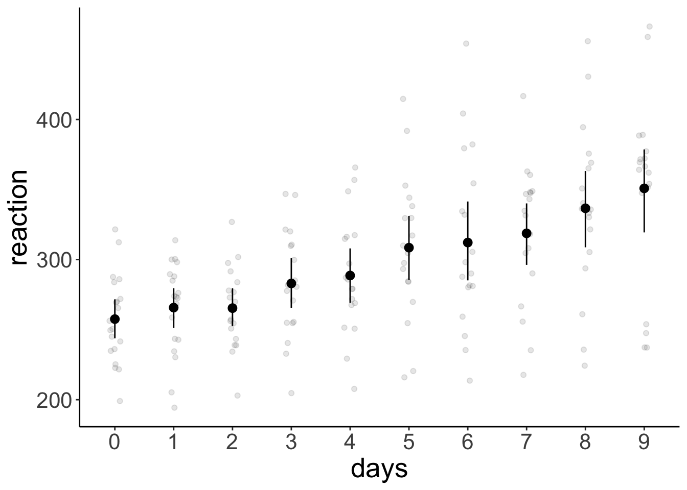
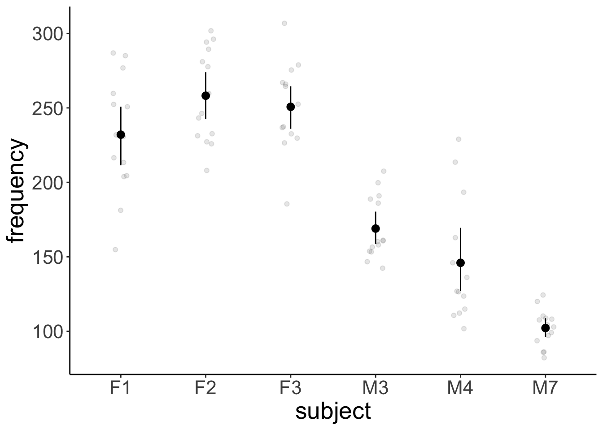
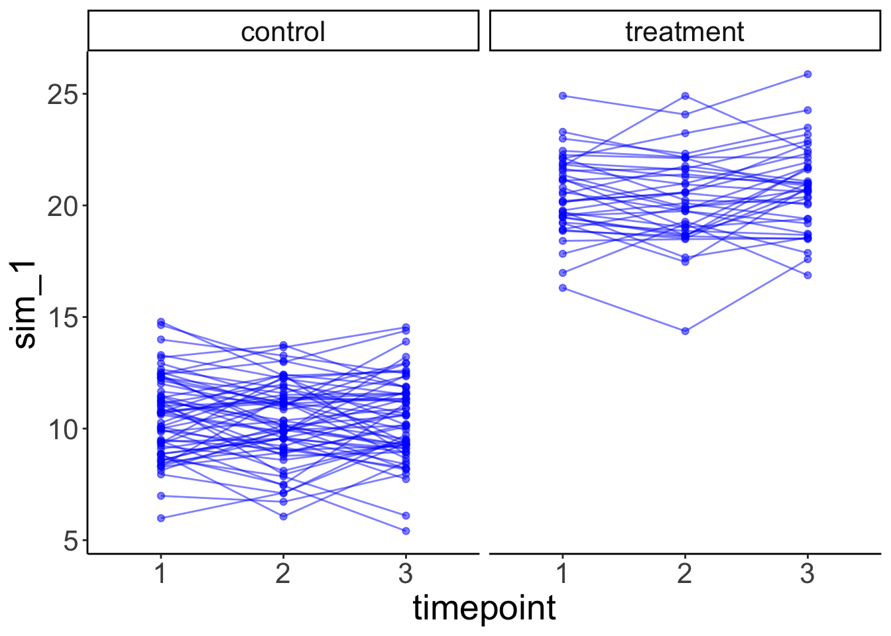

# Linear mixed effects models 4

## Learning goals

- Some worked examples. 
- Doing follow-up tests with the emmeans package

## Load packages and set plotting theme


```r
library("knitr")       # for knitting RMarkdown 
library("kableExtra")  # for making nice tables
library("janitor")     # for cleaning column names
library("broom.mixed") # for tidying up linear mixed effects models 
library("lme4")        # for linear mixed effects models
library("afex")        # for ANOVAs
library("car")         # for ANOVAs
library("datarium")    # for ANOVA dataset
library("modelr")      # for bootstrapping
library("boot")        # also for bootstrapping
library("ggeffects")   # for plotting marginal effects
library("emmeans")     # for marginal effects
library("tidyverse")   # for wrangling, plotting, etc. 
```


```r
theme_set(theme_classic() + #set the theme 
            theme(text = element_text(size = 20))) #set the default text size

# knitr display options 
opts_chunk$set(comment = "",
               fig.show = "hold")

# suppress grouping warning messages
options(dplyr.summarise.inform = F)
```

## Load data sets

### Sleep data


```r
# load sleepstudy data set 
df.sleep = sleepstudy %>% 
  as_tibble() %>% 
  clean_names() %>% 
  mutate(subject = as.character(subject)) %>% 
  select(subject, days, reaction)

# add two fake participants (with missing data)
df.sleep = df.sleep %>% 
  bind_rows(tibble(subject = "374",
                   days = 0:1,
                   reaction = c(286, 288)),
            tibble(subject = "373",
                   days = 0,
                   reaction = 245))
```

### Reasoning data


```r
df.reasoning = sk2011.1
```

### Weight loss data


```r
data("weightloss", package = "datarium")

# Modify it to have three-way mixed design
df.weightloss = weightloss %>%
  mutate(id = rep(1:24, 2)) %>% 
  pivot_longer(cols = t1:t3,
               names_to = "timepoint",
               values_to = "score") %>% 
  arrange(id)
```

### Politness data


```r
df.politeness = read_csv("data/politeness_data.csv") %>% 
  mutate(scenario = as.factor(scenario))
```

```
Rows: 84 Columns: 5
── Column specification ────────────────────────────────────────────────────────────────────────────────────────────────────────────────────────────────────────────────────────────────────────────────────────────────────────────────────
Delimiter: ","
chr (3): subject, gender, attitude
dbl (2): scenario, frequency

ℹ Use `spec()` to retrieve the full column specification for this data.
ℹ Specify the column types or set `show_col_types = FALSE` to quiet this message.
```

## Follow-up tests with emmeans

Just like with the linear model `lm()`, we can use linear contrasts to test more specific hypotheses with `lmer()`. The `emmeans()` function from the `emmeans` package will be our friend. 

### Sleep study

Let's ask some more specific question aboust the sleep study. 

1. Do reaction times differ between day 0 and the first day of sleep deprivation? 
2. Do reaction times differ between the first and the second half of the study? 

Let's visualize the data first: 


```r
ggplot(data = df.sleep %>% 
         mutate(days = as.factor(days)),
       mapping = aes(x = days,
                     y = reaction)) + 
  geom_point(position = position_jitter(width = 0.1),
             alpha = 0.1) + 
  stat_summary(fun.data = "mean_cl_boot")
```



And now let's fit the model, and compute the contrasts: 


```r
fit = lmer(formula = reaction ~ 1 + days + (1 | subject),
           data = df.sleep %>% 
             mutate(days = as.factor(days)))

contrast = list(first_vs_second = c(-1, 1, rep(0, 8)),
                early_vs_late = c(rep(-1, 5)/5, rep(1, 5)/5))

fit %>% 
  emmeans(specs = "days",
          contr = contrast) %>% 
  pluck("contrasts")
```

```
 contrast        estimate    SE  df t.ratio p.value
 first_vs_second     7.82 10.10 156   0.775  0.4398
 early_vs_late      53.66  4.65 155  11.534  <.0001

Degrees-of-freedom method: kenward-roger 
```

```r
df.sleep %>% 
  # filter(days %in% c(0, 1)) %>% 
  group_by(days) %>% 
  summarize(reaction = mean(reaction))
```

```
# A tibble: 10 × 2
    days reaction
   <dbl>    <dbl>
 1     0     258.
 2     1     266.
 3     2     265.
 4     3     283.
 5     4     289.
 6     5     309.
 7     6     312.
 8     7     319.
 9     8     337.
10     9     351.
```

```r
df.sleep %>% 
  mutate(index = ifelse(days %in% 0:4, "early", "late")) %>% 
  group_by(index) %>% 
  summarize(reaction = mean(reaction))
```

```
# A tibble: 2 × 2
  index reaction
  <chr>    <dbl>
1 early     272.
2 late      325.
```

### Weight loss study

For the weight loss data set, we want to check: 

1. Whether there was a difference between the first two vs. the last time point. 
2. Whether there was a linear trend across the time points. 

Let's first visualize again: 


```r
ggplot(data = df.weightloss,
       mapping = aes(x = timepoint,
                     y = score,
                     group = diet,
                     color = diet)) + 
  geom_point(position = position_jitterdodge(dodge.width = 0.5,
                                  jitter.width = 0.1,
                                  jitter.height = 0),
             alpha = 0.1) + 
  stat_summary(fun.data = "mean_cl_boot",
               position = position_dodge(width = 0.5)) +
  facet_wrap(~ exercises) + 
  scale_color_brewer(palette = "Set1")

ggplot(data = df.weightloss,
       mapping = aes(x = timepoint,
                     y = score)) + 
  geom_point(position = position_jitter(width = 0.1),
             alpha = 0.1) + 
  stat_summary(fun.data = "mean_cl_boot") +
  scale_color_brewer(palette = "Set1")
```


And then fit the model, and compute the contrasts:


```r
fit = aov_ez(id = "id",
       dv = "score",
       between = "exercises",
       within = c("diet", "timepoint"),
       data = df.weightloss)
```

```
Contrasts set to contr.sum for the following variables: exercises
```

```r
contrasts = list(first_two_vs_last = c(-0.5, -0.5, 1),
                 linear_increase = c(-1, 0, 1))

fit %>% 
  emmeans(spec = "timepoint",
          contr = contrasts)
```

```
$emmeans
 timepoint emmean    SE df lower.CL upper.CL
 t1          11.2 0.169 22     10.9     11.6
 t2          12.7 0.174 22     12.3     13.0
 t3          14.2 0.182 22     13.8     14.6

Results are averaged over the levels of: exercises, diet 
Confidence level used: 0.95 

$contrasts
 contrast          estimate    SE df t.ratio p.value
 first_two_vs_last     2.24 0.204 22  11.016  <.0001
 linear_increase       2.97 0.191 22  15.524  <.0001

Results are averaged over the levels of: exercises, diet 
```

Because we only had one observation in each cell of our design, the ANOVA was appropriate here (no data points needed to be aggregated). 

Both contrasts are significant. 

### Politeness study

For the politeness study, we'll be interested in one particular contrast: 

1. Was there an effect of attitude on frequency for female participants? 

Let's visualize first: 


```r
# overview of the data 
ggplot(data = df.politeness,
        mapping = aes(x = attitude,
                      y = frequency,
                      group = gender,
                      color = gender)) + 
  geom_point(position = position_jitter(width = 0.1),
             alpha = 0.1) + 
  stat_summary(fun.data = "mean_cl_boot") + 
  scale_color_brewer(palette = "Set1")
```

```
Warning: Removed 1 rows containing non-finite values (`stat_summary()`).
```

```
Warning: Removed 1 rows containing missing values (`geom_point()`).
```

```r
# variation across scenarios 
ggplot(data = df.politeness,
        mapping = aes(x = scenario,
                      y = frequency)) + 
  geom_point(position = position_jitter(width = 0.1),
             alpha = 0.1) + 
  stat_summary(fun.data = "mean_cl_boot") + 
  scale_color_brewer(palette = "Set1")
```

```
Warning: Removed 1 rows containing non-finite values (`stat_summary()`).
Removed 1 rows containing missing values (`geom_point()`).
```

```r
# variation across participants
ggplot(data = df.politeness,
        mapping = aes(x = subject,
                      y = frequency)) + 
  geom_point(position = position_jitter(width = 0.1),
             alpha = 0.1) + 
  stat_summary(fun.data = "mean_cl_boot") + 
  scale_color_brewer(palette = "Set1")
```

```
Warning: Removed 1 rows containing non-finite values (`stat_summary()`).
Removed 1 rows containing missing values (`geom_point()`).
```



We fit the model and compute the contrasts. 


```r
fit = lmer(formula = frequency ~ 1 + attitude * gender + (1 | subject) + (1 | scenario),
           data = df.politeness)

fit %>% 
  emmeans(specs = pairwise ~ attitude + gender,
          adjust = "none")
```

```
$emmeans
 attitude gender emmean   SE   df lower.CL upper.CL
 inf      F         261 16.3 5.73    220.2      301
 pol      F         233 16.3 5.73    192.8      274
 inf      M         144 16.3 5.73    104.0      185
 pol      M         133 16.4 5.80     92.2      173

Degrees-of-freedom method: kenward-roger 
Confidence level used: 0.95 

$contrasts
 contrast      estimate    SE    df t.ratio p.value
 inf F - pol F     27.4  7.79 69.00   3.517  0.0008
 inf F - inf M    116.2 21.73  4.56   5.348  0.0040
 inf F - pol M    128.0 21.77  4.59   5.881  0.0027
 pol F - inf M     88.8 21.73  4.56   4.087  0.0115
 pol F - pol M    100.6 21.77  4.59   4.623  0.0071
 inf M - pol M     11.8  7.90 69.08   1.497  0.1390

Degrees-of-freedom method: kenward-roger 
```

Here, I've computed all pairwise contrasts. We were only interested in one: `inf F - pol F` and that one is significant. So the frequency of female participants' pitch differed between the informal and polite condition. 

If we had used an ANOVA approach for this data set, we could have done it like so: 


```r
aov_ez(id = "subject",
       dv = "frequency",
       between = "gender",
       within = "attitude",
       data = df.politeness)
```

```
Converting to factor: gender
```

```
Warning: More than one observation per design cell, aggregating data using `fun_aggregate = mean`.
To turn off this warning, pass `fun_aggregate = mean` explicitly.
```

```
Warning: Missing values for 1 ID(s), which were removed before analysis:
M4
Below the first few rows (in wide format) of the removed cases with missing data.
    subject gender pol   inf
# 5      M4      M  NA 146.3
```

```
Contrasts set to contr.sum for the following variables: gender
```

```
Anova Table (Type 3 tests)

Response: frequency
           Effect   df     MSE          F  ges p.value
1          gender 1, 3 1729.42    17.22 * .851    .025
2        attitude 1, 3    3.65 309.71 *** .179   <.001
3 gender:attitude 1, 3    3.65    21.30 * .015    .019
---
Signif. codes:  0 '***' 0.001 '**' 0.01 '*' 0.05 '+' 0.1 ' ' 1
```

This approach ignores the variation across scenarios (and just computed the mean instead). Arguably, the `lmer()` approach is better here as it takes all of the data into account. 

## Mixtures of participants

What if we have groups of participants who differ from each other? Let's generate data for which this is the case.


```r
# make example reproducible 
set.seed(1)

sample_size = 20
b0 = 1
b1 = 2
sd_residual = 0.5
sd_participant = 0.5
mean_group1 = 1
mean_group2 = 10

df.mixed = tibble(
  condition = rep(0:1, each = sample_size), 
  participant = rep(1:sample_size, 2)) %>% 
  group_by(participant) %>% 
  mutate(group = sample(1:2, size = 1),
         intercept = ifelse(group == 1,
                            rnorm(n(), mean = mean_group1, sd = sd_participant),
                            rnorm(n(), mean = mean_group2, sd = sd_participant))) %>% 
  group_by(condition) %>% 
  mutate(value = b0 + b1 * condition + intercept + rnorm(n(), sd = sd_residual)) %>% 
  ungroup %>% 
  mutate(condition = as.factor(condition),
         participant = as.factor(participant))
```

#### Ignoring mixture

Let' first fit a model that ignores the fact that there are two different groups of participants. 


```r
# fit model
fit.mixed = lmer(formula = value ~ 1 + condition + (1 | participant),
                 data = df.mixed)

summary(fit.mixed)
```

```
Linear mixed model fit by REML. t-tests use Satterthwaite's method [
lmerModLmerTest]
Formula: value ~ 1 + condition + (1 | participant)
   Data: df.mixed

REML criterion at convergence: 163.5

Scaled residuals: 
     Min       1Q   Median       3Q      Max 
-1.62997 -0.41663 -0.05607  0.54750  1.54023 

Random effects:
 Groups      Name        Variance Std.Dev.
 participant (Intercept) 19.2206  4.3841  
 Residual                 0.3521  0.5934  
Number of obs: 40, groups:  participant, 20

Fixed effects:
            Estimate Std. Error      df t value Pr(>|t|)    
(Intercept)   5.8729     0.9893 19.3449   5.937 9.54e-06 ***
condition1    1.6652     0.1876 19.0000   8.875 3.47e-08 ***
---
Signif. codes:  0 '***' 0.001 '**' 0.01 '*' 0.05 '.' 0.1 ' ' 1

Correlation of Fixed Effects:
           (Intr)
condition1 -0.095
```

Let's look at the model's predictions: 


```r
fit.mixed %>%
  augment() %>%
  clean_names() %>%
  ggplot(data = .,
         mapping = aes(x = condition,
                       y = value,
                       group = participant)) +
  geom_point(alpha = 0.5) +
  geom_line(alpha = 0.5) +
  geom_point(aes(y = fitted),
             color = "red") +
  geom_line(aes(y = fitted),
             color = "red")
```


And let's simulate some data from the fitted model: 


```r
# simulated data 
fit.mixed %>%
  simulate() %>%
  bind_cols(df.mixed) %>%
  ggplot(data = .,
         mapping = aes(x = condition,
                       y = sim_1,
                       group = participant)) +
  geom_line(alpha = 0.5) +
  geom_point(alpha = 0.5)
```


As we can see, the simulated data doesn't look like the data that was used to fit the model.  

#### Modeling mixture

Now, let's fit a model that takes the differences between groups into account by adding a fixed effect for `group`.


```r
# fit model
fit.grouped = lmer(formula = value ~ 1 + group + condition + (1 | participant),
                   data = df.mixed)

summary(fit.grouped)
```

```
Linear mixed model fit by REML. t-tests use Satterthwaite's method [
lmerModLmerTest]
Formula: value ~ 1 + group + condition + (1 | participant)
   Data: df.mixed

REML criterion at convergence: 82.2

Scaled residuals: 
     Min       1Q   Median       3Q      Max 
-1.61879 -0.61378  0.02557  0.49842  2.19076 

Random effects:
 Groups      Name        Variance Std.Dev.
 participant (Intercept) 0.09265  0.3044  
 Residual                0.35208  0.5934  
Number of obs: 40, groups:  participant, 20

Fixed effects:
            Estimate Std. Error      df t value Pr(>|t|)    
(Intercept)  -6.3136     0.3633 20.5655 -17.381 9.10e-14 ***
group         8.7046     0.2366 18.0000  36.791  < 2e-16 ***
condition1    1.6652     0.1876 19.0000   8.875 3.47e-08 ***
---
Signif. codes:  0 '***' 0.001 '**' 0.01 '*' 0.05 '.' 0.1 ' ' 1

Correlation of Fixed Effects:
           (Intr) group 
group      -0.912       
condition1 -0.258  0.000
```

Note how the variance of the random intercepts is much smaller now that we've taken the group structure in the data into account. 

Let's visualize the model's predictions:


```r
fit.grouped %>%
  augment() %>%
  clean_names() %>%
  ggplot(data = .,
         mapping = aes(x = condition,
                       y = value,
                       group = participant)) +
  geom_point(alpha = 0.5) +
  geom_line(alpha = 0.5) +
  geom_point(aes(y = fitted),
             color = "red") +
  geom_line(aes(y = fitted),
             color = "red")
```


And simulate some data from the model: 


```r
# simulated data 
fit.grouped %>%
  simulate() %>%
  bind_cols(df.mixed) %>%
  ggplot(data = .,
         mapping = aes(x = condition,
                       y = sim_1,
                       group = participant)) +
  geom_line(alpha = 0.5) +
  geom_point(alpha = 0.5)
```


This time, the simulated data looks much more like the data that was used to fit the model. Yay! 


```r
ggpredict(model = fit.grouped,
          terms = "condition") %>% 
  plot()

ggpredict(model = fit.mixed,
          terms = "condition") %>% 
  plot()
```


#### Heterogeneity in variance

The example above has shown that we can take overall differences between groups into account by adding a fixed effect. Can we also deal with heterogeneity in variance between groups? For example, what if the responses of one group exhibit much more variance than the responses of another group? 

Let's first generate some data with heterogeneous variance: 


```r
# make example reproducible 
set.seed(1)

sample_size = 20
b0 = 1
b1 = 2
sd_residual = 0.5
mean_group1 = 1
sd_group1 = 1
mean_group2 = 30
sd_group2 = 10

df.variance = tibble(
  condition = rep(0:1, each = sample_size), 
  participant = rep(1:sample_size, 2)) %>% 
  group_by(participant) %>% 
  mutate(group = sample(1:2, size = 1),
         intercept = ifelse(group == 1,
                            rnorm(n(), mean = mean_group1, sd = sd_group1),
                            rnorm(n(), mean = mean_group2, sd = sd_group2))) %>% 
  group_by(condition) %>% 
  mutate(value = b0 + b1 * condition + intercept + rnorm(n(), sd = sd_residual)) %>% 
  ungroup %>% 
  mutate(condition = as.factor(condition),
         participant = as.factor(participant))
```

Let's fit the model: 


```r
# fit model
fit.variance = lmer(formula = value ~ 1 + group + condition + (1 | participant),
                    data = df.variance)

summary(fit.variance)
```

```
Linear mixed model fit by REML. t-tests use Satterthwaite's method [
lmerModLmerTest]
Formula: value ~ 1 + group + condition + (1 | participant)
   Data: df.variance

REML criterion at convergence: 232.7

Scaled residuals: 
     Min       1Q   Median       3Q      Max 
-2.96291 -0.19619  0.03751  0.28317  1.45552 

Random effects:
 Groups      Name        Variance Std.Dev.
 participant (Intercept) 17.12    4.137   
 Residual                13.74    3.706   
Number of obs: 40, groups:  participant, 20

Fixed effects:
            Estimate Std. Error       df t value Pr(>|t|)    
(Intercept) -24.0018     3.3669  19.1245  -7.129 8.56e-07 ***
group        27.0696     2.2353  18.0000  12.110 4.36e-10 ***
condition1    0.5716     1.1720  19.0000   0.488    0.631    
---
Signif. codes:  0 '***' 0.001 '**' 0.01 '*' 0.05 '.' 0.1 ' ' 1

Correlation of Fixed Effects:
           (Intr) group 
group      -0.929       
condition1 -0.174  0.000
```

Look at the data and model predictions: 


```r
fit.variance %>%
  augment() %>%
  clean_names() %>%
  ggplot(data = .,
         mapping = aes(x = condition,
                       y = value,
                       group = participant)) +
  geom_point(alpha = 0.5) +
  geom_line(alpha = 0.5) +
  geom_point(aes(y = fitted),
             color = "red") +
  geom_line(aes(y = fitted),
             color = "red")
```


And the simulated data: 


```r
# simulated data 
fit.variance %>%
  simulate() %>%
  bind_cols(df.mixed) %>%
  ggplot(data = .,
         mapping = aes(x = condition,
                       y = sim_1,
                       group = participant)) +
  geom_line(alpha = 0.5) +
  geom_point(alpha = 0.5)
```


The `lmer()` fails here. It uses one normal distribution to model the variance between participants. It cannot account for the fact that the answers of one group of participants vary more than the answers from another groups of participants. Again, the simulated data doesn't look like the original data, even though we did take the grouping into account. 

We will later see that it's straightforward in Bayesian models to explicitly model heterogeneity in variance. 

## Bootstrapping

Bootstrapping is a good way to estimate our uncertainty on the parameter estimates in the model. 

### Linear model

Let's briefly review how to do bootstrapping in a simple linear model. 


```r
# fit model 
fit.lm = lm(formula = reaction ~ 1 + days,
            data = df.sleep)

# coefficients
coef(fit.lm)
```

```
(Intercept)        days 
  252.32070    10.32766 
```

```r
# bootstrapping 
df.boot = df.sleep %>% 
  bootstrap(n = 100,
            id = "id") %>% 
  mutate(fit = map(.x = strap,
                   .f = ~ lm(formula = reaction ~ 1 + days, data = .)),
         tidy = map(.x = fit, 
                    .f = tidy)) %>% 
  unnest(tidy) %>% 
  select(id, term, estimate) %>% 
  spread(term, estimate) %>% 
  clean_names() 
```

Let's illustrate the linear model with a confidence interval (making parametric assumptions using the t-distribution). 


```r
ggplot(data = df.sleep,
       mapping = aes(x = days,
                     y = reaction)) + 
  geom_smooth(method = "lm") + 
  geom_point(alpha = 0.3)
```


And let's compare this with the different regression lines that we get out of our bootstrapped samples:


```r
ggplot(data = df.sleep,
       mapping = aes(x = days,
                     y = reaction)) + 
  geom_abline(data = df.boot,
              aes(intercept = intercept,
                  slope = days,
                  group = id),
              alpha = 0.1) +
  geom_point(alpha = 0.3)
```


#### bootmer() function

For the linear mixed effects model, we can use the `bootmer()` function to do bootstrapping. 


```r
set.seed(1)

# fit the model 
fit.lmer = lmer(formula = reaction ~ 1 + days + (1 + days | subject),
                data = df.sleep)

# bootstrap parameter estimates 
boot.lmer = bootMer(fit.lmer,
                    FUN = fixef,
                    nsim = 100)

# compute confidence interval 
boot.ci(boot.lmer, index = 2, type = "perc")
```

```
BOOTSTRAP CONFIDENCE INTERVAL CALCULATIONS
Based on 100 bootstrap replicates

CALL : 
boot.ci(boot.out = boot.lmer, type = "perc", index = 2)

Intervals : 
Level     Percentile     
95%   ( 7.26, 13.79 )  
Calculations and Intervals on Original Scale
Some percentile intervals may be unstable
```

```r
# plot estimates 
boot.lmer$t %>% 
  as_tibble() %>% 
  clean_names() %>% 
  mutate(id = 1:n()) %>% 
  pivot_longer(cols = -id,
               names_to = "index",
               values_to = "value") %>% 
  ggplot(data = .,
         mapping = aes(x = value)) + 
  geom_density() + 
  facet_grid(cols = vars(index),
             scales = "free") +
  coord_cartesian(expand = F)
```



## Session info

Information about this R session including which version of R was used, and what packages were loaded. 


```r
sessionInfo()
```

```
R version 4.3.2 (2023-10-31)
Platform: aarch64-apple-darwin20 (64-bit)
Running under: macOS Sonoma 14.1.2

Matrix products: default
BLAS:   /Library/Frameworks/R.framework/Versions/4.3-arm64/Resources/lib/libRblas.0.dylib 
LAPACK: /Library/Frameworks/R.framework/Versions/4.3-arm64/Resources/lib/libRlapack.dylib;  LAPACK version 3.11.0

locale:
[1] en_US.UTF-8/en_US.UTF-8/en_US.UTF-8/C/en_US.UTF-8/en_US.UTF-8

time zone: America/Los_Angeles
tzcode source: internal

attached base packages:
[1] stats     graphics  grDevices utils     datasets  methods   base     

other attached packages:
 [1] lubridate_1.9.3     forcats_1.0.0       stringr_1.5.1      
 [4] dplyr_1.1.4         purrr_1.0.2         readr_2.1.4        
 [7] tidyr_1.3.0         tibble_3.2.1        ggplot2_3.4.4      
[10] tidyverse_2.0.0     emmeans_1.9.0       ggeffects_1.3.4    
[13] boot_1.3-28.1       modelr_0.1.11       datarium_0.1.0     
[16] car_3.1-2           carData_3.0-5       afex_1.3-0         
[19] lme4_1.1-35.1       Matrix_1.6-4        broom.mixed_0.2.9.4
[22] janitor_2.2.0       kableExtra_1.3.4    knitr_1.45         

loaded via a namespace (and not attached):
 [1] gridExtra_2.3       rlang_1.1.2         magrittr_2.0.3     
 [4] snakecase_0.11.1    furrr_0.3.1         compiler_4.3.2     
 [7] mgcv_1.9-1          systemfonts_1.0.5   vctrs_0.6.5        
[10] reshape2_1.4.4      rvest_1.0.3         pkgconfig_2.0.3    
[13] crayon_1.5.2        fastmap_1.1.1       backports_1.4.1    
[16] labeling_0.4.3      utf8_1.2.4          rmarkdown_2.25     
[19] tzdb_0.4.0          haven_2.5.4         nloptr_2.0.3       
[22] bit_4.0.5           xfun_0.41           cachem_1.0.8       
[25] jsonlite_1.8.8      highr_0.10          broom_1.0.5        
[28] parallel_4.3.2      cluster_2.1.6       R6_2.5.1           
[31] RColorBrewer_1.1-3  bslib_0.6.1         stringi_1.8.3      
[34] parallelly_1.36.0   rpart_4.1.23        jquerylib_0.1.4    
[37] numDeriv_2016.8-1.1 estimability_1.4.1  Rcpp_1.0.11        
[40] bookdown_0.37       base64enc_0.1-3     splines_4.3.2      
[43] nnet_7.3-19         timechange_0.2.0    tidyselect_1.2.0   
[46] rstudioapi_0.15.0   abind_1.4-5         yaml_2.3.8         
[49] sjlabelled_1.2.0    codetools_0.2-19    listenv_0.9.0      
[52] lattice_0.22-5      lmerTest_3.1-3      plyr_1.8.9         
[55] withr_2.5.2         coda_0.19-4         evaluate_0.23      
[58] foreign_0.8-86      future_1.33.1       xml2_1.3.6         
[61] pillar_1.9.0        checkmate_2.3.1     insight_0.19.7     
[64] generics_0.1.3      vroom_1.6.5         hms_1.1.3          
[67] munsell_0.5.0       scales_1.3.0        minqa_1.2.6        
[70] globals_0.16.2      xtable_1.8-4        glue_1.6.2         
[73] Hmisc_5.1-1         tools_4.3.2         data.table_1.14.10 
[76] webshot_0.5.5       mvtnorm_1.2-4       grid_4.3.2         
[79] datawizard_0.9.1    colorspace_2.1-0    nlme_3.1-164       
[82] htmlTable_2.4.2     Formula_1.2-5       cli_3.6.2          
[85] fansi_1.0.6         viridisLite_0.4.2   svglite_2.1.3      
[88] gtable_0.3.4        sass_0.4.8          digest_0.6.33      
[91] pbkrtest_0.5.2      farver_2.1.1        htmlwidgets_1.6.4  
[94] htmltools_0.5.7     lifecycle_1.0.4     httr_1.4.7         
[97] bit64_4.0.5         MASS_7.3-60        
```
