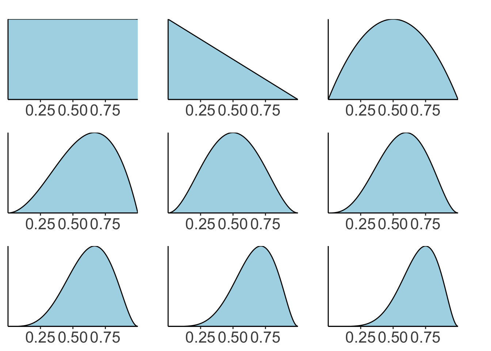
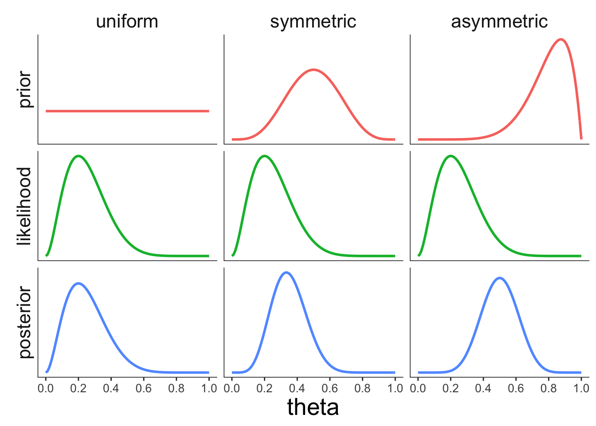
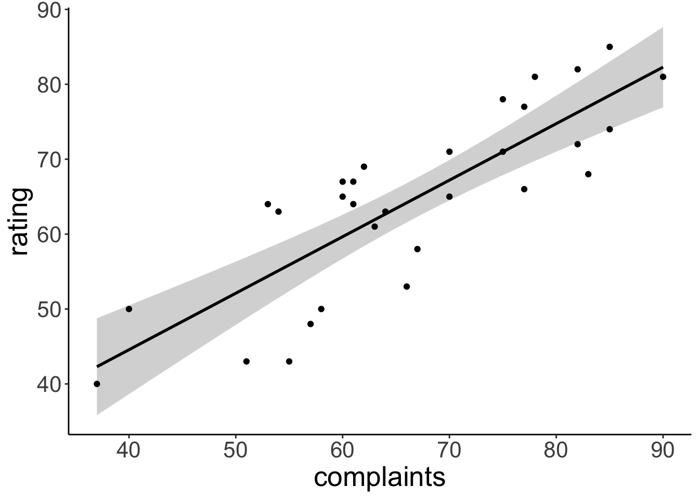

# Bayesian data analysis 1

## Learning goals

- Doing Bayesian inference "by hand"
- Understanding the effect that prior, likelihood, and sample size have on the posterior. 
- Doing Bayesian data analysis with `greta`
  - A simple linear regression.

## Load packages and set plotting theme


``` r
library("knitr")      # for knitting RMarkdown
library("janitor")    # for cleaning column names
library("patchwork")  # for figure panels
library("tidybayes")  # tidying up results from Bayesian models
library("greta")      # for writing Bayesian models
library("gganimate")  # for animations
library("extraDistr") # additional probability distributions
library("broom")      # for tidy regression results
library("tidyverse")  # for wrangling, plotting, etc. 
```


``` r
theme_set(theme_classic() + #set the theme 
    theme(text = element_text(size = 20))) #set the default text size

opts_chunk$set(comment = "",
               fig.show = "hold")
```

## Doing Bayesian inference "by hand"

### Sequential updating based on the Beta distribution


``` r
# data 
data = c(0, 1, 1, 0, 1, 1, 1, 1)

# whether observation is a success or failure 
success = c(0, cumsum(data)) 
failure = c(0, cumsum(1 - data))
# I've added 0 at the beginning to show the prior

# plotting function
fun.plot_beta = function(success, failure){
  ggplot(data = tibble(x = c(0, 1)),
         mapping = aes(x = x)) +
    stat_function(fun = dbeta,
                  args = list(shape1 = success + 1, shape2 = failure + 1),
                  geom = "area",
                  color = "black",
                  fill = "lightblue") +
    coord_cartesian(expand = F) +
    scale_x_continuous(breaks = seq(0.25, 0.75, 0.25)) + 
    theme(axis.title = element_blank(),
          axis.text.y = element_blank(),
          axis.ticks.y = element_blank(),
          plot.margin = margin(r = 1, t = 0.5, unit = "cm"))
}

# generate the plots 
plots = map2(success, failure, ~ fun.plot_beta(.x, .y))

# make a grid of plots
wrap_plots(plots, ncol = 3)
```



### Coin flip example

Is the coin biased? 


``` r
# data 
data = rep(0:1, c(8, 2))

# parameters 
theta = c(0.1, 0.5, 0.9)

# prior 
prior = c(0.25, 0.5, 0.25)
# prior = c(0.1, 0.1, 0.8) # alternative setting of the prior
# prior = c(0.000001, 0.000001, 0.999998) # another prior setting 

# likelihood 
likelihood = dbinom(sum(data == 1), size = length(data), prob = theta)

# posterior 
posterior = likelihood * prior / sum(likelihood * prior)

# store in data frame 
df.coins = tibble(theta = theta,
                  prior = prior,
                  likelihood = likelihood,
                  posterior = posterior) 
```

Visualize the results: 


``` r
df.coins %>% 
  pivot_longer(cols = -theta,
               names_to = "index",
               values_to = "value") %>% 
  mutate(index = factor(index, levels = c("prior", "likelihood", "posterior")),
         theta = factor(theta, labels = c("p = 0.1", "p = 0.5", "p = 0.9"))) %>% 
  ggplot(data = .,
         mapping = aes(x = theta,
                       y = value,
                       fill = index)) + 
  geom_bar(stat = "identity",
           color = "black") +
  facet_grid(rows = vars(index),
             switch = "y",
             scales = "free") + 
  annotate("segment", x = -Inf, xend = Inf, y = -Inf, yend = -Inf) + 
  annotate("segment", x = -Inf, xend = -Inf, y = -Inf, yend = Inf) + 
  theme(legend.position = "none",
        strip.background = element_blank(),
        axis.title.y = element_blank(),
        axis.text.y = element_blank(),
        axis.ticks.y = element_blank(),
        axis.title.x = element_blank(),
        axis.line = element_blank())
```


### Bayesian inference by discretization

#### Effect of the prior


``` r
# grid
theta = seq(0, 1, 0.01)

# data
data = rep(0:1, c(8, 2))

# calculate posterior
df.prior_effect = tibble(theta = theta, 
                  prior_uniform = dbeta(theta, shape1 = 1, shape2 = 1),
                  prior_normal = dbeta(theta, shape1 = 5, shape2 = 5),
                  prior_biased = dbeta(theta, shape1 = 8, shape2 = 2)) %>% 
  pivot_longer(cols = -theta,
               names_to = "prior_index",
               values_to = "prior") %>% 
  mutate(likelihood = dbinom(sum(data == 1),
                             size = length(data),
                             prob = theta)) %>% 
  group_by(prior_index) %>% 
  mutate(posterior = likelihood * prior / sum(likelihood * prior)) %>% 
  ungroup() %>% 
  pivot_longer(cols = -c(theta, prior_index),
               names_to = "index",
               values_to = "value")

# make the plot
df.prior_effect %>% 
  mutate(index = factor(index, levels = c("prior", "likelihood", "posterior")),
         prior_index = factor(prior_index,
                              levels = c("prior_uniform", "prior_normal", "prior_biased"),
                              labels = c("uniform", "symmetric", "asymmetric"))) %>% 
  ggplot(data = .,
         mapping = aes(x = theta,
                       y = value,
                       color = index)) +
  geom_line(size = 1) + 
  facet_grid(cols = vars(prior_index),
             rows = vars(index),
             scales = "free",
             switch = "y") +
  scale_x_continuous(breaks = seq(0, 1, 0.2)) +
  annotate("segment", x = -Inf, xend = Inf, y = -Inf, yend = -Inf) + 
  annotate("segment", x = -Inf, xend = -Inf, y = -Inf, yend = Inf) + 
  theme(legend.position = "none",
        strip.background = element_blank(),
        axis.title.y = element_blank(),
        axis.text.y = element_blank(),
        axis.ticks.y = element_blank(),
        axis.text.x = element_text(size = 10),
        axis.line = element_blank())
```

```
Warning: Using `size` aesthetic for lines was deprecated in ggplot2 3.4.0.
ℹ Please use `linewidth` instead.
This warning is displayed once every 8 hours.
Call `lifecycle::last_lifecycle_warnings()` to see where this warning was generated.
```

<div class="figure">

<p class="caption">(\#fig:unnamed-chunk-7)Illustration of how the prior affects the posterior.</p>
</div>

#### Effect of the likelihood


``` r
# grid
theta = seq(0, 1, 0.01)

df.likelihood_effect = tibble(theta = theta, 
                              prior = dbeta(theta, shape1 = 2, shape2 = 8),
                              likelihood_left = dbeta(theta, shape1 = 1, shape2 = 9),
                              likelihood_center = dbeta(theta, shape1 = 5, shape2 = 5),
                              likelihood_right = dbeta(theta, shape1 = 9, shape2 = 1)) %>% 
  pivot_longer(cols = -c(theta, prior),
               names_to = "likelihood_index",
               values_to = "likelihood") %>% 
  group_by(likelihood_index) %>% 
  mutate(posterior = likelihood * prior / sum(likelihood * prior)) %>% 
  ungroup() %>% 
  pivot_longer(cols = -c(theta, likelihood_index),
               names_to = "index",
               values_to = "value")

df.likelihood_effect %>% 
  mutate(index = factor(index, levels = c("prior", "likelihood", "posterior")),
         likelihood_index = factor(likelihood_index,
                                   levels = c("likelihood_left",
                                              "likelihood_center",
                                              "likelihood_right"),
                                   labels = c("left", "center", "right"))) %>% 
  ggplot(data = .,
         mapping = aes(x = theta,
                       y = value,
                       color = index)) +
  geom_line(size = 1) + 
  facet_grid(cols = vars(likelihood_index),
             rows = vars(index),
             scales = "free",
             switch = "y") +
  scale_x_continuous(breaks = seq(0, 1, 0.2)) +
  annotate("segment", x = -Inf, xend = Inf, y = -Inf, yend = -Inf) + 
  annotate("segment", x = -Inf, xend = -Inf, y = -Inf, yend = Inf) + 
  theme(legend.position = "none",
        strip.background = element_blank(),
        axis.title.y = element_blank(),
        axis.text.y = element_blank(),
        axis.ticks.y = element_blank(),
        axis.text.x = element_text(size = 10),
        axis.line = element_blank(),
        strip.text.x = element_blank())
```

<div class="figure">

<p class="caption">(\#fig:unnamed-chunk-8)Illustration of how the likelihood of the data affects the posterior.</p>
</div>

#### Effect of the sample size


``` r
# grid
theta = seq(0, 1, 0.01)

df.sample_size_effect = tibble(theta = theta, 
                               prior = dbeta(theta, shape1 = 5, shape2 = 5),
                               likelihood_low = dbeta(theta, shape1 = 2, shape2 = 8),
                               likelihood_medium = dbeta(theta,
                                                         shape1 = 10,
                                                         shape2 = 40),
                               likelihood_high = dbeta(theta,
                                                       shape1 = 20,
                                                       shape2 = 80)) %>% 
  pivot_longer(cols = -c(theta, prior),
               names_to = "likelihood_index",
               values_to = "likelihood") %>% 
  group_by(likelihood_index) %>% 
  mutate(posterior = likelihood * prior / sum(likelihood * prior)) %>% 
  ungroup() %>% 
  pivot_longer(cols = -c(theta, likelihood_index),
               names_to = "index",
               values_to = "value")

df.sample_size_effect %>% 
  mutate(index = factor(index, levels = c("prior", "likelihood", "posterior")),
         likelihood_index = factor(likelihood_index,
                                   levels = c("likelihood_low",
                                              "likelihood_medium",
                                              "likelihood_high"),
                                   labels = c("n = low", "n = medium", "n = high"))) %>% 
  ggplot(data = .,
         mapping = aes(x = theta,
                       y = value,
                       color = index)) +
  geom_line(size = 1) + 
  facet_grid(cols = vars(likelihood_index),
             rows = vars(index),
             scales = "free",
             switch = "y") +
  scale_x_continuous(breaks = seq(0, 1, 0.2)) +
  annotate("segment", x = -Inf, xend = Inf, y = -Inf, yend = -Inf) + 
  annotate("segment", x = -Inf, xend = -Inf, y = -Inf, yend = Inf) + 
  theme(legend.position = "none",
        strip.background = element_blank(),
        axis.title.y = element_blank(),
        axis.text.y = element_blank(),
        axis.ticks.y = element_blank(),
        axis.text.x = element_text(size = 10),
        axis.line = element_blank())
```


## Doing Bayesian inference with Greta

You can find out more about how get started with "greta" here: [https://greta-stats.org/articles/get_started.html](https://greta-stats.org/articles/get_started.html). Make sure to install the development version of "greta" (as shown in the "install-packages" code chunk above: `devtools::install_github("greta-dev/greta")`).

### Attitude data set


``` r
# load the attitude data set 
df.attitude = attitude
```

Visualize relationship between how well complaints are handled and the overall rating of an employee


``` r
ggplot(data = df.attitude,
       mapping = aes(x = complaints,
                     y = rating)) +
  geom_point()
```


### Frequentist analysis


``` r
# fit model 
fit.lm = lm(formula = rating ~ 1 + complaints, 
            data = df.attitude)

# print summary
fit.lm %>% 
  summary()
```

```

Call:
lm(formula = rating ~ 1 + complaints, data = df.attitude)

Residuals:
     Min       1Q   Median       3Q      Max 
-12.8799  -5.9905   0.1783   6.2978   9.6294 

Coefficients:
            Estimate Std. Error t value Pr(>|t|)    
(Intercept) 14.37632    6.61999   2.172   0.0385 *  
complaints   0.75461    0.09753   7.737 1.99e-08 ***
---
Signif. codes:  0 '***' 0.001 '**' 0.01 '*' 0.05 '.' 0.1 ' ' 1

Residual standard error: 6.993 on 28 degrees of freedom
Multiple R-squared:  0.6813,	Adjusted R-squared:  0.6699 
F-statistic: 59.86 on 1 and 28 DF,  p-value: 1.988e-08
```

Visualize the model's predictions


``` r
ggplot(data = df.attitude,
       mapping = aes(x = complaints,
                     y = rating)) +
  geom_smooth(method = "lm",
              formula = "y ~ x", 
              color = "black") + 
  geom_point()
```



### Bayesian regression

#### Fit the model


``` r
set.seed(1)

# variables & priors
b0 = normal(0, 10)
b1 = normal(0, 10)
sd = cauchy(0, 3, truncation = c(0, Inf))

# linear predictor
mu = b0 + b1 * df.attitude$complaints

# observation model (likelihood)
distribution(df.attitude$rating) = normal(mu, sd)

# define the model
m = model(b0, b1, sd)
```

Visualize the model as graph: 


``` r
# plotting
plot(m)
```

Draw samples from the posterior distribution: 


``` r
set.seed(1)

# sampling
draws = mcmc(m, n_samples = 1000)

# tidy up the draws
df.draws = tidy_draws(draws) %>% 
  clean_names()
```

#### Visualize the priors

These are the priors I used for the intercept, regression weights, and the standard deviation of the Gaussian likelihood function:  


``` r
# Gaussian
ggplot(tibble(x = c(-30, 30)),
       aes(x = x)) +
  stat_function(fun = "dnorm", 
                size = 2,
                args = list(sd = 10))

# Cauchy
ggplot(tibble(x = c(0, 30)),
       aes(x = x)) +
  stat_function(fun = "dcauchy", 
                size = 2,
                args = list(location = 0,
                            scale = 3))
```

#### Visualize the posteriors

This is what the posterior looks like for the three parameters in the model: 


``` r
df.draws %>% 
  select(draw:sd) %>% 
  pivot_longer(cols = -draw,
               names_to = "index",
               values_to = "value") %>% 
  ggplot(data = .,
         mapping = aes(x = value)) + 
  stat_density(geom = "line") + 
  facet_grid(rows = vars(index),
             scales = "free_y",
             switch = "y") + 
  annotate("segment", x = -Inf, xend = Inf, y = -Inf, yend = -Inf) + 
  annotate("segment", x = -Inf, xend = -Inf, y = -Inf, yend = Inf) + 
  theme(legend.position = "none",
        strip.background = element_blank(),
        axis.title.y = element_blank(),
        axis.text.y = element_blank(),
        axis.ticks.y = element_blank(),
        axis.text.x = element_text(size = 10),
        axis.line = element_blank(),
        strip.text.x = element_blank())
```

#### Credible interval vs. confidence interval


``` r
fit.lm %>% 
  tidy(conf.int = T) %>% 
  ggplot(mapping = aes(y = term,
                       x = estimate,
                       xmin = conf.low,
                       xmax = conf.high)) +
  geom_pointrange()
```


#### Visualize model predictions

Let's take some samples from the posterior to visualize the model predictions: 


``` r
ggplot(data = df.attitude,
       mapping = aes(x = complaints, 
                     y = rating)) + 
  geom_abline(data = df.draws %>% 
                slice_sample(n = 50),
              mapping = aes(intercept = b0, 
                            slope = b1),
              alpha = 0.3,
              color = "lightblue") + 
  geom_point() 
```

#### Posterior predictive check

Let's make an animation that illustrates what predicted data sets (based on samples from the posterior) would look like: 


``` r
p = df.draws %>% 
  slice_sample(n = 10) %>%  
  mutate(complaints = list(seq(min(df.attitude$complaints),
                               max(df.attitude$complaints),
                               length.out = nrow(df.attitude)))) %>% 
  unnest(c(complaints)) %>% 
  mutate(prediction = b0 + b1 * complaints + rnorm(n(), sd = sd)) %>% 
  ggplot(aes(x = complaints, y = prediction)) + 
  geom_point(alpha = 0.8,
             color = "lightblue") +
  geom_point(data = df.attitude,
             aes(y = rating,
                 x = complaints)) +
  coord_cartesian(xlim = c(20, 100),
                  ylim = c(20, 100)) +
  transition_manual(draw)

animate(p,
        nframes = 60,
        width = 800,
        height = 600,
        res = 96,
        type = "cairo")

# anim_save("posterior_predictive.gif")
```

#### Prior predictive check

And let's illustrate what data we would have expected to see just based on the information that we encoded in our priors. 


``` r
sample_size = 10

p = tibble(b0 = rnorm(sample_size, mean = 0, sd = 10),
           b1 = rnorm(sample_size, mean = 0, sd = 10),
           sd = rhcauchy(sample_size, sigma = 3),
           draw = 1:sample_size) %>% 
  mutate(complaints = list(runif(nrow(df.attitude),
                                 min = min(df.attitude$complaints),
                                 max = max(df.attitude$complaints)))) %>% 
  unnest(c(complaints)) %>% 
  mutate(prediction = b0 + b1 * complaints + rnorm(n(), sd = sd)) %>% 
  ggplot(aes(x = complaints, y = prediction)) + 
  geom_point(alpha = 0.8,
             color = "lightblue") +
  geom_point(data = df.attitude,
             aes(y = rating,
                 x = complaints)) +
  transition_manual(draw)

animate(p,
        nframes = 60,
        width = 800,
        height = 600,
        res = 96,
        type = "cairo")

# anim_save("prior_predictive.gif")
```

## Additional resources

### Books and chapters

- [Bayes rules book](https://www.bayesrulesbook.com/)


## Session info

Information about this R session including which version of R was used, and what packages were loaded. 


``` r
sessionInfo()
```

```
R version 4.4.2 (2024-10-31)
Platform: aarch64-apple-darwin20
Running under: macOS Sequoia 15.2

Matrix products: default
BLAS:   /Library/Frameworks/R.framework/Versions/4.4-arm64/Resources/lib/libRblas.0.dylib 
LAPACK: /Library/Frameworks/R.framework/Versions/4.4-arm64/Resources/lib/libRlapack.dylib;  LAPACK version 3.12.0

locale:
[1] en_US.UTF-8/en_US.UTF-8/en_US.UTF-8/C/en_US.UTF-8/en_US.UTF-8

time zone: America/Los_Angeles
tzcode source: internal

attached base packages:
[1] stats     graphics  grDevices utils     datasets  methods   base     

other attached packages:
 [1] lubridate_1.9.3   forcats_1.0.0     stringr_1.5.1     dplyr_1.1.4      
 [5] purrr_1.0.2       readr_2.1.5       tidyr_1.3.1       tibble_3.2.1     
 [9] tidyverse_2.0.0   broom_1.0.7       extraDistr_1.10.0 gganimate_1.0.9  
[13] ggplot2_3.5.1     greta_0.5.0       tidybayes_3.0.7   patchwork_1.3.0  
[17] janitor_2.2.1     knitr_1.49       

loaded via a namespace (and not attached):
 [1] svUnit_1.0.6         tidyselect_1.2.1     farver_2.1.2        
 [4] tensorflow_2.16.0    fastmap_1.2.0        tensorA_0.36.2.1    
 [7] tweenr_2.0.3         digest_0.6.36        timechange_0.3.0    
[10] lifecycle_1.0.4      processx_3.8.4       magrittr_2.0.3      
[13] posterior_1.6.0      compiler_4.4.2       rlang_1.1.4         
[16] sass_0.4.9           progress_1.2.3       tools_4.4.2         
[19] utf8_1.2.4           yaml_2.3.10          labeling_0.4.3      
[22] prettyunits_1.2.0    reticulate_1.38.0    abind_1.4-5         
[25] withr_3.0.2          grid_4.4.2           fansi_1.0.6         
[28] colorspace_2.1-0     future_1.33.2        globals_0.16.3      
[31] scales_1.3.0         cli_3.6.3            rmarkdown_2.29      
[34] crayon_1.5.3         generics_0.1.3       tzdb_0.4.0          
[37] tfruns_1.5.3         cachem_1.1.0         splines_4.4.2       
[40] parallel_4.4.2       base64enc_0.1-3      vctrs_0.6.5         
[43] Matrix_1.7-1         jsonlite_1.8.8       bookdown_0.42       
[46] callr_3.7.6          hms_1.1.3            arrayhelpers_1.1-0  
[49] listenv_0.9.1        ggdist_3.3.2         jquerylib_0.1.4     
[52] glue_1.8.0           parallelly_1.37.1    codetools_0.2-20    
[55] ps_1.7.7             distributional_0.4.0 stringi_1.8.4       
[58] gtable_0.3.5         munsell_0.5.1        pillar_1.9.0        
[61] htmltools_0.5.8.1    R6_2.5.1             evaluate_0.24.0     
[64] lattice_0.22-6       png_0.1-8            backports_1.5.0     
[67] snakecase_0.11.1     bslib_0.7.0          Rcpp_1.0.13         
[70] nlme_3.1-166         coda_0.19-4.1        checkmate_2.3.1     
[73] mgcv_1.9-1           whisker_0.4.1        xfun_0.49           
[76] pkgconfig_2.0.3     
```
