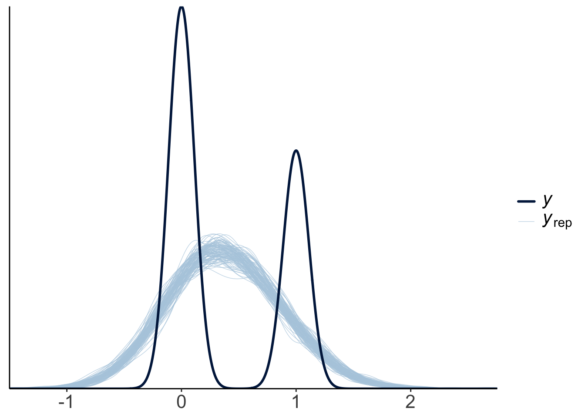

# Bayesian data analysis 2

## Learning goals

- Building Bayesian models with `brms`.
	- Model evaluation: 
		- Visualizing and interpreting results. 
		- Testing hypotheses. 
	- Inference evaluation: Did things work out? 

## Load packages and set plotting theme


```r
library("knitr")       # for knitting RMarkdown 
library("kableExtra")  # for making nice tables
library("janitor")     # for cleaning column names
library("tidybayes")   # tidying up results from Bayesian models
library("brms")        # Bayesian regression models with Stan
library("patchwork")   # for making figure panels
library("GGally")      # for pairs plot
library("broom.mixed") # for tidy lmer results
library("bayesplot")   # for visualization of Bayesian model fits 
library("modelr")      # for modeling functions
library("lme4")        # for linear mixed effects models 
library("afex")        # for ANOVAs
library("car")         # for ANOVAs
library("emmeans")     # for linear contrasts
library("ggeffects")   # for help with logistic regressions
library("titanic")     # titanic dataset
library("gganimate")   # for animations
library("parameters")  # for getting parameters
library("transformr")  # for gganimate
# install via: devtools::install_github("thomasp85/transformr")
library("tidyverse")   # for wrangling, plotting, etc. 
```


```r
theme_set(theme_classic() + # set the theme 
            theme(text = element_text(size = 20))) # set the default text size

opts_chunk$set(comment = "",
               fig.show = "hold")

options(dplyr.summarise.inform = F)

# set default color scheme in ggplot 
options(ggplot2.discrete.color = RColorBrewer::brewer.pal(9,"Set1"))
```

## Load data sets


```r
# poker 
df.poker = read_csv("data/poker.csv") %>% 
  mutate(skill = factor(skill,
                        levels = 1:2,
                        labels = c("expert", "average")),
         skill = fct_relevel(skill, "average", "expert"),
         hand = factor(hand,
                       levels = 1:3,
                       labels = c("bad", "neutral", "good")),
         limit = factor(limit,
                        levels = 1:2,
                        labels = c("fixed", "none")),
         participant = 1:n()) %>% 
  select(participant, everything())

# sleep
df.sleep = sleepstudy %>% 
  as_tibble() %>% 
  clean_names() %>% 
  mutate(subject = as.character(subject)) %>% 
  select(subject, days, reaction) %>% 
  bind_rows(tibble(subject = "374",
                   days = 0:1,
                   reaction = c(286, 288)),
            tibble(subject = "373",
                   days = 0,
                   reaction = 245))

# titanic 
df.titanic = titanic_train %>% 
  clean_names() %>% 
  mutate(sex = as.factor(sex))

# politeness
df.politeness = read_csv("data/politeness_data.csv") %>% 
  rename(pitch = frequency)
```

## Poker

### 1. Visualize the data

Let's visualize the data first. 


```r
set.seed(1)

df.poker %>% 
  ggplot(mapping = aes(x = hand,
                       y = balance,
                       fill = hand,
                       group = skill,
                       shape = skill)) + 
  geom_point(alpha = 0.2,
             position = position_jitterdodge(dodge.width = 0.5,
                                             jitter.height = 0, 
                                             jitter.width = 0.2)) + 
  stat_summary(fun.data = "mean_cl_boot",
               position = position_dodge(width = 0.5),
               size = 1) + 
  labs(y = "final balance (in Euros)") + 
  scale_shape_manual(values = c(21, 22)) + 
  guides(fill = guide_legend(override.aes = list(shape = 21,
                                                 fill = RColorBrewer::brewer.pal(3, "Set1"))),
         shape = guide_legend(override.aes = list(alpha = 1, fill = "black")))
```


### 2. Specify and fit the model

#### Frequentist model

And let's now fit a simple (frequentist) ANOVA model. You have multiple options to do so: 


```r
# Option 1: Using the "afex" package
aov_ez(id = "participant",
       dv = "balance",
       between = c("hand", "skill"),
       data = df.poker)
```

```
Contrasts set to contr.sum for the following variables: hand, skill
```

```
Anova Table (Type 3 tests)

Response: balance
      Effect     df   MSE         F  ges p.value
1       hand 2, 294 16.16 79.17 *** .350   <.001
2      skill 1, 294 16.16      2.43 .008    .120
3 hand:skill 2, 294 16.16  7.08 *** .046   <.001
---
Signif. codes:  0 '***' 0.001 '**' 0.01 '*' 0.05 '+' 0.1 ' ' 1
```

```r
# Option 2: Using the car package (here we have to remember to set the contrasts to sum
# contrasts!)
lm(balance ~ hand * skill,
   contrasts = list(hand = "contr.sum",
                    skill = "contr.sum"),
   data = df.poker) %>% 
  car::Anova(type = 3)
```

```
Anova Table (Type III tests)

Response: balance
             Sum Sq  Df   F value    Pr(>F)    
(Intercept) 28644.7   1 1772.1137 < 2.2e-16 ***
hand         2559.4   2   79.1692 < 2.2e-16 ***
skill          39.3   1    2.4344 0.1197776    
hand:skill    229.0   2    7.0830 0.0009901 ***
Residuals    4752.3 294                        
---
Signif. codes:  0 '***' 0.001 '**' 0.01 '*' 0.05 '.' 0.1 ' ' 1
```

```r
# Option 3: Using the emmeans package (I like this one the best! It let's us use the 
# general lm() syntax and we don't have to remember to set the contrast)
fit.lm_poker = lm(balance ~ hand * skill,
                  data = df.poker) 

fit.lm_poker %>% 
  joint_tests()
```

```
 model term df1 df2 F.ratio p.value
 hand         2 294  79.169  <.0001
 skill        1 294   2.434  0.1198
 hand:skill   2 294   7.083  0.0010
```

All three options give the same result. Personally, I like Option 3 the best. 

#### Bayesian model

Now, let's fit a Bayesian regression model using the `brm()` function (starting with a simple model that only considers `hand` as a predictor):


```r
fit.brm_poker = brm(formula = balance ~ 1 + hand,
                    data = df.poker,
                    seed = 1, 
                    file = "cache/brm_poker")

# we'll use this model here later 
fit.brm_poker2 = brm(formula = balance ~ 1 + hand * skill,
                    data = df.poker,
                    seed = 1, 
                    file = "cache/brm_poker2")

fit.brm_poker %>%
  summary()
```

```
 Family: gaussian 
  Links: mu = identity; sigma = identity 
Formula: balance ~ 1 + hand 
   Data: df.poker (Number of observations: 300) 
  Draws: 4 chains, each with iter = 2000; warmup = 1000; thin = 1;
         total post-warmup draws = 4000

Population-Level Effects: 
            Estimate Est.Error l-95% CI u-95% CI Rhat Bulk_ESS Tail_ESS
Intercept       5.94      0.42     5.11     6.76 1.00     3434     2747
handneutral     4.41      0.60     3.22     5.60 1.00     3669     2860
handgood        7.09      0.61     5.91     8.27 1.00     3267     2841

Family Specific Parameters: 
      Estimate Est.Error l-95% CI u-95% CI Rhat Bulk_ESS Tail_ESS
sigma     4.12      0.17     3.82     4.48 1.00     3378     3010

Draws were sampled using sampling(NUTS). For each parameter, Bulk_ESS
and Tail_ESS are effective sample size measures, and Rhat is the potential
scale reduction factor on split chains (at convergence, Rhat = 1).
```

I use the `file = ` argument to save the model's results so that when I run this code chunk again, the model doesn't need to be fit again (fitting Bayesian models takes a while ...). And I used the `seed = ` argument to make this example reproducible. 

##### Full specification

So far, we have used the defaults that `brm()` comes with and not bothered about specifiying the priors, etc. 

Notice that we didn't specify any priors in the model. By default, "brms" assigns weakly informative priors to the parameters in the model. We can see what these are by running the following command: 


```r
fit.brm_poker %>% 
  prior_summary()
```

```
                  prior     class        coef group resp dpar nlpar lb ub
                 (flat)         b                                        
                 (flat)         b    handgood                            
                 (flat)         b handneutral                            
 student_t(3, 9.5, 5.6) Intercept                                        
   student_t(3, 0, 5.6)     sigma                                    0   
       source
      default
 (vectorized)
 (vectorized)
      default
      default
```

We can also get information about which priors need to be specified before fitting a model:


```r
get_prior(formula = balance ~ 1 + hand,
          family = "gaussian",
          data = df.poker)
```

```
                  prior     class        coef group resp dpar nlpar lb ub
                 (flat)         b                                        
                 (flat)         b    handgood                            
                 (flat)         b handneutral                            
 student_t(3, 9.5, 5.6) Intercept                                        
   student_t(3, 0, 5.6)     sigma                                    0   
       source
      default
 (vectorized)
 (vectorized)
      default
      default
```

Here is an example for what a more complete model specification could look like: 


```r
fit.brm_poker_full = brm(formula = balance ~ 1 + hand,
                         family = "gaussian",
                         data = df.poker,
                         prior = c(prior(normal(0, 10),
                                         class = "b",
                                         coef = "handgood"),
                                   prior(normal(0, 10),
                                         class = "b",
                                         coef = "handneutral"),
                                   prior(student_t(3, 3, 10),
                                         class = "Intercept"),
                                   prior(student_t(3, 0, 10),
                                         class = "sigma")),
                         inits = list(list(Intercept = 0,
                                           sigma = 1,
                                           handgood = 5,
                                           handneutral = 5),
                                      list(Intercept = -5,
                                           sigma = 3,
                                           handgood = 2,
                                           handneutral = 2),
                                      list(Intercept = 2,
                                           sigma = 1,
                                           handgood = -1,
                                           handneutral = 1),
                                      list(Intercept = 1,
                                           sigma = 2,
                                           handgood = 2,
                                           handneutral = -2)),
                         iter = 4000,
                         warmup = 1000,
                         chains = 4,
                         file = "cache/brm_poker_full",
                         seed = 1)

fit.brm_poker_full %>%
  summary()
```

```
 Family: gaussian 
  Links: mu = identity; sigma = identity 
Formula: balance ~ 1 + hand 
   Data: df.poker (Number of observations: 300) 
  Draws: 4 chains, each with iter = 4000; warmup = 1000; thin = 1;
         total post-warmup draws = 12000

Population-Level Effects: 
            Estimate Est.Error l-95% CI u-95% CI Rhat Bulk_ESS Tail_ESS
Intercept       5.96      0.41     5.15     6.76 1.00    10533     8949
handneutral     4.39      0.58     3.26     5.52 1.00    11458     9173
handgood        7.06      0.58     5.91     8.20 1.00    10754     8753

Family Specific Parameters: 
      Estimate Est.Error l-95% CI u-95% CI Rhat Bulk_ESS Tail_ESS
sigma     4.13      0.17     3.81     4.48 1.00    11877     8882

Draws were sampled using sampling(NUTS). For each parameter, Bulk_ESS
and Tail_ESS are effective sample size measures, and Rhat is the potential
scale reduction factor on split chains (at convergence, Rhat = 1).
```

We can also take a look at the Stan code that the `brm()` function creates: 


```r
fit.brm_poker_full %>%
  stancode()
```

```
// generated with brms 2.20.4
functions {
}
data {
  int<lower=1> N;  // total number of observations
  vector[N] Y;  // response variable
  int<lower=1> K;  // number of population-level effects
  matrix[N, K] X;  // population-level design matrix
  int<lower=1> Kc;  // number of population-level effects after centering
  int prior_only;  // should the likelihood be ignored?
}
transformed data {
  matrix[N, Kc] Xc;  // centered version of X without an intercept
  vector[Kc] means_X;  // column means of X before centering
  for (i in 2:K) {
    means_X[i - 1] = mean(X[, i]);
    Xc[, i - 1] = X[, i] - means_X[i - 1];
  }
}
parameters {
  vector[Kc] b;  // regression coefficients
  real Intercept;  // temporary intercept for centered predictors
  real<lower=0> sigma;  // dispersion parameter
}
transformed parameters {
  real lprior = 0;  // prior contributions to the log posterior
  lprior += normal_lpdf(b[1] | 0, 10);
  lprior += normal_lpdf(b[2] | 0, 10);
  lprior += student_t_lpdf(Intercept | 3, 3, 10);
  lprior += student_t_lpdf(sigma | 3, 0, 10)
    - 1 * student_t_lccdf(0 | 3, 0, 10);
}
model {
  // likelihood including constants
  if (!prior_only) {
    target += normal_id_glm_lpdf(Y | Xc, Intercept, b, sigma);
  }
  // priors including constants
  target += lprior;
}
generated quantities {
  // actual population-level intercept
  real b_Intercept = Intercept - dot_product(means_X, b);
}
```

One thing worth noticing: by default, "brms" centers the predictors which makes it easier to assign a default prior over the intercept. 

### 3. Model evaluation

#### a) Did the inference work?

So far, we've assumed that the inference has worked out. We can check this by running `plot()` on our brm object:  


```r
plot(fit.brm_poker,
     N = 7,
     ask = F)
```


The posterior distributions (left hand side), and the trace plots of the samples from the posterior (right hand side) look good. 

Let's make our own version of a trace plot for one parameter in the model:


```r
fit.brm_poker %>% 
  spread_draws(b_Intercept) %>% 
  clean_names() %>% 
  mutate(chain = as.factor(chain)) %>% 
  ggplot(aes(x = iteration,
             y = b_intercept,
             group = chain,
             color = chain)) + 
  geom_line() + 
  scale_color_brewer(type = "seq",
                     direction = -1)
```


We can also take a look at the auto-correlation plot. Ideally, we want to generate independent samples from the posterior. So we don't want subsequent samples to be strongly correlated with each other. Let's take a look: 


```r
variables = fit.brm_poker %>%
  get_variables() %>%
  .[1:4]

fit.brm_poker %>% 
  as_draws() %>% 
  mcmc_acf(pars = variables,
           lags = 4)
```

```
Warning: The `facets` argument of `facet_grid()` is deprecated as of ggplot2 2.2.0.
ℹ Please use the `rows` argument instead.
ℹ The deprecated feature was likely used in the bayesplot package.
  Please report the issue at <https://github.com/stan-dev/bayesplot/issues/>.
This warning is displayed once every 8 hours.
Call `lifecycle::last_lifecycle_warnings()` to see where this warning was generated.
```


Looking good! The autocorrelation should become very small as the lag increases (indicating that we are getting independent samples from the posterior). 

###### When things go wrong

Let's try to fit a model to very little data (just two observations) with extremely uninformative priors: 


```r
df.data = tibble(y = c(-1, 1))

fit.brm_wrong = brm(data = df.data,
                    family = gaussian,
                    formula = y ~ 1,
                    prior = c(prior(uniform(-1e10, 1e10), class = Intercept),
                              prior(uniform(0, 1e10), class = sigma)),
                    inits = list(list(Intercept = 0, sigma = 1),
                                 list(Intercept = 0, sigma = 1)),
                    iter = 4000,
                    warmup = 1000,
                    chains = 2,
                    file = "cache/brm_wrong")
```

Let's take a look at the posterior distributions of the model parameters: 


```r
summary(fit.brm_wrong)
```

```
Warning: There were 1396 divergent transitions after warmup. Increasing
adapt_delta above 0.8 may help. See
http://mc-stan.org/misc/warnings.html#divergent-transitions-after-warmup
```

```
 Family: gaussian 
  Links: mu = identity; sigma = identity 
Formula: y ~ 1 
   Data: df.data (Number of observations: 2) 
  Draws: 2 chains, each with iter = 4000; warmup = 1000; thin = 1;
         total post-warmup draws = 6000

Population-Level Effects: 
              Estimate    Est.Error      l-95% CI      u-95% CI Rhat Bulk_ESS
Intercept 228357056.15 984976734.30 -616012010.65 4388257793.68 1.04       45
          Tail_ESS
Intercept       59

Family Specific Parameters: 
          Estimate     Est.Error  l-95% CI      u-95% CI Rhat Bulk_ESS Tail_ESS
sigma 812525872.95 1745959463.85 282591.91 6739518200.93 1.04       44       63

Draws were sampled using sampling(NUTS). For each parameter, Bulk_ESS
and Tail_ESS are effective sample size measures, and Rhat is the potential
scale reduction factor on split chains (at convergence, Rhat = 1).
```

Not looking good -- The estimates and credible intervals are off the charts. And the effective samples sizes in the chains are very small. 

Let's visualize the trace plots:


```r
plot(fit.brm_wrong,
     N = 2, 
     ask = F)
```


```r
fit.brm_wrong %>% 
  spread_draws(b_Intercept) %>% 
  clean_names() %>% 
  mutate(chain = as.factor(chain)) %>% 
  ggplot(aes(x = iteration,
             y = b_intercept,
             group = chain,
             color = chain)) + 
  geom_line() + 
  scale_color_brewer(direction = -1)
```


Given that we have so little data in this case, we need to help the model a little bit by providing some slighlty more specific priors. 


```r
fit.brm_right = brm(data = df.data,
                    family = gaussian,
                    formula = y ~ 1,
                    prior = c(prior(normal(0, 10), class = Intercept), # more reasonable priors
                              prior(cauchy(0, 1), class = sigma)),
                    iter = 4000,
                    warmup = 1000,
                    chains = 2,
                    seed = 1,
                    file = "cache/brm_right")
```

Let's take a look at the posterior distributions of the model parameters: 


```r
summary(fit.brm_right)
```

```
 Family: gaussian 
  Links: mu = identity; sigma = identity 
Formula: y ~ 1 
   Data: df.data (Number of observations: 2) 
  Draws: 2 chains, each with iter = 4000; warmup = 1000; thin = 1;
         total post-warmup draws = 6000

Population-Level Effects: 
          Estimate Est.Error l-95% CI u-95% CI Rhat Bulk_ESS Tail_ESS
Intercept    -0.05      1.55    -3.35     3.11 1.00     1730     1300

Family Specific Parameters: 
      Estimate Est.Error l-95% CI u-95% CI Rhat Bulk_ESS Tail_ESS
sigma     2.01      1.84     0.62     6.81 1.00     1206     1568

Draws were sampled using sampling(NUTS). For each parameter, Bulk_ESS
and Tail_ESS are effective sample size measures, and Rhat is the potential
scale reduction factor on split chains (at convergence, Rhat = 1).
```

This looks much better. There is still quite a bit of uncertainty in our paremeter estimates, but it has reduced dramatically. 

Let's visualize the trace plots:


```r
plot(fit.brm_right,
     N = 2, 
     ask = F)
```


```r
fit.brm_right %>% 
  spread_draws(b_Intercept, sigma) %>% 
  clean_names() %>% 
  mutate(chain = as.factor(chain)) %>% 
  pivot_longer(cols = c(b_intercept, sigma)) %>% 
  ggplot(aes(x = iteration,
             y = value,
             group = chain,
             color = chain)) + 
  geom_line() + 
  facet_wrap(vars(name), ncol = 1) + 
  scale_color_brewer(direction = -1)
```


Looking mostly good!

#### b) Visualize model predictions

##### Posterior predictive check

To check whether the model did a good job capturing the data, we can simulate what future data the Bayesian model predicts, now that it has learned from the data we feed into it.  


```r
pp_check(fit.brm_poker, ndraws = 100)
```


This looks good! The predicted shaped of the data based on samples from the posterior distribution looks very similar to the shape of the actual data.  

Let's make a hypothetical outcome plot that shows what concrete data sets the model would predict.  The `add_predicted_draws()` function from the "tidybayes" package is helpful for generating predictions from the posterior.


```r
df.predictive_samples = df.poker %>% 
  add_predicted_draws(newdata = .,
                      object = fit.brm_poker2,
                      ndraws = 10)

p = ggplot(data = df.predictive_samples,
           mapping = aes(x = hand,
                         y = .prediction,
                         fill = hand,
                         group = skill,
                         shape = skill)) + 
  geom_point(alpha = 0.2,
             position = position_jitterdodge(dodge.width = 0.5,
                                             jitter.height = 0, 
                                             jitter.width = 0.2)) + 
  stat_summary(fun.data = "mean_cl_boot",
               position = position_dodge(width = 0.5),
               size = 1) + 
  labs(y = "final balance (in Euros)") + 
  scale_shape_manual(values = c(21, 22)) + 
  guides(fill = guide_legend(override.aes = list(shape = 21)),
         shape = guide_legend(override.aes = list(alpha = 1, fill = "black"))) + 
  transition_manual(.draw)

animate(p, nframes = 120, width = 800, height = 600, res = 96, type = "cairo")
```

```
Warning: No renderer available. Please install the gifski, av, or magick
package to create animated output
```

##### Prior predictive check


```r
fit.brm_poker_prior = brm(formula = balance ~ 0 + Intercept + hand * skill,
                          family = "gaussian",
                          data = df.poker,
                          prior = c(prior(normal(0, 10), class = "b"),
                                    prior(student_t(3, 0, 10), class = "sigma")),
                          iter = 4000,
                          warmup = 1000,
                          chains = 4,
                          file = "cache/brm_poker_prior",
                          sample_prior = "only",
                          seed = 1)

# generate prior samples 
df.prior_samples = df.poker %>% 
  add_predicted_draws(newdata = .,
                      object = fit.brm_poker_prior,
                      ndraws = 10)

# plot the results as an animation
p = ggplot(data = df.prior_samples,
           mapping = aes(x = hand,
                         y = .prediction,
                         fill = hand,
                         group = skill,
                         shape = skill)) + 
  geom_point(alpha = 0.2,
             position = position_jitterdodge(dodge.width = 0.5,
                                             jitter.height = 0, 
                                             jitter.width = 0.2)) + 
  stat_summary(fun.data = "mean_cl_boot",
               position = position_dodge(width = 0.5),
               size = 1) + 
  labs(y = "final balance (in Euros)") + 
  scale_shape_manual(values = c(21, 22)) + 
  guides(fill = guide_legend(override.aes = list(shape = 21,
                                                 fill = RColorBrewer::brewer.pal(3, "Set1"))),
         shape = guide_legend(override.aes = list(alpha = 1, fill = "black"))) + 
  transition_manual(.draw)

animate(p, nframes = 120, width = 800, height = 600, res = 96, type = "cairo")
```

```
Warning: No renderer available. Please install the gifski, av, or magick
package to create animated output
```

```r
# anim_save("poker_prior_predictive.gif")
```


### 4. Interpret the model parameters

#### Visualize the posteriors

Let's visualize what the posterior for the different parameters looks like. We use the `stat_halfeye()` function from the "tidybayes" package to do so: 


```r
fit.brm_poker %>% 
  as_draws_df() %>%
  select(starts_with("b_"), sigma) %>%
  pivot_longer(cols = everything(),
               names_to = "variable",
               values_to = "value") %>% 
  ggplot(data = .,
         mapping = aes(y = fct_rev(variable),
                       x = value)) +
  stat_halfeye(fill = "lightblue") + 
  theme(axis.title.y = element_blank())
```


#### Compute highest density intervals

To compute the MAP (maximum a posteriori probability) estimate and highest density interval, we use the `mean_hdi()` function that comes with the "tidybayes" package.


```r
fit.brm_poker %>% 
  as_draws_df() %>%
  select(starts_with("b_"), sigma) %>% 
  mean_hdi() %>% 
  pivot_longer(cols = -c(.width:.interval),
               names_to = "index",
               values_to = "value") %>% 
  select(index, value) %>% 
  mutate(index = ifelse(str_detect(index, fixed(".")), index, str_c(index, ".mean"))) %>% 
  separate(index, into = c("parameter", "type"), sep = "\\.") %>% 
  pivot_wider(names_from = type, 
              values_from = value)
```

```
# A tibble: 4 × 4
  parameter      mean lower upper
  <chr>         <dbl> <dbl> <dbl>
1 b_Intercept    5.94  5.10  6.75
2 b_handneutral  4.41  3.21  5.58
3 b_handgood     7.09  5.92  8.27
4 sigma          4.12  3.80  4.46
```

### 5. Test specific hypotheses

#### with `hypothesis()`

One key advantage of Bayesian over frequentist analysis is that we can test hypothesis in a very flexible manner by directly probing our posterior samples in different ways. 

We may ask, for example, what the probability is that the parameter for the difference between a bad hand and a neutral hand (`b_handneutral`) is greater than 0. Let's plot the posterior distribution together with the criterion: 


```r
fit.brm_poker %>% 
  as_draws_df() %>% 
  select(b_handneutral) %>% 
  pivot_longer(cols = everything(),
               names_to = "variable",
               values_to = "value") %>% 
  ggplot(data = .,
         mapping = aes(y = variable, x = value)) +
  stat_halfeye(fill = "lightblue") + 
  geom_vline(xintercept = 0,
             color = "red")
```


We see that the posterior is definitely greater than 0. 

We can ask many different kinds of questions about the data by doing basic arithmetic on our posterior samples. The `hypothesis()` function makes this even easier. Here are some examples: 


```r
# the probability that the posterior for handneutral is less than 0
hypothesis(fit.brm_poker,
           hypothesis = "handneutral < 0")
```

```
Hypothesis Tests for class b:
         Hypothesis Estimate Est.Error CI.Lower CI.Upper Evid.Ratio Post.Prob
1 (handneutral) < 0     4.41       0.6      3.4     5.37          0         0
  Star
1     
---
'CI': 90%-CI for one-sided and 95%-CI for two-sided hypotheses.
'*': For one-sided hypotheses, the posterior probability exceeds 95%;
for two-sided hypotheses, the value tested against lies outside the 95%-CI.
Posterior probabilities of point hypotheses assume equal prior probabilities.
```


```r
# the probability that the posterior for handneutral is greater than 4
hypothesis(fit.brm_poker,
           hypothesis = "handneutral > 4") %>% 
  plot()
```


```r
# the probability that good hands make twice as much as bad hands
hypothesis(fit.brm_poker,
           hypothesis = "Intercept + handgood > 2 * Intercept")
```

```
Hypothesis Tests for class b:
                Hypothesis Estimate Est.Error CI.Lower CI.Upper Evid.Ratio
1 (Intercept+handgo... > 0     1.15      0.96     -0.4     2.73       7.93
  Post.Prob Star
1      0.89     
---
'CI': 90%-CI for one-sided and 95%-CI for two-sided hypotheses.
'*': For one-sided hypotheses, the posterior probability exceeds 95%;
for two-sided hypotheses, the value tested against lies outside the 95%-CI.
Posterior probabilities of point hypotheses assume equal prior probabilities.
```

We can also make a plot of what the posterior distribution of the hypothesis looks like: 


```r
hypothesis(fit.brm_poker,
           hypothesis = "Intercept + handgood > 2 * Intercept") %>% 
  plot()
```


```r
# the probability that neutral hands make less than the average of bad and good hands
hypothesis(fit.brm_poker,
           hypothesis = "Intercept + handneutral < (Intercept + Intercept + handgood) / 2")
```

```
Hypothesis Tests for class b:
                Hypothesis Estimate Est.Error CI.Lower CI.Upper Evid.Ratio
1 (Intercept+handne... < 0     0.86      0.52     0.01     1.72       0.05
  Post.Prob Star
1      0.05     
---
'CI': 90%-CI for one-sided and 95%-CI for two-sided hypotheses.
'*': For one-sided hypotheses, the posterior probability exceeds 95%;
for two-sided hypotheses, the value tested against lies outside the 95%-CI.
Posterior probabilities of point hypotheses assume equal prior probabilities.
```

Let's double check one example, and calculate the result directly based on the posterior samples: 


```r
df.hypothesis = fit.brm_poker %>% 
  as_draws_df() %>% 
  clean_names() %>% 
  select(starts_with("b_")) %>% 
  mutate(neutral = b_intercept + b_handneutral,
         bad_good_average = (b_intercept + b_intercept + b_handgood)/2,
         hypothesis = neutral < bad_good_average)
```

```
Warning: Dropping 'draws_df' class as required metadata was removed.
```

```r
df.hypothesis %>% 
  summarize(p = sum(hypothesis)/n())
```

```
# A tibble: 1 × 1
       p
   <dbl>
1 0.0485
```

#### with `emmeans()`

We can also use the `emmeans()` function to compute contrasts. 


```r
fit.brm_poker %>% 
  emmeans(specs = consec ~ hand)
```

```
Loading required namespace: rstanarm
```

```
$emmeans
 hand    emmean lower.HPD upper.HPD
 bad       5.94      5.10      6.74
 neutral  10.34      9.58     11.24
 good     13.03     12.19     13.87

Point estimate displayed: median 
HPD interval probability: 0.95 

$contrasts
 contrast       estimate lower.HPD upper.HPD
 neutral - bad      4.41      3.21      5.58
 good - neutral     2.67      1.56      3.92

Point estimate displayed: median 
HPD interval probability: 0.95 
```

Here, it computed the estimated means for each group for us, as well as the consecutive contrasts between each group. 

Let's visualize the contrasts. First, let's just use the `plot()` function as it's been adapted by the emmeans package: 


```r
fit.brm_poker %>% 
  emmeans(specs = consec ~ hand) %>% 
  pluck("contrasts") %>% 
  plot()
```


To get full posterior distributions instead of summaries, we can use the "tidybayes" package like so: 


```r
fit.brm_poker %>% 
  emmeans(specs = consec ~ hand) %>% 
  pluck("contrasts") %>% 
  gather_emmeans_draws() %>% 
  ggplot(mapping = aes(y = contrast,
                       x = .value)) + 
  stat_halfeye(fill = "lightblue",
               point_interval = mean_hdi,
               .width = c(0.5, 0.75, 0.95))
```


To see whether neutral hands did differently from bad and good hands (combined), we can define the following contrast.


```r
contrasts = list(neutral_vs_rest = c(-1, 2, -1))

fit.brm_poker %>% 
  emmeans(specs = "hand",
          contr = contrasts) %>% 
  pluck("contrasts") %>% 
  gather_emmeans_draws() %>% 
  mean_hdi()
```

```
# A tibble: 1 × 7
  contrast        .value .lower .upper .width .point .interval
  <chr>            <dbl>  <dbl>  <dbl>  <dbl> <chr>  <chr>    
1 neutral_vs_rest   1.72 -0.247   3.82   0.95 mean   hdi      
```

Here, the HDP does not exclude 0. 

Let's double check that we get the same result using the `hypothesis()` function, or by directly computing from the posterior samples. 


```r
# using hypothesis()
fit.brm_poker %>% 
  hypothesis("(Intercept + handneutral)*2 < (Intercept + Intercept + handgood)")
```

```
Hypothesis Tests for class b:
                Hypothesis Estimate Est.Error CI.Lower CI.Upper Evid.Ratio
1 ((Intercept+handn... < 0     1.72      1.03     0.01     3.43       0.05
  Post.Prob Star
1      0.05     
---
'CI': 90%-CI for one-sided and 95%-CI for two-sided hypotheses.
'*': For one-sided hypotheses, the posterior probability exceeds 95%;
for two-sided hypotheses, the value tested against lies outside the 95%-CI.
Posterior probabilities of point hypotheses assume equal prior probabilities.
```

```r
# directly computing from the posterior
fit.brm_poker %>% 
  as_draws_df() %>% 
  clean_names() %>% 
  mutate(contrast = (b_intercept + b_handneutral) * 2 - (b_intercept + b_intercept + b_handgood)) %>% 
  summarize(contrast = mean(contrast))
```

```
# A tibble: 1 × 1
  contrast
     <dbl>
1     1.72
```

The `emmeans()` function becomes particularly useful when our model has several categorical predictors, and we are interested in comparing differences along one predictor while marginalizing over the values of the other predictor. 

Let's take a look for a model that considers both `skill` and `hand` as predictors (as well as the interaction). 


```r
fit.brm_poker2 = brm(formula = balance ~ hand * skill,
                     data = df.poker,
                     seed = 1, 
                     file = "cache/brm_poker2")

fit.brm_poker2 %>% 
  summary()
```

```
 Family: gaussian 
  Links: mu = identity; sigma = identity 
Formula: balance ~ 1 + hand * skill 
   Data: df.poker (Number of observations: 300) 
  Draws: 4 chains, each with iter = 2000; warmup = 1000; thin = 1;
         total post-warmup draws = 4000

Population-Level Effects: 
                        Estimate Est.Error l-95% CI u-95% CI Rhat Bulk_ESS
Intercept                   4.58      0.56     3.48     5.69 1.00     2402
handneutral                 5.26      0.79     3.72     6.86 1.00     2617
handgood                    9.23      0.80     7.65    10.77 1.00     2251
skillexpert                 2.73      0.78     1.17     4.25 1.00     2125
handneutral:skillexpert    -1.71      1.11    -3.84     0.46 1.00     2238
handgood:skillexpert       -4.28      1.12    -6.43    -2.05 1.00     2024
                        Tail_ESS
Intercept                   2615
handneutral                 2925
handgood                    2504
skillexpert                 2476
handneutral:skillexpert     3040
handgood:skillexpert        2295

Family Specific Parameters: 
      Estimate Est.Error l-95% CI u-95% CI Rhat Bulk_ESS Tail_ESS
sigma     4.03      0.17     3.72     4.38 1.00     3369     2728

Draws were sampled using sampling(NUTS). For each parameter, Bulk_ESS
and Tail_ESS are effective sample size measures, and Rhat is the potential
scale reduction factor on split chains (at convergence, Rhat = 1).
```

In the summary table above, `skillexpert` captures the difference between an expert and an average player **when they have a bad hand**. To see whether there was a difference in expertise overall (i.e. across all three kinds of hands), we can calculate a linear contrast. 


```r
fit.brm_poker2 %>% 
  emmeans(pairwise ~ skill)
```

```
NOTE: Results may be misleading due to involvement in interactions
```

```
$emmeans
 skill   emmean lower.HPD upper.HPD
 average   9.41      8.77      10.0
 expert   10.14      9.48      10.8

Results are averaged over the levels of: hand 
Point estimate displayed: median 
HPD interval probability: 0.95 

$contrasts
 contrast         estimate lower.HPD upper.HPD
 average - expert   -0.722     -1.68    0.0885

Results are averaged over the levels of: hand 
Point estimate displayed: median 
HPD interval probability: 0.95 
```

It looks like overall, skilled players weren't doing much better than average players. 

We can even do something like an equivalent of an ANOVA using `emmeans()`, like so: 


```r
joint_tests(fit.brm_poker2)
```

```
 model term df1 df2 F.ratio   Chisq p.value
 hand         2 Inf  82.446 164.892  <.0001
 skill        1 Inf   2.549   2.549  0.1103
 hand:skill   2 Inf   7.347  14.694  0.0006
```

The values we get here are very similar to what we would get from a frequentist ANOVA: 


```r
aov_ez(id = "participant",
       dv = "balance",
       between = c("hand", "skill"),
       data = df.poker)
```

```
Contrasts set to contr.sum for the following variables: hand, skill
```

```
Anova Table (Type 3 tests)

Response: balance
      Effect     df   MSE         F  ges p.value
1       hand 2, 294 16.16 79.17 *** .350   <.001
2      skill 1, 294 16.16      2.43 .008    .120
3 hand:skill 2, 294 16.16  7.08 *** .046   <.001
---
Signif. codes:  0 '***' 0.001 '**' 0.01 '*' 0.05 '+' 0.1 ' ' 1
```

#### Bayes factor

Another way of testing hypothesis is via the Bayes factor. Let's fit the two models we are interested in comparing with each other: 


```r
fit.brm_poker_bf1 = brm(formula = balance ~ 1 + hand,
                        data = df.poker,
                        save_pars = save_pars(all = T),
                        file = "cache/brm_poker_bf1")

fit.brm_poker_bf2 = brm(formula = balance ~ 1 + hand + skill,
                        data = df.poker,
                        save_pars = save_pars(all = T),
                        file = "cache/brm_poker_bf2")
```

And then compare the models using the `bayes_factor()` function: 


```r
bayes_factor(fit.brm_poker_bf2, fit.brm_poker_bf1)
```

```
Iteration: 1
Iteration: 2
Iteration: 3
Iteration: 4
Iteration: 5
Iteration: 1
Iteration: 2
Iteration: 3
Iteration: 4
Iteration: 5
```

```
Estimated Bayes factor in favor of fit.brm_poker_bf2 over fit.brm_poker_bf1: 3.82034
```

Bayes factors don't have a very good reputation (see here and here). Instead, the way to go these days appears to be via approximate leave one out cross-validation. 

#### Approximate leave one out cross-validation


```r
fit.brm_poker_bf1 = add_criterion(fit.brm_poker_bf1,
                                  criterion = "loo",
                                  reloo = T,
                                  file = "cache/brm_poker_bf1")

fit.brm_poker_bf2 = add_criterion(fit.brm_poker_bf2,
                                  criterion = "loo",
                                  reloo = T,
                                  file = "cache/brm_poker_bf2")

loo_compare(fit.brm_poker_bf1,
            fit.brm_poker_bf2)
```

```
                  elpd_diff se_diff
fit.brm_poker_bf2  0.0       0.0   
fit.brm_poker_bf1 -0.3       1.5   
```


## Sleep study

### 1. Visualize the data


```r
set.seed(1)

ggplot(data = df.sleep %>% 
         mutate(days = as.factor(days)),
       mapping = aes(x = days,
                     y = reaction)) + 
  geom_point(alpha = 0.2,
             position = position_jitter(width = 0.1)) + 
  stat_summary(fun.data = "mean_cl_boot") 
```


### 2. Specify and fit the model

#### Frequentist analysis


```r
fit.lmer_sleep = lmer(formula = reaction ~ 1 + days + (1 + days | subject),
                      data = df.sleep)

fit.lmer_sleep %>% 
  summary()
```

```
Linear mixed model fit by REML. t-tests use Satterthwaite's method [
lmerModLmerTest]
Formula: reaction ~ 1 + days + (1 + days | subject)
   Data: df.sleep

REML criterion at convergence: 1771.4

Scaled residuals: 
    Min      1Q  Median      3Q     Max 
-3.9707 -0.4703  0.0276  0.4594  5.2009 

Random effects:
 Groups   Name        Variance Std.Dev. Corr
 subject  (Intercept) 582.72   24.140       
          days         35.03    5.919   0.07
 Residual             649.36   25.483       
Number of obs: 183, groups:  subject, 20

Fixed effects:
            Estimate Std. Error      df t value Pr(>|t|)    
(Intercept)  252.543      6.433  19.295  39.257  < 2e-16 ***
days          10.452      1.542  17.163   6.778 3.06e-06 ***
---
Signif. codes:  0 '***' 0.001 '**' 0.01 '*' 0.05 '.' 0.1 ' ' 1

Correlation of Fixed Effects:
     (Intr)
days -0.137
```


#### Bayesian analysis


```r
fit.brm_sleep = brm(formula = reaction ~ 1 + days + (1 + days | subject),
                    data = df.sleep,
                    seed = 1,
                    file = "cache/brm_sleep")
```

### 3. Model evaluation

#### a) Did the inference work?


```r
fit.brm_sleep %>% 
  summary()
```

```
 Family: gaussian 
  Links: mu = identity; sigma = identity 
Formula: reaction ~ 1 + days + (1 + days | subject) 
   Data: df.sleep (Number of observations: 183) 
  Draws: 4 chains, each with iter = 2000; warmup = 1000; thin = 1;
         total post-warmup draws = 4000

Group-Level Effects: 
~subject (Number of levels: 20) 
                    Estimate Est.Error l-95% CI u-95% CI Rhat Bulk_ESS Tail_ESS
sd(Intercept)          26.15      6.51    15.13    40.55 1.00     1511     2248
sd(days)                6.57      1.52     4.12     9.90 1.00     1419     2223
cor(Intercept,days)     0.09      0.29    -0.48     0.65 1.00      888     1670

Population-Level Effects: 
          Estimate Est.Error l-95% CI u-95% CI Rhat Bulk_ESS Tail_ESS
Intercept   252.18      6.95   238.65   265.96 1.00     1755     2235
days         10.47      1.75     7.07    14.00 1.00     1259     1608

Family Specific Parameters: 
      Estimate Est.Error l-95% CI u-95% CI Rhat Bulk_ESS Tail_ESS
sigma    25.82      1.54    22.96    29.05 1.00     3254     2958

Draws were sampled using sampling(NUTS). For each parameter, Bulk_ESS
and Tail_ESS are effective sample size measures, and Rhat is the potential
scale reduction factor on split chains (at convergence, Rhat = 1).
```

```r
fit.brm_sleep %>% 
  plot(N = 6)
```


#### b) Visualize model predictions


```r
pp_check(fit.brm_sleep,
         ndraws = 100)
```


### 4. Interpret the parameters


```r
fit.brm_sleep %>% 
  tidy(conf.method = "HPDinterval")
```

```
# A tibble: 6 × 8
  effect   component group    term         estimate std.error conf.low conf.high
  <chr>    <chr>     <chr>    <chr>           <dbl>     <dbl>    <dbl>     <dbl>
1 fixed    cond      <NA>     (Intercept)  252.         6.95   238.      266.   
2 fixed    cond      <NA>     days          10.5        1.75     6.82     13.6  
3 ran_pars cond      subject  sd__(Interc…  26.2        6.51    14.3      39.4  
4 ran_pars cond      subject  sd__days       6.57       1.52     4.00      9.67 
5 ran_pars cond      subject  cor__(Inter…   0.0909     0.293   -0.491     0.635
6 ran_pars cond      Residual sd__Observa…  25.8        1.54    22.7      28.7  
```

#### Summary of posterior distributions


```r
# all parameters
fit.brm_sleep %>% 
  as_draws_df() %>% 
  select(-c(lp__, contains("["))) %>%
  pivot_longer(cols = everything(),
               names_to = "variable",
               values_to = "value") %>% 
  ggplot(data = .,
         mapping = aes(x = value)) +
  stat_halfeye(point_interval = mode_hdi,
               fill = "lightblue") + 
  facet_wrap(~ variable,
             ncol = 2,
             scales = "free") +
  theme(text = element_text(size = 12))

# just the parameter of interest
fit.brm_sleep %>% 
  as_draws_df() %>% 
  select(b_days) %>%
  ggplot(data = .,
         mapping = aes(x = b_days)) +
  stat_halfeye(point_interval = mode_hdi,
               fill = "lightblue") + 
  theme(text = element_text(size = 12))
```


### 5. Test specific hypotheses

Here, we were just interested in how the number of days of sleep deprivation affected reaction time (and we can see that by inspecting the posterior for the `days` predictor in the model). 

### 6. Report results

#### Model prediction with posterior draws (aggregate)


```r
df.model = tibble(days = 0:9) %>% 
  add_linpred_draws(newdata = .,
                    object = fit.brm_sleep,
                    ndraws = 10,
                    seed = 1,
                    re_formula = NA)

ggplot(data = df.sleep,
       mapping = aes(x = days,
                     y = reaction)) + 
  geom_point(alpha = 0.2,
             position = position_jitter(width = 0.1)) + 
  geom_line(data = df.model,
            mapping = aes(y = .linpred,
                          group = .draw),
            color = "lightblue") +
  stat_summary(fun.data = "mean_cl_boot") +
  scale_x_continuous(breaks = 0:9)
```


#### Model prediction with credible intervals (aggregate)


```r
df.model = fit.brm_sleep %>% 
  fitted(re_formula = NA,
         newdata = tibble(days = 0:9)) %>% 
  as_tibble() %>% 
  mutate(days = 0:9) %>% 
  clean_names()
  
ggplot(data = df.sleep,
       mapping = aes(x = days,
                     y = reaction)) + 
  geom_point(alpha = 0.2,
             position = position_jitter(width = 0.1)) + 
  geom_ribbon(data = df.model,
              mapping = aes(y = estimate,
                            ymin = q2_5,
                            ymax = q97_5),
              fill = "lightblue",
              alpha = 0.5) +
  geom_line(data = df.model,
            mapping = aes(y = estimate),
            color = "lightblue",
            size = 1) +
  stat_summary(fun.data = "mean_cl_boot") +
  scale_x_continuous(breaks = 0:9)
```

```
Warning: Using `size` aesthetic for lines was deprecated in ggplot2 3.4.0.
ℹ Please use `linewidth` instead.
This warning is displayed once every 8 hours.
Call `lifecycle::last_lifecycle_warnings()` to see where this warning was generated.
```


#### Model prediction with credible intervals (individual participants)


```r
fit.brm_sleep %>% 
  fitted() %>% 
  as_tibble() %>% 
  clean_names() %>% 
  bind_cols(df.sleep) %>% 
  ggplot(data = .,
       mapping = aes(x = days,
                     y = reaction)) + 
  geom_ribbon(aes(ymin = q2_5,
                  ymax = q97_5),
              fill = "lightblue") +
  geom_line(aes(y = estimate),
            color = "blue") +
  geom_point() +
  facet_wrap(~subject, ncol = 5) +
  labs(x = "Days of sleep deprivation", 
       y = "Average reaction time (ms)") + 
  scale_x_continuous(breaks = 0:4 * 2) +
  theme(strip.text = element_text(size = 12),
        axis.text.y = element_text(size = 12))
```


#### Model prediction for random samples


```r
df.model = df.sleep %>% 
  complete(subject, days) %>% 
  add_linpred_draws(newdata = .,
                    object = fit.brm_sleep,
                    ndraws = 10,
                    seed = 1)

df.sleep %>% 
  ggplot(data = .,
         mapping = aes(x = days,
                       y = reaction)) + 
  geom_line(data = df.model,
            aes(y = .linpred,
                group = .draw),
            color = "lightblue",
            alpha = 0.5) + 
  geom_point() +
  facet_wrap(~subject, ncol = 5) +
  labs(x = "Days of sleep deprivation", 
       y = "Average reaction time (ms)") + 
  scale_x_continuous(breaks = 0:4 * 2) +
  theme(strip.text = element_text(size = 12),
        axis.text.y = element_text(size = 12))
```


#### Animated model prediction for random samples


```r
df.model = df.sleep %>% 
  complete(subject, days) %>% 
  add_linpred_draws(newdata = .,
                    object = fit.brm_sleep,
                    ndraws = 10,
                    seed = 1)

p = df.sleep %>% 
  ggplot(data = .,
         mapping = aes(x = days,
                       y = reaction)) + 
  geom_line(data = df.model,
            aes(y = .linpred,
                group = .draw),
            color = "black") + 
  geom_point() +
  facet_wrap(~subject, ncol = 5) +
  labs(x = "Days of sleep deprivation", 
       y = "Average reaction time (ms)") + 
  scale_x_continuous(breaks = 0:4 * 2) +
  theme(strip.text = element_text(size = 12),
        axis.text.y = element_text(size = 12)) + 
  transition_states(.draw, 0, 1) +
  shadow_mark(past = TRUE, alpha = 1/5, color = "gray50")

animate(p, nframes = 10, fps = 1, width = 800, height = 600, res = 96, type = "cairo")
```

```
Warning: No renderer available. Please install the gifski, av, or magick
package to create animated output
```

```r
# anim_save("sleep_posterior_predictive.gif")
```

## Titanic study

### 1. Visualize the data


```r
df.titanic %>% 
  mutate(sex = as.factor(sex)) %>% 
  ggplot(data = .,
         mapping = aes(x = fare,
                       y = survived,
                       color = sex)) +
  geom_point(alpha = 0.1, size = 2) + 
  geom_smooth(method = "glm",
              method.args = list(family = "binomial"),
              alpha = 0.2,
              aes(fill = sex)) +
  scale_color_brewer(palette = "Set1")
```


### 2. Specify and fit the model

#### Frequentist analysis


```r
fit.glm_titanic = glm(formula = survived ~ 1 + fare * sex,
                      family = "binomial",
                      data = df.titanic)

fit.glm_titanic %>% 
  summary()
```

```

Call:
glm(formula = survived ~ 1 + fare * sex, family = "binomial", 
    data = df.titanic)

Coefficients:
              Estimate Std. Error z value Pr(>|z|)    
(Intercept)   0.408428   0.189999   2.150 0.031584 *  
fare          0.019878   0.005372   3.701 0.000215 ***
sexmale      -2.099345   0.230291  -9.116  < 2e-16 ***
fare:sexmale -0.011617   0.005934  -1.958 0.050252 .  
---
Signif. codes:  0 '***' 0.001 '**' 0.01 '*' 0.05 '.' 0.1 ' ' 1

(Dispersion parameter for binomial family taken to be 1)

    Null deviance: 1186.66  on 890  degrees of freedom
Residual deviance:  879.85  on 887  degrees of freedom
AIC: 887.85

Number of Fisher Scoring iterations: 5
```

#### Bayesian analysis


```r
fit.brm_titanic = brm(formula = survived ~ 1 + fare * sex,
                      family = "bernoulli",
                      data = df.titanic,
                      file = "cache/brm_titanic",
                      seed = 1)
```

### 3. Model evaluation

#### a) Did the inference work?


```r
fit.brm_titanic %>% 
  summary()
```

```
 Family: bernoulli 
  Links: mu = logit 
Formula: survived ~ 1 + fare * sex 
   Data: df.titanic (Number of observations: 891) 
  Draws: 4 chains, each with iter = 2000; warmup = 1000; thin = 1;
         total post-warmup draws = 4000

Population-Level Effects: 
             Estimate Est.Error l-95% CI u-95% CI Rhat Bulk_ESS Tail_ESS
Intercept        0.40      0.19     0.03     0.76 1.00     1900     2394
fare             0.02      0.01     0.01     0.03 1.00     1414     1684
sexmale         -2.10      0.23    -2.54    -1.64 1.00     1562     1841
fare:sexmale    -0.01      0.01    -0.02    -0.00 1.00     1399     1585

Draws were sampled using sampling(NUTS). For each parameter, Bulk_ESS
and Tail_ESS are effective sample size measures, and Rhat is the potential
scale reduction factor on split chains (at convergence, Rhat = 1).
```

```r
fit.brm_titanic %>% 
  plot()
```


#### b) Visualize model predictions


```r
pp_check(fit.brm_titanic,
         ndraws = 100)
```


Let's visualize what the posterior predictive would have looked like for a linear model (instead of a logistic model). 


```r
fit.brm_titanic_linear = brm(formula = survived ~ 1 + fare * sex,
                             data = df.titanic,
                             file = "cache/brm_titanic_linear",
                             seed = 1)

pp_check(fit.brm_titanic_linear,
         ndraws = 100)
```



### 4. Interpret the parameters


```r
fit.brm_titanic %>% 
  as_draws_df() %>% 
  select(-lp__) %>%
  pivot_longer(cols = everything(),
               names_to = "variable",
               values_to = "value") %>% 
  ggplot(data = .,
         mapping = aes(y = variable,
                       x = value)) +
  stat_intervalh() + 
  scale_color_brewer()
```


```r
fit.brm_titanic %>% 
  parameters(centrality = "mean",
             ci = 0.95)
```


```r
fit.brm_titanic %>% 
  ggpredict(terms = c("fare [0:500]", "sex")) %>% 
  plot()
```


### 5. Test specific hypotheses

Difference between men and women in survival? 


```r
fit.brm_titanic %>% 
  emmeans(specs = pairwise ~ sex,
          type = "response")
```

```
NOTE: Results may be misleading due to involvement in interactions
```

```
$emmeans
 sex    response lower.HPD upper.HPD
 female    0.744     0.691     0.794
 male      0.194     0.164     0.229

Point estimate displayed: median 
Results are back-transformed from the logit scale 
HPD interval probability: 0.95 

$contrasts
 contrast      odds.ratio lower.HPD upper.HPD
 female / male       12.1      8.43      16.9

Point estimate displayed: median 
Results are back-transformed from the log odds ratio scale 
HPD interval probability: 0.95 
```

Difference in how fare affected the chances of survival for men and women? 


```r
fit.brm_titanic %>% 
  emtrends(specs = pairwise ~ sex,
           var = "fare")
```

```
$emtrends
 sex    fare.trend lower.HPD upper.HPD
 female     0.0206   0.01065    0.0311
 male       0.0085   0.00346    0.0135

Point estimate displayed: median 
HPD interval probability: 0.95 

$contrasts
 contrast      estimate lower.HPD upper.HPD
 female - male   0.0121    0.0011    0.0242

Point estimate displayed: median 
HPD interval probability: 0.95 
```

### 6. Report results


```r
df.model = add_linpred_draws(newdata = expand_grid(sex = c("female", "male"),
                                                   fare = 0:500) %>% 
                               mutate(sex = factor(sex, levels = c("female", "male"))),
                             object = fit.brm_titanic,
                             ndraws = 10)
ggplot(data = df.titanic,
       mapping = aes(x = fare,
                     y = survived,
                     color = sex)) +
  geom_point(alpha = 0.1, size = 2) + 
  geom_line(data = df.model %>% 
              filter(sex == "male"),
            aes(y = .linpred,
                group = .draw,
                color = sex)) + 
  geom_line(data = df.model %>% 
              filter(sex == "female"),
            aes(y = .linpred,
                group = .draw,
                color = sex)) + 
  scale_color_brewer(palette = "Set1")
```


## Politeness data

The data is drawn from @winter2012phonetic, and this section follows the excellent tutorial by @franke2019bayesian.

(I'm skipping some of the steps of our recipe for Bayesian data analysis here.)

### 1. Visualize the data


```r
ggplot(data = df.politeness,
       mapping = aes(x = attitude,
                     y = pitch,
                     fill = gender,
                     color = gender)) + 
  geom_point(alpha = 0.2,
             position = position_jitter(width = 0.1, height = 0)) + 
  stat_summary(fun.data = "mean_cl_boot",
               shape = 21,
               size = 1,
               color = "black")
```

```
Warning: Removed 1 rows containing non-finite values (`stat_summary()`).
```

```
Warning: Removed 1 rows containing missing values (`geom_point()`).
```


### 2. Specify and fit the model

#### Frequentist analysis


```r
fit.lm_polite = lm(formula = pitch ~ gender * attitude,
                   data = df.politeness)
```

#### Bayesian analysis


```r
fit.brm_polite = brm(formula = pitch ~ gender * attitude, 
                     data = df.politeness, 
                     file = "cache/brm_polite",
                     seed = 1)
```


### 5. Test specific hypotheses

#### Frequentist


```r
fit.lm_polite %>% 
  joint_tests()
```

```
 model term      df1 df2 F.ratio p.value
 gender            1  79 191.028  <.0001
 attitude          1  79   6.170  0.0151
 gender:attitude   1  79   1.029  0.3135
```

It looks like there are significant main effects of gender and attitude, but no interaction effect. 

Let's check whether there is a difference in attitude separately for each gender: 


```r
fit.lm_polite %>% 
  emmeans(specs = pairwise ~ attitude | gender) %>% 
  pluck("contrasts")
```

```
gender = F:
 contrast  estimate   SE df t.ratio p.value
 inf - pol     27.4 11.0 79   2.489  0.0149

gender = M:
 contrast  estimate   SE df t.ratio p.value
 inf - pol     11.5 11.1 79   1.033  0.3048
```

There was a significant difference of attitude for female participants but not for male participants. 

#### Bayesian

Let's whether there was a main effect of gender.


```r
# main effect of gender
fit.brm_polite %>% 
  emmeans(specs = pairwise ~ gender) %>% 
  pluck("contrasts")
```

```
NOTE: Results may be misleading due to involvement in interactions
```

```
 contrast estimate lower.HPD upper.HPD
 F - M         108      91.7       124

Results are averaged over the levels of: attitude 
Point estimate displayed: median 
HPD interval probability: 0.95 
```

Let's take a look what the full posterior distribution over this contrast looks like: 


```r
fit.brm_polite %>% 
  emmeans(specs = pairwise ~ gender) %>% 
  pluck("contrasts") %>% 
  gather_emmeans_draws() %>% 
  ggplot(mapping = aes(x = .value)) + 
  stat_halfeye()
```

```
NOTE: Results may be misleading due to involvement in interactions
```


Looks neat! 

And let's confirm that we really estimated the main effect here. Let's fit a model that only has gender as a predictor, and then compare: 


```r
fit.brm_polite_gender = brm(formula = pitch ~ 1 + gender, 
                            data = df.politeness, 
                            file = "cache/brm_polite_gender",
                            seed = 1)

# using the gather_emmeans_draws to get means rather than medians 
fit.brm_polite %>% 
  emmeans(spec = pairwise ~ gender) %>% 
  pluck("contrasts") %>% 
  gather_emmeans_draws() %>% 
  mean_hdi()
```

```
NOTE: Results may be misleading due to involvement in interactions
```

```
# A tibble: 1 × 7
  contrast .value .lower .upper .width .point .interval
  <chr>     <dbl>  <dbl>  <dbl>  <dbl> <chr>  <chr>    
1 F - M      108.   91.9   124.   0.95 mean   hdi      
```

```r
fit.brm_polite_gender %>% 
  fixef() %>% 
  as_tibble(rownames = "term")
```

```
# A tibble: 2 × 5
  term      Estimate Est.Error  Q2.5 Q97.5
  <chr>        <dbl>     <dbl> <dbl> <dbl>
1 Intercept     247.      5.72  236. 258. 
2 genderM      -108.      8.16 -124. -92.3
```

Yip, both of these methods give us the same result (the sign is flipped but that's just because emmeans computed F-M, whereas the other method computed M-F)! Again, the `emmeans()` route is more convenient because we can more easily check for several main effects (and take a look at specific contrast, too). 


```r
# main effect attitude
fit.brm_polite %>% 
  emmeans(specs = pairwise ~ attitude) %>% 
  pluck("contrasts")
```

```
NOTE: Results may be misleading due to involvement in interactions
```

```
 contrast  estimate lower.HPD upper.HPD
 inf - pol     19.8      5.16      35.9

Results are averaged over the levels of: gender 
Point estimate displayed: median 
HPD interval probability: 0.95 
```

```r
# effect of attitude separately for each gender
fit.brm_polite %>% 
  emmeans(specs = pairwise ~ attitude | gender) %>% 
  pluck("contrasts")
```

```
gender = F:
 contrast  estimate lower.HPD upper.HPD
 inf - pol     27.9      5.96      49.5

gender = M:
 contrast  estimate lower.HPD upper.HPD
 inf - pol     12.0     -9.29      34.2

Point estimate displayed: median 
HPD interval probability: 0.95 
```

```r
# in case you want the means instead of medians 
fit.brm_polite %>% 
  emmeans(specs = pairwise ~ attitude | gender) %>% 
  pluck("contrasts") %>% 
  gather_emmeans_draws() %>% 
  mean_hdi()
```

```
# A tibble: 2 × 8
  contrast  gender .value .lower .upper .width .point .interval
  <fct>     <fct>   <dbl>  <dbl>  <dbl>  <dbl> <chr>  <chr>    
1 inf - pol F        27.8   5.96   49.5   0.95 mean   hdi      
2 inf - pol M        11.9  -9.29   34.2   0.95 mean   hdi      
```

Here is a way to visualize the contrasts: 


```r
fit.brm_polite %>% 
  emmeans(specs = pairwise ~ attitude | gender) %>% 
  pluck("contrasts") %>% 
  gather_emmeans_draws() %>% 
  ggplot(aes(x = .value,
             y = gender,
             fill = stat(x > 0))) + 
  facet_wrap(~ contrast) +
  stat_halfeye(show.legend = F) + 
  geom_vline(xintercept = 0, 
             linetype = 2) + 
  scale_fill_manual(values = c("gray80", "skyblue"))
```

```
Warning: `stat(x > 0)` was deprecated in ggplot2 3.4.0.
ℹ Please use `after_stat(x > 0)` instead.
This warning is displayed once every 8 hours.
Call `lifecycle::last_lifecycle_warnings()` to see where this warning was generated.
```


Here is one way to check whether there was an interaction between attitude and gender (see [this vignette](https://cran.r-project.org/web/packages/emmeans/vignettes/interactions.html) for more info).


```r
fit.brm_polite %>% 
  emmeans(pairwise ~ attitude | gender) %>% 
  pluck("emmeans") %>% 
  contrast(interaction = c("consec"),
           by = NULL)
```

```
 attitude_consec gender_consec estimate lower.HPD upper.HPD
 pol - inf       M - F             16.1     -15.1      47.2

Point estimate displayed: median 
HPD interval probability: 0.95 
```


## Additional resources

- [Bayesian regression: Theory & Practice](https://michael-franke.github.io/Bayesian-Regression/)
- [Tutorial on visualizing brms posteriors with tidybayes](https://mjskay.github.io/tidybayes/articles/tidy-brms.html)
- [Hypothetical outcome plots](https://mucollective.northwestern.edu/files/2018-HOPsTrends-InfoVis.pdf)
- [Visual MCMC diagnostics](https://cran.r-project.org/web/packages/bayesplot/vignettes/visual-mcmc-diagnostics.html#general-mcmc-diagnostics)
- [Visualization of different MCMC algorithms](https://chi-feng.github.io/mcmc-demo/)
- [Article describing the different inference algorithms](https://elevanth.org/blog/2017/11/28/build-a-better-markov-chain/)

## Session info

Information about this R session including which version of R was used, and what packages were loaded.


```r
sessionInfo()
```

```
R version 4.3.2 (2023-10-31)
Platform: aarch64-apple-darwin20 (64-bit)
Running under: macOS Sonoma 14.1.2

Matrix products: default
BLAS:   /Library/Frameworks/R.framework/Versions/4.3-arm64/Resources/lib/libRblas.0.dylib 
LAPACK: /Library/Frameworks/R.framework/Versions/4.3-arm64/Resources/lib/libRlapack.dylib;  LAPACK version 3.11.0

locale:
[1] en_US.UTF-8/en_US.UTF-8/en_US.UTF-8/C/en_US.UTF-8/en_US.UTF-8

time zone: America/Los_Angeles
tzcode source: internal

attached base packages:
[1] stats     graphics  grDevices utils     datasets  methods   base     

other attached packages:
 [1] lubridate_1.9.3       forcats_1.0.0         stringr_1.5.1        
 [4] dplyr_1.1.4           purrr_1.0.2           readr_2.1.4          
 [7] tidyr_1.3.0           tibble_3.2.1          tidyverse_2.0.0      
[10] transformr_0.1.4.9000 parameters_0.21.3     gganimate_1.0.8      
[13] titanic_0.1.0         ggeffects_1.3.4       emmeans_1.9.0        
[16] car_3.1-2             carData_3.0-5         afex_1.3-0           
[19] lme4_1.1-35.1         Matrix_1.6-4          modelr_0.1.11        
[22] bayesplot_1.10.0      broom.mixed_0.2.9.4   GGally_2.2.0         
[25] ggplot2_3.4.4         patchwork_1.1.3       brms_2.20.4          
[28] Rcpp_1.0.11           tidybayes_3.0.6       janitor_2.2.0        
[31] kableExtra_1.3.4      knitr_1.45           

loaded via a namespace (and not attached):
  [1] svUnit_1.0.6         shinythemes_1.2.0    splines_4.3.2       
  [4] later_1.3.2          datawizard_0.9.1     rpart_4.1.23        
  [7] xts_0.13.1           lifecycle_1.0.4      sf_1.0-15           
 [10] StanHeaders_2.26.28  vroom_1.6.5          globals_0.16.2      
 [13] lattice_0.22-5       MASS_7.3-60          insight_0.19.7      
 [16] crosstalk_1.2.1      ggdist_3.3.1         backports_1.4.1     
 [19] magrittr_2.0.3       Hmisc_5.1-1          sass_0.4.8          
 [22] rmarkdown_2.25       jquerylib_0.1.4      yaml_2.3.8          
 [25] httpuv_1.6.13        pkgbuild_1.4.3       DBI_1.2.0           
 [28] minqa_1.2.6          RColorBrewer_1.1-3   abind_1.4-5         
 [31] rvest_1.0.3          nnet_7.3-19          tensorA_0.36.2.1    
 [34] tweenr_2.0.2         inline_0.3.19        listenv_0.9.0       
 [37] units_0.8-5          bridgesampling_1.1-2 parallelly_1.36.0   
 [40] svglite_2.1.3        codetools_0.2-19     DT_0.31             
 [43] xml2_1.3.6           tidyselect_1.2.0     rstanarm_2.26.1     
 [46] farver_2.1.1         matrixStats_1.2.0    stats4_4.3.2        
 [49] base64enc_0.1-3      webshot_0.5.5        jsonlite_1.8.8      
 [52] e1071_1.7-14         Formula_1.2-5        ellipsis_0.3.2      
 [55] survival_3.5-7       systemfonts_1.0.5    tools_4.3.2         
 [58] progress_1.2.3       glue_1.6.2           gridExtra_2.3       
 [61] mgcv_1.9-1           xfun_0.41            distributional_0.3.2
 [64] loo_2.6.0            withr_2.5.2          numDeriv_2016.8-1.1 
 [67] fastmap_1.1.1        boot_1.3-28.1        fansi_1.0.6         
 [70] shinyjs_2.1.0        digest_0.6.33        timechange_0.2.0    
 [73] R6_2.5.1             mime_0.12            estimability_1.4.1  
 [76] colorspace_2.1-0     lpSolve_5.6.20       gtools_3.9.5        
 [79] markdown_1.12        threejs_0.3.3        utf8_1.2.4          
 [82] generics_0.1.3       data.table_1.14.10   class_7.3-22        
 [85] prettyunits_1.2.0    httr_1.4.7           htmlwidgets_1.6.4   
 [88] ggstats_0.5.1        pkgconfig_2.0.3      dygraphs_1.1.1.6    
 [91] gtable_0.3.4         furrr_0.3.1          htmltools_0.5.7     
 [94] bookdown_0.37        scales_1.3.0         posterior_1.5.0     
 [97] snakecase_0.11.1     rstudioapi_0.15.0    tzdb_0.4.0          
[100] reshape2_1.4.4       coda_0.19-4          checkmate_2.3.1     
[103] nlme_3.1-164         curl_5.2.0           nloptr_2.0.3        
[106] proxy_0.4-27         cachem_1.0.8         zoo_1.8-12          
[109] sjlabelled_1.2.0     KernSmooth_2.23-22   parallel_4.3.2      
[112] miniUI_0.1.1.1       foreign_0.8-86       pillar_1.9.0        
[115] grid_4.3.2           vctrs_0.6.5          shinystan_2.6.0     
[118] promises_1.2.1       arrayhelpers_1.1-0   cluster_2.1.6       
[121] xtable_1.8-4         htmlTable_2.4.2      evaluate_0.23       
[124] mvtnorm_1.2-4        cli_3.6.2            compiler_4.3.2      
[127] rlang_1.1.2          crayon_1.5.2         rstantools_2.3.1.1  
[130] labeling_0.4.3       classInt_0.4-10      plyr_1.8.9          
[133] stringi_1.8.3        rstan_2.32.3         viridisLite_0.4.2   
[136] QuickJSR_1.0.9       lmerTest_3.1-3       munsell_0.5.0       
[139] colourpicker_1.3.0   Brobdingnag_1.2-9    bayestestR_0.13.1   
[142] V8_4.4.1             hms_1.1.3            bit64_4.0.5         
[145] future_1.33.1        shiny_1.8.0          haven_2.5.4         
[148] highr_0.10           igraph_1.6.0         broom_1.0.5         
[151] RcppParallel_5.1.7   bslib_0.6.1          bit_4.0.5           
```
