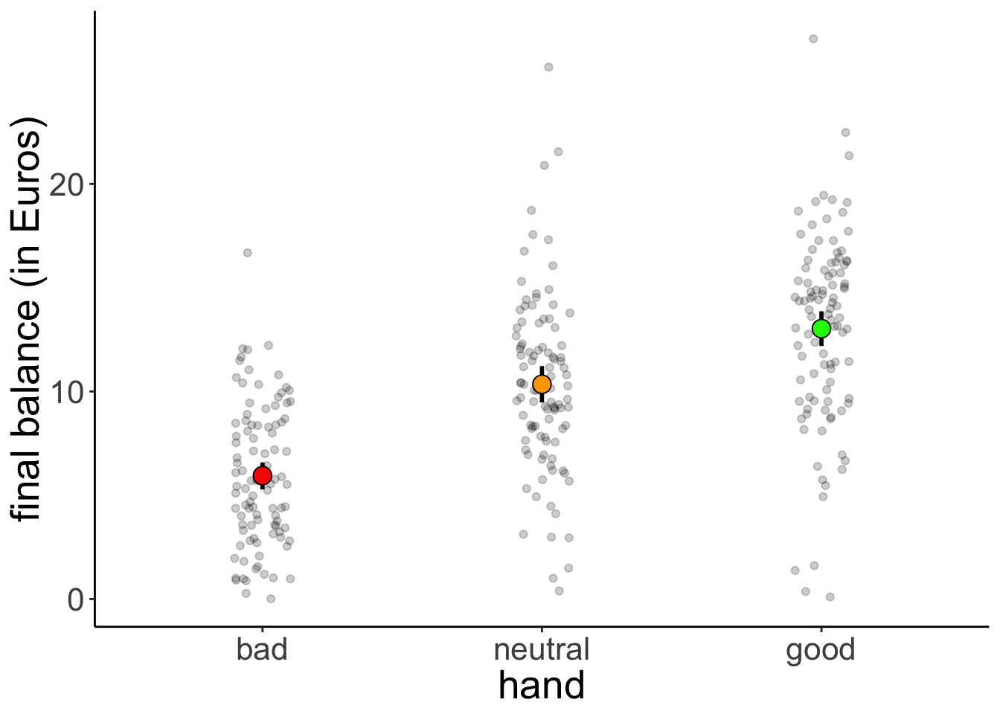
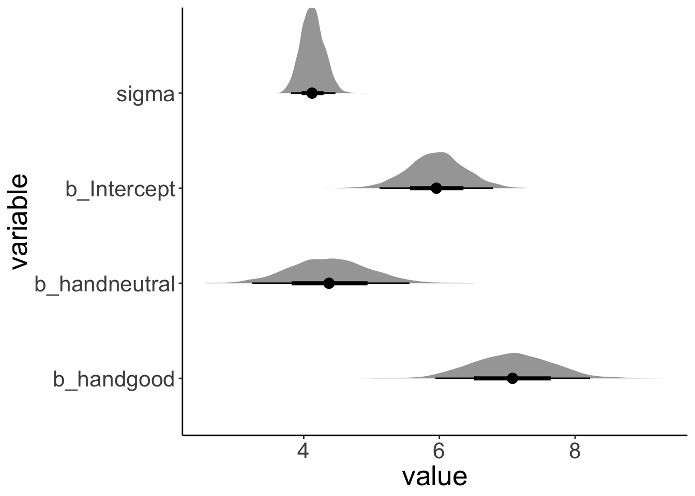
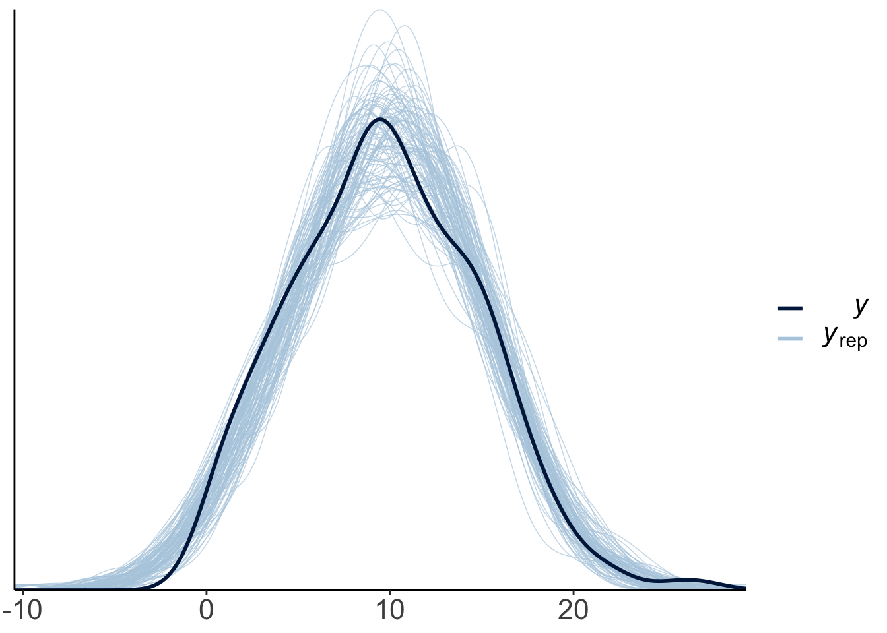
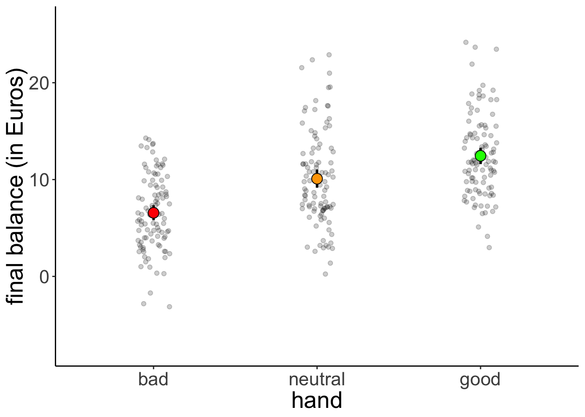
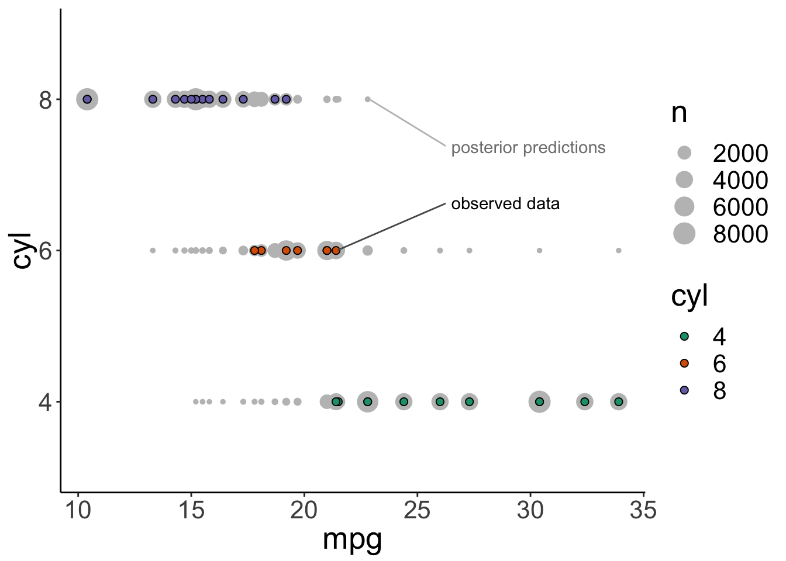

# Bayesian data analysis 3


## Load packages and set plotting theme  


```r
library("knitr")      # for knitting RMarkdown 
library("kableExtra") # for making nice tables
library("janitor")    # for cleaning column names
library("modelr")     # for doing modeling stuff
library("tidybayes")  # tidying up results from Bayesian models
library("brms")       # Bayesian regression models with Stan
library("rstanarm")   # for Bayesian models
library("cowplot")    # for making figure panels
library("ggrepel")    # for labels in ggplots
library("gganimate")  # for animations
library("GGally")     # for pairs plot
library("bayesplot")  # for visualization of Bayesian model fits 
library("tidyverse")  # for wrangling, plotting, etc. 
```


```r
theme_set(
  theme_classic() + #set the theme 
    theme(text = element_text(size = 20)) #set the default text size
)
```

## Load data set 

Load the poker data set. 


```r
df.poker = read_csv("data/poker.csv") %>% 
  mutate(skill = factor(skill,
                        levels = 1:2,
                        labels = c("expert", "average")),
         skill = fct_relevel(skill, "average", "expert"),
         hand = factor(hand,
                       levels = 1:3,
                       labels = c("bad", "neutral", "good")),
         limit = factor(limit,
                        levels = 1:2,
                        labels = c("fixed", "none")),
         participant = 1:n()) %>% 
  select(participant, everything())
```

```
## Parsed with column specification:
## cols(
##   skill = col_double(),
##   hand = col_double(),
##   limit = col_double(),
##   balance = col_double()
## )
```

## Poker 

### Visualization

Let's visualize the data first: 


```r
df.poker %>% 
  ggplot(mapping = aes(x = hand,
                       y = balance,
                       fill = hand)) + 
  geom_point(alpha = 0.2,
             position = position_jitter(height = 0, width = 0.1)) + 
  stat_summary(fun.data = "mean_cl_boot",
               geom = "linerange",
               size = 1) + 
  stat_summary(fun.y = "mean",
               geom = "point",
               shape = 21,
               size = 4) +
  labs(y = "final balance (in Euros)") + 
  scale_fill_manual(values = c("red", "orange", "green")) +
  theme(legend.position = "none")
```



### Linear model 

And let's now fit a simple (frequentist) regression model: 


```r
fit.lm = lm(formula = balance ~ 1 + hand,
            data = df.poker)

fit.lm %>% summary()
```

```
## 
## Call:
## lm(formula = balance ~ 1 + hand, data = df.poker)
## 
## Residuals:
##      Min       1Q   Median       3Q      Max 
## -12.9264  -2.5902  -0.0115   2.6573  15.2834 
## 
## Coefficients:
##             Estimate Std. Error t value Pr(>|t|)    
## (Intercept)   5.9415     0.4111  14.451  < 2e-16 ***
## handneutral   4.4051     0.5815   7.576 4.55e-13 ***
## handgood      7.0849     0.5815  12.185  < 2e-16 ***
## ---
## Signif. codes:  0 '***' 0.001 '**' 0.01 '*' 0.05 '.' 0.1 ' ' 1
## 
## Residual standard error: 4.111 on 297 degrees of freedom
## Multiple R-squared:  0.3377,	Adjusted R-squared:  0.3332 
## F-statistic:  75.7 on 2 and 297 DF,  p-value: < 2.2e-16
```

### Bayesian model 

Now, let's fit a Bayesian regression model using the `brm()` function:


```r
fit.brm1 = brm(formula = balance ~ 1 + hand,
               data = df.poker,
               file = "cache/brm1")

fit.brm1 %>% summary()
```

```
##  Family: gaussian 
##   Links: mu = identity; sigma = identity 
## Formula: balance ~ 1 + hand 
##    Data: df.poker (Number of observations: 300) 
## Samples: 4 chains, each with iter = 2000; warmup = 1000; thin = 1;
##          total post-warmup samples = 4000
## 
## Population-Level Effects: 
##             Estimate Est.Error l-95% CI u-95% CI Eff.Sample Rhat
## Intercept       5.95      0.42     5.12     6.79       3609 1.00
## handneutral     4.38      0.59     3.24     5.56       3489 1.00
## handgood        7.07      0.59     5.94     8.22       3553 1.00
## 
## Family Specific Parameters: 
##       Estimate Est.Error l-95% CI u-95% CI Eff.Sample Rhat
## sigma     4.13      0.17     3.81     4.47       3578 1.00
## 
## Samples were drawn using sampling(NUTS). For each parameter, Eff.Sample 
## is a crude measure of effective sample size, and Rhat is the potential 
## scale reduction factor on split chains (at convergence, Rhat = 1).
```

I use the `file = ` argument to save the model's results so that when I run this code chunk again, the model doesn't need to be fit again (fitting Bayesian models takes a while ...). 

#### Visualize the posteriors 

Let's visualize what the posterior for the different parameters looks like. We use the `geom_halfeyeh()` function from the "tidybayes" package to do so: 


```r
fit.brm1 %>% 
  posterior_samples() %>% 
  select(-lp__) %>% 
  gather("variable", "value") %>% 
  ggplot(data = .,
         mapping = aes(y = variable, x = value)) +
  geom_halfeyeh()
```



And let's look at how the samples from the posterior are correlated with each other: 


```r
fit.brm1 %>% 
  posterior_samples() %>% 
  select(b_Intercept:sigma) %>% 
  ggpairs(lower = list(continuous = wrap("points", alpha = 0.03)),
          upper = list(continuous = wrap("cor", size = 6))) + 
  theme(panel.grid.major = element_blank(),
        text = element_text(size = 12))
```


#### Compute highest density intervals 

To compute the MAP (maximum a posteriori probability) estimate and highest density interval, we use the `mode_hdi()` function that comes with the "tidybayes" package.


```r
fit.brm1 %>% 
  posterior_samples() %>% 
  clean_names() %>% 
  select(starts_with("b_"), sigma) %>% 
  mode_hdi() %>% 
  gather("index", "value", -c(.width:.interval)) %>% 
  select(index, value) %>% 
  mutate(index = ifelse(str_detect(index, fixed(".")), index, str_c(index, ".mode"))) %>% 
  separate(index, into = c("parameter", "type"), sep = "\\.") %>% 
  spread(type, value) %>% 
  kable(digits = 2) %>% 
  kable_styling(bootstrap_options = "striped",
                full_width = F)
```

<table class="table table-striped" style="width: auto !important; margin-left: auto; margin-right: auto;">
 <thead>
  <tr>
   <th style="text-align:left;"> parameter </th>
   <th style="text-align:right;"> lower </th>
   <th style="text-align:right;"> mode </th>
   <th style="text-align:right;"> upper </th>
  </tr>
 </thead>
<tbody>
  <tr>
   <td style="text-align:left;"> b_handgood </td>
   <td style="text-align:right;"> 5.93 </td>
   <td style="text-align:right;"> 7.10 </td>
   <td style="text-align:right;"> 8.20 </td>
  </tr>
  <tr>
   <td style="text-align:left;"> b_handneutral </td>
   <td style="text-align:right;"> 3.19 </td>
   <td style="text-align:right;"> 4.42 </td>
   <td style="text-align:right;"> 5.47 </td>
  </tr>
  <tr>
   <td style="text-align:left;"> b_intercept </td>
   <td style="text-align:right;"> 5.11 </td>
   <td style="text-align:right;"> 6.02 </td>
   <td style="text-align:right;"> 6.78 </td>
  </tr>
  <tr>
   <td style="text-align:left;"> sigma </td>
   <td style="text-align:right;"> 3.81 </td>
   <td style="text-align:right;"> 4.10 </td>
   <td style="text-align:right;"> 4.46 </td>
  </tr>
</tbody>
</table>

#### Posterior predictive check 

To check whether the model did a good job capturing the data, we can simulate what future data the Baysian model predicts, now that it has learned from the data we feed into it.  


```r
pp_check(fit.brm1, nsamples = 100)
```



This looks good! The predicted shaped of the data based on samples from the posterior distribution looks very similar to the shape of the actual data.  

Let's make a hypothetical outcome plot that shows what concrete data sets the model would predict: 


```r
# generate predictive samples 
df.predictive_samples = fit.brm1 %>% 
  posterior_samples() %>% 
  clean_names() %>% 
  select(contains("b_"), sigma) %>% 
  sample_n(size = 20) %>% 
  mutate(sample = 1:n()) %>% 
  group_by(sample) %>% 
  nest() %>% 
  mutate(bad = map(data, ~ .$b_intercept + rnorm(100, sd = .$sigma)),
         neutral = map(data, ~ .$b_intercept + .$b_handneutral + rnorm(100, sd = .$sigma)),
         good = map(data, ~ .$b_intercept + .$b_handgood + rnorm(100, sd = .$sigma))) %>% 
  unnest(bad, neutral, good)

# plot the results as an animation
p = df.predictive_samples %>% 
  gather("hand", "balance", -sample) %>% 
  mutate(hand = factor(hand, levels = c("bad", "neutral", "good"))) %>% 
  ggplot(mapping = aes(x = hand,
                       y = balance,
                       fill = hand)) + 
  geom_point(alpha = 0.2,
             position = position_jitter(height = 0, width = 0.1)) + 
  stat_summary(fun.data = "mean_cl_boot",
               geom = "linerange",
               size = 1) + 
  stat_summary(fun.y = "mean",
               geom = "point",
               shape = 21,
               size = 4) +
  labs(y = "final balance (in Euros)") + 
  scale_fill_manual(values = c("red", "orange", "green")) +
  theme(legend.position = "none") + 
  transition_manual(sample)

animate(p, nframes = 120, width = 800, height = 600, res = 96, type = "cairo")
```

<!-- -->

```r
# anim_save("poker_posterior_predictive.gif")
```

#### Test hypothesis

One key advantage of Bayesian over frequentist analysis is that we can test hypothesis in a very flexible manner by directly probing our posterior samples in different ways. 

We may ask, for example, what the probability is that the parameter for the difference between a bad hand and a neutral hand (`b_handneutral`) is greater than 0. Let's plot the posterior distribution together with the criterion: 


```r
fit.brm1 %>% 
  posterior_samples() %>% 
  select(b_handneutral) %>% 
  gather("variable", "value") %>% 
  ggplot(data = .,
         mapping = aes(y = variable, x = value)) +
  geom_halfeyeh() + 
  geom_vline(xintercept = 0,
             color = "red")
```


We see that the posterior is definitely greater than 0. 

We can ask many different kinds of questions about the data by doing basic arithmetic on our posterior samples. The `hypothesis()` function makes this even easier. Here are some examples: 


```r
# the probability that the posterior for handneutral is less than 0
hypothesis(fit.brm1,
           hypothesis = "handneutral < 0")
```

```
## Hypothesis Tests for class b:
##          Hypothesis Estimate Est.Error CI.Lower CI.Upper Evid.Ratio
## 1 (handneutral) < 0     4.38      0.59     -Inf     5.36          0
##   Post.Prob Star
## 1         0     
## ---
## '*': The expected value under the hypothesis lies outside the 95%-CI.
## Posterior probabilities of point hypotheses assume equal prior probabilities.
```


```r
# the probability that the posterior for handneutral is greater than 4
hypothesis(fit.brm1,
           hypothesis = "handneutral > 4")
```

```
## Hypothesis Tests for class b:
##              Hypothesis Estimate Est.Error CI.Lower CI.Upper Evid.Ratio
## 1 (handneutral)-(4) > 0     0.38      0.59    -0.56      Inf       2.89
##   Post.Prob Star
## 1      0.74     
## ---
## '*': The expected value under the hypothesis lies outside the 95%-CI.
## Posterior probabilities of point hypotheses assume equal prior probabilities.
```


```r
# the probability that good hands make twice as much as bad hands
hypothesis(fit.brm1,
           hypothesis = "Intercept + handgood > 2 * Intercept")
```

```
## Hypothesis Tests for class b:
##                 Hypothesis Estimate Est.Error CI.Lower CI.Upper Evid.Ratio
## 1 (Intercept+handgo... > 0     1.12      0.94    -0.42      Inf        7.6
##   Post.Prob Star
## 1      0.88     
## ---
## '*': The expected value under the hypothesis lies outside the 95%-CI.
## Posterior probabilities of point hypotheses assume equal prior probabilities.
```


```r
# the probability that neutral hands make less than the average of bad and good hands
hypothesis(fit.brm1,
           hypothesis = "Intercept + handneutral < (Intercept + Intercept + handgood) / 2")
```

```
## Hypothesis Tests for class b:
##                 Hypothesis Estimate Est.Error CI.Lower CI.Upper Evid.Ratio
## 1 (Intercept+handne... < 0     0.85      0.49     -Inf     1.66       0.04
##   Post.Prob Star
## 1      0.04     
## ---
## '*': The expected value under the hypothesis lies outside the 95%-CI.
## Posterior probabilities of point hypotheses assume equal prior probabilities.
```

Let's double check one example, and calculate the result directly based on the posterior samples: 


```r
df.hypothesis = fit.brm1 %>% 
  posterior_samples() %>% 
  clean_names() %>% 
  select(starts_with("b_")) %>% 
  mutate(neutral = b_intercept + b_handneutral,
         bad_good_average = (b_intercept + b_intercept + b_handgood)/2,
         hypothesis = neutral < bad_good_average)

df.hypothesis %>% 
  summarize(p = sum(hypothesis)/n())
```

```
##         p
## 1 0.04175
```

#### Bayes factor 

Another way of testing hypothesis is via the Bayes factor. Let's fit the two models we are interested in comparing with each other: 


```r
fit.brm2 = brm(formula = balance ~ 1 + hand,
               data = df.poker,
               save_all_pars = T,
               file = "cache/brm2")

fit.brm3 = brm(formula = balance ~ 1 + hand + skill,
               data = df.poker,
               save_all_pars = T,
               file = "cache/brm3")
```

And then compare the models useing the `bayes_factor()` function: 


```r
bayes_factor(fit.brm3, fit.brm2)
```

```
## Iteration: 1
## Iteration: 2
## Iteration: 3
## Iteration: 4
## Iteration: 1
## Iteration: 2
## Iteration: 3
## Iteration: 4
## Iteration: 5
```

```
## Estimated Bayes factor in favor of bridge1 over bridge2: 3.79463
```

#### Full specification

So far, we have used the defaults that `brm()` comes with and not bothered about specifiying the priors, etc. 

##### Getting the priors

Notice that we didn't specify any priors in the model. By default, "brms" assigns weakly informative priors to the parameters in the model. We can see what these are by running the following command: 


```r
fit.brm1 %>% 
  prior_summary()
```

```
##                  prior     class        coef group resp dpar nlpar bound
## 1                              b                                        
## 2                              b    handgood                            
## 3                              b handneutral                            
## 4 student_t(3, 10, 10) Intercept                                        
## 5  student_t(3, 0, 10)     sigma
```

We can also get information about which priors need to be specified before fitting a model:


```r
get_prior(formula = balance ~ 1 + hand,
          family = "gaussian",
          data = df.poker)
```

```
##                  prior     class        coef group resp dpar nlpar bound
## 1                              b                                        
## 2                              b    handgood                            
## 3                              b handneutral                            
## 4 student_t(3, 10, 10) Intercept                                        
## 5  student_t(3, 0, 10)     sigma
```

Here is an example for what a more complete model specification could look like: 


```r
fit.brm4 = brm(
  formula = balance ~ 1 + hand,
  family = "gaussian",
  data = df.poker,
  prior = c(
    prior(normal(0, 10), class = "b", coef = "handgood"),
    prior(normal(0, 10), class = "b", coef = "handneutral"),
    prior(student_t(3, 3, 10), class = "Intercept"),
    prior(student_t(3, 0, 10), class = "sigma")
  ),
  inits = list(
    list(Intercept = 0, sigma = 1, handgood = 5, handneutral = 5),
    list(Intercept = -5, sigma = 3, handgood = 2, handneutral = 2),
    list(Intercept = 2, sigma = 1, handgood = -1, handneutral = 1),
    list(Intercept = 1, sigma = 2, handgood = 2, handneutral = -2)
  ),
  iter = 4000,
  warmup = 1000,
  chains = 4,
  file = "cache/brm4",
  seed = 1
)

fit.brm4 %>% summary()
```

```
##  Family: gaussian 
##   Links: mu = identity; sigma = identity 
## Formula: balance ~ 1 + hand 
##    Data: df.poker (Number of observations: 300) 
## Samples: 4 chains, each with iter = 4000; warmup = 1000; thin = 1;
##          total post-warmup samples = 12000
## 
## Population-Level Effects: 
##             Estimate Est.Error l-95% CI u-95% CI Eff.Sample Rhat
## Intercept       5.96      0.41     5.15     6.76       9191 1.00
## handneutral     4.37      0.58     3.23     5.53       9629 1.00
## handgood        7.05      0.58     5.93     8.19       9778 1.00
## 
## Family Specific Parameters: 
##       Estimate Est.Error l-95% CI u-95% CI Eff.Sample Rhat
## sigma     4.13      0.17     3.81     4.49      12855 1.00
## 
## Samples were drawn using sampling(NUTS). For each parameter, Eff.Sample 
## is a crude measure of effective sample size, and Rhat is the potential 
## scale reduction factor on split chains (at convergence, Rhat = 1).
```

We can also take a look at the Stan code that the `brm()` function creates: 


```r
fit.brm4 %>% stancode()
```

```
## // generated with brms 2.7.0
## functions { 
## } 
## data { 
##   int<lower=1> N;  // total number of observations 
##   vector[N] Y;  // response variable 
##   int<lower=1> K;  // number of population-level effects 
##   matrix[N, K] X;  // population-level design matrix 
##   int prior_only;  // should the likelihood be ignored? 
## } 
## transformed data { 
##   int Kc = K - 1; 
##   matrix[N, K - 1] Xc;  // centered version of X 
##   vector[K - 1] means_X;  // column means of X before centering 
##   for (i in 2:K) { 
##     means_X[i - 1] = mean(X[, i]); 
##     Xc[, i - 1] = X[, i] - means_X[i - 1]; 
##   } 
## } 
## parameters { 
##   vector[Kc] b;  // population-level effects 
##   real temp_Intercept;  // temporary intercept 
##   real<lower=0> sigma;  // residual SD 
## } 
## transformed parameters { 
## } 
## model { 
##   vector[N] mu = temp_Intercept + Xc * b;
##   // priors including all constants 
##   target += normal_lpdf(b[1] | 0, 10); 
##   target += normal_lpdf(b[2] | 0, 10); 
##   target += student_t_lpdf(temp_Intercept | 3, 3, 10); 
##   target += student_t_lpdf(sigma | 3, 0, 10)
##     - 1 * student_t_lccdf(0 | 3, 0, 10); 
##   // likelihood including all constants 
##   if (!prior_only) { 
##     target += normal_lpdf(Y | mu, sigma);
##   } 
## } 
## generated quantities { 
##   // actual population-level intercept 
##   real b_Intercept = temp_Intercept - dot_product(means_X, b); 
## }
```

One thing worth noticing: by default, "brms" centers the predictors which makes it easier to assign a default prior over the intercept. 


#### Inference diagnostics

So far, we've assumed that the inference has worked out. We can check this by running plot() on our brm object:  


```r
plot(fit.brm1)
```


Let's make our own version of a trace plot for one parameter in the model:


```r
fit.brm1 %>% 
  spread_draws(b_Intercept) %>% 
  clean_names() %>% 
  mutate(chain = as.factor(chain)) %>% 
  ggplot(aes(x = iteration, y = b_intercept, group = chain, color = chain)) + 
  geom_line()
```


We can also take a look at the auto-correlation plot. Ideally, we want to generate independent samples from the posterior. So we don't want subsequent samples to be strongly correlated with each other. Let's take a look: 


```r
variables = fit.brm1 %>% get_variables() %>% .[1:4]

fit.brm1 %>% 
  posterior_samples() %>% 
  mcmc_acf(pars = variables,
           lags = 4)
```


Looking good! The autocorrelation should become very small as the lag increases (indicating that we are getting independent samples from the posterior). 

##### When things go wrong 

Let's try to fit a model to very little data (just two observations) with extremely uninformative priors: 


```r
df.data = tibble(y = c(-1, 1))

fit.brm5 = brm(
  data = df.data,
  family = gaussian,
  formula = y ~ 1,
  prior = c(
    prior(uniform(-1e10, 1e10), class = Intercept),
    prior(uniform(0, 1e10), class = sigma)
  ),
  inits = list(
    list(Intercept = 0, sigma = 1),
    list(Intercept = 0, sigma = 1)
  ),
  iter = 4000,
  warmup = 1000,
  chains = 2,
  file = "cache/brm5"
)
```

Let's take a look at the posterior distributions of the model parameters: 


```r
summary(fit.brm5)
```

```
## Warning: There were 225 divergent transitions after warmup. Increasing adapt_delta above 0.8 may help.
## See http://mc-stan.org/misc/warnings.html#divergent-transitions-after-warmup
```

```
##  Family: gaussian 
##   Links: mu = identity; sigma = identity 
## Formula: y ~ 1 
##    Data: df.data (Number of observations: 2) 
## Samples: 2 chains, each with iter = 4000; warmup = 1000; thin = 1;
##          total post-warmup samples = 6000
## 
## Population-Level Effects: 
##               Estimate    Est.Error       l-95% CI     u-95% CI Eff.Sample
## Intercept -51502175.28 484211604.68 -1258318917.93 524975203.26        103
##           Rhat
## Intercept 1.04
## 
## Family Specific Parameters: 
##           Estimate     Est.Error l-95% CI      u-95% CI Eff.Sample Rhat
## sigma 398611802.92 1217973385.49   852.93 4284866883.47         13 1.07
## 
## Samples were drawn using sampling(NUTS). For each parameter, Eff.Sample 
## is a crude measure of effective sample size, and Rhat is the potential 
## scale reduction factor on split chains (at convergence, Rhat = 1).
```

Not looking good -- The estimates and credible intervals are off the charts. And the effective samples sizes in the chains are very small. 

Let's visualize the trace plots:


```r
plot(fit.brm5)
```


```r
fit.brm5 %>% 
  spread_draws(b_Intercept) %>% 
  clean_names() %>% 
  mutate(chain = as.factor(chain)) %>% 
  ggplot(aes(x = iteration,
             y = b_intercept,
             group = chain,
             color = chain)) + 
  geom_line()
```


Given that we have so little data in this case, we need to help the model a little bit by providing some slighlty more specific priors. 


```r
fit.brm6 = brm(
  data = df.data,
  family = gaussian,
  formula = y ~ 1,
  prior = c(
    prior(normal(0, 10), class = Intercept), # more reasonable priors
    prior(cauchy(0, 1), class = sigma)
  ),
  iter = 4000,
  warmup = 1000,
  chains = 2,
  seed = 1,
  file = "cache/brm6"
)
```

Let's take a look at the posterior distributions of the model parameters: 


```r
summary(fit.brm6)
```

```
## Warning: There were 3 divergent transitions after warmup. Increasing adapt_delta above 0.8 may help.
## See http://mc-stan.org/misc/warnings.html#divergent-transitions-after-warmup
```

```
##  Family: gaussian 
##   Links: mu = identity; sigma = identity 
## Formula: y ~ 1 
##    Data: df.data (Number of observations: 2) 
## Samples: 2 chains, each with iter = 4000; warmup = 1000; thin = 1;
##          total post-warmup samples = 6000
## 
## Population-Level Effects: 
##           Estimate Est.Error l-95% CI u-95% CI Eff.Sample Rhat
## Intercept    -0.13      1.69    -4.10     3.06        881 1.00
## 
## Family Specific Parameters: 
##       Estimate Est.Error l-95% CI u-95% CI Eff.Sample Rhat
## sigma     2.04      1.88     0.61     6.95       1152 1.00
## 
## Samples were drawn using sampling(NUTS). For each parameter, Eff.Sample 
## is a crude measure of effective sample size, and Rhat is the potential 
## scale reduction factor on split chains (at convergence, Rhat = 1).
```

This looks much better. There is still quite a bit of uncertainty in our paremeter estimates, but it has reduced dramatically. 

Let's visualize the trace plots:


```r
plot(fit.brm6)
```


```r
fit.brm6 %>% 
  spread_draws(b_Intercept) %>% 
  clean_names() %>% 
  mutate(chain = as.factor(chain)) %>% 
  ggplot(aes(x = iteration, y = b_intercept, group = chain, color = chain)) + 
  geom_line()
```


Looking mostly good -- except for one hiccup on sigma ... 

## Dealing with heteroscedasticity 

Let's generate some fake developmental data where the variance in the data is greatest for young children, smaller for older children, and even smaller for adults:  


```r
# make example reproducible 
set.seed(0)

df.variance = tibble(
  group = rep(c("3yo", "5yo", "adults"), each = 20),
  response = rnorm(60, mean = rep(c(0, 5, 8), each = 20), sd = rep(c(3, 1.5, 0.3), each = 20))
)

df.variance %>%
  ggplot(aes(x = group, y = response)) +
  geom_jitter(height = 0,
              width = 0.1,
              alpha = 0.7)
```


While frequentist models (such as a linear regression) assume equality of variance, Baysian models afford us with the flexibility of inferring both the parameter estimates of the groups (i.e. the means and differences between the means), as well as the variances. 

We simply define a multivariate model which tries to fit both the `response` as well as the variance `sigma`: 


```r
fit.brm7 = brm(
  formula = bf(response ~ group,
               sigma ~ group),
  data = df.variance,
  file = "cache/brm7"
)
```

Let's take a look at the model output: 


```r
summary(fit.brm7)
```

```
##  Family: gaussian 
##   Links: mu = identity; sigma = log 
## Formula: response ~ group 
##          sigma ~ group
##    Data: df.variance (Number of observations: 60) 
## Samples: 4 chains, each with iter = 2000; warmup = 1000; thin = 1;
##          total post-warmup samples = 4000
## 
## Population-Level Effects: 
##                   Estimate Est.Error l-95% CI u-95% CI Eff.Sample Rhat
## Intercept             0.00      0.72    -1.38     1.45       1273 1.00
## sigma_Intercept       1.15      0.17     0.85     1.51       2033 1.00
## group5yo              5.16      0.77     3.60     6.62       1424 1.00
## groupadults           7.96      0.72     6.49     9.37       1276 1.00
## sigma_group5yo       -1.05      0.23    -1.51    -0.59       2355 1.00
## sigma_groupadults    -2.19      0.23    -2.65    -1.74       2231 1.00
## 
## Samples were drawn using sampling(NUTS). For each parameter, Eff.Sample 
## is a crude measure of effective sample size, and Rhat is the potential 
## scale reduction factor on split chains (at convergence, Rhat = 1).
```

And let's visualize the results:


```r
df.variance %>%
  expand(group) %>% 
  add_fitted_draws(fit.brm7, dpar = TRUE) %>%
  select(group, .row, .draw, posterior = .value, mu, sigma) %>% 
  gather("index", "value", c(mu, sigma)) %>% 
  ggplot(aes(x = value, y = group)) +
  geom_halfeyeh() +
  geom_vline(xintercept = 0, linetype = "dashed") +
  facet_grid(cols = vars(index))
```


This plot shows what the posterior looks like for both mu (the inferred means), and for sigma (the inferred variances) for the different groups. 

## Ordinal regression 

For more information, see this [tutorial](https://mjskay.github.io/tidybayes/articles/tidy-
brms.html#ordinal-models).

While running an ordinal regression is far from trivial in frequentist world, it's easy to do using "brms". 

Let's load the cars data and turn the number of cylinders into an ordered factor: 


```r
df.cars = mtcars %>% 
  mutate(cyl = ordered(cyl)) # creates an ordered factor
```

Let's check that the cylinders are indeed ordered now: 


```r
df.cars %>% str()
```

```
## 'data.frame':	32 obs. of  11 variables:
##  $ mpg : num  21 21 22.8 21.4 18.7 18.1 14.3 24.4 22.8 19.2 ...
##  $ cyl : Ord.factor w/ 3 levels "4"<"6"<"8": 2 2 1 2 3 2 3 1 1 2 ...
##  $ disp: num  160 160 108 258 360 ...
##  $ hp  : num  110 110 93 110 175 105 245 62 95 123 ...
##  $ drat: num  3.9 3.9 3.85 3.08 3.15 2.76 3.21 3.69 3.92 3.92 ...
##  $ wt  : num  2.62 2.88 2.32 3.21 3.44 ...
##  $ qsec: num  16.5 17 18.6 19.4 17 ...
##  $ vs  : num  0 0 1 1 0 1 0 1 1 1 ...
##  $ am  : num  1 1 1 0 0 0 0 0 0 0 ...
##  $ gear: num  4 4 4 3 3 3 3 4 4 4 ...
##  $ carb: num  4 4 1 1 2 1 4 2 2 4 ...
```


```r
fit.brm8 = brm(formula = cyl ~ mpg,
               data = df.cars,
               family = "cumulative",
               file = "cache/brm8",
               seed = 1)
```

Visualize the results:


```r
data_plot = df.cars %>%
  ggplot(aes(x = mpg, y = cyl, color = cyl)) +
  geom_point() +
  scale_color_brewer(palette = "Dark2", name = "cyl")

fit_plot = df.cars %>%
  data_grid(mpg = seq_range(mpg, n = 101)) %>%
  add_fitted_draws(fit.brm8, value = "P(cyl | mpg)", category = "cyl") %>%
  ggplot(aes(x = mpg, y = `P(cyl | mpg)`, color = cyl)) +
  stat_lineribbon(aes(fill = cyl),
                  alpha = 1/5,
                  .width = c(0.95)) +
  scale_color_brewer(palette = "Dark2") +
  scale_fill_brewer(palette = "Dark2")

plot_grid(ncol = 1, align = "v",
          data_plot,
          fit_plot
)
```


Posterior predictive check: 


```r
df.cars %>%
  select(mpg) %>%
  add_predicted_draws(fit.brm8, prediction = "cyl", seed = 1234) %>%
  ggplot(aes(x = mpg, y = cyl)) +
  geom_count(color = "gray75") +
  geom_point(aes(fill = cyl),
             data = df.cars,
             shape = 21,
             size = 2) +
  scale_fill_brewer(palette = "Dark2") +
  geom_label_repel(
    data = . %>% ungroup() %>% filter(cyl == "8") %>% filter(mpg == max(mpg)) %>% dplyr::slice(1),
    label = "posterior predictions",
    xlim = c(26, NA),
    ylim = c(NA, 2.8),
    point.padding = 0.3,
    label.size = NA,
    color = "gray50",
    segment.color = "gray75") +
  geom_label_repel(
    data = df.cars %>% filter(cyl == "6") %>% filter(mpg == max(mpg)) %>% dplyr::slice(1),
    label = "observed data",
    xlim = c(26, NA),
    ylim = c(2.2, NA),
    point.padding = 0.2,
    label.size = NA,
    segment.color = "gray35")
```




## Additional resources 

- [Tutorial on visualizing brms posteriors with tidybayes](https://mjskay.github.io/tidybayes/articles/tidy-brms.html)
- [Hypothetical outcome plots](https://mucollective.northwestern.edu/files/2018-HOPsTrends-InfoVis.pdf)
- [Visual MCMC diagnostics](https://cran.r-project.org/web/packages/bayesplot/vignettes/visual-mcmc-diagnostics.html#general-mcmc-diagnostics)
- [How to model slider data the Baysian way](https://vuorre.netlify.com/post/2019/02/18/analyze-analog-scale-
ratings-with-zero-one-inflated-beta-models/#zoib-regression)
