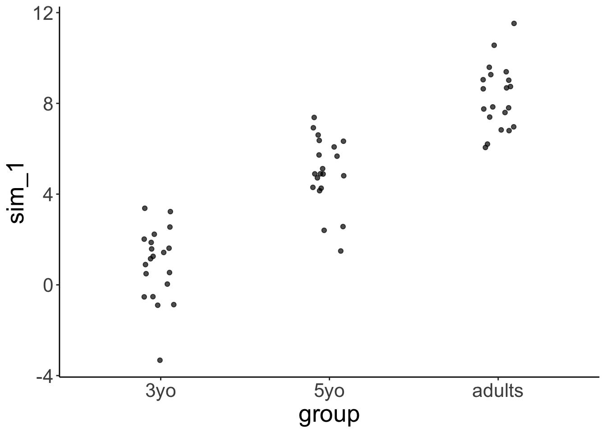
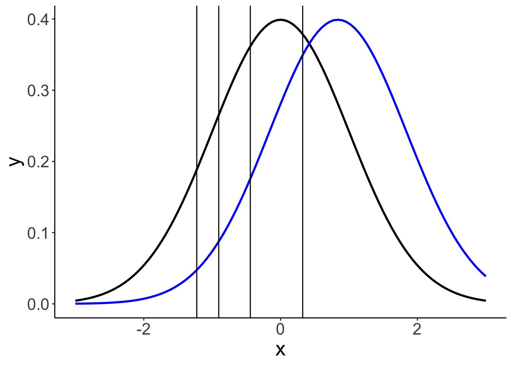
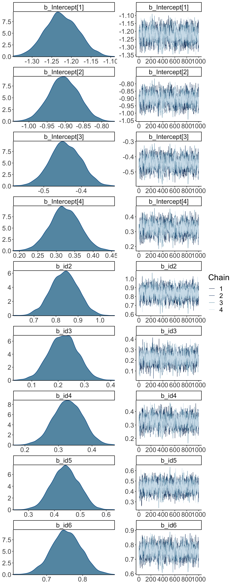
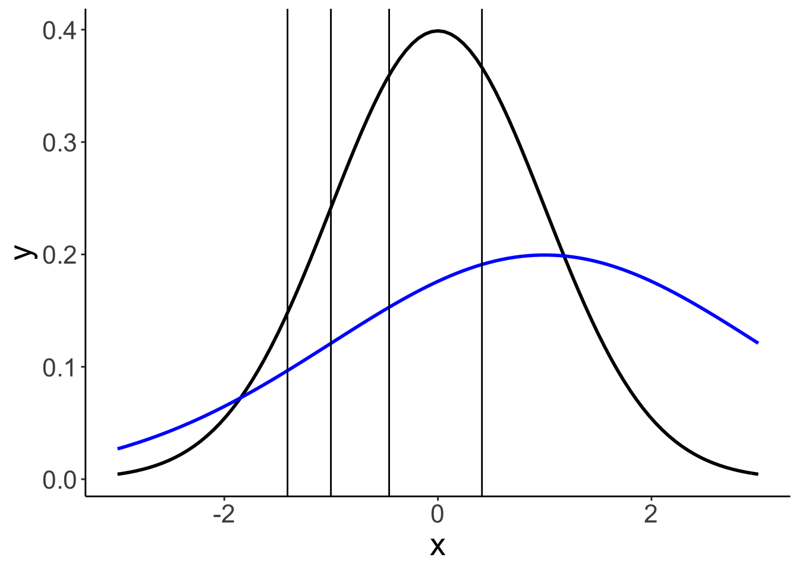
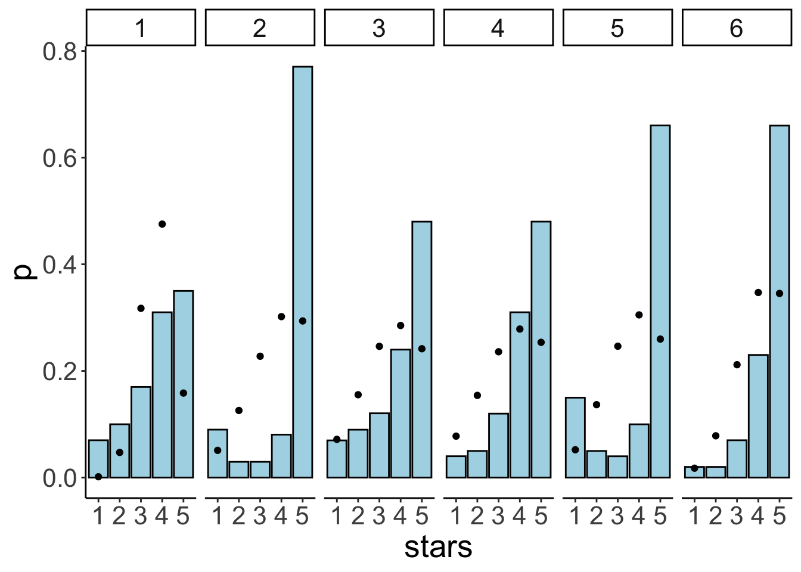

# Bayesian data analysis 3

## Learning goals 

- Evidence for null results. 
- Only positive predictors. 
- Dealing with unequal variance. 
- Modeling slider data: Zero-one inflated beta binomial model. 
- Modeling Likert scale data: Ordinal logistic regression. 

## Load packages and set plotting theme  


```r
library("knitr")       # for knitting RMarkdown 
library("kableExtra")  # for nice RMarkdown tables
library("janitor")     # for cleaning column names
library("modelr")      # for doing modeling stuff
library("tidybayes")   # tidying up results from Bayesian models
library("brms")        # Bayesian regression models with Stan
library("rstanarm")    # for Bayesian models
library("patchwork")   # for making figure panels
library("ggrepel")     # for labels in ggplots
library("broom.mixed") # for tidying things up
```

```
## Warning in checkMatrixPackageVersion(): Package version inconsistency detected.
## TMB was built with Matrix version 1.2.18
## Current Matrix version is 1.3.2
## Please re-install 'TMB' from source using install.packages('TMB', type = 'source') or ask CRAN for a binary version of 'TMB' matching CRAN's 'Matrix' package
```

```r
library("gganimate")   # for animations
library("GGally")      # for pairs plot
library("patchwork")   # for figure panels
library("parameters")  # for extracting parameters
library("bayesplot")   # for visualization of Bayesian model fits 
library("ggeffects")   # for showing marginal/conditional effects
library("scales")      # for percent y-axis
library("tidyverse")   # for wrangling, plotting, etc. 
```


```r
theme_set(theme_classic() + #set the theme 
            theme(text = element_text(size = 20))) #set the default text size

# set rstan options
rstan::rstan_options(auto_write = TRUE)
options(mc.cores = parallel::detectCores())

opts_chunk$set(comment = "",
               fig.show = "hold")
```

## Evidence for the null hypothesis 

See [this tutorial](https://vuorre.netlify.com/post/2017/03/21/bayes-factors-with-brms/) and this paper [@wagenmakers2010bayesiana] for more information. 

### Bayes factor

#### Fit the model 

- Define a binomial model
- Give a uniform prior `beta(1, 1)`
- Get samples from the prior


```r
df.null = tibble(s = 6, k = 10)

fit.brm_bayes = brm(s | trials(k) ~ 0 + Intercept, 
               family = binomial(link = "identity"),
               prior = set_prior("beta(1, 1)", class = "b", lb = 0, ub = 1),
               data = df.null,
               sample_prior = TRUE,
               cores = 4,
               file = "cache/brm_bayes")
```

#### Visualize the results 

Visualize the prior and posterior samples: 


```r
fit.brm_bayes %>% 
  posterior_samples(pars = "b") %>% 
  pivot_longer(cols = everything()) %>% 
  ggplot(mapping = aes(x = value,
                       fill = name)) + 
  geom_density(alpha = 0.5) + 
  scale_fill_brewer(palette = "Set1")
```


We test the H0: $\theta = 0.5$ versus the H1: $\theta \neq 0.5$ using the Savage-Dickey Method, according to which we can compute the Bayes factor like so:  

$BF_{01} = \frac{p(D|H_0)}{p(D|H_1)} = \frac{p(\theta = 0.5|D, H_1)}{p(\theta = 0.5|H_1)}$


```r
fit.brm_bayes %>% 
  hypothesis(hypothesis = "Intercept = 0.5")
```

```
Hypothesis Tests for class b:
             Hypothesis Estimate Est.Error CI.Lower CI.Upper Evid.Ratio
1 (Intercept)-(0.5) = 0     0.08      0.13    -0.19     0.33       2.22
  Post.Prob Star
1      0.69     
---
'CI': 90%-CI for one-sided and 95%-CI for two-sided hypotheses.
'*': For one-sided hypotheses, the posterior probability exceeds 95%;
for two-sided hypotheses, the value tested against lies outside the 95%-CI.
Posterior probabilities of point hypotheses assume equal prior probabilities.
```

The result shows that the evidence ratio is in favor of the H0 with $BF_{01} = 2.22$. This means that H0 is 2.2 more likely than H1 given the data. 

### LOO 

Another way to test different models is to compare them via approximate leave-one-out cross-validation. 


```r
set.seed(1)
df.loo = tibble(x = rnorm(n = 50),
                y = rnorm(n = 50))

# visualize 
ggplot(data = df.loo,
       mapping = aes(x = x, 
                     y = y)) + 
  geom_point()

# fit the frequentist model 
fit.lm_loo = lm(formula = y ~ 1 + x,
                data = df.loo)

fit.lm_loo %>% 
  summary()
```

```

Call:
lm(formula = y ~ 1 + x, data = df.loo)

Residuals:
     Min       1Q   Median       3Q      Max 
-1.92760 -0.66898 -0.00225  0.48768  2.34858 

Coefficients:
            Estimate Std. Error t value Pr(>|t|)
(Intercept)  0.12190    0.13935   0.875    0.386
x           -0.04555    0.16807  -0.271    0.788

Residual standard error: 0.9781 on 48 degrees of freedom
Multiple R-squared:  0.001528,	Adjusted R-squared:  -0.01927 
F-statistic: 0.07345 on 1 and 48 DF,  p-value: 0.7875
```

```r
# fit and compare bayesian models 
fit.brm_loo1 = brm(formula = y ~ 1,
                   data = df.loo,
                   seed = 1, 
                   file = "cache/brm_loo1")

fit.brm_loo2 = brm(formula = y ~ 1 + x,
                   data = df.loo,
                   seed = 1, 
                   file = "cache/brm_loo2")

fit.brm_loo1 = add_criterion(fit.brm_loo1,
                             criterion = "loo",
                             file = "cache/brm_loo1")

fit.brm_loo2 = add_criterion(fit.brm_loo2,
                             criterion = "loo",
                             file = "cache/brm_loo2")

loo_compare(fit.brm_loo1, fit.brm_loo2)
```

```
             elpd_diff se_diff
fit.brm_loo1  0.0       0.0   
fit.brm_loo2 -1.1       0.5   
```

```r
model_weights(fit.brm_loo1, fit.brm_loo2)
```

```
fit.brm_loo1 fit.brm_loo2 
9.999989e-01 1.053955e-06 
```


## Dealing with heteroscedasticity 

Let's generate some fake developmental data where the variance in the data is greatest for young children, smaller for older children, and even smaller for adults:  


```r
# make example reproducible 
set.seed(1)

df.variance = tibble(group = rep(c("3yo", "5yo", "adults"), each = 20),
                     response = rnorm(n = 60,
                                      mean = rep(c(0, 5, 8), each = 20),
                                      sd = rep(c(3, 1.5, 0.3), each = 20)))
```

### Visualize the data 


```r
df.variance %>%
  ggplot(aes(x = group, y = response)) +
  geom_jitter(height = 0,
              width = 0.1,
              alpha = 0.7)
```


### Frequentist analysis 

#### Fit the model


```r
fit.lm_variance = lm(formula = response ~ 1 + group,
                     data = df.variance)

fit.lm_variance %>% 
  summary()
```

```

Call:
lm(formula = response ~ 1 + group, data = df.variance)

Residuals:
    Min      1Q  Median      3Q     Max 
-7.2157 -0.3613  0.0200  0.7001  4.2143 

Coefficients:
            Estimate Std. Error t value Pr(>|t|)    
(Intercept)   0.5716     0.3931   1.454    0.151    
group5yo      4.4187     0.5560   7.948  8.4e-11 ***
groupadults   7.4701     0.5560  13.436  < 2e-16 ***
---
Signif. codes:  0 '***' 0.001 '**' 0.01 '*' 0.05 '.' 0.1 ' ' 1

Residual standard error: 1.758 on 57 degrees of freedom
Multiple R-squared:  0.762,	Adjusted R-squared:  0.7537 
F-statistic: 91.27 on 2 and 57 DF,  p-value: < 2.2e-16
```

```r
fit.lm_variance %>% 
  glance()
```

```
# A tibble: 1 x 12
  r.squared adj.r.squared sigma statistic  p.value    df logLik   AIC   BIC
      <dbl>         <dbl> <dbl>     <dbl>    <dbl> <dbl>  <dbl> <dbl> <dbl>
1     0.762         0.754  1.76      91.3 1.70e-18     2  -117.  243.  251.
# … with 3 more variables: deviance <dbl>, df.residual <int>, nobs <int>
```

#### Visualize the model predictions 


```r
set.seed(1)

fit.lm_variance %>% 
  simulate() %>% 
  bind_cols(df.variance) %>% 
  ggplot(aes(x = group, y = sim_1)) +
  geom_jitter(height = 0,
              width = 0.1,
              alpha = 0.7)
```



Notice how the model predicts that the variance is equal for each group.

### Bayesian analysis 

While frequentist models (such as a linear regression) assume equality of variance, Bayesian models afford us with the flexibility of inferring both the parameter estimates of the groups (i.e. the means and differences between the means), as well as the variances. 

#### Fit the model 

We define a multivariate model which tries to fit both the `response` as well as the variance `sigma`: 


```r
fit.brm_variance = brm(formula = bf(response ~ group,
                                    sigma ~ group),
                       data = df.variance,
                       file = "cache/brm_variance",
                       seed = 1)

summary(fit.brm_variance)
```

```
 Family: gaussian 
  Links: mu = identity; sigma = log 
Formula: response ~ group 
         sigma ~ group
   Data: df.variance (Number of observations: 60) 
Samples: 4 chains, each with iter = 2000; warmup = 1000; thin = 1;
         total post-warmup samples = 4000

Population-Level Effects: 
                  Estimate Est.Error l-95% CI u-95% CI Rhat Bulk_ESS Tail_ESS
Intercept            -0.01      0.73    -1.41     1.51 1.01     1107     1072
sigma_Intercept       1.15      0.17     0.85     1.51 1.00     1991     1922
group5yo              5.18      0.77     3.60     6.65 1.00     1252     1327
groupadults           7.98      0.74     6.47     9.37 1.01     1110     1079
sigma_group5yo       -1.05      0.24    -1.51    -0.57 1.00     2249     2420
sigma_groupadults    -2.19      0.24    -2.66    -1.74 1.00     2171     2427

Samples were drawn using sampling(NUTS). For each parameter, Bulk_ESS
and Tail_ESS are effective sample size measures, and Rhat is the potential
scale reduction factor on split chains (at convergence, Rhat = 1).
```

Notice that sigma is on the log scale. To get the standard deviations, we have to exponentiate the predictors, like so:  


```r
fit.brm_variance %>% 
  tidy(parameters = "^b_") %>% 
  filter(str_detect(term, "sigma")) %>% 
  select(term, estimate) %>% 
  mutate(term = str_remove(term, "b_sigma_")) %>% 
  pivot_wider(names_from = term,
              values_from = estimate) %>% 
  clean_names() %>% 
  mutate(across(-intercept, ~ exp(. + intercept))) %>% 
  mutate(intercept = exp(intercept))
```

```
Warning in tidy.brmsfit(., parameters = "^b_"): some parameter names contain
underscores: term naming may be unreliable!
```

```
# A tibble: 1 x 3
  intercept group5yo groupadults
      <dbl>    <dbl>       <dbl>
1      3.16     1.10       0.352
```

#### Visualize the model predictions 


```r
df.variance %>%
  expand(group) %>% 
  add_fitted_draws(fit.brm_variance, dpar = TRUE) %>%
  select(group, .row, .draw, posterior = .value, mu, sigma) %>% 
  pivot_longer(cols = c(mu, sigma),
               names_to = "index",
               values_to = "value") %>% 
  ggplot(aes(x = value, y = group)) +
  geom_halfeyeh() +
  geom_vline(xintercept = 0, linetype = "dashed") +
  facet_grid(cols = vars(index))
```

```
Warning: 'geom_halfeyeh' is deprecated.
Use 'stat_halfeye' instead.
See help("Deprecated") and help("tidybayes-deprecated").
```


This plot shows what the posterior looks like for both mu (the inferred means), and for sigma (the inferred variances) for the different groups. 


```r
set.seed(1)

df.variance %>% 
  add_predicted_draws(model = fit.brm_variance,
                      n = 1) %>% 
  ggplot(aes(x = group, y = .prediction)) +
  geom_jitter(height = 0,
              width = 0.1,
              alpha = 0.7)
```


## Zero-one inflated beta binomial model 

See this [blog post](https://vuorre.netlify.com/post/2019/02/18/analyze-analog-scale-ratings-with-zero-one-inflated-beta-models/#zoib-regression). 

## Ordinal regression 

Check out the following two papers: 

- @liddell2018analyzin
- @burkner2019ordinal

Let's read in some movie ratings: 


```r
df.movies = read_csv(file = "data/MoviesData.csv")

df.movies = df.movies %>% 
  pivot_longer(cols = n1:n5,
               names_to = "stars",
               values_to = "rating") %>% 
  mutate(stars = str_remove(stars,"n"),
         stars = as.numeric(stars))

df.movies = df.movies %>% 
  uncount(weights = rating) %>% 
  mutate(id = as.factor(ID)) %>% 
  filter(ID <= 6)
```

### Ordinal regression (assuming equal variance)

#### Fit the model 


```r
fit.brm_ordinal = brm(formula = stars ~ 1 + id,
                      family = cumulative(link = "probit"),
                      data = df.movies,
                      file = "cache/brm_ordinal",
                      seed = 1)

summary(fit.brm_ordinal)
```

```
 Family: cumulative 
  Links: mu = probit; disc = identity 
Formula: stars ~ 1 + id 
   Data: df.movies (Number of observations: 21708) 
Samples: 4 chains, each with iter = 2000; warmup = 1000; thin = 1;
         total post-warmup samples = 4000

Population-Level Effects: 
             Estimate Est.Error l-95% CI u-95% CI Rhat Bulk_ESS Tail_ESS
Intercept[1]    -1.22      0.04    -1.31    -1.14 1.00     1877     2488
Intercept[2]    -0.90      0.04    -0.98    -0.82 1.00     1787     2419
Intercept[3]    -0.44      0.04    -0.52    -0.36 1.00     1692     2185
Intercept[4]     0.32      0.04     0.24     0.40 1.00     1634     2101
id2              0.84      0.06     0.71     0.96 1.00     2354     2553
id3              0.22      0.05     0.11     0.32 1.00     2146     2516
id4              0.33      0.04     0.24     0.41 1.00     1647     2315
id5              0.44      0.05     0.34     0.54 1.00     1982     2608
id6              0.75      0.04     0.67     0.83 1.00     1659     2158

Samples were drawn using sampling(NUTS). For each parameter, Bulk_ESS
and Tail_ESS are effective sample size measures, and Rhat is the potential
scale reduction factor on split chains (at convergence, Rhat = 1).
```

#### Visualizations 

##### Model parameters 

The model infers the thresholds and the means of the Gaussian distributions in latent space. 


```r
df.params = fit.brm_ordinal %>% 
  parameters(centrality = "mean") %>% 
  as_tibble() %>% 
  clean_names() %>% 
  select(term = parameter, estimate = mean)

ggplot(data = tibble(x = c(-3, 3)),
       mapping = aes(x = x)) + 
  stat_function(fun = ~ dnorm(.),
                size = 1,
                color = "black") +
  stat_function(fun = ~ dnorm(., mean = df.params %>% 
                                filter(str_detect(term, "id2")) %>% 
                                pull(estimate)),
                size = 1,
                color = "blue") +
  geom_vline(xintercept = df.params %>% 
               filter(str_detect(term, "Intercept")) %>% 
               pull(estimate))
```



##### MCMC inference 


```r
fit.brm_ordinal %>% 
  plot(N = 9)
```




```r
fit.brm_ordinal %>% 
  pp_check(nsamples = 20)
```


##### Model predictions 


```r
conditional_effects(fit.brm_ordinal,
                    effects = "id",
                    categorical = T)
```


```r
df.model = add_fitted_draws(newdata = expand_grid(id = 1:6),
                           model = fit.brm_ordinal,
                           n = 10)

df.plot = df.movies %>% 
  count(id, stars) %>% 
  group_by(id) %>% 
  mutate(p = n / sum(n)) %>% 
  mutate(stars = as.factor(stars))
  
ggplot(data = df.plot,
       mapping = aes(x = stars,
                     y = p)) +
  geom_col(color = "black",
           fill = "lightblue") +
  geom_point(data = df.model,
             mapping = aes(x = .category,
                           y = .value),
             alpha = 0.3,
             position = position_jitter(width = 0.3)) +
  facet_wrap(~id, ncol = 6) 
```


### Gaussian regression (assuming equal variance)

#### Fit the model 


```r
fit.brm_metric = brm(formula = stars ~ 1 + id,
               data = df.movies,
               file = "cache/brm_metric",
               seed = 1)

summary(fit.brm_metric)
```

```
 Family: gaussian 
  Links: mu = identity; sigma = identity 
Formula: stars ~ 1 + id 
   Data: df.movies (Number of observations: 21708) 
Samples: 4 chains, each with iter = 2000; warmup = 1000; thin = 1;
         total post-warmup samples = 4000

Population-Level Effects: 
          Estimate Est.Error l-95% CI u-95% CI Rhat Bulk_ESS Tail_ESS
Intercept     3.77      0.04     3.70     3.84 1.00     1203     1621
id2           0.64      0.05     0.54     0.75 1.00     1605     2335
id3           0.20      0.05     0.10     0.30 1.00     1558     2147
id4           0.37      0.04     0.29     0.45 1.00     1267     1862
id5           0.30      0.05     0.21     0.40 1.00     1441     2154
id6           0.72      0.04     0.65     0.79 1.00     1205     1720

Family Specific Parameters: 
      Estimate Est.Error l-95% CI u-95% CI Rhat Bulk_ESS Tail_ESS
sigma     1.00      0.00     0.99     1.01 1.00     3300     2723

Samples were drawn using sampling(NUTS). For each parameter, Bulk_ESS
and Tail_ESS are effective sample size measures, and Rhat is the potential
scale reduction factor on split chains (at convergence, Rhat = 1).
```

#### Visualizations 

##### Model predictions 


```r
# get the predictions for each value of the Likert scale 
df.model = fit.brm_metric %>% 
  parameters(centrality = "mean") %>% 
  as_tibble() %>% 
  select(term = Parameter, estimate = Mean) %>% 
  mutate(term = str_remove(term, "b_")) %>% 
  pivot_wider(names_from = term,
              values_from = estimate) %>% 
  clean_names() %>%
  mutate(across(id2:id6, ~ . + intercept)) %>% 
  set_names(str_c("mu_", 1:6)) %>%
  pivot_longer(cols = everything(),
               names_to = c("parameter", "movie"),
               names_sep = "_",
               values_to = "value") %>% 
  pivot_wider(names_from = parameter, 
              values_from = value) %>% 
  mutate(data = map(.x = mu, .f = ~ tibble(x = 1:5,
                                           y  = dnorm(x, mean = .x)))) %>% 
  select(movie, data) %>% 
  unnest(c(data)) %>% 
  group_by(movie) %>% 
  mutate(y = y/sum(y)) %>% 
  ungroup() %>% 
  rename(id = movie)
```

```
Warning: Note that the default rope range for linear models might change in
future versions (see https://github.com/easystats/bayestestR/issues/364).Please
set it explicitly to preserve current results.
```

```r
# visualize the predictions 
df.plot = df.movies %>% 
  count(id, stars) %>% 
  group_by(id) %>% 
  mutate(p = n / sum(n)) %>% 
  mutate(stars = as.factor(stars))

ggplot(data = df.plot,
       mapping = aes(x = stars,
                     y = p)) +
  geom_col(color = "black",
           fill = "lightblue") +
  geom_point(data = df.model,
            mapping = aes(x = x,
                          y = y)) +
  facet_wrap(~id, ncol = 6) 
```


### Oridnal regression (unequal variance) 

#### Fit the model 


```r
fit.brm_ordinal_variance = brm(formula = bf(stars ~ 1 + id) + lf(disc ~ 0 + id, cmc = FALSE),
               family = cumulative(link = "probit"),
               data = df.movies,
               file = "cache/brm_ordinal_variance",
               seed = 1)

summary(fit.brm_ordinal_variance)
```

```
 Family: cumulative 
  Links: mu = probit; disc = log 
Formula: stars ~ 1 + id 
         disc ~ 0 + id
   Data: df.movies (Number of observations: 21708) 
Samples: 4 chains, each with iter = 2000; warmup = 1000; thin = 1;
         total post-warmup samples = 4000

Population-Level Effects: 
             Estimate Est.Error l-95% CI u-95% CI Rhat Bulk_ESS Tail_ESS
Intercept[1]    -1.41      0.06    -1.53    -1.29 1.00     1484     2421
Intercept[2]    -1.00      0.05    -1.10    -0.90 1.00     1852     2561
Intercept[3]    -0.46      0.04    -0.54    -0.37 1.00     2405     2684
Intercept[4]     0.41      0.05     0.32     0.51 1.00     1336     2161
id2              2.71      0.33     2.14     3.44 1.00     1681     1865
id3              0.33      0.07     0.20     0.47 1.00     1961     2618
id4              0.36      0.05     0.26     0.46 1.00     1525     2753
id5              1.65      0.17     1.34     2.00 1.00     1929     2281
id6              0.86      0.06     0.74     0.98 1.00     1112     1769
disc_id2        -1.12      0.10    -1.33    -0.94 1.00     1672     1943
disc_id3        -0.23      0.06    -0.34    -0.11 1.00     1342     1955
disc_id4        -0.01      0.04    -0.09     0.07 1.00     1043     1747
disc_id5        -1.09      0.07    -1.23    -0.95 1.00     1681     1996
disc_id6        -0.08      0.04    -0.15     0.00 1.00      941     1489

Samples were drawn using sampling(NUTS). For each parameter, Bulk_ESS
and Tail_ESS are effective sample size measures, and Rhat is the potential
scale reduction factor on split chains (at convergence, Rhat = 1).
```

#### Visualizations 

##### Model parameters 


```r
df.params = fit.brm_ordinal_variance %>% 
  tidy(parameters = "^b_") %>% 
  select(term, estimate) %>% 
  mutate(term = str_remove(term, "b_"))
```

```
Warning in tidy.brmsfit(., parameters = "^b_"): some parameter names contain
underscores: term naming may be unreliable!
```

```r
ggplot(data = tibble(x = c(-3, 3)),
       mapping = aes(x = x)) + 
  stat_function(fun = ~ dnorm(.),
                size = 1,
                color = "black") +
  stat_function(fun = ~ dnorm(.,
                              mean = 1,
                              sd = 2),
                size = 1,
                color = "blue") +
  geom_vline(xintercept = df.params %>% 
               filter(str_detect(term, "Intercept")) %>% 
               pull(estimate))
```



##### Model predictions 


```r
df.model = add_fitted_draws(newdata = expand_grid(id = 1:6),
                           model = fit.brm_ordinal_variance,
                           n = 10)

df.plot = df.movies %>% 
  count(id, stars) %>% 
  group_by(id) %>% 
  mutate(p = n / sum(n)) %>% 
  mutate(stars = as.factor(stars))
  
ggplot(data = df.plot,
       mapping = aes(x = stars,
                     y = p)) +
  geom_col(color = "black",
           fill = "lightblue") +
  geom_point(data = df.model,
             mapping = aes(x = .category,
                           y = .value),
             alpha = 0.3,
             position = position_jitter(width = 0.3)) +
  facet_wrap(~id, ncol = 6) 
```


### Gaussian regression (unequal variance)

#### Fit the model 


```r
fit.brm_metric_variance = brm(formula = bf(stars ~ 1 + id,
                            sigma ~ 1 + id),
               data = df.movies,
               file = "cache/brm_metric_variance",
               seed = 1)

summary(fit.brm_metric_variance)
```

```
 Family: gaussian 
  Links: mu = identity; sigma = log 
Formula: stars ~ 1 + id 
         sigma ~ 1 + id
   Data: df.movies (Number of observations: 21708) 
Samples: 4 chains, each with iter = 2000; warmup = 1000; thin = 1;
         total post-warmup samples = 4000

Population-Level Effects: 
                Estimate Est.Error l-95% CI u-95% CI Rhat Bulk_ESS Tail_ESS
Intercept           3.77      0.05     3.68     3.86 1.00     1429     1985
sigma_Intercept     0.20      0.03     0.15     0.25 1.00     1530     1891
id2                 0.64      0.07     0.51     0.77 1.00     1888     2421
id3                 0.20      0.06     0.07     0.33 1.00     1866     2185
id4                 0.37      0.05     0.27     0.47 1.00     1500     2009
id5                 0.30      0.06     0.18     0.43 1.00     1904     2216
id6                 0.72      0.05     0.63     0.82 1.00     1416     2072
sigma_id2           0.02      0.04    -0.05     0.09 1.00     2095     2789
sigma_id3           0.03      0.04    -0.04     0.10 1.00     1874     2556
sigma_id4          -0.14      0.03    -0.19    -0.08 1.00     1669     2129
sigma_id5           0.20      0.03     0.14     0.27 1.00     1864     2203
sigma_id6          -0.35      0.03    -0.40    -0.30 1.00     1601     2009

Samples were drawn using sampling(NUTS). For each parameter, Bulk_ESS
and Tail_ESS are effective sample size measures, and Rhat is the potential
scale reduction factor on split chains (at convergence, Rhat = 1).
```

#### Visualizations 

##### Model predictions 


```r
df.model = fit.brm_metric_variance %>% 
  tidy(parameters = "^b_") %>% 
  select(term, estimate) %>% 
  mutate(term = str_remove(term, "b_")) %>% 
  pivot_wider(names_from = term,
              values_from = estimate) %>% 
  clean_names() %>%
  mutate(across(c(id2:id6), ~ . + intercept)) %>% 
  mutate(across(contains("sigma"), ~ 1/exp(.))) %>% 
  mutate(across(c(sigma_id2:sigma_id5), ~ . + sigma_intercept)) %>% 
  set_names(c("mu_1", "sigma_1", str_c("mu_", 2:6), str_c("sigma_", 2:6))) %>% 
  pivot_longer(cols = everything(),
               names_to = c("parameter", "movie"),
               names_sep = "_",
               values_to = "value") %>% 
  pivot_wider(names_from = parameter, 
              values_from = value) %>% 
  mutate(data = map2(.x = mu, .y = sigma, .f = ~ tibble(x = 1:5,
                                                        y  = dnorm(x,
                                                       mean = .x,
                                                       sd = .y)))) %>% 
  select(movie, data) %>% 
  unnest(c(data)) %>% 
  group_by(movie) %>% 
  mutate(y = y/sum(y)) %>% 
  ungroup() %>% 
  rename(id = movie)
```

```
Warning in tidy.brmsfit(., parameters = "^b_"): some parameter names contain
underscores: term naming may be unreliable!
```

```r
df.plot = df.movies %>% 
  count(id, stars) %>% 
  group_by(id) %>% 
  mutate(p = n / sum(n)) %>% 
  mutate(stars = as.factor(stars))

ggplot(data = df.plot,
       mapping = aes(x = stars,
                     y = p)) +
  geom_col(color = "black",
           fill = "lightblue") +
  geom_point(data = df.model,
            mapping = aes(x = x,
                          y = y)) +
  facet_wrap(~id, ncol = 6) 
```



### Model comparison 


```r
# ordinal regression with equal variance 
fit.brm_ordinal = add_criterion(fit.brm_ordinal,
                                criterion = "loo",
                                file = "cache/brm_ordinal")

# Gaussian regression with equal variance
fit.brm_ordinal_variance = add_criterion(fit.brm_ordinal_variance,
                                         criterion = "loo",
                                         file = "cache/brm_ordinal_variance")

loo_compare(fit.brm_ordinal, fit.brm_ordinal_variance)
```

```
                         elpd_diff se_diff
fit.brm_ordinal_variance    0.0       0.0 
fit.brm_ordinal          -340.2      27.0 
```

## Additional resources 

- [Tutorial on visualizing brms posteriors with tidybayes](https://mjskay.github.io/tidybayes/articles/tidy-brms.html)
- [Hypothetical outcome plots](https://mucollective.northwestern.edu/files/2018-HOPsTrends-InfoVis.pdf)
- [Visual MCMC diagnostics](https://cran.r-project.org/web/packages/bayesplot/vignettes/visual-mcmc-diagnostics.html#general-mcmc-diagnostics)
- [Visualiztion of different MCMC algorithms](https://chi-feng.github.io/mcmc-demo/)

## Session info 

Information about this R session including which version of R was used, and what packages were loaded.


```r
sessionInfo()
```

```
R version 4.0.3 (2020-10-10)
Platform: x86_64-apple-darwin17.0 (64-bit)
Running under: macOS Catalina 10.15.7

Matrix products: default
BLAS:   /Library/Frameworks/R.framework/Versions/4.0/Resources/lib/libRblas.dylib
LAPACK: /Library/Frameworks/R.framework/Versions/4.0/Resources/lib/libRlapack.dylib

locale:
[1] en_US.UTF-8/en_US.UTF-8/en_US.UTF-8/C/en_US.UTF-8/en_US.UTF-8

attached base packages:
[1] stats     graphics  grDevices utils     datasets  methods   base     

other attached packages:
 [1] forcats_0.5.1       stringr_1.4.0       dplyr_1.0.4        
 [4] purrr_0.3.4         readr_1.4.0         tidyr_1.1.2        
 [7] tibble_3.0.6        tidyverse_1.3.0     scales_1.1.1       
[10] ggeffects_1.0.1     bayesplot_1.8.0     parameters_0.12.0.1
[13] GGally_2.1.0        gganimate_1.0.7     broom.mixed_0.2.6  
[16] ggrepel_0.9.1       ggplot2_3.3.3       patchwork_1.1.1    
[19] rstanarm_2.21.1     brms_2.14.4         Rcpp_1.0.6         
[22] tidybayes_2.3.1     modelr_0.1.8        janitor_2.1.0      
[25] kableExtra_1.3.1    knitr_1.31         

loaded via a namespace (and not attached):
  [1] readxl_1.3.1         backports_1.2.1      plyr_1.8.6          
  [4] igraph_1.2.6         TMB_1.7.18           splines_4.0.3       
  [7] svUnit_1.0.3         crosstalk_1.1.1      TH.data_1.0-10      
 [10] rstantools_2.1.1     inline_0.3.17        digest_0.6.27       
 [13] htmltools_0.5.1.1    rsconnect_0.8.16     fansi_0.4.2         
 [16] checkmate_2.0.0      magrittr_2.0.1       RcppParallel_5.0.2  
 [19] matrixStats_0.57.0   xts_0.12.1           sandwich_3.0-0      
 [22] prettyunits_1.1.1    colorspace_2.0-0     rvest_0.3.6         
 [25] ggdist_2.4.0         haven_2.3.1          xfun_0.21           
 [28] callr_3.5.1          crayon_1.4.1         jsonlite_1.7.2      
 [31] lme4_1.1-26          survival_3.2-7       zoo_1.8-8           
 [34] glue_1.4.2           gtable_0.3.0         emmeans_1.5.3       
 [37] webshot_0.5.2        V8_3.4.0             distributional_0.2.1
 [40] pkgbuild_1.2.0       rstan_2.21.1         abind_1.4-5         
 [43] mvtnorm_1.1-1        DBI_1.1.1            miniUI_0.1.1.1      
 [46] progress_1.2.2       viridisLite_0.3.0    xtable_1.8-4        
 [49] stats4_4.0.3         StanHeaders_2.21.0-7 DT_0.17             
 [52] htmlwidgets_1.5.3    httr_1.4.2           threejs_0.3.3       
 [55] RColorBrewer_1.1-2   arrayhelpers_1.1-0   ellipsis_0.3.1      
 [58] reshape_0.8.8        pkgconfig_2.0.3      loo_2.4.1.9000      
 [61] farver_2.1.0         dbplyr_2.0.0         utf8_1.1.4          
 [64] labeling_0.4.2       tidyselect_1.1.0     rlang_0.4.10        
 [67] reshape2_1.4.4       later_1.1.0.1        cellranger_1.1.0    
 [70] munsell_0.5.0        tools_4.0.3          cli_2.3.0           
 [73] generics_0.1.0       sjlabelled_1.1.7     gifski_0.8.6        
 [76] broom_0.7.3          ggridges_0.5.3       evaluate_0.14       
 [79] fastmap_1.1.0        yaml_2.2.1           fs_1.5.0            
 [82] processx_3.4.5       nlme_3.1-151         mime_0.10           
 [85] projpred_2.0.2       xml2_1.3.2           compiler_4.0.3      
 [88] shinythemes_1.2.0    rstudioapi_0.13      gamm4_0.2-6         
 [91] curl_4.3             reprex_1.0.0         tweenr_1.0.1        
 [94] statmod_1.4.35       stringi_1.5.3        highr_0.8           
 [97] ps_1.6.0             Brobdingnag_1.2-6    lattice_0.20-41     
[100] Matrix_1.3-2         nloptr_1.2.2.2       markdown_1.1        
[103] shinyjs_2.0.0        vctrs_0.3.6          pillar_1.4.7        
[106] lifecycle_1.0.0      bridgesampling_1.0-0 estimability_1.3    
[109] insight_0.13.1.1     httpuv_1.5.5         R6_2.5.0            
[112] bookdown_0.21        promises_1.1.1       gridExtra_2.3       
[115] codetools_0.2-18     boot_1.3-26          colourpicker_1.1.0  
[118] MASS_7.3-53          gtools_3.8.2         assertthat_0.2.1    
[121] withr_2.4.1          shinystan_2.5.0      multcomp_1.4-15     
[124] bayestestR_0.8.3.1   hms_1.0.0            mgcv_1.8-33         
[127] parallel_4.0.3       grid_4.0.3           coda_0.19-4         
[130] minqa_1.2.4          rmarkdown_2.6        snakecase_0.11.0    
[133] shiny_1.6.0          lubridate_1.7.9.2    base64enc_0.1-3     
[136] dygraphs_1.1.1.6    
```

## References {-}
