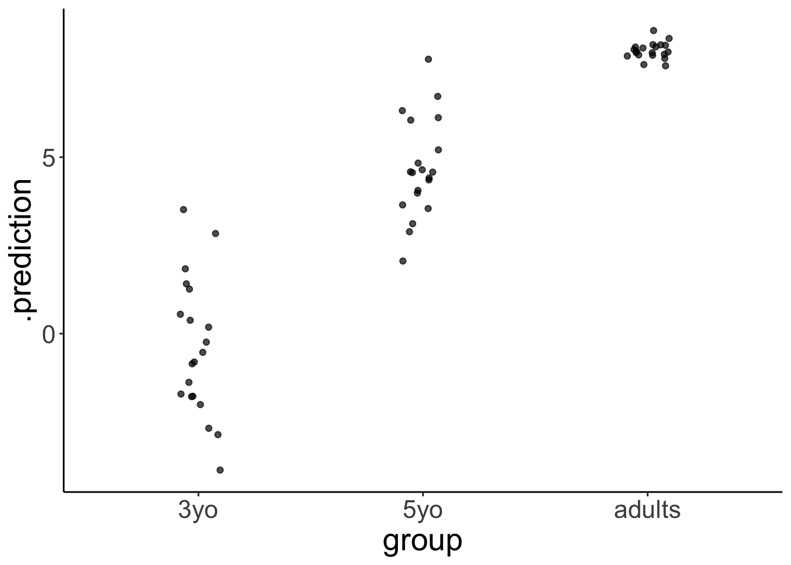
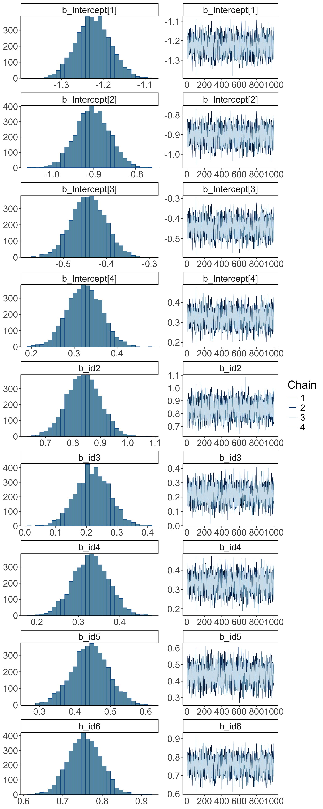

# Bayesian data analysis 3

## Learning goals

- Evidence for null results. 
- Only positive predictors. 
- Dealing with unequal variance. 
- Modeling slider data: Zero-one inflated beta binomial model. 
- Modeling Likert scale data: Ordinal logistic regression. 

## Load packages and set plotting theme


```r
library("knitr")       # for knitting RMarkdown 
library("kableExtra")  # for making nice tables
library("janitor")     # for cleaning column names
library("tidybayes")   # tidying up results from Bayesian models
library("brms")        # Bayesian regression models with Stan
library("patchwork")   # for making figure panels
library("GGally")      # for pairs plot
library("broom.mixed") # for tidy lmer results
library("bayesplot")   # for visualization of Bayesian model fits 
library("modelr")      # for modeling functions
library("lme4")        # for linear mixed effects models 
library("afex")        # for ANOVAs
library("car")         # for ANOVAs
library("emmeans")     # for linear contrasts
library("ggeffects")   # for help with logistic regressions
library("titanic")     # titanic dataset
library("gganimate")   # for animations
library("parameters")  # for getting parameters
library("transformr")  # for gganimate
library("rstanarm")    # for Bayesian models
library("ggrepel")     # for labels in ggplots
library("scales")      # for percent y-axis
library("tidyverse")   # for wrangling, plotting, etc. 
```


```r
theme_set(theme_classic() + #set the theme 
            theme(text = element_text(size = 20))) #set the default text size

# set rstan options
rstan::rstan_options(auto_write = TRUE)
options(mc.cores = parallel::detectCores())

opts_chunk$set(comment = "",
               fig.show = "hold")
```

## Evidence for the null hypothesis

See [this tutorial](https://mvuorre.github.io/posts/2017-03-21-bayes-factors-with-brms/) and this paper [@wagenmakers2010bayesiana] for more information. 

### Bayes factor

#### Fit the model

- Define a binomial model
- Give a uniform prior `beta(1, 1)`
- Get samples from the prior


```r
df.null = tibble(s = 6, k = 10)

fit.brm_bayes = brm(s | trials(k) ~ 0 + Intercept, 
               family = binomial(link = "identity"),
               prior = set_prior("beta(1, 1)", class = "b", lb = 0, ub = 1),
               data = df.null,
               sample_prior = TRUE,
               cores = 4,
               file = "cache/brm_bayes")
```

#### Visualize the results

Visualize the prior and posterior samples: 


```r
fit.brm_bayes %>%
  as_draws_df(variable = "[b]",
              regex = T) %>%
  pivot_longer(cols = -contains(".")) %>% 
  ggplot(mapping = aes(x = value,
                       fill = name)) + 
  geom_density(alpha = 0.5) + 
  scale_fill_brewer(palette = "Set1")
```


```r
fit.brm_bayes %>% 
  as_draws_df(variable = "[b]",
              regex = T)
```

```
# A draws_df: 1000 iterations, 4 chains, and 2 variables
   b_Intercept prior_b
1         0.54   0.480
2         0.49   0.320
3         0.59   0.123
4         0.59   0.567
5         0.66   0.112
6         0.45   0.113
7         0.79   0.828
8         0.63   0.019
9         0.39   0.014
10        0.56   0.602
# ... with 3990 more draws
# ... hidden reserved variables {'.chain', '.iteration', '.draw'}
```


We test the H0: $\theta = 0.5$ versus the H1: $\theta \neq 0.5$ using the Savage-Dickey Method, according to which we can compute the Bayes factor like so:  

$BF_{01} = \frac{p(D|H_0)}{p(D|H_1)} = \frac{p(\theta = 0.5|D, H_1)}{p(\theta = 0.5|H_1)}$


```r
fit.brm_bayes %>% 
  hypothesis(hypothesis = "Intercept = 0.5")
```

```
Hypothesis Tests for class b:
             Hypothesis Estimate Est.Error CI.Lower CI.Upper Evid.Ratio
1 (Intercept)-(0.5) = 0     0.07      0.14     -0.2     0.32       2.22
  Post.Prob Star
1      0.69     
---
'CI': 90%-CI for one-sided and 95%-CI for two-sided hypotheses.
'*': For one-sided hypotheses, the posterior probability exceeds 95%;
for two-sided hypotheses, the value tested against lies outside the 95%-CI.
Posterior probabilities of point hypotheses assume equal prior probabilities.
```

The result shows that the evidence ratio is in favor of the H0 with $BF_{01} = 2.22$. This means that H0 is 2.2 more likely than H1 given the data. 

### LOO

Another way to test different models is to compare them via approximate leave-one-out cross-validation. 


```r
set.seed(1)
df.loo = tibble(x = rnorm(n = 50),
                y = rnorm(n = 50))

# visualize 
ggplot(data = df.loo,
       mapping = aes(x = x, 
                     y = y)) + 
  geom_point()

# fit the frequentist model 
fit.lm_loo = lm(formula = y ~ 1 + x,
                data = df.loo)

fit.lm_loo %>% 
  summary()
```

```

Call:
lm(formula = y ~ 1 + x, data = df.loo)

Residuals:
     Min       1Q   Median       3Q      Max 
-1.92760 -0.66898 -0.00225  0.48768  2.34858 

Coefficients:
            Estimate Std. Error t value Pr(>|t|)
(Intercept)  0.12190    0.13935   0.875    0.386
x           -0.04555    0.16807  -0.271    0.788

Residual standard error: 0.9781 on 48 degrees of freedom
Multiple R-squared:  0.001528,	Adjusted R-squared:  -0.01927 
F-statistic: 0.07345 on 1 and 48 DF,  p-value: 0.7875
```

```r
# fit and compare bayesian models 
fit.brm_loo1 = brm(formula = y ~ 1,
                   data = df.loo,
                   seed = 1, 
                   file = "cache/brm_loo1")

fit.brm_loo2 = brm(formula = y ~ 1 + x,
                   data = df.loo,
                   seed = 1, 
                   file = "cache/brm_loo2")

fit.brm_loo1 = add_criterion(fit.brm_loo1,
                             criterion = "loo",
                             file = "cache/brm_loo1")

fit.brm_loo2 = add_criterion(fit.brm_loo2,
                             criterion = "loo",
                             file = "cache/brm_loo2")

loo_compare(fit.brm_loo1, fit.brm_loo2)
```

```
             elpd_diff se_diff
fit.brm_loo1  0.0       0.0   
fit.brm_loo2 -1.2       0.5   
```

```r
model_weights(fit.brm_loo1, fit.brm_loo2)
```

```
fit.brm_loo1 fit.brm_loo2 
9.999990e-01 9.536955e-07 
```


## Dealing with heteroscedasticity

Let's generate some fake developmental data where the variance in the data is greatest for young children, smaller for older children, and even smaller for adults:  


```r
# make example reproducible 
set.seed(1)

df.variance = tibble(group = rep(c("3yo", "5yo", "adults"), each = 20),
                     response = rnorm(n = 60,
                                      mean = rep(c(0, 5, 8), each = 20),
                                      sd = rep(c(3, 1.5, 0.3), each = 20)))
```

### Visualize the data


```r
df.variance %>%
  ggplot(aes(x = group, y = response)) +
  geom_jitter(height = 0,
              width = 0.1,
              alpha = 0.7)
```


### Frequentist analysis

#### Fit the model


```r
fit.lm_variance = lm(formula = response ~ 1 + group,
                     data = df.variance)

fit.lm_variance %>% 
  summary()
```

```

Call:
lm(formula = response ~ 1 + group, data = df.variance)

Residuals:
    Min      1Q  Median      3Q     Max 
-7.2157 -0.3613  0.0200  0.7001  4.2143 

Coefficients:
            Estimate Std. Error t value Pr(>|t|)    
(Intercept)   0.5716     0.3931   1.454    0.151    
group5yo      4.4187     0.5560   7.948  8.4e-11 ***
groupadults   7.4701     0.5560  13.436  < 2e-16 ***
---
Signif. codes:  0 '***' 0.001 '**' 0.01 '*' 0.05 '.' 0.1 ' ' 1

Residual standard error: 1.758 on 57 degrees of freedom
Multiple R-squared:  0.762,	Adjusted R-squared:  0.7537 
F-statistic: 91.27 on 2 and 57 DF,  p-value: < 2.2e-16
```

```r
fit.lm_variance %>% 
  glance()
```

```
# A tibble: 1 × 12
  r.squared adj.r.squared sigma statistic  p.value    df logLik   AIC   BIC
      <dbl>         <dbl> <dbl>     <dbl>    <dbl> <dbl>  <dbl> <dbl> <dbl>
1     0.762         0.754  1.76      91.3 1.70e-18     2  -117.  243.  251.
# ℹ 3 more variables: deviance <dbl>, df.residual <int>, nobs <int>
```

#### Visualize the model predictions


```r
set.seed(1)

fit.lm_variance %>% 
  simulate() %>% 
  bind_cols(df.variance) %>% 
  ggplot(aes(x = group, y = sim_1)) +
  geom_jitter(height = 0,
              width = 0.1,
              alpha = 0.7)
```


Notice how the model predicts that the variance is equal for each group.

### Bayesian analysis

While frequentist models (such as a linear regression) assume equality of variance, Bayesian models afford us with the flexibility of inferring both the parameter estimates of the groups (i.e. the means and differences between the means), as well as the variances. 

#### Fit the model

We define a multivariate model which tries to fit both the `response` as well as the variance `sigma`: 


```r
fit.brm_variance = brm(formula = bf(response ~ group,
                                    sigma ~ group),
                       data = df.variance,
                       file = "cache/brm_variance",
                       seed = 1)

summary(fit.brm_variance)
```

```
 Family: gaussian 
  Links: mu = identity; sigma = log 
Formula: response ~ group 
         sigma ~ group
   Data: df.variance (Number of observations: 60) 
  Draws: 4 chains, each with iter = 2000; warmup = 1000; thin = 1;
         total post-warmup draws = 4000

Population-Level Effects: 
                  Estimate Est.Error l-95% CI u-95% CI Rhat Bulk_ESS Tail_ESS
Intercept             0.53      0.65    -0.72     1.84 1.00     1250     1764
sigma_Intercept       1.04      0.17     0.72     1.40 1.00     1937     2184
group5yo              4.46      0.73     2.96     5.88 1.00     1505     1877
groupadults           7.51      0.65     6.18     8.79 1.00     1251     1765
sigma_group5yo       -0.74      0.24    -1.23    -0.26 1.00     2111     2195
sigma_groupadults    -2.42      0.23    -2.88    -1.96 1.00     2139     2244

Draws were sampled using sampling(NUTS). For each parameter, Bulk_ESS
and Tail_ESS are effective sample size measures, and Rhat is the potential
scale reduction factor on split chains (at convergence, Rhat = 1).
```

Notice that sigma is on the log scale. To get the standard deviations, we have to exponentiate the predictors, like so:  


```r
fit.brm_variance %>% 
  tidy(parameters = "^b_") %>% 
  filter(str_detect(term, "sigma")) %>% 
  select(term, estimate) %>% 
  mutate(term = str_remove(term, "b_sigma_")) %>% 
  pivot_wider(names_from = term,
              values_from = estimate) %>% 
  clean_names() %>% 
  mutate(across(-intercept, ~ exp(. + intercept))) %>% 
  mutate(intercept = exp(intercept))
```

```
Warning in tidy.brmsfit(., parameters = "^b_"): some parameter names contain
underscores: term naming may be unreliable!
```

```
# A tibble: 1 × 3
  intercept group5yo groupadults
      <dbl>    <dbl>       <dbl>
1      2.82     1.34       0.250
```

#### Visualize the model predictions


```r
df.variance %>%
  expand(group) %>% 
  add_epred_draws(object = fit.brm_variance,
                  dpar = TRUE ) %>%
  select(group,
         .row,
         .draw,
         posterior = .epred,
         mu,
         sigma) %>%
  pivot_longer(cols = c(mu, sigma),
               names_to = "index",
               values_to = "value") %>% 
  ggplot(aes(x = value, y = group)) +
  stat_halfeye() +
  geom_vline(xintercept = 0,
             linetype = "dashed") +
  facet_grid(cols = vars(index))
```


This plot shows what the posterior looks like for both mu (the inferred means), and for sigma (the inferred variances) for the different groups. 


```r
set.seed(1)

df.variance %>% 
  add_predicted_draws(object = fit.brm_variance,
                      ndraws = 1) %>% 
  ggplot(aes(x = group, y = .prediction)) +
  geom_jitter(height = 0,
              width = 0.1,
              alpha = 0.7)
```



## Zero-one inflated beta binomial model

See this [blog post](https://mvuorre.github.io/posts/2019-02-18-analyze-analog-scale-ratings-with-zero-one-inflated-beta-models/). 

## Ordinal regression

Check out the following two papers: 

- @liddell2018analyzin
- @burkner2019ordinal

Let's read in some movie ratings: 


```r
df.movies = read_csv(file = "data/MoviesData.csv")

df.movies = df.movies %>% 
  pivot_longer(cols = n1:n5,
               names_to = "stars",
               values_to = "rating") %>% 
  mutate(stars = str_remove(stars,"n"),
         stars = as.numeric(stars))

df.movies = df.movies %>% 
  uncount(weights = rating) %>% 
  mutate(id = as.factor(ID)) %>% 
  filter(ID <= 6)
```

### Ordinal regression (assuming equal variance)

#### Fit the model


```r
fit.brm_ordinal = brm(formula = stars ~ 1 + id,
                      family = cumulative(link = "probit"),
                      data = df.movies,
                      file = "cache/brm_ordinal",
                      seed = 1)

summary(fit.brm_ordinal)
```

```
 Family: cumulative 
  Links: mu = probit; disc = identity 
Formula: stars ~ 1 + id 
   Data: df.movies (Number of observations: 21708) 
  Draws: 4 chains, each with iter = 2000; warmup = 1000; thin = 1;
         total post-warmup draws = 4000

Population-Level Effects: 
             Estimate Est.Error l-95% CI u-95% CI Rhat Bulk_ESS Tail_ESS
Intercept[1]    -1.22      0.04    -1.30    -1.14 1.00     1933     2237
Intercept[2]    -0.90      0.04    -0.98    -0.82 1.00     1863     2325
Intercept[3]    -0.44      0.04    -0.52    -0.36 1.00     1823     2409
Intercept[4]     0.32      0.04     0.25     0.40 1.00     1803     2243
id2              0.84      0.06     0.72     0.96 1.00     2420     2867
id3              0.22      0.06     0.11     0.33 1.00     2154     2752
id4              0.33      0.04     0.25     0.41 1.00     1866     2536
id5              0.44      0.05     0.34     0.55 1.00     2224     2514
id6              0.76      0.04     0.67     0.83 1.00     1828     2412

Family Specific Parameters: 
     Estimate Est.Error l-95% CI u-95% CI Rhat Bulk_ESS Tail_ESS
disc     1.00      0.00     1.00     1.00   NA       NA       NA

Draws were sampled using sampling(NUTS). For each parameter, Bulk_ESS
and Tail_ESS are effective sample size measures, and Rhat is the potential
scale reduction factor on split chains (at convergence, Rhat = 1).
```

#### Visualizations

##### Model parameters

The model infers the thresholds and the means of the Gaussian distributions in latent space. 


```r
df.params = fit.brm_ordinal %>% 
  parameters(centrality = "mean") %>% 
  as_tibble() %>% 
  clean_names() %>% 
  select(term = parameter, estimate = mean)

ggplot(data = tibble(x = c(-3, 3)),
       mapping = aes(x = x)) + 
  stat_function(fun = ~ dnorm(.),
                size = 1,
                color = "black") +
  stat_function(fun = ~ dnorm(., mean = df.params %>% 
                                filter(str_detect(term, "id2")) %>% 
                                pull(estimate)),
                size = 1,
                color = "blue") +
  geom_vline(xintercept = df.params %>% 
               filter(str_detect(term, "Intercept")) %>% 
               pull(estimate))
```


##### MCMC inference


```r
fit.brm_ordinal %>% 
  plot(N = 9,
       variable = "^b_",
       regex = T)
```




```r
fit.brm_ordinal %>% 
  pp_check(ndraws = 20)
```


##### Model predictions


```r
conditional_effects(fit.brm_ordinal,
                    effects = "id",
                    categorical = T)
```


```r
df.model = add_epred_draws(newdata = expand_grid(id = 1:6),
                           object = fit.brm_ordinal,
                           ndraws = 10)

df.plot = df.movies %>% 
  count(id, stars) %>% 
  group_by(id) %>% 
  mutate(p = n / sum(n)) %>% 
  mutate(stars = as.factor(stars))

ggplot(data = df.plot,
       mapping = aes(x = stars,
                     y = p)) +
  geom_col(color = "black",
           fill = "lightblue") +
  geom_point(data = df.model,
             mapping = aes(x = .category,
                           y = .epred),
             alpha = 0.3,
             position = position_jitter(width = 0.3)) +
  facet_wrap(~id, ncol = 6) 
```

```
Warning: Combining variables of class <factor> and <integer> was deprecated in ggplot2 3.4.0.
ℹ Please ensure your variables are compatible before plotting (location: `combine_vars()`)
This warning is displayed once every 8 hours.
Call `lifecycle::last_lifecycle_warnings()` to see where this warning was generated.
```

```
Warning: Combining variables of class <integer> and <factor> was deprecated in ggplot2 3.4.0.
ℹ Please ensure your variables are compatible before plotting (location: `combine_vars()`)
This warning is displayed once every 8 hours.
Call `lifecycle::last_lifecycle_warnings()` to see where this warning was generated.
```


### Gaussian regression (assuming equal variance)

#### Fit the model


```r
fit.brm_metric = brm(formula = stars ~ 1 + id,
                     data = df.movies,
                     file = "cache/brm_metric",
                     seed = 1)

summary(fit.brm_metric)
```

```
 Family: gaussian 
  Links: mu = identity; sigma = identity 
Formula: stars ~ 1 + id 
   Data: df.movies (Number of observations: 21708) 
  Draws: 4 chains, each with iter = 2000; warmup = 1000; thin = 1;
         total post-warmup draws = 4000

Population-Level Effects: 
          Estimate Est.Error l-95% CI u-95% CI Rhat Bulk_ESS Tail_ESS
Intercept     3.77      0.04     3.70     3.85 1.00     1222     1855
id2           0.64      0.05     0.54     0.75 1.00     1557     2242
id3           0.20      0.05     0.10     0.30 1.00     1598     2383
id4           0.37      0.04     0.29     0.45 1.00     1306     2183
id5           0.30      0.05     0.20     0.39 1.00     1495     2069
id6           0.72      0.04     0.64     0.79 1.00     1251     1847

Family Specific Parameters: 
      Estimate Est.Error l-95% CI u-95% CI Rhat Bulk_ESS Tail_ESS
sigma     1.00      0.00     0.99     1.01 1.00     3886     2720

Draws were sampled using sampling(NUTS). For each parameter, Bulk_ESS
and Tail_ESS are effective sample size measures, and Rhat is the potential
scale reduction factor on split chains (at convergence, Rhat = 1).
```

#### Visualizations

##### Model predictions


```r
# get the predictions for each value of the Likert scale 
df.model = fit.brm_metric %>% 
  parameters(centrality = "mean") %>% 
  as_tibble() %>% 
  select(term = Parameter, estimate = Mean) %>% 
  mutate(term = str_remove(term, "b_")) %>% 
  pivot_wider(names_from = term,
              values_from = estimate) %>% 
  clean_names() %>%
  mutate(across(.cols = id2:id6,
                .fns = ~ . + intercept)) %>% 
  rename_with(.fn = ~ c(str_c("mu_", 1:6), "sigma")) %>% 
  pivot_longer(cols = contains("mu"),
               names_to = c("parameter", "movie"),
               names_sep = "_",
               values_to = "value") %>% 
  pivot_wider(names_from = parameter, 
              values_from = value) %>% 
  mutate(data = map2(.x = mu, 
                     .y = sigma,
                     .f = ~ tibble(x = 1:5,
                                   y  = dnorm(x,
                                              mean = .x,
                                              sd = .y)))) %>% 
  select(movie, data) %>% 
  unnest(c(data)) %>% 
  group_by(movie) %>% 
  mutate(y = y/sum(y)) %>% 
  ungroup() %>% 
  rename(id = movie)

# visualize the predictions 
df.plot = df.movies %>% 
  count(id, stars) %>% 
  group_by(id) %>% 
  mutate(p = n / sum(n)) %>% 
  mutate(stars = as.factor(stars))

ggplot(data = df.plot,
       mapping = aes(x = stars,
                     y = p)) +
  geom_col(color = "black",
           fill = "lightblue") +
  geom_point(data = df.model,
            mapping = aes(x = x,
                          y = y)) +
  facet_wrap(~id, ncol = 6) 
```


### Oridnal regression (unequal variance)

#### Fit the model


```r
fit.brm_ordinal_variance = brm(formula = bf(stars ~ 1 + id) + 
                                 lf(disc ~ 0 + id, cmc = FALSE),
                               family = cumulative(link = "probit"),
                               data = df.movies,
                               file = "cache/brm_ordinal_variance",
                               seed = 1)

summary(fit.brm_ordinal_variance)
```

```
 Family: cumulative 
  Links: mu = probit; disc = log 
Formula: stars ~ 1 + id 
         disc ~ 0 + id
   Data: df.movies (Number of observations: 21708) 
  Draws: 4 chains, each with iter = 2000; warmup = 1000; thin = 1;
         total post-warmup draws = 4000

Population-Level Effects: 
             Estimate Est.Error l-95% CI u-95% CI Rhat Bulk_ESS Tail_ESS
Intercept[1]    -1.41      0.06    -1.52    -1.29 1.00     1508     2216
Intercept[2]    -1.00      0.05    -1.10    -0.90 1.00     2031     2699
Intercept[3]    -0.46      0.04    -0.54    -0.38 1.00     2682     2999
Intercept[4]     0.41      0.05     0.32     0.50 1.00      991     2003
id2              2.71      0.31     2.15     3.39 1.00     1581     2132
id3              0.33      0.07     0.19     0.48 1.00     1579     2163
id4              0.36      0.05     0.26     0.45 1.00     1102     1991
id5              1.63      0.18     1.31     1.99 1.00     1495     2009
id6              0.86      0.06     0.74     0.97 1.00      815     1655
disc_id2        -1.12      0.10    -1.32    -0.94 1.00     1550     2349
disc_id3        -0.23      0.06    -0.34    -0.11 1.00     1231     2279
disc_id4        -0.01      0.04    -0.09     0.08 1.00      778     1500
disc_id5        -1.09      0.07    -1.23    -0.95 1.00     1389     2174
disc_id6        -0.07      0.04    -0.15     0.01 1.00      770     1297

Draws were sampled using sampling(NUTS). For each parameter, Bulk_ESS
and Tail_ESS are effective sample size measures, and Rhat is the potential
scale reduction factor on split chains (at convergence, Rhat = 1).
```

#### Visualizations

##### Model parameters


```r
df.params = fit.brm_ordinal_variance %>% 
  tidy(parameters = "^b_") %>% 
  select(term, estimate) %>% 
  mutate(term = str_remove(term, "b_"))
```

```
Warning in tidy.brmsfit(., parameters = "^b_"): some parameter names contain
underscores: term naming may be unreliable!
```

```r
ggplot(data = tibble(x = c(-3, 3)),
       mapping = aes(x = x)) + 
  stat_function(fun = ~ dnorm(.),
                size = 1,
                color = "black") +
  stat_function(fun = ~ dnorm(.,
                              mean = 1,
                              sd = 2),
                size = 1,
                color = "blue") +
  geom_vline(xintercept = df.params %>% 
               filter(str_detect(term, "Intercept")) %>% 
               pull(estimate))
```


##### Model predictions


```r
df.model = add_epred_draws(newdata = expand_grid(id = 1:6),
                           object = fit.brm_ordinal_variance,
                           ndraws = 10)

df.plot = df.movies %>% 
  count(id, stars) %>% 
  group_by(id) %>% 
  mutate(p = n / sum(n)) %>% 
  mutate(stars = as.factor(stars))
  
ggplot(data = df.plot,
       mapping = aes(x = stars,
                     y = p)) +
  geom_col(color = "black",
           fill = "lightblue") +
  geom_point(data = df.model,
             mapping = aes(x = .category,
                           y = .epred),
             alpha = 0.3,
             position = position_jitter(width = 0.3)) +
  facet_wrap(~id, ncol = 6) 
```


### Gaussian regression (unequal variance)

#### Fit the model


```r
fit.brm_metric_variance = brm(formula = bf(stars ~ 1 + id,
                            sigma ~ 1 + id),
               data = df.movies,
               file = "cache/brm_metric_variance",
               seed = 1)

summary(fit.brm_metric_variance)
```

```
 Family: gaussian 
  Links: mu = identity; sigma = log 
Formula: stars ~ 1 + id 
         sigma ~ 1 + id
   Data: df.movies (Number of observations: 21708) 
  Draws: 4 chains, each with iter = 2000; warmup = 1000; thin = 1;
         total post-warmup draws = 4000

Population-Level Effects: 
                Estimate Est.Error l-95% CI u-95% CI Rhat Bulk_ESS Tail_ESS
Intercept           3.77      0.05     3.68     3.86 1.00     1636     2210
sigma_Intercept     0.20      0.03     0.15     0.26 1.00     1743     2134
id2                 0.64      0.06     0.51     0.77 1.00     2375     2783
id3                 0.20      0.06     0.07     0.33 1.00     2178     2703
id4                 0.37      0.05     0.27     0.46 1.00     1764     2679
id5                 0.30      0.06     0.18     0.42 1.00     2109     2775
id6                 0.72      0.05     0.63     0.81 1.00     1626     2317
sigma_id2           0.02      0.04    -0.05     0.09 1.00     2142     2895
sigma_id3           0.03      0.04    -0.05     0.10 1.00     2217     2338
sigma_id4          -0.14      0.03    -0.20    -0.08 1.00     1822     2188
sigma_id5           0.20      0.03     0.13     0.27 1.00     2110     2391
sigma_id6          -0.35      0.03    -0.40    -0.29 1.00     1758     2113

Draws were sampled using sampling(NUTS). For each parameter, Bulk_ESS
and Tail_ESS are effective sample size measures, and Rhat is the potential
scale reduction factor on split chains (at convergence, Rhat = 1).
```

#### Visualizations

##### Model predictions


```r
df.model = fit.brm_metric_variance %>% 
  tidy(parameters = "^b_") %>% 
  select(term, estimate) %>% 
  mutate(term = str_remove(term, "b_")) %>% 
  pivot_wider(names_from = term,
              values_from = estimate) %>% 
  clean_names() %>%
  mutate(across(.cols = c(id2:id6),
                .fns = ~ . + intercept)) %>% 
  mutate(across(.cols = contains("sigma"),
                .fns = ~ 1/exp(.))) %>% 
  mutate(across(.cols = c(sigma_id2:sigma_id5),
                .fns = ~ . + sigma_intercept)) %>% 
  set_names(c("mu_1", "sigma_1", str_c("mu_", 2:6), str_c("sigma_", 2:6))) %>% 
  pivot_longer(cols = everything(),
               names_to = c("parameter", "movie"),
               names_sep = "_",
               values_to = "value") %>% 
  pivot_wider(names_from = parameter, 
              values_from = value) %>% 
  mutate(data = map2(.x = mu,
                     .y = sigma,
                     .f = ~ tibble(x = 1:5,
                                   y  = dnorm(x,
                                              mean = .x,
                                              sd = .y)))) %>% 
  select(movie, data) %>% 
  unnest(c(data)) %>% 
  group_by(movie) %>% 
  mutate(y = y/sum(y)) %>% 
  ungroup() %>% 
  rename(id = movie)
```

```
Warning in tidy.brmsfit(., parameters = "^b_"): some parameter names contain
underscores: term naming may be unreliable!
```

```r
df.plot = df.movies %>% 
  count(id, stars) %>% 
  group_by(id) %>% 
  mutate(p = n / sum(n)) %>% 
  mutate(stars = as.factor(stars))

ggplot(data = df.plot,
       mapping = aes(x = stars,
                     y = p)) +
  geom_col(color = "black",
           fill = "lightblue") +
  geom_point(data = df.model,
             mapping = aes(x = x,
                           y = y)) +
  facet_wrap(~id, ncol = 6) 
```


### Model comparison


```r
# currently not working 

# ordinal regression with equal variance 
fit.brm_ordinal = add_criterion(fit.brm_ordinal,
                                criterion = "loo",
                                file = "cache/brm_ordinal")

# Gaussian regression with equal variance
fit.brm_ordinal_variance = add_criterion(fit.brm_ordinal_variance,
                                         criterion = "loo",
                                         file = "cache/brm_ordinal_variance")

loo_compare(fit.brm_ordinal, fit.brm_ordinal_variance)
```

## Additional resources

- [Tutorial on visualizing brms posteriors with tidybayes](https://mjskay.github.io/tidybayes/articles/tidy-brms.html)
- [Hypothetical outcome plots](https://mucollective.northwestern.edu/files/2018-HOPsTrends-InfoVis.pdf)
- [Visual MCMC diagnostics](https://cran.r-project.org/web/packages/bayesplot/vignettes/visual-mcmc-diagnostics.html#general-mcmc-diagnostics)
- [Visualiztion of different MCMC algorithms](https://chi-feng.github.io/mcmc-demo/)


For additional resources, I highly recommend the brms and tidyverse implementations of the Statistical rethinking book [@mcelreath2020statistical], as well as of the Doing Bayesian Data analysis book [@kruschke2014doing], by Solomon Kurz [@kurz2020statistical; @kurz2022doingbayesian]. 


## Session info

Information about this R session including which version of R was used, and what packages were loaded.


```r
sessionInfo()
```

```
R version 4.3.2 (2023-10-31)
Platform: aarch64-apple-darwin20 (64-bit)
Running under: macOS Sonoma 14.1.2

Matrix products: default
BLAS:   /Library/Frameworks/R.framework/Versions/4.3-arm64/Resources/lib/libRblas.0.dylib 
LAPACK: /Library/Frameworks/R.framework/Versions/4.3-arm64/Resources/lib/libRlapack.dylib;  LAPACK version 3.11.0

locale:
[1] en_US.UTF-8/en_US.UTF-8/en_US.UTF-8/C/en_US.UTF-8/en_US.UTF-8

time zone: America/Los_Angeles
tzcode source: internal

attached base packages:
[1] stats     graphics  grDevices utils     datasets  methods   base     

other attached packages:
 [1] lubridate_1.9.3       forcats_1.0.0         stringr_1.5.1        
 [4] dplyr_1.1.4           purrr_1.0.2           readr_2.1.4          
 [7] tidyr_1.3.0           tibble_3.2.1          tidyverse_2.0.0      
[10] scales_1.3.0          ggrepel_0.9.4         rstanarm_2.26.1      
[13] transformr_0.1.4.9000 parameters_0.21.3     gganimate_1.0.8      
[16] titanic_0.1.0         ggeffects_1.3.4       emmeans_1.9.0        
[19] car_3.1-2             carData_3.0-5         afex_1.3-0           
[22] lme4_1.1-35.1         Matrix_1.6-4          modelr_0.1.11        
[25] bayesplot_1.10.0      broom.mixed_0.2.9.4   GGally_2.2.0         
[28] ggplot2_3.4.4         patchwork_1.1.3       brms_2.20.4          
[31] Rcpp_1.0.11           tidybayes_3.0.6       janitor_2.2.0        
[34] kableExtra_1.3.4      knitr_1.45           

loaded via a namespace (and not attached):
  [1] svUnit_1.0.6         shinythemes_1.2.0    splines_4.3.2       
  [4] later_1.3.2          datawizard_0.9.1     xts_0.13.1          
  [7] lifecycle_1.0.4      sf_1.0-15            StanHeaders_2.26.28 
 [10] vroom_1.6.5          globals_0.16.2       lattice_0.22-5      
 [13] MASS_7.3-60          insight_0.19.7       crosstalk_1.2.1     
 [16] ggdist_3.3.1         backports_1.4.1      magrittr_2.0.3      
 [19] sass_0.4.8           rmarkdown_2.25       jquerylib_0.1.4     
 [22] yaml_2.3.8           httpuv_1.6.13        pkgbuild_1.4.3      
 [25] DBI_1.2.0            minqa_1.2.6          RColorBrewer_1.1-3  
 [28] abind_1.4-5          rvest_1.0.3          tensorA_0.36.2.1    
 [31] tweenr_2.0.2         inline_0.3.19        listenv_0.9.0       
 [34] units_0.8-5          bridgesampling_1.1-2 parallelly_1.36.0   
 [37] svglite_2.1.3        codetools_0.2-19     DT_0.31             
 [40] xml2_1.3.6           tidyselect_1.2.0     farver_2.1.1        
 [43] matrixStats_1.2.0    stats4_4.3.2         base64enc_0.1-3     
 [46] webshot_0.5.5        jsonlite_1.8.8       e1071_1.7-14        
 [49] ellipsis_0.3.2       survival_3.5-7       systemfonts_1.0.5   
 [52] tools_4.3.2          progress_1.2.3       glue_1.6.2          
 [55] gridExtra_2.3        xfun_0.41            distributional_0.3.2
 [58] loo_2.6.0            withr_2.5.2          numDeriv_2016.8-1.1 
 [61] fastmap_1.1.1        boot_1.3-28.1        fansi_1.0.6         
 [64] shinyjs_2.1.0        digest_0.6.33        timechange_0.2.0    
 [67] R6_2.5.1             mime_0.12            estimability_1.4.1  
 [70] colorspace_2.1-0     lpSolve_5.6.20       gtools_3.9.5        
 [73] markdown_1.12        threejs_0.3.3        utf8_1.2.4          
 [76] generics_0.1.3       class_7.3-22         prettyunits_1.2.0   
 [79] httr_1.4.7           htmlwidgets_1.6.4    ggstats_0.5.1       
 [82] pkgconfig_2.0.3      dygraphs_1.1.1.6     gtable_0.3.4        
 [85] furrr_0.3.1          htmltools_0.5.7      bookdown_0.37       
 [88] posterior_1.5.0      snakecase_0.11.1     rstudioapi_0.15.0   
 [91] tzdb_0.4.0           reshape2_1.4.4       coda_0.19-4         
 [94] checkmate_2.3.1      nlme_3.1-164         curl_5.2.0          
 [97] nloptr_2.0.3         proxy_0.4-27         cachem_1.0.8        
[100] zoo_1.8-12           KernSmooth_2.23-22   parallel_4.3.2      
[103] miniUI_0.1.1.1       pillar_1.9.0         grid_4.3.2          
[106] vctrs_0.6.5          shinystan_2.6.0      promises_1.2.1      
[109] arrayhelpers_1.1-0   xtable_1.8-4         evaluate_0.23       
[112] mvtnorm_1.2-4        cli_3.6.2            compiler_4.3.2      
[115] rlang_1.1.2          crayon_1.5.2         rstantools_2.3.1.1  
[118] labeling_0.4.3       classInt_0.4-10      plyr_1.8.9          
[121] stringi_1.8.3        rstan_2.32.3         viridisLite_0.4.2   
[124] QuickJSR_1.0.9       lmerTest_3.1-3       munsell_0.5.0       
[127] colourpicker_1.3.0   Brobdingnag_1.2-9    bayestestR_0.13.1   
[130] V8_4.4.1             hms_1.1.3            bit64_4.0.5         
[133] future_1.33.1        shiny_1.8.0          highr_0.10          
[136] igraph_1.6.0         broom_1.0.5          RcppParallel_5.1.7  
[139] bslib_0.6.1          bit_4.0.5           
```
