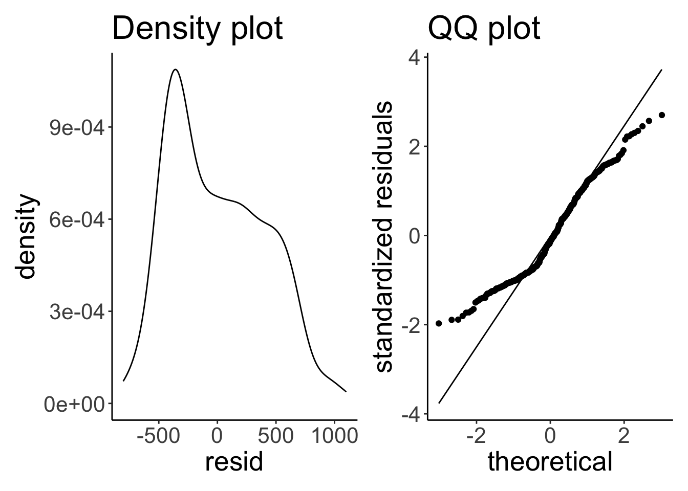
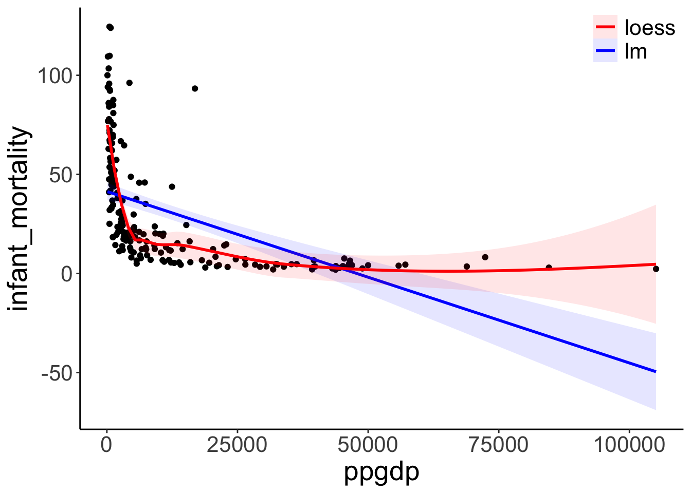
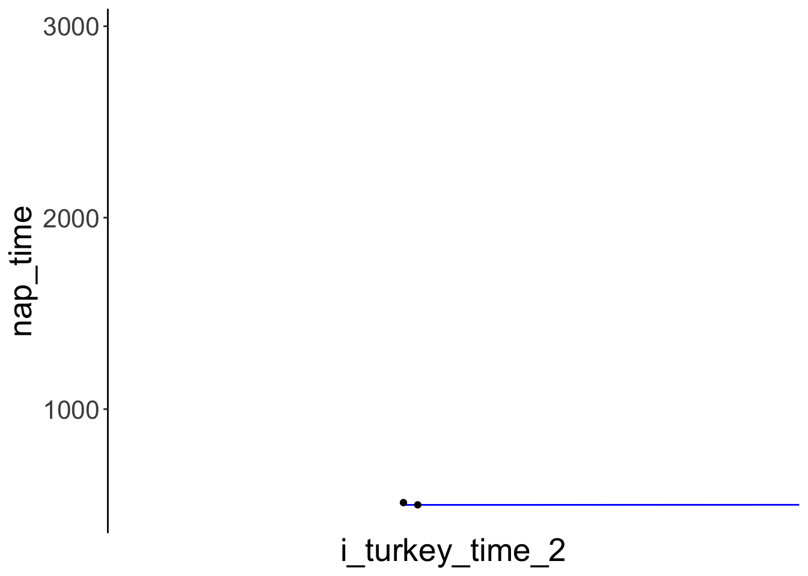

# Model assumptions

## Learning goals 

- Review model assumptions.
- Explore how to test for model assumptions. 
- What to do if model assumptions aren't met. 

## Load packages and set plotting theme  


``` r
library("knitr")      # for knitting RMarkdown 
library("kableExtra") # for nice RMarkdown tables
library("tidybayes")  # tidying up results from Bayesian models
library("lme4")       # for linear mixed effects models 
library("brms")       # Bayesian regression models with Stan
library("car")        # for bootstrapping regression models 
library("broom")      # for tidy regression results
library("janitor")    # for cleaning up variable names 
library("patchwork")  # for figure panels
library("ggeffects")  # for visualizing estimated marginal means
library("stargazer")  # for latex regression tables 
library("sjPlot")     # for nice RMarkdown regression tables
library("xtable")     # for latex tables
library("ggrepel")    # for smart text annotation in ggplot
library("tidyverse")  # for wrangling, plotting, etc. 
```


``` r
theme_set(theme_classic() + #set the theme 
            theme(text = element_text(size = 20))) #set the default text size

# set rstan options
rstan::rstan_options(auto_write = TRUE)
options(mc.cores = parallel::detectCores())
```

## Model assumptions and what to do if they are violated 

"Regression diagnostics are methods for determining whether a fitted regression model adequately represents the data." (p. 385) [@fox2018r]

### Influential data points 

Because linear regression models are fitted by minimizing the squared error between prediction and data, the results can be strongly influenced by outliers. There are a number of ways of checking for outliers. 

#### Leverage: Hat-values 

Data points that are far from the center of the predictor space have potentially greater influence on the results -- these points have *high leverage*. hat-values are a way of characterizing how much influence individual data points have.


``` r
df.credit = read_csv("data/credit.csv") %>% 
  clean_names()

fit.credit = lm(formula = balance ~ income,
                data = df.credit)

# fit model without the data point of interest 
fit.credit2 = update(fit.credit,
                     data = df.credit %>% 
                       filter(x1 != 324))

res_with_outlier = fit.credit %>% 
  augment() %>% 
  filter(row_number() == 324) %>% 
  pull(.resid)

res_without_outlier = fit.credit2 %>% 
  augment(newdata = df.credit) %>% 
  mutate(.resid = balance - .fitted) %>% 
  filter(row_number() == 324) %>% 
  pull(.resid)

hat1 = 1 - (res_with_outlier/res_without_outlier) %>% 
  round(3)

hat2 = fit.credit %>% 
  augment() %>% 
  filter(row_number() == 324) %>% 
  pull(.hat) %>% 
  round(3)

print(str_c("hat1: ", hat1))
```

```
## [1] "hat1: 0.041"
```

``` r
print(str_c("hat2: ", hat2))
```

```
## [1] "hat2: 0.041"
```

Cook's distance is defined as 

$$D_i = \frac{e^2_{Si}}{k + 1} \times \frac{h_i}{1-h_1}$$,

where $e^2_{Si}$ is the squared standardized residual, $k$ is the number of coefficients in the model (excluding the intercept), and $h_i$ is the hat-value for case $i$. 

Let's double check here: 


``` r
fit.credit %>% 
  augment() %>% 
  mutate(cook = ((.std.resid^2)/(2 + 1)) * (.hat/(1 - .hat))) %>% 
  select(contains("cook")) %>% 
  head(10)
```

```
## # A tibble: 10 × 2
##        .cooksd        cook
##          <dbl>       <dbl>
##  1 0.000000169 0.000000113
##  2 0.00000706  0.00000471 
##  3 0.00264     0.00176    
##  4 0.00257     0.00171    
##  5 0.000530    0.000353   
##  6 0.00265     0.00177    
##  7 0.000324    0.000216   
##  8 0.000441    0.000294   
##  9 0.0000457   0.0000304  
## 10 0.00529     0.00353
```

Looking good! 


``` r
fit.credit %>% 
  augment() %>% 
  ggplot(aes(x = .hat,
             y = .std.resid)) + 
  geom_point() +
  geom_line(aes(y = .cooksd),
            color = "red")
```


##### Toy example  

Generate some data with an outlier. 


``` r
set.seed(1)
df.hat = tibble(x = runif(n = 5),
                y = 10 * x + rnorm(n = 5, sd = 2)) %>% 
  bind_rows(tibble(x = 0.7,
                   y = 15)) %>% 
  mutate(index = 1:n())
```

Illustrate the hat-values and cook's distance. 


``` r
fit.hat = lm(formula = y ~ x,
             data = df.hat)

fit.hat %>% 
  augment() %>% 
  mutate(index = 1:n()) %>% 
  ggplot(aes(x = .hat,
             y = .std.resid)) + 
  geom_point() +
  geom_line(aes(y = .cooksd),
            color = "red") +
  geom_text(aes(label = index),
            nudge_y = -0.2)
```


Illustrate what the regression line looks like when all points are fit vs. one of the points is excluded. 


``` r
ggplot(data = df.hat,
       mapping = aes(x = x,
                     y = y)) + 
  geom_point(size = 2) + 
  geom_smooth(method = "lm",
              se = F,
              color = "blue") + 
  geom_smooth(data = df.hat %>% 
                filter(index != 6),
                method = "lm",
              se = F,
              color = "red")
```

```
## `geom_smooth()` using formula = 'y ~ x'
## `geom_smooth()` using formula = 'y ~ x'
```


Summary of each observation. 


``` r
fit.hat %>% 
  augment() %>% 
  clean_names() %>% 
  kable(digits = 2) %>% 
  kable_styling()
```

<table class="table" style="margin-left: auto; margin-right: auto;">
 <thead>
  <tr>
   <th style="text-align:right;"> y </th>
   <th style="text-align:right;"> x </th>
   <th style="text-align:right;"> fitted </th>
   <th style="text-align:right;"> resid </th>
   <th style="text-align:right;"> hat </th>
   <th style="text-align:right;"> sigma </th>
   <th style="text-align:right;"> cooksd </th>
   <th style="text-align:right;"> std_resid </th>
  </tr>
 </thead>
<tbody>
  <tr>
   <td style="text-align:right;"> 5.20 </td>
   <td style="text-align:right;"> 0.27 </td>
   <td style="text-align:right;"> 3.58 </td>
   <td style="text-align:right;"> 1.62 </td>
   <td style="text-align:right;"> 0.32 </td>
   <td style="text-align:right;"> 5.00 </td>
   <td style="text-align:right;"> 0.05 </td>
   <td style="text-align:right;"> 0.44 </td>
  </tr>
  <tr>
   <td style="text-align:right;"> 4.55 </td>
   <td style="text-align:right;"> 0.37 </td>
   <td style="text-align:right;"> 4.67 </td>
   <td style="text-align:right;"> -0.12 </td>
   <td style="text-align:right;"> 0.21 </td>
   <td style="text-align:right;"> 5.12 </td>
   <td style="text-align:right;"> 0.00 </td>
   <td style="text-align:right;"> -0.03 </td>
  </tr>
  <tr>
   <td style="text-align:right;"> 2.65 </td>
   <td style="text-align:right;"> 0.57 </td>
   <td style="text-align:right;"> 6.72 </td>
   <td style="text-align:right;"> -4.07 </td>
   <td style="text-align:right;"> 0.18 </td>
   <td style="text-align:right;"> 4.42 </td>
   <td style="text-align:right;"> 0.11 </td>
   <td style="text-align:right;"> -1.01 </td>
  </tr>
  <tr>
   <td style="text-align:right;"> 7.22 </td>
   <td style="text-align:right;"> 0.91 </td>
   <td style="text-align:right;"> 10.13 </td>
   <td style="text-align:right;"> -2.91 </td>
   <td style="text-align:right;"> 0.61 </td>
   <td style="text-align:right;"> 4.37 </td>
   <td style="text-align:right;"> 0.84 </td>
   <td style="text-align:right;"> -1.05 </td>
  </tr>
  <tr>
   <td style="text-align:right;"> 1.43 </td>
   <td style="text-align:right;"> 0.20 </td>
   <td style="text-align:right;"> 2.93 </td>
   <td style="text-align:right;"> -1.51 </td>
   <td style="text-align:right;"> 0.41 </td>
   <td style="text-align:right;"> 5.00 </td>
   <td style="text-align:right;"> 0.07 </td>
   <td style="text-align:right;"> -0.44 </td>
  </tr>
  <tr>
   <td style="text-align:right;"> 15.00 </td>
   <td style="text-align:right;"> 0.70 </td>
   <td style="text-align:right;"> 8.01 </td>
   <td style="text-align:right;"> 6.99 </td>
   <td style="text-align:right;"> 0.27 </td>
   <td style="text-align:right;"> 1.98 </td>
   <td style="text-align:right;"> 0.63 </td>
   <td style="text-align:right;"> 1.84 </td>
  </tr>
</tbody>
</table>

Compute cook's distance 


``` r
fit.hat_with = lm(formula = y ~ x,
                  data = df.hat)

fit.hat_without = lm(formula = y ~ x,
                     data = df.hat %>% 
                       filter(index != 6))

residual_without = fit.hat_without %>% 
  augment(newdata = df.hat) %>% 
  clean_names() %>% 
  mutate(resid = y - fitted) %>% 
  filter(row_number() == 6) %>% 
  pull(resid)

residual_with = fit.hat %>% 
  augment() %>% 
  clean_names() %>% 
  filter(row_number() == 6) %>% 
  pull(resid)

hat = 1 - (residual_with/residual_without)
hat
```

```
## [1] 0.270516
```

### Linear and additive 


``` r
df.car = mtcars
```


``` r
df.car %>% 
  head(6) %>% 
  kable(digits = 2) %>% 
  kable_styling()
```

<table class="table" style="margin-left: auto; margin-right: auto;">
 <thead>
  <tr>
   <th style="text-align:left;">  </th>
   <th style="text-align:right;"> mpg </th>
   <th style="text-align:right;"> cyl </th>
   <th style="text-align:right;"> disp </th>
   <th style="text-align:right;"> hp </th>
   <th style="text-align:right;"> drat </th>
   <th style="text-align:right;"> wt </th>
   <th style="text-align:right;"> qsec </th>
   <th style="text-align:right;"> vs </th>
   <th style="text-align:right;"> am </th>
   <th style="text-align:right;"> gear </th>
   <th style="text-align:right;"> carb </th>
  </tr>
 </thead>
<tbody>
  <tr>
   <td style="text-align:left;"> Mazda RX4 </td>
   <td style="text-align:right;"> 21.0 </td>
   <td style="text-align:right;"> 6 </td>
   <td style="text-align:right;"> 160 </td>
   <td style="text-align:right;"> 110 </td>
   <td style="text-align:right;"> 3.90 </td>
   <td style="text-align:right;"> 2.62 </td>
   <td style="text-align:right;"> 16.46 </td>
   <td style="text-align:right;"> 0 </td>
   <td style="text-align:right;"> 1 </td>
   <td style="text-align:right;"> 4 </td>
   <td style="text-align:right;"> 4 </td>
  </tr>
  <tr>
   <td style="text-align:left;"> Mazda RX4 Wag </td>
   <td style="text-align:right;"> 21.0 </td>
   <td style="text-align:right;"> 6 </td>
   <td style="text-align:right;"> 160 </td>
   <td style="text-align:right;"> 110 </td>
   <td style="text-align:right;"> 3.90 </td>
   <td style="text-align:right;"> 2.88 </td>
   <td style="text-align:right;"> 17.02 </td>
   <td style="text-align:right;"> 0 </td>
   <td style="text-align:right;"> 1 </td>
   <td style="text-align:right;"> 4 </td>
   <td style="text-align:right;"> 4 </td>
  </tr>
  <tr>
   <td style="text-align:left;"> Datsun 710 </td>
   <td style="text-align:right;"> 22.8 </td>
   <td style="text-align:right;"> 4 </td>
   <td style="text-align:right;"> 108 </td>
   <td style="text-align:right;"> 93 </td>
   <td style="text-align:right;"> 3.85 </td>
   <td style="text-align:right;"> 2.32 </td>
   <td style="text-align:right;"> 18.61 </td>
   <td style="text-align:right;"> 1 </td>
   <td style="text-align:right;"> 1 </td>
   <td style="text-align:right;"> 4 </td>
   <td style="text-align:right;"> 1 </td>
  </tr>
  <tr>
   <td style="text-align:left;"> Hornet 4 Drive </td>
   <td style="text-align:right;"> 21.4 </td>
   <td style="text-align:right;"> 6 </td>
   <td style="text-align:right;"> 258 </td>
   <td style="text-align:right;"> 110 </td>
   <td style="text-align:right;"> 3.08 </td>
   <td style="text-align:right;"> 3.21 </td>
   <td style="text-align:right;"> 19.44 </td>
   <td style="text-align:right;"> 1 </td>
   <td style="text-align:right;"> 0 </td>
   <td style="text-align:right;"> 3 </td>
   <td style="text-align:right;"> 1 </td>
  </tr>
  <tr>
   <td style="text-align:left;"> Hornet Sportabout </td>
   <td style="text-align:right;"> 18.7 </td>
   <td style="text-align:right;"> 8 </td>
   <td style="text-align:right;"> 360 </td>
   <td style="text-align:right;"> 175 </td>
   <td style="text-align:right;"> 3.15 </td>
   <td style="text-align:right;"> 3.44 </td>
   <td style="text-align:right;"> 17.02 </td>
   <td style="text-align:right;"> 0 </td>
   <td style="text-align:right;"> 0 </td>
   <td style="text-align:right;"> 3 </td>
   <td style="text-align:right;"> 2 </td>
  </tr>
  <tr>
   <td style="text-align:left;"> Valiant </td>
   <td style="text-align:right;"> 18.1 </td>
   <td style="text-align:right;"> 6 </td>
   <td style="text-align:right;"> 225 </td>
   <td style="text-align:right;"> 105 </td>
   <td style="text-align:right;"> 2.76 </td>
   <td style="text-align:right;"> 3.46 </td>
   <td style="text-align:right;"> 20.22 </td>
   <td style="text-align:right;"> 1 </td>
   <td style="text-align:right;"> 0 </td>
   <td style="text-align:right;"> 3 </td>
   <td style="text-align:right;"> 1 </td>
  </tr>
</tbody>
</table>


``` r
fit.car = lm(formula = mpg ~ 1 + hp,
             data = df.car)

ggplot(data = df.car,
       mapping = aes(x = hp,
                     y = mpg)) + 
  geom_smooth(method = "lm") + 
  geom_smooth(color = "red",
              se = F) + 
  geom_point()
```

```
## `geom_smooth()` using formula = 'y ~ x'
## `geom_smooth()` using method = 'loess' and formula = 'y ~ x'
```


Residual plot 


``` r
fit.car %>% 
  augment() %>% 
  clean_names() %>% 
  ggplot(data = .,
         mapping = aes(x = fitted,
                       y = resid)) + 
  geom_hline(yintercept = 0, 
             linetype = 2) + 
  geom_point() + 
  geom_smooth(color = "red",
              se = F)
```


Include a squared predictor


``` r
ggplot(data = df.car,
       mapping = aes(x = hp,
                     y = mpg)) + 
  geom_smooth(method = "lm",
              formula = y ~ 1 + x + I(x^2)) +
  geom_point()
```


``` r
fit.car2 = lm(formula = mpg ~ 1 + hp + I(hp^2),
             data = df.car)

fit.car2 %>% 
  augment() %>% 
  clean_names() %>% 
  ggplot(data = .,
         mapping = aes(x = fitted,
                       y = resid)) + 
  geom_hline(yintercept = 0, 
             linetype = 2) + 
  geom_point() + 
  geom_smooth(color = "red",
              se = F)
```

```
## `geom_smooth()` using method = 'loess' and formula = 'y ~ x'
```


### Normally distributed residuals

Let's look at the residuals for the credit card model.


``` r
fit.credit %>% 
  augment() %>% 
  clean_names() %>% 
  ggplot(data = ., 
       mapping = aes(x = fitted,
                     y = resid)) + 
  geom_point()  
```


This plot helps assess whether there is homogeneity of variance. Overall, the residual plot looks pretty ok. The diagonal points in the bottom left of th plot arise because credit card balance is not an unbounded variable, and some of the people have a credit card balance of 0. 

We can also check whether the residuals are normally distributed by plotting a density of the residuals, and a quantile quantile plot. 


``` r
df.plot = fit.credit %>% 
  augment() %>% 
  clean_names()

p1 = ggplot(data = df.plot,
            mapping = aes(x = resid)) + 
  geom_density() +
  labs(title = "Density plot")

p2 = ggplot(data = df.plot,
            mapping = aes(sample = scale(resid))) +
  geom_qq_line() + 
  geom_qq() + 
  labs(title = "QQ plot",
       x = "theoretical",
       y = "standardized residuals")

p1 + p2
```



The residuals aren't really normally distributed. As both the density and the QQ plot show, residuals with low/negative values are more frequent than residuals with high/positive values. 

#### Transforming the outcome variable 

When the residuals aren't normally distributed and/or when the variance is not homogeneous, one option is to transform some of the variables. 

##### Logarithmic transform 


``` r
df.un = UN %>% 
  clean_names() %>% 
  drop_na(infant_mortality, ppgdp)

df.un %>% 
  head(5) %>% 
  kable(digits = 2) %>% 
  kable_styling()
```

<table class="table" style="margin-left: auto; margin-right: auto;">
 <thead>
  <tr>
   <th style="text-align:left;">  </th>
   <th style="text-align:left;"> region </th>
   <th style="text-align:left;"> group </th>
   <th style="text-align:right;"> fertility </th>
   <th style="text-align:right;"> ppgdp </th>
   <th style="text-align:right;"> life_exp_f </th>
   <th style="text-align:right;"> pct_urban </th>
   <th style="text-align:right;"> infant_mortality </th>
  </tr>
 </thead>
<tbody>
  <tr>
   <td style="text-align:left;"> Afghanistan </td>
   <td style="text-align:left;"> Asia </td>
   <td style="text-align:left;"> other </td>
   <td style="text-align:right;"> 5.97 </td>
   <td style="text-align:right;"> 499.0 </td>
   <td style="text-align:right;"> 49.49 </td>
   <td style="text-align:right;"> 23 </td>
   <td style="text-align:right;"> 124.53 </td>
  </tr>
  <tr>
   <td style="text-align:left;"> Albania </td>
   <td style="text-align:left;"> Europe </td>
   <td style="text-align:left;"> other </td>
   <td style="text-align:right;"> 1.52 </td>
   <td style="text-align:right;"> 3677.2 </td>
   <td style="text-align:right;"> 80.40 </td>
   <td style="text-align:right;"> 53 </td>
   <td style="text-align:right;"> 16.56 </td>
  </tr>
  <tr>
   <td style="text-align:left;"> Algeria </td>
   <td style="text-align:left;"> Africa </td>
   <td style="text-align:left;"> africa </td>
   <td style="text-align:right;"> 2.14 </td>
   <td style="text-align:right;"> 4473.0 </td>
   <td style="text-align:right;"> 75.00 </td>
   <td style="text-align:right;"> 67 </td>
   <td style="text-align:right;"> 21.46 </td>
  </tr>
  <tr>
   <td style="text-align:left;"> Angola </td>
   <td style="text-align:left;"> Africa </td>
   <td style="text-align:left;"> africa </td>
   <td style="text-align:right;"> 5.14 </td>
   <td style="text-align:right;"> 4321.9 </td>
   <td style="text-align:right;"> 53.17 </td>
   <td style="text-align:right;"> 59 </td>
   <td style="text-align:right;"> 96.19 </td>
  </tr>
  <tr>
   <td style="text-align:left;"> Argentina </td>
   <td style="text-align:left;"> Latin Amer </td>
   <td style="text-align:left;"> other </td>
   <td style="text-align:right;"> 2.17 </td>
   <td style="text-align:right;"> 9162.1 </td>
   <td style="text-align:right;"> 79.89 </td>
   <td style="text-align:right;"> 93 </td>
   <td style="text-align:right;"> 12.34 </td>
  </tr>
</tbody>
</table>

The linear model fit (blue) versus the "loess" (local regression) fit (red). 


``` r
ggplot(data = df.un,
       mapping = aes(x = ppgdp,
                     y = infant_mortality)) + 
  geom_point() + 
  geom_smooth(method = "lm",
              aes(color = "lm"),
              fill = "blue",
              alpha = 0.1) + 
  geom_smooth(aes(color = "loess"),
              fill = "red",
              alpha = 0.1) +
  scale_color_manual(values = c("blue", "red")) +
  theme(legend.title = element_blank(),
        legend.position = c(1, 1),
        legend.justification = c(1, 1)) +
  guides(color = guide_legend(override.aes = list(fill = c("red", "blue")),
                              reverse = T))
```

```
## Warning: A numeric `legend.position` argument in `theme()` was deprecated in ggplot2 3.5.0.
## ℹ Please use the `legend.position.inside` argument of `theme()` instead.
## This warning is displayed once every 8 hours.
## Call `lifecycle::last_lifecycle_warnings()` to see where this warning was generated.
```



Densities of the untransformed and log-transformed variables. 


``` r
p1 = ggplot(data = df.un,
       mapping = aes(x = infant_mortality)) + 
  geom_density()

# log transformed 
p2 = ggplot(data = df.un,
       mapping = aes(x = log(infant_mortality))) + 
  geom_density()

p3 = ggplot(data = df.un,
       mapping = aes(x = ppgdp)) + 
  geom_density()

# log transformed 
p4 = ggplot(data = df.un,
       mapping = aes(x = log(ppgdp))) + 
  geom_density()

p1 + p2 + p3 + p4 + 
  plot_layout(nrow = 2)
```


Fitting different models with / without transformations. 


``` r
fit.mortality1 = lm(formula = infant_mortality ~ ppgdp,
                   data = df.un)

fit.mortality2 = lm(formula = log(infant_mortality) ~ log(ppgdp),
                   data = df.un)

fit.mortality3 = lm(formula = log(infant_mortality) ~ ppgdp,
                   data = df.un)

fit.mortality4 = lm(formula = infant_mortality ~ log(ppgdp),
                   data = df.un)

summary(fit.mortality1)
```

```
## 
## Call:
## lm(formula = infant_mortality ~ ppgdp, data = df.un)
## 
## Residuals:
##    Min     1Q Median     3Q    Max 
## -31.48 -18.65  -8.59  10.86  83.59 
## 
## Coefficients:
##               Estimate Std. Error t value Pr(>|t|)    
## (Intercept) 41.3780016  2.2157454  18.675  < 2e-16 ***
## ppgdp       -0.0008656  0.0001041  -8.312 1.73e-14 ***
## ---
## Signif. codes:  0 '***' 0.001 '**' 0.01 '*' 0.05 '.' 0.1 ' ' 1
## 
## Residual standard error: 25.13 on 191 degrees of freedom
## Multiple R-squared:  0.2656,	Adjusted R-squared:  0.2618 
## F-statistic: 69.08 on 1 and 191 DF,  p-value: 1.73e-14
```

``` r
summary(fit.mortality2)
```

```
## 
## Call:
## lm(formula = log(infant_mortality) ~ log(ppgdp), data = df.un)
## 
## Residuals:
##      Min       1Q   Median       3Q      Max 
## -1.16789 -0.36738 -0.02351  0.24544  2.43503 
## 
## Coefficients:
##             Estimate Std. Error t value Pr(>|t|)    
## (Intercept)  8.10377    0.21087   38.43   <2e-16 ***
## log(ppgdp)  -0.61680    0.02465  -25.02   <2e-16 ***
## ---
## Signif. codes:  0 '***' 0.001 '**' 0.01 '*' 0.05 '.' 0.1 ' ' 1
## 
## Residual standard error: 0.5281 on 191 degrees of freedom
## Multiple R-squared:  0.7662,	Adjusted R-squared:  0.765 
## F-statistic: 625.9 on 1 and 191 DF,  p-value: < 2.2e-16
```

``` r
summary(fit.mortality3)
```

```
## 
## Call:
## lm(formula = log(infant_mortality) ~ ppgdp, data = df.un)
## 
## Residuals:
##      Min       1Q   Median       3Q      Max 
## -1.61611 -0.48094 -0.07858  0.53930  2.17745 
## 
## Coefficients:
##               Estimate Std. Error t value Pr(>|t|)    
## (Intercept)  3.479e+00  6.537e-02   53.23   <2e-16 ***
## ppgdp       -4.595e-05  3.072e-06  -14.96   <2e-16 ***
## ---
## Signif. codes:  0 '***' 0.001 '**' 0.01 '*' 0.05 '.' 0.1 ' ' 1
## 
## Residual standard error: 0.7413 on 191 degrees of freedom
## Multiple R-squared:  0.5394,	Adjusted R-squared:  0.537 
## F-statistic: 223.7 on 1 and 191 DF,  p-value: < 2.2e-16
```

``` r
summary(fit.mortality4)
```

```
## 
## Call:
## lm(formula = infant_mortality ~ log(ppgdp), data = df.un)
## 
## Residuals:
##     Min      1Q  Median      3Q     Max 
## -38.239 -11.609  -2.829   8.122  82.183 
## 
## Coefficients:
##             Estimate Std. Error t value Pr(>|t|)    
## (Intercept) 155.7698     7.2431   21.51   <2e-16 ***
## log(ppgdp)  -14.8617     0.8468  -17.55   <2e-16 ***
## ---
## Signif. codes:  0 '***' 0.001 '**' 0.01 '*' 0.05 '.' 0.1 ' ' 1
## 
## Residual standard error: 18.14 on 191 degrees of freedom
## Multiple R-squared:  0.6172,	Adjusted R-squared:  0.6152 
## F-statistic:   308 on 1 and 191 DF,  p-value: < 2.2e-16
```

Diagnostics plots for the model without transformed variables. 


``` r
fit.mortality1 %>% 
  plot()
```


Residual plot using ggplot. 


``` r
fit.mortality1 %>% 
  augment() %>% 
  clean_names() %>% 
  ggplot(data = .,
         mapping = aes(x = fitted,
                       y = resid)) + 
  geom_hline(yintercept = 0, 
             linetype = 2) + 
  geom_point() + 
  geom_smooth(color = "red",
              se = F)
```

```
## `geom_smooth()` using method = 'loess' and formula = 'y ~ x'
```


Diagnostic plots for the log-log transformed model. 


``` r
fit.mortality2 %>% 
  plot()
```


Model fit. 


``` r
ggplot(data = df.un,
       mapping = aes(x = log(ppgdp),
                     y = log(infant_mortality))) + 
  geom_point() + 
  geom_smooth(method = "lm",
              color = "blue",
              fill = "blue",
              alpha = 0.1)
```


Illustration of the model predictions in the original scale. 


``` r
fit.mortality2 %>% 
  ggpredict(terms = "ppgdp")
```

```
## Model has log-transformed response. Back-transforming predictions to
##   original response scale. Standard errors are still on the transformed
##   scale.
```

```
## # Predicted values of infant_mortality
## 
##  ppgdp | Predicted |      95% CI
## --------------------------------
##      0 |       Inf |            
##  15000 |      8.78 | 7.99,  9.66
##  25000 |      6.41 | 5.73,  7.17
##  40000 |      4.80 | 4.21,  5.46
##  55000 |      3.94 | 3.42,  4.55
##  70000 |      3.40 | 2.91,  3.96
##  85000 |      3.01 | 2.56,  3.54
## 110000 |      2.57 | 2.16,  3.05
```

```
## 
## Not all rows are shown in the output. Use `print(..., n = Inf)` to show
##   all rows.
```

``` r
fit.mortality2 %>% 
  ggpredict(terms = "ppgdp [exp]") %>% 
  plot()
```

```
## Model has log-transformed response. Back-transforming predictions to
##   original response scale. Standard errors are still on the transformed
##   scale.
```


Model predictions for models with multiple predictors. 


``` r
# with log transforms 
fit.mortality5 = lm(formula = log(infant_mortality) ~ log(ppgdp) + group,
                   data = df.un)

# without log transforms 
fit.mortality6 = lm(formula = infant_mortality ~ ppgdp + group,
                   data = df.un)

p1 = ggpredict(fit.mortality5,
          terms = c("ppgdp [exp]", "group")) %>% 
  plot() + 
  labs(title = "Prediction with log transform") +
  coord_cartesian(xlim = c(0, 20000))

p2 = ggpredict(fit.mortality6,
          terms = c("ppgdp", "group")) %>% 
  plot() + 
  labs(title = "Prediction without log transform") +
  coord_cartesian(xlim = c(0, 20000))

p1 + p2
```


### Non-parametric tests 

#### Mann-Whitney 


``` r
df.ttest = tibble(group1 = rnorm(n = 20, mean = 10, sd = 1),
                  group2 = rnorm(n = 20, mean = 8, sd = 3)) %>% 
  pivot_longer(cols = everything()) %>% 
  mutate(participant = 1:n())
```


``` r
ggplot(data = df.ttest,
       mapping = aes(x = name,
                     y = value)) + 
  geom_point(alpha = 0.3,
             position = position_jitter(width = 0.1)) + 
  stat_summary(fun.data = "mean_cl_boot")
```


``` r
t.test(formula = value ~ name,
       data = df.ttest)
```

```
## 
## 	Welch Two Sample t-test
## 
## data:  value by name
## t = 3.3, df = 22.304, p-value = 0.003221
## alternative hypothesis: true difference in means between group group1 and group group2 is not equal to 0
## 95 percent confidence interval:
##  0.8300203 3.6319540
## sample estimates:
## mean in group group1 mean in group group2 
##            10.035302             7.804315
```


``` r
wilcox.test(formula = value ~ name,
            data = df.ttest)
```

```
## 
## 	Wilcoxon rank sum exact test
## 
## data:  value by name
## W = 287, p-value = 0.01809
## alternative hypothesis: true location shift is not equal to 0
```

### Bootstrapping regressions 

This section is based on this post [here](https://ademos.people.uic.edu/Chapter12.html#4_what_about_a_more_problematic_example). 


``` r
# make reproducible
set.seed(1)

n = 250 
df.turkey = tibble(turkey_time = runif(n = n, min = 0, max = 50),
                   nap_time = 500 + turkey_time ^ 2 + rnorm(n, sd = 16))
```

Visualize the data 


``` r
ggplot(data = df.turkey, 
       mapping = aes(x = turkey_time,
                     y = nap_time)) + 
  geom_smooth(method = "lm") +
  geom_point()  
```


A simple linear regression doesn't fit the data well (not suprising since we included a squared predictor). 

Let's fit a simple linear model and print out the model summary.  


``` r
fit.turkey = lm(formula = nap_time ~ 1 + turkey_time,
                data = df.turkey)

summary(fit.turkey)
```

```
## 
## Call:
## lm(formula = nap_time ~ 1 + turkey_time, data = df.turkey)
## 
## Residuals:
##     Min      1Q  Median      3Q     Max 
## -212.82 -146.78  -55.17  125.74  462.52 
## 
## Coefficients:
##             Estimate Std. Error t value Pr(>|t|)    
## (Intercept)  15.4974    23.3827   0.663    0.508    
## turkey_time  51.5746     0.8115  63.557   <2e-16 ***
## ---
## Signif. codes:  0 '***' 0.001 '**' 0.01 '*' 0.05 '.' 0.1 ' ' 1
## 
## Residual standard error: 172.4 on 248 degrees of freedom
## Multiple R-squared:  0.9422,	Adjusted R-squared:  0.9419 
## F-statistic:  4039 on 1 and 248 DF,  p-value: < 2.2e-16
```

A regression with a squared predictor would fit well. 


``` r
fit.turkey2 = lm(formula = nap_time ~ 1 + I(turkey_time ^ 2),
                data = df.turkey)

summary(fit.turkey2)
```

```
## 
## Call:
## lm(formula = nap_time ~ 1 + I(turkey_time^2), data = df.turkey)
## 
## Residuals:
##     Min      1Q  Median      3Q     Max 
## -45.611  -9.911  -0.652  11.137  43.008 
## 
## Coefficients:
##                   Estimate Std. Error t value Pr(>|t|)    
## (Intercept)      4.994e+02  1.575e+00   317.0   <2e-16 ***
## I(turkey_time^2) 1.001e+00  1.439e-03   695.3   <2e-16 ***
## ---
## Signif. codes:  0 '***' 0.001 '**' 0.01 '*' 0.05 '.' 0.1 ' ' 1
## 
## Residual standard error: 16.23 on 248 degrees of freedom
## Multiple R-squared:  0.9995,	Adjusted R-squared:  0.9995 
## F-statistic: 4.835e+05 on 1 and 248 DF,  p-value: < 2.2e-16
```


``` r
fit.turkey2 %>% 
  augment() %>% 
  clean_names() %>% 
  ggplot(data = ., 
       mapping = aes(x = i_turkey_time_2,
                     y = nap_time)) + 
  geom_line(mapping = aes(y = fitted),
            color = "blue") +
  geom_point()  
```



Let's fit a bootstrap regression.


``` r
boot.turkey = Boot(fit.turkey)
summary(boot.turkey)
```

```
## 
## Number of bootstrap replications R = 999 
##             original  bootBias bootSE bootMed
## (Intercept)   15.497 -1.130589 29.330  15.080
## turkey_time   51.575  0.023717  1.058  51.625
```

``` r
fit.turkey %>% 
  tidy(conf.int = T) %>% 
  kable(digits = 2) %>% 
  kable_styling()
```

<table class="table" style="margin-left: auto; margin-right: auto;">
 <thead>
  <tr>
   <th style="text-align:left;"> term </th>
   <th style="text-align:right;"> estimate </th>
   <th style="text-align:right;"> std.error </th>
   <th style="text-align:right;"> statistic </th>
   <th style="text-align:right;"> p.value </th>
   <th style="text-align:right;"> conf.low </th>
   <th style="text-align:right;"> conf.high </th>
  </tr>
 </thead>
<tbody>
  <tr>
   <td style="text-align:left;"> (Intercept) </td>
   <td style="text-align:right;"> 15.50 </td>
   <td style="text-align:right;"> 23.38 </td>
   <td style="text-align:right;"> 0.66 </td>
   <td style="text-align:right;"> 0.51 </td>
   <td style="text-align:right;"> -30.56 </td>
   <td style="text-align:right;"> 61.55 </td>
  </tr>
  <tr>
   <td style="text-align:left;"> turkey_time </td>
   <td style="text-align:right;"> 51.57 </td>
   <td style="text-align:right;"> 0.81 </td>
   <td style="text-align:right;"> 63.56 </td>
   <td style="text-align:right;"> 0.00 </td>
   <td style="text-align:right;"> 49.98 </td>
   <td style="text-align:right;"> 53.17 </td>
  </tr>
</tbody>
</table>

``` r
boot.turkey %>% 
  tidy(conf.int = T) %>% 
  kable(digits = 2) %>% 
  kable_styling()
```

<table class="table" style="margin-left: auto; margin-right: auto;">
 <thead>
  <tr>
   <th style="text-align:left;"> term </th>
   <th style="text-align:right;"> statistic </th>
   <th style="text-align:right;"> bias </th>
   <th style="text-align:right;"> std.error </th>
   <th style="text-align:right;"> conf.low </th>
   <th style="text-align:right;"> conf.high </th>
  </tr>
 </thead>
<tbody>
  <tr>
   <td style="text-align:left;"> (Intercept) </td>
   <td style="text-align:right;"> 15.50 </td>
   <td style="text-align:right;"> -1.13 </td>
   <td style="text-align:right;"> 29.33 </td>
   <td style="text-align:right;"> -47.64 </td>
   <td style="text-align:right;"> 71.64 </td>
  </tr>
  <tr>
   <td style="text-align:left;"> turkey_time </td>
   <td style="text-align:right;"> 51.57 </td>
   <td style="text-align:right;"> 0.02 </td>
   <td style="text-align:right;"> 1.06 </td>
   <td style="text-align:right;"> 49.35 </td>
   <td style="text-align:right;"> 53.61 </td>
  </tr>
</tbody>
</table>

We see that the confidence intervals using the bootstrap method are wider than the ones that use the linear regression model (particularly for the intercept). 

## Additional resources 

- [Assumptions of a linear regression](http://r-statistics.co-Linear-Regression.html)

## Session info 

Information about this R session including which version of R was used, and what packages were loaded.


``` r
sessionInfo()
```

```
## R version 4.4.2 (2024-10-31)
## Platform: aarch64-apple-darwin20
## Running under: macOS Sequoia 15.2
## 
## Matrix products: default
## BLAS:   /Library/Frameworks/R.framework/Versions/4.4-arm64/Resources/lib/libRblas.0.dylib 
## LAPACK: /Library/Frameworks/R.framework/Versions/4.4-arm64/Resources/lib/libRlapack.dylib;  LAPACK version 3.12.0
## 
## locale:
## [1] en_US.UTF-8/en_US.UTF-8/en_US.UTF-8/C/en_US.UTF-8/en_US.UTF-8
## 
## time zone: America/Los_Angeles
## tzcode source: internal
## 
## attached base packages:
## [1] stats     graphics  grDevices utils     datasets  methods   base     
## 
## other attached packages:
##  [1] lubridate_1.9.3  forcats_1.0.0    stringr_1.5.1    dplyr_1.1.4     
##  [5] purrr_1.0.2      readr_2.1.5      tidyr_1.3.1      tibble_3.2.1    
##  [9] tidyverse_2.0.0  ggrepel_0.9.6    ggplot2_3.5.1    xtable_1.8-4    
## [13] sjPlot_2.8.17    stargazer_5.2.3  ggeffects_2.0.0  patchwork_1.3.0 
## [17] janitor_2.2.1    broom_1.0.7      car_3.1-3        carData_3.0-5   
## [21] brms_2.22.0      Rcpp_1.0.13      lme4_1.1-35.5    Matrix_1.7-1    
## [25] tidybayes_3.0.7  kableExtra_1.4.0 knitr_1.49      
## 
## loaded via a namespace (and not attached):
##   [1] tensorA_0.36.2.1     rstudioapi_0.16.0    jsonlite_1.8.8      
##   [4] datawizard_0.13.0    magrittr_2.0.3       estimability_1.5.1  
##   [7] farver_2.1.2         nloptr_2.1.1         rmarkdown_2.29      
##  [10] vctrs_0.6.5          minqa_1.2.7          base64enc_0.1-3     
##  [13] htmltools_0.5.8.1    distributional_0.4.0 curl_5.2.1          
##  [16] haven_2.5.4          Formula_1.2-5        sjmisc_2.8.10       
##  [19] sass_0.4.9           StanHeaders_2.32.9   bslib_0.7.0         
##  [22] htmlwidgets_1.6.4    emmeans_1.10.6       cachem_1.1.0        
##  [25] lifecycle_1.0.4      pkgconfig_2.0.3      sjlabelled_1.2.0    
##  [28] R6_2.5.1             fastmap_1.2.0        snakecase_0.11.1    
##  [31] digest_0.6.36        colorspace_2.1-0     Hmisc_5.2-1         
##  [34] labeling_0.4.3       fansi_1.0.6          timechange_0.3.0    
##  [37] abind_1.4-5          mgcv_1.9-1           compiler_4.4.2      
##  [40] bit64_4.0.5          withr_3.0.2          htmlTable_2.4.2     
##  [43] backports_1.5.0      inline_0.3.19        performance_0.12.4  
##  [46] QuickJSR_1.3.0       pkgbuild_1.4.4       MASS_7.3-64         
##  [49] sjstats_0.19.0       loo_2.8.0            tools_4.4.2         
##  [52] foreign_0.8-87       nnet_7.3-19          glue_1.8.0          
##  [55] nlme_3.1-166         grid_4.4.2           checkmate_2.3.1     
##  [58] cluster_2.1.6        generics_0.1.3       gtable_0.3.5        
##  [61] tzdb_0.4.0           data.table_1.15.4    hms_1.1.3           
##  [64] xml2_1.3.6           utf8_1.2.4           pillar_1.9.0        
##  [67] ggdist_3.3.2         vroom_1.6.5          posterior_1.6.0     
##  [70] splines_4.4.2        lattice_0.22-6       bit_4.0.5           
##  [73] tidyselect_1.2.1     arrayhelpers_1.1-0   gridExtra_2.3       
##  [76] V8_5.0.0             bookdown_0.42        svglite_2.1.3       
##  [79] stats4_4.4.2         xfun_0.49            bridgesampling_1.1-2
##  [82] matrixStats_1.3.0    rstan_2.32.6         stringi_1.8.4       
##  [85] yaml_2.3.10          boot_1.3-31          evaluate_0.24.0     
##  [88] codetools_0.2-20     cli_3.6.3            RcppParallel_5.1.8  
##  [91] rpart_4.1.23         systemfonts_1.1.0    munsell_0.5.1       
##  [94] jquerylib_0.1.4      coda_0.19-4.1        svUnit_1.0.6        
##  [97] parallel_4.4.2       rstantools_2.4.0     bayesplot_1.11.1    
## [100] Brobdingnag_1.2-9    viridisLite_0.4.2    mvtnorm_1.2-5       
## [103] scales_1.3.0         insight_1.0.0        crayon_1.5.3        
## [106] rlang_1.1.4
```
