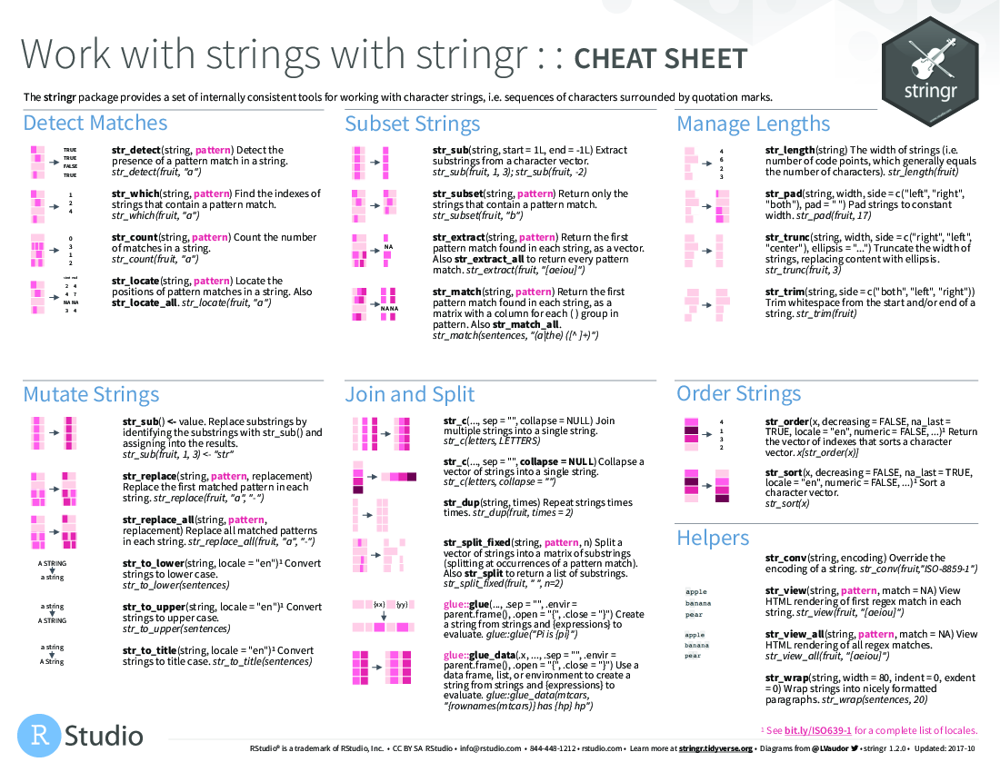

# Cheatsheets

This chapter contains a selection of useful cheatsheets. 

- For updates check here: [https://www.rstudio.com/resources/](https://www.rstudio.com/resources/)
- To download the pdf of a cheatsheet, just click on the link in the figure caption.

## Statistics 

(\#fig:cheatsheets-02)[Stats cheatsheet](figures/stats-help.jpg)

## R 

(\#fig:cheatsheets-03)[Data wrangling in the tidyverse](figures/data-wrangling.pdf)

(\#fig:cheatsheets-04)[advancedr](figures/advancedr.pdf)

(\#fig:cheatsheets-05)[base-r](figures/base-r.pdf)

(\#fig:cheatsheets-06)[data-import](figures/data-import.pdf)

(\#fig:cheatsheets-07)[data-transformation](figures/data-transformation.pdf)

(\#fig:cheatsheets-08)[data-visualization](figures/data-visualization.pdf)

(\#fig:cheatsheets-09)[how-big-is-your-graph](figures/how-big-is-your-graph.pdf)

(\#fig:cheatsheets-10)[latexsheet](figures/latexsheet.pdf)

(\#fig:cheatsheets-11)[leaflet](figures/leaflet.pdf)

(\#fig:cheatsheets-12)[lubridate](figures/lubridate.pdf)

(\#fig:cheatsheets-13)[mosaic](figures/mosaic.pdf)

(\#fig:cheatsheets-14)[purrr](figures/purrr.pdf)

(\#fig:cheatsheets-15)[regexcheatsheet](figures/regexcheatsheet.pdf)

(\#fig:cheatsheets-16)[rmarkdown-reference](figures/rmarkdown-reference.pdf)

(\#fig:cheatsheets-17)[rmarkdown](figures/rmarkdown.pdf)

(\#fig:cheatsheets-18)[rstudio-ide](figures/rstudio-ide.pdf)

(\#fig:cheatsheets-19)[shiny](figures/shiny.pdf)

(\#fig:cheatsheets-20)[strings](figures/strings.pdf)

(\#fig:cheatsheets-21)[syntax](figures/syntax.pdf)

(\#fig:cheatsheets-22)[tidyeval](figures/tidyeval.pdf)

(\#fig:cheatsheets-23)[visualization principles](figures/visualization-principles.pdf)

